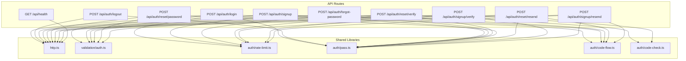
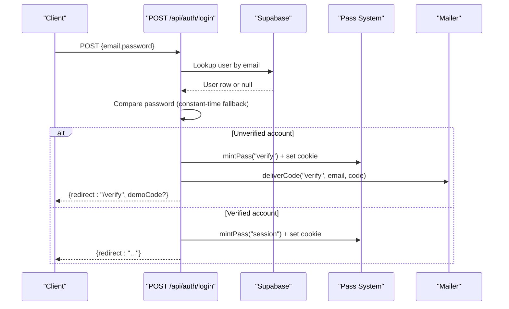
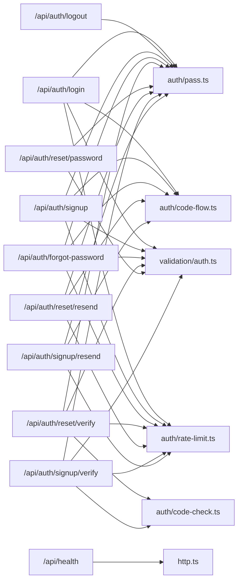

# API Reference

<cite>
**Referenced Files in This Document**
- [route.ts](file://app/api/auth/login/route.ts)
- [route.ts](file://app/api/auth/logout/route.ts)
- [route.ts](file://app/api/auth/signup/route.ts)
- [route.ts](file://app/api/auth/forgot-password/route.ts)
- [route.ts](file://app/api/auth/reset/password/route.ts)
- [route.ts](file://app/api/auth/reset/verify/route.ts)
- [route.ts](file://app/api/auth/signup/verify/route.ts)
- [route.ts](file://app/api/auth/reset/resend/route.ts)
- [route.ts](file://app/api/auth/signup/resend/route.ts)
- [route.ts](file://app/api/health/route.ts)
- [http.ts](file://lib/http.ts)
- [auth.ts](file://lib/validation/auth.ts)
- [rate-limit.ts](file://lib/auth/rate-limit.ts)
- [pass.ts](file://lib/auth/pass.ts)
- [code-flow.ts](file://lib/auth/code-flow.ts)
- [code-check.ts](file://lib/auth/code-check.ts)
</cite>

## Table of Contents
1. Introduction
2. Project Structure
3. Core Components
4. Architecture Overview
5. Detailed Component Analysis
6. Dependency Analysis
7. Performance Considerations
8. Troubleshooting Guide
9. Conclusion
10. Appendices

## Introduction
This document provides a comprehensive API reference for Agropioo’s RESTful endpoints, focusing on authentication and account management flows: login, logout, signup, forgot password, code verification, password reset, and health check. It specifies HTTP methods, URL patterns, request/response schemas, headers, status codes, error formats, rate limiting policies, security considerations, input validation rules, and client implementation guidance for JavaScript/TypeScript applications.

## Project Structure
The API is implemented as Next.js Route Handlers under app/api. Authentication endpoints are grouped by feature (auth, health). Shared utilities handle HTTP responses, validation schemas, rate limiting, pass/token handling, and code issuance/delivery.

**Diagram sources**
- [route.ts:1-112](file://app/api/auth/login/route.ts#L1-L112)
- [route.ts:1-31](file://app/api/auth/logout/route.ts#L1-L31)
- [route.ts:1-119](file://app/api/auth/signup/route.ts#L1-L119)
- [route.ts:1-82](file://app/api/auth/forgot-password/route.ts#L1-L82)
- [route.ts:1-84](file://app/api/auth/reset/password/route.ts#L1-L84)
- [route.ts:1-52](file://app/api/auth/reset/verify/route.ts#L1-L52)
- [route.ts:1-59](file://app/api/auth/signup/verify/route.ts#L1-L59)
- [route.ts:1-82](file://app/api/auth/reset/resend/route.ts#L1-L82)
- [route.ts:1-84](file://app/api/auth/signup/resend/route.ts#L1-L84)
- [route.ts:1-18](file://app/api/health/route.ts#L1-L18)
- [http.ts:1-61](file://lib/http.ts#L1-L61)
- [auth.ts:1-87](file://lib/validation/auth.ts#L1-L87)
- [rate-limit.ts:1-53](file://lib/auth/rate-limit.ts#L1-L53)
- [pass.ts:1-264](file://lib/auth/pass.ts#L1-L264)
- [code-flow.ts:1-52](file://lib/auth/code-flow.ts#L1-L52)
- [code-check.ts:1-126](file://lib/auth/code-check.ts#L1-L126)

**Section sources**
- [route.ts:1-112](file://app/api/auth/login/route.ts#L1-L112)
- [route.ts:1-31](file://app/api/auth/logout/route.ts#L1-L31)
- [route.ts:1-119](file://app/api/auth/signup/route.ts#L1-L119)
- [route.ts:1-82](file://app/api/auth/forgot-password/route.ts#L1-L82)
- [route.ts:1-84](file://app/api/auth/reset/password/route.ts#L1-L84)
- [route.ts:1-52](file://app/api/auth/reset/verify/route.ts#L1-L52)
- [route.ts:1-59](file://app/api/auth/signup/verify/route.ts#L1-L59)
- [route.ts:1-82](file://app/api/auth/reset/resend/route.ts#L1-L82)
- [route.ts:1-84](file://app/api/auth/signup/resend/route.ts#L1-L84)
- [route.ts:1-18](file://app/api/health/route.ts#L1-L18)
- [http.ts:1-61](file://lib/http.ts#L1-L61)
- [auth.ts:1-87](file://lib/validation/auth.ts#L1-L87)
- [rate-limit.ts:1-53](file://lib/auth/rate-limit.ts#L1-L53)
- [pass.ts:1-264](file://lib/auth/pass.ts#L1-L264)
- [code-flow.ts:1-52](file://lib/auth/code-flow.ts#L1-L52)
- [code-check.ts:1-126](file://lib/auth/code-check.ts#L1-L126)

## Core Components
- HTTP helpers: uniform success/error response shapes, JSON body parsing, IP extraction for rate limiting.
- Validation schemas: Zod-based schemas for login, signup, forgot password, code, and reset password inputs; email normalization and phone pattern enforcement.
- Rate limiter: fixed-window, dual-dimension (per-IP and per-email/pass) limits with predefined windows.
- Pass system: HS256 JWTs bound to server-side state rows (pass_states or sessions), with httpOnly cookies and strict validity checks.
- Code flow: last-code-wins issuance, hashing, TTL, and delivery via mailer; resend cooldowns.
- Code check gate: unified verification logic for verify/reset purposes with rate limits, pass validation, latest-code verdict, hash comparison, and wrong-entry accounting.

**Section sources**
- [http.ts:1-61](file://lib/http.ts#L1-L61)
- [auth.ts:1-87](file://lib/validation/auth.ts#L1-L87)
- [rate-limit.ts:1-53](file://lib/auth/rate-limit.ts#L1-L53)
- [pass.ts:1-264](file://lib/auth/pass.ts#L1-L264)
- [code-flow.ts:1-52](file://lib/auth/code-flow.ts#L1-L52)
- [code-check.ts:1-126](file://lib/auth/code-check.ts#L1-L126)

## Architecture Overview
Authentication endpoints orchestrate a consistent flow:
- Validate input using shared schemas.
- Enforce rate limits per IP and per identity/email/pass.
- For sensitive operations, require a valid pass cookie (verify/reset/session) and validate signature, type, expiry, and server-side row state.
- Issue or consume verification codes with last-code-wins semantics and short TTLs.
- Manage session lifecycle via signed passes stored in httpOnly cookies and backed by database rows.

**Diagram sources**
- [route.ts:1-112](file://app/api/auth/login/route.ts#L1-L112)
- [pass.ts:1-264](file://lib/auth/pass.ts#L1-L264)
- [code-flow.ts:1-52](file://lib/auth/code-flow.ts#L1-L52)

## Detailed Component Analysis

### Authentication Endpoints

#### POST /api/auth/login
- Purpose: Authenticate with email/password; issue session or verification pass.
- Request:
  - Content-Type: application/json
  - Body schema: email (normalized), password (min 1 char)
- Response:
  - 200 OK: { redirect: string } optionally with demoCode in development/demo flows
  - 401 Unauthorized: { error: { code: "unauthorized", message: string } }
  - 429 Too Many Requests: { error: { code: "rate_limited", message: string } }
  - 500 Server Error: { error: { code: "server_error", message: string } }
- Behavior:
  - Validates input, applies per-IP and per-email rate limits.
  - Compares password against stored hash; unknown emails use constant-time fallback.
  - If unverified, issues a verify pass and sends verification code; returns redirect to verification page.
  - If verified, issues a session pass (7-day cookie) and clears temporary passes.
- Headers:
  - Set-Cookie: HttpOnly, SameSite=Lax, Secure in production; names include agro_session/agro_verify based on outcome.

**Section sources**
- [route.ts:1-112](file://app/api/auth/login/route.ts#L1-L112)
- [auth.ts:1-87](file://lib/validation/auth.ts#L1-L87)
- [rate-limit.ts:1-53](file://lib/auth/rate-limit.ts#L1-L53)
- [pass.ts:1-264](file://lib/auth/pass.ts#L1-L264)

#### POST /api/auth/logout
- Purpose: Revoke current session and clear session cookie.
- Request: No body required.
- Response:
  - 200 OK: { ok: true }
  - 401 Unauthorized: { error: { code: "unauthorized", message: string } }
  - 500 Server Error: { error: { code: "server_error", message: string } }
- Behavior:
  - Requires a valid session pass cookie.
  - Marks the session row as revoked and clears the cookie.

**Section sources**
- [route.ts:1-31](file://app/api/auth/logout/route.ts#L1-L31)
- [pass.ts:1-264](file://lib/auth/pass.ts#L1-L264)

#### POST /api/auth/signup
- Purpose: Create a new account and start verification.
- Request:
  - Content-Type: application/json
  - Body schema: name (trimmed, 1–80 chars), email (normalized), phone (optional, validated), password (8–64 chars), confirmPassword (must match), terms (boolean true)
- Response:
  - 200 OK: { ok: true } optionally with demoCode
  - 400 Bad Request: { error: { code: "validation_error", message: string } }
  - 409 Conflict: { error: { code: "conflict_registered", message: string } } if verified email exists
  - 429 Too Many Requests: { error: { code: "rate_limited", message: string } }
  - 500 Server Error: { error: { code: "server_error", message: string } }
- Behavior:
  - Applies per-IP and per-email rate limits.
  - First-write-wins on duplicate unverified accounts; reuses existing unverified record.
  - Issues a verify pass and sends verification code.

**Section sources**
- [route.ts:1-119](file://app/api/auth/signup/route.ts#L1-L119)
- [auth.ts:1-87](file://lib/validation/auth.ts#L1-L87)
- [rate-limit.ts:1-53](file://lib/auth/rate-limit.ts#L1-L53)
- [pass.ts:1-264](file://lib/auth/pass.ts#L1-L264)

#### POST /api/auth/forgot-password
- Purpose: Start password recovery; always returns identical response shape regardless of email existence.
- Request:
  - Content-Type: application/json
  - Body schema: email (normalized)
- Response:
  - 200 OK: { ok: true } optionally with demoCode
  - 400 Bad Request: { error: { code: "validation_error", message: string } }
  - 429 Too Many Requests: { error: { code: "rate_limited", message: string } }
  - 500 Server Error: { error: { code: "server_error", message: string } }
- Behavior:
  - Applies per-IP and per-email rate limits.
  - Issues a reset pass cookie and, for known emails, generates and delivers a verification code.

**Section sources**
- [route.ts:1-82](file://app/api/auth/forgot-password/route.ts#L1-L82)
- [auth.ts:1-87](file://lib/validation/auth.ts#L1-L87)
- [rate-limit.ts:1-53](file://lib/auth/rate-limit.ts#L1-L53)
- [pass.ts:1-264](file://lib/auth/pass.ts#L1-L264)
- [code-flow.ts:1-52](file://lib/auth/code-flow.ts#L1-L52)

#### POST /api/auth/reset/verify
- Purpose: Verify the 6-digit code for password recovery.
- Request:
  - Content-Type: application/json
  - Body schema: code (exactly 6 digits)
  - Cookie: Valid reset pass (agro_reset)
- Response:
  - 200 OK: { ok: true }
  - 401 Unauthorized: { error: { code: "unauthorized", message: string } }
  - 429 Too Many Requests: { error: { code: "rate_limited", message: string } }
  - 500 Server Error: { error: { code: "server_error", message: string } }
- Behavior:
  - Enforces per-IP and per-pass rate limits.
  - Validates pass, ensures latest open code exists, compares hashed code, updates wrong-entry counters, consumes code, and upgrades pass stage to code_verified.

**Section sources**
- [route.ts:1-52](file://app/api/auth/reset/verify/route.ts#L1-L52)
- [code-check.ts:1-126](file://lib/auth/code-check.ts#L1-L126)
- [pass.ts:1-264](file://lib/auth/pass.ts#L1-L264)
- [auth.ts:1-87](file://lib/validation/auth.ts#L1-L87)
- [rate-limit.ts:1-53](file://lib/auth/rate-limit.ts#L1-L53)

#### POST /api/auth/reset/password
- Purpose: Set a new password after successful code verification.
- Request:
  - Content-Type: application/json
  - Body schema: password (8–64 chars), confirmPassword (must match)
  - Cookie: Valid reset pass with stage=code_verified and bound account_id
- Response:
  - 200 OK: { ok: true }
  - 401 Unauthorized: { error: { code: "unauthorized", message: string } }
  - 400 Bad Request: { error: { code: "validation_error", message: string } }
  - 500 Server Error: { error: { code: "server_error", message: string } }
- Behavior:
  - Hashes and stores new password, marks account verified, voids outstanding reset codes, consumes reset pass, and revokes all sessions for the account.

**Section sources**
- [route.ts:1-84](file://app/api/auth/reset/password/route.ts#L1-L84)
- [pass.ts:1-264](file://lib/auth/pass.ts#L1-L264)
- [auth.ts:1-87](file://lib/validation/auth.ts#L1-L87)

#### POST /api/auth/signup/verify
- Purpose: Verify the 6-digit code for new account registration.
- Request:
  - Content-Type: application/json
  - Body schema: code (exactly 6 digits)
  - Cookie: Valid verify pass (agro_verify)
- Response:
  - 200 OK: { ok: true }
  - 401 Unauthorized: { error: { code: "unauthorized", message: string } }
  - 429 Too Many Requests: { error: { code: "rate_limited", message: string } }
  - 500 Server Error: { error: { code: "server_error", message: string } }
- Behavior:
  - Enforces per-IP and per-pass rate limits.
  - Consumes code, marks account verified idempotently, consumes verify pass, and clears verify cookie.

**Section sources**
- [route.ts:1-59](file://app/api/auth/signup/verify/route.ts#L1-L59)
- [code-check.ts:1-126](file://lib/auth/code-check.ts#L1-L126)
- [pass.ts:1-264](file://lib/auth/pass.ts#L1-L264)
- [auth.ts:1-87](file://lib/validation/auth.ts#L1-L87)
- [rate-limit.ts:1-53](file://lib/auth/rate-limit.ts#L1-L53)

#### POST /api/auth/reset/resend
- Purpose: Resend a verification code for password recovery.
- Request: No body; requires valid reset pass.
- Response:
  - 200 OK: { ok: true } optionally with demoCode
  - 401 Unauthorized: { error: { code: "unauthorized", message: string } }
  - 429 Too Many Requests: { error: { code: "rate_limited", message: string } }
  - 500 Server Error: { error: { code: "server_error", message: string } }
- Behavior:
  - Requires valid reset pass; enforces per-pass resend limit and 60-second cooldown against newest code.
  - Issues a new code and delivers it; unknown emails return neutral success without sending.

**Section sources**
- [route.ts:1-82](file://app/api/auth/reset/resend/route.ts#L1-L82)
- [pass.ts:1-264](file://lib/auth/pass.ts#L1-L264)
- [code-flow.ts:1-52](file://lib/auth/code-flow.ts#L1-L52)
- [rate-limit.ts:1-53](file://lib/auth/rate-limit.ts#L1-L53)

#### POST /api/auth/signup/resend
- Purpose: Resend a verification code for new account registration.
- Request: No body; requires valid verify pass.
- Response:
  - 200 OK: { ok: true } optionally with demoCode
  - 401 Unauthorized: { error: { code: "unauthorized", message: string } }
  - 429 Too Many Requests: { error: { code: "rate_limited", message: string } }
  - 500 Server Error: { error: { code: "server_error", message: string } }
- Behavior:
  - Requires valid verify pass; enforces per-pass resend limit and 60-second cooldown against newest code.
  - Issues a new code and delivers it; unknown emails return neutral success without sending.

**Section sources**
- [route.ts:1-84](file://app/api/auth/signup/resend/route.ts#L1-L84)
- [pass.ts:1-264](file://lib/auth/pass.ts#L1-L264)
- [code-flow.ts:1-52](file://lib/auth/code-flow.ts#L1-L52)
- [rate-limit.ts:1-53](file://lib/auth/rate-limit.ts#L1-L53)

#### GET /api/health
- Purpose: Service health probe.
- Request: None.
- Response:
  - 200 OK: { status: "ok", database: "connected" }
  - 500 Internal Server Error: { status: "error", message: string }
- Behavior:
  - Attempts a minimal database read to confirm connectivity.

**Section sources**
- [route.ts:1-18](file://app/api/health/route.ts#L1-L18)

### Error Handling Patterns
- All errors follow a uniform shape: { error: { code, message } } with appropriate HTTP status codes.
- Common error codes:
  - validation_error: 400
  - unauthorized: 401
  - conflict_registered: 409
  - rate_limited: 429
  - server_error: 500
- Success responses are typed per endpoint (e.g., { ok: true }, { redirect: string }).

**Section sources**
- [http.ts:1-61](file://lib/http.ts#L1-L61)

### Rate Limiting Policies
- Dual-dimension limits:
  - Per-IP and per-email for signup/login/forgot-password.
  - Per-pass for code verification and resends.
- Windows and limits:
  - Signup: 5/h per IP and per email.
  - Login: 10/15min per IP and 8/15min per email.
  - Forgot password: 3/h per IP and per email.
  - Resend: 5/h per pass with 60-second server-side cooldown between resends.
  - Code checks: 20/h per IP and 30/h per pass.
- Implementation uses an in-process Map; suitable for single-instance deployments.

**Section sources**
- [rate-limit.ts:1-53](file://lib/auth/rate-limit.ts#L1-L53)

### Security Considerations
- Passwords are hashed with bcrypt before storage.
- Verification codes are stored as SHA-256 hashes; plaintext only exists in memory and outgoing email.
- Passes are HS256-signed JWTs bound to server-side state rows; invalid/expired/tampered tokens are rejected uniformly.
- Cookies are httpOnly, SameSite=Lax, and secure in production.
- Constant-time fallback prevents timing leaks for unknown emails during login.
- Wrong attempt tracking deadens codes and passes after repeated failures.

**Section sources**
- [pass.ts:1-264](file://lib/auth/pass.ts#L1-L264)
- [code-flow.ts:1-52](file://lib/auth/code-flow.ts#L1-L52)
- [code-check.ts:1-126](file://lib/auth/code-check.ts#L1-L126)
- [route.ts:1-112](file://app/api/auth/login/route.ts#L1-L112)

### Input Validation Rules
- Email: trimmed and lowercased; must be a valid email format.
- Password: 8–64 characters; confirmation fields must match where applicable.
- Phone: optional; if provided, must match a strict international-like pattern.
- Terms: boolean true required for signup.
- Codes: exactly 6 numeric digits.

**Section sources**
- [auth.ts:1-87](file://lib/validation/auth.ts#L1-L87)

## Dependency Analysis
Endpoints depend on shared libraries for consistent behavior:
- HTTP helpers centralize response formatting and body parsing.
- Validation schemas ensure consistent input constraints across routes.
- Rate limiter protects endpoints from abuse.
- Pass system secures sensitive flows with signed tokens and server-side state.
- Code flow standardizes issuance and delivery of verification codes.
- Code check gate unifies verification logic for verify/reset purposes.

**Diagram sources**
- [route.ts:1-112](file://app/api/auth/login/route.ts#L1-L112)
- [route.ts:1-31](file://app/api/auth/logout/route.ts#L1-L31)
- [route.ts:1-119](file://app/api/auth/signup/route.ts#L1-L119)
- [route.ts:1-82](file://app/api/auth/forgot-password/route.ts#L1-L82)
- [route.ts:1-84](file://app/api/auth/reset/password/route.ts#L1-L84)
- [route.ts:1-52](file://app/api/auth/reset/verify/route.ts#L1-L52)
- [route.ts:1-59](file://app/api/auth/signup/verify/route.ts#L1-L59)
- [route.ts:1-82](file://app/api/auth/reset/resend/route.ts#L1-L82)
- [route.ts:1-84](file://app/api/auth/signup/resend/route.ts#L1-L84)
- [route.ts:1-18](file://app/api/health/route.ts#L1-L18)
- [http.ts:1-61](file://lib/http.ts#L1-L61)
- [auth.ts:1-87](file://lib/validation/auth.ts#L1-L87)
- [rate-limit.ts:1-53](file://lib/auth/rate-limit.ts#L1-L53)
- [pass.ts:1-264](file://lib/auth/pass.ts#L1-L264)
- [code-flow.ts:1-52](file://lib/auth/code-flow.ts#L1-L52)
- [code-check.ts:1-126](file://lib/auth/code-check.ts#L1-L126)

**Section sources**
- [http.ts:1-61](file://lib/http.ts#L1-L61)
- [auth.ts:1-87](file://lib/validation/auth.ts#L1-L87)
- [rate-limit.ts:1-53](file://lib/auth/rate-limit.ts#L1-L53)
- [pass.ts:1-264](file://lib/auth/pass.ts#L1-L264)
- [code-flow.ts:1-52](file://lib/auth/code-flow.ts#L1-L52)
- [code-check.ts:1-126](file://lib/auth/code-check.ts#L1-L126)

## Performance Considerations
- Constant-time password comparison fallback avoids timing side-channels for unknown emails.
- In-memory rate limiter is efficient for single-instance deployments; consider Redis for multi-instance scaling.
- Minimal database queries per endpoint reduce latency; health check uses a lightweight select.
- Last-code-wins issuance reduces redundant code lookups and ensures only one active code per purpose/email.

[No sources needed since this section provides general guidance]

## Troubleshooting Guide
- Validation errors: Check request payload against schemas; ensure email normalization and password matching.
- Rate limiting: If receiving 429, back off and retry after the window; avoid rapid retries.
- Unauthorized: Ensure required cookies (verify/reset/session) are present and not expired; verify pass stage requirements.
- Code rejected: Ensure you are submitting the latest code; previous codes are voided when a new code is issued.
- Server errors: Inspect logs for stack traces; these indicate unexpected failures in database or token operations.

**Section sources**
- [http.ts:1-61](file://lib/http.ts#L1-L61)
- [code-check.ts:1-126](file://lib/auth/code-check.ts#L1-L126)
- [pass.ts:1-264](file://lib/auth/pass.ts#L1-L264)

## Conclusion
Agropioo’s authentication API provides a robust, secure, and consistent set of endpoints for user onboarding, verification, and session management. It enforces strong input validation, rate limiting, and secure token handling while maintaining predictable error responses and safe defaults for unknown entities. Clients should implement resilient error handling, respect rate limits, and manage cookies appropriately for seamless user experiences.

[No sources needed since this section summarizes without analyzing specific files]

## Appendices

### Client Implementation Guidelines (JavaScript/TypeScript)
- Base URL: Use your deployment base path; all endpoints are relative to /api.
- Headers:
  - Send Content-Type: application/json for JSON endpoints.
  - Do not manually set Authorization; authentication is handled via httpOnly cookies managed by the browser and server.
- Cookies:
  - The server sets httpOnly cookies (agro_session, agro_verify, agro_reset); do not attempt to read them from client code.
  - Ensure your frontend runs on the same origin or configure CORS/proxy correctly so cookies are included.
- Example flows:
  - Login: POST /api/auth/login with { email, password }; on success, navigate to returned redirect.
  - Signup: POST /api/auth/signup with full form data; on success, proceed to verification.
  - Verification: POST /api/auth/{signup|reset}/verify with { code } and required pass cookie.
  - Resend: POST /api/auth/{signup|reset}/resend with required pass cookie; handle cooldowns.
  - Reset password: After verification, POST /api/auth/reset/password with new password.
  - Logout: POST /api/auth/logout to revoke session.
  - Health: GET /api/health to probe service status.
- Error handling:
  - Parse { error: { code, message } } for non-2xx responses.
  - Implement exponential backoff for 429 responses.
  - On 401, guide users to re-authenticate or restart flows.
- Retry mechanisms:
  - For transient network errors, retry up to a small number of times with jitter.
  - Do not retry idempotent operations excessively; respect rate limits.

[No sources needed since this section provides general guidance]

### API Versioning Strategy and Backwards Compatibility
- Current versioning: Not explicitly versioned in URLs; endpoints reside under /api.
- Recommended evolution:
  - Introduce a version prefix (e.g., /api/v1) when breaking changes are necessary.
  - Maintain deprecation notices and parallel versions during transition periods.
  - Keep response shapes stable; add optional fields rather than removing or renaming existing ones.
  - Preserve error code taxonomy; introduce new codes only when necessary and document them.
- Backwards compatibility:
  - Avoid removing required fields from request bodies.
  - Continue supporting legacy behaviors until clients migrate.
  - Monitor usage metrics to plan deprecation timelines.

[No sources needed since this section provides general guidance]