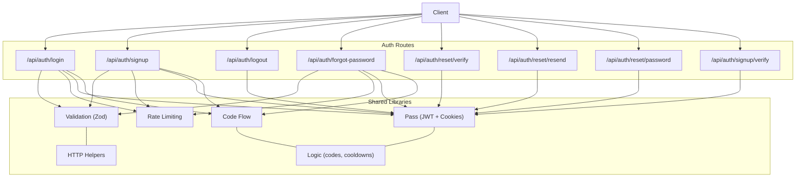
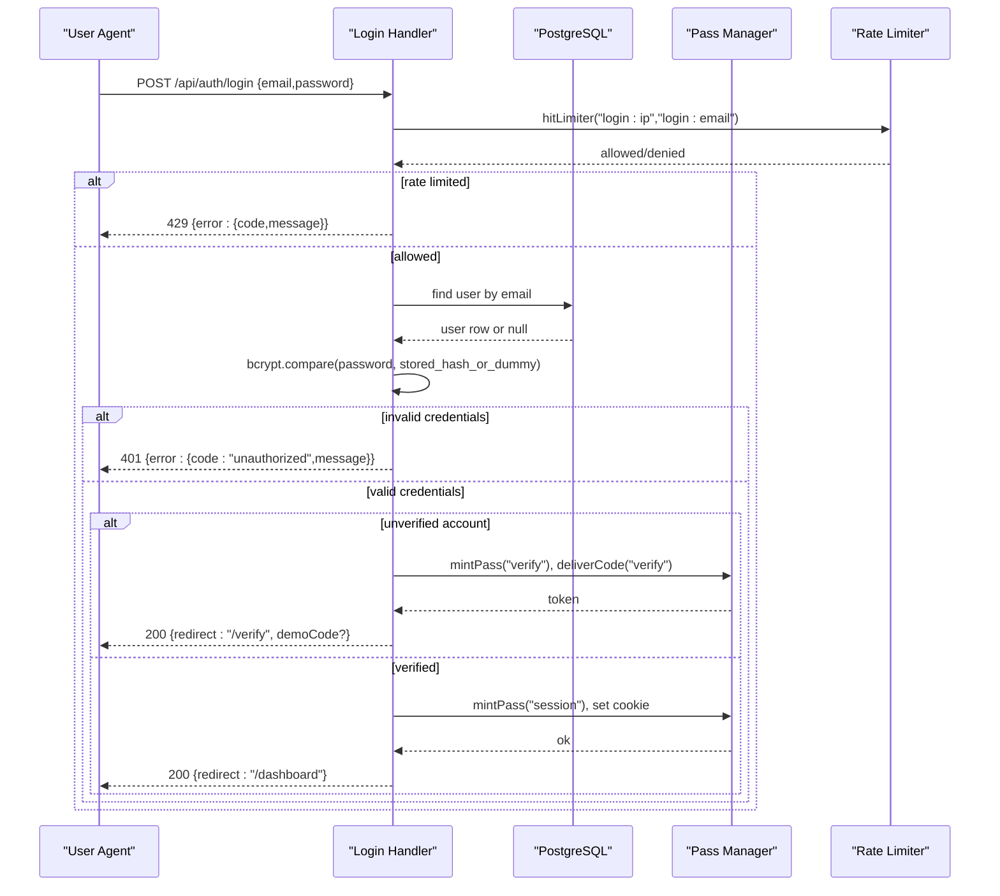
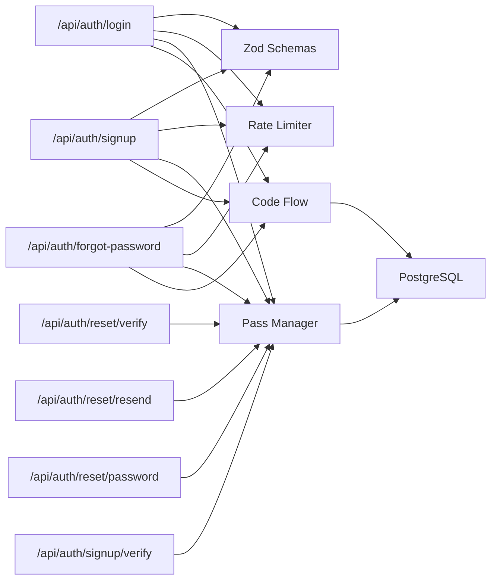

# Authentication Endpoints

<cite>
**Referenced Files in This Document**
- [route.ts](file://app/api/auth/login/route.ts)
- [route.ts](file://app/api/auth/signup/route.ts)
- [route.ts](file://app/api/auth/logout/route.ts)
- [route.ts](file://app/api/auth/forgot-password/route.ts)
- [route.ts](file://app/api/auth/reset/password/route.ts)
- [route.ts](file://app/api/auth/reset/verify/route.ts)
- [route.ts](file://app/api/auth/reset/resend/route.ts)
- [route.ts](file://app/api/auth/signup/verify/route.ts)
- [auth.ts](file://lib/validation/auth.ts)
- [pass.ts](file://lib/auth/pass.ts)
- [rate-limit.ts](file://lib/auth/rate-limit.ts)
- [code-flow.ts](file://lib/auth/code-flow.ts)
- [logic.ts](file://lib/auth/logic.ts)
- [http.ts](file://lib/http.ts)
- [copy.ts](file://lib/auth/copy.ts)
- [spec.md](file://specs/authentication/spec.md)
</cite>

## Table of Contents
1. Introduction
2. Project Structure
3. Core Components
4. Architecture Overview
5. Detailed Component Analysis
6. Dependency Analysis
7. Performance Considerations
8. Troubleshooting Guide
9. Conclusion

## Introduction
This document provides comprehensive API documentation for Agropioo’s authentication endpoints. It covers:
- Login (POST /api/auth/login): password-only sign-in, email verification gating, JWT session pass issuance, and rate limiting.
- Logout (POST /api/auth/logout): server-side session revocation and cookie clearing.
- Signup (POST /api/auth/signup): user registration with bcrypt hashing, duplicate handling, and email verification initiation.
- Forgot Password (POST /api/auth/forgot-password): recovery step 1 with reset pass issuance and optional code delivery.
- Reset flow helpers: verify and resend for both signup and reset, and the final set-new-password endpoint.

Security highlights include bcrypt password hashing, HS256-signed JWT passes stored in httpOnly cookies, dual-dimension rate limiting (per IP and per email/account), and strict input validation via Zod schemas.

## Project Structure
Authentication is implemented as Next.js Route Handlers under app/api/auth, with shared libraries for validation, pass management, rate limiting, code issuance, and HTTP utilities.

**Diagram sources**
- [route.ts:1-112](file://app/api/auth/login/route.ts#L1-L112)
- [route.ts:1-119](file://app/api/auth/signup/route.ts#L1-L119)
- [route.ts:1-31](file://app/api/auth/logout/route.ts#L1-L31)
- [route.ts:1-82](file://app/api/auth/forgot-password/route.ts#L1-L82)
- [route.ts:1-84](file://app/api/auth/reset/password/route.ts#L1-L84)
- [route.ts:1-52](file://app/api/auth/reset/verify/route.ts#L1-L52)
- [route.ts:1-82](file://app/api/auth/reset/resend/route.ts#L1-L82)
- [route.ts:1-59](file://app/api/auth/signup/verify/route.ts#L1-L59)
- [auth.ts:1-87](file://lib/validation/auth.ts#L1-L87)
- [pass.ts:1-264](file://lib/auth/pass.ts#L1-L264)
- [rate-limit.ts:1-53](file://lib/auth/rate-limit.ts#L1-L53)
- [code-flow.ts:1-52](file://lib/auth/code-flow.ts#L1-L52)
- [logic.ts:1-127](file://lib/auth/logic.ts#L1-L127)
- [http.ts:1-61](file://lib/http.ts#L1-L61)

**Section sources**
- [route.ts:1-112](file://app/api/auth/login/route.ts#L1-L112)
- [route.ts:1-119](file://app/api/auth/signup/route.ts#L1-L119)
- [route.ts:1-31](file://app/api/auth/logout/route.ts#L1-L31)
- [route.ts:1-82](file://app/api/auth/forgot-password/route.ts#L1-L82)
- [auth.ts:1-87](file://lib/validation/auth.ts#L1-L87)
- [pass.ts:1-264](file://lib/auth/pass.ts#L1-L264)
- [rate-limit.ts:1-53](file://lib/auth/rate-limit.ts#L1-L53)
- [code-flow.ts:1-52](file://lib/auth/code-flow.ts#L1-L52)
- [logic.ts:1-127](file://lib/auth/logic.ts#L1-L127)
- [http.ts:1-61](file://lib/http.ts#L1-L61)

## Core Components
- Validation layer: Centralized Zod schemas normalize emails, enforce password rules, phone format, and confirm-password matching.
- Pass system: HS256-signed JWTs carried in httpOnly cookies; three kinds—verify, reset, session—with distinct TTLs and state tracking in Postgres.
- Rate limiting: In-process fixed-window limiter with per-IP and per-email/account dimensions to prevent brute force and enumeration.
- Code flow: Issues time-bounded 6-digit codes, stores hashed values, enforces last-code-wins, and supports resend cooldowns.
- HTTP helpers: Uniform error shape and JSON responses; safe body parsing and client IP extraction for rate limiting.

**Section sources**
- [auth.ts:1-87](file://lib/validation/auth.ts#L1-L87)
- [pass.ts:1-264](file://lib/auth/pass.ts#L1-L264)
- [rate-limit.ts:1-53](file://lib/auth/rate-limit.ts#L1-L53)
- [code-flow.ts:1-52](file://lib/auth/code-flow.ts#L1-L52)
- [http.ts:1-61](file://lib/http.ts#L1-L61)

## Architecture Overview
The authentication architecture uses a layered approach:
- Route handlers validate inputs, apply rate limits, interact with the database, manage passes, and return standardized responses.
- Passes are signed JWTs with server-side state rows that determine validity (consumed/dead/expired).
- Codes are hashed and short-lived; resend issues a new code and voids previous ones.
- Sessions are independent per device and revocable at logout or on password reset.

**Diagram sources**
- [route.ts:1-112](file://app/api/auth/login/route.ts#L1-L112)
- [pass.ts:1-264](file://lib/auth/pass.ts#L1-L264)
- [rate-limit.ts:1-53](file://lib/auth/rate-limit.ts#L1-L53)
- [code-flow.ts:1-52](file://lib/auth/code-flow.ts#L1-L52)

## Detailed Component Analysis

### POST /api/auth/login
Purpose: Password-only sign-in. Returns a redirect or verification gate; issues a session pass for verified accounts.

Request
- Method: POST
- Path: /api/auth/login
- Headers: Content-Type: application/json
- Body schema (Zod):
  - email: normalized string (trimmed, lowercase, valid email)
  - password: non-empty string

Response
- Success (verified): 200 OK
  - Body: { redirect: "/dashboard" }
- Verification required (unverified but valid credentials): 200 OK
  - Body: { redirect: "/verify" }, optionally { demoCode: string } when SMTP is unconfigured and demo mode is enabled
- Error responses:
  - 400 Bad Request: { error: { code: "validation_error", message } }
  - 401 Unauthorized: { error: { code: "unauthorized", message: "Invalid email or password." } }
  - 429 Too Many Requests: { error: { code: "rate_limited", message: "Too many attempts — please try again later." } }
  - 500 Internal Server Error: { error: { code: "server_error", message: "Something went wrong on our side. Please try again." } }

Behavior notes
- Unknown emails still perform a bcrypt comparison against a dummy hash to avoid timing leaks.
- Unverified accounts receive a fresh verify pass and verification code; session pass is not issued until verification completes.
- Rate limiting applies per IP and per email within configured windows.

Security considerations
- Passwords compared using bcryptjs.
- Session pass is an HS256-signed JWT stored in an httpOnly cookie with a 7-day TTL.
- No sensitive data in logs or errors.

**Section sources**
- [route.ts:1-112](file://app/api/auth/login/route.ts#L1-L112)
- [auth.ts:54-57](file://lib/validation/auth.ts#L54-L57)
- [rate-limit.ts:15-25](file://lib/auth/rate-limit.ts#L15-L25)
- [pass.ts:23-28](file://lib/auth/pass.ts#L23-L28)
- [copy.ts:4-15](file://lib/auth/copy.ts#L4-L15)

### POST /api/auth/logout
Purpose: Revoke the current session and clear the session cookie.

Request
- Method: POST
- Path: /api/auth/logout
- Headers: None required (session validated via cookie)

Response
- Success: 200 OK
  - Body: { ok: true }
- Error responses:
  - 401 Unauthorized: { error: { code: "unauthorized", message: "This request isn’t allowed." } }
  - 500 Internal Server Error: { error: { code: "server_error", message: "Something went wrong on our side. Please try again." } }

Behavior notes
- Marks the session row as revoked so a copied cookie becomes useless.
- Clears only the current session cookie; other devices remain unaffected.

**Section sources**
- [route.ts:1-31](file://app/api/auth/logout/route.ts#L1-L31)
- [pass.ts:196-232](file://lib/auth/pass.ts#L196-L232)
- [copy.ts:4-15](file://lib/auth/copy.ts#L4-L15)

### POST /api/auth/signup
Purpose: Create a new account, hash the password, and initiate email verification.

Request
- Method: POST
- Path: /api/auth/signup
- Headers: Content-Type: application/json
- Body schema (Zod):
  - name: trimmed string, 1–80 characters
  - email: normalized email
  - phone: optional, trimmed, matches phone pattern or null
  - password: 8–64 characters
  - confirmPassword: must match password
  - terms: boolean, must be true

Response
- Success: 200 OK
  - Body: { ok: true }, optionally { demoCode: string } when SMTP is unconfigured and demo mode is enabled
- Conflict: 409 Conflict
  - Body: { error: { code: "conflict_registered", message: "This email is already registered. Sign in instead or reset your password." } }
- Error responses:
  - 400 Bad Request: { error: { code: "validation_error", message } }
  - 429 Too Many Requests: { error: { code: "rate_limited", message: "Too many attempts — please try again later." } }
  - 500 Internal Server Error: { error: { code: "server_error", message: "Something went wrong on our side. Please try again." } }

Behavior notes
- Duplicate VERIFIED email returns 409.
- Duplicate UNVERIFIED email re-runs verification without overwriting original data (first-write-wins).
- Issues a verify pass and sends a verification code.

Security considerations
- Passwords are hashed with bcrypt before storage.
- Rate limiting applies per IP and per email.

**Section sources**
- [route.ts:1-119](file://app/api/auth/signup/route.ts#L1-L119)
- [auth.ts:20-50](file://lib/validation/auth.ts#L20-L50)
- [rate-limit.ts:15-25](file://lib/auth/rate-limit.ts#L15-L25)
- [copy.ts:4-15](file://lib/auth/copy.ts#L4-L15)

### POST /api/auth/forgot-password
Purpose: Start password recovery; issue a reset pass and optionally send a verification code.

Request
- Method: POST
- Path: /api/auth/forgot-password
- Headers: Content-Type: application/json
- Body schema (Zod):
  - email: normalized email

Response
- Success: 200 OK
  - Body: { ok: true }, optionally { demoCode: string } when SMTP is unconfigured and demo mode is enabled
- Error responses:
  - 400 Bad Request: { error: { code: "validation_error", message } }
  - 429 Too Many Requests: { error: { code: "rate_limited", message: "Too many attempts — please try again later." } }
  - 500 Internal Server Error: { error: { code: "server_error", message: "Something went wrong on our side. Please try again." } }

Behavior notes
- Identical response for known and unknown emails to prevent enumeration.
- A reset pass is always issued; a code is sent only if the account exists.

Security considerations
- Rate limiting applies per IP and per email.
- Reset pass carries only the submitted email and expires after 1 hour.

**Section sources**
- [route.ts:1-82](file://app/api/auth/forgot-password/route.ts#L1-L82)
- [auth.ts:61-65](file://lib/validation/auth.ts#L61-L65)
- [rate-limit.ts:15-25](file://lib/auth/rate-limit.ts#L15-L25)
- [pass.ts:23-28](file://lib/auth/pass.ts#L23-L28)

### POST /api/auth/reset/verify
Purpose: Verify the 6-digit code associated with a reset pass. On success, consumes the code and upgrades the pass to “code_verified”.

Request
- Method: POST
- Path: /api/auth/reset/verify
- Headers: Cookie containing reset pass
- Body schema (Zod):
  - code: exactly six digits

Response
- Success: 200 OK
  - Body: { ok: true }
- Error responses:
  - 401 Unauthorized: { error: { code: "unauthorized", message: "This request isn’t allowed." } }
  - 401 Unauthorized (invalid code): { error: { code: "unauthorized", message: "That code didn’t work. Check the latest email and try again." } }
  - 500 Internal Server Error: { error: { code: "server_error", message: "Something went wrong on our side. Please try again." } }

Behavior notes
- Requires a live reset pass.
- Consumes the code and marks the pass stage as “code_verified”.

**Section sources**
- [route.ts:1-52](file://app/api/auth/reset/verify/route.ts#L1-L52)
- [auth.ts:67-72](file://lib/validation/auth.ts#L67-L72)
- [logic.ts:52-69](file://lib/auth/logic.ts#L52-L69)
- [copy.ts:4-15](file://lib/auth/copy.ts#L4-L15)

### POST /api/auth/reset/resend
Purpose: Resend a reset code while respecting cooldown and attempt limits.

Request
- Method: POST
- Path: /api/auth/reset/resend
- Headers: Cookie containing reset pass

Response
- Success: 200 OK
  - Body: { ok: true }, optionally { demoCode: string } when SMTP is unconfigured and demo mode is enabled
- Error responses:
  - 401 Unauthorized: { error: { code: "unauthorized", message: "This request isn’t allowed." } }
  - 429 Too Many Requests: { error: { code: "rate_limited", message: "Too many attempts — please try again later." } }
  - 500 Internal Server Error: { error: { code: "server_error", message: "Something went wrong on our side. Please try again." } }

Behavior notes
- Enforces a 60-second server-side cooldown between resends.
- Caps cumulative wrong entries per pass; exceeding kills the pass.

**Section sources**
- [route.ts:1-82](file://app/api/auth/reset/resend/route.ts#L1-L82)
- [logic.ts:95-105](file://lib/auth/logic.ts#L95-L105)
- [copy.ts:4-15](file://lib/auth/copy.ts#L4-L15)

### POST /api/auth/reset/password
Purpose: Set a new password gated by a reset-verified pass. Updates user record, voids outstanding reset codes/passes, and kills all sessions.

Request
- Method: POST
- Path: /api/auth/reset/password
- Headers: Cookie containing reset pass
- Body schema (Zod):
  - password: 8–64 characters
  - confirmPassword: must match password

Response
- Success: 200 OK
  - Body: { ok: true }
- Error responses:
  - 400 Bad Request: { error: { code: "validation_error", message } }
  - 401 Unauthorized: { error: { code: "unauthorized", message: "This request isn’t allowed." } }
  - 500 Internal Server Error: { error: { code: "server_error", message: "Something went wrong on our side. Please try again." } }

Behavior notes
- Stores only the new bcrypt hash.
- Marks unverified accounts as verified.
- Kills all existing sessions for the account.

**Section sources**
- [route.ts:1-84](file://app/api/auth/reset/password/route.ts#L1-L84)
- [auth.ts:76-84](file://lib/validation/auth.ts#L76-L84)
- [copy.ts:4-15](file://lib/auth/copy.ts#L4-L15)

### POST /api/auth/signup/verify
Purpose: Verify the 6-digit code associated with a signup verify pass. On success, consumes code and pass and marks the account verified.

Request
- Method: POST
- Path: /api/auth/signup/verify
- Headers: Cookie containing verify pass
- Body schema (Zod):
  - code: exactly six digits

Response
- Success: 200 OK
  - Body: { ok: true }
- Error responses:
  - 401 Unauthorized: { error: { code: "unauthorized", message: "This request isn’t allowed." } }
  - 401 Unauthorized (invalid code): { error: { code: "unauthorized", message: "That code didn’t work. Check the latest email and try again." } }
  - 500 Internal Server Error: { error: { code: "server_error", message: "Something went wrong on our side. Please try again." } }

Behavior notes
- Idempotent verification; concurrent submissions resolve safely.
- Clears verify pass cookie upon completion.

**Section sources**
- [route.ts:1-59](file://app/api/auth/signup/verify/route.ts#L1-L59)
- [auth.ts:67-72](file://lib/validation/auth.ts#L67-L72)
- [copy.ts:4-15](file://lib/auth/copy.ts#L4-L15)

## Dependency Analysis
Key dependencies among components:
- Route handlers depend on:
  - Validation schemas (Zod) for input normalization and constraints.
  - Rate limiter for per-IP and per-email throttling.
  - Pass manager for issuing, validating, and storing JWT-based passes.
  - Code flow for generating, storing, and delivering verification codes.
  - HTTP helpers for consistent error shapes and body parsing.

**Diagram sources**
- [route.ts:1-112](file://app/api/auth/login/route.ts#L1-L112)
- [route.ts:1-119](file://app/api/auth/signup/route.ts#L1-L119)
- [route.ts:1-82](file://app/api/auth/forgot-password/route.ts#L1-L82)
- [route.ts:1-52](file://app/api/auth/reset/verify/route.ts#L1-L52)
- [route.ts:1-82](file://app/api/auth/reset/resend/route.ts#L1-L82)
- [route.ts:1-84](file://app/api/auth/reset/password/route.ts#L1-L84)
- [route.ts:1-59](file://app/api/auth/signup/verify/route.ts#L1-L59)
- [auth.ts:1-87](file://lib/validation/auth.ts#L1-L87)
- [pass.ts:1-264](file://lib/auth/pass.ts#L1-L264)
- [rate-limit.ts:1-53](file://lib/auth/rate-limit.ts#L1-L53)
- [code-flow.ts:1-52](file://lib/auth/code-flow.ts#L1-L52)

**Section sources**
- [route.ts:1-112](file://app/api/auth/login/route.ts#L1-L112)
- [route.ts:1-119](file://app/api/auth/signup/route.ts#L1-L119)
- [route.ts:1-82](file://app/api/auth/forgot-password/route.ts#L1-L82)
- [auth.ts:1-87](file://lib/validation/auth.ts#L1-L87)
- [pass.ts:1-264](file://lib/auth/pass.ts#L1-L264)
- [rate-limit.ts:1-53](file://lib/auth/rate-limit.ts#L1-L53)
- [code-flow.ts:1-52](file://lib/auth/code-flow.ts#L1-L52)

## Performance Considerations
- Bcrypt cost factor balances security and latency; ensure it remains appropriate for deployment scale.
- In-process rate limiter is simple and suitable for single-instance demos; consider Redis-backed implementation for multi-instance deployments.
- Dummy bcrypt comparison for unknown emails avoids timing side channels without adding significant overhead.
- Last-code-wins ensures only one active code per purpose/email, reducing verification complexity.

[No sources needed since this section provides general guidance]

## Troubleshooting Guide
Common issues and resolutions:
- Validation errors: Ensure payloads conform to Zod schemas; check field-level messages from the standard error shape.
- Rate limiting: If receiving 429, wait for the window to expire; reduce request frequency.
- Invalid or expired passes: Ensure cookies are present and not tampered; verify pass type matches the endpoint.
- Code rejected: Confirm you are using the latest code; resend after cooldown if necessary.
- Email delivery failures: Use resend; in demo mode, a banner may reveal the code when SMTP is unconfigured.

Error response shape
- All errors follow: { error: { code, message } } with appropriate HTTP status codes.

**Section sources**
- [http.ts:1-61](file://lib/http.ts#L1-L61)
- [copy.ts:4-15](file://lib/auth/copy.ts#L4-L15)
- [rate-limit.ts:15-25](file://lib/auth/rate-limit.ts#L15-L25)
- [logic.ts:52-69](file://lib/auth/logic.ts#L52-L69)

## Conclusion
Agropioo’s authentication endpoints implement a secure, robust flow centered around:
- Strict input validation with Zod
- Secure password hashing with bcrypt
- Signed JWT passes in httpOnly cookies with server-side state enforcement
- Dual-dimension rate limiting to mitigate brute-force and enumeration
- Clear, consistent error responses and predictable flows for login, signup, forgot-password, and reset

This design ensures safety, usability, and maintainability across mobile-first experiences.

[No sources needed since this section summarizes without analyzing specific files]