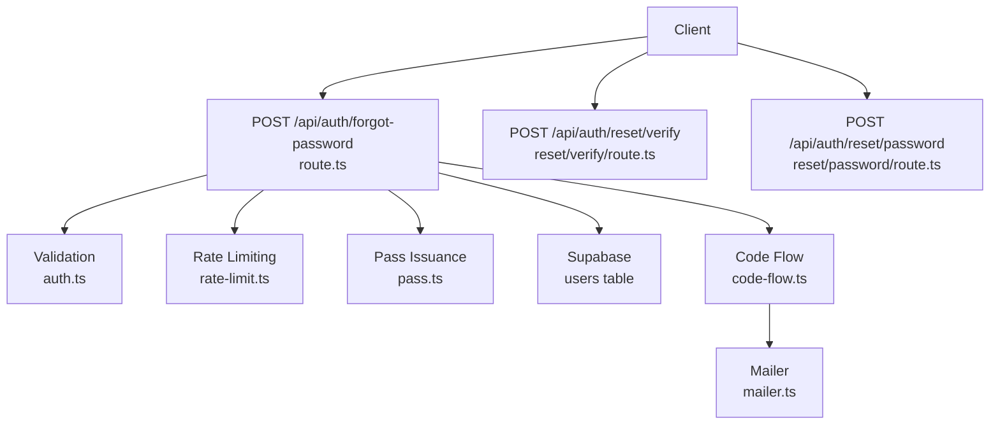
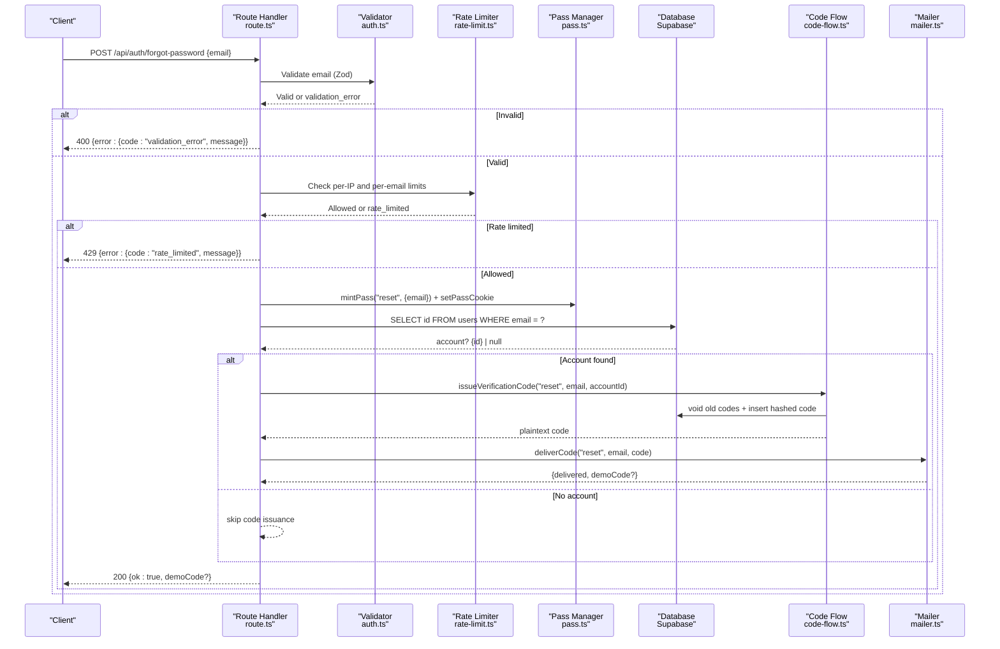
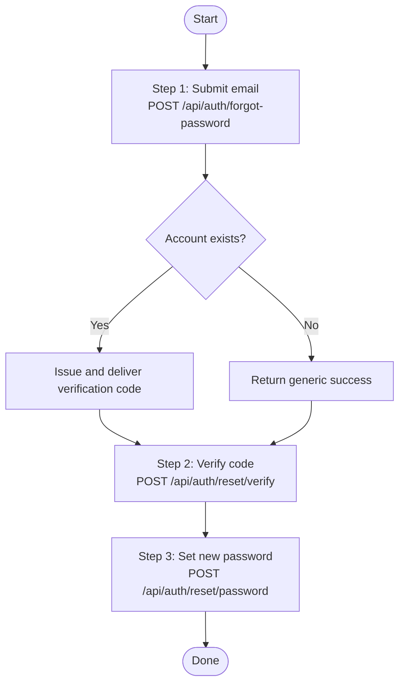
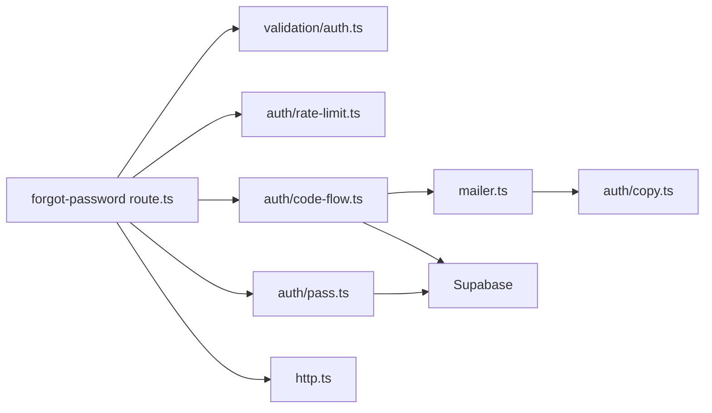

# Forgot Password Endpoint

<cite>
**Referenced Files in This Document**
- [route.ts](file://app/api/auth/forgot-password/route.ts)
- [code-flow.ts](file://lib/auth/code-flow.ts)
- [pass.ts](file://lib/auth/pass.ts)
- [rate-limit.ts](file://lib/auth/rate-limit.ts)
- [http.ts](file://lib/http.ts)
- [auth.ts](file://lib/validation/auth.ts)
- [mailer.ts](file://lib/mailer.ts)
- [copy.ts](file://lib/auth/copy.ts)
- [reset/password/route.ts](file://app/api/auth/reset/password/route.ts)
- [reset/verify/route.ts](file://app/api/auth/reset/verify/route.ts)
- [reset/resend/route.ts](file://app/api/auth/reset/resend/route.ts)
- [spec.md](file://specs/forgot-password/spec.md)
</cite>

## Table of Contents
1. [Introduction](#introduction)
2. [Project Structure](#project-structure)
3. [Core Components](#core-components)
4. [Architecture Overview](#architecture-overview)
5. [Detailed Component Analysis](#detailed-component-analysis)
6. [Dependency Analysis](#dependency-analysis)
7. [Performance Considerations](#performance-considerations)
8. [Troubleshooting Guide](#troubleshooting-guide)
9. [Conclusion](#conclusion)

## Introduction
This document provides comprehensive API documentation for the Agropioo forgot password endpoint POST /api/auth/forgot-password. It explains the password reset initiation flow, including email validation, user lookup, verification code generation and delivery, response schemas, security considerations to prevent enumeration attacks, and integration with the broader password recovery workflow (verification and final password update). Examples cover successful initiation, non-existent user handling, and error responses.

## Project Structure
The forgot password feature is implemented as a Next.js Route Handler under app/api/auth/forgot-password/route.ts. It integrates with shared authentication utilities for validation, rate limiting, pass issuance, code generation/delivery, and HTTP helpers. The broader recovery flow includes:
- Step 1: Initiate reset via POST /api/auth/forgot-password
- Step 2: Verify code via POST /api/auth/reset/verify
- Step 3: Set new password via POST /api/auth/reset/password
- Resend code via POST /api/auth/reset/resend

**Diagram sources**
- [route.ts:21-80](file://app/api/auth/forgot-password/route.ts#L21-L80)
- [auth.ts:61-63](file://lib/validation/auth.ts#L61-L63)
- [rate-limit.ts:15-25](file://lib/auth/rate-limit.ts#L15-L25)
- [pass.ts:111-148](file://lib/auth/pass.ts#L111-L148)
- [code-flow.ts:15-51](file://lib/auth/code-flow.ts#L15-L51)
- [mailer.ts:49-84](file://lib/mailer.ts#L49-L84)
- [reset/verify/route.ts:11-51](file://app/api/auth/reset/verify/route.ts#L11-L51)
- [reset/password/route.ts:20-84](file://app/api/auth/reset/password/route.ts#L20-L84)

**Section sources**
- [route.ts:1-82](file://app/api/auth/forgot-password/route.ts#L1-L82)
- [spec.md:1-62](file://specs/forgot-password/spec.md#L1-L62)

## Core Components
- Request validation: Zod schema ensures normalized email format before processing.
- Rate limiting: Dual-dimension limits per IP and per email to mitigate abuse.
- Pass issuance: A signed JWT “reset pass” is created and stored in an httpOnly cookie; it carries only the submitted email at this stage.
- User lookup: Supabase query checks if the email exists.
- Verification code: For known emails, a fresh 6-digit code is generated, hashed, stored, and delivered via email. Unknown emails receive no code.
- Response consistency: All well-formed requests return the same generic success body to prevent enumeration.

Key implementation references:
- Validation schema: [forgotSchema:61-63](file://lib/validation/auth.ts#L61-L63)
- Rate rules: [RATE_RULES.forgotIp, forgotEmail:15-25](file://lib/auth/rate-limit.ts#L15-L25)
- Pass minting and cookie: [mintPass, setPassCookie:111-148](file://lib/auth/pass.ts#L111-L148), [setPassCookie:245-255](file://lib/auth/pass.ts#L245-L255)
- Code issuance and delivery: [issueVerificationCode, deliverCode:15-51](file://lib/auth/code-flow.ts#L15-L51)
- Email templates and delivery behavior: [EMAIL_TEMPLATE, sendCode:17-58](file://lib/auth/copy.ts#L17-L58), [sendCode:49-84](file://lib/mailer.ts#L49-L84)

**Section sources**
- [route.ts:21-80](file://app/api/auth/forgot-password/route.ts#L21-L80)
- [auth.ts:61-63](file://lib/validation/auth.ts#L61-L63)
- [rate-limit.ts:15-25](file://lib/auth/rate-limit.ts#L15-L25)
- [pass.ts:111-148](file://lib/auth/pass.ts#L111-L148)
- [code-flow.ts:15-51](file://lib/auth/code-flow.ts#L15-L51)
- [mailer.ts:49-84](file://lib/mailer.ts#L49-L84)
- [copy.ts:17-58](file://lib/auth/copy.ts#L17-L58)

## Architecture Overview
The endpoint implements a secure, enumeration-resistant password reset initiation flow:

**Diagram sources**
- [route.ts:21-80](file://app/api/auth/forgot-password/route.ts#L21-L80)
- [auth.ts:61-63](file://lib/validation/auth.ts#L61-L63)
- [rate-limit.ts:15-25](file://lib/auth/rate-limit.ts#L15-L25)
- [pass.ts:111-148](file://lib/auth/pass.ts#L111-L148)
- [code-flow.ts:15-51](file://lib/auth/code-flow.ts#L15-L51)
- [mailer.ts:49-84](file://lib/mailer.ts#L49-L84)

## Detailed Component Analysis

### Endpoint: POST /api/auth/forgot-password
- Purpose: Start password recovery by accepting an email, issuing a reset pass, and sending a verification code only when the email belongs to an existing account.
- Input schema:
  - email: string, normalized (trimmed, lowercased), validated as a proper email address.
- Processing steps:
  1. Parse and validate request body using the forgotSchema.
  2. Enforce dual rate limits: per IP and per email.
  3. Create a reset pass (JWT) bound to the submitted email and store it in an httpOnly cookie.
  4. Query the users table to check if the email exists.
  5. If the email exists:
     - Generate a fresh 6-digit verification code, hash and store it, void any previous unconsumed codes for that email/purpose.
     - Deliver the code via email; in demo mode without SMTP, a demo code may be returned in the response for UI demonstration purposes.
  6. Return a uniform success response regardless of whether the email was found.
- Output schema:
  - Success: { ok: true }
  - Optional: { ok: true, demoCode: string } when SMTP is unconfigured and DEMO_MODE is enabled.
- Error responses:
  - 400 validation_error: malformed or missing email.
  - 429 rate_limited: exceeded per-IP or per-email limits.
  - 500 server_error: unexpected server-side failure.

Security considerations:
- Enumeration prevention: Known and unknown emails produce identical responses; no indication of account existence is leaked.
- Rate limiting: Protects against brute-force attempts on both IP and email dimensions.
- Reset pass: A short-lived, signed JWT stored in an httpOnly cookie; at this stage it contains only the submitted email, not the account ID.
- Code storage: Only a SHA-256 hash of the code is persisted; plaintext exists only in memory and the outgoing email.
- Delivery resilience: Email failures are logged server-side but do not alter the neutral client response.

Integration points:
- Resets continue to POST /api/auth/reset/verify and then POST /api/auth/reset/password.
- Resending codes uses POST /api/auth/reset/resend with its own cooldown and guardrails.

Example scenarios:
- Successful initiation (known email):
  - Request: { email: "user@example.com" }
  - Response: 200 { ok: true }
  - Behavior: A verification code is sent to the user’s email.
- Non-existent user:
  - Request: { email: "unknown@example.com" }
  - Response: 200 { ok: true }
  - Behavior: No code is sent; response remains identical to known users.
- Validation error:
  - Request: { email: "invalid" }
  - Response: 400 { error: { code: "validation_error", message: "..." } }
- Rate limited:
  - Response: 429 { error: { code: "rate_limited", message: "Too many attempts — please try again later." } }

**Section sources**
- [route.ts:21-80](file://app/api/auth/forgot-password/route.ts#L21-L80)
- [auth.ts:61-63](file://lib/validation/auth.ts#L61-L63)
- [rate-limit.ts:15-25](file://lib/auth/rate-limit.ts#L15-L25)
- [pass.ts:111-148](file://lib/auth/pass.ts#L111-L148)
- [code-flow.ts:15-51](file://lib/auth/code-flow.ts#L15-L51)
- [mailer.ts:49-84](file://lib/mailer.ts#L49-L84)
- [copy.ts:17-58](file://lib/auth/copy.ts#L17-L58)

### Broader Password Recovery Workflow
- Step 2 — Verify code:
  - Endpoint: POST /api/auth/reset/verify
  - Validates the 6-digit code against the latest active code for the reset purpose and email, consumes it, and updates the reset pass state to code_verified with account binding.
- Step 3 — Set new password:
  - Endpoint: POST /api/auth/reset/password
  - Requires a reset pass in code_verified state with a bound account. Updates the user’s password hash, marks email verified, voids outstanding reset codes, consumes the reset pass, and invalidates all sessions for the account.
- Resend code:
  - Endpoint: POST /api/auth/reset/resend
  - Enforces resend cooldown and per-pass limits; reissues a fresh code and delivers it.

**Diagram sources**
- [reset/verify/route.ts:11-51](file://app/api/auth/reset/verify/route.ts#L11-L51)
- [reset/password/route.ts:20-84](file://app/api/auth/reset/password/route.ts#L20-L84)
- [reset/resend/route.ts:12-81](file://app/api/auth/reset/resend/route.ts#L12-L81)
- [route.ts:21-80](file://app/api/auth/forgot-password/route.ts#L21-L80)

**Section sources**
- [reset/verify/route.ts:11-51](file://app/api/auth/reset/verify/route.ts#L11-L51)
- [reset/password/route.ts:20-84](file://app/api/auth/reset/password/route.ts#L20-L84)
- [reset/resend/route.ts:12-81](file://app/api/auth/reset/resend/route.ts#L12-L81)

## Dependency Analysis
The forgot-password route depends on several shared modules:

**Diagram sources**
- [route.ts:8-19](file://app/api/auth/forgot-password/route.ts#L8-L19)
- [code-flow.ts:6-8](file://lib/auth/code-flow.ts#L6-L8)
- [pass.ts:8-13](file://lib/auth/pass.ts#L8-L13)
- [mailer.ts:7-8](file://lib/mailer.ts#L7-L8)
- [http.ts:1-17](file://lib/http.ts#L1-L17)
- [copy.ts:17-58](file://lib/auth/copy.ts#L17-L58)

**Section sources**
- [route.ts:8-19](file://app/api/auth/forgot-password/route.ts#L8-L19)
- [code-flow.ts:6-8](file://lib/auth/code-flow.ts#L6-L8)
- [pass.ts:8-13](file://lib/auth/pass.ts#L8-L13)
- [mailer.ts:7-8](file://lib/mailer.ts#L7-L8)
- [http.ts:1-17](file://lib/http.ts#L1-L17)
- [copy.ts:17-58](file://lib/auth/copy.ts#L17-L58)

## Performance Considerations
- Minimal database queries: One read to check user existence; code issuance writes are batched and infrequent.
- In-memory rate limiter: Fast lookups using a Map; suitable for single-instance deployments. For multi-instance production, consider a distributed store (e.g., Redis) to share buckets across instances.
- Short-lived tokens: Reset passes and verification codes have bounded TTLs to reduce exposure and resource retention.
- Email delivery: Asynchronous by nature; failures are handled gracefully without impacting response shape or timing.

[No sources needed since this section provides general guidance]

## Troubleshooting Guide
Common issues and how they manifest:
- Validation errors:
  - Symptom: 400 with validation_error.
  - Cause: Missing or malformed email field.
  - Action: Ensure the request body contains a valid email string.
- Rate limiting:
  - Symptom: 429 with rate_limited.
  - Cause: Exceeded per-IP or per-email limits within the configured window.
  - Action: Wait for the window to expire or reduce request frequency.
- Email delivery failures:
  - Symptom: Client still receives a generic success; logs show mailer errors.
  - Cause: SMTP misconfiguration or transient provider errors.
  - Action: Configure SMTP variables or enable DEMO_MODE for development; retry later.
- Unexpected server errors:
  - Symptom: 500 server_error.
  - Cause: Internal exceptions during database operations or token handling.
  - Action: Inspect server logs for stack traces and fix underlying issues.

Relevant implementation references:
- Error response helpers: [errorResponse, jsonResponse:11-25](file://lib/http.ts#L11-L25)
- Rate limit rules: [RATE_RULES:15-25](file://lib/auth/rate-limit.ts#L15-L25)
- Mailer behavior: [sendCode:49-84](file://lib/mailer.ts#L49-L84)
- Copy messages: [COPY:4-15](file://lib/auth/copy.ts#L4-L15)

**Section sources**
- [http.ts:11-25](file://lib/http.ts#L11-L25)
- [rate-limit.ts:15-25](file://lib/auth/rate-limit.ts#L15-L25)
- [mailer.ts:49-84](file://lib/mailer.ts#L49-L84)
- [copy.ts:4-15](file://lib/auth/copy.ts#L4-L15)

## Conclusion
The POST /api/auth/forgot-password endpoint initiates a secure, enumeration-resistant password recovery flow. It validates input, enforces rate limits, issues a reset pass, and sends a verification code only for existing accounts while returning a consistent response for all valid inputs. It integrates cleanly with the subsequent verification and password update endpoints to complete the recovery process. Security best practices include minimal data in passes, hashed code storage, short TTLs, and neutral error messaging to prevent information leakage.

[No sources needed since this section summarizes without analyzing specific files]