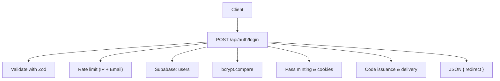
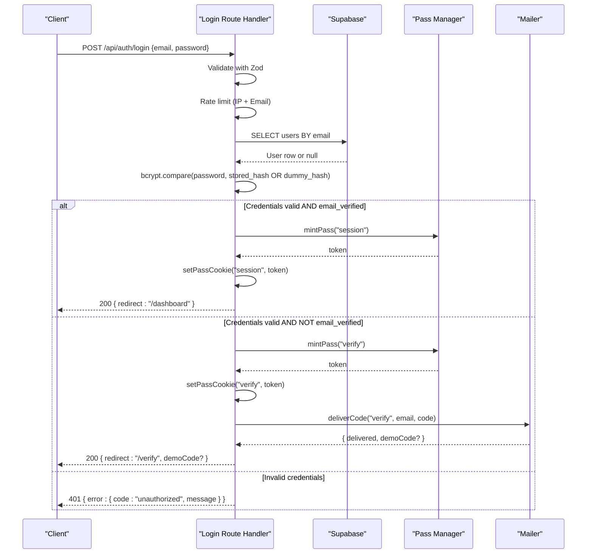
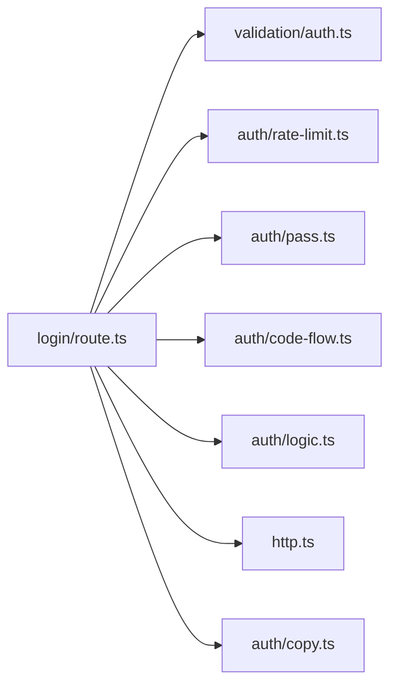

# Login Endpoint

<cite>
**Referenced Files in This Document**
- [route.ts](file://app/api/auth/login/route.ts)
- [auth.ts](file://lib/validation/auth.ts)
- [rate-limit.ts](file://lib/auth/rate-limit.ts)
- [pass.ts](file://lib/auth/pass.ts)
- [code-flow.ts](file://lib/auth/code-flow.ts)
- [logic.ts](file://lib/auth/logic.ts)
- [http.ts](file://lib/http.ts)
- [copy.ts](file://lib/auth/copy.ts)
- [0002_auth.sql](file://supabase/migrations/0002_auth.sql)
</cite>

## Table of Contents
1. [Introduction](#introduction)
2. [Project Structure](#project-structure)
3. [Core Components](#core-components)
4. [Architecture Overview](#architecture-overview)
5. [Detailed Component Analysis](#detailed-component-analysis)
6. [Dependency Analysis](#dependency-analysis)
7. [Performance Considerations](#performance-considerations)
8. [Troubleshooting Guide](#troubleshooting-guide)
9. [Conclusion](#conclusion)

## Introduction
This document specifies the Agropioo login endpoint POST /api/auth/login. It covers request validation, password verification with timing-safe comparison, dual-path authentication for verified and unverified accounts, rate limiting by IP and email, JWT session cookie management, verification code issuance for unverified users, redirect behavior, error handling patterns, and security considerations such as dummy hash usage to prevent enumeration.

## Project Structure
The login endpoint is implemented as a Next.js Route Handler that:
- Validates input using shared Zod schemas
- Enforces per-IP and per-email rate limits
- Looks up the user and compares passwords with bcrypt
- Issues either a 7-day session pass or a verification flow pass + code
- Returns a JSON response with a redirect target

**Diagram sources**
- [route.ts:41-111](file://app/api/auth/login/route.ts#L41-L111)
- [auth.ts:54-57](file://lib/validation/auth.ts#L54-L57)
- [rate-limit.ts:15-25](file://lib/auth/rate-limit.ts#L15-L25)
- [pass.ts:111-148](file://lib/auth/pass.ts#L111-L148)
- [code-flow.ts:15-51](file://lib/auth/code-flow.ts#L15-L51)

**Section sources**
- [route.ts:1-112](file://app/api/auth/login/route.ts#L1-L112)

## Core Components
- Input validation: Zod schema ensures normalized email and presence of password.
- Rate limiting: Fixed-window counters per IP and per email; returns 429 when exceeded.
- Password verification: bcrypt compare against stored hash or a fixed dummy hash to equalize timing for unknown emails.
- Dual-path authentication:
  - Verified account: mint a 7-day session pass and set an httpOnly cookie; return redirect to dashboard.
  - Unverified account: issue a verification code, mint a short-lived verify pass, set its cookie, deliver the code via email, and return redirect to /verify.
- Error handling: Standardized error responses with neutral messages; server errors return 500.

**Section sources**
- [auth.ts:54-57](file://lib/validation/auth.ts#L54-L57)
- [rate-limit.ts:15-25](file://lib/auth/rate-limit.ts#L15-L25)
- [route.ts:41-111](file://app/api/auth/login/route.ts#L41-L111)
- [pass.ts:111-148](file://lib/auth/pass.ts#L111-L148)
- [code-flow.ts:15-51](file://lib/auth/code-flow.ts#L15-L51)
- [http.ts:19-25](file://lib/http.ts#L19-L25)
- [copy.ts:4-15](file://lib/auth/copy.ts#L4-L15)

## Architecture Overview
The login flow enforces strict ordering: validate → rate limit → lookup → compare → branch → respond.

**Diagram sources**
- [route.ts:41-111](file://app/api/auth/login/route.ts#L41-L111)
- [pass.ts:111-148](file://lib/auth/pass.ts#L111-L148)
- [code-flow.ts:15-51](file://lib/auth/code-flow.ts#L15-L51)

## Detailed Component Analysis

### Request Validation
- Schema: loginSchema requires email (normalized to lowercase and trimmed) and a non-empty password string.
- Behavior on invalid input: The handler treats it as unauthorized to avoid leaking validation details.

Example request body:
{
  "email": "farmer@example.com",
  "password": "securePass123"
}

**Section sources**
- [auth.ts:54-57](file://lib/validation/auth.ts#L54-L57)
- [route.ts:43-47](file://app/api/auth/login/route.ts#L43-L47)

### Rate Limiting
- Dimensions: per-IP and per-email within fixed windows.
- Limits: loginIp = 10 attempts per 15 minutes; loginEmail = 8 attempts per 15 minutes.
- On breach: 429 with a neutral message.

Example rate-limited response:
{
  "error": {
    "code": "rate_limited",
    "message": "Too many attempts — please try again later."
  }
}

**Section sources**
- [rate-limit.ts:15-25](file://lib/auth/rate-limit.ts#L15-L25)
- [route.ts:49-64](file://app/api/auth/login/route.ts#L49-L64)
- [copy.ts:4-15](file://lib/auth/copy.ts#L4-L15)

### Password Verification and Enumeration Resistance
- Lookup: Supabase query for the user by email.
- Comparison: bcrypt.compare against the stored hash if found; otherwise against a fixed dummy hash so timing does not reveal whether the email exists.
- Outcome: Both unknown email and wrong password return the same generic unauthorized response.

Security note: Dummy hash usage prevents enumeration attacks by ensuring constant-time-like behavior across known and unknown emails.

**Section sources**
- [route.ts:66-81](file://app/api/auth/login/route.ts#L66-L81)

### Dual-Path Authentication

#### Verified Account Path
- Action: Mint a session pass (7 days), set the session cookie, clear any leftover verify/reset cookies, and return a redirect to the dashboard.

Response example:
{
  "redirect": "/dashboard"
}

**Section sources**
- [pass.ts:111-148](file://lib/auth/pass.ts#L111-L148)
- [pass.ts:244-263](file://lib/auth/pass.ts#L244-L263)
- [route.ts:99-106](file://app/api/auth/login/route.ts#L99-L106)
- [logic.ts:107-110](file://lib/auth/logic.ts#L107-L110)

#### Unverified Account Path
- Action: Clear previous temporary cookies, issue a fresh verification code, mint a verify pass (short TTL), set the verify cookie, deliver the code via email, and return a redirect to /verify. Optionally include a demo code in development/demo mode.

Response examples:
{
  "redirect": "/verify"
}
or
{
  "redirect": "/verify",
  "demoCode": "123456"
}

**Section sources**
- [route.ts:83-96](file://app/api/auth/login/route.ts#L83-L96)
- [code-flow.ts:15-51](file://lib/auth/code-flow.ts#L15-L51)

### JWT Session Cookie Management
- Cookies: Three named httpOnly cookies are used: agro_verify, agro_reset, agro_session.
- Session cookie: Set on successful login for verified users with a 7-day TTL.
- Verify cookie: Set for unverified users with a 1-hour TTL to gate the verification screen.
- Security: Secure flag in production, SameSite=Lax, path="/".

**Section sources**
- [pass.ts:17-28](file://lib/auth/pass.ts#L17-L28)
- [pass.ts:234-263](file://lib/auth/pass.ts#L234-L263)

### Database Schema Integration
- Users table stores email, password_hash, and email_verified flags.
- Sessions table tracks active sessions keyed by jti for revocation and expiry checks.
- Pass states and verification codes support the verification flow and last-code-wins semantics.

**Section sources**
- [0002_auth.sql:7-17](file://supabase/migrations/0002_auth.sql#L7-L17)
- [0002_auth.sql:52-61](file://supabase/migrations/0002_auth.sql#L52-L61)

## Dependency Analysis
The login route composes several modules:

**Diagram sources**
- [route.ts:7-24](file://app/api/auth/login/route.ts#L7-L24)

**Section sources**
- [route.ts:7-24](file://app/api/auth/login/route.ts#L7-L24)

## Performance Considerations
- bcrypt.compare is intentionally run even for unknown emails using a dummy hash to avoid timing side channels; this adds predictable cost but improves security.
- Rate limiting uses an in-memory Map suitable for single-instance deployments; consider Redis for multi-instance scaling.
- Database queries are minimal: one user lookup per attempt.

[No sources needed since this section provides general guidance]

## Troubleshooting Guide
Common issues and how to interpret responses:

- Validation failure: Treated as unauthorized to avoid leaking field-level details.
- Rate limited: 429 indicates too many attempts from the IP or email within the window.
- Invalid credentials: 401 with a neutral message; do not distinguish between unknown email and wrong password.
- Server error: 500 indicates an unexpected internal failure.

Example error responses:
{
  "error": {
    "code": "unauthorized",
    "message": "Invalid email or password."
  }
}
{
  "error": {
    "code": "rate_limited",
    "message": "Too many attempts — please try again later."
  }
}
{
  "error": {
    "code": "server_error",
    "message": "Something went wrong on our side. Please try again."
  }
}

**Section sources**
- [http.ts:19-25](file://lib/http.ts#L19-L25)
- [copy.ts:4-15](file://lib/auth/copy.ts#L4-L15)
- [route.ts:107-110](file://app/api/auth/login/route.ts#L107-L110)

## Conclusion
The login endpoint implements a secure, enumeration-resistant authentication flow with robust validation, rate limiting, and dual-path handling for verified and unverified users. It uses state-backed JWTs for session and verification passes, sets secure httpOnly cookies, and integrates with the verification code flow to ensure users complete email verification before accessing protected areas.