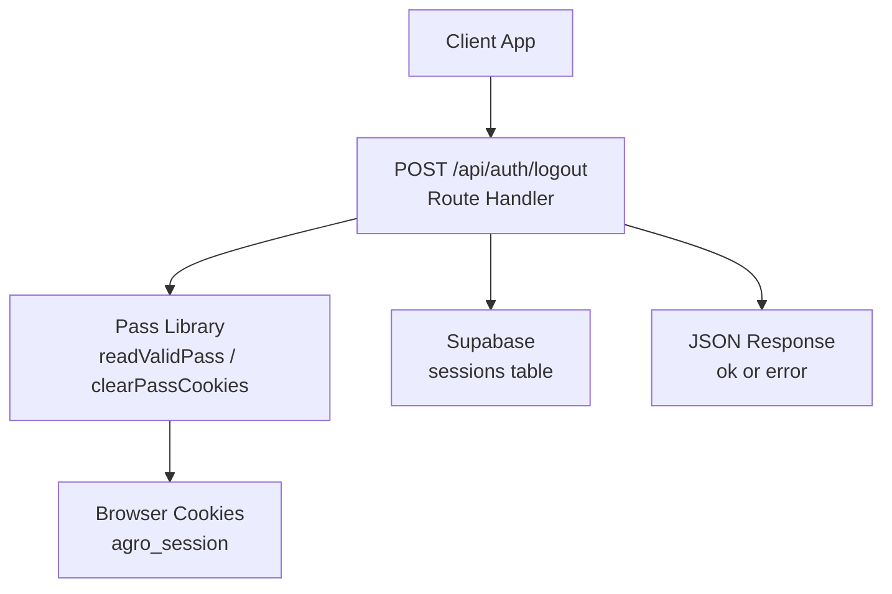
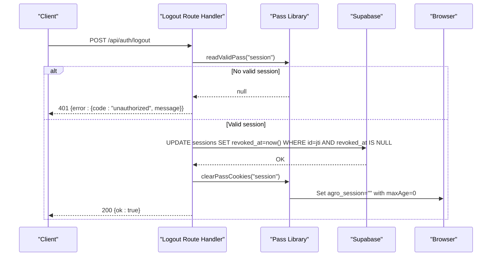
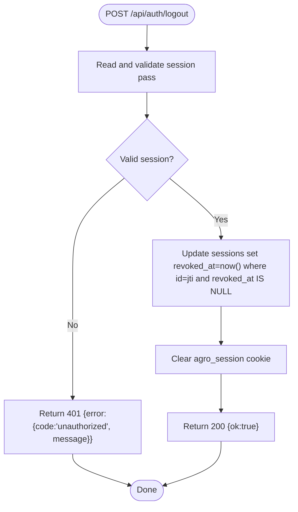
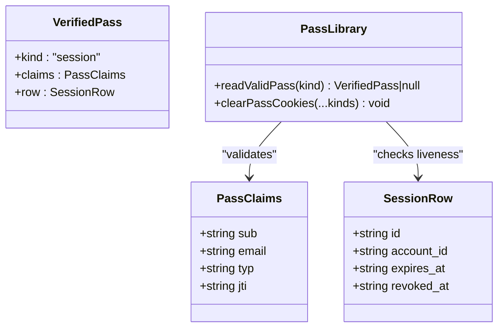
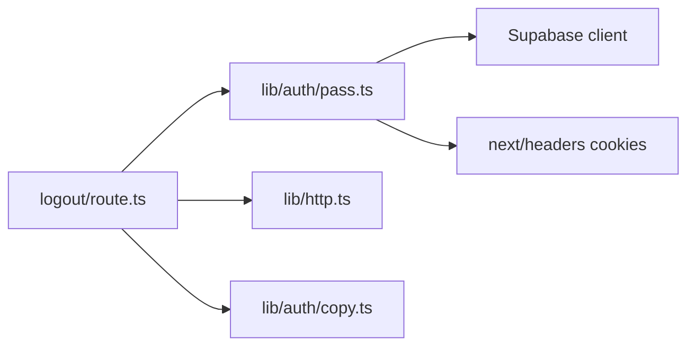

# Logout Endpoint

<cite>
**Referenced Files in This Document**
- [route.ts](file://app/api/auth/logout/route.ts)
- [pass.ts](file://lib/auth/pass.ts)
- [http.ts](file://lib/http.ts)
- [copy.ts](file://lib/auth/copy.ts)
- [guards.ts](file://lib/auth/guards.ts)
- [0003-auth-pass-architecture.md](file://adrs/0003-auth-pass-architecture.md)
- [spec.md](file://specs/authentication/spec.md)
</cite>

## Table of Contents
1. Introduction
2. Project Structure
3. Core Components
4. Architecture Overview
5. Detailed Component Analysis
6. Dependency Analysis
7. Performance Considerations
8. Troubleshooting Guide
9. Conclusion
10. Appendices

## Introduction
This document provides comprehensive API documentation for the Agropioo logout endpoint POST /api/auth/logout. It explains how the endpoint terminates a session by invalidating the server-side session record, clearing cookies, and ensuring complete session termination within the pass-based authentication system. It also covers request/response schemas, security considerations, client-side cleanup requirements, and error handling scenarios.

## Project Structure
The logout endpoint is implemented as a Next.js Route Handler under app/api/auth/logout. It integrates with:
- The pass-based authentication library (JWT + state-backed sessions)
- Supabase for session revocation
- Centralized HTTP response helpers
- Centralized user-facing copy strings

**Diagram sources**
- [route.ts:10-30](file://app/api/auth/logout/route.ts#L10-L30)
- [pass.ts:196-263](file://lib/auth/pass.ts#L196-L263)
- [http.ts:15-25](file://lib/http.ts#L15-L25)

**Section sources**
- [route.ts:1-30](file://app/api/auth/logout/route.ts#L1-L30)
- [pass.ts:15-63](file://lib/auth/pass.ts#L15-L63)
- [http.ts:1-25](file://lib/http.ts#L1-L25)

## Core Components
- Route handler: Validates the current session pass, revokes the session row, clears the session cookie, and returns a standardized JSON response.
- Pass library: Reads and validates the session JWT, checks the corresponding session row for liveness, and clears cookies.
- HTTP helpers: Provide uniform success and error responses.
- Copy constants: Provide user-facing messages for unauthorized and server errors.

Key responsibilities:
- Session validation via readValidPass("session")
- Server-side revocation by updating sessions.revoked_at
- Cookie cleanup via clearPassCookies("session")
- Standardized JSON responses using jsonResponse/errorResponse

**Section sources**
- [route.ts:10-30](file://app/api/auth/logout/route.ts#L10-L30)
- [pass.ts:196-263](file://lib/auth/pass.ts#L196-L263)
- [http.ts:15-25](file://lib/http.ts#L15-L25)
- [copy.ts:4-15](file://lib/auth/copy.ts#L4-L15)

## Architecture Overview
The logout flow enforces FR21: immediate cookie clearance and server-side revocation of the specific session so that a copied cookie becomes useless. Other devices’ sessions remain unaffected.

**Diagram sources**
- [route.ts:10-30](file://app/api/auth/logout/route.ts#L10-L30)
- [pass.ts:196-263](file://lib/auth/pass.ts#L196-L263)

**Section sources**
- [spec.md:52-58](file://specs/authentication/spec.md#L52-L58)
- [0003-auth-pass-architecture.md:13-25](file://adrs/0003-auth-pass-architecture.md#L13-L25)

## Detailed Component Analysis

### Endpoint Specification
- Method: POST
- Path: /api/auth/logout
- Authentication: Requires a valid session pass cookie (agro_session)
- Request body: None
- Success response: 200 OK with JSON body { ok: true }
- Error responses:
  - 401 Unauthorized when no valid session pass is present
  - 500 Server Error on unexpected failures

Request schema:
- Headers: Cookie: agro_session=<JWT>
- Body: N/A

Success response schema:
- Status: 200
- Body: { ok: boolean }

Error response schema:
- Status: 401 or 500
- Body: { error: { code: string, message: string } }

Security considerations:
- Uses httpOnly, Secure (in production), SameSite=Lax cookies for passes
- Session revocation is server-side; copying the cookie after logout does not restore access
- Only the targeted session is revoked; other sessions remain active
- All failures return a uniform error shape to avoid leaking information

Client-side cleanup requirements:
- Clear any in-memory auth state (e.g., tokens, user context)
- Redirect to login or home after receiving success
- Ensure subsequent requests do not include stale session references

**Section sources**
- [route.ts:10-30](file://app/api/auth/logout/route.ts#L10-L30)
- [http.ts:15-25](file://lib/http.ts#L15-L25)
- [copy.ts:4-15](file://lib/auth/copy.ts#L4-L15)
- [pass.ts:234-263](file://lib/auth/pass.ts#L234-L263)
- [spec.md:52-58](file://specs/authentication/spec.md#L52-L58)

### Session Termination Process
The logout process performs three critical steps:
1. Validate the current session pass
2. Mark the session as revoked in the database
3. Clear the session cookie

**Diagram sources**
- [route.ts:10-30](file://app/api/auth/logout/route.ts#L10-L30)
- [pass.ts:196-263](file://lib/auth/pass.ts#L196-L263)

**Section sources**
- [route.ts:10-30](file://app/api/auth/logout/route.ts#L10-L30)
- [pass.ts:176-194](file://lib/auth/pass.ts#L176-L194)

### Integration with Pass-Based Authentication
- The session pass is an HS256-signed JWT carrying sub, email, typ="session", jti, exp.
- The jti identifies a Postgres sessions row that holds mutable state including expires_at and revoked_at.
- readValidPass ensures:
  - Cookie exists and matches expected type
  - Signature and expiry are valid
  - Session row is unexpired and unrevoked
  - Account still exists
- clearPassCookies sets the cookie value to empty with maxAge=0 to immediately expire it in the browser.

**Diagram sources**
- [pass.ts:32-63](file://lib/auth/pass.ts#L32-L63)
- [pass.ts:196-263](file://lib/auth/pass.ts#L196-L263)

**Section sources**
- [pass.ts:15-63](file://lib/auth/pass.ts#L15-L63)
- [pass.ts:176-194](file://lib/auth/pass.ts#L176-L194)
- [pass.ts:196-263](file://lib/auth/pass.ts#L196-L263)
- [0003-auth-pass-architecture.md:13-25](file://adrs/0003-auth-pass-architecture.md#L13-L25)

### Security Considerations
- Cookie transport:
  - httpOnly prevents client script access
  - Secure flag in production prevents transmission over non-HTTPS
  - SameSite=Lax mitigates CSRF risks
- State-backed revocation:
  - Revoking a session makes its JWT useless even if copied
  - Only the targeted session is affected; other sessions remain valid
- Uniform error responses:
  - Prevents enumeration or leakage about session validity
- Guard consistency:
  - Protected pages and APIs rely on the same session validation logic

**Section sources**
- [pass.ts:234-263](file://lib/auth/pass.ts#L234-L263)
- [spec.md:52-58](file://specs/authentication/spec.md#L52-L58)
- [guards.ts:1-37](file://lib/auth/guards.ts#L1-L37)

### Error Handling Scenarios
- Missing or invalid session pass:
  - Returns 401 with { error: { code: "unauthorized", message: "This request isn't allowed." } }
- Unexpected server error:
  - Returns 500 with { error: { code: "server_error", message: "Something went wrong on our side. Please try again." } }
- Successful logout:
  - Returns 200 with { ok: true }

Client guidance:
- On 401: treat as already logged out; redirect to login
- On 500: show generic error; optionally retry once; then redirect to login
- On 200: clear local state and navigate to login or home

**Section sources**
- [route.ts:10-30](file://app/api/auth/logout/route.ts#L10-L30)
- [http.ts:15-25](file://lib/http.ts#L15-L25)
- [copy.ts:4-15](file://lib/auth/copy.ts#L4-L15)

## Dependency Analysis
The logout endpoint depends on:
- Pass library for session validation and cookie management
- Supabase client for session revocation
- HTTP helpers for consistent responses
- Copy constants for user-facing messages

**Diagram sources**
- [route.ts:5-8](file://app/api/auth/logout/route.ts#L5-L8)
- [pass.ts:9-13](file://lib/auth/pass.ts#L9-L13)

**Section sources**
- [route.ts:5-8](file://app/api/auth/logout/route.ts#L5-L8)
- [pass.ts:9-13](file://lib/auth/pass.ts#L9-L13)

## Performance Considerations
- Single database update per logout: minimal overhead
- Cookie clearing is synchronous within the request lifecycle
- Avoid unnecessary reads: only one readValidPass call before revocation
- Idempotent behavior: repeated calls after successful logout will fail fast due to missing/invalid session

[No sources needed since this section provides general guidance]

## Troubleshooting Guide
Common issues and resolutions:
- 401 Unauthorized:
  - Cause: Missing or invalid session cookie
  - Resolution: Ensure the client sends the agro_session cookie; verify network and domain settings; handle ejection to login
- 500 Server Error:
  - Cause: Database or internal failure during revocation or cookie clearing
  - Resolution: Check logs; retry once; if persistent, escalate
- Session still active after logout:
  - Cause: Client did not clear local state or reuses cached data
  - Resolution: Clear in-memory state and navigate away from protected routes

**Section sources**
- [route.ts:10-30](file://app/api/auth/logout/route.ts#L10-L30)
- [http.ts:15-25](file://lib/http.ts#L15-L25)
- [copy.ts:4-15](file://lib/auth/copy.ts#L4-L15)

## Conclusion
The POST /api/auth/logout endpoint implements a secure, state-backed logout that invalidates the current session server-side and clears the session cookie. It adheres to the pass-based authentication architecture, ensuring that a copied cookie cannot be used post-logout while leaving other sessions intact. Clients should clear local state and navigate appropriately upon receiving the standardized responses.

[No sources needed since this section summarizes without analyzing specific files]

## Appendices

### Request/Response Examples
- Successful logout:
  - Request: POST /api/auth/logout with Cookie: agro_session=<JWT>
  - Response: 200 { ok: true }
- Unauthorized:
  - Response: 401 { error: { code: "unauthorized", message: "This request isn't allowed." } }
- Server error:
  - Response: 500 { error: { code: "server_error", message: "Something went wrong on our side. Please try again." } }

**Section sources**
- [route.ts:10-30](file://app/api/auth/logout/route.ts#L10-L30)
- [http.ts:15-25](file://lib/http.ts#L15-L25)
- [copy.ts:4-15](file://lib/auth/copy.ts#L4-L15)