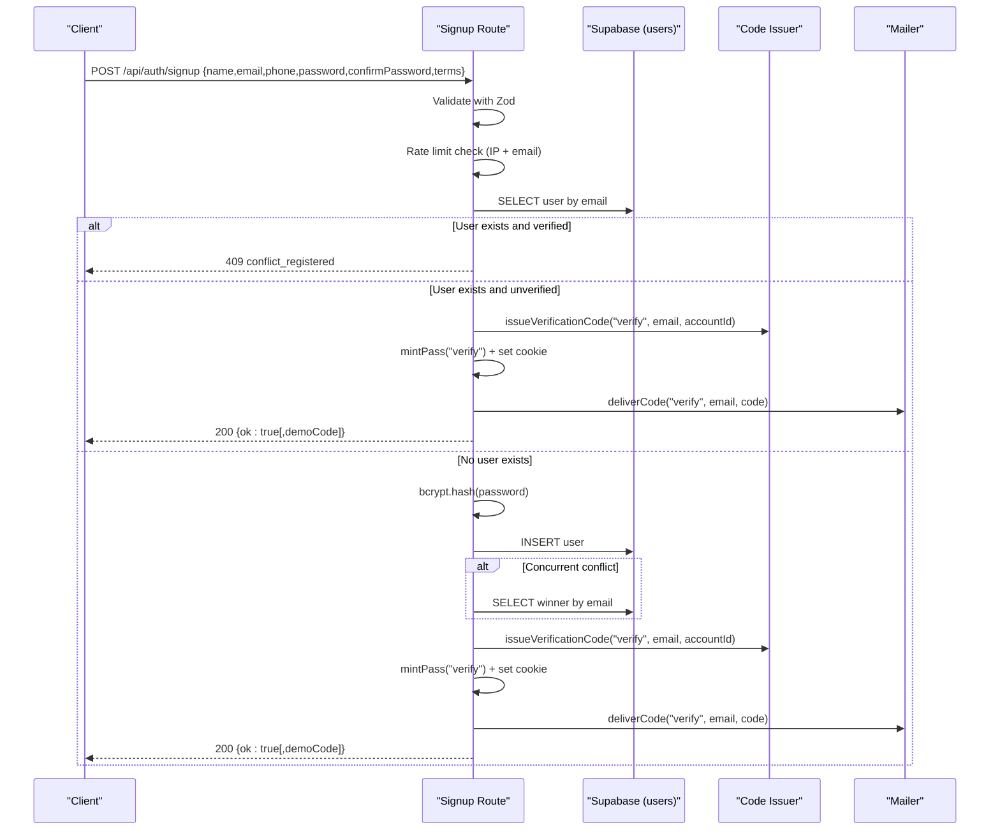

# Signup Endpoint

<cite>
**Referenced Files in This Document**
- [route.ts](file://app/api/auth/signup/route.ts)
- [auth.ts](file://lib/validation/auth.ts)
- [http.ts](file://lib/http.ts)
- [code-flow.ts](file://lib/auth/code-flow.ts)
- [logic.ts](file://lib/auth/logic.ts)
- [mailer.ts](file://lib/mailer.ts)
- [copy.ts](file://lib/auth/copy.ts)
- [rate-limit.ts](file://lib/auth/rate-limit.ts)
- [0002_auth.sql](file://supabase/migrations/0002_auth.sql)
</cite>

## Table of Contents
1. [Introduction](#introduction)
2. [Endpoint Overview](#endpoint-overview)
3. [Request Schema](#request-schema)
4. [Response Schemas](#response-schemas)
5. [Registration Flow](#registration-flow)
6. [Error Handling](#error-handling)
7. [Email Verification and Redirect](#email-verification-and-redirect)
8. [Security and Performance Notes](#security-and-performance-notes)
9. [Examples](#examples)
10. [Troubleshooting](#troubleshooting)

## Introduction
This document describes the Agropioo signup endpoint (POST /api/auth/signup). It covers input validation with Zod, password hashing with bcrypt, duplicate email handling, user creation in the database, automatic verification code generation, email delivery behavior, and how clients should proceed to verification.

## Endpoint Overview
- Method: POST
- Path: /api/auth/signup
- Purpose: Create a new user account or restart verification for an unverified account; send a one-time verification code via email; set a verification pass cookie to enable subsequent verification steps.

Key behaviors:
- Validates request body using shared Zod schemas.
- Applies rate limiting per IP and per email.
- Checks for existing accounts:
  - Verified email returns a conflict error.
  - Unverified email reuses the existing row and issues a fresh verification code.
- For new users, hashes the password with bcrypt and inserts into the users table.
- Issues a verification code, creates a verification pass, sets a cookie, and sends the code via email.

**Section sources**
- [route.ts:1-119](file://app/api/auth/signup/route.ts#L1-L119)
- [auth.ts:20-50](file://lib/validation/auth.ts#L20-L50)
- [rate-limit.ts:15-25](file://lib/auth/rate-limit.ts#L15-L25)
- [0002_auth.sql:7-17](file://supabase/migrations/0002_auth.sql#L7-L17)

## Request Schema
The endpoint validates the JSON body against the signup schema. All fields are required unless noted.

- name: string, trimmed, 1–80 characters
- email: string, trimmed and lowercased, must be a valid email format
- phone: optional string; if provided, must match a phone pattern; empty strings become null
- password: string, 8–64 characters
- confirmPassword: string, must equal password
- terms: boolean, must be true

Notes:
- Email normalization (trim + lowercase) happens before storage and comparisons.
- Phone is optional; when omitted or empty, it is stored as null.

Validation failure response:
- Status: 400
- Body: { "error": { "code": "validation_error", "message": "..." } }

**Section sources**
- [auth.ts:8-50](file://lib/validation/auth.ts#L8-L50)
- [http.ts:19-25](file://lib/http.ts#L19-L25)

## Response Schemas
Success response:
- Status: 200
- Body:
  - ok: true
  - demoCode?: string (present only when SMTP is not configured and DEMO_MODE is enabled)

Error responses:
- 400 validation_error: Invalid or missing fields
- 409 conflict_registered: The email is already registered and verified
- 429 rate_limited: Too many attempts from this IP or email
- 500 server_error: Unexpected server/database errors

Body shape for errors:
- { "error": { "code": "...", "message": "..." } }

**Section sources**
- [route.ts:27-118](file://app/api/auth/signup/route.ts#L27-L118)
- [http.ts:4-25](file://lib/http.ts#L4-L25)

## Registration Flow
High-level sequence:
1. Parse and validate request body with Zod.
2. Apply rate limits by IP and email.
3. Look up existing user by normalized email.
   - If found and verified: return 409 conflict.
   - If found and unverified: reuse the existing row.
4. If no existing user:
   - Hash password with bcrypt.
   - Insert user into the users table.
   - Handle concurrent insert conflicts by fetching the winning row.
5. Issue a fresh verification code and store its hash.
6. Create a verification pass token and set a cookie.
7. Send the code via email (real or demo mode).
8. Return success with optional demoCode.

**Diagram sources**
- [route.ts:27-118](file://app/api/auth/signup/route.ts#L27-L118)
- [code-flow.ts:15-51](file://lib/auth/code-flow.ts#L15-L51)
- [mailer.ts:49-84](file://lib/mailer.ts#L49-L84)
- [0002_auth.sql:7-17](file://supabase/migrations/0002_auth.sql#L7-L17)

**Section sources**
- [route.ts:27-118](file://app/api/auth/signup/route.ts#L27-L118)
- [code-flow.ts:15-51](file://lib/auth/code-flow.ts#L15-L51)
- [mailer.ts:49-84](file://lib/mailer.ts#L49-L84)

## Error Handling
- Validation failures:
  - Cause: Missing or invalid fields (e.g., malformed email, short password, mismatched confirm password, terms not accepted).
  - Response: 400 with code "validation_error".
- Duplicate verified email:
  - Cause: Attempting to sign up with an email that is already verified.
  - Response: 409 with code "conflict_registered".
- Rate limiting:
  - Cause: Exceeds per-IP or per-email signup limits within the configured window.
  - Response: 429 with code "rate_limited".
- Database errors:
  - Cause: Unexpected Supabase errors during lookup or insert.
  - Response: 500 with code "server_error".
- Concurrent insert race:
  - Behavior: Exactly one insert wins; losers fetch the existing row and continue to verification issuance.

**Section sources**
- [route.ts:27-118](file://app/api/auth/signup/route.ts#L27-L118)
- [http.ts:19-25](file://lib/http.ts#L19-L25)
- [rate-limit.ts:15-47](file://lib/auth/rate-limit.ts#L15-L47)

## Email Verification and Redirect
After successful signup:
- A verification code is generated, hashed, and stored with a 10-minute TTL.
- A verification pass token is created and set as a cookie to authorize subsequent verification requests.
- The code is sent via email:
  - If SMTP is configured: real email is sent; no demoCode is returned.
  - If SMTP is not configured and DEMO_MODE is enabled: no email is sent; demoCode is included in the response for display in a banner.
  - If SMTP is not configured and DEMO_MODE is disabled: delivery fails silently on the server; the client receives a neutral message and can prompt resend.

Client redirect guidance:
- On success, redirect the user to the verification flow (e.g., /verify) where they enter the 6-digit code.
- Use the verification pass cookie automatically available to the browser to complete verification.

**Section sources**
- [route.ts:104-113](file://app/api/auth/signup/route.ts#L104-L113)
- [code-flow.ts:15-51](file://lib/auth/code-flow.ts#L15-L51)
- [logic.ts:21-29](file://lib/auth/logic.ts#L21-L29)
- [mailer.ts:49-84](file://lib/mailer.ts#L49-L84)

## Security and Performance Notes
- Password hashing:
  - Uses bcrypt with a fixed cost factor for consistent performance.
- Email normalization:
  - Emails are trimmed and lowercased before storage and comparison to prevent duplicates due to casing differences.
- Code security:
  - Codes are never stored in plaintext; only SHA-256 hashes are persisted.
  - Codes expire after 10 minutes and are voided when superseded by a newer code.
- Rate limiting:
  - Protects against abuse via per-IP and per-email windows.
- Concurrency:
  - First-write-wins strategy ensures exactly one user record per email even under concurrent requests.

**Section sources**
- [route.ts:70-101](file://app/api/auth/signup/route.ts#L70-L101)
- [auth.ts:8-11](file://lib/validation/auth.ts#L8-L11)
- [code-flow.ts:15-42](file://lib/auth/code-flow.ts#L15-L42)
- [logic.ts:21-29](file://lib/auth/logic.ts#L21-L29)
- [rate-limit.ts:15-47](file://lib/auth/rate-limit.ts#L15-L47)

## Examples
Below are representative examples of request and response payloads. Replace placeholders with actual values when testing.

Successful registration (SMTP configured):
- Request:
  - { "name": "Jane Doe", "email": "jane@example.com", "phone": "+923001234567", "password": "securePass123", "confirmPassword": "securePass123", "terms": true }
- Response:
  - 200 OK
  - { "ok": true }

Successful registration (SMTP not configured, DEMO_MODE=true):
- Request: same as above
- Response:
  - 200 OK
  - { "ok": true, "demoCode": "123456" }

Duplicate verified email:
- Request: same as above but email already verified
- Response:
  - 409 Conflict
  - { "error": { "code": "conflict_registered", "message": "This email is already registered. Sign in instead or reset your password." } }

Validation failure (e.g., short password):
- Request:
  - { "name": "Jane Doe", "email": "jane@example.com", "phone": "+923001234567", "password": "short", "confirmPassword": "short", "terms": true }
- Response:
  - 400 Bad Request
  - { "error": { "code": "validation_error", "message": "Some details need fixing before we can continue." } }

Rate limited:
- Request: repeated signups beyond limits
- Response:
  - 429 Too Many Requests
  - { "error": { "code": "rate_limited", "message": "Too many attempts — please try again later." } }

**Section sources**
- [route.ts:27-118](file://app/api/auth/signup/route.ts#L27-L118)
- [http.ts:19-25](file://lib/http.ts#L19-L25)
- [copy.ts:4-15](file://lib/auth/copy.ts#L4-L15)
- [mailer.ts:49-84](file://lib/mailer.ts#L49-L84)

## Troubleshooting
- Validation errors:
  - Ensure all required fields are present and correctly formatted.
  - Confirm password matches and terms are accepted.
- Duplicate email:
  - If the email is already verified, direct users to login or password reset flows.
- Rate limiting:
  - If you receive 429, wait for the window to expire or reduce request frequency.
- Email delivery:
  - In production, ensure SMTP variables are set.
  - In development without SMTP, enable DEMO_MODE to see codes in the response banner.
- Database errors:
  - Check logs for underlying Supabase errors; transient issues may resolve on retry.

**Section sources**
- [route.ts:27-118](file://app/api/auth/signup/route.ts#L27-L118)
- [mailer.ts:49-84](file://lib/mailer.ts#L49-L84)