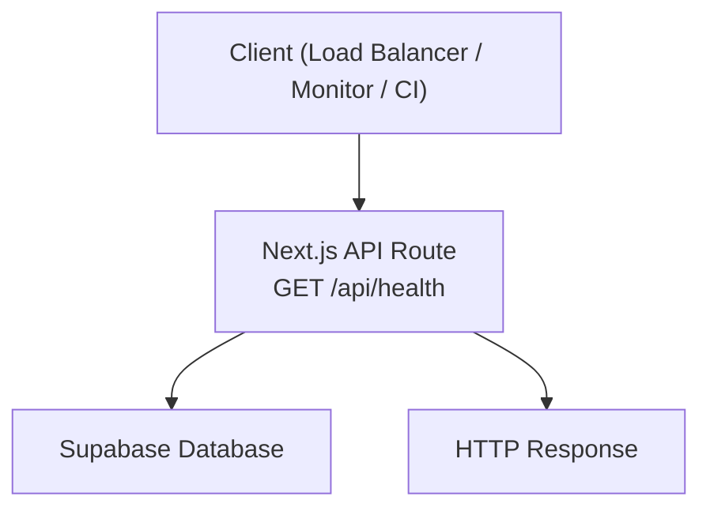
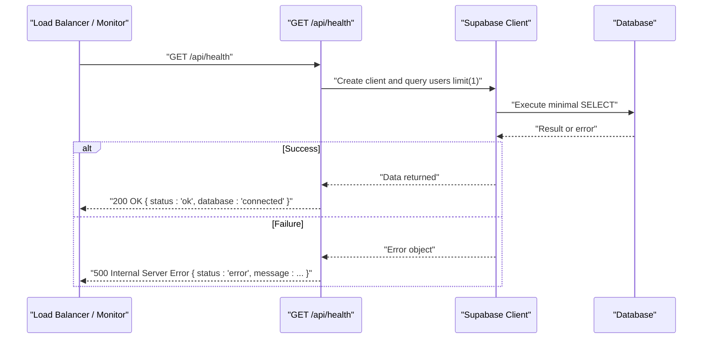
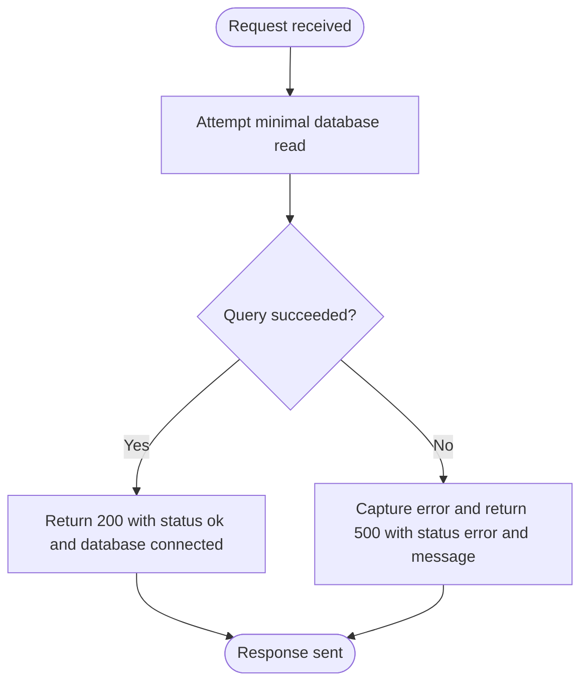
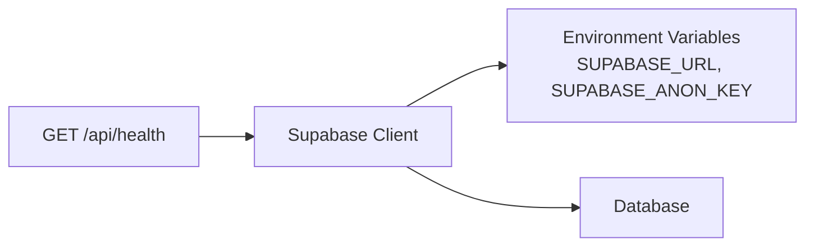

# Health Check Endpoint

<cite>
**Referenced Files in This Document**
- [route.ts](file://app/api/health/route.ts)
- [supabase.ts](file://lib/supabase.ts)
- [http.ts](file://lib/http.ts)
- [research.md](file://specs/language-compatibility/research.md)
</cite>

## Table of Contents
1. [Introduction](#introduction)
2. [Project Structure](#project-structure)
3. [Core Components](#core-components)
4. [Architecture Overview](#architecture-overview)
5. [Detailed Component Analysis](#detailed-component-analysis)
6. [Dependency Analysis](#dependency-analysis)
7. [Performance Considerations](#performance-considerations)
8. [Troubleshooting Guide](#troubleshooting-guide)
9. [Conclusion](#conclusion)

## Introduction
This document specifies the health check endpoint for application availability and system health monitoring. It covers the purpose, request/response contract, example responses for healthy and unhealthy states, and recommended usage patterns for load balancers, monitoring systems, and deployment pipelines. It also includes guidance on interpreting responses and setting alerting thresholds.

## Project Structure
The health check is implemented as a Next.js Route Handler under the API routes:
- Endpoint path: GET /api/health
- Implementation file: app/api/health/route.ts
- External dependency used for liveness: Supabase client (lib/supabase.ts)

**Diagram sources**
- [route.ts:3-16](file://app/api/health/route.ts#L3-L16)
- [supabase.ts:14-31](file://lib/supabase.ts#L14-L31)

**Section sources**
- [route.ts:1-18](file://app/api/health/route.ts#L1-L18)
- [research.md:55-65](file://specs/language-compatibility/research.md#L55-L65)

## Core Components
- Health route handler: Validates database connectivity by performing a minimal read operation. Returns a success response when connected and an error response with a descriptive message when not.
- Supabase client: Provides the database connection used to probe service availability.
- HTTP helpers: Standardized JSON response utilities are available across the codebase; the health route uses native Response.json directly.

Key responsibilities:
- Liveness probe: Confirms the process is running and can reach the database.
- Error signaling: Uses HTTP status codes and a consistent status field to indicate health state.

**Section sources**
- [route.ts:3-16](file://app/api/health/route.ts#L3-L16)
- [supabase.ts:14-31](file://lib/supabase.ts#L14-L31)
- [http.ts:15-25](file://lib/http.ts#L15-L25)

## Architecture Overview
The health endpoint performs a lightweight database connectivity check. On success, it returns a 200-level response indicating the service is healthy. On failure, it returns a 500-level response with an error payload.

**Diagram sources**
- [route.ts:3-16](file://app/api/health/route.ts#L3-L16)
- [supabase.ts:14-31](file://lib/supabase.ts#L14-L31)

## Detailed Component Analysis

### Endpoint Specification
- Method: GET
- Path: /api/health
- Purpose: Confirm application liveness and database connectivity for load balancers, monitoring systems, and deployment pipelines.

#### Request
- No body required.
- No authentication headers required.

#### Response Schema
- Success (database reachable):
  - HTTP Status: 200
  - Body:
    - status: string — always "ok"
    - database: string — always "connected"
- Failure (database unreachable or internal error):
  - HTTP Status: 500
  - Body:
    - status: string — "error"
    - message: string — human-readable error description

Example responses:
- Healthy:
  - HTTP 200
  - Body: {"status":"ok","database":"connected"}
- Unhealthy:
  - HTTP 500
  - Body: {"status":"error","message":"..."}

Notes:
- The current implementation does not include a timestamp in the response. If your monitoring requires timestamps, consider adding one at the route level.
- The current implementation does not enumerate additional service dependencies beyond the database.

**Section sources**
- [route.ts:3-16](file://app/api/health/route.ts#L3-L16)

### Processing Logic Flow

**Diagram sources**
- [route.ts:3-16](file://app/api/health/route.ts#L3-L16)

**Section sources**
- [route.ts:3-16](file://app/api/health/route.ts#L3-L16)

## Dependency Analysis
- The health route depends on the Supabase client to perform a minimal database query.
- Environment variables required for the Supabase client include URL and anonymous key; missing values will cause initialization errors.

**Diagram sources**
- [route.ts:1-6](file://app/api/health/route.ts#L1-L6)
- [supabase.ts:14-31](file://lib/supabase.ts#L14-L31)

**Section sources**
- [supabase.ts:6-12](file://lib/supabase.ts#L6-L12)
- [supabase.ts:14-31](file://lib/supabase.ts#L14-L31)

## Performance Considerations
- Keep probes lightweight: The current implementation performs a minimal read, which is appropriate for frequent polling.
- Polling frequency: For load balancers and readiness gates, poll every few seconds during startup and less frequently once stable.
- Avoid cascading failures: Ensure upstream services (e.g., databases) have their own health checks and backoff strategies.

[No sources needed since this section provides general guidance]

## Troubleshooting Guide
Common issues and how to interpret them:
- 500 with status "error": Indicates a failure while attempting to connect to or query the database. Verify environment variables and database connectivity.
- Missing environment variables: The Supabase client throws if required variables are absent; ensure SUPABASE_URL and SUPABASE_ANON_KEY are set.
- Intermittent failures: Network blips or database throttling can cause transient errors. Implement retries with exponential backoff in your monitor.

Operational tips:
- Use HTTP status codes to drive routing decisions: treat 2xx as healthy and 5xx as unhealthy.
- Log both successful and failed probes to track trends and detect degradation before outages.

**Section sources**
- [route.ts:8-16](file://app/api/health/route.ts#L8-L16)
- [supabase.ts:6-12](file://lib/supabase.ts#L6-L12)

## Conclusion
The GET /api/health endpoint provides a simple and effective liveness probe that validates database connectivity. It returns a clear success or error payload with appropriate HTTP status codes, enabling reliable integration with load balancers, monitoring systems, and deployment pipelines. For richer health semantics (e.g., additional dependencies or timestamps), extend the route while preserving backward compatibility.

[No sources needed since this section summarizes without analyzing specific files]