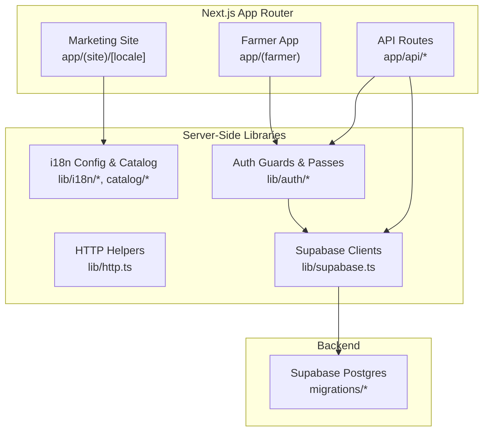
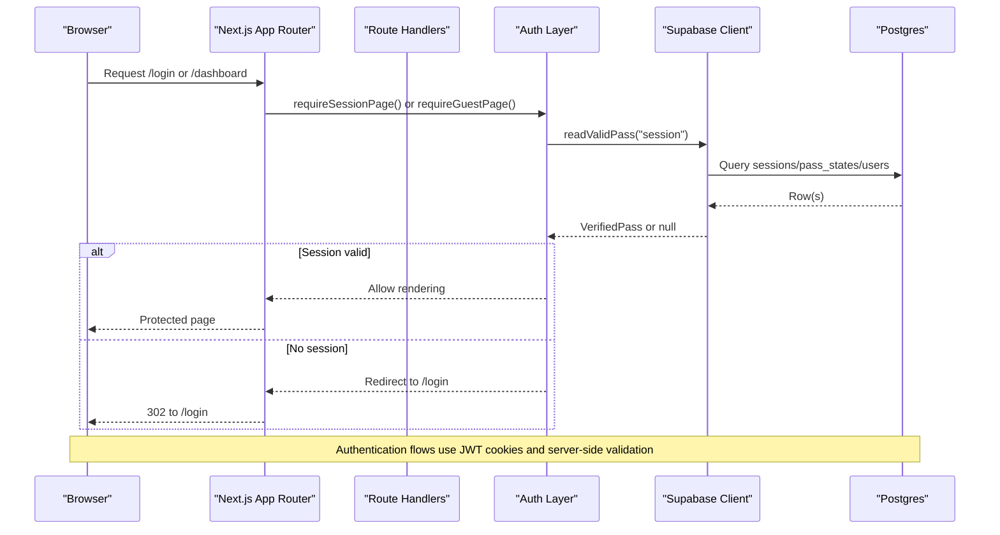
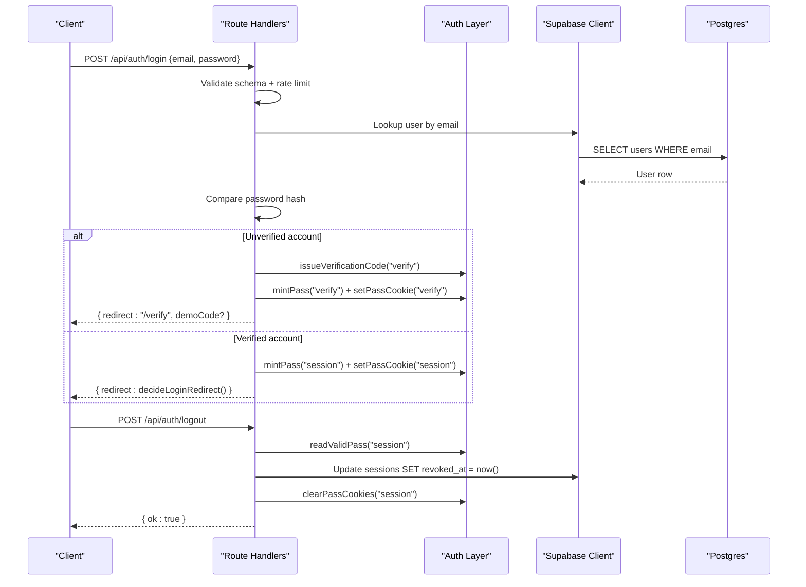
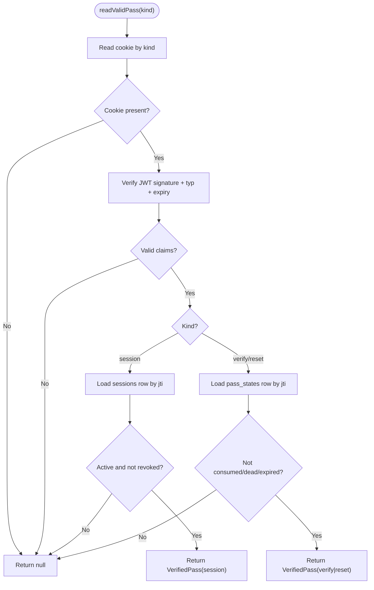
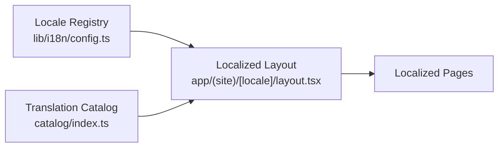
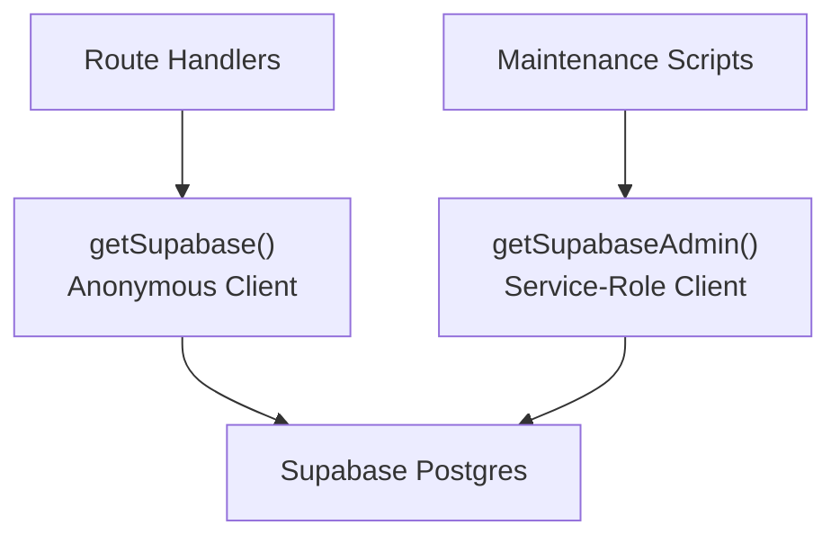
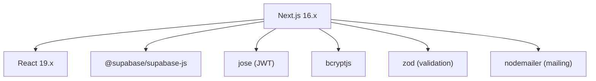
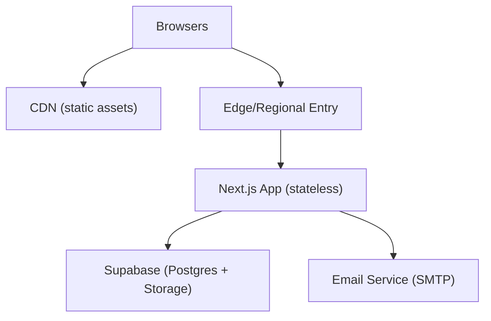

# Architecture Overview

<cite>
**Referenced Files in This Document**
- [package.json](file://package.json)
- [next.config.ts](file://next.config.ts)
- [lib/supabase.ts](file://lib/supabase.ts)
- [lib/http.ts](file://lib/http.ts)
- [lib/auth/guards.ts](file://lib/auth/guards.ts)
- [lib/auth/pass.ts](file://lib/auth/pass.ts)
- [lib/i18n/config.ts](file://lib/i18n/config.ts)
- [catalog/index.ts](file://catalog/index.ts)
- [app/(farmer)/layout.tsx](file://app/(farmer)/layout.tsx)
- [app/(site)/[locale]/layout.tsx](file://app/(site)/[locale]/layout.tsx)
- [app/api/auth/login/route.ts](file://app/api/auth/login/route.ts)
- [app/api/auth/signup/route.ts](file://app/api/auth/signup/route.ts)
- [app/api/auth/logout/route.ts](file://app/api/auth/logout/route.ts)
- [supabase/migrations/0002_auth.sql](file://supabase/migrations/0002_auth.sql)
</cite>

## Table of Contents
1. [Introduction](#introduction)
2. [Project Structure](#project-structure)
3. [Core Components](#core-components)
4. [Architecture Overview](#architecture-overview)
5. [Detailed Component Analysis](#detailed-component-analysis)
6. [Dependency Analysis](#dependency-analysis)
7. [Performance Considerations](#performance-considerations)
8. [Troubleshooting Guide](#troubleshooting-guide)
9. [Conclusion](#conclusion)
10. [Appendices](#appendices)

## Introduction
This document describes the Agropioo system architecture, a Next.js application that serves two distinct experiences:
- A marketing site with multi-language support under route groups for localized URLs.
- A farmer application protected by server-side authentication and session management.

The system uses JWT-based sessions stored as httpOnly cookies, backed by Supabase Postgres tables for mutable state (sessions, pass states, verification codes). It employs a dual Supabase client pattern to isolate anonymous API access from privileged maintenance tasks. Internationalization is centralized through a locale registry and a typed translation catalog synced into the database so content can be updated without redeployments.

## Project Structure
Agropioo organizes routes using Next.js App Router:
- Marketing site lives under app/(site)/[locale], enabling per-locale layouts, fonts, and metadata.
- Farmer application lives under app/(farmer), with its own root layout and English-only at launch.
- API endpoints are implemented as Route Handlers under app/api, including authentication flows and health checks.

**Diagram sources**
- [app/(site)/[locale]/layout.tsx:1-88](file://app/(site)/[locale]/layout.tsx#L1-L88)
- [app/(farmer)/layout.tsx:1-48](file://app/(farmer)/layout.tsx#L1-L48)
- [lib/auth/guards.ts:1-38](file://lib/auth/guards.ts#L1-L38)
- [lib/auth/pass.ts:1-264](file://lib/auth/pass.ts#L1-L264)
- [lib/i18n/config.ts:1-137](file://lib/i18n/config.ts#L1-L137)
- [catalog/index.ts:1-41](file://catalog/index.ts#L1-L41)
- [lib/supabase.ts:1-47](file://lib/supabase.ts#L1-L47)
- [supabase/migrations/0002_auth.sql:1-61](file://supabase/migrations/0002_auth.sql#L1-L61)

**Section sources**
- [next.config.ts:1-12](file://next.config.ts#L1-L12)
- [package.json:1-38](file://package.json#L1-L38)

## Core Components
- Authentication layer: Server-side guards enforce session requirements for pages and APIs. Sessions and transient passes are JWTs signed with HS256 and backed by Postgres rows for revocation, expiry, and state transitions.
- Internationalization engine: A single locale registry defines supported languages, URL slugs, HTML lang attributes, and text direction. The translation catalog is typed and synced into the database for runtime updates.
- Database integration: A dual Supabase client pattern provides an anonymous client for normal operations and a service-role client for trusted server-side tasks. Migrations define users, sessions, pass states, and verification codes.
- UI components: Route-grouped layouts set fonts, metadata, and viewport settings. The marketing site dynamically renders localized content; the farmer app enforces authenticated access via guards.

**Section sources**
- [lib/auth/guards.ts:1-38](file://lib/auth/guards.ts#L1-L38)
- [lib/auth/pass.ts:1-264](file://lib/auth/pass.ts#L1-L264)
- [lib/i18n/config.ts:1-137](file://lib/i18n/config.ts#L1-L137)
- [catalog/index.ts:1-41](file://catalog/index.ts#L1-L41)
- [lib/supabase.ts:1-47](file://lib/supabase.ts#L1-L47)
- [supabase/migrations/0002_auth.sql:1-61](file://supabase/migrations/0002_auth.sql#L1-L61)

## Architecture Overview
High-level data flow between frontend, API routes, and Supabase backend:

**Diagram sources**
- [lib/auth/guards.ts:1-38](file://lib/auth/guards.ts#L1-L38)
- [lib/auth/pass.ts:1-264](file://lib/auth/pass.ts#L1-L264)
- [lib/supabase.ts:1-47](file://lib/supabase.ts#L1-L47)
- [supabase/migrations/0002_auth.sql:1-61](file://supabase/migrations/0002_auth.sql#L1-L61)

## Detailed Component Analysis

### Authentication Flow (Login, Signup, Logout)
- Login validates credentials, applies rate limiting, issues a verification code if email is unverified, or mints a session pass for verified accounts.
- Signup creates or reuses pending accounts, hashes passwords, issues verification codes, and sets temporary pass cookies.
- Logout revokes the current session row and clears the cookie.

**Diagram sources**
- [app/api/auth/login/route.ts:1-112](file://app/api/auth/login/route.ts#L1-L112)
- [app/api/auth/signup/route.ts:1-119](file://app/api/auth/signup/route.ts#L1-L119)
- [app/api/auth/logout/route.ts:1-30](file://app/api/auth/logout/route.ts#L1-L30)
- [lib/auth/pass.ts:1-264](file://lib/auth/pass.ts#L1-L264)
- [lib/supabase.ts:1-47](file://lib/supabase.ts#L1-L47)
- [supabase/migrations/0002_auth.sql:1-61](file://supabase/migrations/0002_auth.sql#L1-L61)

**Section sources**
- [app/api/auth/login/route.ts:1-112](file://app/api/auth/login/route.ts#L1-L112)
- [app/api/auth/signup/route.ts:1-119](file://app/api/auth/signup/route.ts#L1-L119)
- [app/api/auth/logout/route.ts:1-30](file://app/api/auth/logout/route.ts#L1-L30)

### Session Management with State-Backed JWTs
- Each pass is a signed JWT containing type, subject, jti, and email. Mutable state resides in Postgres rows (sessions or pass_states).
- Verification order: cookie present → signature valid → typ matches → row live (not consumed/dead/expired; sessions also un-revoked) → account exists. Any failure yields a uniform outcome.
- Cookies are httpOnly, Secure in production, SameSite=Lax, path="/".

**Diagram sources**
- [lib/auth/pass.ts:1-264](file://lib/auth/pass.ts#L1-L264)
- [supabase/migrations/0002_auth.sql:1-61](file://supabase/migrations/0002_auth.sql#L1-L61)

**Section sources**
- [lib/auth/pass.ts:1-264](file://lib/auth/pass.ts#L1-L264)

### Internationalization Engine
- Locale registry centralizes language codes, URL slugs, HTML lang attributes, and text direction. Non-English locales receive Arabic-script font variables only when needed.
- Translation catalog is typed and synced into the database; the marketing site reads live copy from the translations table to enable founder edits without redeployments.

**Diagram sources**
- [lib/i18n/config.ts:1-137](file://lib/i18n/config.ts#L1-L137)
- [catalog/index.ts:1-41](file://catalog/index.ts#L1-L41)
- [app/(site)/[locale]/layout.tsx:1-88](file://app/(site)/[locale]/layout.tsx#L1-L88)

**Section sources**
- [lib/i18n/config.ts:1-137](file://lib/i18n/config.ts#L1-L137)
- [catalog/index.ts:1-41](file://catalog/index.ts#L1-L41)
- [app/(site)/[locale]/layout.tsx:1-88](file://app/(site)/[locale]/layout.tsx#L1-L88)

### Database Integration and Dual Client Pattern
- Anonymous client used by Route Handlers for normal operations; service-role client reserved for trusted server-side tasks (e.g., translation sync).
- Migrations define users, sessions, pass states, and verification codes with appropriate indexes and constraints.

**Diagram sources**
- [lib/supabase.ts:1-47](file://lib/supabase.ts#L1-L47)
- [supabase/migrations/0002_auth.sql:1-61](file://supabase/migrations/0002_auth.sql#L1-L61)

**Section sources**
- [lib/supabase.ts:1-47](file://lib/supabase.ts#L1-L47)
- [supabase/migrations/0002_auth.sql:1-61](file://supabase/migrations/0002_auth.sql#L1-L61)

### Repository Pattern for Database Abstraction
- Current implementation accesses Supabase directly within Route Handlers and libraries. To adopt a repository pattern:
  - Introduce a thin data-access layer encapsulating queries for users, sessions, pass states, and verification codes.
  - Expose domain methods (e.g., createSession, revokeSession, issueVerificationCode) to handlers and auth logic.
  - Benefits: improved testability, consistent error handling, and easier migration to additional storage backends.

[No sources needed since this section proposes architectural improvements rather than analyzing specific files]

## Dependency Analysis
Key runtime dependencies include Next.js, React, Supabase JS client, JWT library (jose), bcryptjs for password hashing, and form/validation utilities.

**Diagram sources**
- [package.json:1-38](file://package.json#L1-L38)

**Section sources**
- [package.json:1-38](file://package.json#L1-L38)

## Performance Considerations
- Rendering strategy: Marketing site uses dynamic rendering to serve live translations without caching overhead.
- Font loading: Arabic-script fonts are loaded conditionally for non-English locales to avoid unnecessary downloads on English pages.
- Rate limiting: In-process fixed-window counters protect login and signup endpoints against abuse while avoiding database write storms.
- Database access: Minimal queries per request; indexes on emails, codes lookup, and sessions improve performance.
- Caching: Consider adding cache-control headers for static assets and consider edge caching for marketing pages once translation updates are decoupled from request-time reads.

[No sources needed since this section provides general guidance]

## Troubleshooting Guide
Common issues and diagnostics:
- Missing environment variables: Supabase URL and keys, JWT secret must be present; errors are thrown early during client initialization.
- Authentication failures: Uniform error responses ensure clients handle unauthorized states consistently; verify cookie presence and JWT validity.
- Rate limiting: Requests exceeding limits return standardized rate-limited responses; check IP/email-based counters in logs.
- Health checks: Use the health endpoint to validate database connectivity and service status.

**Section sources**
- [lib/supabase.ts:1-47](file://lib/supabase.ts#L1-L47)
- [lib/http.ts:1-61](file://lib/http.ts#L1-L61)
- [app/api/auth/login/route.ts:1-112](file://app/api/auth/login/route.ts#L1-L112)
- [app/api/auth/signup/route.ts:1-119](file://app/api/auth/signup/route.ts#L1-L119)

## Conclusion
Agropioo’s architecture separates marketing and farmer experiences via Next.js route groups, secures the farmer app with state-backed JWT sessions, and supports rich internationalization for Pakistani farmers. The dual Supabase client pattern ensures security isolation between anonymous operations and privileged maintenance tasks. With careful attention to performance, security, and scalability, the system is well-positioned to serve a growing user base across multiple languages and regions.

[No sources needed since this section summarizes without analyzing specific files]

## Appendices

### Infrastructure Requirements
- Node.js runtime compatible with Next.js 16.x.
- Environment variables: SUPABASE_URL, SUPABASE_ANON_KEY, SUPABASE_SERVICE_ROLE_KEY, JWT_SECRET.
- Supabase Postgres instance with migrations applied.
- Email delivery configuration for verification codes (via nodemailer).

[No sources needed since this section lists infrastructure needs without analyzing specific files]

### Scalability Considerations for Serving Pakistani Farmers
- Horizontal scaling: Stateless Next.js instances behind a load balancer; sessions persisted in Supabase.
- Database scaling: Leverage Supabase managed scaling; add read replicas if necessary and adjust query patterns.
- CDN and caching: Cache static assets and potentially cacheable marketing pages; invalidate selectively when translations update.
- Rate limiting: Move to distributed rate limiting (e.g., Redis-backed) when running multiple instances.
- Monitoring: Add structured logging and metrics for auth flows, API latency, and error rates.

[No sources needed since this section provides general guidance]

### Deployment Topology

[No sources needed since this diagram shows conceptual topology, not actual code structure]