# Authentication Architecture

<cite>
**Referenced Files in This Document**
- [adrs/0003-auth-pass-architecture.md](file://adrs/0003-auth-pass-architecture.md)
- [specs/authentication/spec.md](file://specs/authentication/spec.md)
- [specs/authentication/plan.md](file://specs/authentication/plan.md)
- [supabase/migrations/0002_auth.sql](file://supabase/migrations/0002_auth.sql)
- [lib/auth/pass.ts](file://lib/auth/pass.ts)
- [lib/auth/guards.ts](file://lib/auth/guards.ts)
- [lib/auth/rate-limit.ts](file://lib/auth/rate-limit.ts)
- [lib/auth/logic.ts](file://lib/auth/logic.ts)
- [app/api/auth/signup/route.ts](file://app/api/auth/signup/route.ts)
- [app/api/auth/login/route.ts](file://app/api/auth/login/route.ts)
- [app/api/auth/logout/route.ts](file://app/api/auth/logout/route.ts)
- [app/api/auth/forgot-password/route.ts](file://app/api/auth/forgot-password/route.ts)
- [app/api/auth/reset/verify/route.ts](file://app/api/auth/reset/verify/route.ts)
- [components/auth/otp-verify.tsx](file://components/auth/otp-verify.tsx)
</cite>

## Table of Contents
1. Introduction
2. Project Structure
3. Core Components
4. Architecture Overview
5. Detailed Component Analysis
6. Dependency Analysis
7. Performance Considerations
8. Troubleshooting Guide
9. Conclusion
10. Appendices

## Introduction
This document explains the JWT-based authentication architecture for the application. It covers the complete flow from user registration through session management, including a custom pass-based system, rate limiting, and security measures such as password hashing and token validation. It also documents how Supabase Postgres tables back stateful JWTs and sessions, and it addresses common scenarios like password reset, email verification, and session expiration handling.

## Project Structure
The authentication system is implemented across Next.js Route Handlers (API), shared libraries for passes, guards, rate limiting, and logic, and a database schema managed via Supabase migrations. The UI includes a shared OTP screen used by both signup verification and password recovery.

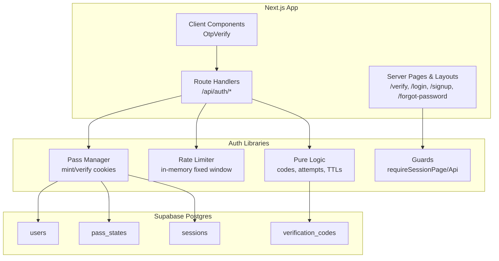

**Diagram sources**
- [specs/authentication/plan.md:10-24](file://specs/authentication/plan.md#L10-L24)
- [supabase/migrations/0002_auth.sql:7-61](file://supabase/migrations/0002_auth.sql#L7-L61)
- [lib/auth/pass.ts:1-148](file://lib/auth/pass.ts#L1-L148)
- [lib/auth/guards.ts:1-38](file://lib/auth/guards.ts#L1-L38)
- [lib/auth/rate-limit.ts:1-53](file://lib/auth/rate-limit.ts#L1-L53)
- [lib/auth/logic.ts:1-127](file://lib/auth/logic.ts#L1-L127)

**Section sources**
- [specs/authentication/plan.md:10-24](file://specs/authentication/plan.md#L10-L24)
- [supabase/migrations/0002_auth.sql:7-61](file://supabase/migrations/0002_auth.sql#L7-L61)

## Core Components
- State-backed JWTs: Every pass is an HS256 JWT whose jti maps to a Postgres row carrying mutable truth (consumed, dead, stage, wrong totals). Three httpOnly cookies map 1:1 to pass types: verify, reset, session.
- Password storage: bcrypt with cost factor 10; unknown-email login uses a dummy hash compare to equalize timing.
- Code lifecycle: 6-digit codes hashed with SHA-256, last-code-wins via void-on-issue, per-code wrong count kills code at 5, cumulative per-pass wrong total kills pass at 10, resend cooldown enforced server-side.
- Session management: 7-day sessions stored as rows; logout revokes one session row; multiple simultaneous sessions allowed; reset kills all sessions.
- Route protection: Server layouts redirect guests to login and signed-in users away from auth pages; data APIs require a valid session pass.
- Rate limiting: In-memory fixed-window counters keyed by IP and account/email with pinned windows per endpoint.

**Section sources**
- [adrs/0003-auth-pass-architecture.md:13-39](file://adrs/0003-auth-pass-architecture.md#L13-L39)
- [specs/authentication/spec.md:33-77](file://specs/authentication/spec.md#L33-L77)
- [specs/authentication/plan.md:43-49](file://specs/authentication/plan.md#L43-L49)
- [lib/auth/pass.ts:15-28](file://lib/auth/pass.ts#L15-L28)
- [lib/auth/logic.ts:7-10](file://lib/auth/logic.ts#L7-L10)
- [lib/auth/rate-limit.ts:12-25](file://lib/auth/rate-limit.ts#L12-L25)

## Architecture Overview
The system enforces strict isolation between pass types and backs every JWT with a database row. Verification and reset flows use a shared OTP screen gated by the appropriate pass cookie. Login issues either a verify pass (unverified accounts) or a session pass (verified accounts). All protected routes and APIs validate sessions server-side.

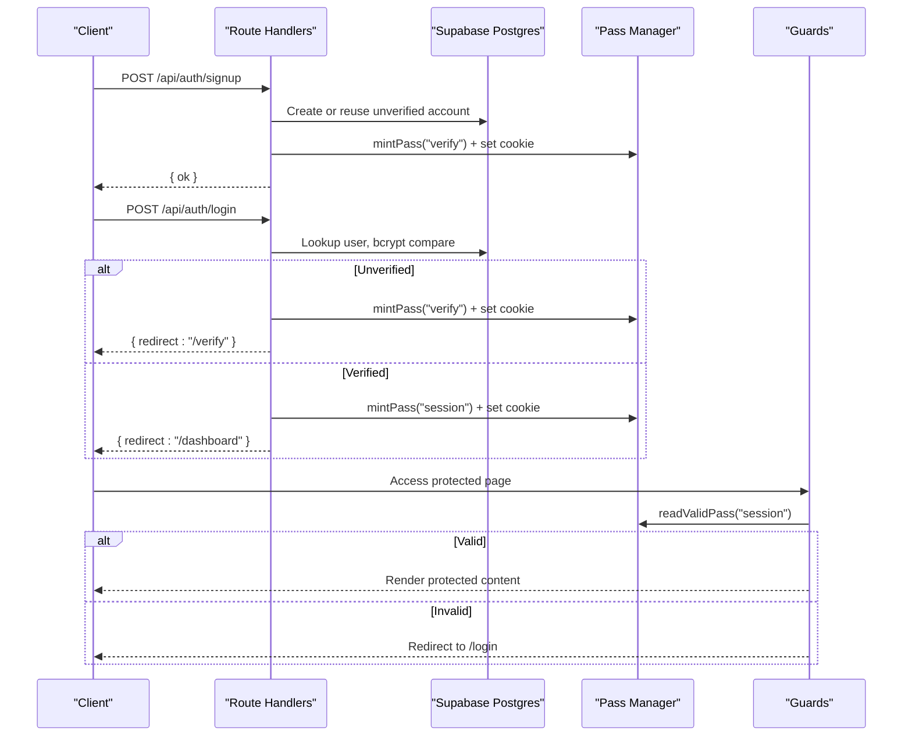

**Diagram sources**
- [app/api/auth/signup/route.ts:27-119](file://app/api/auth/signup/route.ts#L27-L119)
- [app/api/auth/login/route.ts:41-112](file://app/api/auth/login/route.ts#L41-L112)
- [lib/auth/pass.ts:111-148](file://lib/auth/pass.ts#L111-L148)
- [lib/auth/guards.ts:18-37](file://lib/auth/guards.ts#L18-L37)

## Detailed Component Analysis

### Pass Manager (JWT + Cookie + Row State)
- Issues HS256 tokens with claims sub, email, typ, jti, iat, exp.
- Persists a row in pass_states for verify/reset or sessions for session passes.
- Validates by verifying signature, matching typ, checking row not consumed/dead/expired, and ensuring account exists.
- Sets httpOnly cookies with correct TTLs per kind.

```mermaid
classDiagram
class PassManager {
+signPassToken(claims, ttl) string
+mintPass(kind, input) {token, jti, expiresAt}
+readValidPass(kind) VerifiedPass|null
+setPassCookie(kind, token) void
+clearPassCookies(...kinds) void
}
class PassClaims {
+string sub
+string email
+PassKind typ
+string jti
}
class PassStateRow {
+string jti
+string kind
+string email
+string|uuid account_id
+string stage
+int wrong_total
+timestamptz consumed_at
+timestamptz dead_at
+timestamptz expires_at
}
class SessionRow {
+string id
+string account_id
+timestamptz expires_at
+timestamptz revoked_at
}
PassManager --> PassClaims : "creates"
PassManager --> PassStateRow : "persists"
PassManager --> SessionRow : "persists"
```

**Diagram sources**
- [lib/auth/pass.ts:32-62](file://lib/auth/pass.ts#L32-L62)
- [lib/auth/pass.ts:91-148](file://lib/auth/pass.ts#L91-L148)
- [lib/auth/pass.ts:196-232](file://lib/auth/pass.ts#L196-L232)

**Section sources**
- [lib/auth/pass.ts:1-264](file://lib/auth/pass.ts#L1-L264)

### Route Guards
- requireSessionPage(): redirects guests to /login.
- requireGuestPage(): redirects signed-in users to /dashboard.
- requireSessionApi(): returns null on invalid session so handlers can return 401.

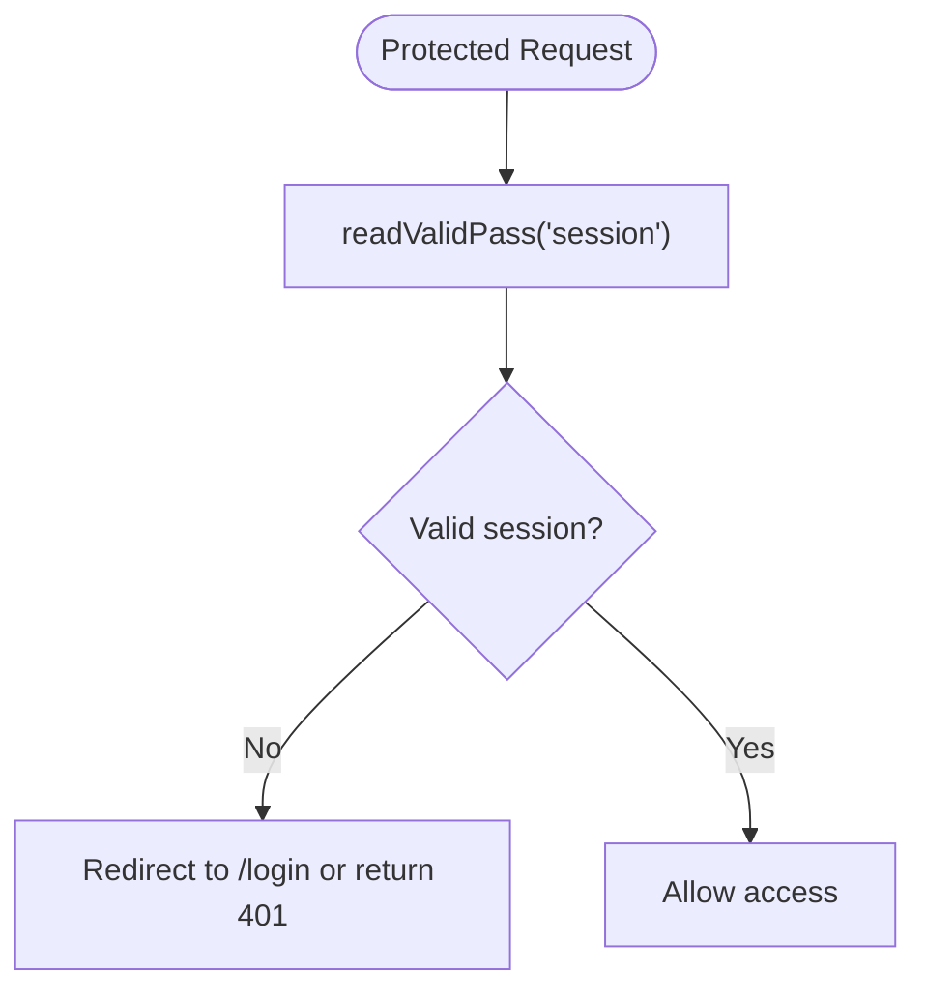

**Diagram sources**
- [lib/auth/guards.ts:18-37](file://lib/auth/guards.ts#L18-L37)
- [lib/auth/pass.ts:196-232](file://lib/auth/pass.ts#L196-L232)

**Section sources**
- [lib/auth/guards.ts:1-38](file://lib/auth/guards.ts#L1-L38)

### Rate Limiting
- Dual-dimension limits: per-IP and per-account/email.
- Fixed-window counters in-process Map; windows pinned per endpoint.
- Breach returns uniform 429 error.

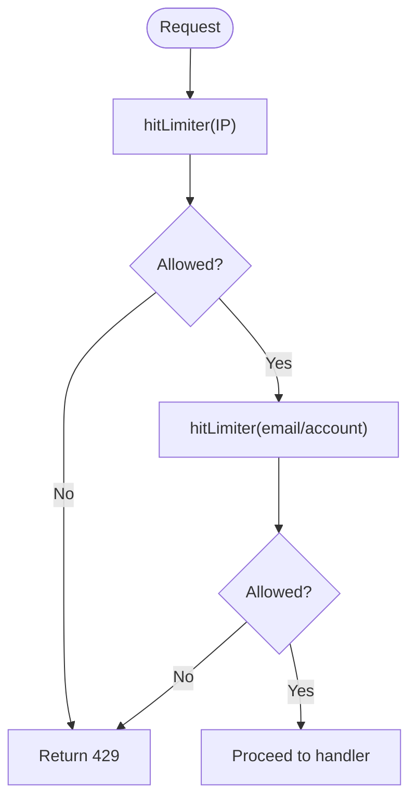

**Diagram sources**
- [lib/auth/rate-limit.ts:12-47](file://lib/auth/rate-limit.ts#L12-L47)
- [app/api/auth/login/route.ts:49-64](file://app/api/auth/login/route.ts#L49-L64)

**Section sources**
- [lib/auth/rate-limit.ts:1-53](file://lib/auth/rate-limit.ts#L1-L53)

### Code Lifecycle and Attempts
- Codes are 6 digits, hashed with SHA-256, last-code-wins via void-on-issue.
- Per-code wrong_count kills code at 5; cumulative per-pass wrong_total kills pass at 10.
- Resend cooldown enforced server-side against newest non-voided code created_at.

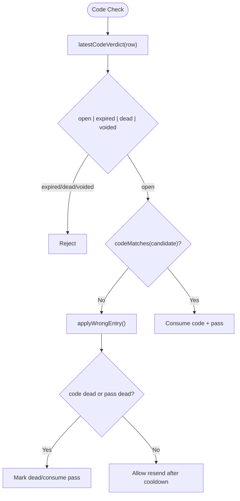

**Diagram sources**
- [lib/auth/logic.ts:52-93](file://lib/auth/logic.ts#L52-L93)
- [lib/auth/logic.ts:95-105](file://lib/auth/logic.ts#L95-L105)

**Section sources**
- [lib/auth/logic.ts:1-127](file://lib/auth/logic.ts#L1-L127)

### Database Schema and Relationships
- users: primary account table with email_verified flag and password_hash.
- pass_states: tracks verify/reset pass lifecycle and attempt accounting.
- verification_codes: stores hashed codes with purpose isolation and last-code-wins semantics.
- sessions: tracks active sessions with revocation support.

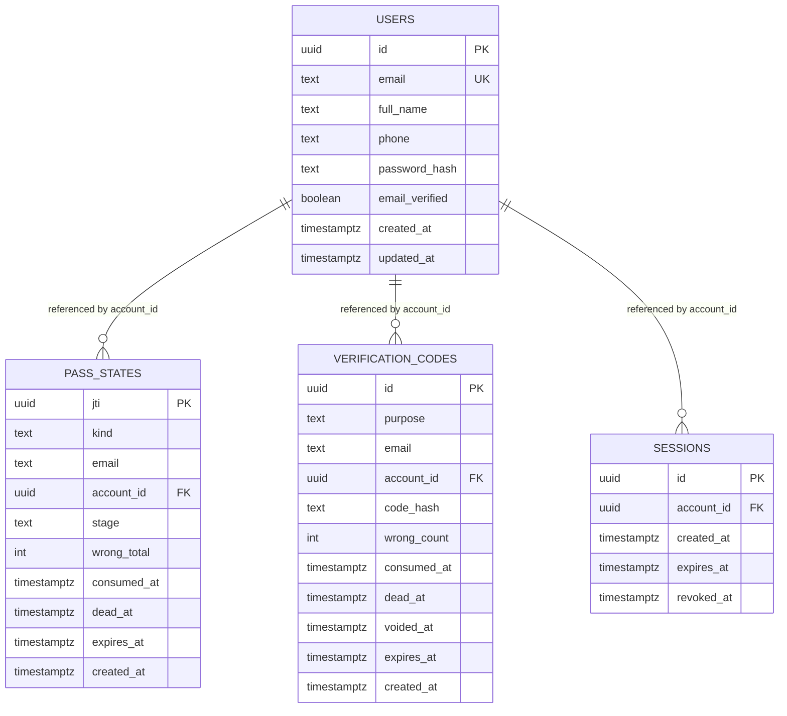

**Diagram sources**
- [supabase/migrations/0002_auth.sql:7-61](file://supabase/migrations/0002_auth.sql#L7-L61)

**Section sources**
- [supabase/migrations/0002_auth.sql:1-61](file://supabase/migrations/0002_auth.sql#L1-L61)

### Authentication Flows

#### Registration and Email Verification
- Signup creates or reuses an unverified account, issues a verification code and a verify pass, sets the verify cookie, and optionally reveals demo code under FR17 conditions.
- Shared OTP screen verifies the code, consumes both code and pass, marks account verified, and directs to login.

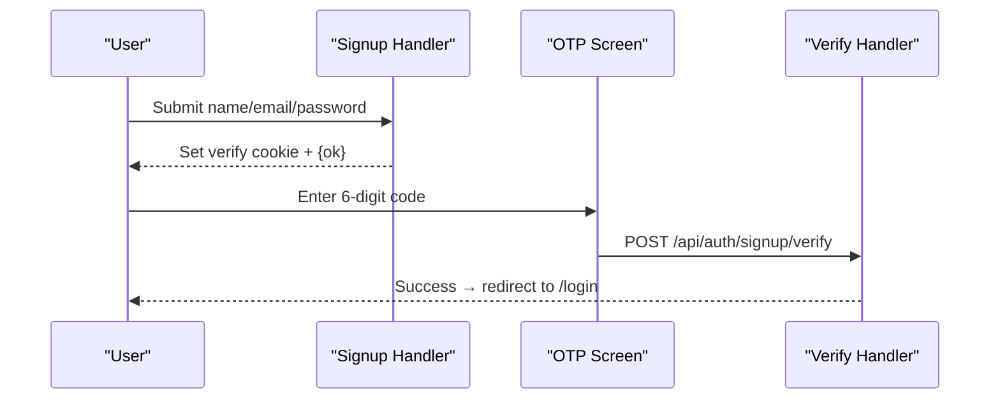

**Diagram sources**
- [app/api/auth/signup/route.ts:27-119](file://app/api/auth/signup/route.ts#L27-L119)
- [components/auth/otp-verify.tsx:95-112](file://components/auth/otp-verify.tsx#L95-L112)

**Section sources**
- [app/api/auth/signup/route.ts:27-119](file://app/api/auth/signup/route.ts#L27-L119)
- [components/auth/otp-verify.tsx:1-321](file://components/auth/otp-verify.tsx#L1-L321)

#### Login and Session Management
- Login validates credentials; if unverified, issues a verify pass and redirects to /verify; if verified, issues a session pass and clears verify/reset cookies.
- Logout revokes the current session row and clears the cookie.

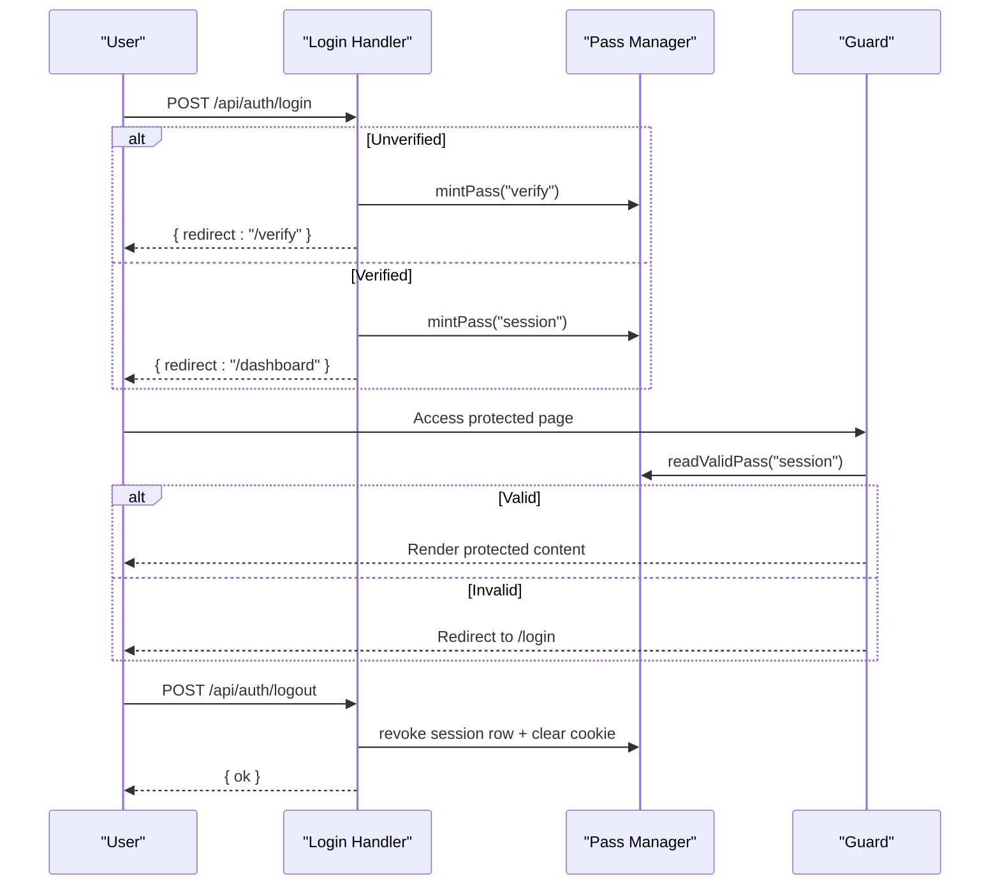

**Diagram sources**
- [app/api/auth/login/route.ts:41-112](file://app/api/auth/login/route.ts#L41-L112)
- [app/api/auth/logout/route.ts:10-30](file://app/api/auth/logout/route.ts#L10-L30)
- [lib/auth/pass.ts:196-232](file://lib/auth/pass.ts#L196-L232)
- [lib/auth/guards.ts:18-37](file://lib/auth/guards.ts#L18-L37)

**Section sources**
- [app/api/auth/login/route.ts:1-112](file://app/api/auth/login/route.ts#L1-L112)
- [app/api/auth/logout/route.ts:1-30](file://app/api/auth/logout/route.ts#L1-L30)

#### Password Reset Flow
- Forgot-password always issues a reset pass (email-only) and sends a code only for known emails; responses remain byte-identical.
- Reset verification binds account_id to the pass row and flips stage to code_verified.
- Setting a new password hashes the password, marks unverified accounts verified, voids reset codes/passes, and kills all sessions.

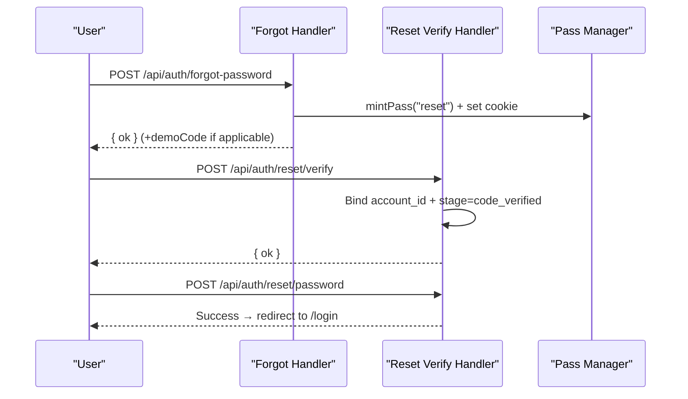

**Diagram sources**
- [app/api/auth/forgot-password/route.ts:21-82](file://app/api/auth/forgot-password/route.ts#L21-L82)
- [app/api/auth/reset/verify/route.ts:11-51](file://app/api/auth/reset/verify/route.ts#L11-L51)

**Section sources**
- [app/api/auth/forgot-password/route.ts:1-82](file://app/api/auth/forgot-password/route.ts#L1-L82)
- [app/api/auth/reset/verify/route.ts:1-51](file://app/api/auth/reset/verify/route.ts#L1-L51)

### Security Boundaries and Measures
- Token validation: signature, type match, row state checks, account existence.
- Password hashing: bcrypt with cost 10; dummy-hash compare for unknown emails.
- Enumeration resistance: identical error bodies and comparable latency for unknown vs wrong credentials; forgot-password issues a reset pass regardless of account existence.
- Transport security: httpOnly cookies, Secure in production, SameSite=Lax.
- Rate limiting: dual-dimension limits prevent brute-force and network-wide lockouts.

**Section sources**
- [specs/authentication/spec.md:52-77](file://specs/authentication/spec.md#L52-L77)
- [specs/authentication/plan.md:43-49](file://specs/authentication/plan.md#L43-L49)
- [lib/auth/pass.ts:64-89](file://lib/auth/pass.ts#L64-L89)
- [app/api/auth/login/route.ts:26-81](file://app/api/auth/login/route.ts#L26-L81)

## Dependency Analysis
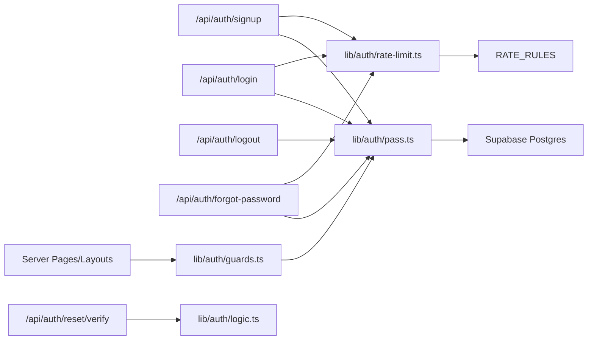

**Diagram sources**
- [app/api/auth/signup/route.ts:27-119](file://app/api/auth/signup/route.ts#L27-L119)
- [app/api/auth/login/route.ts:41-112](file://app/api/auth/login/route.ts#L41-L112)
- [app/api/auth/logout/route.ts:10-30](file://app/api/auth/logout/route.ts#L10-L30)
- [app/api/auth/forgot-password/route.ts:21-82](file://app/api/auth/forgot-password/route.ts#L21-L82)
- [app/api/auth/reset/verify/route.ts:11-51](file://app/api/auth/reset/verify/route.ts#L11-L51)
- [lib/auth/pass.ts:111-232](file://lib/auth/pass.ts#L111-L232)
- [lib/auth/guards.ts:18-37](file://lib/auth/guards.ts#L18-L37)
- [lib/auth/rate-limit.ts:12-47](file://lib/auth/rate-limit.ts#L12-L47)

**Section sources**
- [specs/authentication/plan.md:130-183](file://specs/authentication/plan.md#L130-L183)

## Performance Considerations
- In-memory rate limiter resets on restart and does not span instances; acceptable for single-instance demo. Redis is the upgrade path.
- bcrypt cost factor 10 balances security and performance; dummy-hash compare equalizes timing without extra sleeps.
- Last-code-wins via void-on-issue avoids contention storms by marking prior codes void rather than scanning many rows.
- Session rows survive restarts; logout revokes one row instantly.

[No sources needed since this section provides general guidance]

## Troubleshooting Guide
Common issues and resolutions:
- Expired or invalid session: ensure cookie present, signature valid, typ matches, row not consumed/dead/expired, account exists. Any failure redirects to /login or returns 401.
- Code rejected: check latest code verdict (expired, dead, voided), per-code wrong count, and cumulative pass wrong total.
- Resend blocked: enforce 60-second cooldown against newest non-voided code created_at.
- Demo mode: codes render only when SMTP is unconfigured and DEMO_MODE=true; otherwise no code is shown anywhere.

**Section sources**
- [lib/auth/pass.ts:196-232](file://lib/auth/pass.ts#L196-L232)
- [lib/auth/logic.ts:52-105](file://lib/auth/logic.ts#L52-L105)
- [specs/authentication/spec.md:108-130](file://specs/authentication/spec.md#L108-L130)

## Conclusion
The authentication architecture combines state-backed JWTs, robust code lifecycle management, and strict route guards to deliver secure, scalable sign-up, login, and recovery flows. Supabase Postgres tables provide durable state for passes and sessions, while in-memory rate limiting protects endpoints during the demo phase. The design ensures enumeration resistance, consistent error behavior, and clear separation of concerns across handlers, libraries, and UI components.

[No sources needed since this section summarizes without analyzing specific files]

## Appendices

### Authentication State Transitions
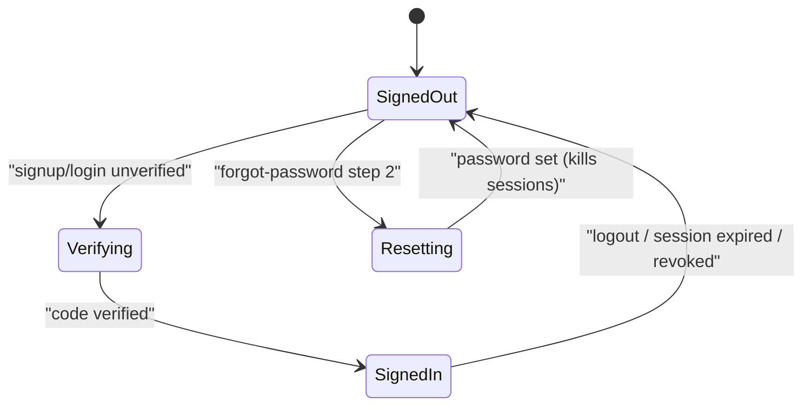

**Diagram sources**
- [specs/authentication/spec.md:52-77](file://specs/authentication/spec.md#L52-L77)
- [lib/auth/pass.ts:196-232](file://lib/auth/pass.ts#L196-L232)

### Token Lifecycle
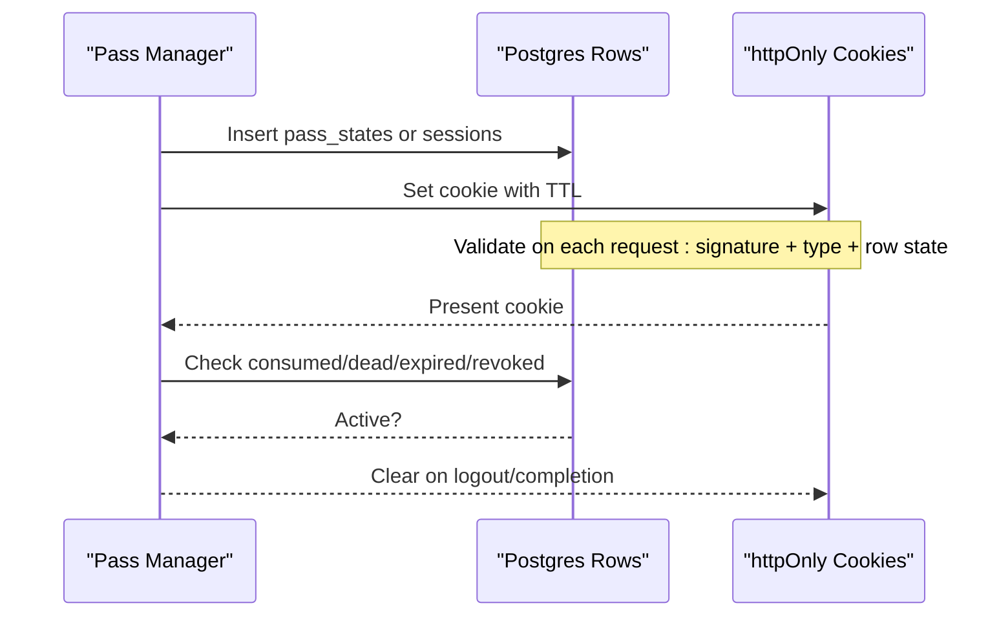

**Diagram sources**
- [lib/auth/pass.ts:111-148](file://lib/auth/pass.ts#L111-L148)
- [lib/auth/pass.ts:196-232](file://lib/auth/pass.ts#L196-L232)