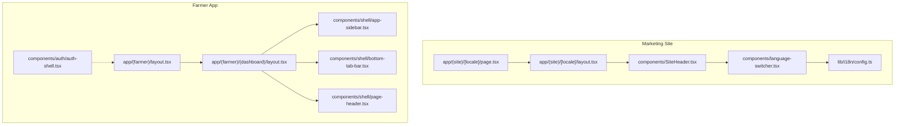
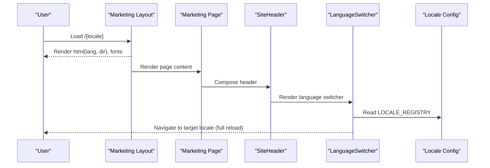
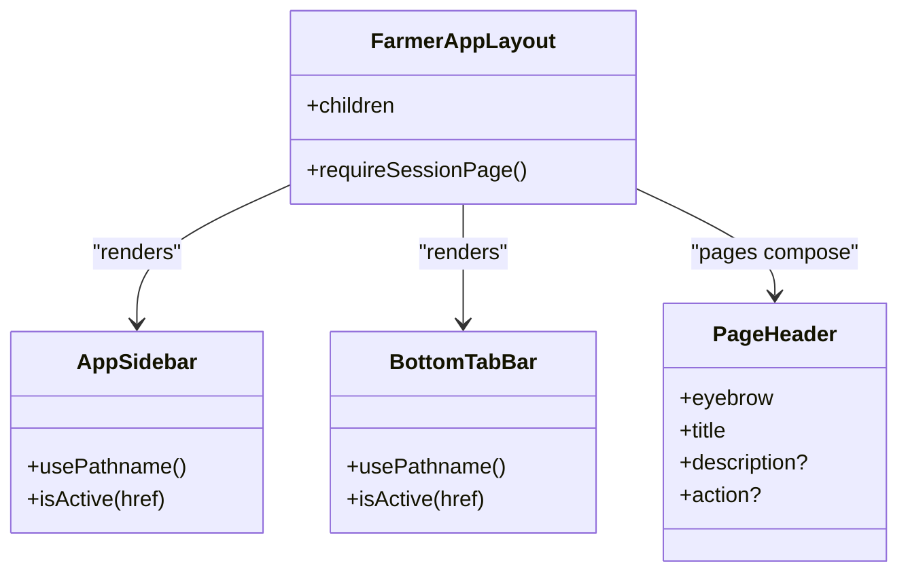
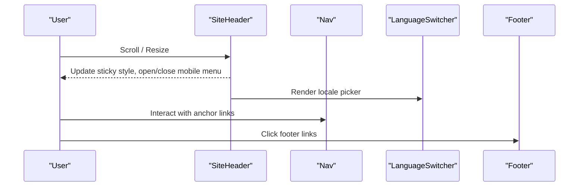
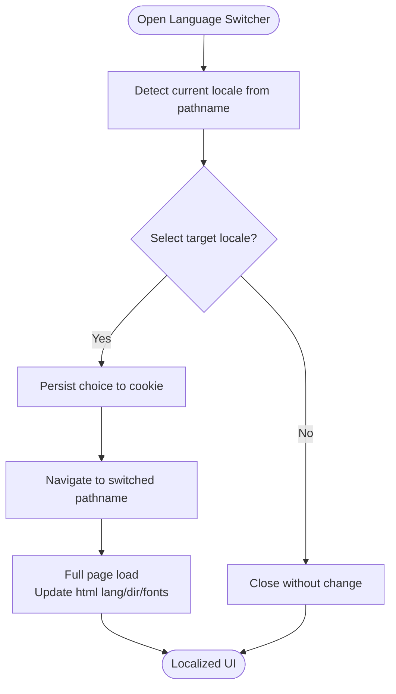
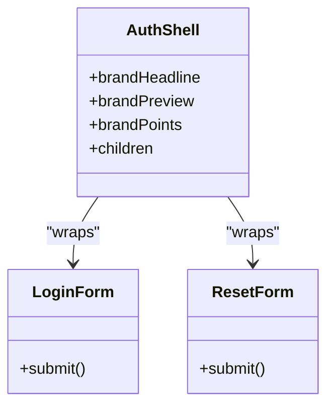
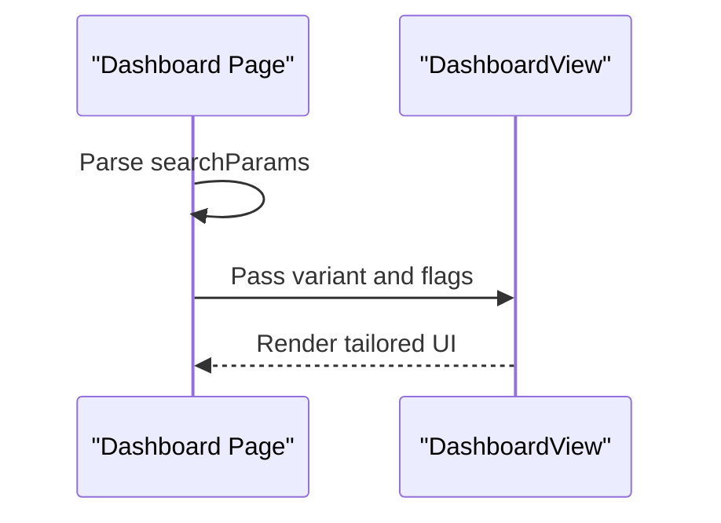
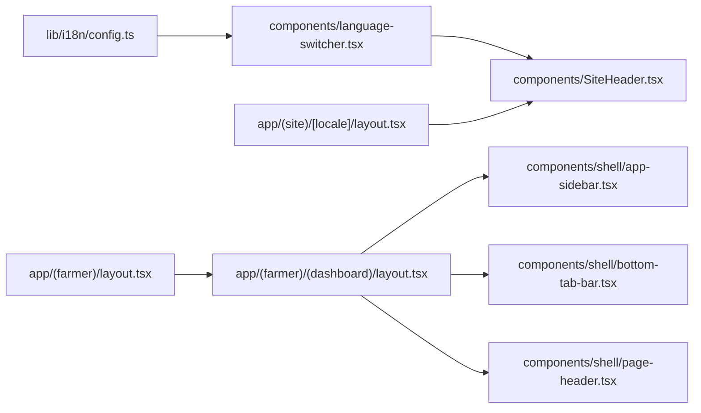

# Component Hierarchy

<cite>
**Referenced Files in This Document**
- [app/(farmer)/layout.tsx](file://app/(farmer)/layout.tsx)
- [app/(site)/[locale]/layout.tsx](file://app/(site)/[locale]/layout.tsx)
- [app/(farmer)/(dashboard)/layout.tsx](file://app/(farmer)/(dashboard)/layout.tsx)
- [components/shell/app-sidebar.tsx](file://components/shell/app-sidebar.tsx)
- [components/shell/bottom-tab-bar.tsx](file://components/shell/bottom-tab-bar.tsx)
- [components/shell/page-header.tsx](file://components/shell/page-header.tsx)
- [components/SiteHeader.tsx](file://components/SiteHeader.tsx)
- [components/Nav.tsx](file://components/Nav.tsx)
- [components/Footer.tsx](file://components/Footer.tsx)
- [components/language-switcher.tsx](file://components/language-switcher.tsx)
- [lib/i18n/config.ts](file://lib/i18n/config.ts)
- [app/(site)/[locale]/page.tsx](file://app/(site)/[locale]/page.tsx)
- [app/(farmer)/(dashboard)/dashboard/page.tsx](file://app/(farmer)/(dashboard)/dashboard/page.tsx)
- [components/auth/auth-shell.tsx](file://components/auth/auth-shell.tsx)
</cite>

## Table of Contents
1. Introduction
2. Project Structure
3. Core Components
4. Architecture Overview
5. Detailed Component Analysis
6. Dependency Analysis
7. Performance Considerations
8. Troubleshooting Guide
9. Conclusion

## Introduction
This document explains the React component hierarchy and organization in a Next.js application that serves two distinct experiences:
- A marketing site under app/(site)/[locale] with internationalization and localized layouts.
- A farmer application under app/(farmer) with authenticated pages, a desktop sidebar, and a mobile bottom tab bar.

It covers layout composition, shell components for consistent UI structure, separation between marketing and farmer screens, prop drilling versus context usage, responsive design patterns, and accessibility implementation at the component level.

## Project Structure
The project uses Next.js App Router route groups to separate concerns:
- Marketing site: app/(site)/[locale] provides locale-aware layouts, fonts, and metadata. It renders localized content via server functions and page components.
- Farmer app: app/(farmer) defines the root HTML/body for the app shell and enforces authentication before rendering dashboard sections. The dashboard group adds the persistent navigation chrome (sidebar on desktop, tabs on mobile).

**Diagram sources**
- [app/(site)/[locale]/layout.tsx:1-88](file://app/(site)/[locale]/layout.tsx#L1-L88)
- [app/(site)/[locale]/page.tsx:1-8](file://app/(site)/[locale]/page.tsx#L1-L8)
- [components/SiteHeader.tsx:1-257](file://components/SiteHeader.tsx#L1-L257)
- [components/language-switcher.tsx:1-120](file://components/language-switcher.tsx#L1-L120)
- [lib/i18n/config.ts:1-137](file://lib/i18n/config.ts#L1-L137)
- [app/(farmer)/layout.tsx:1-48](file://app/(farmer)/layout.tsx#L1-L48)
- [app/(farmer)/(dashboard)/layout.tsx:1-26](file://app/(farmer)/(dashboard)/layout.tsx#L1-L26)
- [components/shell/app-sidebar.tsx:1-98](file://components/shell/app-sidebar.tsx#L1-L98)
- [components/shell/bottom-tab-bar.tsx:1-70](file://components/shell/bottom-tab-bar.tsx#L1-L70)
- [components/shell/page-header.tsx:1-42](file://components/shell/page-header.tsx#L1-L42)
- [components/auth/auth-shell.tsx:1-90](file://components/auth/auth-shell.tsx#L1-L90)

**Section sources**
- [app/(site)/[locale]/layout.tsx:1-88](file://app/(site)/[locale]/layout.tsx#L1-L88)
- [app/(farmer)/layout.tsx:1-48](file://app/(farmer)/layout.tsx#L1-L48)
- [app/(farmer)/(dashboard)/layout.tsx:1-26](file://app/(farmer)/(dashboard)/layout.tsx#L1-L26)

## Core Components
- Layouts
  - Marketing site layout sets fonts, viewport, and language/direction based on locale. It also conditionally renders a suggestion chip for English-only contexts.
  - Farmer app root layout sets global fonts and body structure for the authenticated experience.
  - Dashboard layout composes the app shell: desktop sidebar, main content area, and mobile bottom tab bar. It enforces session requirements before rendering.

- Shell components
  - AppSidebar: Desktop navigation rail with active state and branding.
  - BottomTabBar: Mobile navigation with five primary tabs and accessible current-page indicators.
  - PageHeader: Reusable header with eyebrow label, title, description, and optional action.
  - AuthShell: Split-panel brand + form container used by auth flows.

- Marketing site components
  - SiteHeader: Sticky header with responsive menu, language switcher, and CTAs.
  - Nav: Lightweight landing header with anchor links and mobile drawer.
  - Footer: Branding, links, and legal copy.

- Internationalization
  - LanguageSwitcher: Client-side locale picker that persists choice and navigates to the correct locale path.
  - Locale config: Central registry of supported locales, directions, and display names.

**Section sources**
- [app/(site)/[locale]/layout.tsx:1-88](file://app/(site)/[locale]/layout.tsx#L1-L88)
- [app/(farmer)/layout.tsx:1-48](file://app/(farmer)/layout.tsx#L1-L48)
- [app/(farmer)/(dashboard)/layout.tsx:1-26](file://app/(farmer)/(dashboard)/layout.tsx#L1-L26)
- [components/shell/app-sidebar.tsx:1-98](file://components/shell/app-sidebar.tsx#L1-L98)
- [components/shell/bottom-tab-bar.tsx:1-70](file://components/shell/bottom-tab-bar.tsx#L1-L70)
- [components/shell/page-header.tsx:1-42](file://components/shell/page-header.tsx#L1-L42)
- [components/auth/auth-shell.tsx:1-90](file://components/auth/auth-shell.tsx#L1-L90)
- [components/SiteHeader.tsx:1-257](file://components/SiteHeader.tsx#L1-L257)
- [components/Nav.tsx:1-99](file://components/Nav.tsx#L1-L99)
- [components/Footer.tsx:1-54](file://components/Footer.tsx#L1-L54)
- [components/language-switcher.tsx:1-120](file://components/language-switcher.tsx#L1-L120)
- [lib/i18n/config.ts:1-137](file://lib/i18n/config.ts#L1-L137)

## Architecture Overview
The application is split into two top-level shells:
- Marketing site: Uses a locale-aware layout to set <html> attributes and fonts. Pages compose SiteHeader, content sections, and Footer. Language switching triggers full navigation to update lang/dir and fonts.
- Farmer app: Uses an authenticated layout that injects the sidebar and bottom tabs around page content. Pages can reuse PageHeader for consistent headings.

**Diagram sources**
- [app/(site)/[locale]/layout.tsx:1-88](file://app/(site)/[locale]/layout.tsx#L1-L88)
- [app/(site)/[locale]/page.tsx:1-8](file://app/(site)/[locale]/page.tsx#L1-L8)
- [components/SiteHeader.tsx:1-257](file://components/SiteHeader.tsx#L1-L257)
- [components/language-switcher.tsx:1-120](file://components/language-switcher.tsx#L1-L120)
- [lib/i18n/config.ts:1-137](file://lib/i18n/config.ts#L1-L137)

## Detailed Component Analysis

### Farmer App Shell
The farmer app shell ensures consistent navigation and content framing across all authenticated pages.

- Authentication gate: The dashboard layout calls a session guard before rendering, ensuring guests are redirected.
- Responsive chrome: Desktop shows a fixed left sidebar; mobile shows a fixed bottom tab bar. Both use active-state logic derived from the current pathname.
- Content area: Main content is constrained and padded for readability across screen sizes.

**Diagram sources**
- [app/(farmer)/(dashboard)/layout.tsx:1-26](file://app/(farmer)/(dashboard)/layout.tsx#L1-L26)
- [components/shell/app-sidebar.tsx:1-98](file://components/shell/app-sidebar.tsx#L1-L98)
- [components/shell/bottom-tab-bar.tsx:1-70](file://components/shell/bottom-tab-bar.tsx#L1-L70)
- [components/shell/page-header.tsx:1-42](file://components/shell/page-header.tsx#L1-L42)

**Section sources**
- [app/(farmer)/(dashboard)/layout.tsx:1-26](file://app/(farmer)/(dashboard)/layout.tsx#L1-L26)
- [components/shell/app-sidebar.tsx:1-98](file://components/shell/app-sidebar.tsx#L1-L98)
- [components/shell/bottom-tab-bar.tsx:1-70](file://components/shell/bottom-tab-bar.tsx#L1-L70)
- [components/shell/page-header.tsx:1-42](file://components/shell/page-header.tsx#L1-L42)

### Marketing Site Header and Navigation
The marketing site uses a sticky header with a responsive menu, integrated language switcher, and clear CTAs.

- Accessibility: Uses aria-expanded, aria-haspopup, aria-label, and semantic nav elements. Mobile menu uses a dialog-like overlay with focus management.
- Responsiveness: Collapses to a slide-out drawer on small screens; desktop shows inline links.
- Localization: Preserves locale prefix for cross-page links and updates <html> attributes via full navigation.

**Diagram sources**
- [components/SiteHeader.tsx:1-257](file://components/SiteHeader.tsx#L1-L257)
- [components/Nav.tsx:1-99](file://components/Nav.tsx#L1-L99)
- [components/language-switcher.tsx:1-120](file://components/language-switcher.tsx#L1-L120)

**Section sources**
- [components/SiteHeader.tsx:1-257](file://components/SiteHeader.tsx#L1-L257)
- [components/Nav.tsx:1-99](file://components/Nav.tsx#L1-L99)
- [components/Footer.tsx:1-54](file://components/Footer.tsx#L1-L54)

### Internationalization Flow
The language switcher drives locale changes by navigating to the appropriate URL, which re-renders the layout with updated <html> attributes and fonts.

**Diagram sources**
- [components/language-switcher.tsx:1-120](file://components/language-switcher.tsx#L1-L120)
- [lib/i18n/config.ts:1-137](file://lib/i18n/config.ts#L1-L137)
- [app/(site)/[locale]/layout.tsx:1-88](file://app/(site)/[locale]/layout.tsx#L1-L88)

**Section sources**
- [components/language-switcher.tsx:1-120](file://components/language-switcher.tsx#L1-L120)
- [lib/i18n/config.ts:1-137](file://lib/i18n/config.ts#L1-L137)
- [app/(site)/[locale]/layout.tsx:1-88](file://app/(site)/[locale]/layout.tsx#L1-L88)

### Auth Shell Composition
Auth flows share a split-panel shell that presents branding on the left (desktop) and forms on the right. On smaller screens, it collapses to a single column with a compact logo header.

- Consistency: Provides uniform visual identity and spacing across password-related screens.
- Accessibility: Uses semantic landmarks and alt text for logos; decorative SVGs are hidden from assistive tech.

**Diagram sources**
- [components/auth/auth-shell.tsx:1-90](file://components/auth/auth-shell.tsx#L1-L90)

**Section sources**
- [components/auth/auth-shell.tsx:1-90](file://components/auth/auth-shell.tsx#L1-L90)

### Page Composition Example: Dashboard
A dashboard page composes its view with variants controlled by search parameters.

**Diagram sources**
- [app/(farmer)/(dashboard)/dashboard/page.tsx:1-26](file://app/(farmer)/(dashboard)/dashboard/page.tsx#L1-L26)

**Section sources**
- [app/(farmer)/(dashboard)/dashboard/page.tsx:1-26](file://app/(farmer)/(dashboard)/dashboard/page.tsx#L1-L26)

## Dependency Analysis
Key dependencies and relationships:
- Layouts depend on font registration and i18n configuration to render correct <html> attributes.
- Shell components depend on Next.js navigation hooks for active states and routing.
- Marketing header depends on the language switcher, which reads from the locale registry.
- Farmer app layout depends on an authentication guard to protect routes.

**Diagram sources**
- [lib/i18n/config.ts:1-137](file://lib/i18n/config.ts#L1-L137)
- [components/language-switcher.tsx:1-120](file://components/language-switcher.tsx#L1-L120)
- [components/SiteHeader.tsx:1-257](file://components/SiteHeader.tsx#L1-L257)
- [app/(site)/[locale]/layout.tsx:1-88](file://app/(site)/[locale]/layout.tsx#L1-L88)
- [app/(farmer)/layout.tsx:1-48](file://app/(farmer)/layout.tsx#L1-L48)
- [app/(farmer)/(dashboard)/layout.tsx:1-26](file://app/(farmer)/(dashboard)/layout.tsx#L1-L26)
- [components/shell/app-sidebar.tsx:1-98](file://components/shell/app-sidebar.tsx#L1-L98)
- [components/shell/bottom-tab-bar.tsx:1-70](file://components/shell/bottom-tab-bar.tsx#L1-L70)
- [components/shell/page-header.tsx:1-42](file://components/shell/page-header.tsx#L1-L42)

**Section sources**
- [lib/i18n/config.ts:1-137](file://lib/i18n/config.ts#L1-L137)
- [components/language-switcher.tsx:1-120](file://components/language-switcher.tsx#L1-L120)
- [components/SiteHeader.tsx:1-257](file://components/SiteHeader.tsx#L1-L257)
- [app/(site)/[locale]/layout.tsx:1-88](file://app/(site)/[locale]/layout.tsx#L1-L88)
- [app/(farmer)/layout.tsx:1-48](file://app/(farmer)/layout.tsx#L1-L48)
- [app/(farmer)/(dashboard)/layout.tsx:1-26](file://app/(farmer)/(dashboard)/layout.tsx#L1-L26)
- [components/shell/app-sidebar.tsx:1-98](file://components/shell/app-sidebar.tsx#L1-L98)
- [components/shell/bottom-tab-bar.tsx:1-70](file://components/shell/bottom-tab-bar.tsx#L1-L70)
- [components/shell/page-header.tsx:1-42](file://components/shell/page-header.tsx#L1-L42)

## Performance Considerations
- Fonts: Font variables are attached to <html> only when needed per locale to avoid loading unnecessary font files for English pages.
- Navigation: Language switching performs a full navigation to ensure reliable updates to <html> attributes and fonts.
- Layout stability: Fixed chrome (header/sidebar/tabs) reserves space for safe areas and avoids layout shifts during interactions.
- Rendering: Pages read dynamic data where necessary; consider caching strategies if traffic increases.

[No sources needed since this section provides general guidance]

## Troubleshooting Guide
- Incorrect language or direction: Verify the locale registry and ensure the layout applies the correct htmlLang and dir. Check that the language switcher navigates to the expected path.
- Active state not updating: Ensure components derive active state from the current pathname and handle nested routes correctly.
- Mobile menu not closing: Confirm event listeners for pointerdown and keydown are attached and removed properly.
- Auth redirects looping: Ensure the session guard runs in the correct layout and redirects to login when unauthenticated.

**Section sources**
- [app/(site)/[locale]/layout.tsx:1-88](file://app/(site)/[locale]/layout.tsx#L1-L88)
- [components/language-switcher.tsx:1-120](file://components/language-switcher.tsx#L1-L120)
- [components/shell/app-sidebar.tsx:1-98](file://components/shell/app-sidebar.tsx#L1-L98)
- [components/shell/bottom-tab-bar.tsx:1-70](file://components/shell/bottom-tab-bar.tsx#L1-L70)
- [app/(farmer)/(dashboard)/layout.tsx:1-26](file://app/(farmer)/(dashboard)/layout.tsx#L1-L26)

## Conclusion
The application cleanly separates marketing and farmer experiences using Next.js route groups and layouts. Shared shell components provide consistent navigation and page headers, while internationalization is centralized and consistently applied. Prop drilling is used sparingly for simple configurations, and client-side state is kept local to components that need it. Responsive design and accessibility are implemented at the component level, ensuring usability across devices and assistive technologies.

[No sources needed since this section summarizes without analyzing specific files]