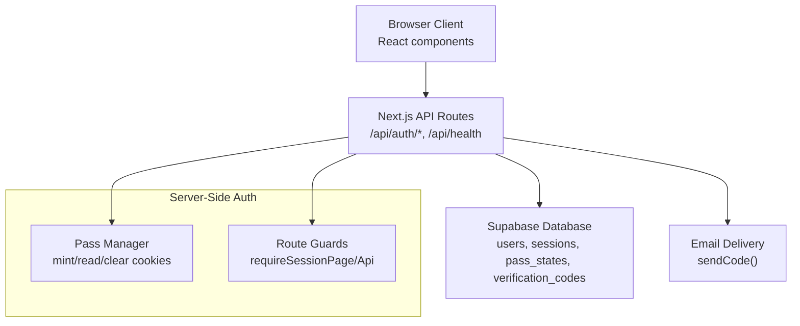
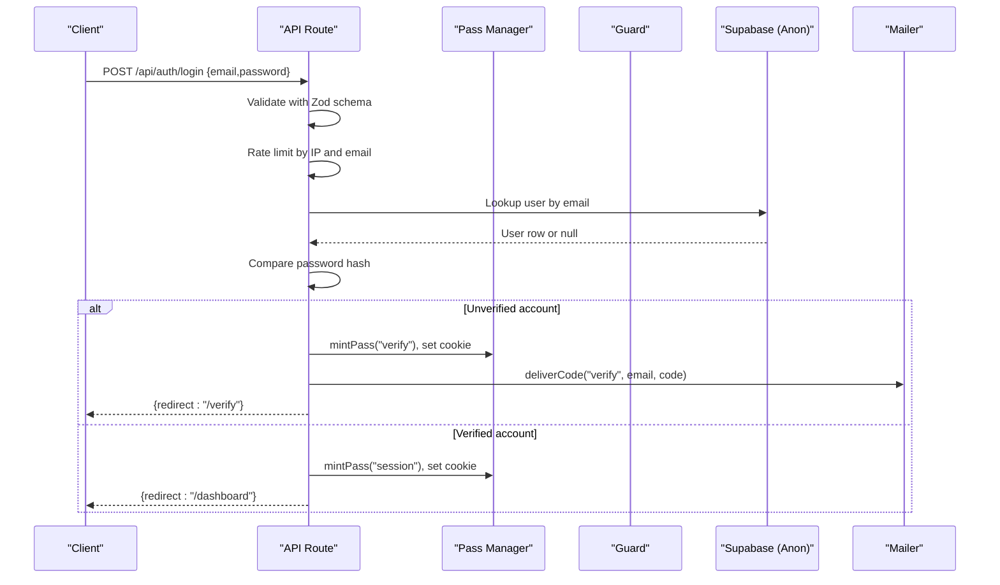
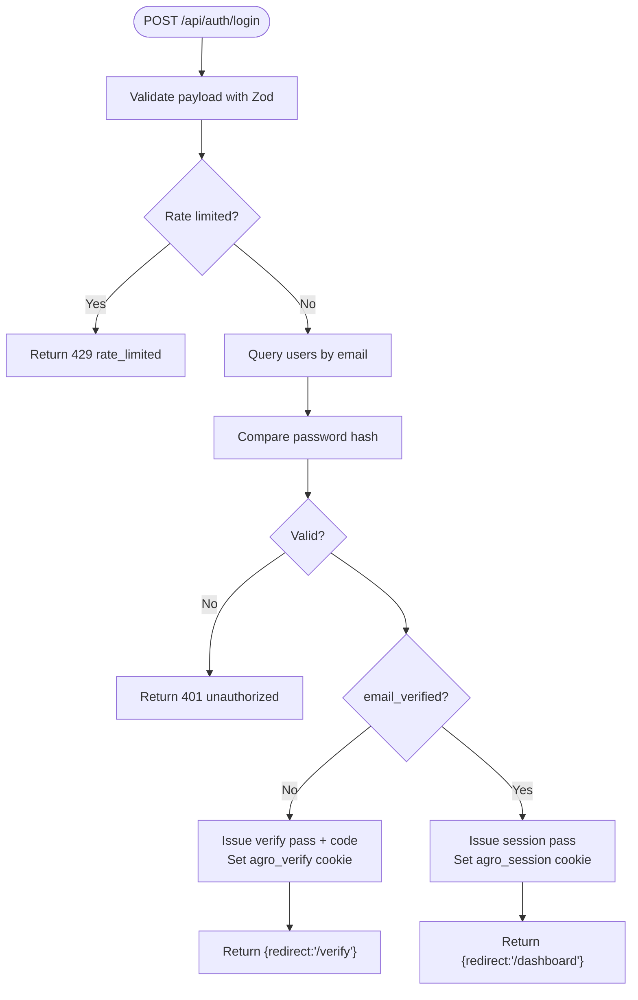
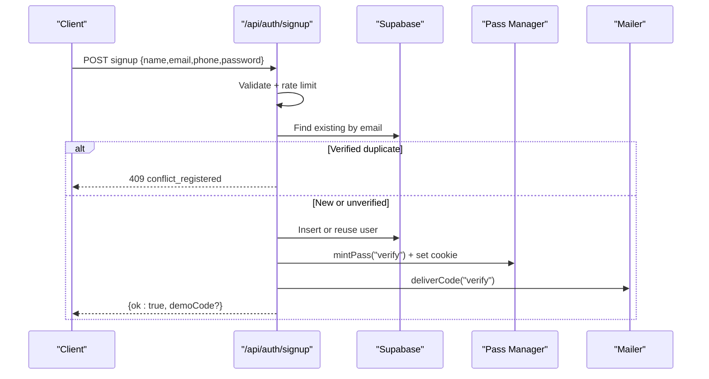
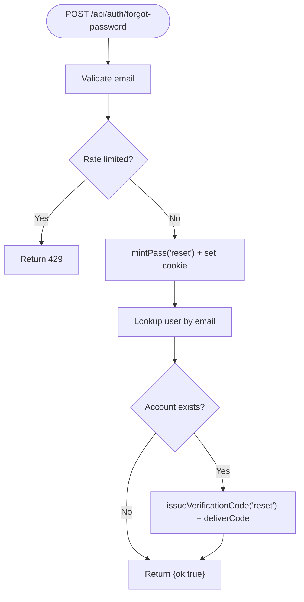
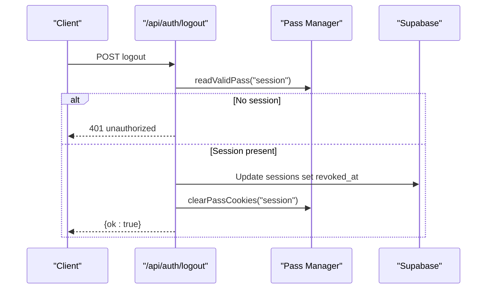
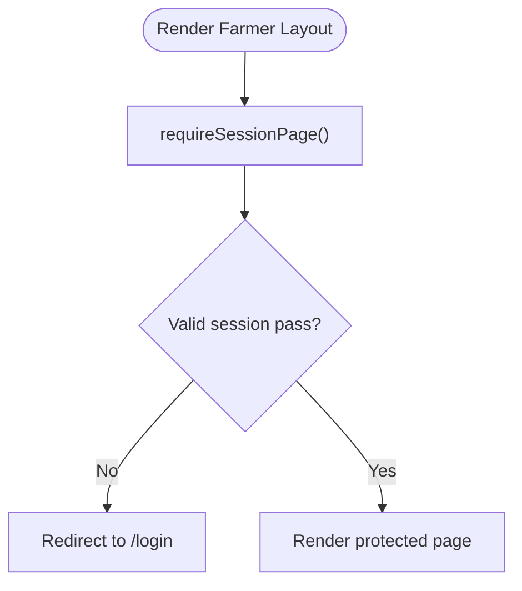
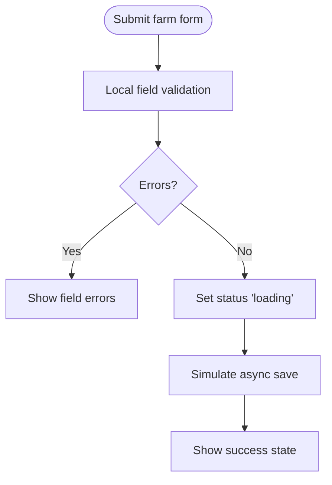
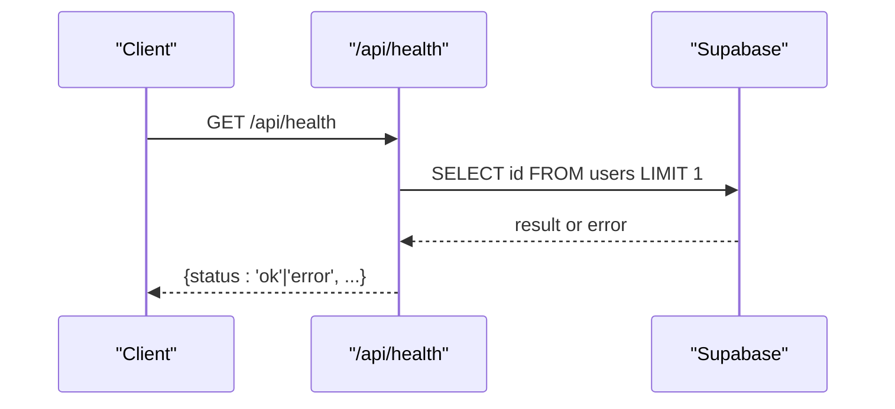
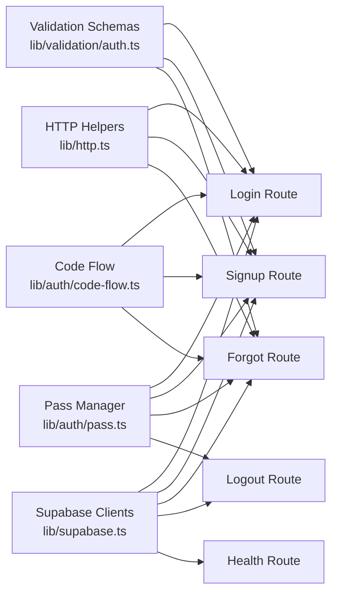

# Data Flow Patterns

<cite>
**Referenced Files in This Document**
- [lib/supabase.ts](file://lib/supabase.ts)
- [lib/http.ts](file://lib/http.ts)
- [lib/auth/pass.ts](file://lib/auth/pass.ts)
- [lib/auth/guards.ts](file://lib/auth/guards.ts)
- [lib/validation/auth.ts](file://lib/validation/auth.ts)
- [lib/auth/code-flow.ts](file://lib/auth/code-flow.ts)
- [app/api/auth/login/route.ts](file://app/api/auth/login/route.ts)
- [app/api/auth/signup/route.ts](file://app/api/auth/signup/route.ts)
- [app/api/auth/forgot-password/route.ts](file://app/api/auth/forgot-password/route.ts)
- [app/api/auth/logout/route.ts](file://app/api/auth/logout/route.ts)
- [app/api/health/route.ts](file://app/api/health/route.ts)
- [app/(farmer)/(dashboard)/layout.tsx](file://app/(farmer)/(dashboard)/layout.tsx)
- [app/(farmer)/forgot-password/forgot-password-flow.tsx](file://app/(farmer)/forgot-password/forgot-password-flow.tsx)
- [app/(farmer)/(dashboard)/dashboard/dashboard-view.tsx](file://app/(farmer)/(dashboard)/dashboard/dashboard-view.tsx)
- [app/(farmer)/(dashboard)/farms/new/farm-form.tsx](file://app/(farmer)/(dashboard)/farms/new/farm-form.tsx)
</cite>

## Table of Contents
1. Introduction
2. Project Structure
3. Core Components
4. Architecture Overview
5. Detailed Component Analysis
6. Dependency Analysis
7. Performance Considerations
8. Troubleshooting Guide
9. Conclusion

## Introduction
This document explains how data flows through the Agropioo application between client components, Next.js API routes, and the Supabase database. It covers request/response patterns, error handling, authentication via a dual client pattern (anon vs service-role), rate limiting, verification codes, session cookies, and UI loading states. It also outlines where real-time updates could be integrated and how to implement optimistic UI safely.

## Project Structure
Agropioo is a Next.js app with:
- Client pages and components under app/(farmer) for authenticated farmer features and app/(site) for marketing pages.
- Server-side API routes under app/api that enforce validation, rate limits, and secure database access.
- Shared libraries under lib for HTTP helpers, Supabase clients, auth pass management, validation schemas, and code issuance.

**Diagram sources**
- [lib/supabase.ts:14-46](file://lib/supabase.ts#L14-L46)
- [lib/http.ts:1-61](file://lib/http.ts#L1-L61)
- [lib/auth/pass.ts:106-264](file://lib/auth/pass.ts#L106-L264)
- [lib/auth/guards.ts:18-37](file://lib/auth/guards.ts#L18-L37)
- [app/api/auth/login/route.ts:41-111](file://app/api/auth/login/route.ts#L41-L111)
- [app/api/auth/signup/route.ts:27-118](file://app/api/auth/signup/route.ts#L27-L118)
- [app/api/auth/forgot-password/route.ts:21-81](file://app/api/auth/forgot-password/route.ts#L21-L81)
- [app/api/auth/logout/route.ts:10-30](file://app/api/auth/logout/route.ts#L10-L30)
- [app/api/health/route.ts:3-17](file://app/api/health/route.ts#L3-L17)

**Section sources**
- [lib/supabase.ts:14-46](file://lib/supabase.ts#L14-L46)
- [lib/http.ts:1-61](file://lib/http.ts#L1-L61)
- [lib/auth/pass.ts:106-264](file://lib/auth/pass.ts#L106-L264)
- [lib/auth/guards.ts:18-37](file://lib/auth/guards.ts#L18-L37)

## Core Components
- Dual Supabase clients:
  - Anon client for server-side queries behind RLS and business logic.
  - Service-role client for trusted maintenance tasks; never exposed to the browser.
- HTTP helpers:
  - Uniform JSON responses and error shapes for all route handlers.
  - IP extraction for rate limiting and safe JSON body parsing.
- Auth passes:
  - JWT-backed httpOnly cookies for verify/reset/session with live state checks against Postgres rows.
- Route guards:
  - Page-level redirect for guests or signed-in users.
  - API-level guard returning standardized 401 when unauthenticated.
- Validation:
  - Shared Zod schemas used by both client forms and server routes to prevent drift.
- Code flow:
  - Last-code-wins issuance, hashing, TTL, and email delivery.

**Section sources**
- [lib/supabase.ts:14-46](file://lib/supabase.ts#L14-L46)
- [lib/http.ts:1-61](file://lib/http.ts#L1-L61)
- [lib/auth/pass.ts:106-264](file://lib/auth/pass.ts#L106-L264)
- [lib/auth/guards.ts:18-37](file://lib/auth/guards.ts#L18-L37)
- [lib/validation/auth.ts:8-87](file://lib/validation/auth.ts#L8-L87)
- [lib/auth/code-flow.ts:15-51](file://lib/auth/code-flow.ts#L15-L51)

## Architecture Overview
The system enforces a strict boundary: no direct client-to-database calls. All data mutations go through Next.js API routes that validate input, apply rate limits, manage sessions and verification codes, and then query Supabase using the anon client. The service-role client is reserved for server-only tasks.

**Diagram sources**
- [app/api/auth/login/route.ts:41-111](file://app/api/auth/login/route.ts#L41-L111)
- [lib/validation/auth.ts:54-57](file://lib/validation/auth.ts#L54-L57)
- [lib/auth/code-flow.ts:15-51](file://lib/auth/code-flow.ts#L15-L51)
- [lib/auth/pass.ts:106-148](file://lib/auth/pass.ts#L106-L148)

## Detailed Component Analysis

### Authentication: Login
- Client submits credentials to /api/auth/login.
- Server validates input, applies per-IP and per-email rate limits, compares password hashes, and issues either a verification pass or a session pass.
- Session pass sets an httpOnly cookie and redirects to the dashboard; verification pass sets a temporary pass and sends a code.

**Diagram sources**
- [app/api/auth/login/route.ts:41-111](file://app/api/auth/login/route.ts#L41-L111)
- [lib/validation/auth.ts:54-57](file://lib/validation/auth.ts#L54-L57)
- [lib/auth/code-flow.ts:15-51](file://lib/auth/code-flow.ts#L15-L51)
- [lib/auth/pass.ts:106-148](file://lib/auth/pass.ts#L106-L148)

**Section sources**
- [app/api/auth/login/route.ts:41-111](file://app/api/auth/login/route.ts#L41-L111)

### Authentication: Signup
- Client submits registration details to /api/auth/signup.
- Server validates, rate-limits, handles duplicate verified accounts (409), reuses unverified accounts, hashes password, inserts or reuses user, then issues a fresh verification pass and code.

**Diagram sources**
- [app/api/auth/signup/route.ts:27-118](file://app/api/auth/signup/route.ts#L27-L118)
- [lib/validation/auth.ts:20-50](file://lib/validation/auth.ts#L20-L50)
- [lib/auth/code-flow.ts:15-51](file://lib/auth/code-flow.ts#L15-L51)
- [lib/auth/pass.ts:106-148](file://lib/auth/pass.ts#L106-L148)

**Section sources**
- [app/api/auth/signup/route.ts:27-118](file://app/api/auth/signup/route.ts#L27-L118)

### Password Recovery: Forgot Password
- Client requests recovery on /api/auth/forgot-password.
- Server validates, rate-limits, always issues a reset pass and cookie, and only sends a code if the email exists. Response shape remains identical for known and unknown emails.

**Diagram sources**
- [app/api/auth/forgot-password/route.ts:21-81](file://app/api/auth/forgot-password/route.ts#L21-L81)
- [lib/validation/auth.ts:61-63](file://lib/validation/auth.ts#L61-L63)
- [lib/auth/code-flow.ts:15-51](file://lib/auth/code-flow.ts#L15-L51)
- [lib/auth/pass.ts:106-148](file://lib/auth/pass.ts#L106-L148)

**Section sources**
- [app/api/auth/forgot-password/route.ts:21-81](file://app/api/auth/forgot-password/route.ts#L21-L81)

### Logout
- Client calls /api/auth/logout.
- Server marks the session row as revoked and clears the session cookie. Other devices remain unaffected.

**Diagram sources**
- [app/api/auth/logout/route.ts:10-30](file://app/api/auth/logout/route.ts#L10-L30)
- [lib/auth/pass.ts:176-194](file://lib/auth/pass.ts#L176-L194)
- [lib/auth/pass.ts:257-264](file://lib/auth/pass.ts#L257-L264)

**Section sources**
- [app/api/auth/logout/route.ts:10-30](file://app/api/auth/logout/route.ts#L10-L30)

### Protected Pages and API Access
- Farmer app layout enforces session presence; guests are redirected to login.
- API handlers can require a session and return a uniform 401 when missing.

**Diagram sources**
- [app/(farmer)/(dashboard)/layout.tsx:11-12](file://app/(farmer)/(dashboard)/layout.tsx#L11-L12)
- [lib/auth/guards.ts:18-23](file://lib/auth/guards.ts#L18-L23)

**Section sources**
- [app/(farmer)/(dashboard)/layout.tsx:11-12](file://app/(farmer)/(dashboard)/layout.tsx#L11-L12)
- [lib/auth/guards.ts:18-37](file://lib/auth/guards.ts#L18-L37)

### Form Submission: Add Farm (Demo)
- The add-farm form currently simulates saving locally with loading and success states. It is wired to call a future POST /api/farms endpoint once implemented.

**Diagram sources**
- [app/(farmer)/(dashboard)/farms/new/farm-form.tsx:31-55](file://app/(farmer)/(dashboard)/farms/new/farm-form.tsx#L31-L55)

**Section sources**
- [app/(farmer)/(dashboard)/farms/new/farm-form.tsx:31-55](file://app/(farmer)/(dashboard)/farms/new/farm-form.tsx#L31-L55)

### Health Check
- The health endpoint verifies connectivity to Supabase by performing a minimal query and returns a simple status.

**Diagram sources**
- [app/api/health/route.ts:3-17](file://app/api/health/route.ts#L3-L17)

**Section sources**
- [app/api/health/route.ts:3-17](file://app/api/health/route.ts#L3-L17)

## Dependency Analysis
- API routes depend on:
  - Validation schemas for consistent input contracts.
  - HTTP helpers for uniform responses and error bodies.
  - Rate limiting utilities for brute-force protection.
  - Pass manager for issuing and validating httpOnly cookies.
  - Code flow for last-code-wins verification codes and email delivery.
  - Supabase anon client for all database operations.
- Client components depend on:
  - Zod-based form validation mirroring server schemas.
  - Fetch calls to API routes with proper headers and error handling.
  - Local loading states and navigation after successful responses.

**Diagram sources**
- [lib/validation/auth.ts:20-87](file://lib/validation/auth.ts#L20-L87)
- [lib/http.ts:1-61](file://lib/http.ts#L1-L61)
- [lib/auth/pass.ts:106-264](file://lib/auth/pass.ts#L106-L264)
- [lib/auth/code-flow.ts:15-51](file://lib/auth/code-flow.ts#L15-L51)
- [lib/supabase.ts:14-46](file://lib/supabase.ts#L14-L46)
- [app/api/auth/login/route.ts:41-111](file://app/api/auth/login/route.ts#L41-L111)
- [app/api/auth/signup/route.ts:27-118](file://app/api/auth/signup/route.ts#L27-L118)
- [app/api/auth/forgot-password/route.ts:21-81](file://app/api/auth/forgot-password/route.ts#L21-L81)
- [app/api/auth/logout/route.ts:10-30](file://app/api/auth/logout/route.ts#L10-L30)
- [app/api/health/route.ts:3-17](file://app/api/health/route.ts#L3-L17)

**Section sources**
- [lib/validation/auth.ts:20-87](file://lib/validation/auth.ts#L20-L87)
- [lib/http.ts:1-61](file://lib/http.ts#L1-L61)
- [lib/auth/pass.ts:106-264](file://lib/auth/pass.ts#L106-L264)
- [lib/auth/code-flow.ts:15-51](file://lib/auth/code-flow.ts#L15-L51)
- [lib/supabase.ts:14-46](file://lib/supabase.ts#L14-L46)

## Performance Considerations
- Avoid unnecessary re-renders:
  - Use server-side guards to prevent rendering protected content until session validity is confirmed.
  - Keep client-side state minimal; rely on server responses for authoritative data.
- Efficient database access:
  - Select only needed fields from Supabase.
  - Leverage unique indexes (e.g., normalized email) to speed lookups.
- Rate limiting:
  - Protect sensitive endpoints with per-IP and per-email limits to reduce abuse and load.
- Caching strategies:
  - Prefer short-lived, server-managed passes over long-lived tokens in storage.
  - For read-heavy public data, consider Next.js caching or edge caching where appropriate.
- Optimistic UI:
  - For actions like toggles or quick updates, update UI immediately and rollback on failure.
  - Ensure server responses include enough context to reconcile state reliably.
- Real-time updates:
  - When integrating Supabase subscriptions, scope channels to specific resources and handle reconnects gracefully.
  - Debounce rapid updates and batch UI changes to minimize reflows.

[No sources needed since this section provides general guidance]

## Troubleshooting Guide
Common issues and where to inspect:
- Missing environment variables:
  - Supabase URL and keys must be configured; otherwise, Supabase client creation fails.
- Invalid or expired passes:
  - readValidPass returns null on signature mismatch, expiry, or invalid state; ensure cookies are set correctly and not tampered.
- Rate limiting triggers:
  - Repeated attempts may return 429; advise users to wait or use resend flows.
- Duplicate accounts:
  - Verified duplicates return 409; unverified duplicates resume verification.
- Email delivery:
  - Codes are issued and stored; delivery depends on mailer configuration. Demo mode may expose codes in responses during development.

**Section sources**
- [lib/supabase.ts:14-31](file://lib/supabase.ts#L14-L31)
- [lib/auth/pass.ts:196-232](file://lib/auth/pass.ts#L196-L232)
- [app/api/auth/signup/route.ts:55-68](file://app/api/auth/signup/route.ts#L55-L68)
- [app/api/auth/login/route.ts:49-64](file://app/api/auth/login/route.ts#L49-L64)
- [app/api/auth/forgot-password/route.ts:29-44](file://app/api/auth/forgot-password/route.ts#L29-L44)

## Conclusion
Agropioo enforces a secure, predictable data flow: client components submit validated requests to Next.js API routes, which perform rate limiting, authentication checks, and controlled database access via Supabase. Sessions and verification flows are managed through httpOnly JWT-backed passes with live state checks. Error responses are uniform, enabling robust client handling. For production readiness, integrate real-time updates carefully, adopt optimistic UI with rollback, and continue leveraging server-side guards and rate limits to protect sensitive operations.