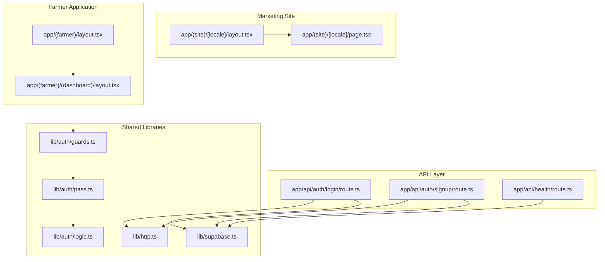
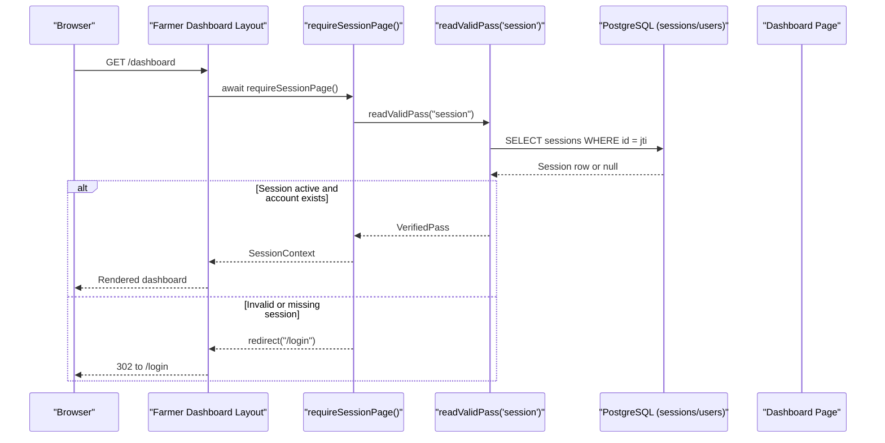
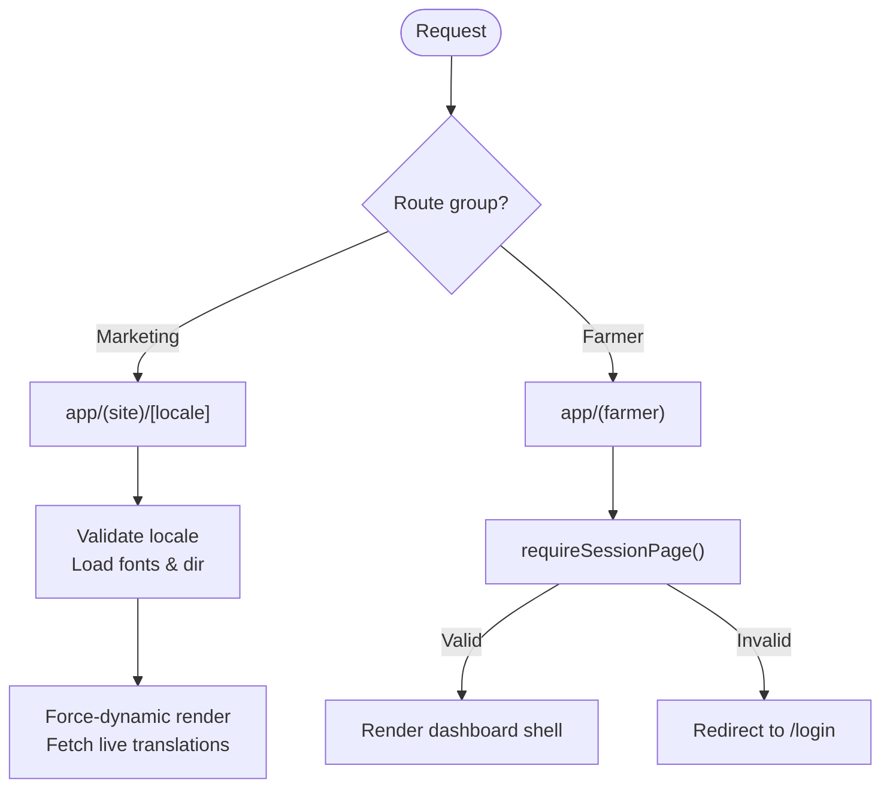
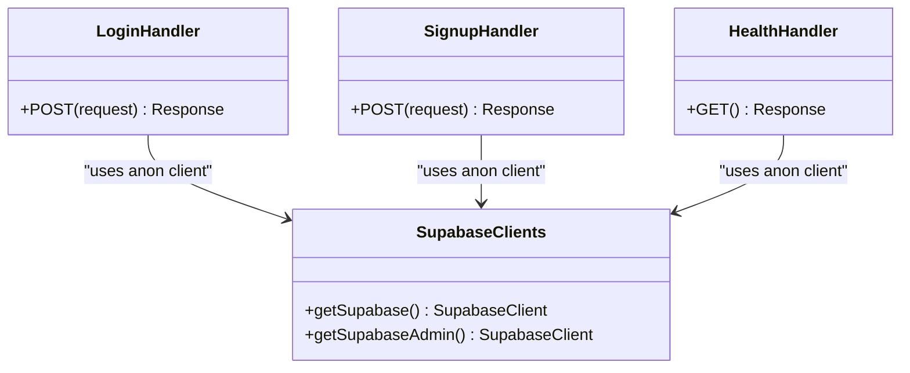
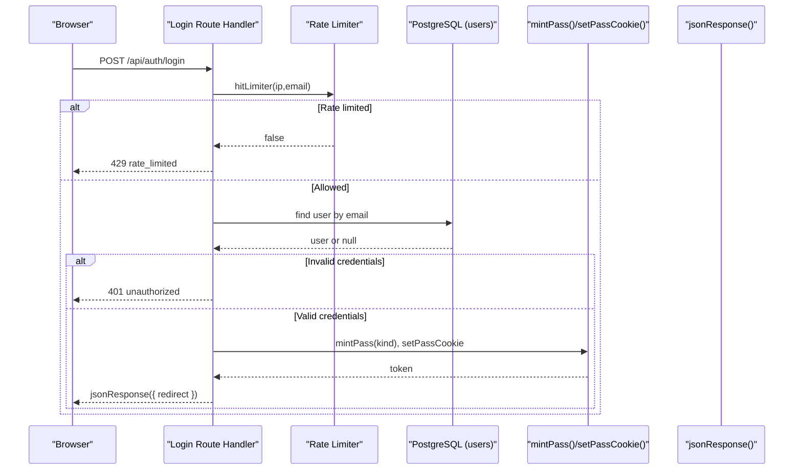
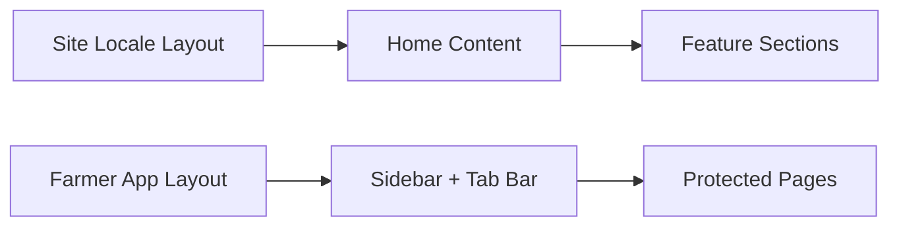
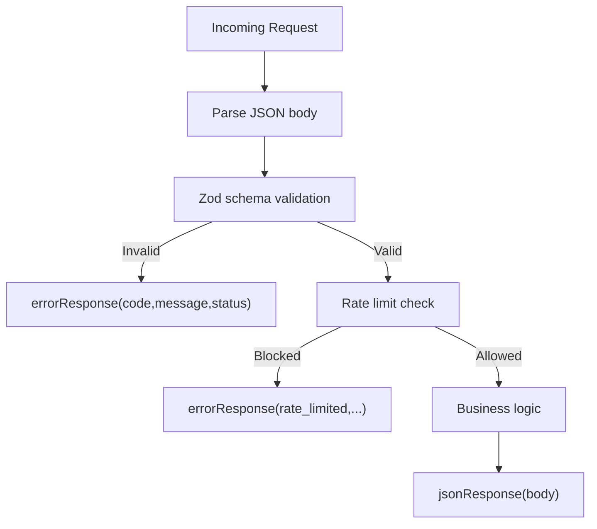
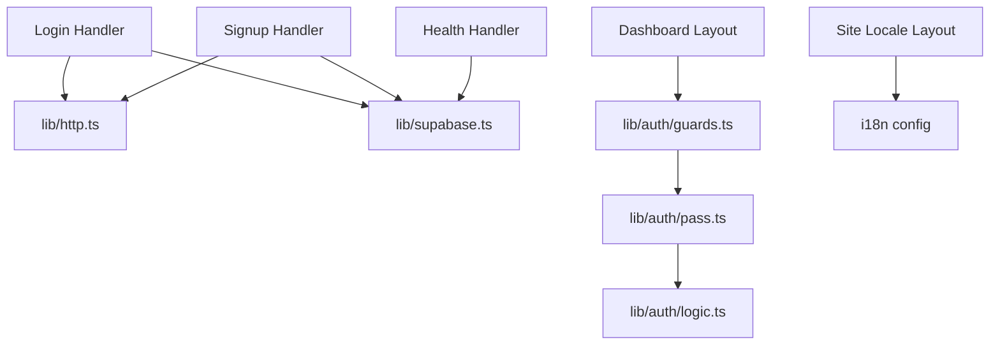

# System Design Patterns

<cite>
**Referenced Files in This Document**
- [README.md](file://README.md)
- [0003-auth-pass-architecture.md](file://adrs/0003-auth-pass-architecture.md)
- [supabase.ts](file://lib/supabase.ts)
- [guards.ts](file://lib/auth/guards.ts)
- [pass.ts](file://lib/auth/pass.ts)
- [logic.ts](file://lib/auth/logic.ts)
- [http.ts](file://lib/http.ts)
- [route.ts (login)](file://app/api/auth/login/route.ts)
- [route.ts (signup)](file://app/api/auth/signup/route.ts)
- [route.ts (health)](file://app/api/health/route.ts)
- [layout.tsx (farmer app)](file://app/(farmer)/layout.tsx)
- [layout.tsx ((dashboard))](file://app/(farmer)/(dashboard)/layout.tsx)
- [layout.tsx (site locale)](file://app/(site)/[locale]/layout.tsx)
- [page.tsx (site home)](file://app/(site)/[locale]/page.tsx)
</cite>

## Table of Contents
1. Introduction
2. Project Structure
3. Core Components
4. Architecture Overview
5. Detailed Component Analysis
6. Dependency Analysis
7. Performance Considerations
8. Troubleshooting Guide
9. Conclusion

## Introduction
This document explains the Agropioo system design patterns implemented with Next.js App Router. It focuses on:
- Route groups that separate the marketing site from the farmer application
- A repository-style database abstraction via a dual Supabase client pattern for security isolation
- A guard pattern for authentication checks at both page layouts and API routes
- Component composition, server-side rendering strategies, and client-server communication patterns
- Architectural decision records explaining why these patterns were chosen over alternatives

The goal is to make the architecture accessible to readers with limited technical knowledge while providing code-level references for implementation details.

## Project Structure
Agropioo uses Next.js App Router route groups to isolate concerns:
- Marketing site under app/(site)/[locale] with dynamic locales and content fetched server-side
- Farmer application under app/(farmer) with protected dashboard and feature pages
- API endpoints under app/api for authentication and health checks
- Shared libraries under lib for Supabase clients, HTTP helpers, and auth utilities

**Diagram sources**
- [layout.tsx (site locale):1-88](file://app/(site)/[locale]/layout.tsx#L1-L88)
- [page.tsx (site home):1-8](file://app/(site)/[locale]/page.tsx#L1-L8)
- [layout.tsx (farmer app):1-48](file://app/(farmer)/layout.tsx#L1-L48)
- [layout.tsx ((dashboard)):1-26](file://app/(farmer)/(dashboard)/layout.tsx#L1-L26)
- [route.ts (login):1-112](file://app/api/auth/login/route.ts#L1-L112)
- [route.ts (signup):1-119](file://app/api/auth/signup/route.ts#L1-L119)
- [route.ts (health):1-17](file://app/api/health/route.ts#L1-L17)
- [supabase.ts:1-47](file://lib/supabase.ts#L1-L47)
- [guards.ts:1-38](file://lib/auth/guards.ts#L1-L38)
- [pass.ts:1-264](file://lib/auth/pass.ts#L1-L264)
- [logic.ts:112-126](file://lib/auth/logic.ts#L112-L126)
- [http.ts:1-61](file://lib/http.ts#L1-L61)

**Section sources**
- [README.md:1-37](file://README.md#L1-L37)
- [layout.tsx (site locale):1-88](file://app/(site)/[locale]/layout.tsx#L1-L88)
- [layout.tsx (farmer app):1-48](file://app/(farmer)/layout.tsx#L1-L48)
- [layout.tsx ((dashboard)):1-26](file://app/(farmer)/(dashboard)/layout.tsx#L1-L26)

## Core Components
- Dual Supabase client pattern:
  - getSupabase() returns an anon-scoped client for normal operations
  - getSupabaseAdmin() returns a service-role client for trusted server tasks only
- Guard pattern:
  - requireSessionPage() protects layout/page routes by redirecting guests to login
  - requireGuestPage() protects public auth routes by redirecting signed-in users to dashboard
  - requireSessionApi() protects API handlers by returning null when unauthenticated
- Repository-style data access:
  - Route Handlers call Supabase directly through the appropriate client, keeping queries close to business logic while reusing shared helpers
- Server-side rendering strategy:
  - Marketing site uses force-dynamic layout to fetch live translations per request
  - Farmer app enforces session validation in layout before rendering any UI

**Section sources**
- [supabase.ts:1-47](file://lib/supabase.ts#L1-L47)
- [guards.ts:1-38](file://lib/auth/guards.ts#L1-L38)
- [layout.tsx (site locale):47-88](file://app/(site)/[locale]/layout.tsx#L47-L88)
- [layout.tsx ((dashboard)):1-26](file://app/(farmer)/(dashboard)/layout.tsx#L1-L26)

## Architecture Overview
The system separates marketing and farmer experiences using route groups, enforces authentication via guards, and isolates database access with dual Supabase clients. Authentication flows use state-backed JWTs stored as httpOnly cookies and validated against Postgres rows.

**Diagram sources**
- [layout.tsx ((dashboard)):1-26](file://app/(farmer)/(dashboard)/layout.tsx#L1-L26)
- [guards.ts:18-23](file://lib/auth/guards.ts#L18-L23)
- [pass.ts:196-232](file://lib/auth/pass.ts#L196-L232)
- [logic.ts:112-126](file://lib/auth/logic.ts#L112-L126)

## Detailed Component Analysis

### Next.js App Router: Route Groups Separation
- Marketing site:
  - Located under app/(site)/[locale]
  - Uses generateStaticParams for locales and force-dynamic rendering to serve live translation content
  - Adds language-specific fonts and direction attributes based on locale
- Farmer application:
  - Located under app/(farmer)
  - Root layout sets global metadata and fonts
  - Dashboard layout enforces session checks before rendering any UI, ensuring all protected pages share one choke point

**Diagram sources**
- [layout.tsx (site locale):47-88](file://app/(site)/[locale]/layout.tsx#L47-L88)
- [layout.tsx (farmer app):1-48](file://app/(farmer)/layout.tsx#L1-L48)
- [layout.tsx ((dashboard)):1-26](file://app/(farmer)/(dashboard)/layout.tsx#L1-L26)

**Section sources**
- [layout.tsx (site locale):1-88](file://app/(site)/[locale]/layout.tsx#L1-L88)
- [layout.tsx (farmer app):1-48](file://app/(farmer)/layout.tsx#L1-L48)
- [layout.tsx ((dashboard)):1-26](file://app/(farmer)/(dashboard)/layout.tsx#L1-L26)

### Database Abstraction: Repository Pattern via Dual Supabase Clients
- Two clients are provided:
  - Anon client for normal operations, respecting Row Level Security
  - Admin client for trusted server-only tasks, bypassing RLS intentionally
- Route Handlers use these clients directly, encapsulating business logic near the endpoint while sharing common helpers for responses and rate limiting

**Diagram sources**
- [supabase.ts:14-46](file://lib/supabase.ts#L14-L46)
- [route.ts (login):41-112](file://app/api/auth/login/route.ts#L41-L112)
- [route.ts (signup):27-119](file://app/api/auth/signup/route.ts#L27-L119)
- [route.ts (health):3-17](file://app/api/health/route.ts#L3-L17)

**Section sources**
- [supabase.ts:1-47](file://lib/supabase.ts#L1-L47)
- [route.ts (login):1-112](file://app/api/auth/login/route.ts#L1-L112)
- [route.ts (signup):1-119](file://app/api/auth/signup/route.ts#L1-L119)
- [route.ts (health):1-17](file://app/api/health/route.ts#L1-L17)

### Authentication: Guard Pattern and State-Backed Passes
- Guards provide a single choke point for both pages and APIs:
  - Pages: requireSessionPage() redirects guests; requireGuestPage() redirects authenticated users away from auth pages
  - APIs: requireSessionApi() returns null for unauthenticated requests so handlers can return uniform 401 errors
- Pass verification:
  - readValidPass() validates cookie presence, signature, type, expiry, and row state in Postgres
  - Sessions check revocation and expiration; verify/reset passes check consumption and dead states
- Rate limiting and consistent error shapes ensure robust, safe authentication flows

**Diagram sources**
- [route.ts (login):41-112](file://app/api/auth/login/route.ts#L41-L112)
- [pass.ts:111-148](file://lib/auth/pass.ts#L111-L148)
- [http.ts:15-25](file://lib/http.ts#L15-L25)

**Section sources**
- [guards.ts:1-38](file://lib/auth/guards.ts#L1-L38)
- [pass.ts:1-264](file://lib/auth/pass.ts#L1-L264)
- [logic.ts:112-126](file://lib/auth/logic.ts#L112-L126)
- [route.ts (login):1-112](file://app/api/auth/login/route.ts#L1-L112)
- [route.ts (signup):1-119](file://app/api/auth/signup/route.ts#L1-L119)

### Component Composition and Server-Side Rendering Strategy
- Marketing site:
  - Locale-aware layout loads fonts and applies correct language direction
  - Force-dynamic rendering ensures live translation updates are visible immediately
  - Home page fetches localized dictionary server-side and composes content components
- Farmer application:
  - Dashboard layout composes sidebar and bottom tab bar, enforcing session validation before rendering
  - Consistent shell ensures protected pages share navigation and layout behavior

**Diagram sources**
- [layout.tsx (site locale):66-88](file://app/(site)/[locale]/layout.tsx#L66-L88)
- [page.tsx (site home):1-8](file://app/(site)/[locale]/page.tsx#L1-L8)
- [layout.tsx ((dashboard)):1-26](file://app/(farmer)/(dashboard)/layout.tsx#L1-L26)

**Section sources**
- [layout.tsx (site locale):1-88](file://app/(site)/[locale]/layout.tsx#L1-L88)
- [page.tsx (site home):1-8](file://app/(site)/[locale]/page.tsx#L1-L8)
- [layout.tsx ((dashboard)):1-26](file://app/(farmer)/(dashboard)/layout.tsx#L1-L26)

### Client-Server Communication Patterns
- Uniform response shape:
  - All API failures return a consistent error object with code and message
  - Success responses use a helper to standardize JSON responses
- Request parsing:
  - JSON bodies are parsed safely; Zod schemas validate inputs and produce field-level errors
- Rate limiting:
  - Per-IP and per-email limits protect sensitive endpoints like login and signup

**Diagram sources**
- [http.ts:15-25](file://lib/http.ts#L15-L25)
- [http.ts:40-61](file://lib/http.ts#L40-L61)
- [route.ts (login):41-64](file://app/api/auth/login/route.ts#L41-L64)
- [route.ts (signup):27-50](file://app/api/auth/signup/route.ts#L27-L50)

**Section sources**
- [http.ts:1-61](file://lib/http.ts#L1-L61)
- [route.ts (login):1-112](file://app/api/auth/login/route.ts#L1-L112)
- [route.ts (signup):1-119](file://app/api/auth/signup/route.ts#L1-L119)

## Dependency Analysis
Key dependencies and relationships:
- Route Handlers depend on lib/http for standardized responses and on lib/supabase for data access
- Guards depend on lib/auth/pass for pass validation and Next.js navigation for redirects
- Pass module depends on jose for JWT signing/verification and Supabase for state persistence
- Site layout depends on i18n configuration for locale handling and font variables

**Diagram sources**
- [route.ts (login):1-112](file://app/api/auth/login/route.ts#L1-L112)
- [route.ts (signup):1-119](file://app/api/auth/signup/route.ts#L1-L119)
- [route.ts (health):1-17](file://app/api/health/route.ts#L1-L17)
- [layout.tsx ((dashboard)):1-26](file://app/(farmer)/(dashboard)/layout.tsx#L1-L26)
- [guards.ts:1-38](file://lib/auth/guards.ts#L1-L38)
- [pass.ts:1-264](file://lib/auth/pass.ts#L1-L264)
- [logic.ts:112-126](file://lib/auth/logic.ts#L112-L126)
- [layout.tsx (site locale):1-88](file://app/(site)/[locale]/layout.tsx#L1-L88)

**Section sources**
- [route.ts (login):1-112](file://app/api/auth/login/route.ts#L1-L112)
- [route.ts (signup):1-119](file://app/api/auth/signup/route.ts#L1-L119)
- [route.ts (health):1-17](file://app/api/health/route.ts#L1-L17)
- [guards.ts:1-38](file://lib/auth/guards.ts#L1-L38)
- [pass.ts:1-264](file://lib/auth/pass.ts#L1-L264)
- [logic.ts:112-126](file://lib/auth/logic.ts#L112-L126)
- [layout.tsx (site locale):1-88](file://app/(site)/[locale]/layout.tsx#L1-L88)

## Performance Considerations
- Force-dynamic rendering on marketing site ensures fresh content without caching overhead
- Session validation occurs early in protected layouts to avoid unnecessary work
- Rate limiting reduces load on authentication endpoints during abuse attempts
- Using httpOnly cookies minimizes client-side storage and improves security posture

[No sources needed since this section provides general guidance]

## Troubleshooting Guide
Common issues and how to address them:
- Missing environment variables:
  - Supabase URL and keys must be set; admin key required for service-role client
  - JWT secret must meet minimum length requirements for pass signing
- Authentication failures:
  - Ensure cookies are present and not blocked by browser settings
  - Verify that session rows exist and are not revoked or expired
- Validation errors:
  - Check Zod schemas for input fields and ensure payloads match expected types
- Rate limiting:
  - If encountering 429 responses, reduce request frequency or adjust limits appropriately

**Section sources**
- [supabase.ts:6-12](file://lib/supabase.ts#L6-L12)
- [supabase.ts:17-24](file://lib/supabase.ts#L17-L24)
- [supabase.ts:41-43](file://lib/supabase.ts#L41-L43)
- [pass.ts:64-70](file://lib/auth/pass.ts#L64-L70)
- [route.ts (login):41-64](file://app/api/auth/login/route.ts#L41-L64)
- [route.ts (signup):27-50](file://app/api/auth/signup/route.ts#L27-L50)

## Conclusion
Agropioo’s architecture leverages Next.js App Router route groups to cleanly separate marketing and farmer experiences. The dual Supabase client pattern enforces security isolation between anonymous and privileged operations. Guards provide a single, reliable choke point for authentication across pages and APIs. Server-side rendering strategies ensure timely content delivery, while standardized client-server communication improves reliability and maintainability. These patterns collectively deliver a secure, scalable, and developer-friendly platform aligned with the project’s goals.

[No sources needed since this section summarizes without analyzing specific files]