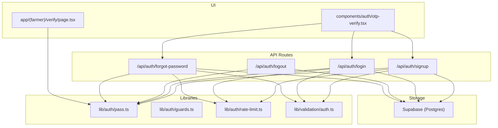
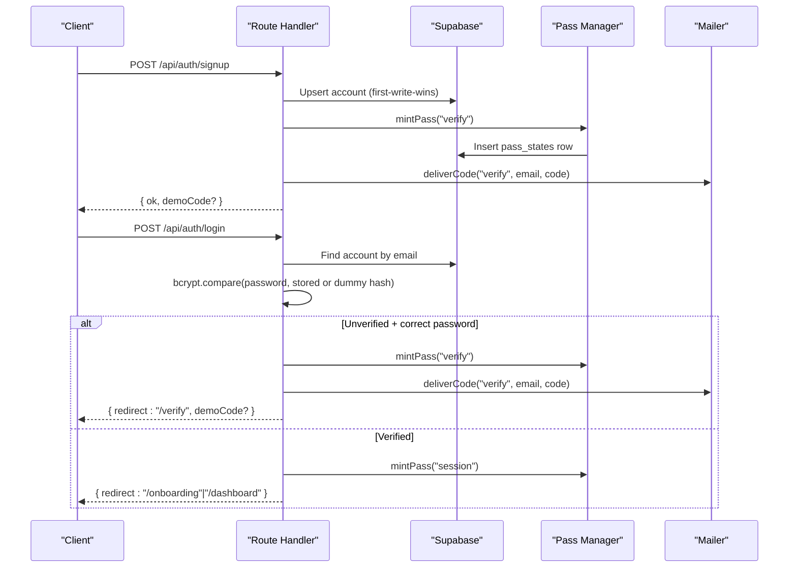
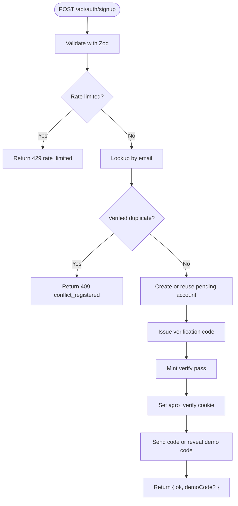
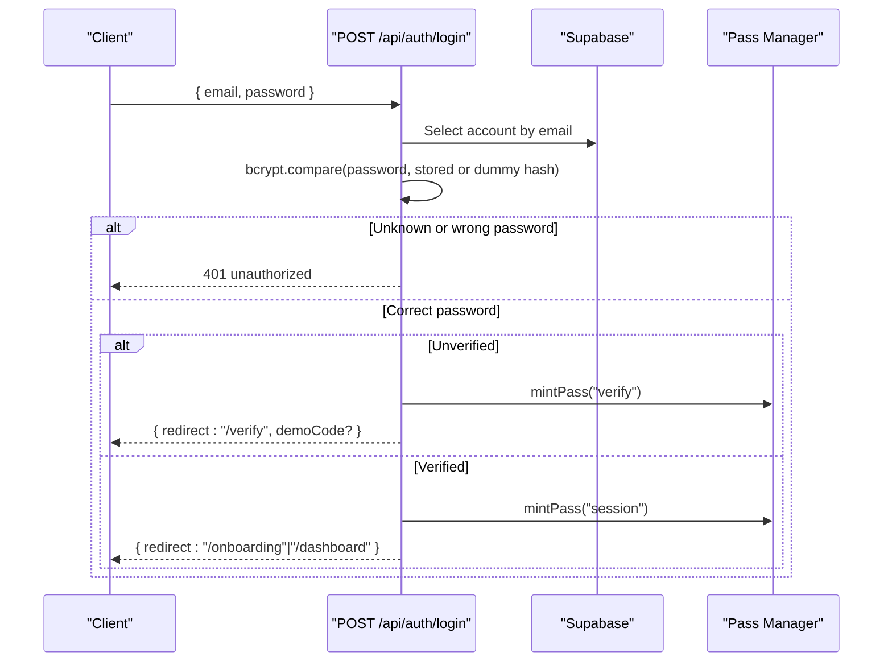
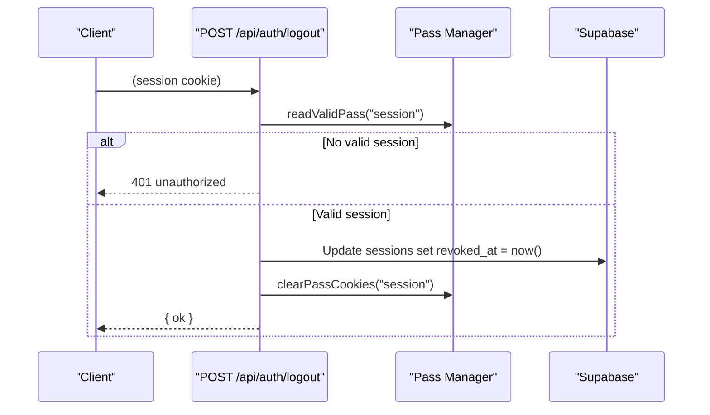
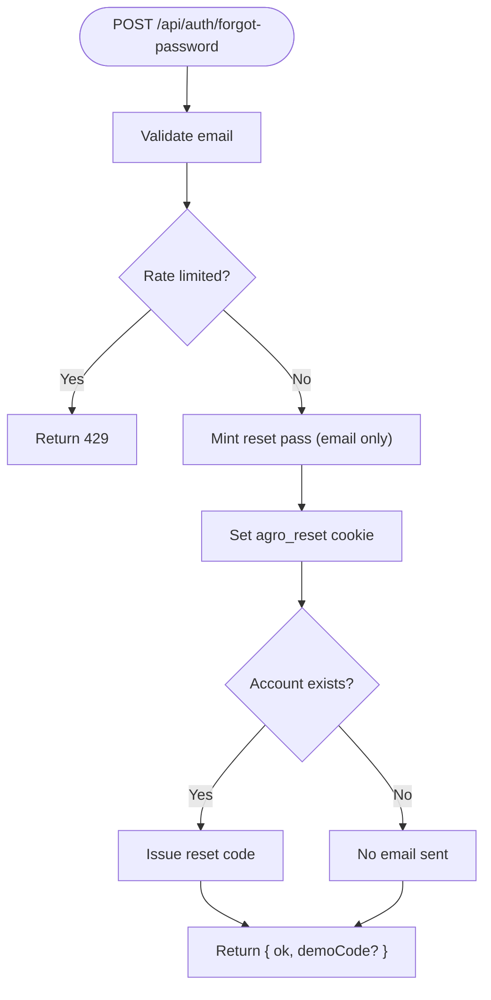
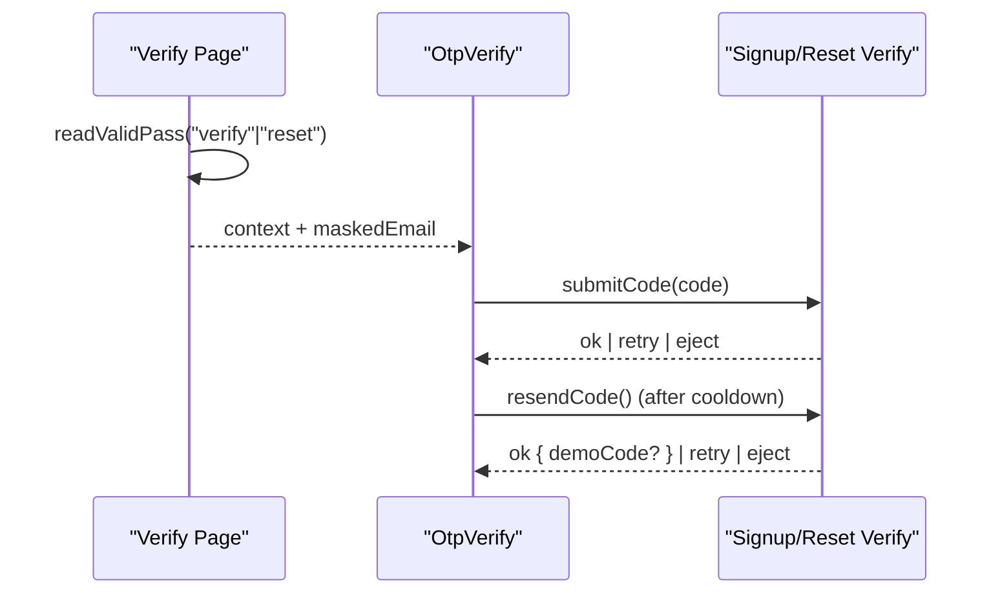
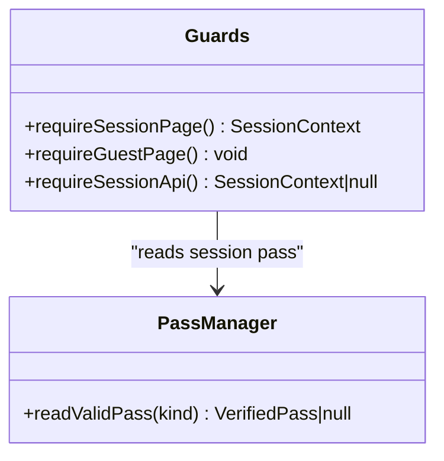
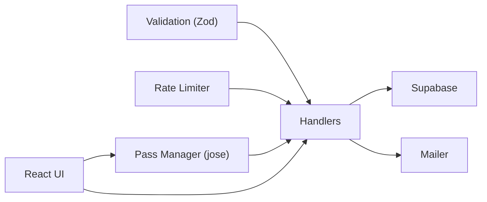

# Authentication System

<cite>
**Referenced Files in This Document**
- [0003-auth-pass-architecture.md](file://adrs/0003-auth-pass-architecture.md)
- [spec.md](file://specs/authentication/spec.md)
- [plan.md](file://specs/authentication/plan.md)
- [pass.ts](file://lib/auth/pass.ts)
- [guards.ts](file://lib/auth/guards.ts)
- [rate-limit.ts](file://lib/auth/rate-limit.ts)
- [auth.ts](file://lib/validation/auth.ts)
- [route.ts (signup)](file://app/api/auth/signup/route.ts)
- [route.ts (login)](file://app/api/auth/login/route.ts)
- [route.ts (logout)](file://app/api/auth/logout/route.ts)
- [route.ts (forgot-password)](file://app/api/auth/forgot-password/route.ts)
- [page.tsx (verify)](file://app/(farmer)/verify/page.tsx)
- [otp-verify.tsx](file://components/auth/otp-verify.tsx)
</cite>

## Table of Contents
1. Introduction
2. Project Structure
3. Core Components
4. Architecture Overview
5. Detailed Component Analysis
6. Dependency Analysis
7. Performance Considerations
8. Troubleshooting Guide
9. Conclusion
10. Appendices

## Introduction
This document explains Agropioo’s JWT-based authentication system end-to-end: user registration, email verification via a shared OTP screen, password-only login with 7-day sessions, and a three-step password recovery flow. It covers the custom pass-based authentication using jose for JWTs, bcryptjs for password hashing, Supabase for user storage, secure cookie handling, rate limiting, guard functions for route protection, and how to implement protected routes and handle authentication state in React components.

## Project Structure
The authentication system is implemented as Next.js App Router Route Handlers under app/api/auth, supported by reusable libraries in lib/auth and lib/validation, and a shared OTP UI component. Server-side guards live in layouts and handler choke points. The database schema is managed through Supabase migrations.

**Diagram sources**
- [route.ts (signup):1-119](file://app/api/auth/signup/route.ts#L1-L119)
- [route.ts (login):1-112](file://app/api/auth/login/route.ts#L1-L112)
- [route.ts (logout):1-31](file://app/api/auth/logout/route.ts#L1-L31)
- [route.ts (forgot-password):1-82](file://app/api/auth/forgot-password/route.ts#L1-L82)
- [pass.ts:1-264](file://lib/auth/pass.ts#L1-L264)
- [guards.ts:1-38](file://lib/auth/guards.ts#L1-L38)
- [rate-limit.ts:1-53](file://lib/auth/rate-limit.ts#L1-L53)
- [auth.ts:1-87](file://lib/validation/auth.ts#L1-L87)
- [page.tsx (verify):1-36](file://app/(farmer)/verify/page.tsx#L1-L36)
- [otp-verify.tsx:1-321](file://components/auth/otp-verify.tsx#L1-L321)

**Section sources**
- [plan.md:106-183](file://specs/authentication/plan.md#L106-L183)
- [spec.md:24-77](file://specs/authentication/spec.md#L24-L77)

## Core Components
- Pass tokens and cookies: jose-signed HS256 JWTs with a Postgres-backed mutable state row per token; three httpOnly cookies map one-to-one to pass types (verify, reset, session).
- Guards: server-side helpers that enforce session presence or absence on pages and APIs.
- Rate limiter: in-memory fixed-window counters keyed by IP and account/email.
- Validation schemas: shared Zod schemas used by both client forms and server handlers.
- OTP UI: a shared 6-digit code entry screen reused for signup verification and password reset step two.

Key behaviors enforced across components:
- Single-use passes and codes, cumulative wrong-attempt caps, logout kills a copied cookie, reset-verified gating, multi-device sessions.
- Enumeration resistance via dummy-hash comparison and identical responses for unknown emails.
- Last-code-wins semantics with void-on-issue for resends.

**Section sources**
- [pass.ts:1-264](file://lib/auth/pass.ts#L1-L264)
- [guards.ts:1-38](file://lib/auth/guards.ts#L1-L38)
- [rate-limit.ts:1-53](file://lib/auth/rate-limit.ts#L1-L53)
- [auth.ts:1-87](file://lib/validation/auth.ts#L1-L87)
- [otp-verify.tsx:1-321](file://components/auth/otp-verify.tsx#L1-L321)
- [0003-auth-pass-architecture.md:1-50](file://adrs/0003-auth-pass-architecture.md#L1-L50)

## Architecture Overview
The system uses state-backed JWTs where each token’s jti maps to a Postgres row carrying mutable truth (consumed, dead, stage, revoked). Three isolated cookies carry verify/reset/session passes. Every endpoint validates its own pass type and enforces strict rules around expiry, attempts, and binding.

**Diagram sources**
- [route.ts (signup):1-119](file://app/api/auth/signup/route.ts#L1-L119)
- [route.ts (login):1-112](file://app/api/auth/login/route.ts#L1-L112)
- [pass.ts:106-148](file://lib/auth/pass.ts#L106-L148)

## Detailed Component Analysis

### Signup Flow
- Validates input with shared Zod schema.
- Applies dual-dimension rate limits (IP and email).
- Creates or reuses an unverified account (first-write-wins).
- Issues a verification code and a verify pass cookie.
- Sends code via mailer or reveals demo code when SMTP is unconfigured and DEMO_MODE is enabled.

**Diagram sources**
- [route.ts (signup):1-119](file://app/api/auth/signup/route.ts#L1-L119)
- [rate-limit.ts:12-25](file://lib/auth/rate-limit.ts#L12-L25)

**Section sources**
- [route.ts (signup):1-119](file://app/api/auth/signup/route.ts#L1-L119)
- [auth.ts:20-52](file://lib/validation/auth.ts#L20-L52)
- [plan.md:113-128](file://specs/authentication/plan.md#L113-L128)

### Login Flow
- Password-only sign-in with enumeration resistance via dummy-hash compare.
- For unverified accounts with correct credentials, issues a fresh verify pass and redirects to the OTP screen.
- For verified accounts, creates a 7-day session pass and clears leftover verify/reset cookies.

**Diagram sources**
- [route.ts (login):1-112](file://app/api/auth/login/route.ts#L1-L112)
- [pass.ts:106-148](file://lib/auth/pass.ts#L106-L148)

**Section sources**
- [route.ts (login):1-112](file://app/api/auth/login/route.ts#L1-L112)
- [auth.ts:54-59](file://lib/validation/auth.ts#L54-L59)
- [spec.md:52-58](file://specs/authentication/spec.md#L52-L58)

### Logout Flow
- Revokes the current session row server-side so a copied cookie becomes useless.
- Clears the session cookie immediately.

**Diagram sources**
- [route.ts (logout):1-31](file://app/api/auth/logout/route.ts#L1-L31)
- [pass.ts:196-232](file://lib/auth/pass.ts#L196-L232)

**Section sources**
- [route.ts (logout):1-31](file://app/api/auth/logout/route.ts#L1-L31)
- [spec.md:57-58](file://specs/authentication/spec.md#L57-L58)

### Forgot Password and Reset Flow
- Step 1: Submit email → always returns identical response; known emails receive a code; all submissions get a reset pass cookie carrying only the email.
- Step 2: Shared OTP screen verifies the code and upgrades the reset pass to “code_verified”.
- Step 3: Set new password only with a reset-verified pass; success marks unverified accounts verified, voids outstanding reset codes/passes, and kills all sessions for that account.

**Diagram sources**
- [route.ts (forgot-password):1-82](file://app/api/auth/forgot-password/route.ts#L1-L82)

**Section sources**
- [route.ts (forgot-password):1-82](file://app/api/auth/forgot-password/route.ts#L1-L82)
- [plan.md:120-123](file://specs/authentication/plan.md#L120-L123)
- [spec.md:60-66](file://specs/authentication/spec.md#L60-L66)

### Shared OTP Screen
- Renders context-specific headings and escape hatches for signup vs reset.
- Enforces 6-digit numeric input, auto-submit on completion, resend cooldown, and attempt tracking mirrored from server rules.
- Displays demo code only when the FR17 gate allows it.

**Diagram sources**
- [page.tsx (verify):1-36](file://app/(farmer)/verify/page.tsx#L1-L36)
- [otp-verify.tsx:1-321](file://components/auth/otp-verify.tsx#L1-L321)

**Section sources**
- [page.tsx (verify):1-36](file://app/(farmer)/verify/page.tsx#L1-L36)
- [otp-verify.tsx:1-321](file://components/auth/otp-verify.tsx#L1-L321)
- [spec.md:43-50](file://specs/authentication/spec.md#L43-L50)

### Security Measures
- State-backed JWTs with Postgres rows for mutable state enable single-use consumption, cumulative wrong-attempt caps, logout kill, and reset-verified gating.
- Secure cookies: httpOnly, Secure in production, SameSite=Lax, path “/”.
- Rate limiting: dual-dimension fixed windows per IP and per account/email.
- Enumeration resistance: dummy-hash compare at login; byte-identical forgot-password responses.
- Strict pass isolation: endpoints accept only their own cookie type.

**Section sources**
- [0003-auth-pass-architecture.md:13-49](file://adrs/0003-auth-pass-architecture.md#L13-L49)
- [pass.ts:234-263](file://lib/auth/pass.ts#L234-L263)
- [rate-limit.ts:12-25](file://lib/auth/rate-limit.ts#L12-L25)
- [route.ts (login):26-28](file://app/api/auth/login/route.ts#L26-L28)

### Guard Functions and Middleware Patterns
- requireSessionPage(): protects dashboard and app pages; guests are redirected to /login.
- requireGuestPage(): protects auth pages; signed-in users are redirected to /dashboard.
- requireSessionApi(): protects data APIs; returns null to signal 401.

**Diagram sources**
- [guards.ts:1-38](file://lib/auth/guards.ts#L1-L38)
- [pass.ts:196-232](file://lib/auth/pass.ts#L196-L232)

**Section sources**
- [guards.ts:1-38](file://lib/auth/guards.ts#L1-L38)
- [plan.md:185-190](file://specs/authentication/plan.md#L185-L190)

### Protected Routes and React State Handling
- Protect app pages/layouts by calling requireSessionPage() at the top; protect data APIs by calling requireSessionApi().
- On the client, after successful login/signup/verification flows, follow returned redirect paths and update local UI state accordingly.
- Use the shared OtpVerify component with callbacks to submit/resend codes and handle eject/retry states.

Implementation references:
- Protected page guard: call requireSessionPage() in layout and handle redirect if not authenticated.
- Protected API guard: call requireSessionApi() and return 401 shape when null.
- Client integration: use react-hook-form with zodResolver sharing lib/validation/auth.ts schemas; navigate to returned redirect paths; render OtpVerify with context and callbacks.

**Section sources**
- [guards.ts:18-37](file://lib/auth/guards.ts#L18-L37)
- [auth.ts:1-87](file://lib/validation/auth.ts#L1-L87)
- [otp-verify.tsx:10-36](file://components/auth/otp-verify.tsx#L10-L36)

## Dependency Analysis
Authentication components depend on:
- jose for signing/verifying JWTs and managing claims.
- bcryptjs for password hashing and timing-equalized comparisons.
- Supabase client for persistent state (accounts, pass_states, verification_codes, sessions).
- next/headers and next/server for cookie access and ensuring dynamic execution.
- Zod for unified validation.
- In-memory rate limiter for dual-dimension throttling.

**Diagram sources**
- [auth.ts:1-87](file://lib/validation/auth.ts#L1-L87)
- [rate-limit.ts:1-53](file://lib/auth/rate-limit.ts#L1-L53)
- [pass.ts:1-264](file://lib/auth/pass.ts#L1-L264)
- [route.ts (signup):1-119](file://app/api/auth/signup/route.ts#L1-L119)
- [route.ts (login):1-112](file://app/api/auth/login/route.ts#L1-L112)
- [route.ts (logout):1-31](file://app/api/auth/logout/route.ts#L1-L31)
- [route.ts (forgot-password):1-82](file://app/api/auth/forgot-password/route.ts#L1-L82)

**Section sources**
- [plan.md:43-48](file://specs/authentication/plan.md#L43-L48)
- [0003-auth-pass-architecture.md:13-39](file://adrs/0003-auth-pass-architecture.md#L13-L39)

## Performance Considerations
- All pass and code checks run server-side against UTC time; client clocks are never trusted.
- Dummy-hash compare equalizes login latency for unknown vs known emails.
- In-memory rate limiter is simple and resets on restart; suitable for single-instance demos.
- Avoid heavy work in hot paths; keep error responses uniform and lightweight.

[No sources needed since this section provides general guidance]

## Troubleshooting Guide
Common issues and resolutions:
- Missing or short JWT_SECRET: pass minting will throw; ensure environment variable meets minimum length.
- Wrong-type pass usage: endpoints reject with standard unauthorized outcome; verify the correct cookie is present.
- Expired or consumed pass/code: results in neutral rejection; issue a new pass/code as appropriate.
- Rate-limited requests: wait for window to expire; reduce request frequency.
- Email delivery failures: UI shows neutral retry message; no code rendered unless demo mode conditions are met.

**Section sources**
- [pass.ts:64-69](file://lib/auth/pass.ts#L64-L69)
- [pass.ts:196-232](file://lib/auth/pass.ts#L196-L232)
- [rate-limit.ts:12-25](file://lib/auth/rate-limit.ts#L12-L25)
- [otp-verify.tsx:168-184](file://components/auth/otp-verify.tsx#L168-L184)

## Conclusion
Agropioo’s authentication system combines state-backed JWTs, secure cookies, robust rate limiting, and strict pass isolation to deliver a secure, user-friendly experience. The shared OTP screen streamlines verification for both signup and password recovery, while guards and middleware ensure consistent protection across pages and APIs. The design supports multiple simultaneous sessions, safe logout behavior, and strong enumeration resistance.

[No sources needed since this section summarizes without analyzing specific files]

## Appendices

### API Endpoint Specifications
- POST /api/auth/signup
  - Body: name, email, phone (optional), password, confirmPassword, terms
  - Behavior: first-write-wins, duplicate verified email returns 409, otherwise issues code and verify pass
  - Response: { ok, demoCode? }
- POST /api/auth/login
  - Body: email, password
  - Behavior: password-only sign-in; unverified correct credentials issue verify pass; verified credentials issue session pass
  - Response: { redirect, demoCode? } or 401 unauthorized
- POST /api/auth/logout
  - Requires: session pass
  - Behavior: revokes session row and clears cookie
  - Response: { ok } or 401 unauthorized
- POST /api/auth/forgot-password
  - Body: email
  - Behavior: always issues reset pass; known emails receive code
  - Response: { ok, demoCode? }
- POST /api/auth/signup/verify
  - Requires: verify pass
  - Body: code (6 digits)
  - Behavior: validates code, consumes pass and code, marks account verified
  - Response: { ok } or 401 unauthorized
- POST /api/auth/signup/resend
  - Requires: verify pass
  - Behavior: enforces cooldown, last-code-wins, updates pass attempt counters
  - Response: { ok, demoCode? } or 429 rate_limited
- POST /api/auth/reset/verify
  - Requires: reset pass
  - Body: code (6 digits)
  - Behavior: validates code, binds account_id, sets stage=code_verified
  - Response: { ok } or 401 unauthorized
- POST /api/auth/reset/resend
  - Requires: reset pass
  - Behavior: mirror of signup/resend for reset purpose
  - Response: { ok, demoCode? } or 429 rate_limited
- POST /api/auth/reset/password
  - Requires: reset pass @ stage code_verified
  - Body: password, confirmPassword
  - Behavior: sets new hash, marks unverified→verified, voids reset codes/passes, kills all sessions
  - Response: { ok } or 401 unauthorized

Notes:
- All errors return uniform shape: { error: { code, message } }.
- Rate-limit windows and dimensions are pinned in plan.md.

**Section sources**
- [plan.md:106-128](file://specs/authentication/plan.md#L106-L128)
- [spec.md:24-77](file://specs/authentication/spec.md#L24-L77)