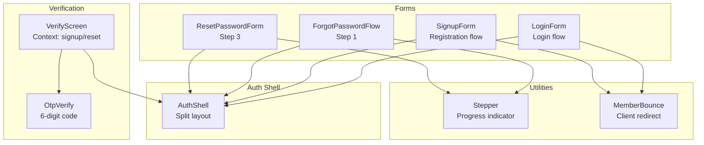
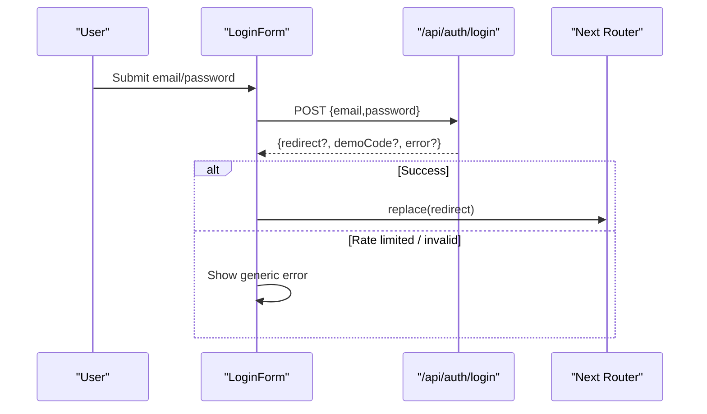
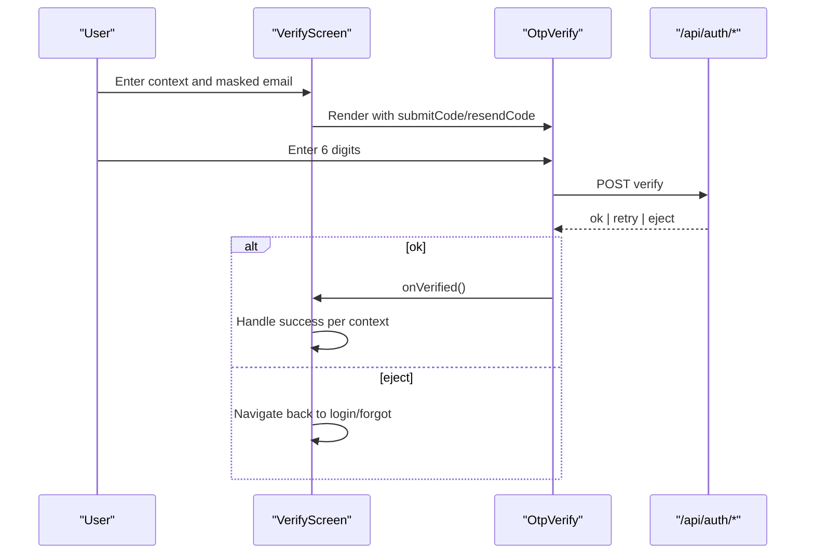
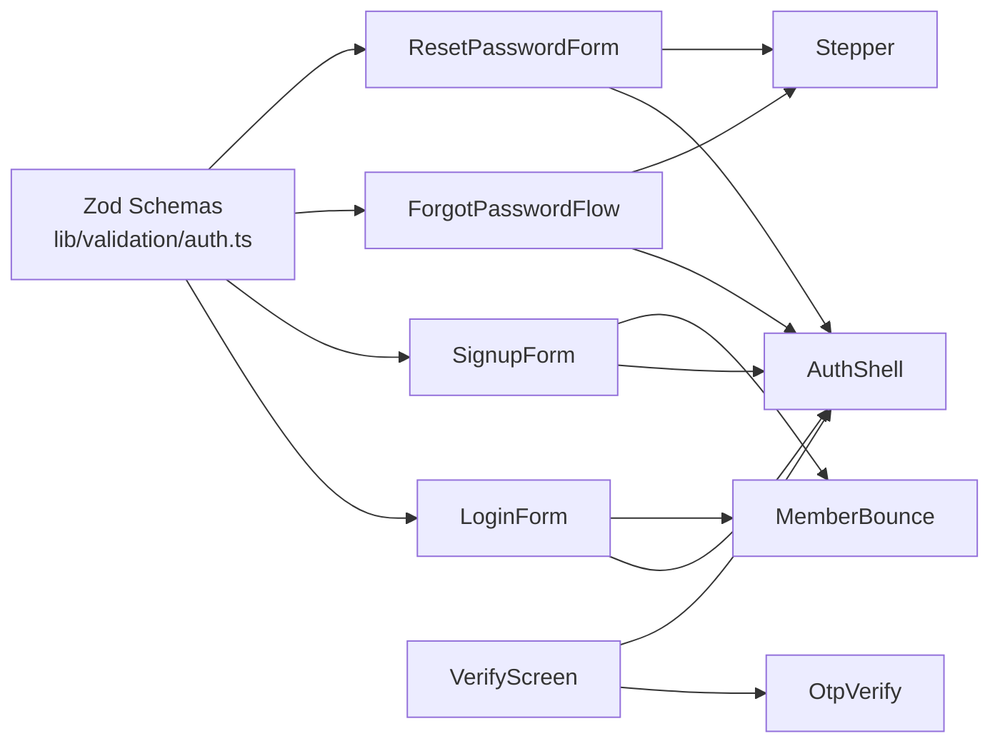

# Authentication UI Components

<cite>
**Referenced Files in This Document**
- [auth-shell.tsx](file://components/auth/auth-shell.tsx)
- [otp-verify.tsx](file://components/auth/otp-verify.tsx)
- [stepper.tsx](file://components/auth/stepper.tsx)
- [member-bounce.tsx](file://components/auth/member-bounce.tsx)
- [login-form.tsx](file://app/(site)/[locale]/login/login-form.tsx)
- [signup-form.tsx](file://app/(site)/[locale]/signup/signup-form.tsx)
- [verify-screen.tsx](file://app/(farmer)/verify/verify-screen.tsx)
- [forgot-password-flow.tsx](file://app/(farmer)/forgot-password/forgot-password-flow.tsx)
- [reset-password-form.tsx](file://app/(farmer)/reset-password/reset-password-form.tsx)
- [auth.ts](file://lib/validation/auth.ts)
</cite>

## Table of Contents
1. [Introduction](#introduction)
2. [Project Structure](#project-structure)
3. [Core Components](#core-components)
4. [Architecture Overview](#architecture-overview)
5. [Detailed Component Analysis](#detailed-component-analysis)
6. [Dependency Analysis](#dependency-analysis)
7. [Performance Considerations](#performance-considerations)
8. [Troubleshooting Guide](#troubleshooting-guide)
9. [Conclusion](#conclusion)
10. [Appendices](#appendices)

## Introduction
This document explains Agropioo’s authentication UI components and how they are used across login, signup, password recovery, and email verification flows. It focuses on:
- Auth shell for consistent layout
- OTP verification component for 6-digit code entry
- Stepper for multi-step progress
- Member bounce for authenticated redirects
- Integration with React Hook Form and Zod validation
- Accessibility, responsive design, error handling, and extension guidelines

## Project Structure
Authentication UI is split into reusable components under components/auth and page-level forms under app routes. The auth shell provides a two-panel layout (brand panel + form panel). OTP verification is a shared client component used by both signup verification and password reset flows. Stepper visualizes steps for password recovery. Member bounce handles client-side redirects when server redirects are not possible.

**Diagram sources**
- [auth-shell.tsx:15-89](file://components/auth/auth-shell.tsx#L15-L89)
- [login-form.tsx:110-337](file://app/(site)/[locale]/login/login-form.tsx#L110-L337)
- [signup-form.tsx:169-515](file://app/(site)/[locale]/signup/signup-form.tsx#L169-L515)
- [forgot-password-flow.tsx:74-215](file://app/(farmer)/forgot-password/forgot-password-flow.tsx#L74-L215)
- [reset-password-form.tsx:84-261](file://app/(farmer)/reset-password/reset-password-form.tsx#L84-L261)
- [verify-screen.tsx:24-199](file://app/(farmer)/verify/verify-screen.tsx#L24-L199)
- [otp-verify.tsx:42-319](file://components/auth/otp-verify.tsx#L42-L319)
- [stepper.tsx:9-59](file://components/auth/stepper.tsx#L9-L59)
- [member-bounce.tsx:6-22](file://components/auth/member-bounce.tsx#L6-L22)

**Section sources**
- [auth-shell.tsx:15-89](file://components/auth/auth-shell.tsx#L15-L89)
- [login-form.tsx:110-337](file://app/(site)/[locale]/login/login-form.tsx#L110-L337)
- [signup-form.tsx:169-515](file://app/(site)/[locale]/signup/signup-form.tsx#L169-L515)
- [forgot-password-flow.tsx:74-215](file://app/(farmer)/forgot-password/forgot-password-flow.tsx#L74-L215)
- [reset-password-form.tsx:84-261](file://app/(farmer)/reset-password/reset-password-form.tsx#L84-L261)
- [verify-screen.tsx:24-199](file://app/(farmer)/verify/verify-screen.tsx#L24-L199)
- [otp-verify.tsx:42-319](file://components/auth/otp-verify.tsx#L42-L319)
- [stepper.tsx:9-59](file://components/auth/stepper.tsx#L9-L59)
- [member-bounce.tsx:6-22](file://components/auth/member-bounce.tsx#L6-L22)

## Core Components
- AuthShell: Provides a consistent two-panel layout with brand messaging and form area. On desktop it shows a branded left panel; on mobile it collapses to a single column with a compact header.
- OtpVerify: Shared 6-digit code input with paste support, auto-focus, keyboard navigation, attempt limiting, resend cooldown, and accessible announcements.
- Stepper: Visual progress indicator for the three-step password recovery flow.
- MemberBounce: Client-side redirect used where Next.js routing swallows server redirects.

Key prop interfaces and responsibilities:
- AuthShell props include brand headline, preview content, bullet points, and children (form content).
- OtpVerify props define context, masked email, submit/resend handlers, demo code, success callback, and escape behavior.
- Stepper takes current step number.
- MemberBounce takes a target route string.

Integration patterns:
- Forms use React Hook Form with Zod schemas from lib/validation/auth.ts for validation and error mapping.
- Pages compose AuthShell with either LoginForm, SignupForm, ForgotPasswordFlow, ResetPasswordForm, or VerifyScreen.

**Section sources**
- [auth-shell.tsx:8-24](file://components/auth/auth-shell.tsx#L8-L24)
- [otp-verify.tsx:10-36](file://components/auth/otp-verify.tsx#L10-L36)
- [stepper.tsx:5-7](file://components/auth/stepper.tsx#L5-L7)
- [member-bounce.tsx:10-14](file://components/auth/member-bounce.tsx#L10-L14)
- [auth.ts:8-87](file://lib/validation/auth.ts#L8-L87)

## Architecture Overview
The authentication UI follows a layered approach:
- Page-level forms orchestrate user actions, validation, API calls, and navigation.
- Reusable components encapsulate layout and complex interactions (OTP, stepper).
- Validation schemas ensure consistency between client and server.

**Diagram sources**
- [login-form.tsx:84-108](file://app/(site)/[locale]/login/login-form.tsx#L84-L108)

**Diagram sources**
- [verify-screen.tsx:51-92](file://app/(farmer)/verify/verify-screen.tsx#L51-L92)
- [otp-verify.tsx:95-112](file://components/auth/otp-verify.tsx#L95-L112)

## Detailed Component Analysis

### AuthShell
Purpose:
- Provide a consistent, responsive layout for auth-related pages.
- Display brand messaging and value points on desktop; collapse to a compact header on mobile.

Props:
- brandHeadline: ReactNode for the main headline.
- brandPreview: ReactNode for contextual preview content.
- brandPoints: Array of strings for feature bullets.
- children: Form content rendered in the right panel.

Styling customization:
- Uses Tailwind classes for spacing, typography, and color tokens.
- Brand panel uses dark background with decorative SVGs and FurrowMotif.
- Form panel centers content with max-width constraints.

Accessibility:
- Decorative SVGs are marked aria-hidden.
- Mobile logo link remains accessible.

Usage examples:
- Wraps ForgotPasswordFlow, ResetPasswordForm, and VerifyScreen to maintain consistent branding and layout.

**Section sources**
- [auth-shell.tsx:8-24](file://components/auth/auth-shell.tsx#L8-L24)
- [auth-shell.tsx:25-89](file://components/auth/auth-shell.tsx#L25-L89)
- [forgot-password-flow.tsx:74-117](file://app/(farmer)/forgot-password/forgot-password-flow.tsx#L74-L117)
- [reset-password-form.tsx:84-129](file://app/(farmer)/reset-password/reset-password-form.tsx#L84-L129)
- [verify-screen.tsx:94-141](file://app/(farmer)/verify/verify-screen.tsx#L94-L141)

### OtpVerify
Purpose:
- Accept a 6-digit verification code with robust UX: paste, auto-focus, keyboard navigation, attempts limit, resend cooldown, and accessible announcements.

Props:
- context: "signup" or "reset" to tailor copy and behavior.
- email: Masked email shown to the user.
- submitCode(code): Promise returning result status ("ok", "retry", "eject").
- resendCode(): Promise returning result status ("ok", "retry", "eject") with optional demoCode.
- demoCode: Optional banner code for development/demo.
- onVerified(): Callback invoked on successful verification.
- escapeLabel/onEscape: Escape hatch label and handler.

Behavior:
- Auto-focuses first digit input on mount.
- Validates input to numeric only and advances focus automatically.
- Submits code when all digits filled or on button click.
- Limits attempts to MAX_ATTEMPTS; locks inputs and shows alert if exceeded.
- Resend cooldown prevents spamming; displays countdown.
- Announces errors and notices via aria-live regions.

Accessibility:
- Inputs have aria-labels for each digit.
- Error states use role="alert".
- Disabled state communicates locked condition.

Error handling:
- Handles server errors gracefully with retry messages.
- Supports eject to navigate away on pass-gate failures.

**Section sources**
- [otp-verify.tsx:10-36](file://components/auth/otp-verify.tsx#L10-L36)
- [otp-verify.tsx:42-112](file://components/auth/otp-verify.tsx#L42-L112)
- [otp-verify.tsx:114-184](file://components/auth/otp-verify.tsx#L114-L184)
- [otp-verify.tsx:186-319](file://components/auth/otp-verify.tsx#L186-L319)

### Stepper
Purpose:
- Visualize the three-step password recovery process: Email, Verify code, New password.

Props:
- current: 1 | 2 | 3 indicating active step.

Behavior:
- Marks completed steps with checkmarks.
- Highlights current step.
- Mutes future steps.
- Uses aria-current for accessibility.

**Section sources**
- [stepper.tsx:3-7](file://components/auth/stepper.tsx#L3-L7)
- [stepper.tsx:11-59](file://components/auth/stepper.tsx#L11-L59)
- [forgot-password-flow.tsx:117-117](file://app/(farmer)/forgot-password/forgot-password-flow.tsx#L117-L117)
- [reset-password-form.tsx:129-129](file://app/(farmer)/reset-password/reset-password-form.tsx#L129-L129)

### MemberBounce
Purpose:
- Perform client-side redirect when server redirects are swallowed by locale rewriting.

Props:
- target: Destination route string.

Behavior:
- Uses Next router.replace to navigate immediately.
- Shows a minimal loading message during transition.

Usage:
- Used in login/signup flows where session checks occur server-side but final navigation must be client-driven.

**Section sources**
- [member-bounce.tsx:6-22](file://components/auth/member-bounce.tsx#L6-L22)

### Login Form
Purpose:
- Collect email and password, validate with Zod, call login API, handle errors, and navigate on success.

Validation:
- Uses zodResolver with loginSchema from lib/validation/auth.ts.
- Maps Zod error messages to localized strings via ERROR_KEYS.

Error handling:
- Displays generic error for invalid credentials or rate limiting.
- Stashes demo code when provided by server for development.

Navigation:
- On success, navigates to redirect URL returned by API.

Accessibility:
- Labels, aria-invalid, aria-describedby for fields.
- Password visibility toggle has aria-pressed and aria-label.

**Section sources**
- [login-form.tsx:16-54](file://app/(site)/[locale]/login/login-form.tsx#L16-L54)
- [login-form.tsx:56-108](file://app/(site)/[locale]/login/login-form.tsx#L56-L108)
- [login-form.tsx:218-323](file://app/(site)/[locale]/login/login-form.tsx#L218-L323)
- [auth.ts:54-59](file://lib/validation/auth.ts#L54-L59)

### Signup Form
Purpose:
- Collect name, email, phone, password, confirm password, and terms acceptance; validate with Zod; call signup API; handle conflicts and rate limits; navigate to verification.

Validation:
- Uses zodResolver with signupSchema from lib/validation/auth.ts.
- Enforces password strength locally and confirms match.

Error handling:
- Shows registered conflict message with links to sign in or reset password.
- Displays rate-limited and server errors.

Accessibility:
- Proper labels, aria-invalid, aria-describedby for fields.
- Terms checkbox validated and announced.

**Section sources**
- [signup-form.tsx:16-91](file://app/(site)/[locale]/signup/signup-form.tsx#L16-L91)
- [signup-form.tsx:93-160](file://app/(site)/[locale]/signup/signup-form.tsx#L93-L160)
- [signup-form.tsx:306-498](file://app/(site)/[locale]/signup/signup-form.tsx#L306-L498)
- [auth.ts:20-50](file://lib/validation/auth.ts#L20-L50)

### Verify Screen
Purpose:
- Orchestrate OTP verification for signup and reset contexts.
- Manage API calls, classify responses, handle success and eject paths, and render success screen for signup.

Behavior:
- Determines API endpoints based on context.
- Classifies server responses to decide retry vs eject.
- Stashes demo codes for development.
- Navigates to reset-password on verified reset; shows success screen for signup.

**Section sources**
- [verify-screen.tsx:24-92](file://app/(farmer)/verify/verify-screen.tsx#L24-L92)
- [verify-screen.tsx:94-199](file://app/(farmer)/verify/verify-screen.tsx#L94-L199)

### Forgot Password Flow
Purpose:
- Step 1 of password recovery: collect email, send verification code, show neutral confirmation, and auto-advance to verification.

Behavior:
- Uses AuthShell and Stepper to guide users.
- Calls forgot-password API and stashes demo code if present.
- Auto-navigates to /verify after showing confirmation.

**Section sources**
- [forgot-password-flow.tsx:23-72](file://app/(farmer)/forgot-password/forgot-password-flow.tsx#L23-L72)
- [forgot-password-flow.tsx:74-215](file://app/(farmer)/forgot-password/forgot-password-flow.tsx#L74-L215)

### Reset Password Form
Purpose:
- Step 3 of password recovery: set new password after verification.

Behavior:
- Uses AuthShell and Stepper.
- Calls reset password API; handles unauthorized pass by navigating back to forgot-password.
- Shows success screen with link to sign in.

**Section sources**
- [reset-password-form.tsx:22-59](file://app/(farmer)/reset-password/reset-password-form.tsx#L22-L59)
- [reset-password-form.tsx:84-261](file://app/(farmer)/reset-password/reset-password-form.tsx#L84-L261)

## Dependency Analysis
Components depend on:
- React Hook Form for form state and validation integration.
- Zod schemas for type-safe validation shared with server routes.
- Next Navigation for routing and redirects.
- Tailwind CSS for styling and responsive design.

**Diagram sources**
- [auth.ts:8-87](file://lib/validation/auth.ts#L8-L87)
- [login-form.tsx:7-10](file://app/(site)/[locale]/login/login-form.tsx#L7-L10)
- [signup-form.tsx:7-10](file://app/(site)/[locale]/signup/signup-form.tsx#L7-L10)
- [forgot-password-flow.tsx:6-12](file://app/(farmer)/forgot-password/forgot-password-flow.tsx#L6-L12)
- [reset-password-form.tsx:6-11](file://app/(farmer)/reset-password/reset-password-form.tsx#L6-L11)
- [verify-screen.tsx:6-9](file://app/(farmer)/verify/verify-screen.tsx#L6-L9)
- [auth-shell.tsx:1-7](file://components/auth/auth-shell.tsx#L1-L7)
- [stepper.tsx:1-7](file://components/auth/stepper.tsx#L1-L7)
- [member-bounce.tsx:3-5](file://components/auth/member-bounce.tsx#L3-L5)

**Section sources**
- [auth.ts:8-87](file://lib/validation/auth.ts#L8-L87)
- [login-form.tsx:7-10](file://app/(site)/[locale]/login/login-form.tsx#L7-L10)
- [signup-form.tsx:7-10](file://app/(site)/[locale]/signup/signup-form.tsx#L7-L10)
- [forgot-password-flow.tsx:6-12](file://app/(farmer)/forgot-password/forgot-password-flow.tsx#L6-L12)
- [reset-password-form.tsx:6-11](file://app/(farmer)/reset-password/reset-password-form.tsx#L6-L11)
- [verify-screen.tsx:6-9](file://app/(farmer)/verify/verify-screen.tsx#L6-L9)

## Performance Considerations
- Avoid unnecessary re-renders in OTP inputs by using refs and focused index management.
- Debounce or throttle resend requests if needed; currently enforced via cooldown timer.
- Keep brand panel assets lightweight; SVGs are inline and minimal.
- Use Next router.replace for efficient navigation without history clutter.

[No sources needed since this section provides general guidance]

## Troubleshooting Guide
Common issues and resolutions:
- OTP locked after too many attempts: Wait for resend cooldown or request a new code.
- Resend fails: Check network connectivity; display retry message from server.
- Invalid credentials: Show generic error to avoid information leakage.
- Unauthorized pass on reset-password: Redirect back to forgot-password.

Accessibility tips:
- Ensure aria-live regions announce dynamic messages.
- Use aria-invalid and aria-describedby for form errors.
- Provide clear labels and instructions for OTP inputs.

**Section sources**
- [otp-verify.tsx:104-112](file://components/auth/otp-verify.tsx#L104-L112)
- [otp-verify.tsx:168-184](file://components/auth/otp-verify.tsx#L168-L184)
- [login-form.tsx:102-108](file://app/(site)/[locale]/login/login-form.tsx#L102-L108)
- [reset-password-form.tsx:53-58](file://app/(farmer)/reset-password/reset-password-form.tsx#L53-L58)

## Conclusion
Agropioo’s authentication UI leverages reusable components to deliver a consistent, accessible, and responsive experience across login, signup, and password recovery flows. The auth shell standardizes layout, OTP verification centralizes code entry logic, stepper guides users through recovery steps, and member bounce ensures reliable navigation. Integration with React Hook Form and Zod guarantees strong validation and type safety. Following these patterns will help extend authentication flows while maintaining consistency and quality.

[No sources needed since this section summarizes without analyzing specific files]

## Appendices

### Prop Interfaces Summary
- AuthShell: brandHeadline, brandPreview, brandPoints, children
- OtpVerify: context, email, submitCode, resendCode, demoCode, onVerified, escapeLabel, onEscape
- Stepper: current
- MemberBounce: target

**Section sources**
- [auth-shell.tsx:8-13](file://components/auth/auth-shell.tsx#L8-L13)
- [otp-verify.tsx:10-36](file://components/auth/otp-verify.tsx#L10-L36)
- [stepper.tsx:5-7](file://components/auth/stepper.tsx#L5-L7)
- [member-bounce.tsx:10-14](file://components/auth/member-bounce.tsx#L10-L14)

### Integration Patterns with React Hook Form and Zod
- Use zodResolver to connect Zod schemas to React Hook Form.
- Map Zod error messages to localized strings for better UX.
- Validate email normalization and password rules consistently across client and server.

**Section sources**
- [login-form.tsx:7-10](file://app/(site)/[locale]/login/login-form.tsx#L7-L10)
- [signup-form.tsx:7-10](file://app/(site)/[locale]/signup/signup-form.tsx#L7-L10)
- [forgot-password-flow.tsx:6-12](file://app/(farmer)/forgot-password/forgot-password-flow.tsx#L6-L12)
- [reset-password-form.tsx:6-11](file://app/(farmer)/reset-password/reset-password-form.tsx#L6-L11)
- [auth.ts:8-87](file://lib/validation/auth.ts#L8-L87)

### Extending Authentication Flows
- Add new steps by extending Stepper and updating current prop.
- Integrate new OTP-based flows by reusing OtpVerify and defining appropriate submit/resend handlers.
- Maintain consistent layout by wrapping new pages with AuthShell.
- Ensure new forms use existing Zod schemas or extend them carefully to keep client/server parity.

[No sources needed since this section provides general guidance]