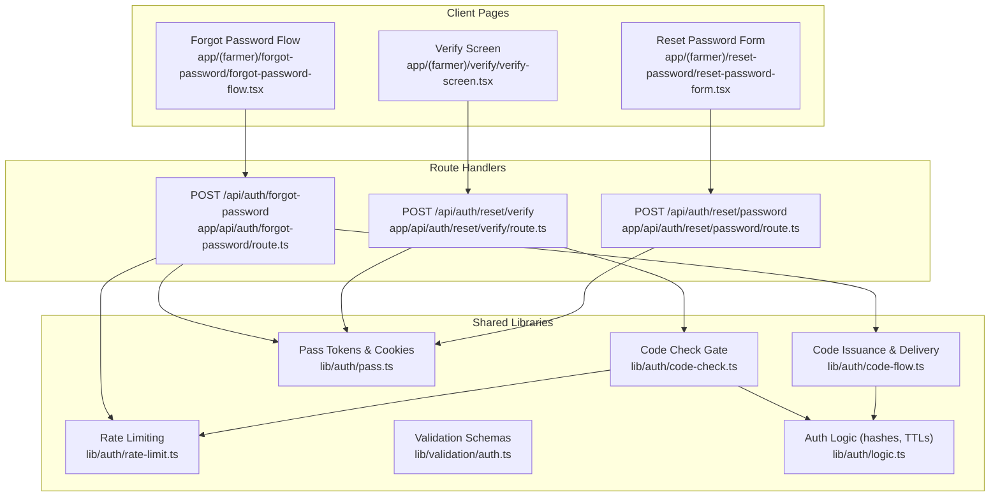
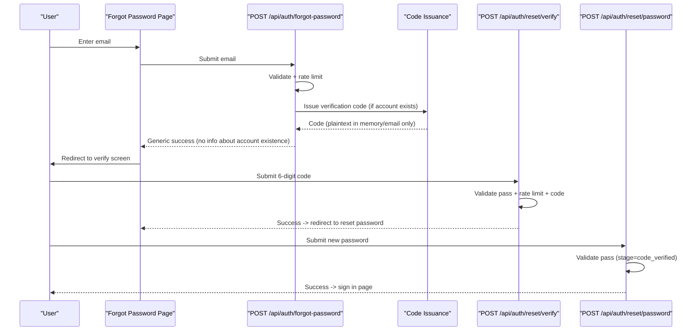
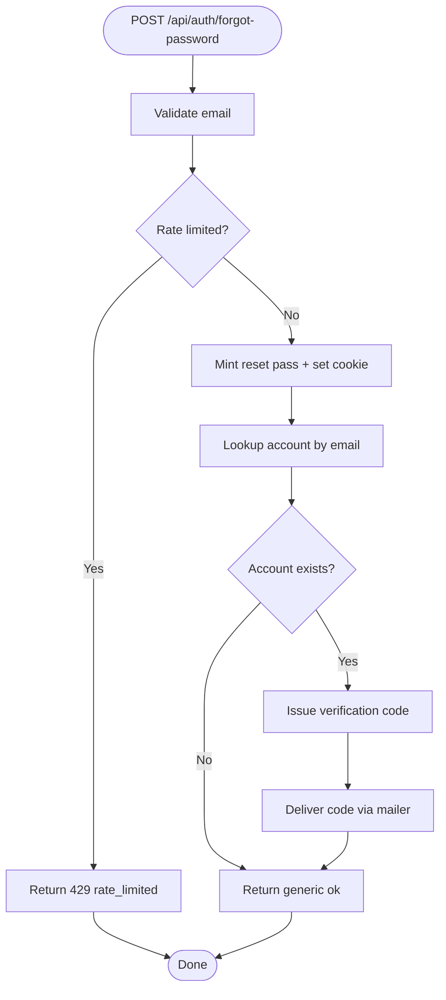
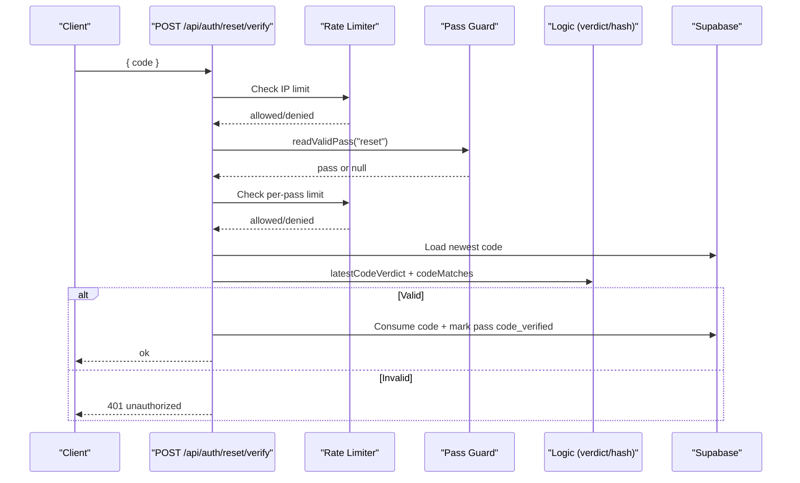
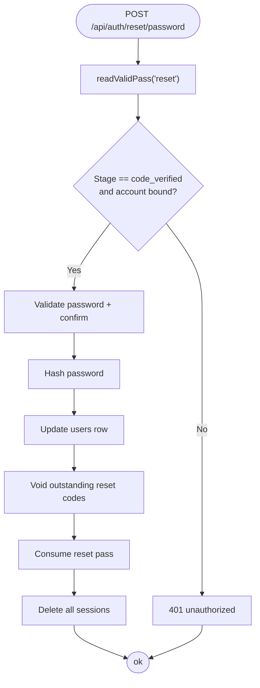
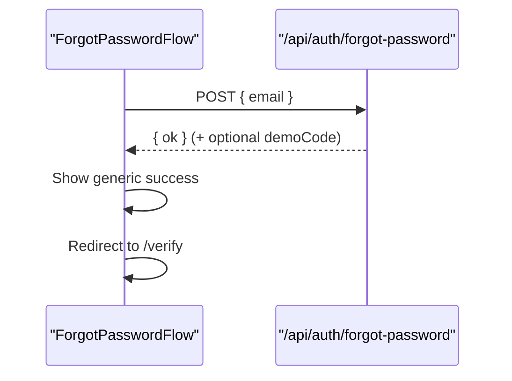
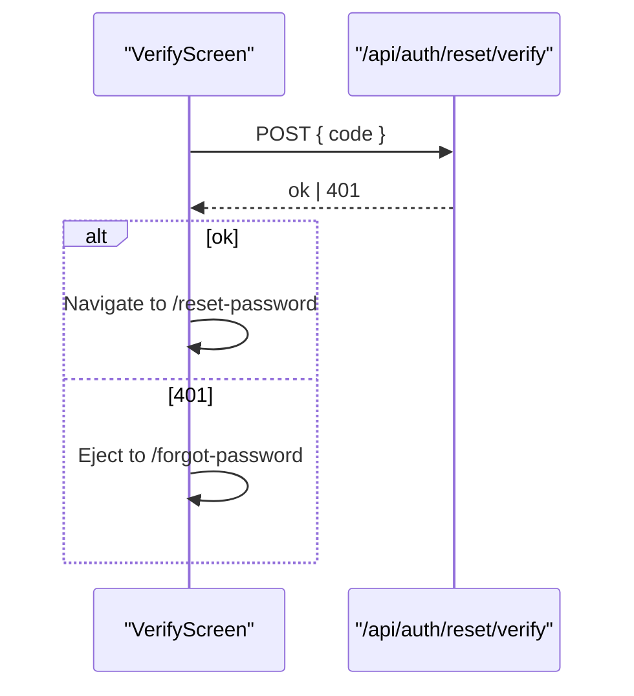
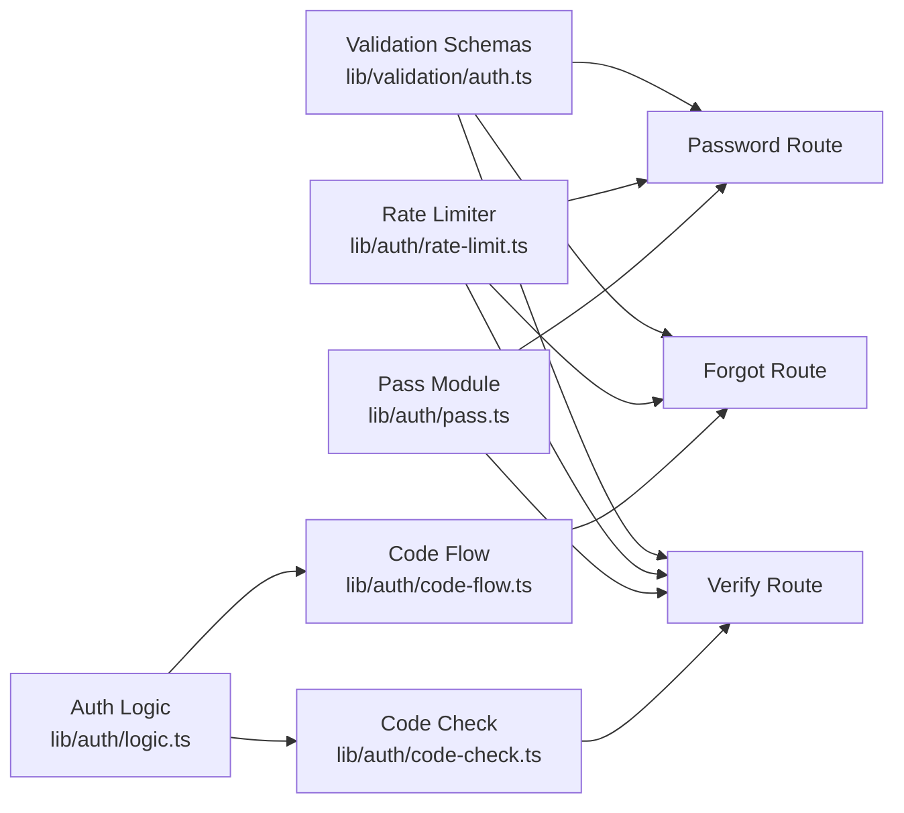

# Password Reset & Recovery

<cite>
**Referenced Files in This Document**
- [route.ts](file://app/api/auth/forgot-password/route.ts)
- [route.ts](file://app/api/auth/reset/verify/route.ts)
- [route.ts](file://app/api/auth/reset/password/route.ts)
- [forgot-password-flow.tsx](file://app/(farmer)/forgot-password/forgot-password-flow.tsx)
- [page.tsx](file://app/(farmer)/verify/page.tsx)
- [verify-screen.tsx](file://app/(farmer)/verify/verify-screen.tsx)
- [reset-password-form.tsx](file://app/(farmer)/reset-password/reset-password-form.tsx)
- [layout.tsx](file://app/(farmer)/verify/layout.tsx)
- [layout.tsx](file://app/(farmer)/reset-password/layout.tsx)
- [code-flow.ts](file://lib/auth/code-flow.ts)
- [pass.ts](file://lib/auth/pass.ts)
- [rate-limit.ts](file://lib/auth/rate-limit.ts)
- [code-check.ts](file://lib/auth/code-check.ts)
- [auth.ts](file://lib/validation/auth.ts)
- [logic.ts](file://lib/auth/logic.ts)
</cite>

## Table of Contents
1. Introduction
2. Project Structure
3. Core Components
4. Architecture Overview
5. Detailed Component Analysis
6. Dependency Analysis
7. Performance Considerations
8. Troubleshooting Guide
9. Conclusion

## Introduction
This document explains Agropioo’s password reset and recovery system end-to-end: initiating a reset, generating and delivering a verification code, securely handling temporary tokens, verifying the code, and completing the password update. It covers the three API endpoints used by the client, the security measures that protect the flow (temporary tokens, code expiration, rate limiting), and how to implement the user interface for each step. Error handling guidance is included for invalid codes, expired tokens, and network failures.

## Project Structure
The password recovery feature spans Next.js App Router pages and Route Handlers, with shared libraries for token management, code issuance, validation, and rate limiting.



**Diagram sources**
- [forgot-password-flow.tsx:23-72](file://app/(farmer)/forgot-password/forgot-password-flow.tsx#L23-L72)
- [route.ts:21-80](file://app/api/auth/forgot-password/route.ts#L21-L80)
- [verify-screen.tsx:59-92](file://app/(farmer)/verify/verify-screen.tsx#L59-L92)
- [route.ts:11-49](file://app/api/auth/reset/verify/route.ts#L11-L49)
- [reset-password-form.tsx:39-59](file://app/(farmer)/reset-password/reset-password-form.tsx#L39-L59)
- [route.ts:20-83](file://app/api/auth/reset/password/route.ts#L20-L83)
- [code-flow.ts:15-50](file://lib/auth/code-flow.ts#L15-L50)
- [pass.ts:111-147](file://lib/auth/pass.ts#L111-L147)
- [rate-limit.ts:15-46](file://lib/auth/rate-limit.ts#L15-L46)
- [code-check.ts:46-125](file://lib/auth/code-check.ts#L46-L125)
- [auth.ts:61-86](file://lib/validation/auth.ts#L61-L86)
- [logic.ts:7-29](file://lib/auth/logic.ts#L7-L29)

**Section sources**
- [forgot-password-flow.tsx:23-72](file://app/(farmer)/forgot-password/forgot-password-flow.tsx#L23-L72)
- [route.ts:21-80](file://app/api/auth/forgot-password/route.ts#L21-L80)
- [verify-screen.tsx:59-92](file://app/(farmer)/verify/verify-screen.tsx#L59-L92)
- [route.ts:11-49](file://app/api/auth/reset/verify/route.ts#L11-L49)
- [reset-password-form.tsx:39-59](file://app/(farmer)/reset-password/reset-password-form.tsx#L39-L59)
- [route.ts:20-83](file://app/api/auth/reset/password/route.ts#L20-L83)
- [code-flow.ts:15-50](file://lib/auth/code-flow.ts#L15-L50)
- [pass.ts:111-147](file://lib/auth/pass.ts#L111-L147)
- [rate-limit.ts:15-46](file://lib/auth/rate-limit.ts#L15-L46)
- [code-check.ts:46-125](file://lib/auth/code-check.ts#L46-L125)
- [auth.ts:61-86](file://lib/validation/auth.ts#L61-L86)
- [logic.ts:7-29](file://lib/auth/logic.ts#L7-L29)

## Core Components
- Forgot Password initiation: POST /api/auth/forgot-password creates a temporary reset pass, issues a verification code if the email exists, delivers it via mailer, and returns a generic success response.
- Code verification: POST /api/auth/reset/verify validates the submitted code against the latest live code for the email bound to a valid reset pass, consumes the code, and marks the pass as code_verified.
- Password update: POST /api/auth/reset/password requires a reset pass at stage code_verified with an account bound; updates the password hash, voids outstanding reset codes, consumes the pass, and kills all sessions.

Security measures include:
- Temporary tokens: HS256 JWT passes stored in httpOnly cookies with server-side state rows (pass_states).
- Code lifecycle: SHA-256 hashed storage, 10-minute TTL, last-code-wins semantics, wrong-entry limits, and pass-level wrong totals.
- Rate limiting: Dual-dimension limits per IP and per email/pass for forgot, resend, and code checks.

**Section sources**
- [route.ts:21-80](file://app/api/auth/forgot-password/route.ts#L21-L80)
- [route.ts:11-49](file://app/api/auth/reset/verify/route.ts#L11-L49)
- [route.ts:20-83](file://app/api/auth/reset/password/route.ts#L20-L83)
- [pass.ts:1-6](file://lib/auth/pass.ts#L1-L6)
- [pass.ts:111-147](file://lib/auth/pass.ts#L111-L147)
- [code-flow.ts:15-50](file://lib/auth/code-flow.ts#L15-L50)
- [code-check.ts:46-125](file://lib/auth/code-check.ts#L46-L125)
- [rate-limit.ts:15-46](file://lib/auth/rate-limit.ts#L15-L46)
- [logic.ts:7-29](file://lib/auth/logic.ts#L7-L29)

## Architecture Overview
The flow uses a three-step process enforced by server-side gates and UI routing:



**Diagram sources**
- [forgot-password-flow.tsx:48-72](file://app/(farmer)/forgot-password/forgot-password-flow.tsx#L48-L72)
- [route.ts:21-80](file://app/api/auth/forgot-password/route.ts#L21-L80)
- [code-flow.ts:15-50](file://lib/auth/code-flow.ts#L15-L50)
- [verify-screen.tsx:59-92](file://app/(farmer)/verify/verify-screen.tsx#L59-L92)
- [route.ts:11-49](file://app/api/auth/reset/verify/route.ts#L11-L49)
- [reset-password-form.tsx:39-59](file://app/(farmer)/reset-password/reset-password-form.tsx#L39-L59)
- [route.ts:20-83](file://app/api/auth/reset/password/route.ts#L20-L83)

## Detailed Component Analysis

### Step 1: Initiate Reset (/api/auth/forgot-password)
- Validates email using shared schema.
- Applies dual rate limits (IP and email).
- Creates a reset pass (HS256 JWT) and sets an httpOnly cookie.
- Looks up the account; if found, issues a verification code and delivers it via mailer.
- Returns a uniform success payload regardless of whether the email exists.



**Diagram sources**
- [route.ts:21-80](file://app/api/auth/forgot-password/route.ts#L21-L80)
- [code-flow.ts:15-50](file://lib/auth/code-flow.ts#L15-L50)
- [rate-limit.ts:15-46](file://lib/auth/rate-limit.ts#L15-L46)
- [pass.ts:111-147](file://lib/auth/pass.ts#L111-L147)

**Section sources**
- [route.ts:21-80](file://app/api/auth/forgot-password/route.ts#L21-L80)
- [code-flow.ts:15-50](file://lib/auth/code-flow.ts#L15-L50)
- [rate-limit.ts:15-46](file://lib/auth/rate-limit.ts#L15-L46)
- [pass.ts:111-147](file://lib/auth/pass.ts#L111-L147)

### Step 2: Verify Code (/api/auth/reset/verify)
- Enforces rate limits (IP and per-pass).
- Requires a valid reset pass (present, signed, not consumed/dead/expired).
- Loads the newest non-voided code for the email and verifies it is open.
- Compares the submitted code against the stored hash.
- On success, consumes the code and upgrades the pass to code_verified with account binding.



**Diagram sources**
- [route.ts:11-49](file://app/api/auth/reset/verify/route.ts#L11-L49)
- [code-check.ts:46-125](file://lib/auth/code-check.ts#L46-L125)
- [pass.ts:196-231](file://lib/auth/pass.ts#L196-L231)
- [logic.ts:52-69](file://lib/auth/logic.ts#L52-L69)

**Section sources**
- [route.ts:11-49](file://app/api/auth/reset/verify/route.ts#L11-L49)
- [code-check.ts:46-125](file://lib/auth/code-check.ts#L46-L125)
- [pass.ts:196-231](file://lib/auth/pass.ts#L196-L231)
- [logic.ts:52-69](file://lib/auth/logic.ts#L52-L69)

### Step 3: Update Password (/api/auth/reset/password)
- Requires a reset pass at stage code_verified with a bound account_id.
- Validates new password and confirmation via shared schema.
- Hashes the password and updates the user record; marks email verified.
- Voids all outstanding reset codes for the email and consumes the reset pass.
- Deletes all sessions for the account (force re-authentication).



**Diagram sources**
- [route.ts:20-83](file://app/api/auth/reset/password/route.ts#L20-L83)
- [pass.ts:196-231](file://lib/auth/pass.ts#L196-L231)
- [auth.ts:76-86](file://lib/validation/auth.ts#L76-L86)

**Section sources**
- [route.ts:20-83](file://app/api/auth/reset/password/route.ts#L20-L83)
- [pass.ts:196-231](file://lib/auth/pass.ts#L196-L231)
- [auth.ts:76-86](file://lib/validation/auth.ts#L76-L86)

### Client Implementation Notes

#### Forgot Password Form
- Posts email to /api/auth/forgot-password.
- On success, shows a neutral “Check your inbox” message and auto-advances to /verify.
- Handles rate-limited responses and displays a friendly error.



**Diagram sources**
- [forgot-password-flow.tsx:48-72](file://app/(farmer)/forgot-password/forgot-password-flow.tsx#L48-L72)

**Section sources**
- [forgot-password-flow.tsx:48-72](file://app/(farmer)/forgot-password/forgot-password-flow.tsx#L48-L72)

#### Verification Input Handling
- The shared OTP component posts the code to /api/auth/reset/verify.
- On success, navigates to /reset-password.
- On pass-gate failure, ejects back to /forgot-password; on code errors, allows retry.



**Diagram sources**
- [verify-screen.tsx:59-92](file://app/(farmer)/verify/verify-screen.tsx#L59-L92)
- [route.ts:11-49](file://app/api/auth/reset/verify/route.ts#L11-L49)

**Section sources**
- [verify-screen.tsx:59-92](file://app/(farmer)/verify/verify-screen.tsx#L59-L92)
- [route.ts:11-49](file://app/api/auth/reset/verify/route.ts#L11-L49)

#### Secure Password Update Interface
- Server-gated layout ensures only guests with a reset pass at stage code_verified can access.
- Form posts to /api/auth/reset/password; on success, shows completion and directs to login.
- On unauthorized pass state, redirects back to /forgot-password.

```mermaid
sequenceDiagram
participant UI as "ResetPasswordForm"
participant Layout as "ResetPasswordLayout"
participant API as "/api/auth/reset/password"
Layout->>Layout : requireGuestPage()
Layout->>Layout : readValidPass("reset")
alt pass valid + stage code_verified
UI->>API : POST { password, confirmPassword }
API-->>UI : ok | 401
opt ok
UI->>UI : Show success + link to login
else 401
UI->>UI : Redirect to /forgot-password
end
else invalid
Layout->>UI : Redirect to /forgot-password
end
```

**Diagram sources**
- [layout.tsx:12-20](file://app/(farmer)/reset-password/layout.tsx#L12-L20)
- [reset-password-form.tsx:39-59](file://app/(farmer)/reset-password/reset-password-form.tsx#L39-L59)
- [route.ts:20-83](file://app/api/auth/reset/password/route.ts#L20-L83)

**Section sources**
- [layout.tsx:12-20](file://app/(farmer)/reset-password/layout.tsx#L12-L20)
- [reset-password-form.tsx:39-59](file://app/(farmer)/reset-password/reset-password-form.tsx#L39-L59)
- [route.ts:20-83](file://app/api/auth/reset/password/route.ts#L20-L83)

## Dependency Analysis
Key dependencies and their roles:
- Validation schemas ensure consistent input handling across client and server.
- Rate limiter protects endpoints from abuse using fixed windows.
- Pass module manages JWT creation, verification, and cookie lifecycle with server-side state enforcement.
- Code flow handles last-code-wins, hashing, TTL, and delivery.
- Code check gate orchestrates rate limits, pass validation, code verdict, and wrong-entry accounting.



**Diagram sources**
- [auth.ts:61-86](file://lib/validation/auth.ts#L61-L86)
- [rate-limit.ts:15-46](file://lib/auth/rate-limit.ts#L15-L46)
- [pass.ts:111-147](file://lib/auth/pass.ts#L111-L147)
- [code-flow.ts:15-50](file://lib/auth/code-flow.ts#L15-L50)
- [code-check.ts:46-125](file://lib/auth/code-check.ts#L46-L125)
- [logic.ts:7-29](file://lib/auth/logic.ts#L7-L29)

**Section sources**
- [auth.ts:61-86](file://lib/validation/auth.ts#L61-L86)
- [rate-limit.ts:15-46](file://lib/auth/rate-limit.ts#L15-L46)
- [pass.ts:111-147](file://lib/auth/pass.ts#L111-L147)
- [code-flow.ts:15-50](file://lib/auth/code-flow.ts#L15-L50)
- [code-check.ts:46-125](file://lib/auth/code-check.ts#L46-L125)
- [logic.ts:7-29](file://lib/auth/logic.ts#L7-L29)

## Performance Considerations
- Minimal database writes: Only one lookup per forgot request; code issuance and verification are lightweight.
- In-memory rate limiter: Fast but resets on restart; consider Redis for multi-instance deployments.
- Last-code-wins reduces race conditions and unnecessary retries.
- Bcrypt cost is moderate; adjust based on performance needs while maintaining security.

[No sources needed since this section provides general guidance]

## Troubleshooting Guide
Common issues and resolutions:
- Invalid code: The code check enforces latest-code-wins and wrong-entry limits; after too many attempts, the code or pass may be dead. Retry with a fresh code.
- Expired token: Reset passes expire after a fixed TTL; if expired, start a new reset flow.
- Network failures: Clients should handle fetch errors gracefully and allow retry; show a generic server error message when parsing fails.
- Rate limiting: If you see rate-limited responses, wait before retrying; both IP and email/pass dimensions are enforced.

**Section sources**
- [code-check.ts:46-125](file://lib/auth/code-check.ts#L46-L125)
- [pass.ts:196-231](file://lib/auth/pass.ts#L196-L231)
- [forgot-password-flow.tsx:48-72](file://app/(farmer)/forgot-password/forgot-password-flow.tsx#L48-L72)
- [verify-screen.tsx:36-57](file://app/(farmer)/verify/verify-screen.tsx#L36-L57)

## Conclusion
Agropioo’s password reset and recovery system combines secure temporary tokens, hashed verification codes with short lifetimes, robust rate limiting, and strict server-side gating to provide a safe and user-friendly recovery experience. The three-step flow is clearly separated into initiation, verification, and password update, with consistent error handling and neutral messaging to prevent information leakage. Implementations on the client side follow predictable patterns for form submission, redirection, and error display, ensuring a smooth user journey.