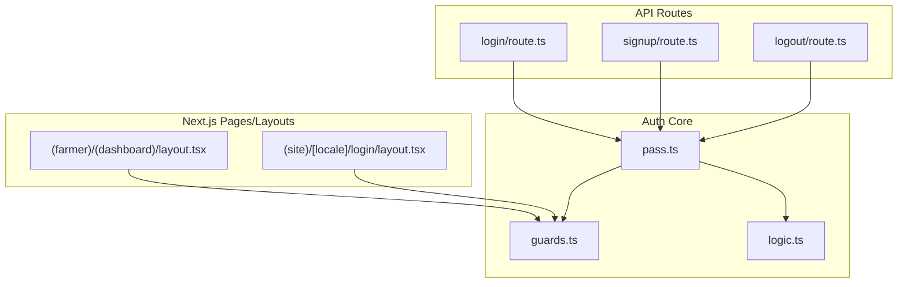
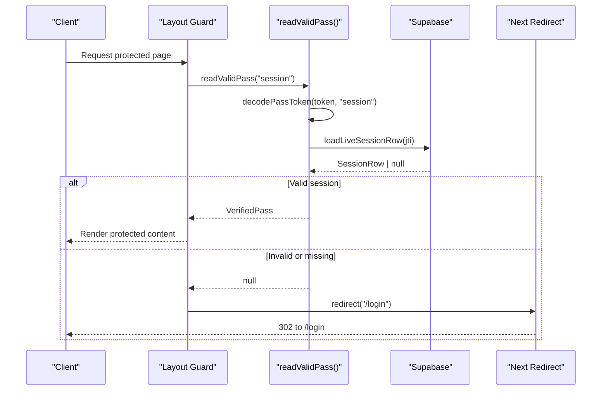
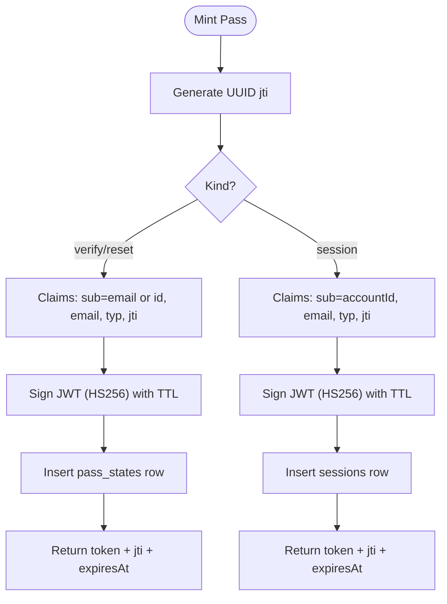
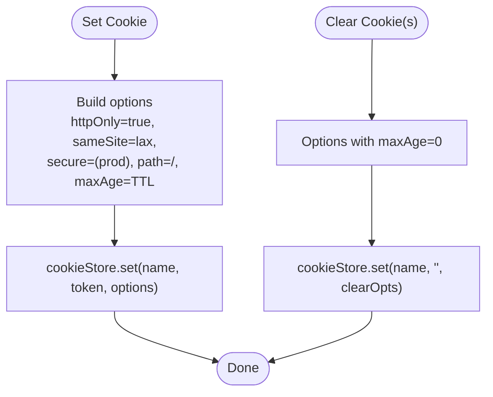
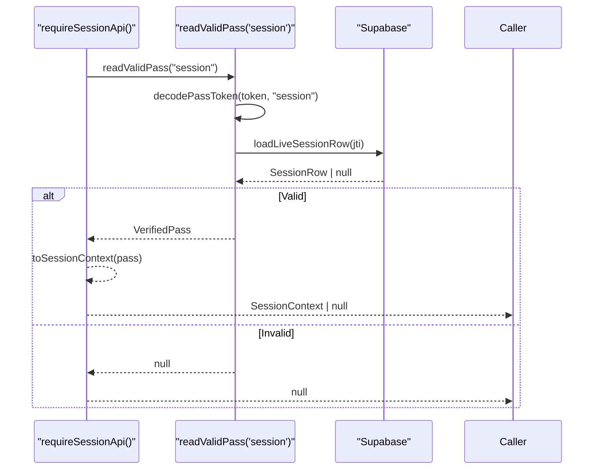
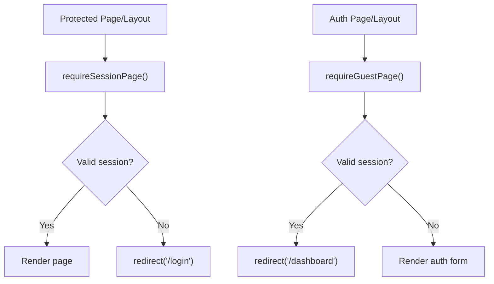
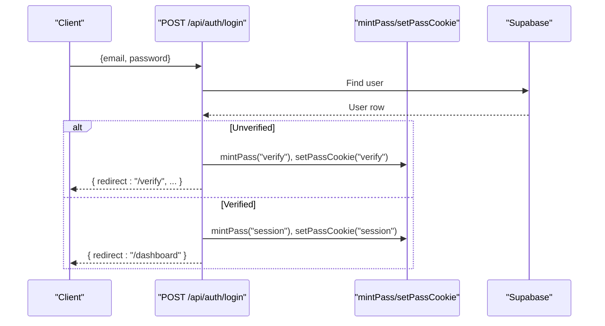
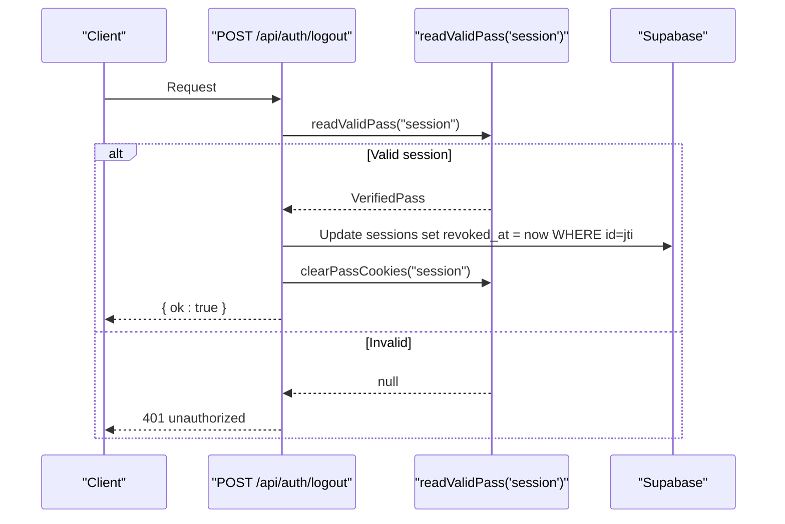
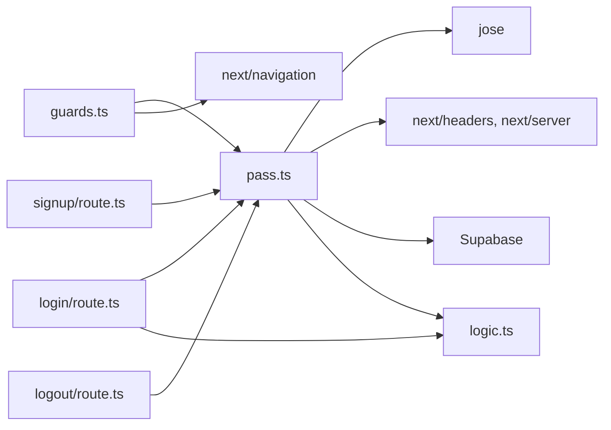

# Session Management & JWT Handling

<cite>
**Referenced Files in This Document**
- [pass.ts](file://lib/auth/pass.ts)
- [guards.ts](file://lib/auth/guards.ts)
- [login route.ts](file://app/api/auth/login/route.ts)
- [signup route.ts](file://app/api/auth/signup/route.ts)
- [logout route.ts](file://app/api/auth/logout/route.ts)
- [logic.ts](file://lib/auth/logic.ts)
- [dashboard layout.tsx](file://app/(farmer)/(dashboard)/layout.tsx)
- [login layout.tsx](file://app/(site)/[locale]/login/layout.tsx)
- [authentication plan.md](file://specs/authentication/plan.md)
- [auth architecture ADR](file://adrs/0003-auth-pass-architecture.md)
</cite>

## Table of Contents
1. [Introduction](#introduction)
2. [Project Structure](#project-structure)
3. [Core Components](#core-components)
4. [Architecture Overview](#architecture-overview)
5. [Detailed Component Analysis](#detailed-component-analysis)
6. [Dependency Analysis](#dependency-analysis)
7. [Performance Considerations](#performance-considerations)
8. [Troubleshooting Guide](#troubleshooting-guide)
9. [Conclusion](#conclusion)
10. [Appendices](#appendices)

## Introduction
This document explains Agropioo’s session management system built on state-backed JWTs using the jose library. It covers token generation, signing, and validation; secure cookie handling; session context extraction; guard functions for protecting routes and API endpoints; logout flow and session cleanup; and security considerations including expiration, refresh strategies, and protection against common vulnerabilities.

## Project Structure
The authentication subsystem is implemented across a small set of focused modules:
- Token lifecycle and cookies: lib/auth/pass.ts
- Route guards and session context: lib/auth/guards.ts
- Pure decision logic (codes, sessions): lib/auth/logic.ts
- API routes for login, signup, logout: app/api/auth/*
- Layouts that enforce access: app/(farmer)/(dashboard)/layout.tsx and app/(site)/[locale]/login/layout.tsx
- Design decisions and constraints: specs/authentication/plan.md and adrs/0003-auth-pass-architecture.md

**Diagram sources**
- [pass.ts:1-264](file://lib/auth/pass.ts#L1-L264)
- [guards.ts:1-38](file://lib/auth/guards.ts#L1-L38)
- [logic.ts:1-127](file://lib/auth/logic.ts#L1-L127)
- [login route.ts:1-112](file://app/api/auth/login/route.ts#L1-L112)
- [signup route.ts:1-119](file://app/api/auth/signup/route.ts#L1-L119)
- [logout route.ts:1-30](file://app/api/auth/logout/route.ts#L1-L30)
- [dashboard layout.tsx:1-26](file://app/(farmer)/(dashboard)/layout.tsx#L1-L26)
- [login layout.tsx:1-10](file://app/(site)/[locale]/login/layout.tsx#L1-L10)

**Section sources**
- [pass.ts:1-264](file://lib/auth/pass.ts#L1-L264)
- [guards.ts:1-38](file://lib/auth/guards.ts#L1-L38)
- [logic.ts:1-127](file://lib/auth/logic.ts#L1-L127)
- [login route.ts:1-112](file://app/api/auth/login/route.ts#L1-L112)
- [signup route.ts:1-119](file://app/api/auth/signup/route.ts#L1-L119)
- [logout route.ts:1-30](file://app/api/auth/logout/route.ts#L1-L30)
- [dashboard layout.tsx:1-26](file://app/(farmer)/(dashboard)/layout.tsx#L1-L26)
- [login layout.tsx:1-10](file://app/(site)/[locale]/login/layout.tsx#L1-L10)

## Core Components
- State-backed JWTs: HS256 tokens signed with jose, carrying sub, email, typ, jti, exp. Each token’s jti owns a database row (sessions or pass_states) holding mutable truth (consumed/dead/expired/revoked).
- Secure cookies: Three httpOnly cookies (agro_verify, agro_reset, agro_session), SameSite=Lax, Secure in production, path “/”. TTLs are fixed per kind.
- Guards: requireSessionPage() redirects guests to /login; requireGuestPage() redirects authenticated users to /dashboard; requireSessionApi() returns null for unauthenticated requests so handlers can respond with a uniform 401 shape.
- Session context: Extracted from verified passes into a minimal SessionContext { accountId, email } used by layouts and handlers.

**Section sources**
- [pass.ts:15-63](file://lib/auth/pass.ts#L15-L63)
- [pass.ts:234-263](file://lib/auth/pass.ts#L234-L263)
- [guards.ts:9-37](file://lib/auth/guards.ts#L9-L37)
- [authentication plan.md:26-41](file://specs/authentication/plan.md#L26-L41)
- [auth architecture ADR:13-39](file://adrs/0003-auth-pass-architecture.md#L13-L39)

## Architecture Overview
The system enforces a strict verification order: cookie present → signature valid → type matches → row live (not consumed/dead/expired; sessions also un-revoked) → account exists. Any failure yields a neutral outcome.

**Diagram sources**
- [guards.ts:18-23](file://lib/auth/guards.ts#L18-L23)
- [pass.ts:196-232](file://lib/auth/pass.ts#L196-L232)
- [pass.ts:176-194](file://lib/auth/pass.ts#L176-L194)

## Detailed Component Analysis

### Token Generation, Signing, and Validation
- Signing: HS256 tokens created via jose SignJWT with alg HS256, subject (sub), jti, issued at, and expiration time based on fixed TTLs per pass kind.
- Validation: jwtVerify with clock tolerance; payload must include required fields and typ must match the expected kind.
- State binding: mintPass persists a corresponding row in either sessions or pass_states, keyed by jti, with appropriate TTL and metadata. For sessions, the row tracks expires_at and revoked_at.

**Diagram sources**
- [pass.ts:91-148](file://lib/auth/pass.ts#L91-L148)

**Section sources**
- [pass.ts:64-104](file://lib/auth/pass.ts#L64-L104)
- [pass.ts:111-148](file://lib/auth/pass.ts#L111-L148)

### Secure Cookie Implementation
- Cookies: agro_verify, agro_reset, agro_session. All httpOnly; Secure enabled in production; SameSite=Lax; path “/”; maxAge set per kind.
- Setting/Clearing: setPassCookie writes the token with the correct TTL; clearPassCookies clears one or more cookies immediately (used on logout, completion, or cross-kind cleanup).

**Diagram sources**
- [pass.ts:234-263](file://lib/auth/pass.ts#L234-L263)

**Section sources**
- [pass.ts:234-263](file://lib/auth/pass.ts#L234-L263)
- [authentication plan.md:26-41](file://specs/authentication/plan.md#L26-L41)
- [auth architecture ADR:13-39](file://adrs/0003-auth-pass-architecture.md#L13-L39)

### Session Context Extraction
- readValidPass(kind) performs the full guard chain: connection lock, cookie read, token decode, row lookup, and account existence checks.
- toSessionContext maps a VerifiedPass to a minimal SessionContext { accountId, email }, which is safe to use downstream.

**Diagram sources**
- [guards.ts:32-37](file://lib/auth/guards.ts#L32-L37)
- [pass.ts:196-232](file://lib/auth/pass.ts#L196-L232)
- [pass.ts:176-194](file://lib/auth/pass.ts#L176-L194)

**Section sources**
- [guards.ts:9-37](file://lib/auth/guards.ts#L9-L37)
- [pass.ts:196-232](file://lib/auth/pass.ts#L196-L232)

### Guard Functions for Protecting Routes and APIs
- requireSessionPage(): Used in layouts to protect pages. If no valid session, redirects to /login.
- requireGuestPage(): Used in auth layouts to prevent authenticated users from accessing login/signup/forgot/reset screens; redirects to /dashboard.
- requireSessionApi(): Used in API routes; returns null when unauthenticated so handlers can return a uniform 401 response.

**Diagram sources**
- [guards.ts:18-30](file://lib/auth/guards.ts#L18-L30)
- [dashboard layout.tsx:1-26](file://app/(farmer)/(dashboard)/layout.tsx#L1-L26)
- [login layout.tsx:1-10](file://app/(site)/[locale]/login/layout.tsx#L1-L10)

**Section sources**
- [guards.ts:18-30](file://lib/auth/guards.ts#L18-L30)
- [dashboard layout.tsx:1-26](file://app/(farmer)/(dashboard)/layout.tsx#L1-L26)
- [login layout.tsx:1-10](file://app/(site)/[locale]/login/layout.tsx#L1-L10)

### Login Flow and Protected Routes Integration
- POST /api/auth/login validates input, applies rate limiting, verifies credentials, then:
  - For unverified accounts: issues a verify pass and code, sets the verify cookie, and returns a redirect to /verify.
  - For verified accounts: mints a session pass, sets the session cookie, clears verify/reset cookies, and returns a redirect to /dashboard.
- Protected pages/layouts call requireSessionPage() once at the top-level layout to ensure all nested pages are guarded.

**Diagram sources**
- [login route.ts:41-106](file://app/api/auth/login/route.ts#L41-L106)
- [pass.ts:111-148](file://lib/auth/pass.ts#L111-L148)

**Section sources**
- [login route.ts:1-112](file://app/api/auth/login/route.ts#L1-L112)
- [dashboard layout.tsx:1-26](file://app/(farmer)/(dashboard)/layout.tsx#L1-L26)

### Logout Flow and Session Cleanup
- POST /api/auth/logout:
  - Reads and validates the current session pass.
  - Revokes the session row server-side by setting revoked_at.
  - Clears the session cookie immediately.
  - Returns a success response; other devices’ sessions remain unaffected.

**Diagram sources**
- [logout route.ts:10-25](file://app/api/auth/logout/route.ts#L10-L25)
- [pass.ts:196-232](file://lib/auth/pass.ts#L196-L232)

**Section sources**
- [logout route.ts:1-30](file://app/api/auth/logout/route.ts#L1-L30)
- [pass.ts:257-263](file://lib/auth/pass.ts#L257-L263)

### Examples: Implementing Protected Routes and Server Components
- Protecting a dashboard layout: Call requireSessionPage() at the top of the layout to enforce access for all child pages.
- Protecting an API route: Call requireSessionApi() and handle null by returning a 401 response with the standard error shape.
- Preventing authenticated users from visiting auth pages: Call requireGuestPage() in the layout for login/signup/forgot-password/reset-password.

**Section sources**
- [dashboard layout.tsx:1-26](file://app/(farmer)/(dashboard)/layout.tsx#L1-L26)
- [guards.ts:18-37](file://lib/auth/guards.ts#L18-L37)

## Dependency Analysis
- pass.ts depends on jose for signing/verification, next/headers and next/server for cookie and request context, Supabase for persistence, and logic.ts for session activity checks.
- guards.ts depends on pass.ts for reading valid passes and Next navigation for redirects.
- API routes depend on pass.ts for minting/clearing cookies and on logic.ts for decisions like redirect targets.

**Diagram sources**
- [pass.ts:1-14](file://lib/auth/pass.ts#L1-L14)
- [guards.ts:1-8](file://lib/auth/guards.ts#L1-L8)
- [login route.ts:1-24](file://app/api/auth/login/route.ts#L1-L24)
- [signup route.ts:1-17](file://app/api/auth/signup/route.ts#L1-L17)
- [logout route.ts:1-9](file://app/api/auth/logout/route.ts#L1-L9)

**Section sources**
- [pass.ts:1-14](file://lib/auth/pass.ts#L1-L14)
- [guards.ts:1-8](file://lib/auth/guards.ts#L1-L8)
- [login route.ts:1-24](file://app/api/auth/login/route.ts#L1-L24)
- [signup route.ts:1-17](file://app/api/auth/signup/route.ts#L1-L17)
- [logout route.ts:1-9](file://app/api/auth/logout/route.ts#L1-L9)

## Performance Considerations
- Per-request auth checks: readValidPass forces a connection before touching cookies to prevent static/prerender bypasses.
- Minimal claims: Tokens carry only necessary fields (sub, email, typ, jti, exp) to reduce payload size and risk.
- Fixed TTLs: Short-lived verify/reset passes (1 hour) and longer session passes (7 days) balance usability and security.
- Database lookups: Only essential rows are fetched during validation; account existence checks are performed only when needed.

[No sources needed since this section provides general guidance]

## Troubleshooting Guide
Common issues and where to inspect:
- Missing or invalid JWT_SECRET: Signing key creation will throw if secret is missing or too short. Ensure environment variable meets minimum length requirements.
- Wrong-type rejection: decodePassToken requires typ to match the requested kind; mismatched cookies result in null.
- Expired or tampered tokens: Decoding failures return null uniformly to avoid leaking information.
- Session not active: Sessions are rejected if revoked_at is set or expires_at has passed.
- Rate limiting: Login and signup endpoints apply dual-dimension limits (IP and email/account); breaches return a 429 with a standard message.

Where to look:
- Token decoding and signing: [pass.ts:64-104](file://lib/auth/pass.ts#L64-L104)
- Full pass validation chain: [pass.ts:196-232](file://lib/auth/pass.ts#L196-L232)
- Session activity check: [logic.ts:117-126](file://lib/auth/logic.ts#L117-L126)
- Rate limiting usage in login/signup: [login route.ts:49-64](file://app/api/auth/login/route.ts#L49-L64), [signup route.ts:35-50](file://app/api/auth/signup/route.ts#L35-L50)

**Section sources**
- [pass.ts:64-104](file://lib/auth/pass.ts#L64-L104)
- [pass.ts:196-232](file://lib/auth/pass.ts#L196-L232)
- [logic.ts:117-126](file://lib/auth/logic.ts#L117-L126)
- [login route.ts:49-64](file://app/api/auth/login/route.ts#L49-L64)
- [signup route.ts:35-50](file://app/api/auth/signup/route.ts#L35-L50)

## Conclusion
Agropioo’s session system combines jose-signed HS256 JWTs with server-side state to provide robust, revocable sessions. Security is enforced through strict cookie flags, precise type checking, and database-backed validity checks. Guards centralize access control in layouts and API choke points, while logout revokes sessions server-side and clears cookies. The design balances usability with strong protections against common threats such as replay, enumeration, and token theft.

[No sources needed since this section summarizes without analyzing specific files]

## Appendices

### Security Considerations
- Token expiration: Verify uses jose’s built-in exp enforcement with a small clock tolerance; sessions additionally rely on DB row expiry and revocation.
- Refresh strategy: Current implementation does not include automatic refresh; consider adding a silent refresh endpoint that reissues a session cookie before expiry while validating server-side state.
- Protection against common vulnerabilities:
  - CSRF: httpOnly + SameSite=Lax cookies mitigate many CSRF vectors; ensure sensitive actions are protected by proper origin checks if needed.
  - XSS: httpOnly cookies prevent client-side script access to tokens.
  - Enumeration resistance: Unknown emails still perform bcrypt comparison against a dummy hash to equalize timing; responses are generic.
  - Replay/multi-use prevention: Single-use passes for verify/reset; sessions are tracked and revocable.

**Section sources**
- [pass.ts:72-89](file://lib/auth/pass.ts#L72-L89)
- [login route.ts:26-39](file://app/api/auth/login/route.ts#L26-L39)
- [authentication plan.md:26-41](file://specs/authentication/plan.md#L26-L41)
- [auth architecture ADR:13-39](file://adrs/0003-auth-pass-architecture.md#L13-L39)