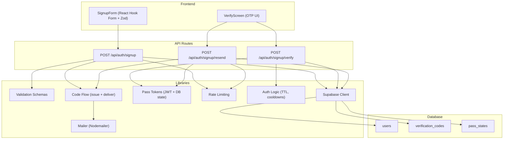
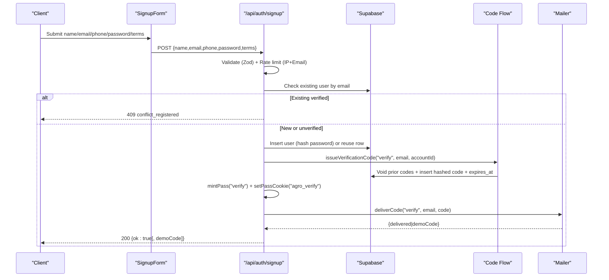
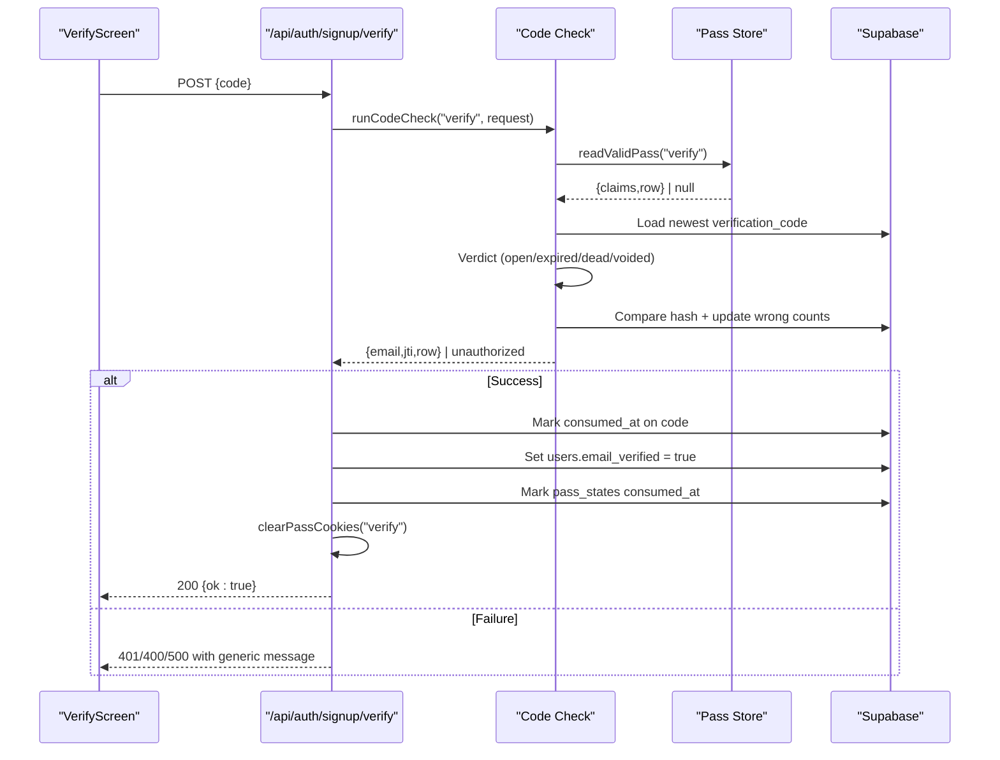
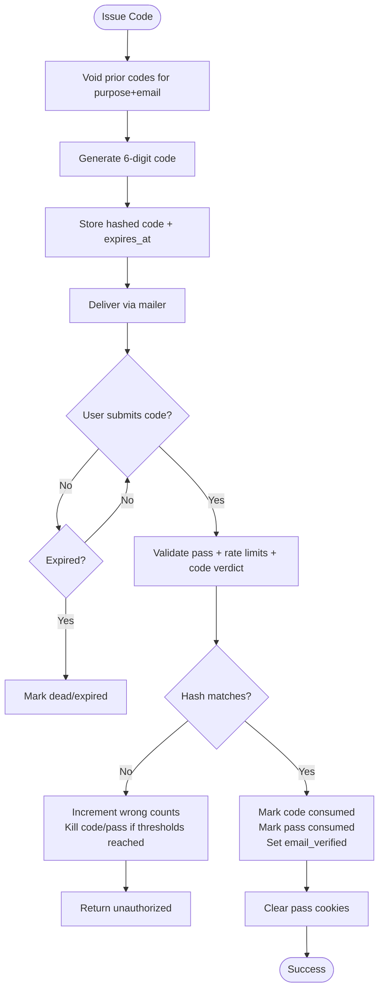
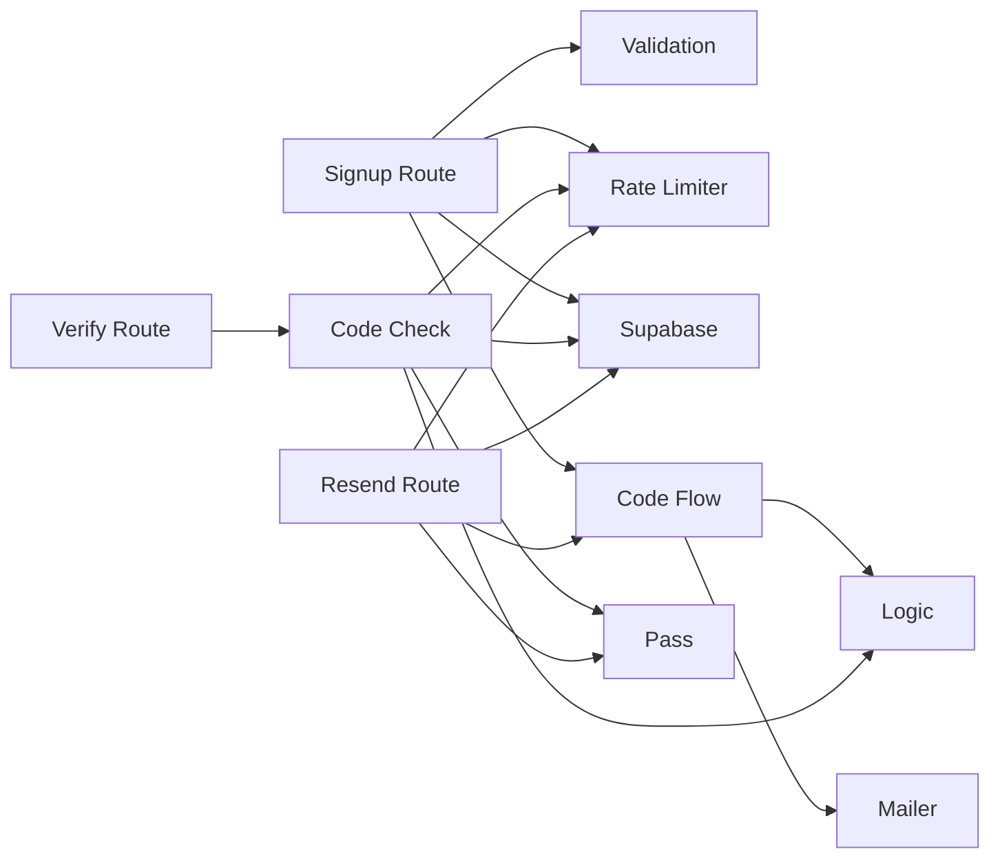

# User Registration & Email Verification

<cite>
**Referenced Files in This Document**
- [route.ts](file://app/api/auth/signup/route.ts)
- [route.ts](file://app/api/auth/signup/verify/route.ts)
- [route.ts](file://app/api/auth/signup/resend/route.ts)
- [auth.ts](file://lib/validation/auth.ts)
- [code-flow.ts](file://lib/auth/code-flow.ts)
- [pass.ts](file://lib/auth/pass.ts)
- [rate-limit.ts](file://lib/auth/rate-limit.ts)
- [logic.ts](file://lib/auth/logic.ts)
- [code-check.ts](file://lib/auth/code-check.ts)
- [mailer.ts](file://lib/mailer.ts)
- [supabase.ts](file://lib/supabase.ts)
- [signup-form.tsx](file://app/(site)/[locale]/signup/signup-form.tsx)
- [verify-screen.tsx](file://app/(farmer)/verify/verify-screen.tsx)
- [0002_auth.sql](file://supabase/migrations/0002_auth.sql)
</cite>

## Table of Contents
1. [Introduction](#introduction)
2. [Project Structure](#project-structure)
3. [Core Components](#core-components)
4. [Architecture Overview](#architecture-overview)
5. [Detailed Component Analysis](#detailed-component-analysis)
6. [Dependency Analysis](#dependency-analysis)
7. [Performance Considerations](#performance-considerations)
8. [Troubleshooting Guide](#troubleshooting-guide)
9. [Conclusion](#conclusion)
10. [Appendices](#appendices)

## Introduction
This document explains Agropioo’s user registration and email verification system end-to-end. It covers the signup flow, form validation, creation of users in Supabase, generation and delivery of 6-digit verification codes via Nodemailer, code verification completion, code lifecycle and expiration handling, resend functionality, API endpoints, request/response schemas, error handling patterns, security considerations (including rate limiting), and guidance for implementing the React Hook Form + Zod-based signup UI with proper state management and user feedback.

## Project Structure
The registration and verification features are implemented as:
- Next.js Route Handlers under app/api/auth for signup, verify, and resend
- Shared libraries for validation, code issuance/delivery, pass tokens, rate limiting, and logic
- Frontend pages/components for signup and verification flows
- Supabase schema for users, verification codes, pass states, and sessions

**Diagram sources**
- [route.ts:1-119](file://app/api/auth/signup/route.ts#L1-L119)
- [route.ts:1-59](file://app/api/auth/signup/verify/route.ts#L1-L59)
- [route.ts:1-84](file://app/api/auth/signup/resend/route.ts#L1-L84)
- [auth.ts:1-87](file://lib/validation/auth.ts#L1-L87)
- [code-flow.ts:1-52](file://lib/auth/code-flow.ts#L1-L52)
- [pass.ts:1-264](file://lib/auth/pass.ts#L1-L264)
- [rate-limit.ts:1-53](file://lib/auth/rate-limit.ts#L1-L53)
- [logic.ts:1-127](file://lib/auth/logic.ts#L1-L127)
- [code-check.ts:1-126](file://lib/auth/code-check.ts#L1-L126)
- [mailer.ts:1-85](file://lib/mailer.ts#L1-L85)
- [supabase.ts:1-47](file://lib/supabase.ts#L1-L47)
- [0002_auth.sql:1-61](file://supabase/migrations/0002_auth.sql#L1-L61)

**Section sources**
- [route.ts:1-119](file://app/api/auth/signup/route.ts#L1-L119)
- [route.ts:1-59](file://app/api/auth/signup/verify/route.ts#L1-L59)
- [route.ts:1-84](file://app/api/auth/signup/resend/route.ts#L1-L84)
- [auth.ts:1-87](file://lib/validation/auth.ts#L1-L87)
- [code-flow.ts:1-52](file://lib/auth/code-flow.ts#L1-L52)
- [pass.ts:1-264](file://lib/auth/pass.ts#L1-L264)
- [rate-limit.ts:1-53](file://lib/auth/rate-limit.ts#L1-L53)
- [logic.ts:1-127](file://lib/auth/logic.ts#L1-L127)
- [code-check.ts:1-126](file://lib/auth/code-check.ts#L1-L126)
- [mailer.ts:1-85](file://lib/mailer.ts#L1-L85)
- [supabase.ts:1-47](file://lib/supabase.ts#L1-L47)
- [0002_auth.sql:1-61](file://supabase/migrations/0002_auth.sql#L1-L61)

## Core Components
- Validation layer: Zod schemas ensure consistent client/server input validation for signup and code submission.
- Signup route: Validates input, enforces rate limits, creates or reuses a user, issues a fresh verification code and pass token, sets an httpOnly cookie, and delivers the code via email.
- Code verification route: Validates a live pass, checks the submitted code against the latest non-consumed code, marks the account verified idempotently, consumes the code and pass, and clears cookies.
- Resend route: Requires a valid pass, enforces per-pass rate limits and a server-side cooldown on resends, voids older codes when issuing a new one, and delivers a fresh code.
- Pass tokens: HS256 JWTs bound to database rows in pass_states; used to authorize verify and reset flows.
- Code lifecycle: 10-minute TTL, last-code-wins invalidation, wrong-entry counters kill codes and passes after thresholds.
- Mailer: Nodemailer integration with demo mode behavior for local development.
- Database: Postgres tables for users, verification_codes, pass_states, and sessions.

**Section sources**
- [auth.ts:1-87](file://lib/validation/auth.ts#L1-L87)
- [route.ts:1-119](file://app/api/auth/signup/route.ts#L1-L119)
- [route.ts:1-59](file://app/api/auth/signup/verify/route.ts#L1-L59)
- [route.ts:1-84](file://app/api/auth/signup/resend/route.ts#L1-L84)
- [pass.ts:1-264](file://lib/auth/pass.ts#L1-L264)
- [code-flow.ts:1-52](file://lib/auth/code-flow.ts#L1-L52)
- [logic.ts:1-127](file://lib/auth/logic.ts#L1-L127)
- [mailer.ts:1-85](file://lib/mailer.ts#L1-L85)
- [0002_auth.sql:1-61](file://supabase/migrations/0002_auth.sql#L1-L61)

## Architecture Overview
The signup and verification flow uses a combination of JWT-backed “passes” stored in both cookies and database rows, hashed verification codes, and strict rate limiting.

**Diagram sources**
- [route.ts:1-119](file://app/api/auth/signup/route.ts#L1-L119)
- [code-flow.ts:1-52](file://lib/auth/code-flow.ts#L1-L52)
- [pass.ts:1-264](file://lib/auth/pass.ts#L1-L264)
- [mailer.ts:1-85](file://lib/mailer.ts#L1-L85)
- [supabase.ts:1-47](file://lib/supabase.ts#L1-L47)

**Diagram sources**
- [route.ts:1-59](file://app/api/auth/signup/verify/route.ts#L1-L59)
- [code-check.ts:1-126](file://lib/auth/code-check.ts#L1-L126)
- [pass.ts:1-264](file://lib/auth/pass.ts#L1-L264)
- [logic.ts:1-127](file://lib/auth/logic.ts#L1-L127)

## Detailed Component Analysis

### Signup API (/api/auth/signup)
- Input validation: Uses shared Zod schema for name, email (normalized), optional phone, password, confirmPassword, and terms acceptance.
- Rate limiting: Enforced per IP and per email within fixed windows.
- User lookup: Checks if an account exists; if verified, returns explicit conflict; if unverified, reuses the existing row.
- Creation: Hashes password and inserts into users table; handles concurrent unique constraint by reusing winner.
- Verification setup: Issues a fresh verification code (last-code-wins), mints a verify pass token, sets an httpOnly cookie, and delivers the code via email.
- Response: Returns success with optional demoCode in development environments.

Request schema (JSON body):
- name: string (trimmed, required)
- email: string (trimmed, lowercased, valid email format)
- phone: string | null (optional, normalized to null if empty)
- password: string (8–64 chars)
- confirmPassword: string (must match password)
- terms: boolean (must be true)

Response schema:
- Success: { ok: true } plus optional demoCode
- Error: { error: { code: string, message: string } } with codes like validation_error, rate_limited, conflict_registered, server_error

Security notes:
- Passwords are hashed before storage.
- Rate limiting protects against abuse.
- Duplicate verified emails return a specific conflict code.

**Section sources**
- [route.ts:1-119](file://app/api/auth/signup/route.ts#L1-L119)
- [auth.ts:1-87](file://lib/validation/auth.ts#L1-L87)
- [rate-limit.ts:1-53](file://lib/auth/rate-limit.ts#L1-L53)

### Verification API (/api/auth/signup/verify)
- Guard chain: Validates a live verify pass, enforces per-IP and per-pass rate limits, validates the 6-digit code, ensures the latest code is open, compares hashes, updates wrong-entry counters, and marks code and pass consumed.
- Idempotent verification: Marks the account verified even on parallel submissions.
- Cleanup: Clears verify pass cookies upon success.

Request schema (JSON body):
- code: string (exactly 6 digits)

Response schema:
- Success: { ok: true }
- Error: { error: { code: string, message: string } } with codes like unauthorized, validation_error, server_error

Security notes:
- Pass must be present, signed, correct type, and not consumed/dead/expired.
- Codes are stored as SHA-256 hashes; plaintext never persisted.
- Wrong attempts increment counters and can kill codes and passes.

**Section sources**
- [route.ts:1-59](file://app/api/auth/signup/verify/route.ts#L1-L59)
- [code-check.ts:1-126](file://lib/auth/code-check.ts#L1-L126)
- [logic.ts:1-127](file://lib/auth/logic.ts#L1-L127)
- [pass.ts:1-264](file://lib/auth/pass.ts#L1-L264)

### Resend API (/api/auth/signup/resend)
- Guard chain: Requires a valid verify pass, enforces per-pass rate limits, checks cumulative wrong attempts and pass death, enforces a server-side cooldown based on the newest code’s created_at, and issues a fresh code that voids previous ones.
- Neutral response for unknown email: Returns success without sending anything to avoid enumeration.

Request schema:
- No body required

Response schema:
- Success: { ok: true } plus optional demoCode
- Error: { error: { code: string, message: string } } with codes like unauthorized, rate_limited, server_error

Security notes:
- Cooldown prevents rapid resends.
- Unknown email path avoids leaking existence.

**Section sources**
- [route.ts:1-84](file://app/api/auth/signup/resend/route.ts#L1-L84)
- [logic.ts:1-127](file://lib/auth/logic.ts#L1-L127)
- [pass.ts:1-264](file://lib/auth/pass.ts#L1-L264)

### Code Lifecycle and Expiration
- Generation: Cryptographically random 6-digit code.
- Storage: Only SHA-256 hash stored; plaintext exists only in memory and email payload.
- TTL: 10 minutes from issuance.
- Last-code-wins: Issuing a new code voids earlier unconsumed, undead codes.
- Wrong entries: Per-code counter kills the code after threshold; cumulative per-pass counter kills the pass after threshold.
- Consumption: On successful verification, code and pass are marked consumed; account is marked verified idempotently.

**Diagram sources**
- [code-flow.ts:1-52](file://lib/auth/code-flow.ts#L1-L52)
- [logic.ts:1-127](file://lib/auth/logic.ts#L1-L127)
- [code-check.ts:1-126](file://lib/auth/code-check.ts#L1-L126)
- [route.ts:1-59](file://app/api/auth/signup/verify/route.ts#L1-L59)

**Section sources**
- [code-flow.ts:1-52](file://lib/auth/code-flow.ts#L1-L52)
- [logic.ts:1-127](file://lib/auth/logic.ts#L1-L127)
- [code-check.ts:1-126](file://lib/auth/code-check.ts#L1-L126)
- [route.ts:1-59](file://app/api/auth/signup/verify/route.ts#L1-L59)

### Frontend Implementation Guidance
- Signup form: Use React Hook Form with zodResolver(signupSchema). Map Zod error messages to localized strings. Handle responses: redirect to verification on success, show registered message on conflict, display rate-limited or server errors appropriately.
- Verification screen: Call /api/auth/signup/verify with the entered code; handle success by showing a verified state and sign-in link; handle eject scenarios (unauthorized) by navigating back to login/forgot-password; handle retryable failures with a generic message.
- Demo code: In development, stash and peek demo codes returned by APIs to aid testing.

Implementation references:
- Signup form integrates with Zod schema and routes to verification on success.
- Verify screen orchestrates code submission and resend calls, classifies responses, and manages navigation.

**Section sources**
- [signup-form.tsx:1-518](file://app/(site)/[locale]/signup/signup-form.tsx#L1-L518)
- [verify-screen.tsx:1-200](file://app/(farmer)/verify/verify-screen.tsx#L1-L200)
- [auth.ts:1-87](file://lib/validation/auth.ts#L1-L87)

### Security Considerations
- Rate limiting: Fixed-window limits per IP and per email/pass to prevent brute force and spam.
- Pass tokens: HS256-signed JWTs with short TTLs; bound to database rows; cleared on completion.
- Code hashing: Only hashed codes stored; plaintext never persisted.
- Neutral errors: Generic messages to avoid leaking internal state or user existence.
- Environment safety: SMTP and Supabase credentials enforced at runtime; service-role client reserved for trusted tasks.

**Section sources**
- [rate-limit.ts:1-53](file://lib/auth/rate-limit.ts#L1-L53)
- [pass.ts:1-264](file://lib/auth/pass.ts#L1-L264)
- [logic.ts:1-127](file://lib/auth/logic.ts#L1-L127)
- [mailer.ts:1-85](file://lib/mailer.ts#L1-L85)
- [supabase.ts:1-47](file://lib/supabase.ts#L1-L47)

## Dependency Analysis
Key dependencies and relationships:
- Route handlers depend on validation schemas, rate limiter, pass utilities, code flow, and Supabase client.
- Code flow depends on mailer and logic for TTL and hashing.
- Code check depends on pass validation, rate limiting, logic, and Supabase.
- Frontend components depend on shared schemas and utility functions for demo codes and i18n.

**Diagram sources**
- [route.ts:1-119](file://app/api/auth/signup/route.ts#L1-L119)
- [route.ts:1-59](file://app/api/auth/signup/verify/route.ts#L1-L59)
- [route.ts:1-84](file://app/api/auth/signup/resend/route.ts#L1-L84)
- [code-check.ts:1-126](file://lib/auth/code-check.ts#L1-L126)
- [code-flow.ts:1-52](file://lib/auth/code-flow.ts#L1-L52)
- [pass.ts:1-264](file://lib/auth/pass.ts#L1-L264)
- [rate-limit.ts:1-53](file://lib/auth/rate-limit.ts#L1-L53)
- [logic.ts:1-127](file://lib/auth/logic.ts#L1-L127)
- [mailer.ts:1-85](file://lib/mailer.ts#L1-L85)
- [supabase.ts:1-47](file://lib/supabase.ts#L1-L47)

**Section sources**
- [route.ts:1-119](file://app/api/auth/signup/route.ts#L1-L119)
- [route.ts:1-59](file://app/api/auth/signup/verify/route.ts#L1-L59)
- [route.ts:1-84](file://app/api/auth/signup/resend/route.ts#L1-L84)
- [code-check.ts:1-126](file://lib/auth/code-check.ts#L1-L126)
- [code-flow.ts:1-52](file://lib/auth/code-flow.ts#L1-L52)
- [pass.ts:1-264](file://lib/auth/pass.ts#L1-L264)
- [rate-limit.ts:1-53](file://lib/auth/rate-limit.ts#L1-L53)
- [logic.ts:1-127](file://lib/auth/logic.ts#L1-L127)
- [mailer.ts:1-85](file://lib/mailer.ts#L1-L85)
- [supabase.ts:1-47](file://lib/supabase.ts#L1-L47)

## Performance Considerations
- In-memory rate limiter: Simple and fast but resets on restart; consider Redis for multi-instance deployments.
- Minimal DB round-trips: Consolidated operations per endpoint reduce latency.
- Last-code-wins invalidation: Prevents stale code usage and reduces verification complexity.
- Short-lived passes and codes: Limits exposure window and reduces storage churn.

[No sources needed since this section provides general guidance]

## Troubleshooting Guide
Common issues and resolutions:
- Validation errors: Ensure frontend uses the same Zod schema; map error messages consistently.
- Rate limited: Back off retries; check IP/email frequency; ensure no automated loops.
- Unauthorized during verify/resend: Indicates missing/expired/wrong-type pass; navigate back to login/forgot-password.
- Code rejected: Could be expired, dead, voided, or wrong; prompt user to resend; respect cooldown.
- Server errors: Log server-side; surface neutral messages to clients; investigate Supabase connectivity and environment variables.

Operational tips:
- Confirm SMTP configuration for production; use demo mode locally to view codes safely.
- Verify Supabase URL and keys; ensure service-role key is not exposed to browsers.
- Monitor pass_states and verification_codes for anomalies; indexes exist for efficient lookups.

**Section sources**
- [route.ts:1-119](file://app/api/auth/signup/route.ts#L1-L119)
- [route.ts:1-59](file://app/api/auth/signup/verify/route.ts#L1-L59)
- [route.ts:1-84](file://app/api/auth/signup/resend/route.ts#L1-L84)
- [mailer.ts:1-85](file://lib/mailer.ts#L1-L85)
- [supabase.ts:1-47](file://lib/supabase.ts#L1-L47)
- [0002_auth.sql:1-61](file://supabase/migrations/0002_auth.sql#L1-L61)

## Conclusion
Agropioo’s registration and verification system combines robust server-side validation, secure code handling, JWT-backed passes, and strict rate limiting to provide a safe and user-friendly signup experience. The design emphasizes neutral error messaging, idempotent verification, and clear code lifecycles. Frontend integration leverages shared schemas for consistency and offers smooth transitions between signup, verification, and post-verification states.

[No sources needed since this section summarizes without analyzing specific files]

## Appendices

### Data Model Summary
- users: Stores account identity, hashed password, verification status, timestamps.
- verification_codes: Tracks issued codes per purpose/email with hashed values, counters, and lifecycle markers.
- pass_states: Tracks JWT-bound pass lifecycle including stage, wrong attempts, consumption, and deadlines.
- sessions: Tracks active sessions for authenticated users.

**Section sources**
- [0002_auth.sql:1-61](file://supabase/migrations/0002_auth.sql#L1-L61)

### API Endpoints Reference
- POST /api/auth/signup
  - Request: JSON with name, email, phone (optional), password, confirmPassword, terms
  - Responses: 200 { ok }, 400 validation_error, 409 conflict_registered, 429 rate_limited, 500 server_error
- POST /api/auth/signup/verify
  - Request: JSON with code (6 digits)
  - Responses: 200 { ok }, 400 validation_error, 401 unauthorized, 500 server_error
- POST /api/auth/signup/resend
  - Request: None
  - Responses: 200 { ok }, 401 unauthorized, 429 rate_limited, 500 server_error

**Section sources**
- [route.ts:1-119](file://app/api/auth/signup/route.ts#L1-L119)
- [route.ts:1-59](file://app/api/auth/signup/verify/route.ts#L1-L59)
- [route.ts:1-84](file://app/api/auth/signup/resend/route.ts#L1-L84)