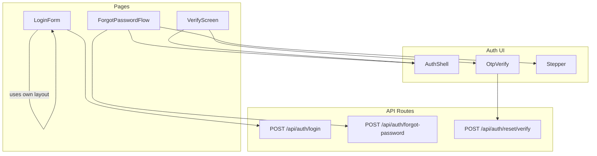
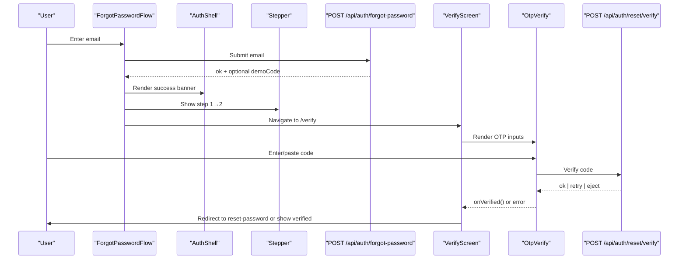
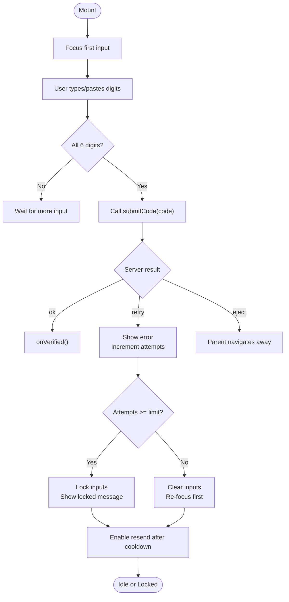
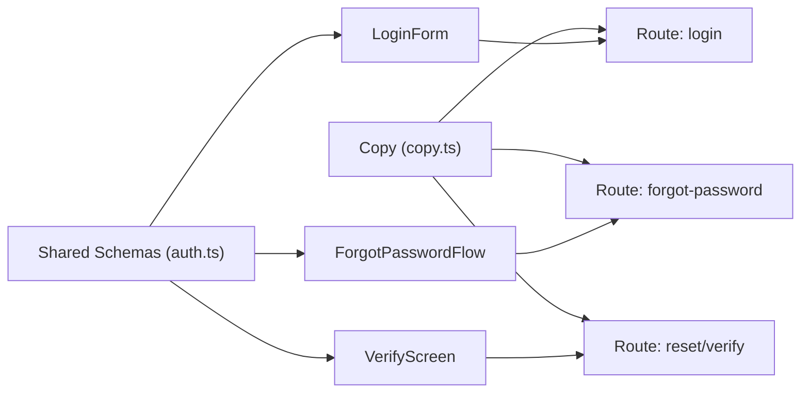

# Authentication Components

<cite>
**Referenced Files in This Document**
- [auth-shell.tsx](file://components/auth/auth-shell.tsx)
- [otp-verify.tsx](file://components/auth/otp-verify.tsx)
- [stepper.tsx](file://components/auth/stepper.tsx)
- [verify-screen.tsx](file://app/(farmer)/verify/verify-screen.tsx)
- [forgot-password-flow.tsx](file://app/(farmer)/forgot-password/forgot-password-flow.tsx)
- [login-form.tsx](file://app/(site)/[locale]/login/login-form.tsx)
- [auth.ts](file://lib/validation/auth.ts)
- [copy.ts](file://lib/auth/copy.ts)
- [route.ts (login)](file://app/api/auth/login/route.ts)
- [route.ts (forgot-password)](file://app/api/auth/forgot-password/route.ts)
- [route.ts (reset verify)](file://app/api/auth/reset/verify/route.ts)
</cite>

## Table of Contents
1. Introduction
2. Project Structure
3. Core Components
4. Architecture Overview
5. Detailed Component Analysis
6. Dependency Analysis
7. Performance Considerations
8. Troubleshooting Guide
9. Conclusion

## Introduction
This document explains Agropioo’s authentication-related UI components that power sign-in, password recovery, and OTP verification flows. It focuses on:
- Auth Shell: a reusable layout wrapper for auth screens with brand panel and form area.
- OTP Verify: a secure, accessible 6-digit code input with auto-focus, paste handling, validation feedback, resend cooldown, and attempt limiting.
- Stepper: a three-step progress indicator used during password recovery to communicate flow state.

For each component, you will find props/attributes, events, state management patterns, integration points with the backend API routes, usage examples, accessibility guidance, responsive behavior, security considerations, and UX best practices.

## Project Structure
The authentication UI is composed of reusable components under components/auth and page-level orchestrators under app. The login screen uses its own split-panel layout, while password recovery and OTP verification use the shared AuthShell.

**Diagram sources**
- [auth-shell.tsx:15-89](file://components/auth/auth-shell.tsx#L15-L89)
- [otp-verify.tsx:42-319](file://components/auth/otp-verify.tsx#L42-L319)
- [stepper.tsx:9-59](file://components/auth/stepper.tsx#L9-L59)
- [forgot-password-flow.tsx:23-215](file://app/(farmer)/forgot-password/forgot-password-flow.tsx#L23-L215)
- [verify-screen.tsx:24-199](file://app/(farmer)/verify/verify-screen.tsx#L24-L199)
- [route.ts (login):1-112](file://app/api/auth/login/route.ts#L1-L112)
- [route.ts (forgot-password):1-82](file://app/api/auth/forgot-password/route.ts#L1-L82)
- [route.ts (reset verify):1-52](file://app/api/auth/reset/verify/route.ts#L1-L52)

**Section sources**
- [auth-shell.tsx:15-89](file://components/auth/auth-shell.tsx#L15-L89)
- [otp-verify.tsx:42-319](file://components/auth/otp-verify.tsx#L42-L319)
- [stepper.tsx:9-59](file://components/auth/stepper.tsx#L9-L59)
- [forgot-password-flow.tsx:23-215](file://app/(farmer)/forgot-password/forgot-password-flow.tsx#L23-L215)
- [verify-screen.tsx:24-199](file://app/(farmer)/verify/verify-screen.tsx#L24-L199)
- [login-form.tsx:110-339](file://app/(site)/[locale]/login/login-form.tsx#L110-L339)

## Core Components
- AuthShell provides a consistent two-panel layout for authentication pages: a branded left panel (hidden on small screens) and a right panel containing the form content. It accepts brand headline, preview content, bullet points, and children.
- OtpVerify implements a 6-digit OTP input with:
  - Auto-focus on first digit
  - Paste support
  - Keyboard navigation (arrow keys, backspace)
  - Validation feedback and attempt limiting
  - Resend cooldown timer
  - Context-aware copy and escape actions
- Stepper renders a three-step progress indicator for password recovery with completed/current/future states and accessibility attributes.

**Section sources**
- [auth-shell.tsx:8-89](file://components/auth/auth-shell.tsx#L8-L89)
- [otp-verify.tsx:20-319](file://components/auth/otp-verify.tsx#L20-L319)
- [stepper.tsx:5-59](file://components/auth/stepper.tsx#L5-L59)

## Architecture Overview
The authentication flows are orchestrated by page components that call server-side Route Handlers. Shared components handle presentation and local state; pages manage API calls, error classification, and navigation.

**Diagram sources**
- [forgot-password-flow.tsx:40-72](file://app/(farmer)/forgot-password/forgot-password-flow.tsx#L40-L72)
- [forgot-password-flow.tsx:117-215](file://app/(farmer)/forgot-password/forgot-password-flow.tsx#L117-L215)
- [verify-screen.tsx:59-92](file://app/(farmer)/verify/verify-screen.tsx#L59-L92)
- [verify-screen.tsx:178-196](file://app/(farmer)/verify/verify-screen.tsx#L178-L196)
- [otp-verify.tsx:95-112](file://components/auth/otp-verify.tsx#L95-L112)
- [route.ts (forgot-password):21-73](file://app/api/auth/forgot-password/route.ts#L21-L73)
- [route.ts (reset verify):11-43](file://app/api/auth/reset/verify/route.ts#L11-L43)

## Detailed Component Analysis

### AuthShell
Purpose:
- Provides a consistent, responsive shell for authentication pages.
- Left panel displays branding, logo, tagline, and value points.
- Right panel hosts form content with mobile-friendly header.

Props:
- brandHeadline: ReactNode — main headline text or JSX.
- brandPreview: ReactNode — contextual preview block (e.g., “what happens next”).
- brandPoints: string[] — list of benefit bullets.
- children: ReactNode — the actual form or confirmation content.

Events:
- None directly; delegates user interactions to children.

State Management:
- Presentational only; no internal state.

Integration:
- Used by ForgotPasswordFlow and VerifyScreen to wrap forms and confirmations.

Accessibility:
- Uses aria-hidden for decorative elements.
- Mobile shows compact logo header for orientation context.

Responsive Design:
- Two-column grid on large screens; single column on smaller screens.

Usage Example:
- Wrap any auth form with AuthShell and pass brand content via props. See paths:
  - [forgot-password-flow.tsx:75-108](file://app/(farmer)/forgot-password/forgot-password-flow.tsx#L75-L108)
  - [verify-screen.tsx:95-141](file://app/(farmer)/verify/verify-screen.tsx#L95-L141)

Security Considerations:
- No sensitive data rendered here; purely presentational.

Best Practices:
- Keep brand content concise and scannable.
- Ensure contrast and readable typography for accessibility.

**Section sources**
- [auth-shell.tsx:8-89](file://components/auth/auth-shell.tsx#L8-L89)
- [forgot-password-flow.tsx:75-108](file://app/(farmer)/forgot-password/forgot-password-flow.tsx#L75-L108)
- [verify-screen.tsx:95-141](file://app/(farmer)/verify/verify-screen.tsx#L95-L141)

### OtpVerify
Purpose:
- Collects a 6-digit one-time code, validates it, handles errors, and supports resending codes with cooldown and attempt limits.

Props:
- context: "signup" | "reset" — changes headings and copy semantics.
- email: string — masked email shown to the user.
- submitCode(code): Promise<OtpSubmitResult> — verifies the code against the server.
- resendCode(): Promise<OtpResendResult> — requests a new code.
- demoCode?: string — optional demo-only code display.
- onVerified(): void — callback when code is valid.
- escapeLabel: string — label for escape action (e.g., “Back” or “Use a different account”).
- onEscape(): void — navigate away from OTP flow.

Events:
- Input change, keydown, paste, focus, verify button click, resend button click.

State Management:
- digits: array of 6 characters.
- status: "idle" | "loading" | "error" | "locked".
- attempts: number of incorrect tries.
- cooldown: seconds until resend is allowed.
- notice: transient message for user feedback.

Validation and Feedback:
- Enforces numeric-only input and exactly 6 digits.
- Auto-submits when all digits filled.
- Shows inline error messages and attempt counts.
- Locks inputs after MAX_ATTEMPTS or server “dead” signal.

Auto-Focus and Navigation:
- Focuses first input on mount.
- Moves focus forward/backward on input, arrow keys, and backspace.
- Selects content on focus for quick replacement.

Resend Flow:
- Cooldown timer prevents spamming.
- Resets attempts and clears inputs on successful resend.

Integration:
- Parent pages implement submitCode and resendCode to call API routes:
  - Reset verify: [verify-screen.tsx:59-72](file://app/(farmer)/verify/verify-screen.tsx#L59-L72)
  - Signup verify: similar pattern using signup endpoints.

Accessibility:
- aria-label per digit, aria-invalid for error state, role="alert" for notices, aria-live region for dynamic updates.

Responsive Design:
- Inputs scale and stack gracefully; buttons remain full-width on mobile.

Usage Example:
- Render inside AuthShell with context and callbacks. See:
  - [verify-screen.tsx:178-196](file://app/(farmer)/verify/verify-screen.tsx#L178-L196)

Security Considerations:
- Client-side validation complements server-side checks.
- Attempt limiting reduces brute-force risk.
- Demo code is never shown outside demo gate.

Best Practices:
- Provide clear instructions and visible countdown for resend.
- Announce errors and successes to assistive technologies.

**Diagram sources**
- [otp-verify.tsx:65-112](file://components/auth/otp-verify.tsx#L65-L112)
- [otp-verify.tsx:114-157](file://components/auth/otp-verify.tsx#L114-L157)
- [otp-verify.tsx:159-184](file://components/auth/otp-verify.tsx#L159-L184)
- [otp-verify.tsx:207-265](file://components/auth/otp-verify.tsx#L207-L265)

**Section sources**
- [otp-verify.tsx:20-319](file://components/auth/otp-verify.tsx#L20-L319)
- [verify-screen.tsx:59-92](file://app/(farmer)/verify/verify-screen.tsx#L59-L92)

### Stepper
Purpose:
- Communicates progress through the password recovery flow: Email → Verify code → New password.

Props:
- current: 1 | 2 | 3 — active step.

States:
- Completed steps show checkmarks.
- Current step highlighted with accent color.
- Future steps muted.

Accessibility:
- aria-current="step" on current label.
- aria-hidden on decorative indicators.

Integration:
- Used in ForgotPasswordFlow to reflect phase transitions.

Usage Example:
- Render with current based on flow phase. See:
  - [forgot-password-flow.tsx:117-117](file://app/(farmer)/forgot-password/forgot-password-flow.tsx#L117-L117)

**Section sources**
- [stepper.tsx:5-59](file://components/auth/stepper.tsx#L5-L59)
- [forgot-password-flow.tsx:117-117](file://app/(farmer)/forgot-password/forgot-password-flow.tsx#L117-L117)

### Page Orchestrators and Integration

#### ForgotPasswordFlow
- Validates email using shared schema.
- Calls POST /api/auth/forgot-password.
- Shows generic confirmation and auto-navigates to /verify.
- Renders Stepper to indicate progress.

Key Paths:
- Form and submission: [forgot-password-flow.tsx:48-72](file://app/(farmer)/forgot-password/forgot-password-flow.tsx#L48-L72)
- Success banner and navigation: [forgot-password-flow.tsx:40-46](file://app/(farmer)/forgot-password/forgot-password-flow.tsx#L40-L46), [forgot-password-flow.tsx:192-215](file://app/(farmer)/forgot-password/forgot-password-flow.tsx#L192-L215)

**Section sources**
- [forgot-password-flow.tsx:23-215](file://app/(farmer)/forgot-password/forgot-password-flow.tsx#L23-L215)
- [route.ts (forgot-password):21-73](file://app/api/auth/forgot-password/route.ts#L21-L73)

#### VerifyScreen
- Wraps OtpVerify within AuthShell.
- Implements submitCode and resendCode to call appropriate API routes.
- Handles success by navigating to reset-password (for reset context) or showing a verified state (for signup).

Key Paths:
- API calls and classification: [verify-screen.tsx:36-92](file://app/(farmer)/verify/verify-screen.tsx#L36-L92)
- Rendering OtpVerify and success state: [verify-screen.tsx:151-196](file://app/(farmer)/verify/verify-screen.tsx#L151-L196)

**Section sources**
- [verify-screen.tsx:24-199](file://app/(farmer)/verify/verify-screen.tsx#L24-L199)
- [route.ts (reset verify):11-43](file://app/api/auth/reset/verify/route.ts#L11-L43)

#### LoginForm
- Uses a custom split-panel layout (not AuthShell).
- Validates email/password with shared schemas.
- Submits to POST /api/auth/login.
- Handles rate limiting and generic credential errors.

Key Paths:
- Form setup and submission: [login-form.tsx:65-108](file://app/(site)/[locale]/login/login-form.tsx#L65-L108)
- UI and validation feedback: [login-form.tsx:218-323](file://app/(site)/[locale]/login/login-form.tsx#L218-L323)

**Section sources**
- [login-form.tsx:65-339](file://app/(site)/[locale]/login/login-form.tsx#L65-L339)
- [route.ts (login):41-112](file://app/api/auth/login/route.ts#L41-L112)

## Dependency Analysis
Shared validation schemas ensure client and server agree on input rules. Copy strings centralize user-facing messages. Pages depend on API routes for authentication logic.

**Diagram sources**
- [auth.ts:1-87](file://lib/validation/auth.ts#L1-L87)
- [copy.ts:1-58](file://lib/auth/copy.ts#L1-L58)
- [route.ts (login):1-112](file://app/api/auth/login/route.ts#L1-L112)
- [route.ts (forgot-password):1-82](file://app/api/auth/forgot-password/route.ts#L1-L82)
- [route.ts (reset verify):1-52](file://app/api/auth/reset/verify/route.ts#L1-L52)

**Section sources**
- [auth.ts:1-87](file://lib/validation/auth.ts#L1-L87)
- [copy.ts:1-58](file://lib/auth/copy.ts#L1-L58)

## Performance Considerations
- Debouncing or throttling resend requests is handled via a client-side cooldown to reduce unnecessary network calls.
- Attempt limiting on the client prevents excessive retries before server enforcement.
- Avoid re-rendering heavy brand panels by keeping them static within AuthShell.
- Use minimal state in presentational components; keep API orchestration in page components.

## Troubleshooting Guide
Common issues and resolutions:
- Invalid credentials:
  - Ensure email and password match expected formats and constraints.
  - Check server responses for generic error messages to avoid leaking information.
  - Reference: [login-form.tsx:84-108](file://app/(site)/[locale]/login/login-form.tsx#L84-L108), [route.ts (login):74-81](file://app/api/auth/login/route.ts#L74-L81)
- Rate limited:
  - Respect cooldowns and wait before retrying.
  - Reference: [route.ts (login):49-64](file://app/api/auth/login/route.ts#L49-L64), [route.ts (forgot-password):29-44](file://app/api/auth/forgot-password/route.ts#L29-L44)
- OTP rejected or locked:
  - Confirm code length and digits; try resend after cooldown.
  - Reference: [otp-verify.tsx:95-112](file://components/auth/otp-verify.tsx#L95-L112), [otp-verify.tsx:168-184](file://components/auth/otp-verify.tsx#L168-L184)
- Server errors:
  - Display generic messages; log details server-side.
  - Reference: [copy.ts:4-15](file://lib/auth/copy.ts#L4-L15)

**Section sources**
- [login-form.tsx:84-108](file://app/(site)/[locale]/login/login-form.tsx#L84-L108)
- [route.ts (login):49-81](file://app/api/auth/login/route.ts#L49-L81)
- [route.ts (forgot-password):29-44](file://app/api/auth/forgot-password/route.ts#L29-L44)
- [otp-verify.tsx:95-184](file://components/auth/otp-verify.tsx#L95-L184)
- [copy.ts:4-15](file://lib/auth/copy.ts#L4-L15)

## Conclusion
Agropioo’s authentication UI separates concerns effectively:
- AuthShell standardizes layout and branding across flows.
- OtpVerify delivers a robust, accessible OTP experience with strong UX and security controls.
- Stepper clarifies multi-step processes for users.
Page components coordinate API calls, error handling, and navigation, while shared schemas and copy ensure consistency and safety. Following these patterns yields a secure, user-friendly authentication system that scales across features like sign-in, email verification, and password recovery.