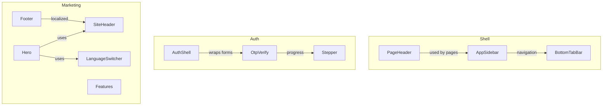
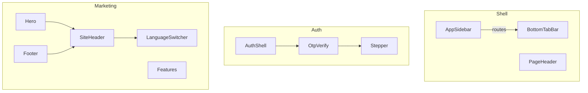
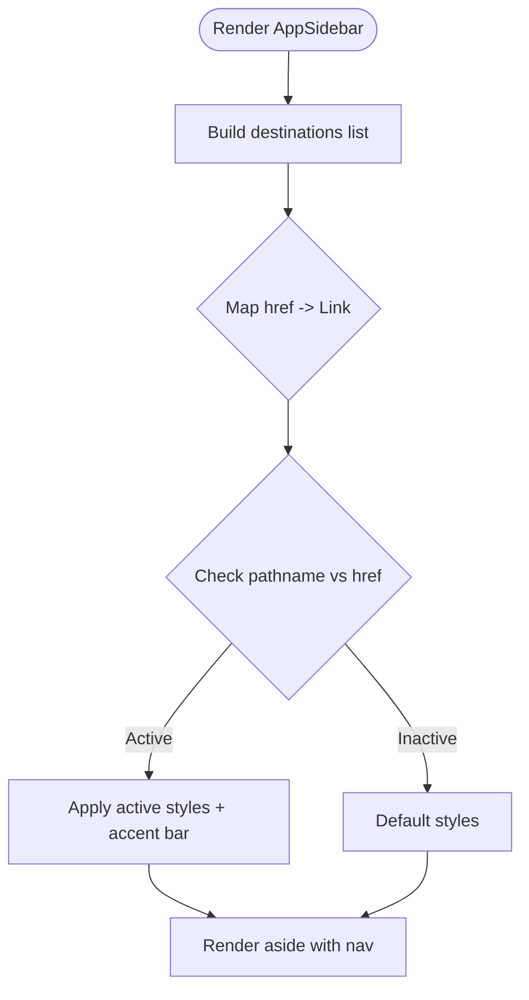
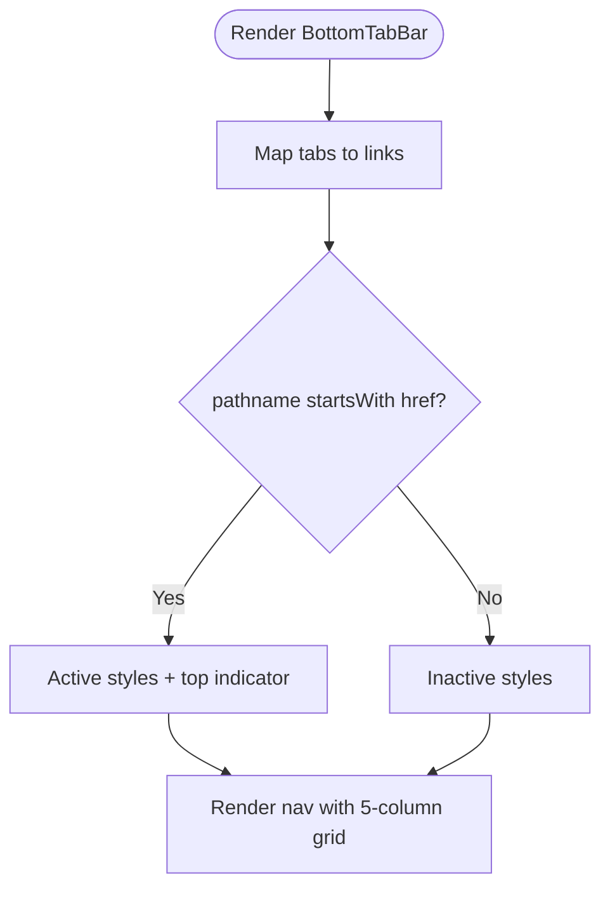
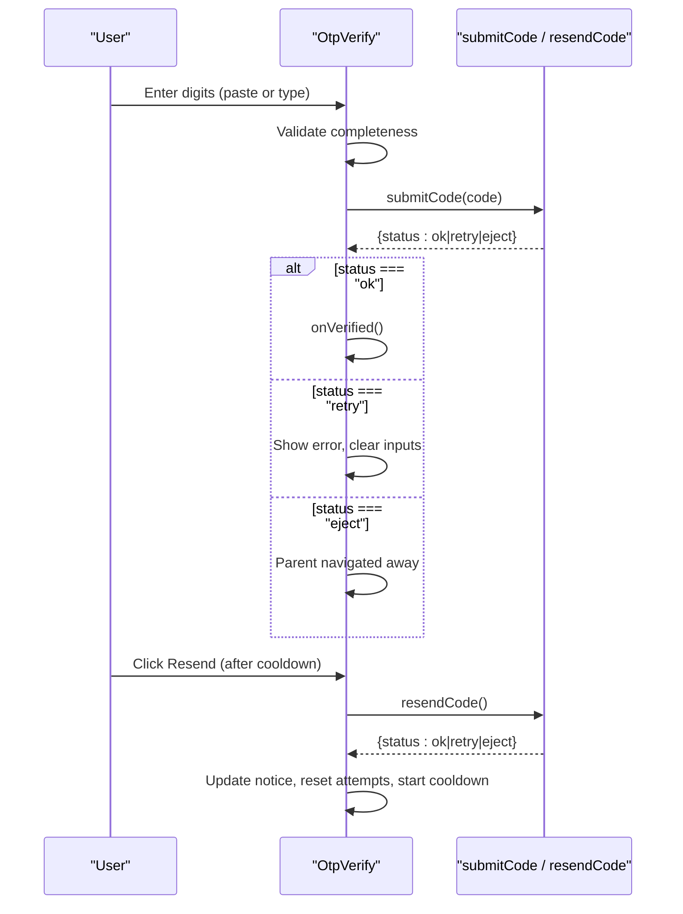
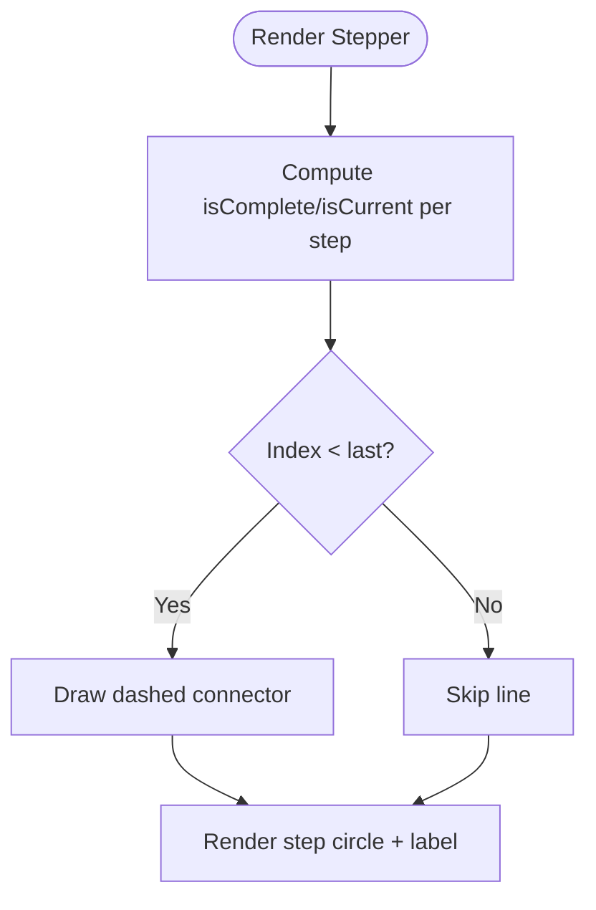
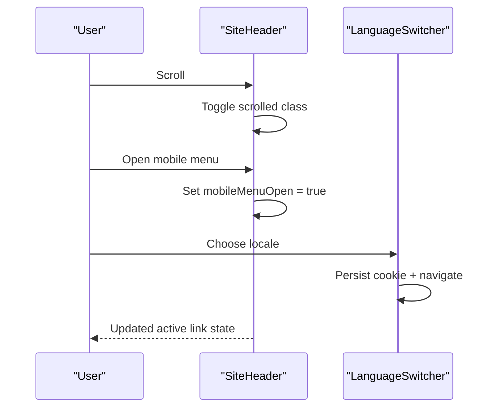
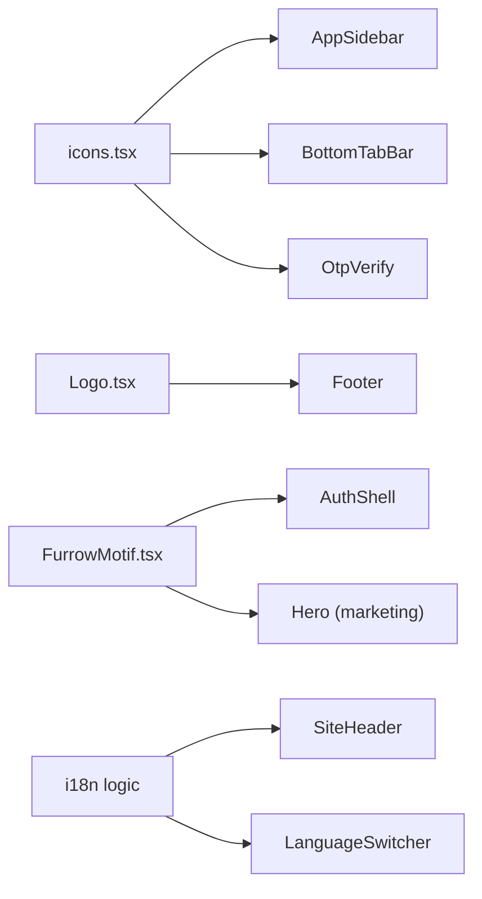

# Component Library

<cite>
**Referenced Files in This Document**
- [app-sidebar.tsx](file://components/shell/app-sidebar.tsx)
- [bottom-tab-bar.tsx](file://components/shell/bottom-tab-bar.tsx)
- [page-header.tsx](file://components/shell/page-header.tsx)
- [auth-shell.tsx](file://components/auth/auth-shell.tsx)
- [otp-verify.tsx](file://components/auth/otp-verify.tsx)
- [stepper.tsx](file://components/auth/stepper.tsx)
- [Hero.tsx](file://components/Hero.tsx)
- [Features.tsx](file://components/Features.tsx)
- [Footer.tsx](file://components/Footer.tsx)
- [SiteHeader.tsx](file://components/SiteHeader.tsx)
- [FurrowMotif.tsx](file://components/FurrowMotif.tsx)
- [Logo.tsx](file://components/Logo.tsx)
- [language-switcher.tsx](file://components/language-switcher.tsx)
- [site-hero.tsx](file://app/(site)/[locale]/sections/Hero.tsx)
- [site-footer.tsx](file://app/(site)/[locale]/sections/Footer.tsx)
- [MASTER.md](file://design-system/agropioo/MASTER.md)
</cite>

## Table of Contents
1. Introduction
2. Project Structure
3. Core Components
4. Architecture Overview
5. Detailed Component Analysis
6. Dependency Analysis
7. Performance Considerations
8. Troubleshooting Guide
9. Conclusion
10. Appendices

## Introduction
This document provides a comprehensive component library guide for Agropioo’s reusable UI components. It covers shell navigation (sidebar, bottom tab bar, page headers), authentication flows (login shells, OTP verification, stepper progress), and marketing site sections (hero, features, footer). For each component, you will find visual behavior, props/attributes, events, customization options, responsive patterns, accessibility notes, Tailwind CSS integration guidance, and usage examples via code snippet paths.

## Project Structure
Agropioo organizes UI into focused directories:
- Shell components under components/shell provide app chrome for the farmer dashboard.
- Auth components under components/auth implement shared authentication UX patterns.
- Marketing site components live both as shared components (components/*) and localized pages under app/(site)/[locale]/sections.
- Design tokens and style rules are documented in design-system/agropioo/MASTER.md.



**Diagram sources**
- [app-sidebar.tsx:32-96](file://components/shell/app-sidebar.tsx#L32-L96)
- [bottom-tab-bar.tsx:23-68](file://components/shell/bottom-tab-bar.tsx#L23-L68)
- [page-header.tsx:15-40](file://components/shell/page-header.tsx#L15-L40)
- [auth-shell.tsx:19-88](file://components/auth/auth-shell.tsx#L19-L88)
- [otp-verify.tsx:47-319](file://components/auth/otp-verify.tsx#L47-L319)
- [stepper.tsx:11-59](file://components/auth/stepper.tsx#L11-L59)
- [Hero.tsx:5-79](file://components/Hero.tsx#L5-L79)
- [Features.tsx:39-154](file://components/Features.tsx#L39-L154)
- [Footer.tsx:10-53](file://components/Footer.tsx#L10-L53)
- [SiteHeader.tsx:25-256](file://components/SiteHeader.tsx#L25-L256)
- [language-switcher.tsx:29-119](file://components/language-switcher.tsx#L29-L119)

**Section sources**
- [app-sidebar.tsx:1-98](file://components/shell/app-sidebar.tsx#L1-L98)
- [bottom-tab-bar.tsx:1-70](file://components/shell/bottom-tab-bar.tsx#L1-L70)
- [page-header.tsx:1-42](file://components/shell/page-header.tsx#L1-L42)
- [auth-shell.tsx:1-90](file://components/auth/auth-shell.tsx#L1-L90)
- [otp-verify.tsx:1-321](file://components/auth/otp-verify.tsx#L1-L321)
- [stepper.tsx:1-61](file://components/auth/stepper.tsx#L1-L61)
- [Hero.tsx:1-80](file://components/Hero.tsx#L1-L80)
- [Features.tsx:1-155](file://components/Features.tsx#L1-L155)
- [Footer.tsx:1-54](file://components/Footer.tsx#L1-L54)
- [SiteHeader.tsx:1-257](file://components/SiteHeader.tsx#L1-L257)
- [language-switcher.tsx:1-120](file://components/language-switcher.tsx#L1-L120)
- [site-hero.tsx:1-141](file://app/(site)/[locale]/sections/Hero.tsx#L1-L141)
- [site-footer.tsx:1-185](file://app/(site)/[locale]/sections/Footer.tsx#L1-L185)
- [MASTER.md:15-73](file://design-system/agropioo/MASTER.md#L15-L73)

## Core Components
This section summarizes the purpose, props, events, and usage patterns for each core component.

- AppSidebar (desktop rail)
  - Purpose: Fixed left navigation for desktop with active state and branding.
  - Props: None (internal destinations array).
  - Events: None; uses Next.js Link for navigation.
  - Customization: Edit destinations list to change routes/icons/labels.
  - Accessibility: aria-current on active links; semantic nav and ul/li structure.
  - Tailwind: Uses brand colors and spacing utilities; hidden on small screens.
  - Usage example path: [app-sidebar.tsx:32-96](file://components/shell/app-sidebar.tsx#L32-L96)

- BottomTabBar (mobile tabs)
  - Purpose: Five-tab mobile navigation with active indicator.
  - Props: None (internal tabs array).
  - Events: None; uses Next.js Link.
  - Customization: Modify tabs array to adjust routes/icons/labels.
  - Accessibility: aria-current on active; sr-only text for current page.
  - Tailwind: Fixed bottom, safe-area padding, visible only on mobile.
  - Usage example path: [bottom-tab-bar.tsx:23-68](file://components/shell/bottom-tab-bar.tsx#L23-L68)

- PageHeader
  - Purpose: Consistent page header with eyebrow label, title, description, and optional action.
  - Props: eyebrow, title, description?, action?
  - Events: None.
  - Customization: Pass any ReactNode as action for right-aligned controls.
  - Accessibility: Semantic header/h1; descriptive labels.
  - Tailwind: Display typography and gradient hairline accent.
  - Usage example path: [page-header.tsx:15-40](file://components/shell/page-header.tsx#L15-L40)

- AuthShell
  - Purpose: Split-panel layout for auth flows with brand panel and form area.
  - Props: brandHeadline, brandPreview, brandPoints[], children.
  - Events: None.
  - Customization: Provide brand content and points; children render the form.
  - Accessibility: Semantic aside/main; decorative SVGs marked aria-hidden.
  - Tailwind: Responsive grid; brand panel hidden on mobile.
  - Usage example path: [auth-shell.tsx:19-88](file://components/auth/auth-shell.tsx#L19-L88)

- OtpVerify
  - Purpose: Six-digit code entry with validation, attempts, cooldown, and resend.
  - Props: context ("signup" | "reset"), email, submitCode(code), resendCode(), demoCode?, onVerified(), escapeLabel, onEscape().
  - Events: onVerified() when code is correct; parent handles navigation.
  - Customization: Adjust CODE_LENGTH, MAX_ATTEMPTS, RESEND_COOLDOWN_SECONDS internally if needed; pass demoCode for development.
  - Accessibility: Grouped inputs with aria-labels; aria-live announcements; role="alert" for errors.
  - Tailwind: Focus rings, disabled states, error/locked styles.
  - Usage example path: [otp-verify.tsx:47-319](file://components/auth/otp-verify.tsx#L47-L319)

- Stepper
  - Purpose: Three-step progress indicator for password recovery.
  - Props: current (1 | 2 | 3).
  - Events: None.
  - Customization: Hardcoded steps; extend if process changes.
  - Accessibility: aria-label on ol; aria-current on current step.
  - Tailwind: Completed/current/future states with dashed connectors.
  - Usage example path: [stepper.tsx:11-59](file://components/auth/stepper.tsx#L11-L59)

- Hero (marketing)
  - Purpose: Hero section with headline, copy, CTAs, and illustrative graphic.
  - Props: None (inline content).
  - Events: None.
  - Customization: Edit copy and CTAs inline.
  - Accessibility: Descriptive alt text for images; semantic section.
  - Tailwind: Responsive grid, animated entrance via CSS variables.
  - Usage example path: [Hero.tsx:5-79](file://components/Hero.tsx#L5-L79)

- Features
  - Purpose: Feature showcase grid with cards and chips.
  - Props: None (inline data arrays).
  - Events: None.
  - Customization: Edit recordChips and languageChips arrays.
  - Accessibility: aria-label on lists; semantic headings.
  - Tailwind: Grid layout, card borders, color accents.
  - Usage example path: [Features.tsx:39-154](file://components/Features.tsx#L39-L154)

- Footer (marketing)
  - Purpose: Simple footer with logo, tagline, and links.
  - Props: None.
  - Events: None.
  - Customization: Edit links array and copy.
  - Accessibility: Semantic footer/nav; link targets open safely.
  - Tailwind: Brand colors and spacing.
  - Usage example path: [Footer.tsx:10-53](file://components/Footer.tsx#L10-L53)

- SiteHeader
  - Purpose: Sticky header with navigation, language switcher, and mobile menu.
  - Props: linkBase, activeSection, strings (i18n labels).
  - Events: None (internal state for scroll and menu).
  - Customization: Provide i18n strings; configure activeSection for highlighting.
  - Accessibility: aria-expanded, aria-modal, aria-label; keyboard Escape handling.
  - Tailwind: Backdrop blur, sticky positioning, responsive menus.
  - Usage example path: [SiteHeader.tsx:25-256](file://components/SiteHeader.tsx#L25-L256)

- LanguageSwitcher
  - Purpose: Locale picker that persists choice and navigates to locale-prefixed URL.
  - Props: label (aria label).
  - Events: None (full page reload on switch).
  - Customization: Uses LOCALES and LOCALE_REGISTRY from i18n config.
  - Accessibility: Menu roles, aria-checked, focus management.
  - Tailwind: Dropdown styling with brand tokens.
  - Usage example path: [language-switcher.tsx:29-119](file://components/language-switcher.tsx#L29-L119)

**Section sources**
- [app-sidebar.tsx:32-96](file://components/shell/app-sidebar.tsx#L32-L96)
- [bottom-tab-bar.tsx:23-68](file://components/shell/bottom-tab-bar.tsx#L23-L68)
- [page-header.tsx:15-40](file://components/shell/page-header.tsx#L15-L40)
- [auth-shell.tsx:19-88](file://components/auth/auth-shell.tsx#L19-L88)
- [otp-verify.tsx:47-319](file://components/auth/otp-verify.tsx#L47-L319)
- [stepper.tsx:11-59](file://components/auth/stepper.tsx#L11-L59)
- [Hero.tsx:5-79](file://components/Hero.tsx#L5-L79)
- [Features.tsx:39-154](file://components/Features.tsx#L39-L154)
- [Footer.tsx:10-53](file://components/Footer.tsx#L10-L53)
- [SiteHeader.tsx:25-256](file://components/SiteHeader.tsx#L25-L256)
- [language-switcher.tsx:29-119](file://components/language-switcher.tsx#L29-L119)

## Architecture Overview
The component architecture separates concerns across shell, auth, and marketing layers while sharing common design tokens and icons.



**Diagram sources**
- [app-sidebar.tsx:32-96](file://components/shell/app-sidebar.tsx#L32-L96)
- [bottom-tab-bar.tsx:23-68](file://components/shell/bottom-tab-bar.tsx#L23-L68)
- [page-header.tsx:15-40](file://components/shell/page-header.tsx#L15-L40)
- [auth-shell.tsx:19-88](file://components/auth/auth-shell.tsx#L19-L88)
- [otp-verify.tsx:47-319](file://components/auth/otp-verify.tsx#L47-L319)
- [stepper.tsx:11-59](file://components/auth/stepper.tsx#L11-L59)
- [SiteHeader.tsx:25-256](file://components/SiteHeader.tsx#L25-L256)
- [Hero.tsx:5-79](file://components/Hero.tsx#L5-L79)
- [Features.tsx:39-154](file://components/Features.tsx#L39-L154)
- [Footer.tsx:10-53](file://components/Footer.tsx#L10-L53)
- [language-switcher.tsx:29-119](file://components/language-switcher.tsx#L29-L119)

## Detailed Component Analysis

### Shell Components

#### AppSidebar
- Visual appearance: Dark forest sidebar with logo, branded tagline, and vertical navigation. Active item highlighted with background and left accent bar.
- Props/Attributes: None; internal destinations array defines routes, labels, and icons.
- Events: None; uses Next.js Link for client-side navigation.
- Customization: Update destinations to add/remove items or change icons.
- Responsive behavior: Hidden below lg; replaced by BottomTabBar on mobile.
- Accessibility: aria-current on active links; semantic nav/list.
- Tailwind integration: Uses brand colors (agro-forest, agro-sprout), spacing, and typography utilities.
- Usage example path: [app-sidebar.tsx:32-96](file://components/shell/app-sidebar.tsx#L32-L96)



**Diagram sources**
- [app-sidebar.tsx:32-96](file://components/shell/app-sidebar.tsx#L32-L96)

**Section sources**
- [app-sidebar.tsx:32-96](file://components/shell/app-sidebar.tsx#L32-L96)

#### BottomTabBar
- Visual appearance: Fixed bottom bar with five tabs; active tab shows solid chip and icon circle.
- Props/Attributes: None; internal tabs array.
- Events: None; uses Next.js Link.
- Customization: Edit tabs array to modify routes/icons/labels.
- Responsive behavior: Visible on mobile; hidden on lg+.
- Accessibility: aria-current on active; sr-only text for current page.
- Tailwind integration: Safe-area inset, brand colors, grid layout.
- Usage example path: [bottom-tab-bar.tsx:23-68](file://components/shell/bottom-tab-bar.tsx#L23-L68)



**Diagram sources**
- [bottom-tab-bar.tsx:23-68](file://components/shell/bottom-tab-bar.tsx#L23-L68)

**Section sources**
- [bottom-tab-bar.tsx:23-68](file://components/shell/bottom-tab-bar.tsx#L23-L68)

#### PageHeader
- Visual appearance: Eyebrow label with gradient hairline, display heading, optional description, and right-aligned action.
- Props/Attributes: eyebrow, title, description?, action?
- Events: None.
- Customization: Inject any ReactNode as action for buttons/links.
- Responsive behavior: Typography scales with breakpoints.
- Accessibility: Semantic header/h1; descriptive labels.
- Tailwind integration: Display font, brand colors, spacing.
- Usage example path: [page-header.tsx:15-40](file://components/shell/page-header.tsx#L15-L40)

**Section sources**
- [page-header.tsx:15-40](file://components/shell/page-header.tsx#L15-L40)

### Authentication Components

#### AuthShell
- Visual appearance: Two-column split on desktop (brand panel + form); single column on mobile with compact logo.
- Props/Attributes: brandHeadline, brandPreview, brandPoints[], children.
- Events: None.
- Customization: Provide brand content and wrap your form in children.
- Responsive behavior: Grid switches to stacked on small screens.
- Accessibility: Semantic aside/main; decorative elements marked aria-hidden.
- Tailwind integration: Brand panel uses agro-forest; form panel white background.
- Usage example path: [auth-shell.tsx:19-88](file://components/auth/auth-shell.tsx#L19-L88)

```mermaid
sequenceDiagram
participant Parent as "Parent Page"
participant Shell as "AuthShell"
participant Form as "Form (children)"
Parent->>Shell : Render with brandHeadline, brandPreview, brandPoints
Shell->>Shell : Layout grid (brand | form)
Shell->>Form : Render children (form)
Note over Shell,Form : Brand panel static; form dynamic
```

**Diagram sources**
- [auth-shell.tsx:19-88](file://components/auth/auth-shell.tsx#L19-L88)

**Section sources**
- [auth-shell.tsx:19-88](file://components/auth/auth-shell.tsx#L19-L88)

#### OtpVerify
- Visual appearance: Six input boxes for digits, verify button, resend link with cooldown timer, notices/alerts.
- Props/Attributes:
  - context: "signup" | "reset"
  - email: string (masked destination shown)
  - submitCode(code): Promise<OtpSubmitResult>
  - resendCode(): Promise<OtpResendResult>
  - demoCode?: string
  - onVerified(): void
  - escapeLabel: string
  - onEscape(): void
- Events: onVerified() called when code is valid; parent handles hand-off.
- Customization: Internal constants control code length, attempts, cooldown; pass demoCode for dev.
- Responsive behavior: Inputs scale; notice area adapts.
- Accessibility: Grouped inputs with aria-labels; aria-live region; role="alert" for errors; disabled states.
- Tailwind integration: Focus rings, border states, brand colors; spinner for loading.
- Usage example path: [otp-verify.tsx:47-319](file://components/auth/otp-verify.tsx#L47-L319)



**Diagram sources**
- [otp-verify.tsx:95-184](file://components/auth/otp-verify.tsx#L95-L184)
- [otp-verify.tsx:19-36](file://components/auth/otp-verify.tsx#L19-L36)

**Section sources**
- [otp-verify.tsx:19-36](file://components/auth/otp-verify.tsx#L19-L36)
- [otp-verify.tsx:95-184](file://components/auth/otp-verify.tsx#L95-L184)
- [otp-verify.tsx:186-319](file://components/auth/otp-verify.tsx#L186-L319)

#### Stepper
- Visual appearance: Three steps with dashed connectors; completed steps show checkmark, current step highlighted, future muted.
- Props/Attributes: current (1 | 2 | 3).
- Events: None.
- Customization: Steps are hardcoded; extend if flow changes.
- Responsive behavior: Horizontal layout truncates labels on small screens.
- Accessibility: aria-label on ordered list; aria-current on current step.
- Tailwind integration: Brand colors for completed/current/future states.
- Usage example path: [stepper.tsx:11-59](file://components/auth/stepper.tsx#L11-L59)



**Diagram sources**
- [stepper.tsx:11-59](file://components/auth/stepper.tsx#L11-L59)

**Section sources**
- [stepper.tsx:11-59](file://components/auth/stepper.tsx#L11-L59)

### Marketing Site Components

#### SiteHeader
- Visual appearance: Sticky header with logo, nav links, language switcher, sign-in, and CTA; mobile drawer with overlay.
- Props/Attributes: linkBase, activeSection, strings (i18n labels).
- Events: None (internal state for scroll and menu).
- Customization: Provide i18n strings; set activeSection to highlight current anchor.
- Responsive behavior: Desktop nav vs mobile drawer; backdrop blur on scroll.
- Accessibility: aria-expanded, aria-modal, aria-label; Escape key closes drawer.
- Tailwind integration: Sticky positioning, brand colors, transitions.
- Usage example path: [SiteHeader.tsx:25-256](file://components/SiteHeader.tsx#L25-L256)



**Diagram sources**
- [SiteHeader.tsx:43-62](file://components/SiteHeader.tsx#L43-L62)
- [SiteHeader.tsx:133-158](file://components/SiteHeader.tsx#L133-L158)
- [language-switcher.tsx:58-63](file://components/language-switcher.tsx#L58-L63)

**Section sources**
- [SiteHeader.tsx:25-256](file://components/SiteHeader.tsx#L25-L256)
- [language-switcher.tsx:29-119](file://components/language-switcher.tsx#L29-L119)

#### Hero (marketing)
- Visual appearance: Two-column hero with headline, subtitle, CTAs, and illustrative graphic with floating metrics.
- Props/Attributes: None (inline content).
- Events: None.
- Customization: Edit copy and CTAs; swap image source.
- Responsive behavior: Stacks on mobile; two columns on large screens.
- Accessibility: Alt text for images; semantic section.
- Tailwind integration: Animated entrance via CSS variables; brand colors.
- Usage example path: [site-hero.tsx:7-141](file://app/(site)/[locale]/sections/Hero.tsx#L7-L141)

**Section sources**
- [site-hero.tsx:7-141](file://app/(site)/[locale]/sections/Hero.tsx#L7-L141)

#### Features
- Visual appearance: Card grid showcasing capabilities with chips and sample dialogues.
- Props/Attributes: None (inline data arrays).
- Events: None.
- Customization: Edit recordChips and languageChips arrays.
- Responsive behavior: Single column on mobile; multi-column on larger screens.
- Accessibility: aria-label on lists; semantic headings.
- Tailwind integration: Cards with borders, brand colors, spacing.
- Usage example path: [Features.tsx:39-154](file://components/Features.tsx#L39-L154)

**Section sources**
- [Features.tsx:39-154](file://components/Features.tsx#L39-L154)

#### Footer (marketing)
- Visual appearance: Dark footer with brand, social icons, page links, legal links, contact info, and copyright.
- Props/Attributes: hrefPrefix (optional).
- Events: None.
- Customization: Edit page/legal links and contact details.
- Responsive behavior: Multi-column grid collapses on smaller screens.
- Accessibility: Semantic footer/nav; accessible labels for social icons.
- Tailwind integration: Brand colors, spacing, hover effects.
- Usage example path: [site-footer.tsx:58-185](file://app/(site)/[locale]/sections/Footer.tsx#L58-L185)

**Section sources**
- [site-footer.tsx:58-185](file://app/(site)/[locale]/sections/Footer.tsx#L58-L185)

## Dependency Analysis
Components share common assets and design tokens:
- Icons: Shared icon components used across shell and marketing components.
- Brand assets: Logos and motifs (FurrowMotif) provide consistent visual identity.
- i18n: SiteHeader and LanguageSwitcher integrate with localization utilities.
- Navigation: Next.js Link and usePathname drive active states and routing.



**Diagram sources**
- [app-sidebar.tsx:6-16](file://components/shell/app-sidebar.tsx#L6-L16)
- [bottom-tab-bar.tsx:5-11](file://components/shell/bottom-tab-bar.tsx#L5-L11)
- [otp-verify.tsx:4](file://components/auth/otp-verify.tsx#L4)
- [Footer.tsx:1](file://components/Footer.tsx#L1)
- [auth-shell.tsx:4](file://components/auth/auth-shell.tsx#L4)
- [Hero.tsx:2](file://components/Hero.tsx#L2)
- [SiteHeader.tsx:9](file://components/SiteHeader.tsx#L9)
- [language-switcher.tsx:6-8](file://components/language-switcher.tsx#L6-L8)

**Section sources**
- [app-sidebar.tsx:6-16](file://components/shell/app-sidebar.tsx#L6-L16)
- [bottom-tab-bar.tsx:5-11](file://components/shell/bottom-tab-bar.tsx#L5-L11)
- [otp-verify.tsx:4](file://components/auth/otp-verify.tsx#L4)
- [Footer.tsx:1](file://components/Footer.tsx#L1)
- [auth-shell.tsx:4](file://components/auth/auth-shell.tsx#L4)
- [Hero.tsx:2](file://components/Hero.tsx#L2)
- [SiteHeader.tsx:9](file://components/SiteHeader.tsx#L9)
- [language-switcher.tsx:6-8](file://components/language-switcher.tsx#L6-L8)

## Performance Considerations
- Client components: Mark components using hooks or browser APIs as "use client" to avoid server rendering issues.
- Navigation: Use Next.js Link for efficient client-side routing and reduced reflows.
- Images: Prefer Next.js Image with appropriate sizes and priority where needed.
- State updates: Keep local state minimal; batch updates (e.g., OTP digit array) to reduce re-renders.
- Animations: Use CSS variables for staggered animations; avoid heavy JS animations.
- Accessibility: Ensure aria-live regions update efficiently without full page reloads.

[No sources needed since this section provides general guidance]

## Troubleshooting Guide
Common issues and resolutions:
- OTP verification fails repeatedly
  - Symptom: Error message and locked state after multiple attempts.
  - Resolution: Encourage user to request a new code; ensure resend endpoint returns expected result types.
  - Reference: [otp-verify.tsx:104-112](file://components/auth/otp-verify.tsx#L104-L112), [otp-verify.tsx:168-184](file://components/auth/otp-verify.tsx#L168-L184)
- Mobile menu not closing
  - Symptom: Drawer remains open after Escape or outside click.
  - Resolution: Ensure event listeners are attached and removed; verify aria-expanded toggles correctly.
  - Reference: [SiteHeader.tsx:50-62](file://components/SiteHeader.tsx#L50-L62), [SiteHeader.tsx:163-183](file://components/SiteHeader.tsx#L163-L183)
- Language switch does not persist
  - Symptom: Locale resets on navigation.
  - Resolution: Confirm cookie persistence and URL switching logic.
  - Reference: [language-switcher.tsx:24-27](file://components/language-switcher.tsx#L24-L27), [language-switcher.tsx:58-63](file://components/language-switcher.tsx#L58-L63)
- Active state mismatch in navigation
  - Symptom: Incorrect link highlighted.
  - Resolution: Ensure isActive checks compare pathname against href and handle nested routes.
  - Reference: [app-sidebar.tsx:35-37](file://components/shell/app-sidebar.tsx#L35-L37), [bottom-tab-bar.tsx:26-28](file://components/shell/bottom-tab-bar.tsx#L26-L28)

**Section sources**
- [otp-verify.tsx:104-112](file://components/auth/otp-verify.tsx#L104-L112)
- [otp-verify.tsx:168-184](file://components/auth/otp-verify.tsx#L168-L184)
- [SiteHeader.tsx:50-62](file://components/SiteHeader.tsx#L50-L62)
- [SiteHeader.tsx:163-183](file://components/SiteHeader.tsx#L163-L183)
- [language-switcher.tsx:24-27](file://components/language-switcher.tsx#L24-L27)
- [language-switcher.tsx:58-63](file://components/language-switcher.tsx#L58-L63)
- [app-sidebar.tsx:35-37](file://components/shell/app-sidebar.tsx#L35-L37)
- [bottom-tab-bar.tsx:26-28](file://components/shell/bottom-tab-bar.tsx#L26-L28)

## Conclusion
Agropioo’s component library provides a cohesive, accessible, and responsive UI foundation across shell, authentication, and marketing contexts. By leveraging shared design tokens, consistent patterns, and thoughtful accessibility, teams can compose complex experiences quickly while maintaining brand integrity and performance.

[No sources needed since this section summarizes without analyzing specific files]

## Appendices

### Responsive Design Patterns
- Breakpoints: Use Tailwind’s default breakpoints to adapt layouts (sm/md/lg/xl).
- Mobile-first: Start with mobile layouts and enhance for larger screens.
- Safe areas: Apply env(safe-area-inset-bottom) for fixed bottom bars on iOS.
- Content scaling: Use clamp() and responsive typography utilities for fluid scaling.

[No sources needed since this section provides general guidance]

### Accessibility Compliance
- Semantic HTML: Use header, nav, main, footer, and proper heading hierarchy.
- ARIA: Apply aria-current, aria-expanded, aria-modal, aria-live, and role attributes where appropriate.
- Keyboard navigation: Ensure all interactive elements are reachable and operable via keyboard.
- Color contrast: Maintain minimum contrast ratios per design system guidelines.

[No sources needed since this section provides general guidance]

### Integration with Tailwind CSS Design System
- Colors: Use brand tokens (agro-forest, agro-canopy, agro-sprout, etc.) defined by the design system.
- Typography: Follow display and body fonts specified in the design system.
- Spacing and shadows: Align with spacing variables and shadow depths outlined in MASTER.md.
- Anti-patterns: Avoid emojis as icons, invisible focus states, and low contrast text.

**Section sources**
- [MASTER.md:15-73](file://design-system/agropioo/MASTER.md#L15-L73)
- [MASTER.md:185-216](file://design-system/agropioo/MASTER.md#L185-L216)