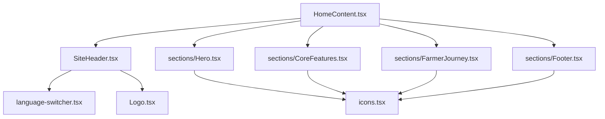
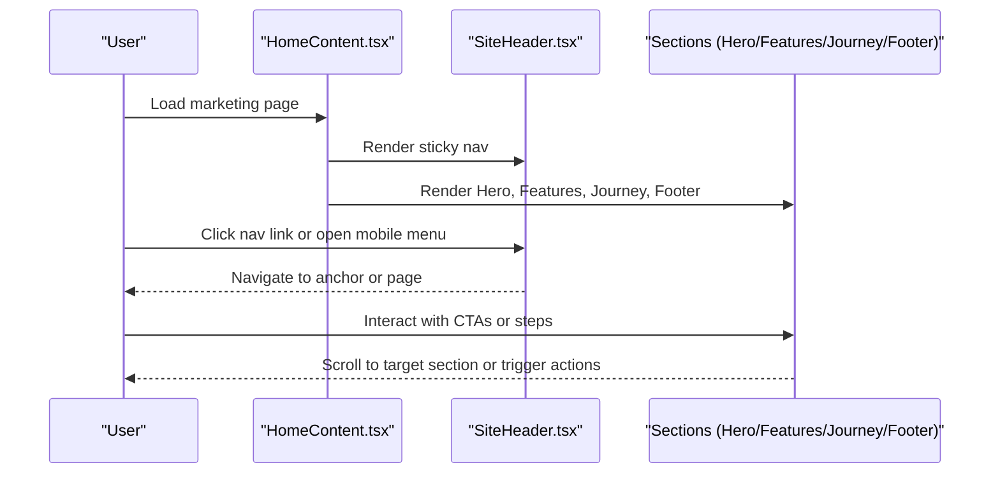
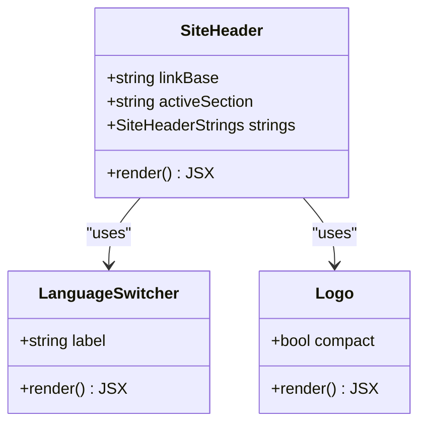
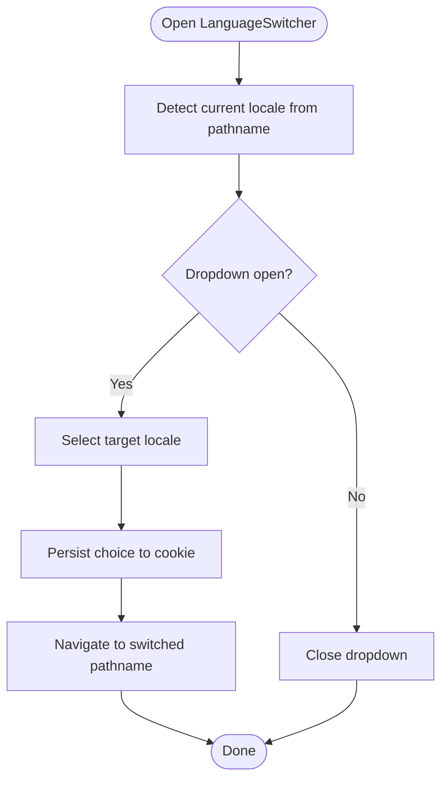
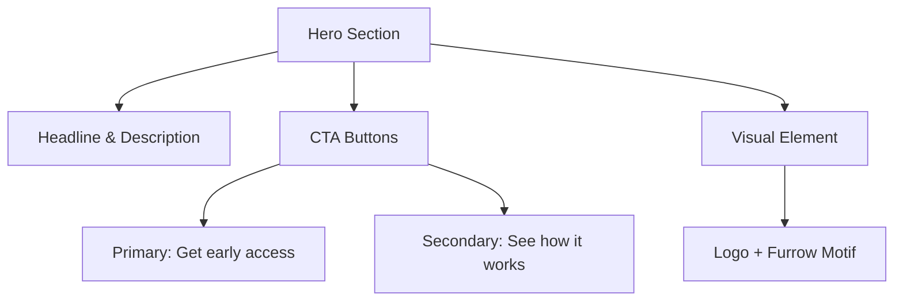
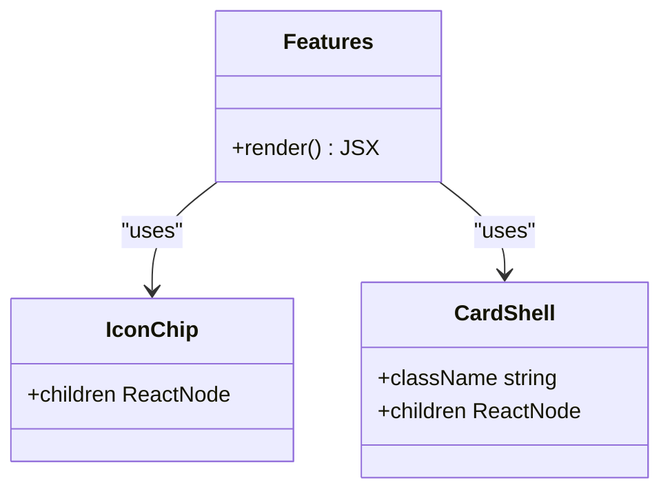
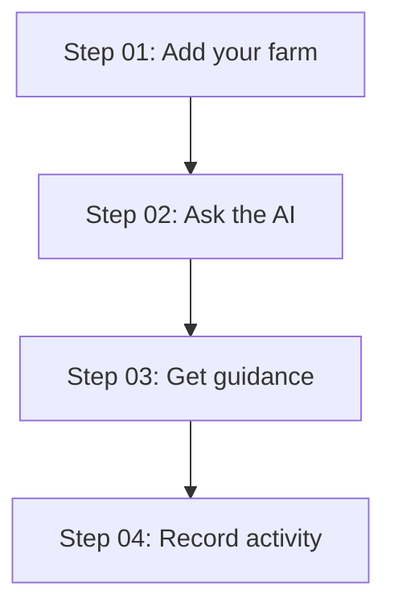
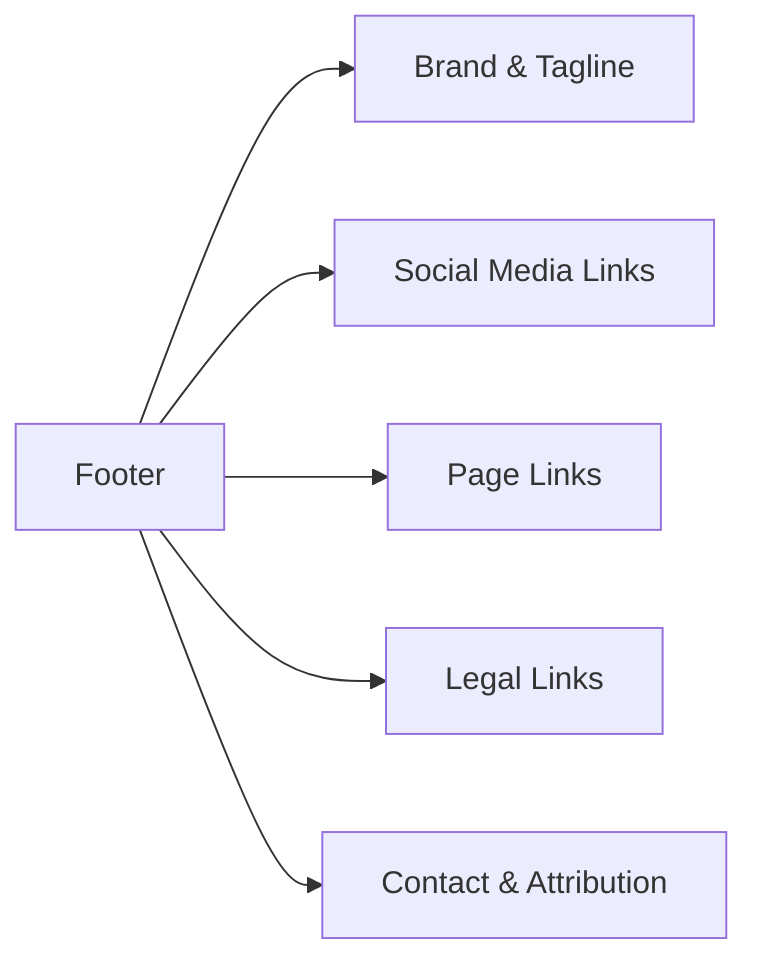
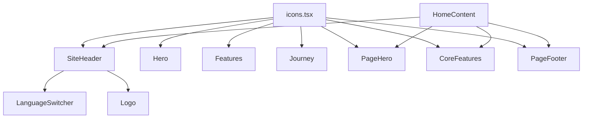

# Marketing Site Components

<cite>
**Referenced Files in This Document**
- [SiteHeader.tsx](file://components/SiteHeader.tsx)
- [language-switcher.tsx](file://components/language-switcher.tsx)
- [Logo.tsx](file://components/Logo.tsx)
- [icons.tsx](file://components/icons.tsx)
- [Hero.tsx](file://components/Hero.tsx)
- [Features.tsx](file://components/Features.tsx)
- [Journey.tsx](file://components/Journey.tsx)
- [Footer.tsx](file://components/Footer.tsx)
- [HomeContent.tsx](file://app/(site)/[locale]/home-content.tsx)
- [Page Hero.tsx](file://app/(site)/[locale]/sections/Hero.tsx)
- [Page Footer.tsx](file://app/(site)/[locale]/sections/Footer.tsx)
- [Core Features.tsx](file://app/(site)/[locale]/sections/CoreFeatures.tsx)
- [Farmer Journey.tsx](file://app/(site)/[locale]/sections/FarmerJourney.tsx)
- [Design System Master.md](file://design-system/agropioo/MASTER.md)
</cite>

## Table of Contents
1. Introduction
2. Project Structure
3. Core Components
4. Architecture Overview
5. Detailed Component Analysis
6. Dependency Analysis
7. Performance Considerations
8. Troubleshooting Guide
9. Conclusion

## Introduction
This document explains Agropioo’s marketing site components that showcase the platform’s features and value proposition. It covers the hero, footer, features, journey, and site header components, including their props, events, customization options, accessibility, responsive behavior, and integration with the design system. It also shows how these components compose to build compelling marketing pages.

## Project Structure
The marketing pages are composed from reusable UI components and page-level sections:
- Reusable components live under components/ (e.g., SiteHeader, Hero, Features, Journey, Footer).
- Page-level sections live under app/(site)/[locale]/sections/ and are assembled by a page content component.
- The home page composes SiteHeader, multiple sections, and Footer.

**Diagram sources**
- [HomeContent.tsx:1-37](file://app/(site)/[locale]/home-content.tsx#L1-L37)
- [SiteHeader.tsx:1-257](file://components/SiteHeader.tsx#L1-L257)
- [Page Hero.tsx:1-141](file://app/(site)/[locale]/sections/Hero.tsx#L1-L141)
- [Core Features.tsx:1-291](file://app/(site)/[locale]/sections/CoreFeatures.tsx#L1-L291)
- [Farmer Journey.tsx:1-64](file://app/(site)/[locale]/sections/FarmerJourney.tsx#L1-L64)
- [Page Footer.tsx:1-185](file://app/(site)/[locale]/sections/Footer.tsx#L1-L185)
- [Language Switcher.tsx:1-120](file://components/language-switcher.tsx#L1-L120)
- [Logo.tsx:1-21](file://components/Logo.tsx#L1-L21)
- [icons.tsx:1-358](file://components/icons.tsx#L1-L358)

**Section sources**
- [HomeContent.tsx:1-37](file://app/(site)/[locale]/home-content.tsx#L1-L37)

## Core Components
- SiteHeader: Sticky navigation with logo, links, language switcher, sign-in, and early access CTA; includes mobile menu with accessible dialog behavior.
- LanguageSwitcher: Locale selection dropdown that persists choice and navigates to the correct locale path.
- Logo: Brand mark with optional compact mode.
- icons: Shared SVG icon set used across components for consistent visual language.
- Hero: Value-prop section with headline, description, CTAs, and visual elements; supports responsive layout and motion cues.
- Features: Capability cards with icons and descriptions highlighting AI advisor, digital records, local languages, and weather-aware guidance.
- Journey: Step-by-step farmer workflow illustrating the user experience cycle.
- Footer: Links, social media, legal information, and branding.

**Section sources**
- [SiteHeader.tsx:13-257](file://components/SiteHeader.tsx#L13-L257)
- [language-switcher.tsx:1-120](file://components/language-switcher.tsx#L1-L120)
- [Logo.tsx:1-21](file://components/Logo.tsx#L1-L21)
- [icons.tsx:1-358](file://components/icons.tsx#L1-L358)
- [Hero.tsx:1-80](file://components/Hero.tsx#L1-L80)
- [Features.tsx:1-155](file://components/Features.tsx#L1-L155)
- [Journey.tsx:1-88](file://components/Journey.tsx#L1-L88)
- [Footer.tsx:1-54](file://components/Footer.tsx#L1-L54)

## Architecture Overview
The marketing site follows a composition pattern:
- A page content component assembles SiteHeader, multiple feature/journey sections, and Footer.
- Each section is localized via server-side dictionary functions and uses shared design tokens and icons.
- Navigation anchors link between sections for smooth scrolling and clear information hierarchy.

**Diagram sources**
- [HomeContent.tsx:1-37](file://app/(site)/[locale]/home-content.tsx#L1-L37)
- [SiteHeader.tsx:64-131](file://components/SiteHeader.tsx#L64-L131)
- [Page Hero.tsx:35-88](file://app/(site)/[locale]/sections/Hero.tsx#L35-L88)
- [Core Features.tsx:64-289](file://app/(site)/[locale]/sections/CoreFeatures.tsx#L64-L289)
- [Farmer Journey.tsx:17-63](file://app/(site)/[locale]/sections/FarmerJourney.tsx#L17-L63)
- [Page Footer.tsx:58-185](file://app/(site)/[locale]/sections/Footer.tsx#L58-L185)

## Detailed Component Analysis

### SiteHeader
- Purpose: Provides persistent navigation, brand identity, language switching, and primary calls-to-action.
- Props:
  - linkBase: Base path for cross-page links.
  - activeSection: Highlights current section in navigation.
  - strings: Localized labels for navigation items, CTA, and menu controls.
- Events:
  - Mobile menu open/close toggles state and manages focus and keyboard escape.
  - Scroll listener updates header appearance when scrolled.
- Accessibility:
  - aria-current on active links.
  - aria-expanded and aria-haspopup on mobile menu trigger.
  - Dialog-like mobile menu with role="dialog", aria-modal, and inert overlay.
- Responsive behavior:
  - Desktop: horizontal nav, language switcher, sign-in, and CTA.
  - Mobile: hamburger button opens slide-out menu with backdrop.
- Integration:
  - Uses LanguageSwitcher for locale changes.
  - Uses Logo for brand mark.
  - Uses Next.js Link for routing and usePathname for locale prefix handling.

**Diagram sources**
- [SiteHeader.tsx:13-257](file://components/SiteHeader.tsx#L13-L257)
- [language-switcher.tsx:1-120](file://components/language-switcher.tsx#L1-L120)
- [Logo.tsx:1-21](file://components/Logo.tsx#L1-L21)

**Section sources**
- [SiteHeader.tsx:25-257](file://components/SiteHeader.tsx#L25-L257)
- [language-switcher.tsx:29-119](file://components/language-switcher.tsx#L29-L119)
- [Logo.tsx:3-20](file://components/Logo.tsx#L3-L20)

### LanguageSwitcher
- Purpose: Allows users to switch the site language while preserving search params and hash.
- Behavior:
  - Persists explicit choice via cookie.
  - Navigates using switched pathname logic to ensure correct locale routing.
  - Manages dropdown open/close with pointer-down outside and Escape key support.
- Accessibility:
  - aria-haspopup="menu", aria-expanded, aria-label.
  - Menu role="menu" with menuitemradio items and aria-checked.
- Customization:
  - Accepts label prop for screen reader context.
  - Displays native name and English hint per locale.

**Diagram sources**
- [language-switcher.tsx:15-63](file://components/language-switcher.tsx#L15-L63)
- [language-switcher.tsx:65-119](file://components/language-switcher.tsx#L65-L119)

**Section sources**
- [language-switcher.tsx:1-120](file://components/language-switcher.tsx#L1-L120)

### Hero
- Purpose: Presents the core value proposition with headline, description, CTAs, and visual elements.
- Content:
  - Headline text and supporting copy.
  - Primary CTA (“Get early access”) and secondary CTA (“See how it works”).
  - Visual element with logo and decorative motif.
- Responsive behavior:
  - Two-column grid on larger screens; single column on small screens.
  - Fluid typography and spacing.
- Accessibility:
  - Semantic section with id for anchor linking.
  - Descriptive alt text for images.
- Design system integration:
  - Uses design tokens for colors, spacing, and typography.
  - Follows organic biophilic style guidelines.

**Diagram sources**
- [Hero.tsx:5-79](file://components/Hero.tsx#L5-L79)

**Section sources**
- [Hero.tsx:1-80](file://components/Hero.tsx#L1-L80)

### Features
- Purpose: Showcase platform capabilities with icons and descriptions.
- Capabilities:
  - AI Agriculture Advisor with example conversation snippet.
  - Digital Farm Record with activity chips.
  - Guidance in your language with supported languages list.
  - Weather-Aware Guidance with contextual advisory snippet.
- Layout:
  - Grid-based card layout with varied spans for emphasis.
- Accessibility:
  - aria-label on lists for scannability.
  - Semantic headings and paragraphs.
- Design system integration:
  - Consistent icon styling and color tokens.
  - Card borders, backgrounds, and shadows follow design specs.

**Diagram sources**
- [Features.tsx:15-37](file://components/Features.tsx#L15-L37)
- [Features.tsx:39-155](file://components/Features.tsx#L39-L155)

**Section sources**
- [Features.tsx:1-155](file://components/Features.tsx#L1-L155)

### Journey
- Purpose: Illustrate the farmer workflow and user experience through a step sequence.
- Steps:
  - Add your farm.
  - Ask the AI.
  - Get guidance.
  - Record activity.
- Layout:
  - Numbered steps with icons and connecting lines.
- Accessibility:
  - aria-labelledby for heading association.
  - aria-hidden for decorative elements.
- Design system integration:
  - Uses display headings and consistent color tokens.

**Diagram sources**
- [Journey.tsx:8-33](file://components/Journey.tsx#L8-L33)
- [Journey.tsx:35-88](file://components/Journey.tsx#L35-L88)

**Section sources**
- [Journey.tsx:1-88](file://components/Journey.tsx#L1-L88)

### Footer
- Purpose: Provide navigation links, social media integration, legal information, and branding.
- Content:
  - Brand logo and tagline.
  - Social icons with hover states.
  - Page links and legal links.
  - Contact info and product attribution.
- Accessibility:
  - aria-label on navigation regions.
  - Proper link attributes for external sites.
- Design system integration:
  - Uses design tokens for colors and typography.

**Diagram sources**
- [Footer.tsx:1-54](file://components/Footer.tsx#L1-L54)

**Section sources**
- [Footer.tsx:1-54](file://components/Footer.tsx#L1-L54)

### Page-Level Sections (Localized)
- Page Hero: Localized headline, subtitle, CTAs, and floating reading cards over an image.
- Core Features: Localized capability cards with mock conversations, record entries, language tags, and weather forecast snippets.
- Farmer Journey: Localized step-by-step timeline with numbered markers and vertical connectors.
- Page Footer: Localized multi-column footer with social icons, page/legal links, contact, and copyright.

These sections integrate with the same design system and icon set, ensuring consistency across the marketing site.

**Section sources**
- [Page Hero.tsx:1-141](file://app/(site)/[locale]/sections/Hero.tsx#L1-L141)
- [Core Features.tsx:1-291](file://app/(site)/[locale]/sections/CoreFeatures.tsx#L1-L291)
- [Farmer Journey.tsx:1-64](file://app/(site)/[locale]/sections/FarmerJourney.tsx#L1-L64)
- [Page Footer.tsx:1-185](file://app/(site)/[locale]/sections/Footer.tsx#L1-L185)

## Dependency Analysis
- Components depend on shared icons and design tokens for consistent visuals.
- SiteHeader depends on LanguageSwitcher for locale management and Logo for branding.
- Page sections depend on localization utilities and server dictionaries for dynamic content.
- All components adhere to the design system’s color palette, typography, spacing, and motion guidelines.

**Diagram sources**
- [icons.tsx:1-358](file://components/icons.tsx#L1-L358)
- [SiteHeader.tsx:1-257](file://components/SiteHeader.tsx#L1-L257)
- [language-switcher.tsx:1-120](file://components/language-switcher.tsx#L1-L120)
- [Logo.tsx:1-21](file://components/Logo.tsx#L1-L21)
- [Hero.tsx:1-80](file://components/Hero.tsx#L1-L80)
- [Features.tsx:1-155](file://components/Features.tsx#L1-L155)
- [Journey.tsx:1-88](file://components/Journey.tsx#L1-L88)
- [Page Hero.tsx:1-141](file://app/(site)/[locale]/sections/Hero.tsx#L1-L141)
- [Core Features.tsx:1-291](file://app/(site)/[locale]/sections/CoreFeatures.tsx#L1-L291)
- [Page Footer.tsx:1-185](file://app/(site)/[locale]/sections/Footer.tsx#L1-L185)
- [HomeContent.tsx:1-37](file://app/(site)/[locale]/home-content.tsx#L1-L37)

**Section sources**
- [Design System Master.md:15-216](file://design-system/agropioo/MASTER.md#L15-L216)

## Performance Considerations
- Use Next.js Image with priority for above-the-fold assets to improve perceived performance.
- Prefer static or server-rendered content for marketing sections to reduce client-side work.
- Keep animations subtle and respect reduced motion preferences.
- Avoid layout shifts by defining explicit sizes for images and containers.
- Minimize re-renders by memoizing stable references where needed.

[No sources needed since this section provides general guidance]

## Troubleshooting Guide
- Mobile menu not closing:
  - Ensure aria-expanded toggles correctly and Escape key handler is attached.
  - Verify backdrop click closes the menu.
- Language switch not updating:
  - Confirm switched pathname logic returns the correct URL and that cookies persist the choice.
  - Check that locale-specific routes render the expected content.
- Anchor links not scrolling:
  - Verify section ids match href targets and that scroll-margin styles are applied if needed.
- Accessibility issues:
  - Ensure all interactive elements have appropriate roles, labels, and focus states.
  - Validate contrast ratios against design system guidelines.

**Section sources**
- [SiteHeader.tsx:43-62](file://components/SiteHeader.tsx#L43-L62)
- [SiteHeader.tsx:133-158](file://components/SiteHeader.tsx#L133-L158)
- [language-switcher.tsx:39-56](file://components/language-switcher.tsx#L39-L56)
- [Design System Master.md:185-216](file://design-system/agropioo/MASTER.md#L185-L216)

## Conclusion
Agropioo’s marketing site components form a cohesive, accessible, and responsive experience. The SiteHeader orchestrates navigation and localization; the Hero communicates the core value; Features and Journey illustrate capabilities and workflow; and Footer consolidates links, social presence, and legal information. Together, they create compelling marketing pages aligned with the design system and optimized for performance and accessibility.

[No sources needed since this section summarizes without analyzing specific files]