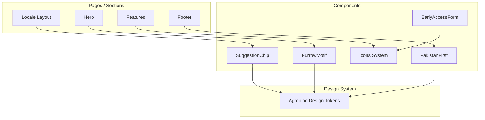
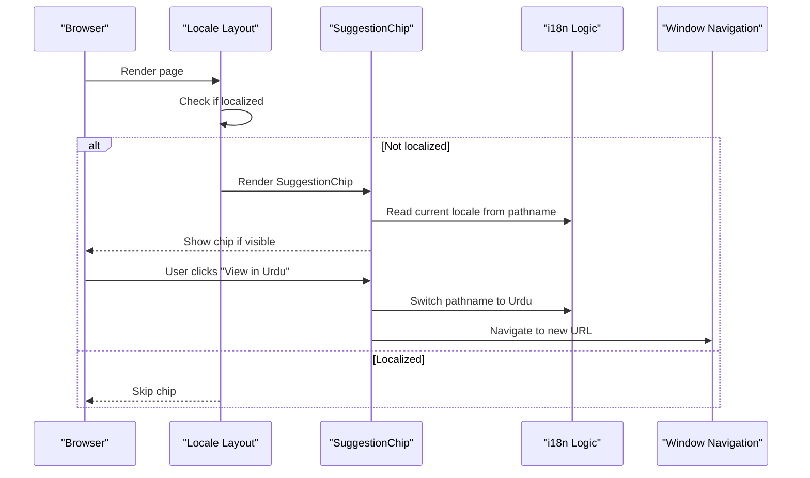
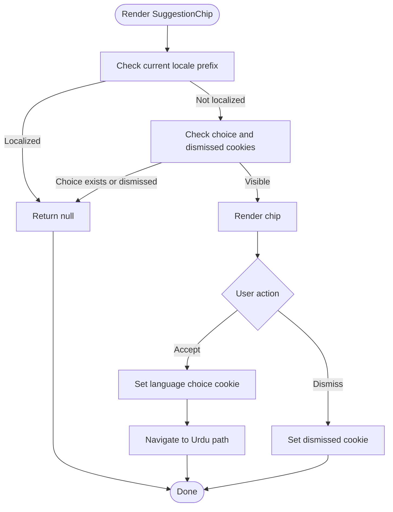
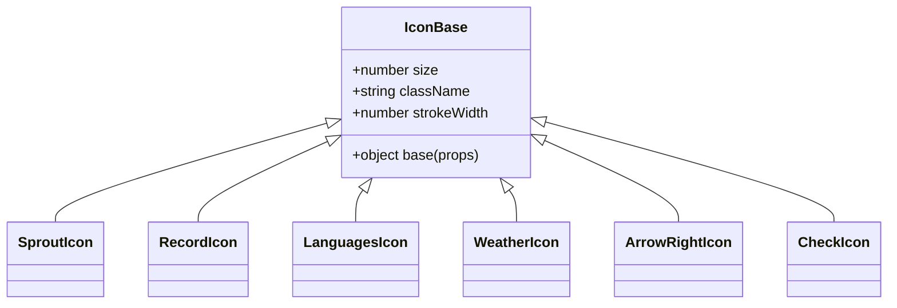
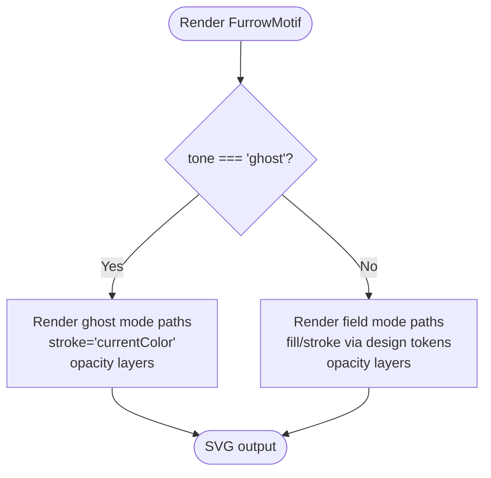
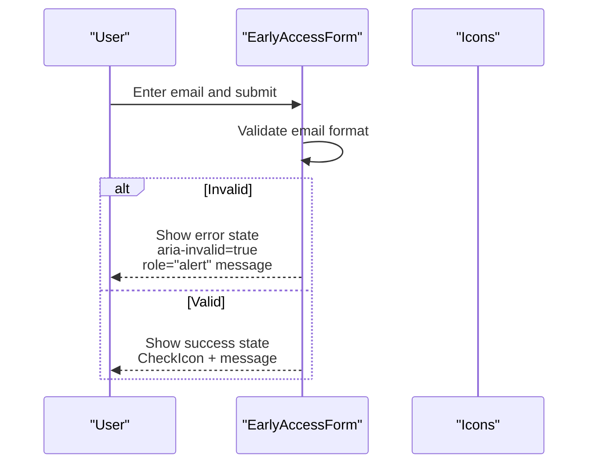
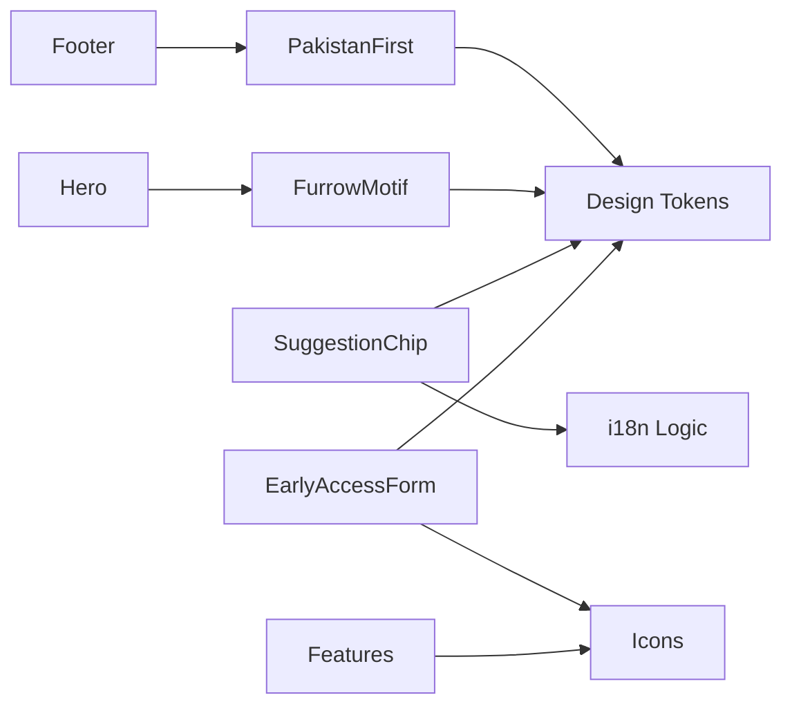

# Shared UI Components

<cite>
**Referenced Files in This Document**
- [suggestion-chip.tsx](file://components/suggestion-chip.tsx)
- [icons.tsx](file://components/icons.tsx)
- [PakistanFirst.tsx](file://components/PakistanFirst.tsx)
- [FurrowMotif.tsx](file://components/FurrowMotif.tsx)
- [EarlyAccessForm.tsx](file://components/EarlyAccessForm.tsx)
- [Hero.tsx](file://components/Hero.tsx)
- [Features.tsx](file://components/Features.tsx)
- [Footer.tsx](file://components/Footer.tsx)
- [MASTER.md](file://design-system/agropioo/MASTER.md)
- [layout.tsx](file://app/(site)/[locale]/layout.tsx)
</cite>

## Table of Contents
1. [Introduction](#introduction)
2. [Project Structure](#project-structure)
3. [Core Components](#core-components)
4. [Architecture Overview](#architecture-overview)
5. [Detailed Component Analysis](#detailed-component-analysis)
6. [Dependency Analysis](#dependency-analysis)
7. [Performance Considerations](#performance-considerations)
8. [Troubleshooting Guide](#troubleshooting-guide)
9. [Conclusion](#conclusion)
10. [Appendices](#appendices)

## Introduction
This document provides detailed, code-backed documentation for Agropioo’s shared UI components that power reusable user experiences across the application. It focuses on:
- SuggestionChip: a one-time, dismissible language suggestion chip for first-time visitors.
- Icons system: a consistent SVG icon library with sizing and accessibility attributes.
- PakistanFirst: a messaging section showcasing national pride and cultural adaptation.
- FurrowMotif: an agricultural-themed decorative SVG motif used as background accents.
- EarlyAccessForm: a client-side form to collect email interest with validation and accessible feedback.

Each component includes props/attributes, events, customization options, integration points with the design system, usage examples, accessibility considerations, internationalization notes, and performance guidance.

## Project Structure
The shared components live under the components directory and are consumed by site pages and sections. The design system defines color tokens, typography, spacing, and style rules that these components follow.

**Diagram sources**
- [layout.tsx:66-87](file://app/(site)/[locale]/layout.tsx#L66-L87)
- [Hero.tsx:1-80](file://components/Hero.tsx#L1-L80)
- [Features.tsx:1-155](file://components/Features.tsx#L1-L155)
- [Footer.tsx:1-54](file://components/Footer.tsx#L1-L54)
- [MASTER.md:15-73](file://design-system/agropioo/MASTER.md#L15-L73)

**Section sources**
- [layout.tsx:66-87](file://app/(site)/[locale]/layout.tsx#L66-L87)
- [MASTER.md:15-73](file://design-system/agropioo/MASTER.md#L15-L73)

## Core Components
- SuggestionChip: A fixed bottom banner shown once to English-only visitors without a stored language choice; supports accept (redirect to Urdu) and dismiss actions.
- Icons: A set of SVG icons with a shared base configuration for size, stroke, and accessibility attributes.
- PakistanFirst: A content section highlighting local languages and mission-driven messaging.
- FurrowMotif: An SVG decorative element representing agricultural furrows, available in two tones.
- EarlyAccessForm: A client-side email capture form with validation and accessible error/success states.

**Section sources**
- [suggestion-chip.tsx:1-106](file://components/suggestion-chip.tsx#L1-L106)
- [icons.tsx:1-358](file://components/icons.tsx#L1-L358)
- [PakistanFirst.tsx:1-45](file://components/PakistanFirst.tsx#L1-L45)
- [FurrowMotif.tsx:1-107](file://components/FurrowMotif.tsx#L1-L107)
- [EarlyAccessForm.tsx:1-81](file://components/EarlyAccessForm.tsx#L1-L81)

## Architecture Overview
The components integrate with Next.js routing and i18n logic to deliver localized experiences. The locale layout renders the SuggestionChip only on non-localized routes. Decorative motifs and icons are reused across marketing sections to maintain visual consistency.

**Diagram sources**
- [layout.tsx:66-87](file://app/(site)/[locale]/layout.tsx#L66-L87)
- [suggestion-chip.tsx:32-66](file://components/suggestion-chip.tsx#L32-L66)

## Detailed Component Analysis

### SuggestionChip
Purpose:
- One-time, dismissible suggestion to switch to Urdu for first-time visitors on English pages.

Props and behavior:
- No explicit props; visibility is computed based on current locale prefix and cookies.
- Uses an external store pattern via useSyncExternalStore to read cookie state reactively without hydration mismatches.

Events and interactions:
- Accept action sets a language choice cookie and navigates to the Urdu version of the current path while preserving query and hash.
- Dismiss action sets a “dismissed” cookie so the chip does not reappear.

Accessibility:
- Container uses role="status".
- Dismiss button has an aria-label describing its purpose.
- Close icon is marked aria-hidden.

Internationalization:
- Label text is intentionally hardcoded in Urdu to invite users into the Urdu site; it does not render on localized pages.

Integration:
- Rendered conditionally in the locale layout when the route is not localized.

Responsive behavior:
- Fixed at the bottom center with responsive padding and rounded styling.

Performance:
- Minimal re-renders due to external store subscription and early return when hidden.

Usage example:
- Add <SuggestionChip /> inside the body of the locale layout for non-localized routes.

**Section sources**
- [suggestion-chip.tsx:1-106](file://components/suggestion-chip.tsx#L1-L106)
- [layout.tsx:66-87](file://app/(site)/[locale]/layout.tsx#L66-L87)

#### SuggestionChip Flowchart

**Diagram sources**
- [suggestion-chip.tsx:32-66](file://components/suggestion-chip.tsx#L32-L66)

### Icons System
Purpose:
- Provide a consistent set of SVG icons with uniform sizing, stroke, and accessibility attributes.

Props and attributes:
- size: numeric pixel size applied to width and height.
- className: optional class for additional styling.
- strokeWidth: overrides default stroke width.
- All icons include aria-hidden="true" since they are decorative.

Icon library integration:
- Custom inline SVG paths define each icon; no external icon library dependency.
- Consistent base configuration ensures visual coherence across the app.

Customization:
- Use size and strokeWidth to adapt icons to different contexts (e.g., buttons vs. badges).
- Apply className to change color via CSS variables or Tailwind utilities.

Accessibility:
- Decorative icons are marked aria-hidden.
- When used as functional indicators, pair with accessible labels in parent components.

Performance:
- Lightweight inline SVGs reduce network requests and enable tree-shaking of unused icons.

Usage examples:
- SproutIcon, RecordIcon, LanguagesIcon, WeatherIcon, ArrowRightIcon, CheckIcon, etc., are used throughout features and forms.

**Section sources**
- [icons.tsx:1-358](file://components/icons.tsx#L1-L358)
- [Features.tsx:1-155](file://components/Features.tsx#L1-L155)
- [EarlyAccessForm.tsx:1-81](file://components/EarlyAccessForm.tsx#L1-L81)

#### Icons Class Diagram

**Diagram sources**
- [icons.tsx:1-358](file://components/icons.tsx#L1-L358)

### PakistanFirst
Purpose:
- Showcase national pride and localization commitment with a concise message and supported languages list.

Props and attributes:
- No props; static content with semantic HTML structure.

Events and interactions:
- None; purely presentational.

Customization:
- Styling uses design tokens for colors and typography; can be wrapped in custom containers if needed.

Accessibility:
- Section has an id and aria-labelledby pointing to the heading.
- Language list has an aria-label for screen readers.

Internationalization:
- Content is in English but highlights support for multiple local languages.

Integration:
- Referenced by footer navigation links for easy access.

Responsive behavior:
- Centered layout with responsive padding and clamp-based heading sizes.

Usage example:
- Include <PakistanFirst /> in landing sections; link to its id from the footer.

**Section sources**
- [PakistanFirst.tsx:1-45](file://components/PakistanFirst.tsx#L1-L45)
- [Footer.tsx:1-54](file://components/Footer.tsx#L1-L54)

### FurrowMotif
Purpose:
- Provide agricultural-themed decorative SVG backgrounds using layered furrow shapes.

Props and attributes:
- tone: "field" (colored fills/strokes using design tokens) or "ghost" (monochrome strokes/fills).
- className: optional class for sizing and positioning.

Events and interactions:
- None; decorative only.

Customization:
- Choose tone to match context (e.g., ghost for subtle overlays, field for branded sections).
- Control size via className and container constraints.

Accessibility:
- Marked aria-hidden="true" since it is decorative.

Integration:
- Used within Hero to create a visual footer accent behind imagery.

Responsive behavior:
- Uses viewBox and preserveAspectRatio to scale gracefully.

Performance:
- Pure SVG with minimal DOM nodes; efficient for repeated use.

Usage example:
- Place <FurrowMotif className="absolute bottom-0 left-0 w-full" /> inside image containers or hero sections.

**Section sources**
- [FurrowMotif.tsx:1-107](file://components/FurrowMotif.tsx#L1-L107)
- [Hero.tsx:1-80](file://components/Hero.tsx#L1-L80)

#### FurrowMotif Rendering Flow

**Diagram sources**
- [FurrowMotif.tsx:1-107](file://components/FurrowMotif.tsx#L1-L107)

### EarlyAccessForm
Purpose:
- Collect user email interest with client-side validation and accessible feedback.

Props and attributes:
- No props; manages internal state for email and status.

Events and interactions:
- onSubmit validates email format and transitions to success state; resets to idle on input changes after errors.

Customization:
- Status messages and styles can be extended; currently returns a success view with check icon and message.

Accessibility:
- Input has an associated label (visually hidden), aria-invalid for error state, and aria-describedby linking to error message.
- Error message uses role="alert" for immediate announcement.

Internationalization:
- Static strings; could be externalized for multi-language support.

Integration:
- Consumes icons for visual cues (ArrowRightIcon, CheckIcon).

Responsive behavior:
- Form stacks vertically on small screens and aligns horizontally on larger screens.

Performance:
- Lightweight client-side validation; no network calls in current implementation.

Usage example:
- Embed <EarlyAccessForm /> in landing sections; link to its id from CTAs.

**Section sources**
- [EarlyAccessForm.tsx:1-81](file://components/EarlyAccessForm.tsx#L1-L81)
- [icons.tsx:1-358](file://components/icons.tsx#L1-L358)

#### EarlyAccessForm Sequence

**Diagram sources**
- [EarlyAccessForm.tsx:12-33](file://components/EarlyAccessForm.tsx#L12-L33)
- [EarlyAccessForm.tsx:36-80](file://components/EarlyAccessForm.tsx#L36-L80)
- [icons.tsx:1-358](file://components/icons.tsx#L1-L358)

## Dependency Analysis
- SuggestionChip depends on i18n helpers for locale detection and pathname switching.
- EarlyAccessForm depends on icons for visual feedback.
- Hero composes FurrowMotif for decorative visuals.
- Features and Footer reference PakistanFirst indirectly through navigation and content organization.
- All components adhere to the Agropioo design system tokens for consistency.

**Diagram sources**
- [suggestion-chip.tsx:1-106](file://components/suggestion-chip.tsx#L1-L106)
- [EarlyAccessForm.tsx:1-81](file://components/EarlyAccessForm.tsx#L1-L81)
- [Hero.tsx:1-80](file://components/Hero.tsx#L1-L80)
- [Features.tsx:1-155](file://components/Features.tsx#L1-L155)
- [Footer.tsx:1-54](file://components/Footer.tsx#L1-L54)
- [MASTER.md:15-73](file://design-system/agropioo/MASTER.md#L15-L73)

**Section sources**
- [suggestion-chip.tsx:1-106](file://components/suggestion-chip.tsx#L1-L106)
- [EarlyAccessForm.tsx:1-81](file://components/EarlyAccessForm.tsx#L1-L81)
- [Hero.tsx:1-80](file://components/Hero.tsx#L1-L80)
- [Features.tsx:1-155](file://components/Features.tsx#L1-L155)
- [Footer.tsx:1-54](file://components/Footer.tsx#L1-L54)
- [MASTER.md:15-73](file://design-system/agropioo/MASTER.md#L15-L73)

## Performance Considerations
- SuggestionChip:
  - Avoids hydration mismatch by reading cookies via useSyncExternalStore.
  - Early return when hidden reduces unnecessary rendering.
- Icons:
  - Inline SVGs minimize network overhead and allow precise control over rendering.
  - Reuse consistent base props to keep bundle predictable.
- FurrowMotif:
  - Lightweight SVG paths; consider lazy loading if used extensively above the fold.
- EarlyAccessForm:
  - Client-side validation prevents unnecessary server calls; extend with debounced checks if needed.
- General:
  - Follow design system guidelines for transitions and focus states to ensure smooth UX without layout shifts.

[No sources needed since this section provides general guidance]

## Troubleshooting Guide
- SuggestionChip not appearing:
  - Ensure the route is not localized; the chip is skipped on localized pages.
  - Verify cookies are not blocking display (choice or dismissed cookies set previously).
- SuggestionChip redirect issues:
  - Confirm pathname switching function correctly maps to the target locale.
  - Check that query parameters and hash are preserved during navigation.
- EarlyAccessForm validation:
  - If error persists after correction, ensure onChange resets status to idle.
  - Confirm aria-describedby links to the correct error element id.
- Icons not displaying:
  - Verify size and className are applied correctly.
  - Ensure parent elements do not override color via conflicting styles.

**Section sources**
- [suggestion-chip.tsx:32-66](file://components/suggestion-chip.tsx#L32-L66)
- [EarlyAccessForm.tsx:12-80](file://components/EarlyAccessForm.tsx#L12-L80)
- [icons.tsx:1-358](file://components/icons.tsx#L1-L358)

## Conclusion
Agropioo’s shared UI components provide a cohesive, accessible, and performant foundation for building localized, culturally adapted experiences. The SuggestionChip streamlines onboarding for new visitors, the Icons system ensures consistent visual language, PakistanFirst reinforces brand identity, FurrowMotif adds thematic depth, and EarlyAccessForm captures interest with clear feedback. Together, they align with the Agropioo design system to deliver a unified product experience.

[No sources needed since this section summarizes without analyzing specific files]

## Appendices

### Accessibility Checklist
- SuggestionChip:
  - role="status" container, aria-label on dismiss button, aria-hidden on decorative icon.
- Icons:
  - Decorative icons marked aria-hidden; functional icons should be paired with accessible labels in parent components.
- PakistanFirst:
  - Semantic headings and aria-labelledby; aria-label on language list.
- FurrowMotif:
  - aria-hidden="true" for decorative SVG.
- EarlyAccessForm:
  - Associated label, aria-invalid for errors, aria-describedby linking to error message, role="alert" for error announcements.

**Section sources**
- [suggestion-chip.tsx:68-101](file://components/suggestion-chip.tsx#L68-L101)
- [icons.tsx:1-358](file://components/icons.tsx#L1-L358)
- [PakistanFirst.tsx:5-41](file://components/PakistanFirst.tsx#L5-L41)
- [FurrowMotif.tsx:9-15](file://components/FurrowMotif.tsx#L9-L15)
- [EarlyAccessForm.tsx:36-80](file://components/EarlyAccessForm.tsx#L36-L80)

### Internationalization Notes
- SuggestionChip:
  - Intentionally shows Urdu invitation text; does not render on localized routes.
- PakistanFirst:
  - Lists supported languages; content remains in English but emphasizes local language support.
- EarlyAccessForm:
  - Static strings; consider extracting to translation keys for full i18n coverage.

**Section sources**
- [suggestion-chip.tsx:38-43](file://components/suggestion-chip.tsx#L38-L43)
- [PakistanFirst.tsx:1-45](file://components/PakistanFirst.tsx#L1-L45)
- [EarlyAccessForm.tsx:22-33](file://components/EarlyAccessForm.tsx#L22-L33)

### Design System Integration
- Colors, typography, spacing, and motion guidelines are defined in the design system master file.
- Components use Tailwind utility classes aligned with design tokens (e.g., agro-sprout, agro-canopy, agro-mint).
- Adhering to anti-patterns ensures consistent, accessible, and performant UI.

**Section sources**
- [MASTER.md:15-73](file://design-system/agropioo/MASTER.md#L15-L73)
- [MASTER.md:165-216](file://design-system/agropioo/MASTER.md#L165-L216)