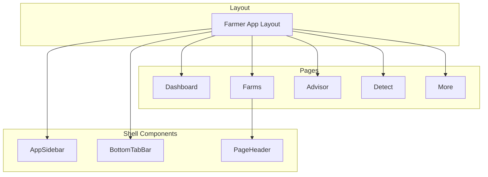
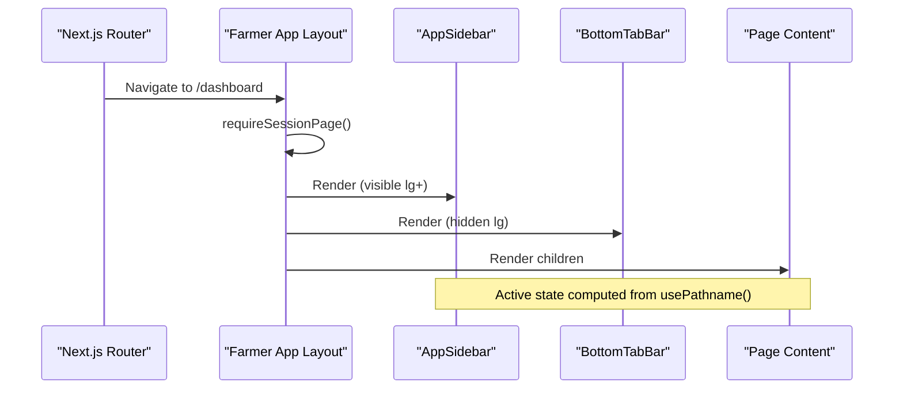
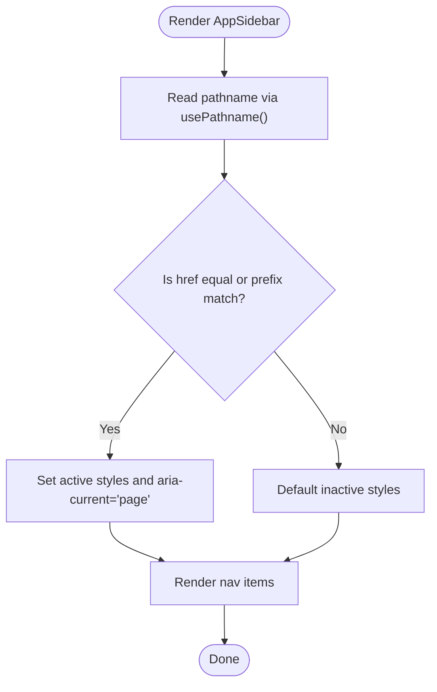
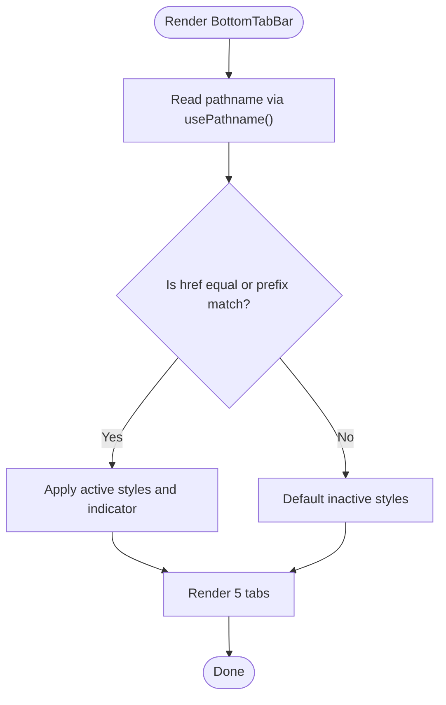
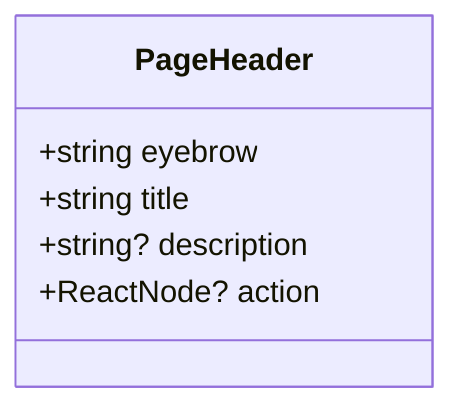
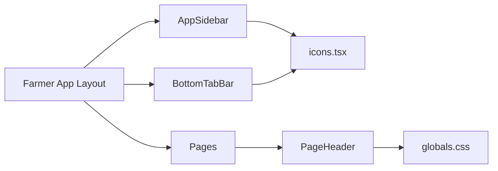

# Shell Components

<cite>
**Referenced Files in This Document**
- [app-sidebar.tsx](file://components/shell/app-sidebar.tsx)
- [bottom-tab-bar.tsx](file://components/shell/bottom-tab-bar.tsx)
- [page-header.tsx](file://components/shell/page-header.tsx)
- [dashboard layout.tsx](file://app/(farmer)/(dashboard)/layout.tsx)
- [icons.tsx](file://components/icons.tsx)
- [globals.css](file://app/globals.css)
- [farms page.tsx](file://app/(farmer)/(dashboard)/farms/page.tsx)
</cite>

## Table of Contents
1. [Introduction](#introduction)
2. [Project Structure](#project-structure)
3. [Core Components](#core-components)
4. [Architecture Overview](#architecture-overview)
5. [Detailed Component Analysis](#detailed-component-analysis)
6. [Dependency Analysis](#dependency-analysis)
7. [Performance Considerations](#performance-considerations)
8. [Troubleshooting Guide](#troubleshooting-guide)
9. [Conclusion](#conclusion)

## Introduction
This document explains Agropioo’s shell components that provide the application layout and navigation structure for the farmer app. It covers:
- App Sidebar: desktop navigation rail with menu items, active state, and branding.
- Bottom Tab Bar: mobile navigation bar with five tabs, active state, and safe-area support.
- Page Header: consistent title area with eyebrow label, optional description, and action slot.

It also documents props/attributes, events, customization options, integration with the design system, responsive behavior, accessibility patterns, performance considerations, and composition patterns across these components.

## Project Structure
The shell is composed of three reusable components under components/shell and is orchestrated by a route-level layout that renders both desktop sidebar and mobile tab bar around page content.

**Diagram sources**
- [dashboard layout.tsx:1-26](file://app/(farmer)/(dashboard)/layout.tsx#L1-L26)
- [app-sidebar.tsx:1-98](file://components/shell/app-sidebar.tsx#L1-L98)
- [bottom-tab-bar.tsx:1-70](file://components/shell/bottom-tab-bar.tsx#L1-L70)
- [page-header.tsx:1-42](file://components/shell/page-header.tsx#L1-L42)
- [farms page.tsx:1-108](file://app/(farmer)/(dashboard)/farms/page.tsx#L1-L108)

**Section sources**
- [dashboard layout.tsx:1-26](file://app/(farmer)/(dashboard)/layout.tsx#L1-L26)
- [app-sidebar.tsx:1-98](file://components/shell/app-sidebar.tsx#L1-L98)
- [bottom-tab-bar.tsx:1-70](file://components/shell/bottom-tab-bar.tsx#L1-L70)
- [page-header.tsx:1-42](file://components/shell/page-header.tsx#L1-L42)
- [farms page.tsx:1-108](file://app/(farmer)/(dashboard)/farms/page.tsx#L1-L108)

## Core Components
- AppSidebar: Desktop-only fixed left rail with logo, navigation links, sign-out, and branding. Uses Next.js routing to compute active state based on pathname.
- BottomTabBar: Mobile-only fixed bottom nav with five tabs. Uses Next.js routing to compute active state and provides accessible labels.
- PageHeader: Reusable header with eyebrow label, title, optional description, and an action slot for buttons or links.

These components integrate with the design system via Tailwind utility classes and CSS variables defined globally.

**Section sources**
- [app-sidebar.tsx:1-98](file://components/shell/app-sidebar.tsx#L1-L98)
- [bottom-tab-bar.tsx:1-70](file://components/shell/bottom-tab-bar.tsx#L1-L70)
- [page-header.tsx:1-42](file://components/shell/page-header.tsx#L1-L42)
- [globals.css:9-74](file://app/globals.css#L9-L74)

## Architecture Overview
The farmer app layout composes the shell:
- Renders AppSidebar on large screens and hides it on small screens.
- Wraps page content in a main container with responsive padding and max-width.
- Renders BottomTabBar at the bottom on small screens; hidden on large screens.
- Enforces session guard before rendering the shell.

**Diagram sources**
- [dashboard layout.tsx:1-26](file://app/(farmer)/(dashboard)/layout.tsx#L1-L26)
- [app-sidebar.tsx:1-98](file://components/shell/app-sidebar.tsx#L1-L98)
- [bottom-tab-bar.tsx:1-70](file://components/shell/bottom-tab-bar.tsx#L1-L70)

## Detailed Component Analysis

### AppSidebar
Responsibilities:
- Displays brand logo and product tagline.
- Provides primary navigation for the farmer app.
- Highlights the current page using pathname-based active detection.
- Includes a sign-out link and branding footer.

Props/Attributes:
- None (configuration-driven via internal destinations array).

Events:
- None (navigation handled by Next.js Link).

Customization:
- Add or reorder destinations by editing the destinations list.
- Adjust styling via Tailwind classes (colors, spacing, typography).
- Replace icons by swapping icon components from the shared icon set.

Responsive Behavior:
- Fixed left rail visible on large screens (lg+), hidden on smaller devices.
- Uses aria-current="page" for active item to improve accessibility.

Accessibility:
- Semantic aside element with a descriptive aria-label for the nav.
- Links include aria-current when active.
- Decorative elements marked aria-hidden.

Integration with Design System:
- Uses semantic color tokens (agro-forest, agro-sprout, etc.) and fonts from globals.css.
- Follows consistent spacing and typography scales.

Usage Example:
- Rendered automatically by the farmer app layout; no explicit usage required in pages.

Performance Notes:
- Lightweight client component; uses Next.js Link for efficient navigation.
- No heavy computations; active state derived from pathname.

**Diagram sources**
- [app-sidebar.tsx:32-79](file://components/shell/app-sidebar.tsx#L32-L79)

**Section sources**
- [app-sidebar.tsx:1-98](file://components/shell/app-sidebar.tsx#L1-L98)
- [icons.tsx:143-218](file://components/icons.tsx#L143-L218)
- [globals.css:9-74](file://app/globals.css#L9-L74)

### BottomTabBar
Responsibilities:
- Provides mobile-first navigation with exactly five tabs per spec.
- Highlights the active tab with a top indicator and filled icon background.
- Ensures safe-area padding on iOS devices.

Props/Attributes:
- None (configuration-driven via internal tabs array).

Events:
- None (navigation handled by Next.js Link).

Customization:
- Modify tabs array to change destinations, labels, and icons.
- Adjust active/inactive styles via Tailwind utilities.

Responsive Behavior:
- Visible on small screens; hidden on large screens (lg+).
- Uses grid-cols-5 for equal distribution.

Accessibility:
- Semantic nav with aria-label.
- aria-current="page" on active tab.
- Screen-reader hint via sr-only text indicating current page.

Integration with Design System:
- Uses semantic colors (agro-canopy, agro-forest, agro-slate) and font tokens.
- Safe-area inset via env(safe-area-inset-bottom).

Usage Example:
- Rendered automatically by the farmer app layout; no explicit usage required in pages.

Performance Notes:
- Minimal DOM and lightweight client component.
- Active state computed from pathname without extra re-renders.

**Diagram sources**
- [bottom-tab-bar.tsx:23-67](file://components/shell/bottom-tab-bar.tsx#L23-L67)

**Section sources**
- [bottom-tab-bar.tsx:1-70](file://components/shell/bottom-tab-bar.tsx#L1-L70)
- [icons.tsx:143-184](file://components/icons.tsx#L143-L184)
- [globals.css:9-74](file://app/globals.css#L9-L74)

### PageHeader
Responsibilities:
- Displays a consistent page header with eyebrow label, title, optional description, and an action slot.
- Uses a gradient hairline separator between eyebrow and action area.

Props/Attributes:
- eyebrow: string — mono field label above the title.
- title: string — display heading.
- description?: string — optional plain-language description.
- action?: ReactNode — optional right-aligned action (link/button).

Events:
- None (action is a pass-through React node; consumers handle interactions).

Customization:
- Provide any ReactNode as action to render custom controls.
- Style via Tailwind classes already applied; extend as needed.

Accessibility:
- Semantic header and h1 for title.
- Action area includes aria-hidden decorative line.

Integration with Design System:
- Uses display-heading class and semantic color tokens.
- Typography follows project fonts and scales.

Usage Example:
- Used in Farms page to present section header and add action.

**Diagram sources**
- [page-header.tsx:3-11](file://components/shell/page-header.tsx#L3-L11)

**Section sources**
- [page-header.tsx:1-42](file://components/shell/page-header.tsx#L1-L42)
- [farms page.tsx:25-38](file://app/(farmer)/(dashboard)/farms/page.tsx#L25-L38)
- [globals.css:114-125](file://app/globals.css#L114-L125)

## Dependency Analysis
Components rely on:
- Next.js routing primitives (usePathname, Link) for navigation and active state.
- Shared icon set for visual consistency.
- Global CSS theme for colors, fonts, and focus styles.

**Diagram sources**
- [app-sidebar.tsx:1-98](file://components/shell/app-sidebar.tsx#L1-L98)
- [bottom-tab-bar.tsx:1-70](file://components/shell/bottom-tab-bar.tsx#L1-L70)
- [page-header.tsx:1-42](file://components/shell/page-header.tsx#L1-L42)
- [dashboard layout.tsx:1-26](file://app/(farmer)/(dashboard)/layout.tsx#L1-L26)
- [icons.tsx:1-358](file://components/icons.tsx#L1-L358)
- [globals.css:9-74](file://app/globals.css#L9-L74)

**Section sources**
- [app-sidebar.tsx:1-98](file://components/shell/app-sidebar.tsx#L1-L98)
- [bottom-tab-bar.tsx:1-70](file://components/shell/bottom-tab-bar.tsx#L1-L70)
- [page-header.tsx:1-42](file://components/shell/page-header.tsx#L1-L42)
- [dashboard layout.tsx:1-26](file://app/(farmer)/(dashboard)/layout.tsx#L1-L26)
- [icons.tsx:1-358](file://components/icons.tsx#L1-L358)
- [globals.css:9-74](file://app/globals.css#L9-L74)

## Performance Considerations
- Client vs Server: AppSidebar and BottomTabBar are client components due to usePathname; keep them minimal to avoid unnecessary re-renders.
- Navigation: Use Next.js Link for prefetching and efficient transitions.
- Styling: Prefer Tailwind utilities and CSS variables for fast, scoped styling without runtime overhead.
- Icons: Centralized SVG components reduce duplication and enable consistent sizing/stroke.
- Responsive: Hide non-critical chrome on small screens (sidebar) and show only essential navigation (tabs).

[No sources needed since this section provides general guidance]

## Troubleshooting Guide
Common issues and resolutions:
- Active state not updating: Ensure usePathname is used within a client component and routes match href values exactly or via prefix matching.
- Tab bar overlaps content: Verify main content has appropriate bottom padding on mobile to avoid overlap with fixed BottomTabBar.
- Sidebar overlaps content on desktop: Confirm main container applies left padding on large screens to account for fixed AppSidebar width.
- Accessibility warnings: Ensure all interactive elements have proper roles and labels; use aria-current for active navigation items and aria-hidden for decorative elements.
- Safe-area issues on iOS: Confirm BottomTabBar uses env(safe-area-inset-bottom) for bottom padding.

**Section sources**
- [bottom-tab-bar.tsx:31-34](file://components/shell/bottom-tab-bar.tsx#L31-L34)
- [dashboard layout.tsx:14-21](file://app/(farmer)/(dashboard)/layout.tsx#L14-L21)
- [app-sidebar.tsx:49-79](file://components/shell/app-sidebar.tsx#L49-L79)

## Conclusion
Agropioo’s shell components deliver a consistent, accessible, and responsive application layout:
- AppSidebar provides desktop navigation with clear active states and branding.
- BottomTabBar offers mobile navigation optimized for touch and outdoor readability.
- PageHeader standardizes page titles and actions across the app.
Together, they compose a cohesive experience aligned with the design system and tailored for farmers’ needs on both desktop and mobile devices.

[No sources needed since this section summarizes without analyzing specific files]