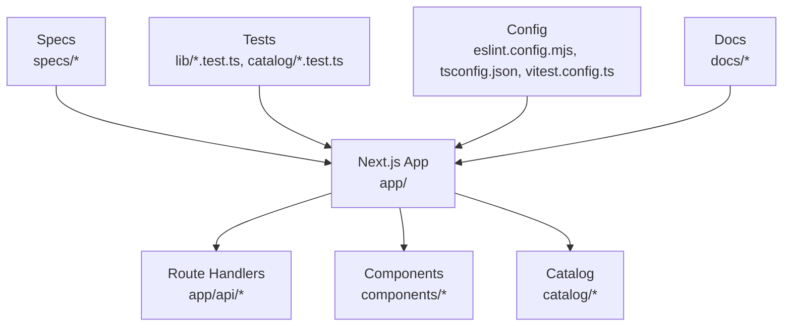
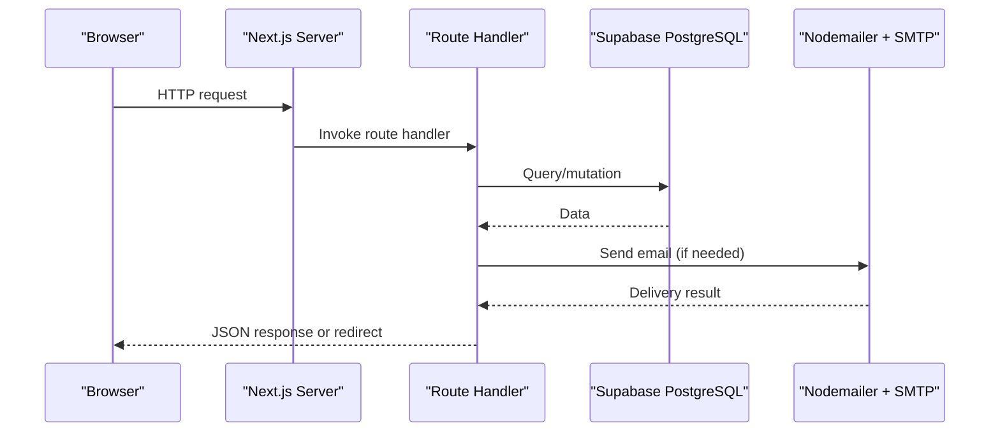
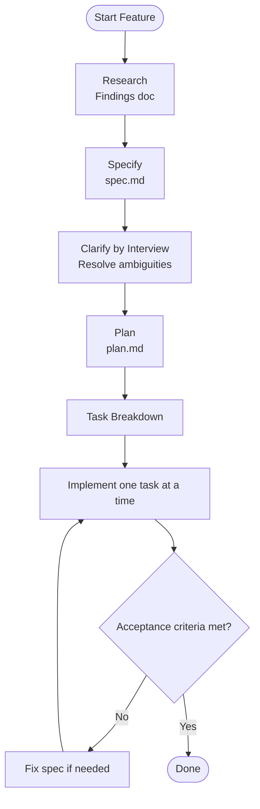
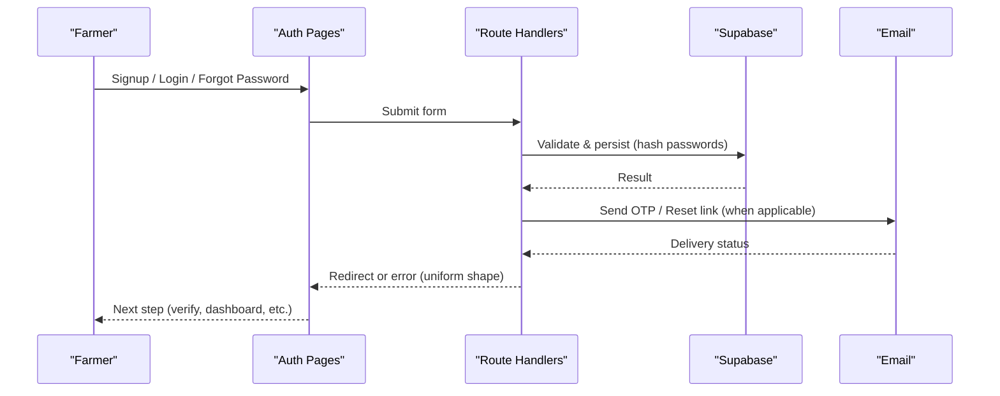
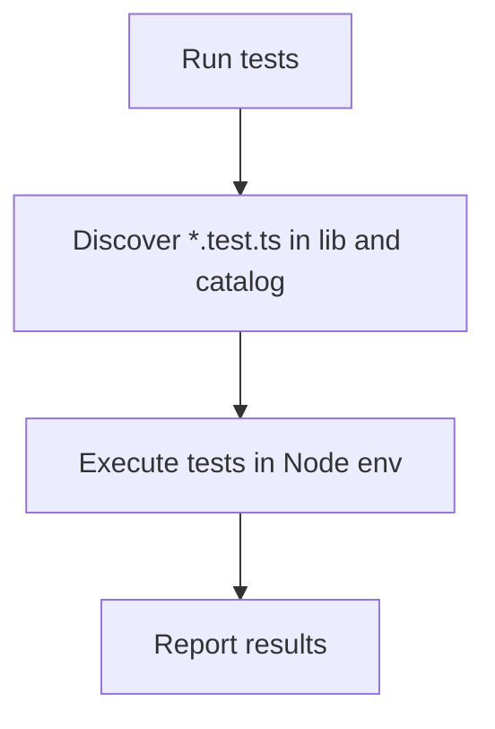
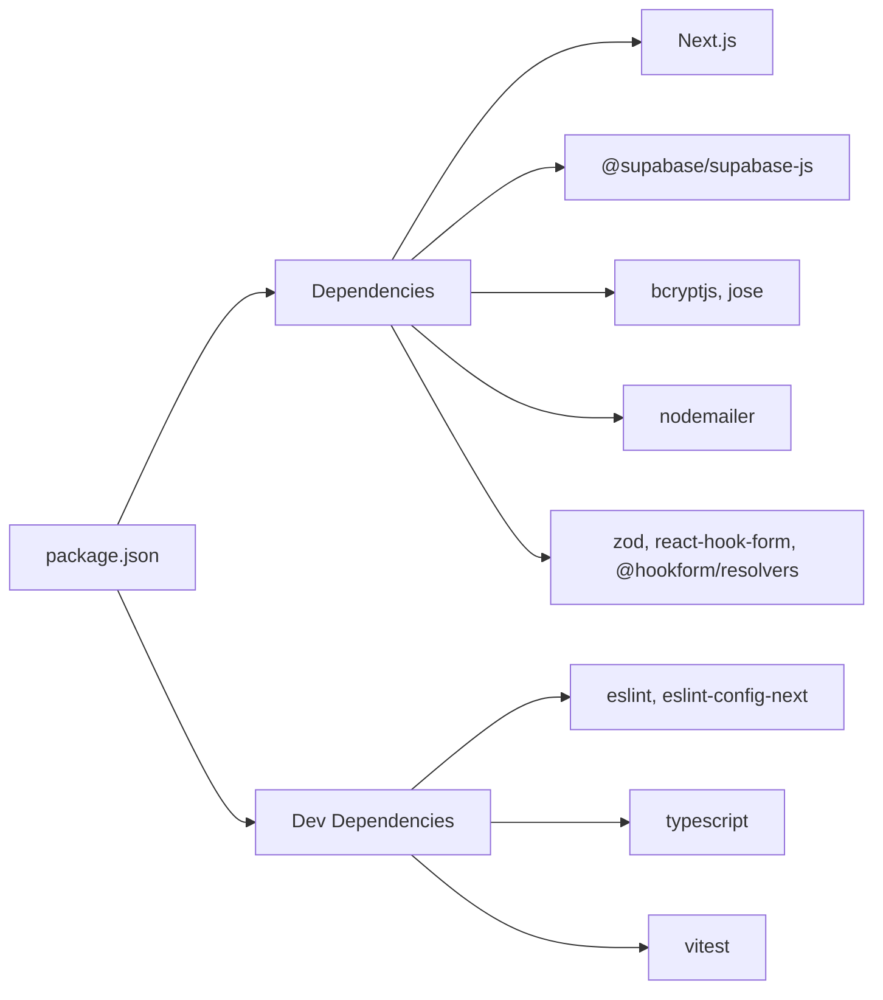

# Contributing Guide

<cite>
**Referenced Files in This Document**
- [README.md](file://README.md)
- [package.json](file://package.json)
- [eslint.config.mjs](file://eslint.config.mjs)
- [tsconfig.json](file://tsconfig.json)
- [vitest.config.ts](file://vitest.config.ts)
- [AGENTS.md](file://AGENTS.md)
- [CLAUDE.md](file://CLAUDE.md)
- [specs/authentication/spec.md](file://specs/authentication/spec.md)
- [catalog/catalog.test.ts](file://catalog/catalog.test.ts)
- [docs/Agropioo_Tech_Stack.md](file://docs/Agropioo_Tech_Stack.md)
- [docs/brand-identity.md](file://docs/brand-identity.md)
</cite>

## Table of Contents
1. Introduction
2. Project Structure
3. Core Components
4. Architecture Overview
5. Detailed Component Analysis
6. Dependency Analysis
7. Performance Considerations
8. Troubleshooting Guide
9. Conclusion
10. Appendices

## Introduction
This guide explains how to contribute effectively to Agropioo, a Next.js-based application built for Pakistani farmers. It covers development workflow, branch and commit conventions, code style with ESLint, TypeScript best practices, React component patterns, spec-driven development, documentation standards, testing requirements, environment setup, debugging, performance profiling, contribution types, community guidelines, and cultural sensitivity.

## Project Structure
Agropioo is a full-stack Next.js application with:
- Frontend and server logic in the app directory
- API endpoints as Route Handlers under app/api
- Shared components in components
- Internationalization catalog in catalog
- Specs in specs
- Tests in lib and catalog
- Configuration files at the repository root (ESLint, TypeScript, Vitest)
- Documentation in docs

**Diagram sources**
- [package.json:5-12](file://package.json#L5-L12)
- [eslint.config.mjs:1-19](file://eslint.config.mjs#L1-L19)
- [tsconfig.json:1-36](file://tsconfig.json#L1-L36)
- [vitest.config.ts:1-15](file://vitest.config.ts#L1-L15)

**Section sources**
- [README.md:1-37](file://README.md#L1-L37)
- [package.json:1-38](file://package.json#L1-L38)

## Core Components
- Development scripts: dev, build, start, lint, test, and translation sync are defined in package scripts.
- Linting: ESLint configured via Next.js presets; global ignores set for build artifacts.
- TypeScript: Strict mode enabled, path aliases configured, JSX runtime set to react-jsx.
- Testing: Vitest configured with Node environment and include patterns for lib and catalog tests.
- Spec-driven development: The project enforces a strict loop (Research → Specify → Clarify → Build) with founder-gated phase transitions.

Key responsibilities:
- AGENTS.md defines the constitution, stack, security rules, code conventions, testing policy, dependencies, and definition of done.
- CLAUDE.md references AGENTS.md as the active rules file.
- Specs define behavior-first requirements; code implements them.

**Section sources**
- [package.json:5-12](file://package.json#L5-L12)
- [eslint.config.mjs:1-19](file://eslint.config.mjs#L1-L19)
- [tsconfig.json:1-36](file://tsconfig.json#L1-L36)
- [vitest.config.ts:1-15](file://vitest.config.ts#L1-L15)
- [AGENTS.md:1-153](file://AGENTS.md#L1-L153)
- [CLAUDE.md:1-2](file://CLAUDE.md#L1-L2)

## Architecture Overview
Agropioo uses a single Next.js application for both frontend and backend. Route Handlers implement the API layer. Supabase PostgreSQL is used only as the database. Authentication, validation, and email flows run server-side.

**Diagram sources**
- [docs/Agropioo_Tech_Stack.md:20-117](file://docs/Agropioo_Tech_Stack.md#L20-L117)
- [docs/Agropioo_Tech_Stack.md:120-234](file://docs/Agropioo_Tech_Stack.md#L120-L234)

**Section sources**
- [docs/Agropioo_Tech_Stack.md:1-365](file://docs/Agropioo_Tech_Stack.md#L1-L365)

## Detailed Component Analysis

### Spec-Driven Development Workflow
The project follows a strict, founder-gated loop: Research → Specify → Clarify → Build. Each phase produces artifacts stored under specs/<feature>. Behavior is captured first; implementation follows.

**Diagram sources**
- [AGENTS.md:104-138](file://AGENTS.md#L104-L138)
- [specs/authentication/spec.md:1-137](file://specs/authentication/spec.md#L1-L137)

**Section sources**
- [AGENTS.md:104-138](file://AGENTS.md#L104-L138)
- [specs/authentication/spec.md:1-137](file://specs/authentication/spec.md#L1-L137)

### Authentication Flow (Example Feature)
Authentication demonstrates the spec-to-code flow across signup, OTP verification, login, session management, and password reset. All inputs are validated server-side, tokens are JWTs in httpOnly cookies, and errors follow a uniform shape.

**Diagram sources**
- [specs/authentication/spec.md:1-137](file://specs/authentication/spec.md#L1-L137)
- [docs/Agropioo_Tech_Stack.md:151-234](file://docs/Agropioo_Tech_Stack.md#L151-L234)

**Section sources**
- [specs/authentication/spec.md:1-137](file://specs/authentication/spec.md#L1-L137)
- [docs/Agropioo_Tech_Stack.md:151-234](file://docs/Agropioo_Tech_Stack.md#L151-L234)

### Testing Patterns
- Unit and integration tests live under lib and catalog directories.
- Catalog tests verify i18n keys and values consistency across locales.
- Vitest runs in a Node environment and includes specific paths.

**Diagram sources**
- [vitest.config.ts:1-15](file://vitest.config.ts#L1-L15)
- [catalog/catalog.test.ts:1-36](file://catalog/catalog.test.ts#L1-L36)

**Section sources**
- [vitest.config.ts:1-15](file://vitest.config.ts#L1-L15)
- [catalog/catalog.test.ts:1-36](file://catalog/catalog.test.ts#L1-L36)

### Code Style and TypeScript Best Practices
- Linting: Use ESLint with Next.js presets; ensure no build artifacts are linted.
- TypeScript: Strict mode, no any, no non-null assertions, no ts-ignore/ts-expect-error.
- React: Prefer Server Components; use "use client" only where interactivity is required.
- Paths: Use @ alias for imports.

Practical steps:
- Run linter before committing.
- Keep components feature-scoped near routes; shared UI in components/.
- Validate all inputs with Zod in handlers.

**Section sources**
- [eslint.config.mjs:1-19](file://eslint.config.mjs#L1-L19)
- [tsconfig.json:1-36](file://tsconfig.json#L1-L36)
- [AGENTS.md:64-69](file://AGENTS.md#L64-L69)

### Documentation Standards
- Specs must be written first and kept in sync with code changes.
- Use clear sections: goal, scenarios, requirements, edge cases, out-of-scope, acceptance criteria.
- Keep implementation details out of specs; they belong in plans and code.

**Section sources**
- [AGENTS.md:104-138](file://AGENTS.md#L104-L138)

## Dependency Analysis
Agropioo’s dependency model emphasizes reuse and approval for new packages. The allowed libraries are fixed unless explicitly approved.

**Diagram sources**
- [package.json:13-36](file://package.json#L13-L36)

**Section sources**
- [package.json:1-38](file://package.json#L1-L38)
- [AGENTS.md:50-53](file://AGENTS.md#L50-L53)

## Performance Considerations
- Prefer Server Components to reduce client bundle size.
- Validate inputs early to avoid unnecessary work.
- Keep dependencies minimal; reuse existing components and utilities.
- Ensure images and fonts are optimized per Next.js recommendations.
- Profile with browser tools and Next.js insights when needed.

[No sources needed since this section provides general guidance]

## Troubleshooting Guide
Common issues and resolutions:
- Lint failures: Run the linter locally and fix reported issues before pushing.
- Type errors: Resolve with strict TypeScript; avoid any and unsafe casts.
- Test failures: Ensure Vitest can resolve aliases and that tests match include patterns.
- Environment variables: Confirm required secrets are present and loaded server-side only.
- Spec drift: If behavior changes, update the spec first, then re-derive code.

Operational checks:
- Run npm run lint and npm run build to validate code quality and compilation.
- Run npm run test to execute unit/integration tests.

**Section sources**
- [package.json:5-12](file://package.json#L5-L12)
- [AGENTS.md:95-103](file://AGENTS.md#L95-L103)

## Conclusion
Contributing to Agropioo means following a disciplined, spec-first approach with strong code quality, security, and accessibility standards. By adhering to the workflow, style guides, and testing policies outlined here, contributors help deliver reliable, farmer-centric features that respect local languages and contexts.

[No sources needed since this section summarizes without analyzing specific files]

## Appendices

### Development Environment Setup
- Install dependencies and start the development server using the provided scripts.
- Configure environment variables for Supabase, JWT, and SMTP as documented.
- Use the linter and type checker during development.

Commands:
- npm install
- npm run dev
- npm run build
- npm run lint
- npm run test

**Section sources**
- [README.md:3-19](file://README.md#L3-L19)
- [package.json:5-12](file://package.json#L5-L12)
- [docs/Agropioo_Tech_Stack.md:267-287](file://docs/Agropioo_Tech_Stack.md#L267-L287)

### Branch Management and Pull Requests
- Hybrid branching: small fixes may go directly to main; multi-file features use feature branches and pull requests.
- Review: solo review against the spec before merge.
- Commits: atomic, imperative messages describing the change.

**Section sources**
- [AGENTS.md:33-39](file://AGENTS.md#L33-L39)

### Commit Conventions
- Use imperative mood and describe the change, not the activity.
- One logical unit per commit; split unrelated changes into separate commits.

**Section sources**
- [AGENTS.md:33-39](file://AGENTS.md#L33-L39)

### Code Style Standards
- ESLint with Next.js presets; ignore build artifacts.
- TypeScript strict mode; zero escapes.
- React Server Components by default; minimal client boundaries.

**Section sources**
- [eslint.config.mjs:1-19](file://eslint.config.mjs#L1-L19)
- [tsconfig.json:1-36](file://tsconfig.json#L1-L36)
- [AGENTS.md:64-69](file://AGENTS.md#L64-L69)

### Testing Requirements
- Automated tests for logic (Zod schemas, route handlers).
- UI verified by manual walkthrough of acceptance criteria.
- Catalog integrity tests ensure translation consistency.

**Section sources**
- [AGENTS.md:79-82](file://AGENTS.md#L79-L82)
- [catalog/catalog.test.ts:1-36](file://catalog/catalog.test.ts#L1-L36)
- [vitest.config.ts:1-15](file://vitest.config.ts#L1-L15)

### Debugging Techniques
- Inspect server logs from route handlers for errors and timing.
- Use browser developer tools to inspect network requests and cookies (session cookies are httpOnly and unreadable by page scripts).
- Validate inputs and outputs with Zod schemas in handlers.

**Section sources**
- [AGENTS.md:54-63](file://AGENTS.md#L54-L63)
- [specs/authentication/spec.md:33-42](file://specs/authentication/spec.md#L33-L42)

### Performance Profiling
- Use Next.js Insights and browser performance panels to identify bottlenecks.
- Prefer Server Components and minimize client-side JavaScript.
- Avoid heavy client-side computations; move logic to server handlers where appropriate.

[No sources needed since this section provides general guidance]

### Contribution Types
- Bug fixes: Small, focused changes; follow commit and lint rules; add tests if applicable.
- Features: Follow spec-driven development; create/update specs; get founder sign-off at each phase gate.
- Documentation: Update specs and docs to keep them accurate and aligned with code.

**Section sources**
- [AGENTS.md:95-103](file://AGENTS.md#L95-L103)
- [AGENTS.md:104-138](file://AGENTS.md#L104-L138)

### Community Guidelines and Communication
- Farmer-first copy and Pakistan-first design principles guide communication and product decisions.
- Respect local languages and cultural context; prioritize accessibility and outdoor usability.
- Collaborate respectfully; ask questions early; align on specs before building.

**Section sources**
- [AGENTS.md:7-13](file://AGENTS.md#L7-L13)
- [docs/brand-identity.md:10-24](file://docs/brand-identity.md#L10-L24)

### Cultural Sensitivity and Mission
- Agropioo serves Pakistani farmers with practical, timely advice in their language and context.
- Design for mobile outdoors, high contrast, and large touch targets.
- Avoid fabricated metrics or testimonials; maintain honesty and trust.

**Section sources**
- [docs/brand-identity.md:10-24](file://docs/brand-identity.md#L10-L24)
- [AGENTS.md:70-78](file://AGENTS.md#L70-L78)