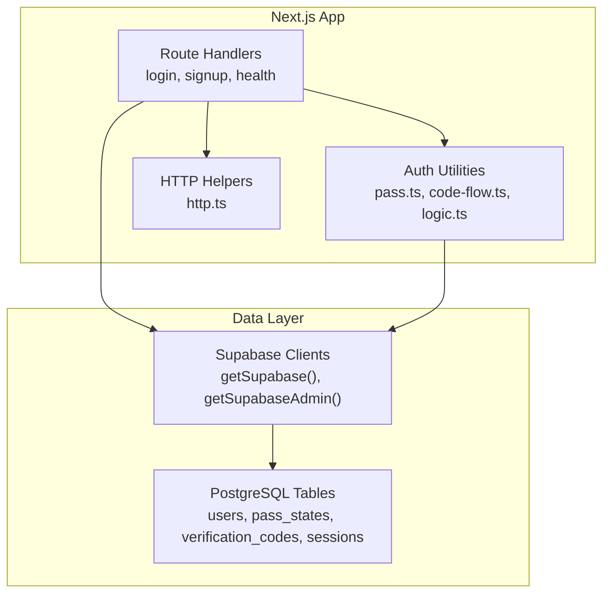
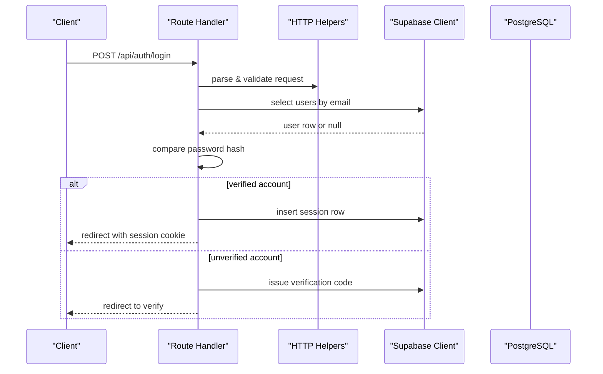
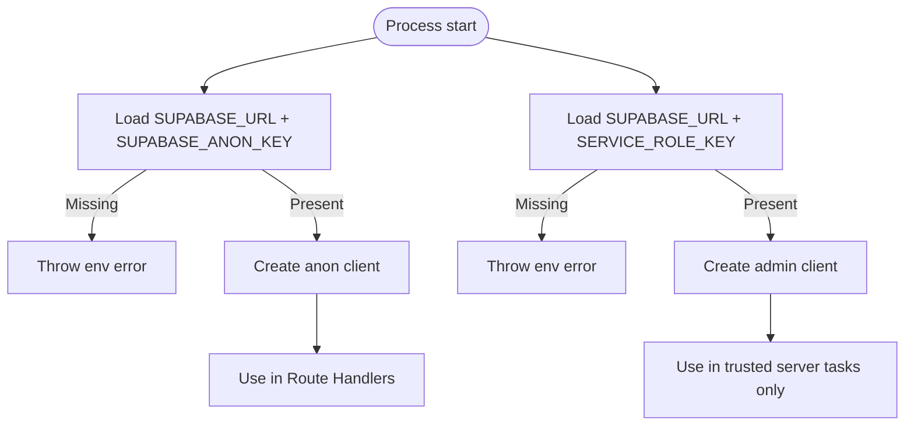
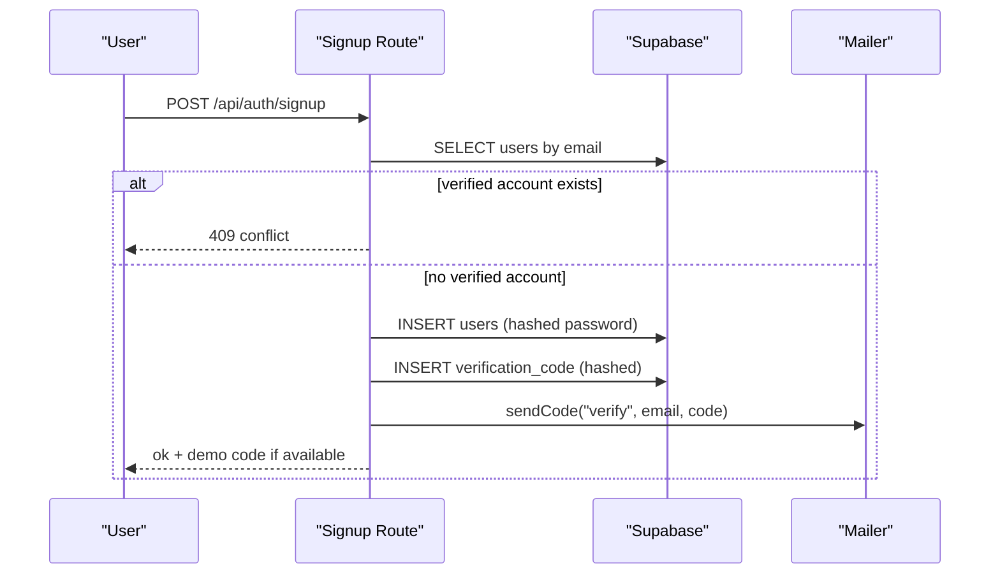
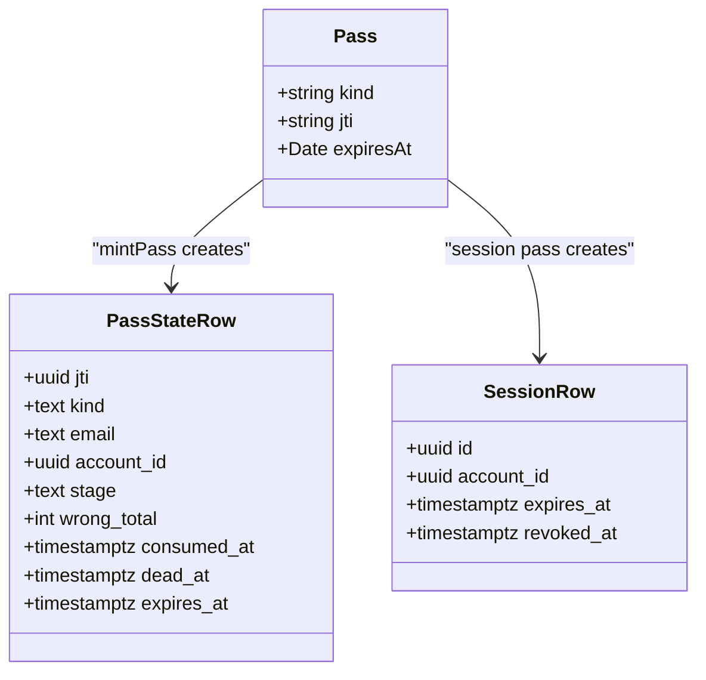
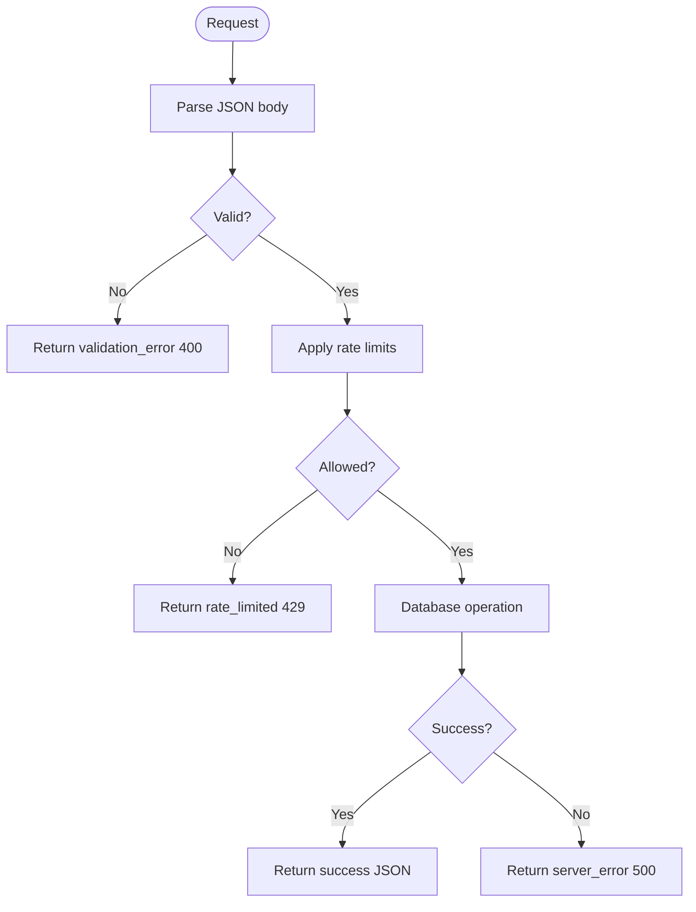
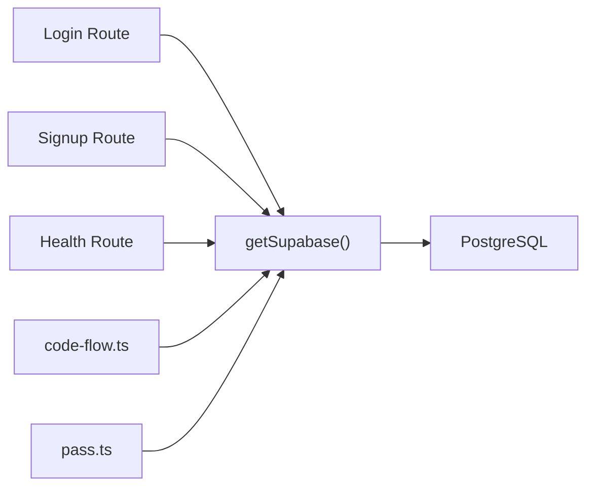

# Data Access Patterns

<cite>
**Referenced Files in This Document**
- [lib/supabase.ts](file://lib/supabase.ts)
- [app/api/health/route.ts](file://app/api/health/route.ts)
- [app/api/auth/login/route.ts](file://app/api/auth/login/route.ts)
- [app/api/auth/signup/route.ts](file://app/api/auth/signup/route.ts)
- [supabase/migrations/0002_auth.sql](file://supabase/migrations/0002_auth.sql)
- [lib/http.ts](file://lib/http.ts)
- [lib/auth/code-flow.ts](file://lib/auth/code-flow.ts)
- [lib/auth/pass.ts](file://lib/auth/pass.ts)
- [lib/auth/logic.ts](file://lib/auth/logic.ts)
- [specs/authentication/spec.md](file://specs/authentication/spec.md)
</cite>

## Table of Contents
1. [Introduction](#introduction)
2. [Project Structure](#project-structure)
3. [Core Components](#core-components)
4. [Architecture Overview](#architecture-overview)
5. [Detailed Component Analysis](#detailed-component-analysis)
6. [Dependency Analysis](#dependency-analysis)
7. [Performance Considerations](#performance-considerations)
8. [Troubleshooting Guide](#troubleshooting-guide)
9. [Conclusion](#conclusion)

## Introduction
This document explains Agropioo’s data access patterns built on Supabase using a dual client pattern: a per-request anon client for normal operations and an admin client reserved for trusted server-side maintenance tasks. It covers security boundaries, query strategies, error handling, transaction-like flows, caching considerations, performance monitoring, and troubleshooting database connectivity.

## Project Structure
Agropioo is a Next.js application that uses Route Handlers to perform all database operations server-side with Supabase. The key layers are:
- Client factories: centralized Supabase clients (anon and service-role).
- API routes: HTTP endpoints that validate input, enforce rate limits, and call Supabase.
- Auth utilities: pass minting/validation, code issuance, and session logic backed by Postgres tables defined in migrations.
- Shared helpers: uniform HTTP response builders and request parsing.

**Diagram sources**
- [lib/supabase.ts:14-46](file://lib/supabase.ts#L14-L46)
- [app/api/auth/login/route.ts:41-111](file://app/api/auth/login/route.ts#L41-L111)
- [app/api/auth/signup/route.ts:27-118](file://app/api/auth/signup/route.ts#L27-L118)
- [lib/auth/pass.ts:111-148](file://lib/auth/pass.ts#L111-L148)
- [lib/auth/code-flow.ts:15-42](file://lib/auth/code-flow.ts#L15-L42)
- [supabase/migrations/0002_auth.sql:7-60](file://supabase/migrations/0002_auth.sql#L7-L60)

**Section sources**
- [lib/supabase.ts:14-46](file://lib/supabase.ts#L14-L46)
- [app/api/auth/login/route.ts:41-111](file://app/api/auth/login/route.ts#L41-L111)
- [app/api/auth/signup/route.ts:27-118](file://app/api/auth/signup/route.ts#L27-L118)
- [supabase/migrations/0002_auth.sql:7-60](file://supabase/migrations/0002_auth.sql#L7-L60)

## Core Components
- Dual Supabase clients
  - Anon client: created per process with environment-based URL and anon key; used by route handlers for authenticated-by-RLS or policy-enforced queries.
  - Admin client: created with service role key; intended for trusted server-side maintenance only and bypasses RLS.
- Route handlers
  - Health check endpoint validates connectivity by performing a minimal read.
  - Authentication endpoints implement sign-up and login flows with validation, rate limiting, bcrypt hashing, and pass issuance.
- Auth utilities
  - Pass minting and validation: JWTs signed with HS256, state persisted in Postgres rows for mutable truth (consumed/dead/expired/revoked).
  - Code issuance: last-code-wins semantics, hashed storage, TTL enforcement.
  - Logic helpers: verdicts for codes and session liveness checks.
- HTTP helpers
  - Uniform error responses and JSON body parsing to standardize API contracts.

**Section sources**
- [lib/supabase.ts:14-46](file://lib/supabase.ts#L14-L46)
- [app/api/health/route.ts:3-16](file://app/api/health/route.ts#L3-L16)
- [app/api/auth/login/route.ts:41-111](file://app/api/auth/login/route.ts#L41-L111)
- [app/api/auth/signup/route.ts:27-118](file://app/api/auth/signup/route.ts#L27-L118)
- [lib/auth/pass.ts:111-148](file://lib/auth/pass.ts#L111-L148)
- [lib/auth/code-flow.ts:15-42](file://lib/auth/code-flow.ts#L15-L42)
- [lib/auth/logic.ts:52-69](file://lib/auth/logic.ts#L52-L69)
- [lib/http.ts:11-25](file://lib/http.ts#L11-L25)

## Architecture Overview
The system enforces strict separation between untrusted and privileged access paths:
- All user-facing requests go through Next.js Route Handlers.
- Route Handlers use the anon Supabase client to interact with tables protected by policies (or currently accessed server-side without RLS).
- Admin-only operations should use the service-role client from trusted server code only.

**Diagram sources**
- [app/api/auth/login/route.ts:41-111](file://app/api/auth/login/route.ts#L41-L111)
- [lib/auth/code-flow.ts:15-42](file://lib/auth/code-flow.ts#L15-L42)
- [lib/auth/pass.ts:111-148](file://lib/auth/pass.ts#L111-L148)
- [supabase/migrations/0002_auth.sql:7-60](file://supabase/migrations/0002_auth.sql#L7-L60)

## Detailed Component Analysis

### Dual Client Pattern and Security Boundaries
- Anon client
  - Created via a factory that caches a single instance per process.
  - Uses environment variables for URL and anon key; disables session persistence to avoid browser leakage in server contexts.
- Admin client
  - Uses service role key; explicitly documented as bypassing RLS and restricted to trusted server-side maintenance tasks.
- Environment safety
  - Missing required environment variables cause explicit errors at startup time to fail fast.

**Diagram sources**
- [lib/supabase.ts:6-12](file://lib/supabase.ts#L6-L12)
- [lib/supabase.ts:14-31](file://lib/supabase.ts#L14-L31)
- [lib/supabase.ts:38-46](file://lib/supabase.ts#L38-L46)

**Section sources**
- [lib/supabase.ts:6-12](file://lib/supabase.ts#L6-L12)
- [lib/supabase.ts:14-31](file://lib/supabase.ts#L14-L31)
- [lib/supabase.ts:38-46](file://lib/supabase.ts#L38-L46)

### Authentication Flows and Database Interactions
- Sign-up flow
  - Validates input, applies rate limits, checks for existing verified accounts (conflict), hashes password, inserts user, issues verification code, mints verify pass, sets cookie, sends code.
  - Handles concurrent duplicate emails with first-write-wins behavior.
- Login flow
  - Validates input, applies rate limits, looks up user by email, compares password with constant-time strategy for unknown emails, then either issues verify pass or session pass based on verification status.

**Diagram sources**
- [app/api/auth/signup/route.ts:27-118](file://app/api/auth/signup/route.ts#L27-L118)
- [lib/auth/code-flow.ts:15-42](file://lib/auth/code-flow.ts#L15-L42)
- [supabase/migrations/0002_auth.sql:7-60](file://supabase/migrations/0002_auth.sql#L7-L60)

**Section sources**
- [app/api/auth/signup/route.ts:27-118](file://app/api/auth/signup/route.ts#L27-L118)
- [app/api/auth/login/route.ts:41-111](file://app/api/auth/login/route.ts#L41-L111)
- [lib/auth/code-flow.ts:15-42](file://lib/auth/code-flow.ts#L15-L42)
- [supabase/migrations/0002_auth.sql:7-60](file://supabase/migrations/0002_auth.sql#L7-L60)

### Pass Management and Session State
- Pass types: verify, reset, session. Each has fixed TTLs and httpOnly cookies.
- Minting
  - Creates a signed JWT and persists a corresponding state row in Postgres for mutable truth (consumed/dead/expired/revoked).
- Validation
  - Verifies signature, type, expiry, and consults Postgres to ensure the row is live and bound to a valid account.
- Sessions
  - Session passes persist a row in sessions table; validity requires un-revoked and not expired.

**Diagram sources**
- [lib/auth/pass.ts:111-148](file://lib/auth/pass.ts#L111-L148)
- [lib/auth/pass.ts:150-194](file://lib/auth/pass.ts#L150-L194)
- [supabase/migrations/0002_auth.sql:19-60](file://supabase/migrations/0002_auth.sql#L19-L60)

**Section sources**
- [lib/auth/pass.ts:111-148](file://lib/auth/pass.ts#L111-L148)
- [lib/auth/pass.ts:150-194](file://lib/auth/pass.ts#L150-L194)
- [lib/auth/logic.ts:117-126](file://lib/auth/logic.ts#L117-L126)
- [supabase/migrations/0002_auth.sql:19-60](file://supabase/migrations/0002_auth.sql#L19-L60)

### Error Handling and Response Contract
- All failures return a consistent shape with a machine-readable code and human-friendly message.
- Validation errors never reach the database; they short-circuit early.
- Rate limiting returns a specific code when exceeded.
- Server errors are caught and normalized.

**Diagram sources**
- [lib/http.ts:11-25](file://lib/http.ts#L11-L25)
- [app/api/auth/signup/route.ts:27-118](file://app/api/auth/signup/route.ts#L27-L118)
- [app/api/auth/login/route.ts:41-111](file://app/api/auth/login/route.ts#L41-L111)

**Section sources**
- [lib/http.ts:11-25](file://lib/http.ts#L11-L25)
- [app/api/auth/signup/route.ts:27-118](file://app/api/auth/signup/route.ts#L27-L118)
- [app/api/auth/login/route.ts:41-111](file://app/api/auth/login/route.ts#L41-L111)

### Transaction-Like Workflows
While individual Supabase calls are atomic, multi-step workflows combine multiple writes atomically via application-level coordination:
- Sign-up: insert user, issue verification code, mint verify pass, set cookie, send code.
- Login: lookup user, compare password, mint session or verify pass, set/clear cookies.
- Code issuance: void outstanding codes before inserting a new one (last-code-wins).

These sequences rely on Postgres constraints and indexes to maintain consistency under concurrency.

**Section sources**
- [app/api/auth/signup/route.ts:52-113](file://app/api/auth/signup/route.ts#L52-L113)
- [lib/auth/code-flow.ts:15-42](file://lib/auth/code-flow.ts#L15-L42)
- [supabase/migrations/0002_auth.sql:7-60](file://supabase/migrations/0002_auth.sql#L7-L60)

### Query Optimization Strategies
- Select only needed columns (e.g., selecting minimal fields for lookups).
- Use unique indexes to prevent duplicates and speed up lookups (e.g., lowercased email index).
- Use `maybeSingle()` for expected-one-row queries to simplify control flow.
- Leverage purpose+email indexes for efficient code lookups.

**Section sources**
- [app/api/auth/login/route.ts:66-72](file://app/api/auth/login/route.ts#L66-L72)
- [app/api/auth/signup/route.ts:55-59](file://app/api/auth/signup/route.ts#L55-L59)
- [supabase/migrations/0002_auth.sql:17-17](file://supabase/migrations/0002_auth.sql#L17-L17)
- [supabase/migrations/0002_auth.sql:49-50](file://supabase/migrations/0002_auth.sql#L49-L50)

### Caching Strategies
- In-process rate limiter uses an in-memory Map keyed by scope and identifier; resets on redeploy/restart. Suitable for single-instance demos; consider Redis for multi-instance deployments.
- No application-level cache for frequently accessed data is present; reads go directly to Supabase. For high-frequency reads, consider adding a cache layer (e.g., Redis) with appropriate invalidation.

**Section sources**
- [lib/auth/rate-limit.ts:1-52](file://lib/auth/rate-limit.ts#L1-L52)

### Performance Monitoring
- Health endpoint provides a simple connectivity probe by querying a small result set.
- Add structured logging around critical steps (DB calls, pass minting, code issuance) to track latency and failure rates.
- Monitor Supabase connection metrics and query performance via your hosting dashboard.

**Section sources**
- [app/api/health/route.ts:3-16](file://app/api/health/route.ts#L3-L16)

## Dependency Analysis

**Diagram sources**
- [app/api/auth/login/route.ts:66-72](file://app/api/auth/login/route.ts#L66-L72)
- [app/api/auth/signup/route.ts:52-59](file://app/api/auth/signup/route.ts#L52-L59)
- [app/api/health/route.ts:3-16](file://app/api/health/route.ts#L3-L16)
- [lib/auth/code-flow.ts:15-42](file://lib/auth/code-flow.ts#L15-L42)
- [lib/auth/pass.ts:111-148](file://lib/auth/pass.ts#L111-L148)
- [lib/supabase.ts:14-46](file://lib/supabase.ts#L14-L46)

**Section sources**
- [lib/supabase.ts:14-46](file://lib/supabase.ts#L14-L46)
- [app/api/auth/login/route.ts:66-72](file://app/api/auth/login/route.ts#L66-L72)
- [app/api/auth/signup/route.ts:52-59](file://app/api/auth/signup/route.ts#L52-L59)
- [app/api/health/route.ts:3-16](file://app/api/health/route.ts#L3-L16)
- [lib/auth/code-flow.ts:15-42](file://lib/auth/code-flow.ts#L15-L42)
- [lib/auth/pass.ts:111-148](file://lib/auth/pass.ts#L111-L148)

## Performance Considerations
- Connection pooling
  - Supabase client instances are cached per process; each request reuses the same client, leveraging underlying connection pooling provided by the SDK/runtime.
- Query efficiency
  - Prefer targeted selects and leverage indexes (e.g., unique email index, purpose+email code index).
- Concurrency
  - First-write-wins for duplicate emails avoids race conditions; handle unique constraint violations gracefully.
- Rate limiting
  - In-process buckets protect against abuse; scale to distributed stores if running multiple instances.
- Caching
  - Introduce a cache for hot reads (e.g., user profiles) with invalidation on writes to reduce DB load.

[No sources needed since this section provides general guidance]

## Troubleshooting Guide
- Connectivity
  - Use the health endpoint to confirm Supabase connectivity and basic read/write capability.
- Environment configuration
  - Ensure SUPABASE_URL, SUPABASE_ANON_KEY, and JWT_SECRET are set; missing values will throw errors during client creation or pass signing.
- Authentication failures
  - Validate inputs early; ensure rate limits are not blocking legitimate traffic; check logs for server errors.
- Pass and session issues
  - Verify cookies are set correctly and tokens match expected kinds; ensure Postgres rows exist and are not consumed/dead/expired.
- Database schema mismatches
  - Confirm migrations have been applied; verify table structures match expectations in auth utilities.

**Section sources**
- [app/api/health/route.ts:3-16](file://app/api/health/route.ts#L3-L16)
- [lib/supabase.ts:6-12](file://lib/supabase.ts#L6-L12)
- [lib/auth/pass.ts:64-69](file://lib/auth/pass.ts#L64-L69)
- [supabase/migrations/0002_auth.sql:7-60](file://supabase/migrations/0002_auth.sql#L7-L60)

## Conclusion
Agropioo implements a robust data access layer centered on a dual Supabase client pattern, clear security boundaries, and standardized error handling. Authentication flows are backed by Postgres for mutable state, ensuring resilience and auditability. Query strategies and indexes optimize performance, while rate limiting protects endpoints. For production scaling, consider distributed rate limiting and application-level caching for hot data.