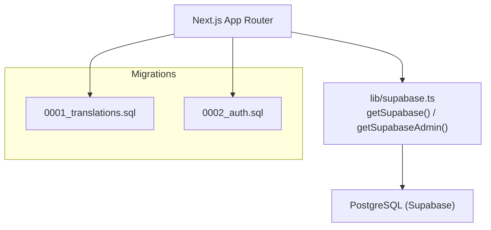
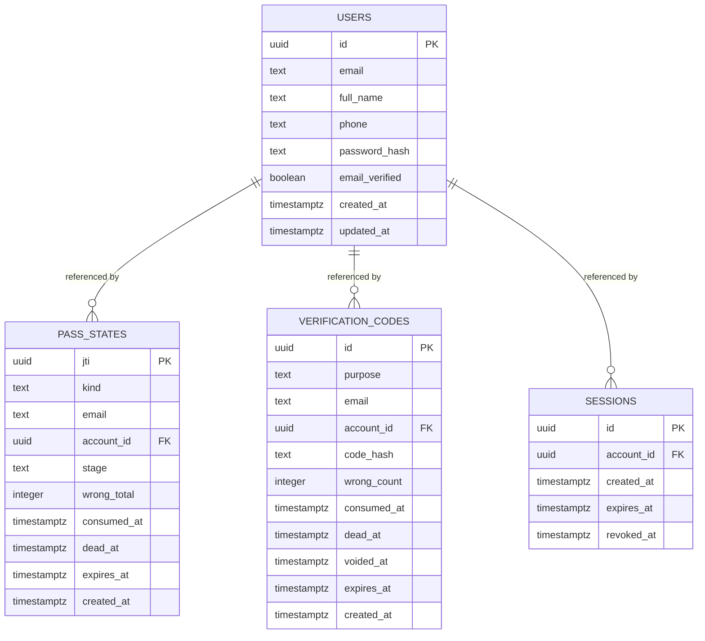
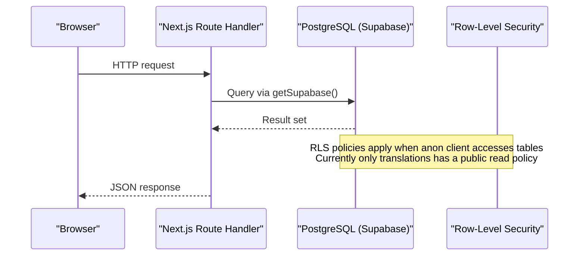
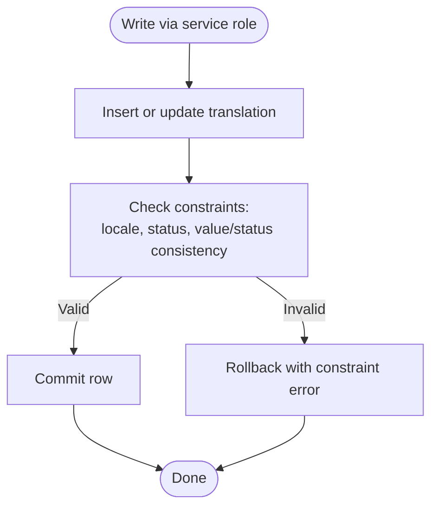
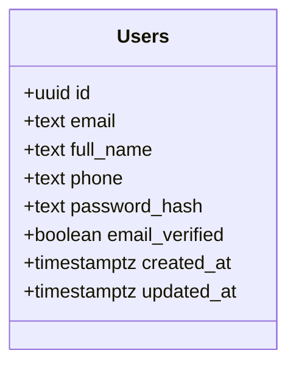
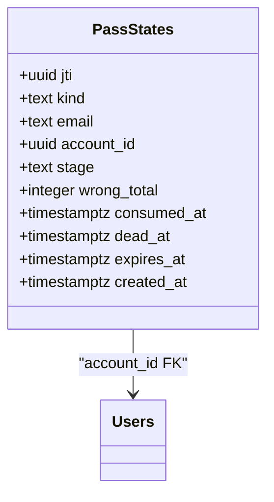
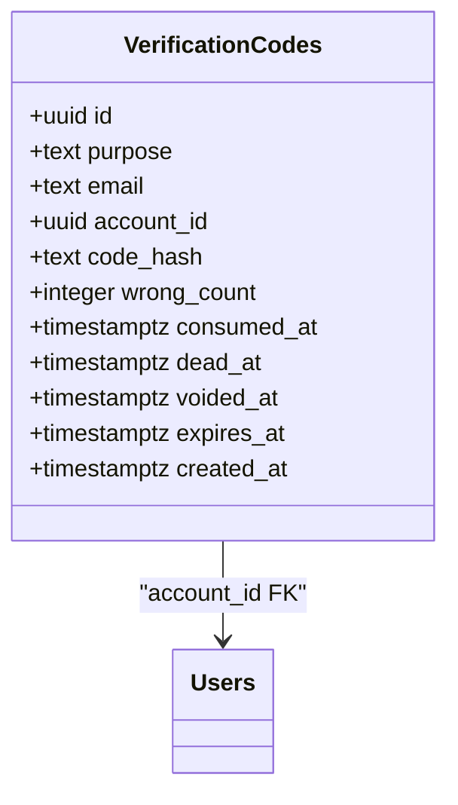
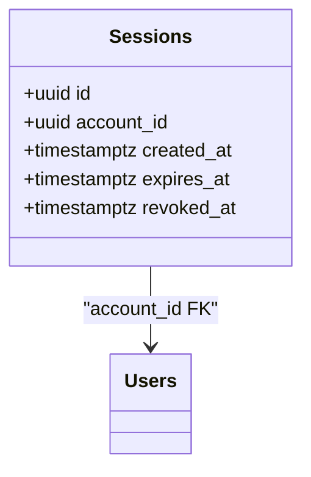
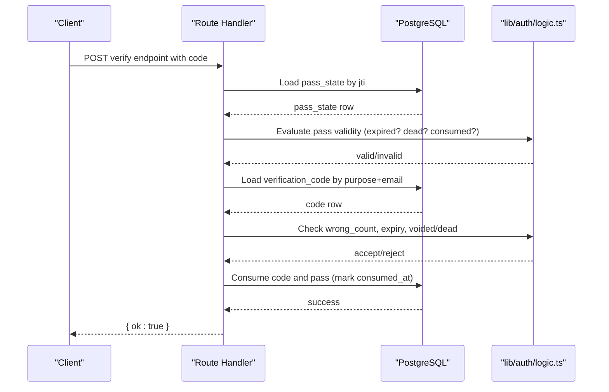
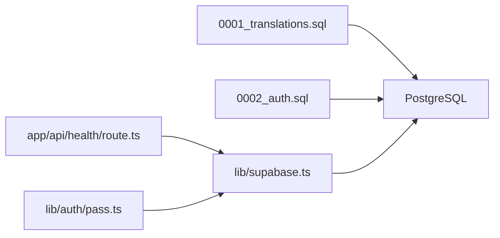

# Database Design

<cite>
**Referenced Files in This Document**
- [0001_translations.sql](file://supabase/migrations/0001_translations.sql)
- [0002_auth.sql](file://supabase/migrations/0002_auth.sql)
- [supabase.ts](file://lib/supabase.ts)
- [plan.md](file://specs/authentication/plan.md)
- [spec.md](file://specs/authentication/spec.md)
- [route.ts](file://app/api/health/route.ts)
- [pass.ts](file://lib/auth/pass.ts)
- [logic.ts](file://lib/auth/logic.ts)
</cite>

## Table of Contents
1. [Introduction](#introduction)
2. [Project Structure](#project-structure)
3. [Core Components](#core-components)
4. [Architecture Overview](#architecture-overview)
5. [Detailed Component Analysis](#detailed-component-analysis)
6. [Dependency Analysis](#dependency-analysis)
7. [Performance Considerations](#performance-considerations)
8. [Troubleshooting Guide](#troubleshooting-guide)
9. [Conclusion](#conclusion)
10. [Appendices](#appendices)

## Introduction
This document describes Agropioo’s PostgreSQL database design as implemented via Supabase migrations. It covers the current schema (translations, users, pass states, verification codes, sessions), field definitions, constraints, indexes, and relationships. It also documents data validation enforced at the database level, migration management with Supabase, data access patterns using a dual client approach, caching considerations, performance techniques, and security measures including row-level security and privacy controls for farmer data. Farm records are currently represented in the UI via demo data; the schema section focuses on the tables that exist in the database.

## Project Structure
The database is version-controlled under Supabase migrations:
- 0001_translations.sql defines the translations table used for i18n content.
- 0002_auth.sql defines authentication-related tables: users, pass_states, verification_codes, and sessions.

Data access is centralized through a shared Supabase client module that exposes both an anon client and a service-role admin client. Route handlers and server-side code use these clients to interact with the database.

**Diagram sources**
- [supabase.ts:14-46](file://lib/supabase.ts#L14-L46)
- [0001_translations.sql:7-31](file://supabase/migrations/0001_translations.sql#L7-L31)
- [0002_auth.sql:7-61](file://supabase/migrations/0002_auth.sql#L7-L61)

**Section sources**
- [0001_translations.sql:1-31](file://supabase/migrations/0001_translations.sql#L1-L31)
- [0002_auth.sql:1-61](file://supabase/migrations/0002_auth.sql#L1-L61)
- [supabase.ts:1-46](file://lib/supabase.ts#L1-L46)

## Core Components
This section summarizes each table’s purpose, fields, keys, indexes, and constraints.

- public.translations
  - Purpose: Stores localized strings per key and locale; supports missing vs translated status.
  - Primary key: composite (key, locale).
  - Constraints:
    - locale restricted to eight supported values.
    - status restricted to 'translated' or 'missing'.
    - value/status consistency enforced by check constraint.
  - Indexes: none beyond primary key.
  - Row-Level Security: enabled; public select policy allows anonymous reads.

- public.users
  - Purpose: Farmer accounts with email, name, optional phone, password hash, and verification flag.
  - Primary key: id (uuid).
  - Unique index: lowercased email for case-insensitive uniqueness.
  - Constraints: not-null on email, full_name, password_hash; default timestamps.

- public.pass_states
  - Purpose: Tracks state of issued JWT passes (verify/reset) keyed by jti; holds mutable truth like consumed/dead/stage/wrong totals.
  - Primary key: jti (uuid).
  - Foreign key: account_id references users(id).
  - Constraints: kind in ('verify','reset'), stage in ('pending','code_verified').

- public.verification_codes
  - Purpose: Stores hashed verification codes with lifecycle markers (consumed, dead, voided, expired).
  - Primary key: id (uuid).
  - Foreign key: account_id references users(id).
  - Constraints: purpose in ('verify','reset'); wrong_count tracks attempts; last-code-wins via voided_at.
  - Index: optimized lookup by (purpose, email, created_at desc).

- public.sessions
  - Purpose: Persistent session rows tied to user accounts; survive restarts; support logout revocation.
  - Primary key: id (uuid).
  - Foreign key: account_id references users(id).
  - Index: sessions_account_idx on account_id.

**Diagram sources**
- [0002_auth.sql:7-61](file://supabase/migrations/0002_auth.sql#L7-L61)

**Section sources**
- [0002_auth.sql:7-61](file://supabase/migrations/0002_auth.sql#L7-L61)

## Architecture Overview
Agropioo uses a Postgres-only Supabase setup without the hosted Auth system. All authentication flows go through Next.js Route Handlers that call the Supabase client server-side. The dual client pattern provides:
- An anon client for normal operations (with RLS policies where applicable).
- A service-role admin client for trusted server-side maintenance tasks that bypass RLS.

Current RLS posture:
- translations: RLS enabled with a public read policy.
- auth tables: no RLS yet because all access is server-side via Route Handlers using the anon key.

**Diagram sources**
- [supabase.ts:14-46](file://lib/supabase.ts#L14-L46)
- [0001_translations.sql:25-31](file://supabase/migrations/0001_translations.sql#L25-L31)
- [0002_auth.sql:1-6](file://supabase/migrations/0002_auth.sql#L1-L6)

**Section sources**
- [supabase.ts:14-46](file://lib/supabase.ts#L14-L46)
- [0001_translations.sql:25-31](file://supabase/migrations/0001_translations.sql#L25-L31)
- [0002_auth.sql:1-6](file://supabase/migrations/0002_auth.sql#L1-L6)

## Detailed Component Analysis

### Translations table
- Fields: key, locale, value, status, updated_at.
- Constraints:
  - locale must be one of eight supported locales.
  - status must be 'translated' or 'missing'.
  - value/status consistency enforced by a check constraint.
- RLS: enabled; public select policy allows anonymous reads.
- Use cases: marketing copy and future app strings; writes via service role only.

**Diagram sources**
- [0001_translations.sql:7-23](file://supabase/migrations/0001_translations.sql#L7-L23)

**Section sources**
- [0001_translations.sql:7-31](file://supabase/migrations/0001_translations.sql#L7-L31)

### Users table
- Fields: id (PK), email (unique index on lower(email)), full_name, phone, password_hash, email_verified, created_at, updated_at.
- Constraints: not-null on core identity fields; default timestamps.
- Security: password_hash stored; plaintext never persisted.

**Diagram sources**
- [0002_auth.sql:7-17](file://supabase/migrations/0002_auth.sql#L7-L17)

**Section sources**
- [0002_auth.sql:7-17](file://supabase/migrations/0002_auth.sql#L7-L17)

### Pass states table
- Fields: jti (PK), kind, email, account_id (FK to users), stage, wrong_total, consumed_at, dead_at, expires_at, created_at.
- Constraints: kind in ('verify','reset'), stage in ('pending','code_verified').
- Role: State-backed JWT tracking; ensures single-use consumption, cumulative wrong attempt caps, and reset-stage gating.

**Diagram sources**
- [0002_auth.sql:19-32](file://supabase/migrations/0002_auth.sql#L19-L32)

**Section sources**
- [0002_auth.sql:19-32](file://supabase/migrations/0002_auth.sql#L19-L32)

### Verification codes table
- Fields: id (PK), purpose, email, account_id (FK to users), code_hash, wrong_count, consumed_at, dead_at, voided_at, expires_at, created_at.
- Constraints: purpose in ('verify','reset'); wrong_count increments on failed attempts; last-code-wins via voided_at.
- Index: optimized lookup by (purpose, email, created_at desc).

**Diagram sources**
- [0002_auth.sql:34-50](file://supabase/migrations/0002_auth.sql#L34-L50)

**Section sources**
- [0002_auth.sql:34-50](file://supabase/migrations/0002_auth.sql#L34-L50)

### Sessions table
- Fields: id (PK), account_id (FK to users), created_at, expires_at, revoked_at.
- Index: sessions_account_idx on account_id.
- Role: Persistent sessions survive restarts; logout sets revoked_at to invalidate the session.

**Diagram sources**
- [0002_auth.sql:52-61](file://supabase/migrations/0002_auth.sql#L52-L61)

**Section sources**
- [0002_auth.sql:52-61](file://supabase/migrations/0002_auth.sql#L52-L61)

### Data flow: verifying a pass and code

**Diagram sources**
- [pass.ts:150-194](file://lib/auth/pass.ts#L150-L194)
- [logic.ts:112-126](file://lib/auth/logic.ts#L112-L126)
- [0002_auth.sql:19-50](file://supabase/migrations/0002_auth.sql#L19-L50)

**Section sources**
- [pass.ts:150-194](file://lib/auth/pass.ts#L150-L194)
- [logic.ts:112-126](file://lib/auth/logic.ts#L112-L126)
- [0002_auth.sql:19-50](file://supabase/migrations/0002_auth.sql#L19-L50)

## Dependency Analysis
- Migrations define schema; application code depends on these tables.
- lib/supabase.ts provides two clients:
  - getSupabase(): anon client used by route handlers.
  - getSupabaseAdmin(): service-role client for privileged tasks (e.g., translations sync).
- Route handler health check demonstrates basic connectivity to the users table.

**Diagram sources**
- [0001_translations.sql:7-31](file://supabase/migrations/0001_translations.sql#L7-L31)
- [0002_auth.sql:7-61](file://supabase/migrations/0002_auth.sql#L7-L61)
- [supabase.ts:14-46](file://lib/supabase.ts#L14-L46)
- [route.ts:1-17](file://app/api/health/route.ts#L1-L17)
- [pass.ts:150-194](file://lib/auth/pass.ts#L150-L194)

**Section sources**
- [supabase.ts:14-46](file://lib/supabase.ts#L14-L46)
- [route.ts:1-17](file://app/api/health/route.ts#L1-L17)
- [pass.ts:150-194](file://lib/auth/pass.ts#L150-L194)

## Performance Considerations
- Indexing strategy:
  - users_email_lower_idx enables fast, case-insensitive lookups by email.
  - codes_lookup_idx optimizes recent code retrieval per purpose and email.
  - sessions_account_idx accelerates session queries by account.
- Query patterns:
  - Prefer targeted selects (e.g., maybeSingle) to minimize payload size.
  - Use server-side guards to avoid unnecessary DB calls when invalid tokens are presented.
- Caching considerations:
  - In-memory rate limiting is used for auth endpoints; it resets on redeploy/restart (acceptable for single-instance demo).
  - For frequently accessed non-sensitive data (e.g., translations), consider server-side caching layers or Next.js caching primitives to reduce DB load.
- Optimization opportunities:
  - Add composite indexes if new query patterns emerge (e.g., filtering by account_id and timestamps).
  - Ensure connection pooling and query timeouts are tuned in Supabase settings.

[No sources needed since this section provides general guidance]

## Troubleshooting Guide
- Connectivity issues:
  - Use the health endpoint to validate DB connectivity via the anon client.
- Authentication failures:
  - Verify pass and code lifecycles: check consumed_at, dead_at, voided_at, expires_at.
  - Confirm wrong_count thresholds and pass wrong_total limits.
  - Ensure email normalization (lowercase) matches unique index behavior.
- RLS errors:
  - Only translations currently has RLS enabled; ensure service-role client is used for privileged writes.

**Section sources**
- [route.ts:1-17](file://app/api/health/route.ts#L1-L17)
- [0001_translations.sql:25-31](file://supabase/migrations/0001_translations.sql#L25-L31)
- [0002_auth.sql:19-50](file://supabase/migrations/0002_auth.sql#L19-L50)

## Conclusion
Agropioo’s database schema centers on secure, state-backed authentication with clear constraints and indexes to enforce business rules at the database layer. The dual client pattern separates privileged and unprivileged access, while RLS is selectively applied. Future enhancements should include RLS for auth tables, explicit farm records schema, and additional indexes aligned with query patterns. Migration files provide a clear, versioned history of schema changes.

[No sources needed since this section summarizes without analyzing specific files]

## Appendices

### Migration Management and Rollbacks
- Migrations are SQL files under supabase/migrations:
  - 0001_translations.sql
  - 0002_auth.sql
- Version control: commit migration files alongside application changes; apply via Supabase CLI or dashboard.
- Rollback procedures:
  - Create a new migration that reverses changes (drop tables/columns, remove policies/indexes).
  - Avoid destructive rollbacks in production without backups; test rollback scripts in staging first.

**Section sources**
- [0001_translations.sql:1-31](file://supabase/migrations/0001_translations.sql#L1-L31)
- [0002_auth.sql:1-61](file://supabase/migrations/0002_auth.sql#L1-L61)

### Data Access Patterns and Dual Client Usage
- getSupabase(): anon client for normal requests; respects RLS policies.
- getSupabaseAdmin(): service-role client for trusted server-side tasks; bypasses RLS.
- Example usage:
  - Health endpoint queries users via anon client to confirm connectivity.
  - Auth logic loads pass_states and sessions via anon client within route handlers.

**Section sources**
- [supabase.ts:14-46](file://lib/supabase.ts#L14-L46)
- [route.ts:1-17](file://app/api/health/route.ts#L1-L17)
- [pass.ts:150-194](file://lib/auth/pass.ts#L150-L194)

### Security and Privacy Notes
- Passwords: stored as hashes; plaintext never persisted.
- Codes: stored as SHA-256 hashes; last-code-wins via voided_at; wrong entry caps enforced.
- RLS: enabled for translations with public read policy; auth tables currently accessed server-side without RLS.
- Privacy: minimal exposure of account existence; generic errors prevent enumeration.

**Section sources**
- [0002_auth.sql:7-50](file://supabase/migrations/0002_auth.sql#L7-L50)
- [0001_translations.sql:25-31](file://supabase/migrations/0001_translations.sql#L25-L31)
- [spec.md:26-93](file://specs/authentication/spec.md#L26-L93)