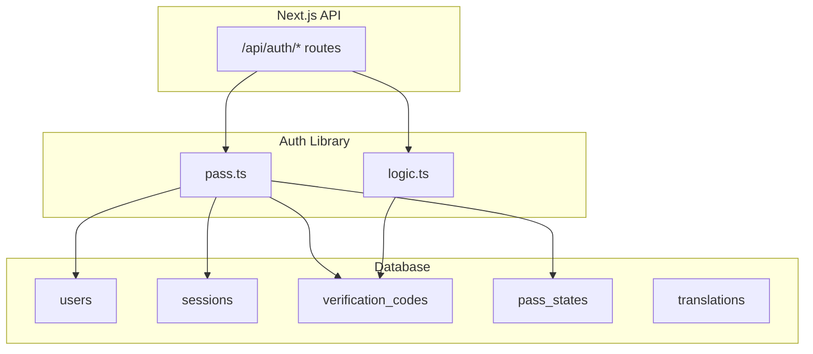
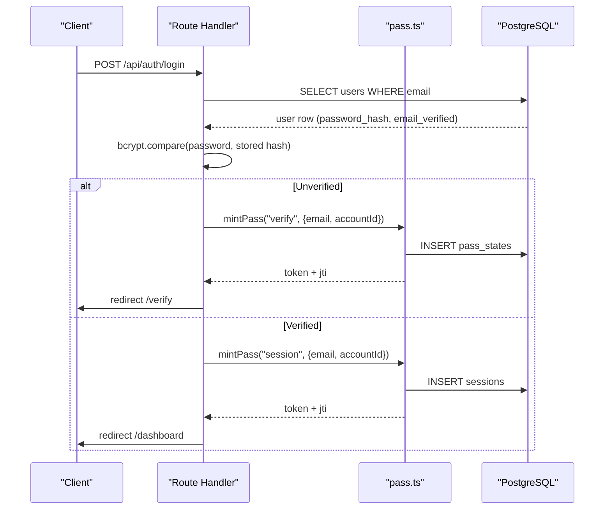
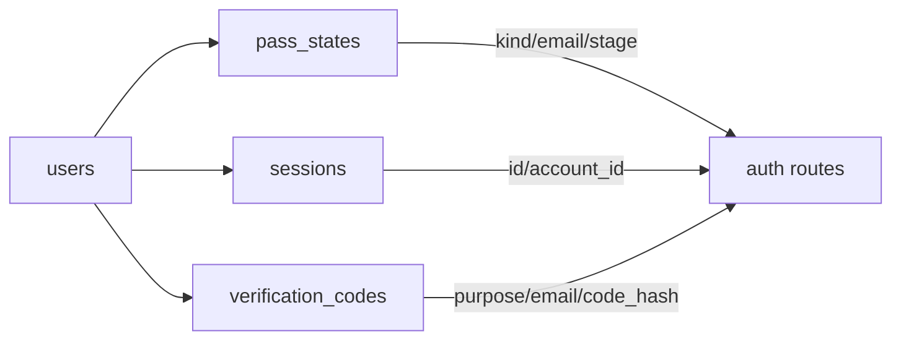

# Database Schema

<cite>
**Referenced Files in This Document**
- [0002_auth.sql](file://supabase/migrations/0002_auth.sql)
- [0001_translations.sql](file://supabase/migrations/0001_translations.sql)
- [pass.ts](file://lib/auth/pass.ts)
- [logic.ts](file://lib/auth/logic.ts)
- [route.ts (login)](file://app/api/auth/login/route.ts)
- [route.ts (signup)](file://app/api/auth/signup/route.ts)
- [route.ts (forgot-password)](file://app/api/auth/forgot-password/route.ts)
- [route.ts (logout)](file://app/api/auth/logout/route.ts)
- [plan.md](file://specs/authentication/plan.md)
</cite>

## Table of Contents
1. [Introduction](#introduction)
2. [Project Structure](#project-structure)
3. [Core Components](#core-components)
4. [Architecture Overview](#architecture-overview)
5. [Detailed Component Analysis](#detailed-component-analysis)
6. [Dependency Analysis](#dependency-analysis)
7. [Performance Considerations](#performance-considerations)
8. [Troubleshooting Guide](#troubleshooting-guide)
9. [Conclusion](#conclusion)

## Introduction
This document describes Agropioo’s PostgreSQL database schema used by the JWT-based authentication system. It covers the users, sessions, verification_codes, and pass_states tables, including field definitions, constraints, indexes, primary keys, foreign keys, and how these tables participate in authentication flows such as login, signup, password reset, and logout. It also explains security-sensitive fields like password_hash and code_hash and their storage characteristics.

## Project Structure
The authentication-related database schema is defined in Supabase migrations under supabase/migrations. The runtime logic that reads/writes these tables lives in Next.js Route Handlers and shared libraries for token handling and pure decision logic.

**Diagram sources**
- [0002_auth.sql:7-61](file://supabase/migrations/0002_auth.sql#L7-L61)
- [0001_translations.sql:7-31](file://supabase/migrations/0001_translations.sql#L7-L31)
- [pass.ts:106-148](file://lib/auth/pass.ts#L106-L148)
- [logic.ts:21-29](file://lib/auth/logic.ts#L21-L29)

**Section sources**
- [0002_auth.sql:1-61](file://supabase/migrations/0002_auth.sql#L1-L61)
- [0001_translations.sql:1-31](file://supabase/migrations/0001_translations.sql#L1-L31)

## Core Components
- users: Stores account identity and credentials.
- sessions: Tracks active session tokens with revocation support.
- verification_codes: Stores hashed one-time codes for email verification and password reset.
- pass_states: Tracks stateful JWT passes (verify/reset) with lifecycle and attempt accounting.
- translations: Multilingual content catalog (not part of auth but present in the same schema).

Key design points:
- All identifiers are UUIDs generated server-side.
- Sensitive values are stored as hashes; plaintext codes and passwords never persist.
- Time-based validity enforced via timestamptz columns and application checks.
- Indexes optimize lookups by email and purpose.

**Section sources**
- [0002_auth.sql:7-61](file://supabase/migrations/0002_auth.sql#L7-L61)
- [pass.ts:16-28](file://lib/auth/pass.ts#L16-L28)
- [logic.ts:7-10](file://lib/auth/logic.ts#L7-L10)

## Architecture Overview
The authentication system uses state-backed JWTs. Each pass (verify, reset, session) is a signed HS256 JWT whose jti maps to a row in pass_states or sessions. Validation verifies signature, type, expiry, and then consults the corresponding DB row for mutable truth (consumed/dead/expired/revoked).

**Diagram sources**
- [route.ts (login):41-106](file://app/api/auth/login/route.ts#L41-L106)
- [pass.ts:106-148](file://lib/auth/pass.ts#L106-L148)
- [0002_auth.sql:7-61](file://supabase/migrations/0002_auth.sql#L7-L61)

## Detailed Component Analysis

### Table: users
Purpose: Central account entity storing identity and credential material.

- Primary key: id (uuid, default gen_random_uuid())
- Fields:
  - email: text, not null
  - full_name: text, not null
  - phone: text, nullable
  - password_hash: text, not null (bcrypt hash)
  - email_verified: boolean, not null, default false
  - created_at: timestamptz, not null, default now()
  - updated_at: timestamptz, not null, default now()
- Constraints:
  - Unique lookup on lower(email) via index users_email_lower_idx
- Security notes:
  - password_hash stores bcrypt output; never store plaintext passwords
  - Email uniqueness is enforced via index on lowercased email

Usage highlights:
- Login route compares provided password against password_hash using bcrypt.
- Signup inserts new users with hashed password and issues verification flow.

**Section sources**
- [0002_auth.sql:7-17](file://supabase/migrations/0002_auth.sql#L7-L17)
- [route.ts (login):66-81](file://app/api/auth/login/route.ts#L66-L81)
- [route.ts (signup):70-81](file://app/api/auth/signup/route.ts#L70-L81)

### Table: pass_states
Purpose: Mutable state for verify/reset JWT passes keyed by jti. Tracks stage, wrong attempts, consumption, and expiration.

- Primary key: jti (uuid, equals JWT jti)
- Fields:
  - kind: text, check ('verify' | 'reset')
  - email: text, not null
  - account_id: uuid references users(id), nullable until reset binds at code verification
  - stage: text, not null, default 'pending', check ('pending' | 'code_verified')
  - wrong_total: integer, not null, default 0
  - consumed_at: timestamptz, nullable
  - dead_at: timestamptz, nullable
  - expires_at: timestamptz, not null
  - created_at: timestamptz, not null, default now()
- Relationships:
  - account_id → users(id)
- Security notes:
  - wrong_total accumulates across resends to enforce cumulative attempt limits
  - Stage gating ensures reset requires code verification before use

Usage highlights:
- mintPass("verify"/"reset") inserts a row with kind and expires_at.
- readValidPass validates signature/type and checks row is live (not consumed/dead/expired) and email matches.

**Section sources**
- [0002_auth.sql:19-32](file://supabase/migrations/0002_auth.sql#L19-L32)
- [pass.ts:106-148](file://lib/auth/pass.ts#L106-L148)
- [pass.ts:150-174](file://lib/auth/pass.ts#L150-L174)

### Table: verification_codes
Purpose: Stores hashed one-time codes for email verification and password reset with isolation by purpose and last-code-wins semantics.

- Primary key: id (uuid, default gen_random_uuid())
- Fields:
  - purpose: text, not null, check ('verify' | 'reset')
  - email: text, not null
  - account_id: uuid references users(id)
  - code_hash: text, not null (SHA-256 hex of the code)
  - wrong_count: integer, not null, default 0
  - consumed_at: timestamptz, nullable
  - dead_at: timestamptz, nullable (killed after 5 wrong entries)
  - voided_at: timestamptz, nullable (superseded by newer code)
  - expires_at: timestamptz, not null (issued_at + 10 minutes)
  - created_at: timestamptz, not null, default now()
- Indexes:
  - codes_lookup_idx on (purpose, email, created_at desc) for latest-code-wins queries
- Relationships:
  - account_id → users(id)
- Security notes:
  - Only code_hash is stored; plaintext codes never persisted
  - Purpose isolation prevents cross-flow misuse between verify and reset

Usage highlights:
- issueVerificationCode generates a random 6-digit code, hashes it, marks prior codes voided, and inserts a new row.
- Verification logic checks latest non-voided code, enforces TTL and wrong-count limits.

**Section sources**
- [0002_auth.sql:34-50](file://supabase/migrations/0002_auth.sql#L34-L50)
- [logic.ts:21-29](file://lib/auth/logic.ts#L21-L29)
- [logic.ts:52-69](file://lib/auth/logic.ts#L52-L69)

### Table: sessions
Purpose: Persistent session records tied to a user account; supports per-session revocation.

- Primary key: id (uuid, equals session JWT jti)
- Fields:
  - account_id: uuid not null references users(id)
  - created_at: timestamptz, not null, default now()
  - expires_at: timestamptz, not null
  - revoked_at: timestamptz, nullable
- Indexes:
  - sessions_account_idx on account_id
- Relationships:
  - account_id → users(id)
- Security notes:
  - Logout sets revoked_at to invalidate the specific session cookie even if copied

Usage highlights:
- mintPass("session") inserts a session row with expires_at.
- readValidPass("session") checks row is un-revoked and not expired, then confirms account exists.
- Logout route updates revoked_at for the current session.

**Section sources**
- [0002_auth.sql:52-61](file://supabase/migrations/0002_auth.sql#L52-L61)
- [pass.ts:176-194](file://lib/auth/pass.ts#L176-L194)
- [route.ts (logout):10-25](file://app/api/auth/logout/route.ts#L10-L25)

### Table: translations
Purpose: Multilingual content catalog supporting multiple locales. Not part of auth but included in the schema.

- Primary key: composite (key, locale)
- Fields:
  - key: text, not null
  - locale: text, not null, constrained to supported locales
  - value: text, nullable; required when status = 'translated'
  - status: text, not null, default 'translated', check ('translated' | 'missing')
  - updated_at: timestamptz, not null, default now()
- Policies:
  - Row-level security enabled; public select policy allows reading marketing copy

**Section sources**
- [0001_translations.sql:7-31](file://supabase/migrations/0001_translations.sql#L7-L31)

### Data Model Diagram

```mermaid
erDiagram
USERS {
uuid id PK
text email
text full_name
text phone
text password_hash
boolean email_verified
timestamptz created_at
timestamptz updated_at
}
PASS_STATES {
uuid jti PK
text kind
text email
uuid account_id FK
text stage
integer wrong_total
timestamptz consumed_at
timestamptz dead_at
timestamptz expires_at
timestamptz created_at
}
VERIFICATION_CODES {
uuid id PK
text purpose
text email
uuid account_id FK
text code_hash
integer wrong_count
timestamptz consumed_at
timestamptz dead_at
timestamptz voided_at
timestamptz expires_at
timestamptz created_at
}
SESSIONS {
uuid id PK
uuid account_id FK
timestamptz created_at
timestamptz expires_at
timestamptz revoked_at
}
USERS ||--o{ PASS_STATES : "account_id"
USERS ||--o{ VERIFICATION_CODES : "account_id"
USERS ||--o{ SESSIONS : "account_id"
```

**Diagram sources**
- [0002_auth.sql:7-61](file://supabase/migrations/0002_auth.sql#L7-L61)

## Dependency Analysis
- pass.ts depends on PostgreSQL tables pass_states and sessions to persist and validate pass lifecycles.
- login/signup/forgot-password routes depend on users table for credential verification and account existence.
- logic.ts provides pure functions for code hashing, generation, and verdicts used by code issuance and verification flows.
- Foreign keys ensure referential integrity between pass_states, verification_codes, sessions, and users.

**Diagram sources**
- [0002_auth.sql:7-61](file://supabase/migrations/0002_auth.sql#L7-L61)
- [pass.ts:106-194](file://lib/auth/pass.ts#L106-L194)
- [route.ts (login):41-106](file://app/api/auth/login/route.ts#L41-L106)
- [route.ts (signup):27-113](file://app/api/auth/signup/route.ts#L27-L113)
- [route.ts (forgot-password):21-73](file://app/api/auth/forgot-password/route.ts#L21-L73)

**Section sources**
- [0002_auth.sql:7-61](file://supabase/migrations/0002_auth.sql#L7-L61)
- [pass.ts:106-194](file://lib/auth/pass.ts#L106-L194)
- [route.ts (login):41-106](file://app/api/auth/login/route.ts#L41-L106)
- [route.ts (signup):27-113](file://app/api/auth/signup/route.ts#L27-L113)
- [route.ts (forgot-password):21-73](file://app/api/auth/forgot-password/route.ts#L21-L73)

## Performance Considerations
- Indexes:
  - users_email_lower_idx optimizes case-insensitive email lookups during login/signup.
  - codes_lookup_idx accelerates latest-code-wins queries by (purpose, email, created_at desc).
  - sessions_account_idx speeds up per-account session queries.
- Time-based checks:
  - Expiration enforced via timestamptz comparisons in pass validation and session activity checks.
- Write patterns:
  - Last-code-wins avoids long scans by marking prior codes voided_at on new issuance.
- Memory/CPU:
  - bcrypt cost tuned for balance between security and latency; constant-time dummy compare mitigates timing leaks.

[No sources needed since this section provides general guidance]

## Troubleshooting Guide
Common issues and where to inspect:
- Invalid or expired pass:
  - Verify JWT signature/type/expiry and ensure corresponding pass_states/sessions row is live and not consumed/dead/expired.
  - Check pass.ts decode and loadLive* functions.
- Session not invalidated on logout:
  - Ensure revoked_at is set for the session id matching the cookie’s jti.
  - Inspect logout route update query.
- Code verification failures:
  - Confirm code_hash matches SHA-256 of submitted code.
  - Check wrong_count thresholds and dead_at flags.
  - Validate latest-code-wins behavior via voided_at and created_at ordering.
- Duplicate email conflicts:
  - Signup handles first-write-wins on conflict; ensure error code mapping for unique violation.

**Section sources**
- [pass.ts:72-89](file://lib/auth/pass.ts#L72-L89)
- [pass.ts:150-194](file://lib/auth/pass.ts#L150-L194)
- [route.ts (logout):10-25](file://app/api/auth/logout/route.ts#L10-L25)
- [logic.ts:52-93](file://lib/auth/logic.ts#L52-L93)
- [route.ts (signup):70-102](file://app/api/auth/signup/route.ts#L70-L102)

## Conclusion
Agropioo’s authentication schema centers on four core tables—users, pass_states, verification_codes, and sessions—augmented by indexes and constraints that enforce data integrity and performance. Security-sensitive fields are stored as hashes (password_hash via bcrypt, code_hash via SHA-256), ensuring no plaintext secrets persist. The state-backed JWT model couples cryptographic tokens with durable rows to enable robust features like per-pass attempt accounting, last-code-wins semantics, and per-session revocation. Together, these components provide a secure, auditable foundation for login, signup, password reset, and session management.