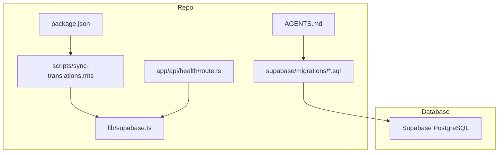
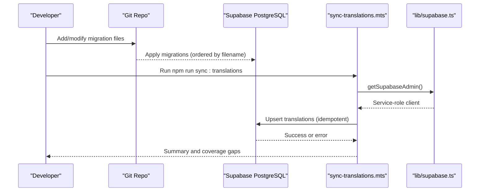
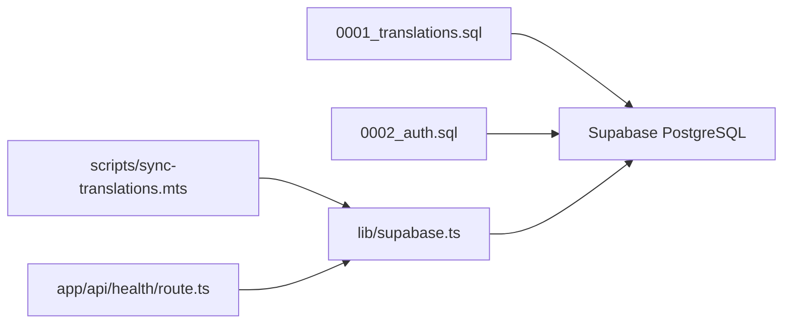

# Migration Management

<cite>
**Referenced Files in This Document**
- [0001_translations.sql](file://supabase/migrations/0001_translations.sql)
- [0002_auth.sql](file://supabase/migrations/0002_auth.sql)
- [supabase.ts](file://lib/supabase.ts)
- [sync-translations.mts](file://scripts/sync-translations.mts)
- [package.json](file://package.json)
- [route.ts (health)](file://app/api/health/route.ts)
- [AGENTS.md](file://AGENTS.md)
</cite>

## Table of Contents
1. [Introduction](#introduction)
2. [Project Structure](#project-structure)
3. [Core Components](#core-components)
4. [Architecture Overview](#architecture-overview)
5. [Detailed Component Analysis](#detailed-component-analysis)
6. [Dependency Analysis](#dependency-analysis)
7. [Performance Considerations](#performance-considerations)
8. [Troubleshooting Guide](#troubleshooting-guide)
9. [Conclusion](#conclusion)
10. [Appendices](#appendices)

## Introduction
This document explains how Supabase migrations are managed in Agropioo, focusing on the migration file naming convention, version control strategy for schema changes, and deployment procedures. It also covers how migrations are applied to the Supabase PostgreSQL database, rollback strategies for failed migrations, and best practices for maintaining backward compatibility. Examples include creating new migrations, handling schema evolution, managing database state across environments, testing strategies, and debugging techniques for schema changes.

## Project Structure
Agropioo stores all database schema changes as SQL migration files under a single directory. The project enforces that schema changes live in this directory and are applied in order. A shared client module provides both anon and service-role access to the database, while scripts use the service role for privileged operations like syncing translation data.

**Diagram sources**
- [0001_translations.sql:1-31](file://supabase/migrations/0001_translations.sql#L1-L31)
- [0002_auth.sql:1-61](file://supabase/migrations/0002_auth.sql#L1-L61)
- [supabase.ts:1-47](file://lib/supabase.ts#L1-L47)
- [sync-translations.mts:1-74](file://scripts/sync-translations.mts#L1-L74)
- [route.ts (health):1-17](file://app/api/health/route.ts#L1-L17)
- [package.json:1-38](file://package.json#L1-L38)
- [AGENTS.md:45-46](file://AGENTS.md#L45-L46)

**Section sources**
- [AGENTS.md:45-46](file://AGENTS.md#L45-L46)
- [package.json:5-12](file://package.json#L5-L12)

## Core Components
- Migration files: Each change is a single SQL file with an ordered numeric prefix.
- Database clients: A shared module exposes anon and service-role clients with environment-based configuration.
- Data sync script: An idempotent upsert process populates the translations table from typed catalogs using the service role.
- Health check endpoint: Validates connectivity to the database by querying a known table.

Key responsibilities:
- Migrations define schema structure and constraints.
- Clients enforce secure access boundaries (anon vs service role).
- Scripts maintain data consistency and coverage metrics.
- Endpoints verify runtime connectivity.

**Section sources**
- [0001_translations.sql:7-31](file://supabase/migrations/0001_translations.sql#L7-L31)
- [0002_auth.sql:7-61](file://supabase/migrations/0002_auth.sql#L7-L61)
- [supabase.ts:14-46](file://lib/supabase.ts#L14-L46)
- [sync-translations.mts:1-74](file://scripts/sync-translations.mts#L1-L74)
- [route.ts (health):1-17](file://app/api/health/route.ts#L1-L17)

## Architecture Overview
The migration architecture centers on versioned SQL files applied to Supabase PostgreSQL. Application code uses the anon client for normal reads/writes governed by Row Level Security policies, while maintenance scripts use the service-role client to bypass RLS for trusted tasks.

**Diagram sources**
- [0001_translations.sql:1-31](file://supabase/migrations/0001_translations.sql#L1-L31)
- [0002_auth.sql:1-61](file://supabase/migrations/0002_auth.sql#L1-L61)
- [supabase.ts:33-46](file://lib/supabase.ts#L33-L46)
- [sync-translations.mts:1-74](file://scripts/sync-translations.mts#L1-L74)
- [package.json:5-12](file://package.json#L5-L12)

## Detailed Component Analysis

### Migration Naming Convention and Version Control
- Files are named with zero-padded numeric prefixes followed by a descriptive suffix (e.g., 0001_translations.sql, 0002_auth.sql).
- Ordering is enforced by filename; migrations must be added sequentially to preserve application order.
- All schema changes reside in the migrations directory; ad-hoc dashboard-only edits are not allowed per project rules.

Best practices:
- Keep each migration focused on one logical change.
- Use idempotent DDL where possible (e.g., create if not exists).
- Document intent in comments at the top of each file.

**Section sources**
- [0001_translations.sql:1-31](file://supabase/migrations/0001_translations.sql#L1-L31)
- [0002_auth.sql:1-61](file://supabase/migrations/0002_auth.sql#L1-L61)
- [AGENTS.md:45-46](file://AGENTS.md#L45-L46)

### Applying Migrations to Supabase PostgreSQL
- Migrations are applied in order based on filenames.
- Ensure your deployment pipeline applies all files in supabase/migrations before starting the app.
- Validate connectivity via the health endpoint after applying migrations.

Operational notes:
- Confirm environment variables SUPABASE_URL and appropriate keys are set.
- Use the health endpoint to verify tables exist and are accessible.

**Section sources**
- [route.ts (health):1-17](file://app/api/health/route.ts#L1-L17)
- [supabase.ts:14-31](file://lib/supabase.ts#L14-L31)

### Rollback Procedures for Failed Migrations
- Maintain a separate migration file for each destructive change (e.g., drop column, rename table) to reverse prior changes.
- If a migration fails mid-apply, fix the migration and re-run the apply process; ensure idempotency to avoid partial states.
- For data fixes, prefer additive changes and backfill scripts rather than destructive drops.

Recommended pattern:
- Create a new migration that undoes the problematic change safely.
- Test rollback steps locally against a staging copy of production data.

[No sources needed since this section provides general guidance]

### Backward Compatibility Best Practices
- Prefer additive schema changes: add columns with defaults, add tables, add indexes.
- Avoid dropping or renaming columns without a deprecation window.
- Use constraints and checks to guard data integrity during transitions.
- Update application code and scripts to handle both old and new schemas during rollout.

Examples in this project:
- Constraints enforce valid values for enums and status fields.
- Indexes improve query performance without breaking existing behavior.

**Section sources**
- [0001_translations.sql:16-23](file://supabase/migrations/0001_translations.sql#L16-L23)
- [0002_auth.sql:17-61](file://supabase/migrations/0002_auth.sql#L17-L61)

### Creating New Migrations
Steps:
1. Create a new SQL file in supabase/migrations with the next sequential number and a clear name.
2. Include idempotent DDL statements and comments describing the change.
3. Add any necessary indexes or constraints.
4. Update application code or scripts to use the new schema elements.
5. Apply migrations and verify via the health endpoint or targeted queries.

Example references:
- See existing migrations for patterns of table creation, constraints, and indexing.

**Section sources**
- [0001_translations.sql:7-31](file://supabase/migrations/0001_translations.sql#L7-L31)
- [0002_auth.sql:7-61](file://supabase/migrations/0002_auth.sql#L7-L61)

### Handling Schema Evolution
- Introduce new fields with safe defaults.
- Use triggers or application logic to populate historical data when needed.
- Phase out deprecated fields gradually by keeping them present but unused until a clean-up migration is ready.
- Leverage constraints to prevent invalid states during transition.

**Section sources**
- [0001_translations.sql:16-23](file://supabase/migrations/0001_translations.sql#L16-L23)
- [0002_auth.sql:17-61](file://supabase/migrations/0002_auth.sql#L17-L61)

### Managing Database State Across Environments
- Use environment-specific credentials (SUPABASE_URL, SUPABASE_ANON_KEY, SUPABASE_SERVICE_ROLE_KEY).
- Apply the same migrations to dev, staging, and prod to keep schemas aligned.
- Use the health endpoint to validate connectivity and basic schema presence in each environment.
- Sync translation data via the provided script in non-prod environments first, then promote to prod.

**Section sources**
- [supabase.ts:14-46](file://lib/supabase.ts#L14-L46)
- [route.ts (health):1-17](file://app/api/health/route.ts#L1-L17)
- [sync-translations.mts:1-74](file://scripts/sync-translations.mts#L1-L74)

### Migration Testing Strategies
- Unit tests: Validate TypeScript/JavaScript logic around schema usage (e.g., catalog generation, upsert batching).
- Integration tests: Run migrations against a temporary Supabase instance and assert table existence and constraints.
- Data tests: Verify coverage metrics and missing translations counts after running the sync script.
- Contract tests: Ensure route handlers can read/write expected tables without errors.

Practical tips:
- Use Vitest for unit tests and isolate DB calls behind test doubles or a test database.
- Seed minimal data to exercise constraint paths and edge cases.

**Section sources**
- [sync-translations.mts:32-74](file://scripts/sync-translations.mts#L32-L74)
- [package.json:5-12](file://package.json#L5-L12)

### Debugging Techniques for Schema Changes
- Check environment variables: Ensure SUPABASE_URL and keys are correctly set.
- Use the health endpoint to confirm connectivity and table accessibility.
- Inspect error messages from the Supabase client for constraint violations or missing tables.
- Review migration comments and constraints to understand expected data shapes.

Common pitfalls:
- Missing environment variables cause client initialization failures.
- RLS policies may block writes; use service-role client only for trusted server-side tasks.

**Section sources**
- [supabase.ts:6-12](file://lib/supabase.ts#L6-L12)
- [supabase.ts:14-31](file://lib/supabase.ts#L14-L31)
- [route.ts (health):1-17](file://app/api/health/route.ts#L1-L17)
- [sync-translations.mts:22-30](file://scripts/sync-translations.mts#L22-L30)

## Dependency Analysis
Migrations depend on Supabase PostgreSQL. Application code depends on the shared client module. Scripts depend on the admin client to perform privileged operations.

**Diagram sources**
- [0001_translations.sql:7-31](file://supabase/migrations/0001_translations.sql#L7-L31)
- [0002_auth.sql:7-61](file://supabase/migrations/0002_auth.sql#L7-L61)
- [supabase.ts:14-46](file://lib/supabase.ts#L14-L46)
- [sync-translations.mts:10-11](file://scripts/sync-translations.mts#L10-L11)
- [route.ts (health):1-6](file://app/api/health/route.ts#L1-L6)

**Section sources**
- [supabase.ts:14-46](file://lib/supabase.ts#L14-L46)
- [sync-translations.mts:10-11](file://scripts/sync-translations.mts#L10-L11)
- [route.ts (health):1-6](file://app/api/health/route.ts#L1-L6)

## Performance Considerations
- Use indexes judiciously to speed up lookups (e.g., email lower index, codes lookup index).
- Batch upserts to reduce network overhead (the sync script chunks rows).
- Avoid heavy DDL during peak hours; schedule migrations during maintenance windows.
- Monitor query plans for newly indexed tables to ensure benefits outweigh costs.

**Section sources**
- [0002_auth.sql:17-61](file://supabase/migrations/0002_auth.sql#L17-L61)
- [sync-translations.mts:42-55](file://scripts/sync-translations.mts#L42-L55)

## Troubleshooting Guide
Common issues and resolutions:
- Missing environment variables: Ensure SUPABASE_URL, SUPABASE_ANON_KEY, and SUPABASE_SERVICE_ROLE_KEY are set.
- Connectivity errors: Use the health endpoint to diagnose connection problems.
- Constraint violations: Review check constraints and enum values in migrations.
- RLS restrictions: Use service-role client only for trusted server-side tasks; do not expose service keys to the browser.

Diagnostic steps:
- Validate environment variables and client initialization.
- Query the health endpoint and inspect error responses.
- Re-run migrations and verify table structures and constraints.

**Section sources**
- [supabase.ts:6-12](file://lib/supabase.ts#L6-L12)
- [supabase.ts:14-31](file://lib/supabase.ts#L14-L31)
- [route.ts (health):1-17](file://app/api/health/route.ts#L1-L17)
- [sync-translations.mts:22-30](file://scripts/sync-translations.mts#L22-L30)

## Conclusion
Agropioo’s migration management relies on ordered, versioned SQL files under supabase/migrations, applied to Supabase PostgreSQL. The shared client module enforces secure access boundaries, while scripts use the service role for privileged tasks. Following the outlined conventions, rollback strategies, and compatibility practices ensures reliable schema evolution across environments. Testing and debugging techniques help maintain confidence in deployments and facilitate quick resolution of issues.

## Appendices

### Example Workflows

#### Create a New Migration
- Add a new SQL file with the next sequential number and a descriptive name.
- Include idempotent DDL and comments explaining the change.
- Apply migrations and verify via the health endpoint.

References:
- [0001_translations.sql:7-31](file://supabase/migrations/0001_translations.sql#L7-L31)
- [0002_auth.sql:7-61](file://supabase/migrations/0002_auth.sql#L7-L61)
- [route.ts (health):1-17](file://app/api/health/route.ts#L1-L17)

#### Sync Translations After Schema Changes
- Ensure the translations table exists and constraints are satisfied.
- Run the sync script to upsert catalog data into the database.
- Review output for coverage gaps and address missing translations.

References:
- [sync-translations.mts:1-74](file://scripts/sync-translations.mts#L1-L74)
- [package.json:5-12](file://package.json#L5-L12)