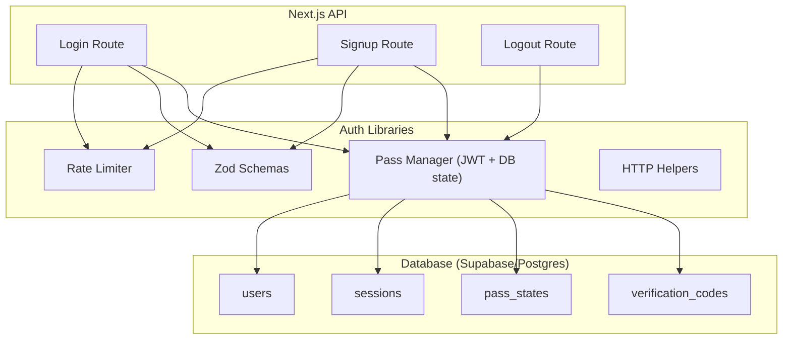
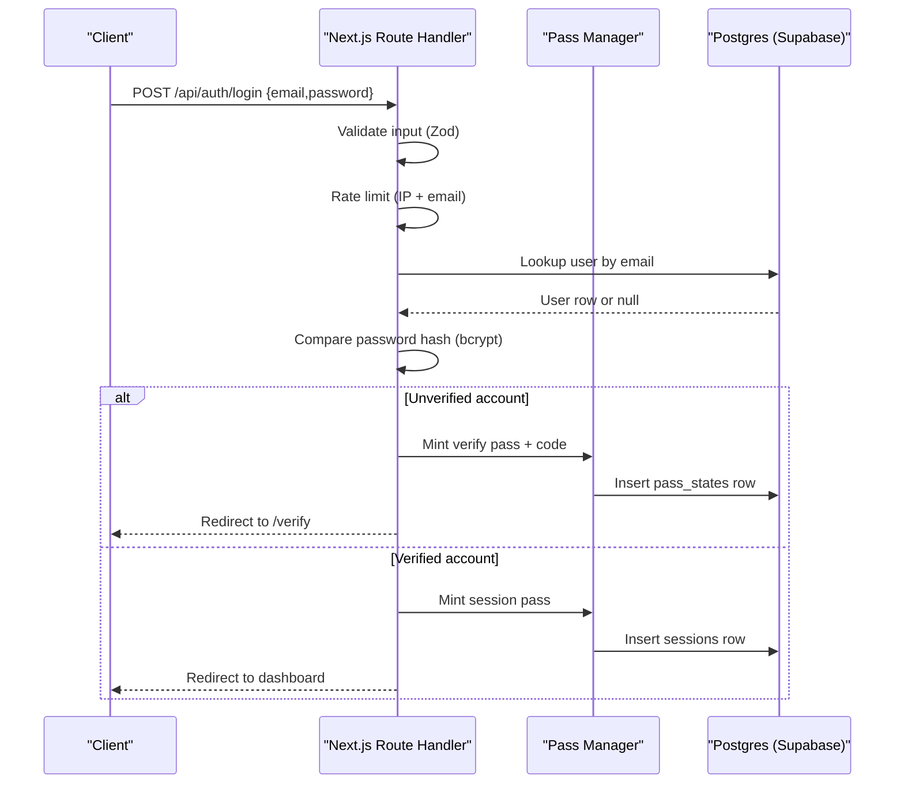
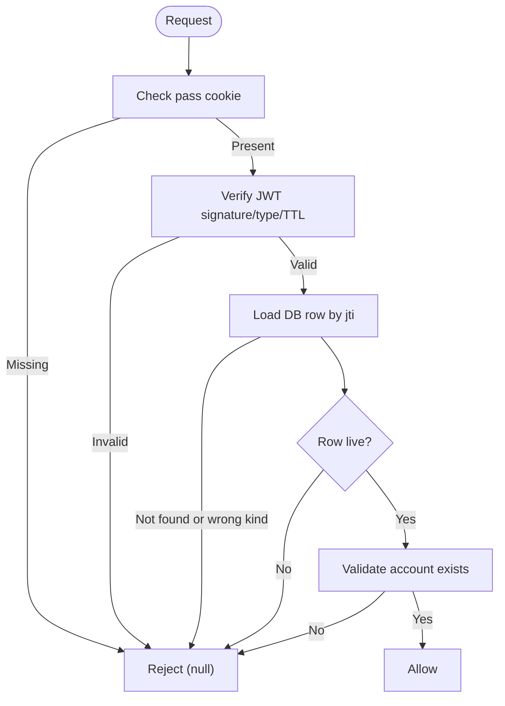
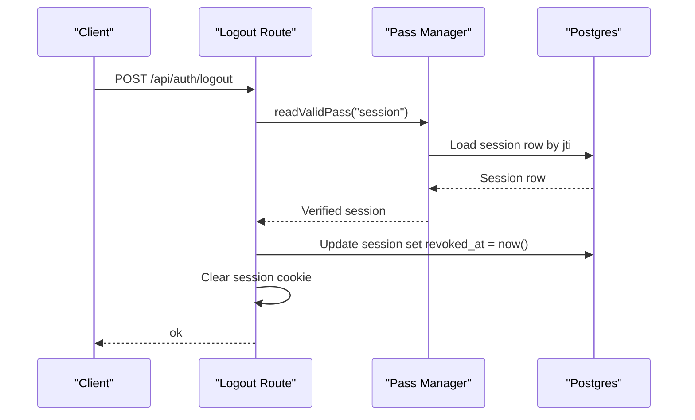
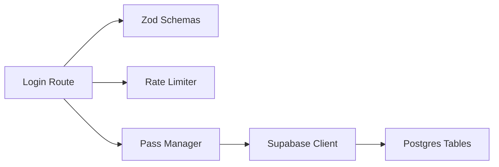

# Security Policies

<cite>
**Referenced Files in This Document**
- [0002_auth.sql](file://supabase/migrations/0002_auth.sql)
- [0001_translations.sql](file://supabase/migrations/0001_translations.sql)
- [0003-auth-pass-architecture.md](file://adrs/0003-auth-pass-architecture.md)
- [route.ts (login)](file://app/api/auth/login/route.ts)
- [route.ts (signup)](file://app/api/auth/signup/route.ts)
- [route.ts (logout)](file://app/api/auth/logout/route.ts)
- [pass.ts](file://lib/auth/pass.ts)
- [logic.ts](file://lib/auth/logic.ts)
- [rate-limit.ts](file://lib/auth/rate-limit.ts)
- [auth.ts (validation schemas)](file://lib/validation/auth.ts)
- [http.ts](file://lib/http.ts)
- [supabase.ts](file://lib/supabase.ts)
- [spec.md (authentication spec)](file://specs/authentication/spec.md)
</cite>

## Table of Contents
1. [Introduction](#introduction)
2. [Project Structure](#project-structure)
3. [Core Components](#core-components)
4. [Architecture Overview](#architecture-overview)
5. [Detailed Component Analysis](#detailed-component-analysis)
6. [Dependency Analysis](#dependency-analysis)
7. [Performance Considerations](#performance-considerations)
8. [Troubleshooting Guide](#troubleshooting-guide)
9. [Conclusion](#conclusion)
10. [Appendices](#appendices)

## Introduction
This document describes the database security posture for Agropioo, focusing on row-level security (RLS), access control, data isolation, encryption of sensitive data, session management, and protection against common vulnerabilities. It also clarifies the current RLS status as disabled per migration comments, outlines planned security implementations, and provides compliance-oriented guidance for farmer data privacy. Finally, it includes guidelines for secure database queries, parameterized statements, and input validation at the database level.

## Project Structure
Agropioo uses Supabase (PostgreSQL) with a custom authentication flow implemented via Next.js Route Handlers. The authentication schema defines users, sessions, pass states, and verification codes. Authentication logic is centralized in libraries that handle JWT passes, rate limiting, input validation, and HTTP helpers. Migrations define the database schema and include explicit notes about RLS being disabled at this stage.

**Diagram sources**
- [route.ts (login):1-112](file://app/api/auth/login/route.ts#L1-L112)
- [route.ts (signup):1-119](file://app/api/auth/signup/route.ts#L1-L119)
- [route.ts (logout):1-31](file://app/api/auth/logout/route.ts#L1-L31)
- [pass.ts:1-264](file://lib/auth/pass.ts#L1-L264)
- [rate-limit.ts:1-53](file://lib/auth/rate-limit.ts#L1-L53)
- [auth.ts (validation schemas):1-87](file://lib/validation/auth.ts#L1-L87)
- [http.ts:1-48](file://lib/http.ts#L1-L48)
- [0002_auth.sql:1-61](file://supabase/migrations/0002_auth.sql#L1-L61)

**Section sources**
- [0002_auth.sql:1-61](file://supabase/migrations/0002_auth.sql#L1-L61)
- [0003-auth-pass-architecture.md:1-50](file://adrs/0003-auth-pass-architecture.md#L1-L50)

## Core Components
- Authentication schema and tables: users, pass_states, verification_codes, sessions.
- State-backed JWT passes with server-side mutable state stored in Postgres.
- Secure cookie handling with httpOnly, SameSite=Lax, and Secure flag in production.
- Input validation using Zod schemas shared between client and server.
- In-memory fixed-window rate limiting per IP and per account/email.
- Password hashing with bcryptjs; verification codes stored as SHA-256 hashes.
- Session revocation on logout by marking session rows as revoked.

Key responsibilities:
- Route handlers enforce validation, rate limits, and orchestrate auth flows.
- Pass manager validates tokens, checks DB state, and enforces liveness rules.
- Database layer stores hashed secrets and immutable audit-like state (consumed/dead/expired).

**Section sources**
- [0002_auth.sql:7-61](file://supabase/migrations/0002_auth.sql#L7-L61)
- [pass.ts:1-264](file://lib/auth/pass.ts#L1-L264)
- [rate-limit.ts:1-53](file://lib/auth/rate-limit.ts#L1-L53)
- [auth.ts (validation schemas):1-87](file://lib/validation/auth.ts#L1-L87)
- [route.ts (login):1-112](file://app/api/auth/login/route.ts#L1-L112)
- [route.ts (signup):1-119](file://app/api/auth/signup/route.ts#L1-L119)
- [route.ts (logout):1-31](file://app/api/auth/logout/route.ts#L1-L31)

## Architecture Overview
The system implements a state-backed JWT pass architecture where every token’s jti maps to a Postgres row carrying mutable truth (consumed, dead, expired, revoked). Three cookie types exist: verify, reset, and session. Access decisions are enforced per request by validating cookies, signatures, types, expiry, and DB state.

**Diagram sources**
- [route.ts (login):1-112](file://app/api/auth/login/route.ts#L1-L112)
- [pass.ts:106-148](file://lib/auth/pass.ts#L106-L148)
- [0002_auth.sql:19-61](file://supabase/migrations/0002_auth.sql#L19-L61)

**Section sources**
- [0003-auth-pass-architecture.md:13-39](file://adrs/0003-auth-pass-architecture.md#L13-L39)
- [pass.ts:196-232](file://lib/auth/pass.ts#L196-L232)

## Detailed Component Analysis

### Row-Level Security (RLS) Status and Data Isolation
- Current status: RLS is disabled. The migration comment explicitly states that all access flows through Next.js Route Handlers using the anon key server-side, so RLS is not yet enabled.
- Implication: All database operations currently rely on application-layer authorization and validation. There is no database-enforced row-level isolation.
- Data isolation strategy today:
  - Queries filter by user identity (e.g., email, account_id) within route handlers and libraries.
  - Session-based access gates use JWT passes validated against DB rows.
- Planned improvements:
  - Enable RLS policies to enforce tenant isolation (per farmer/account) at the database level.
  - Define policies that restrict reads/writes to rows owned by the authenticated account.
  - Use service-role client only for trusted server-side maintenance tasks; never expose service keys to the browser.

Compliance considerations for farmer data privacy:
- Ensure least privilege: only necessary fields are read/written per operation.
- Enforce consistent filtering by account_id across all queries.
- Audit sensitive operations and avoid logging secrets or full codes.

**Section sources**
- [0002_auth.sql:1-6](file://supabase/migrations/0002_auth.sql#L1-L6)
- [supabase.ts:33-46](file://lib/supabase.ts#L33-L46)

### Access Control Mechanisms
- Cookie-based passes:
  - Three httpOnly cookies: agro_verify, agro_reset, agro_session.
  - Tokens are HS256-signed JWTs with strict type checks and TTLs.
  - Each token’s jti maps to a Postgres row for mutable state (consumed/dead/expired/revoked).
- Guard chain:
  - Cookie present → signature valid → typ matches → row live (not consumed/dead/expired; sessions also un-revoked) → account still exists. Any failure results in rejection.
- Session lifecycle:
  - Sessions survive restarts; logout marks the session row as revoked, invalidating copied cookies.
  - Reset flows kill all sessions of an account when password is changed.

**Diagram sources**
- [pass.ts:196-232](file://lib/auth/pass.ts#L196-L232)
- [pass.ts:150-194](file://lib/auth/pass.ts#L150-L194)

**Section sources**
- [pass.ts:1-264](file://lib/auth/pass.ts#L1-L264)
- [route.ts (logout):1-31](file://app/api/auth/logout/route.ts#L1-L31)

### Encryption and Secrets Handling
- Passwords:
  - Stored as bcrypt hashes with a configurable cost factor.
  - Unknown emails during login run bcrypt against a dummy hash to equalize timing and prevent enumeration.
- Verification codes:
  - Stored as SHA-256 hex hashes; last-code-wins via voiding older codes.
  - Per-code wrong attempt cap kills the code after a threshold.
- JWT signing:
  - HS256 with a secret from environment variables; minimum length enforced.
- Cookies:
  - httpOnly, SameSite=Lax, Secure in production.
- Environment configuration:
  - SUPABASE_URL, SUPABASE_ANON_KEY, JWT_SECRET required; service role key reserved for trusted server tasks.

**Section sources**
- [route.ts (login):1-112](file://app/api/auth/login/route.ts#L1-L112)
- [route.ts (signup):1-119](file://app/api/auth/signup/route.ts#L1-L119)
- [pass.ts:64-104](file://lib/auth/pass.ts#L64-L104)
- [0002_auth.sql:34-48](file://supabase/migrations/0002_auth.sql#L34-L48)
- [supabase.ts:14-46](file://lib/supabase.ts#L14-L46)

### Session Management Security
- Session rows persist across restarts; validity determined by expiration and revocation flags.
- Logout revokes the specific session row and clears the cookie; other devices’ sessions remain unaffected unless a reset password flow kills all sessions.
- Session liveness rule: active only if un-revoked and unexpired.

**Diagram sources**
- [route.ts (logout):1-31](file://app/api/auth/logout/route.ts#L1-L31)
- [pass.ts:176-194](file://lib/auth/pass.ts#L176-L194)

**Section sources**
- [route.ts (logout):1-31](file://app/api/auth/logout/route.ts#L1-L31)
- [logic.ts:112-126](file://lib/auth/logic.ts#L112-L126)

### Protection Against Common Vulnerabilities
- Brute-force mitigation:
  - Dual-dimension rate limiting per IP and per account/email with fixed windows.
  - Cumulative wrong attempts capped per pass; per-code wrong entries kill the code.
- Enumeration resistance:
  - Unknown email login runs bcrypt against a dummy hash; identical error responses.
  - Forgot-password endpoints return neutral bodies; codes never rendered unless demo mode.
- XSS/CSRF mitigations:
  - httpOnly cookies reduce XSS exposure.
  - SameSite=Lax reduces CSRF risk for cross-site requests.
- Timing attacks:
  - Constant-time-ish behavior via dummy hash comparison for unknown emails.
- Token tampering:
  - Strict JWT verification with type pinning and TTL; any mismatch rejected.

**Section sources**
- [rate-limit.ts:1-53](file://lib/auth/rate-limit.ts#L1-L53)
- [route.ts (login):1-112](file://app/api/auth/login/route.ts#L1-L112)
- [pass.ts:72-89](file://lib/auth/pass.ts#L72-L89)
- [0003-auth-pass-architecture.md:38-49](file://adrs/0003-auth-pass-architecture.md#L38-L49)

### Secure Database Query Guidelines
- Parameterized statements:
  - Use Supabase client methods with filters (e.g., .eq("email", normalizedEmail)) to avoid string concatenation.
- Input validation:
  - Normalize and validate inputs with Zod before querying (trim, lowercase email; regex for phone/code).
- Least privilege:
  - Select only needed columns; avoid SELECT *.
- Tenant isolation:
  - Always filter by account_id or email bound to the authenticated context.
- Error handling:
  - Do not leak internal errors; return standardized error responses.
- Admin-only paths:
  - Use service-role client only for trusted server-side maintenance; never expose service keys to the browser.

**Section sources**
- [auth.ts (validation schemas):1-87](file://lib/validation/auth.ts#L1-L87)
- [route.ts (login):66-77](file://app/api/auth/login/route.ts#L66-L77)
- [route.ts (signup):55-81](file://app/api/auth/signup/route.ts#L55-L81)
- [supabase.ts:33-46](file://lib/supabase.ts#L33-L46)

## Dependency Analysis
Authentication flows depend on:
- Route handlers for API boundaries.
- Validation schemas for input integrity.
- Rate limiter for abuse prevention.
- Pass manager for token issuance and validation.
- Supabase clients for database interactions.

**Diagram sources**
- [route.ts (login):1-112](file://app/api/auth/login/route.ts#L1-L112)
- [pass.ts:1-264](file://lib/auth/pass.ts#L1-L264)
- [rate-limit.ts:1-53](file://lib/auth/rate-limit.ts#L1-L53)
- [auth.ts (validation schemas):1-87](file://lib/validation/auth.ts#L1-L87)
- [supabase.ts:1-47](file://lib/supabase.ts#L1-L47)

**Section sources**
- [route.ts (login):1-112](file://app/api/auth/login/route.ts#L1-L112)
- [pass.ts:1-264](file://lib/auth/pass.ts#L1-L264)
- [rate-limit.ts:1-53](file://lib/auth/rate-limit.ts#L1-L53)
- [auth.ts (validation schemas):1-87](file://lib/validation/auth.ts#L1-L87)
- [supabase.ts:1-47](file://lib/supabase.ts#L1-L47)

## Performance Considerations
- Rate limiting uses in-memory fixed windows; suitable for single-instance demos but should be migrated to Redis for multi-instance deployments.
- Bcrypt cost factor balances security and latency; ensure appropriate tuning for production.
- Avoid unnecessary DB calls; cache non-sensitive lookups where safe.
- Minimize payload sizes; select only required fields.

[No sources needed since this section provides general guidance]

## Troubleshooting Guide
Common issues and diagnostics:
- Missing environment variables:
  - SUPABASE_URL, SUPABASE_ANON_KEY, JWT_SECRET must be set; missing values throw errors.
- Invalid or expired tokens:
  - decodePassToken returns null on signature/type/TTL failures; check logs and ensure correct cookie names and kinds.
- Session not active:
  - Check revoked_at and expires_at; ensure logout did not revoke the session.
- Rate limiting blocks:
  - Inspect per-IP and per-email limits; adjust windows if legitimate traffic is throttled.
- Duplicate accounts:
  - First-write-wins on lower(email); concurrent signups may resolve to one winner.

Actionable steps:
- Verify environment configuration.
- Confirm cookies are set correctly and match expected kinds.
- Review DB rows for pass_states and sessions to ensure correct state transitions.
- Adjust rate limits cautiously and monitor false positives.

**Section sources**
- [supabase.ts:6-12](file://lib/supabase.ts#L6-L12)
- [pass.ts:72-89](file://lib/auth/pass.ts#L72-L89)
- [route.ts (logout):1-31](file://app/api/auth/logout/route.ts#L1-L31)
- [rate-limit.ts:12-25](file://lib/auth/rate-limit.ts#L12-L25)

## Conclusion
Agropioo’s current security model relies on application-layer controls: state-backed JWT passes, secure cookies, robust input validation, rate limiting, and hashed secrets. RLS is intentionally disabled at this stage, with all access mediated by Route Handlers. To strengthen farmer data privacy and compliance, enable RLS to enforce tenant isolation at the database level, continue using parameterized queries, and maintain strict input validation. The existing design already mitigates many common threats; future work should focus on database-enforced policies and scalable rate limiting.

[No sources needed since this section summarizes without analyzing specific files]

## Appendices

### Compliance Considerations for Farmer Data Privacy
- Data minimization: store only necessary fields; mask or omit sensitive data in logs.
- Consent and transparency: ensure terms acceptance and clear privacy notices.
- Retention and cleanup: implement periodic cleanup of expired codes, consumed passes, and revoked sessions.
- Auditability: log access decisions without sensitive payloads; track failed attempts for security monitoring.

[No sources needed since this section provides general guidance]