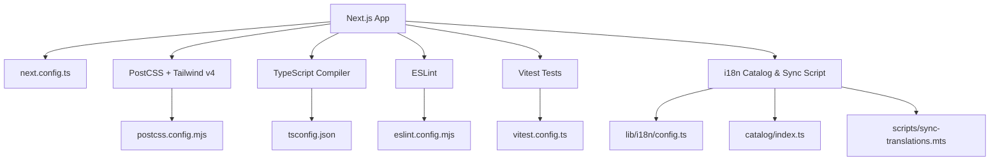
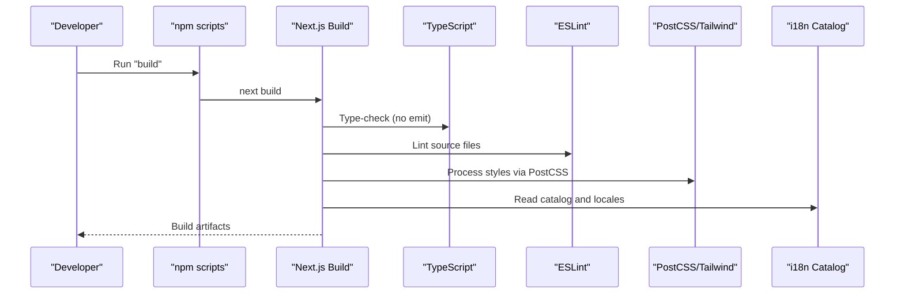
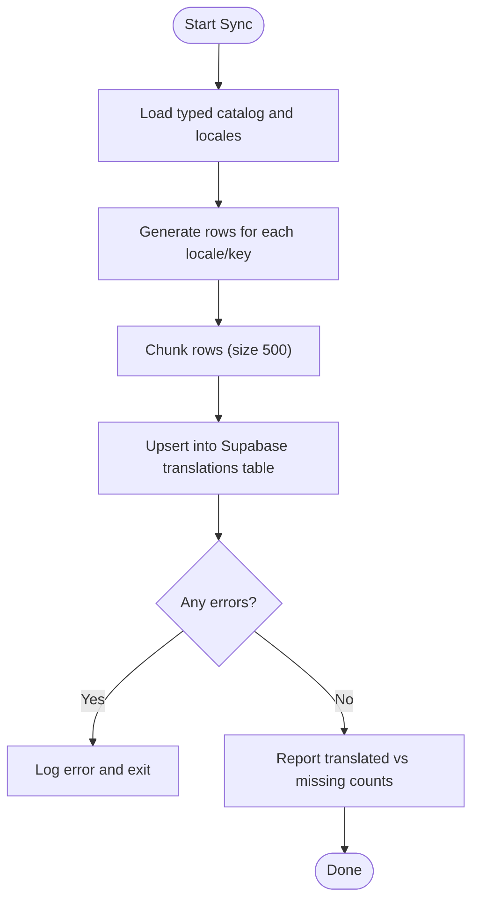
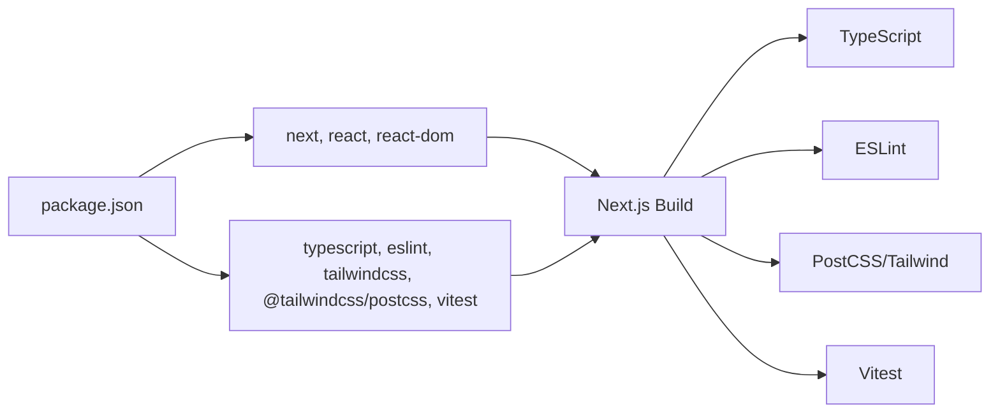

# Build Configuration

<cite>
**Referenced Files in This Document**
- [next.config.ts](file://next.config.ts)
- [postcss.config.mjs](file://postcss.config.mjs)
- [tsconfig.json](file://tsconfig.json)
- [eslint.config.mjs](file://eslint.config.mjs)
- [package.json](file://package.json)
- [vitest.config.ts](file://vitest.config.ts)
- [lib/i18n/config.ts](file://lib/i18n/config.ts)
- [catalog/index.ts](file://catalog/index.ts)
- [scripts/sync-translations.mts](file://scripts/sync-translations.mts)
</cite>

## Table of Contents
1. Introduction
2. Project Structure
3. Core Components
4. Architecture Overview
5. Detailed Component Analysis
6. Dependency Analysis
7. Performance Considerations
8. Troubleshooting Guide
9. Conclusion
10. Appendices

## Introduction
This document explains the build configuration for Agropioo, focusing on Next.js settings, PostCSS and Tailwind CSS integration, TypeScript compilation, ESLint rules, performance optimizations, asset bundling strategies, debugging techniques for build failures, and internationalization build-time considerations. It is intended to help developers understand how the project is built, how to customize it safely, and how to troubleshoot common issues.

## Project Structure
Agropioo uses a modern Next.js 16 setup with:
- A minimal Next.js configuration enabling an experimental routing feature for global not-found handling.
- PostCSS configured to use the official Tailwind v4 plugin.
- TypeScript configured with strict mode, path aliases, and incremental builds.
- ESLint configured via the Next.js recommended configs with custom ignores for generated folders.
- A test runner (Vitest) with aliasing aligned to the application’s path mapping.
- An i18n system with a typed catalog and a script to sync translations into Supabase.

**Diagram sources**
- [next.config.ts:1-12](file://next.config.ts#L1-L12)
- [postcss.config.mjs:1-8](file://postcss.config.mjs#L1-L8)
- [tsconfig.json:1-36](file://tsconfig.json#L1-L36)
- [eslint.config.mjs:1-19](file://eslint.config.mjs#L1-L19)
- [vitest.config.ts:1-15](file://vitest.config.ts#L1-L15)
- [lib/i18n/config.ts:1-137](file://lib/i18n/config.ts#L1-L137)
- [catalog/index.ts:1-41](file://catalog/index.ts#L1-L41)
- [scripts/sync-translations.mts:1-74](file://scripts/sync-translations.mts#L1-L74)

**Section sources**
- [next.config.ts:1-12](file://next.config.ts#L1-L12)
- [postcss.config.mjs:1-8](file://postcss.config.mjs#L1-L8)
- [tsconfig.json:1-36](file://tsconfig.json#L1-L36)
- [eslint.config.mjs:1-19](file://eslint.config.mjs#L1-L19)
- [package.json:1-38](file://package.json#L1-L38)
- [vitest.config.ts:1-15](file://vitest.config.ts#L1-L15)
- [lib/i18n/config.ts:1-137](file://lib/i18n/config.ts#L1-L137)
- [catalog/index.ts:1-41](file://catalog/index.ts#L1-L41)
- [scripts/sync-translations.mts:1-74](file://scripts/sync-translations.mts#L1-L74)

## Core Components
- Next.js configuration: Enables experimental features such as globalNotFound to support unmatched routes rendering a full HTML response.
- PostCSS and Tailwind: Uses the official Tailwind v4 PostCSS plugin; no additional plugins are currently configured.
- TypeScript: Strict mode enabled, incremental builds, path alias @ mapped to root, JSX React automatic runtime, module resolution set to bundler.
- ESLint: Uses Next.js recommended configurations for web vitals and TypeScript, with explicit ignores for generated folders.
- Testing: Vitest configured with node environment and path alias matching the app’s @ alias.
- Internationalization: Central locale registry and typed translation catalog; a script synchronizes translations into Supabase.

**Section sources**
- [next.config.ts:1-12](file://next.config.ts#L1-L12)
- [postcss.config.mjs:1-8](file://postcss.config.mjs#L1-L8)
- [tsconfig.json:1-36](file://tsconfig.json#L1-L36)
- [eslint.config.mjs:1-19](file://eslint.config.mjs#L1-L19)
- [vitest.config.ts:1-15](file://vitest.config.ts#L1-L15)
- [lib/i18n/config.ts:1-137](file://lib/i18n/config.ts#L1-L137)
- [catalog/index.ts:1-41](file://catalog/index.ts#L1-L41)
- [scripts/sync-translations.mts:1-74](file://scripts/sync-translations.mts#L1-L74)

## Architecture Overview
The build pipeline integrates several tools orchestrated by Next.js:
- Source code is type-checked and linted before building.
- Styles are processed through PostCSS using Tailwind v4.
- The Next.js build compiles assets, applies experimental features, and produces optimized output.
- Translation assets are managed via a typed catalog and synchronized to a database at build time or via a dedicated script.

**Diagram sources**
- [package.json:5-12](file://package.json#L5-L12)
- [next.config.ts:1-12](file://next.config.ts#L1-L12)
- [postcss.config.mjs:1-8](file://postcss.config.mjs#L1-L8)
- [tsconfig.json:1-36](file://tsconfig.json#L1-L36)
- [eslint.config.mjs:1-19](file://eslint.config.mjs#L1-L19)
- [catalog/index.ts:1-41](file://catalog/index.ts#L1-L41)

## Detailed Component Analysis

### Next.js Configuration
- Experimental features: globalNotFound is enabled to ensure unmatched URLs render a proper HTML 404 page when using localized layouts.
- Asset optimization: No explicit overrides are present; Next.js default image and asset optimizations apply.
- Bundle analysis: Not configured in this repository; can be added via Next.js plugins if needed.

Recommendations:
- Keep globalNotFound enabled for consistent 404 behavior across locales.
- If you need bundle size insights, integrate a Next.js-compatible analyzer in your build process.

**Section sources**
- [next.config.ts:1-12](file://next.config.ts#L1-L12)

### PostCSS and Tailwind CSS Integration
- PostCSS uses the official Tailwind v4 plugin.
- No additional PostCSS plugins are configured.
- Responsive utilities and design tokens are provided by Tailwind v4; any custom theme should be defined in your CSS entry point according to Tailwind v4 conventions.

Guidance:
- Add custom utilities or theme variables in your global stylesheet rather than modifying PostCSS config unless necessary.
- Ensure your CSS entry imports Tailwind directives so PostCSS processes them correctly.

**Section sources**
- [postcss.config.mjs:1-8](file://postcss.config.mjs#L1-L8)

### TypeScript Compilation Settings
- Target ES2017 with DOM and modern lib features.
- Strict mode enabled for stronger type safety.
- Incremental compilation enabled for faster rebuilds.
- Path alias @ maps to the project root for clean imports.
- Module resolution set to bundler for compatibility with Next.js.
- JSX configured for React automatic runtime.

Impact:
- Strict checks improve reliability and catch errors early.
- Incremental builds speed up development iterations.
- Path aliases simplify imports and reduce relative path complexity.

**Section sources**
- [tsconfig.json:1-36](file://tsconfig.json#L1-L36)

### ESLint Rules for Code Quality
- Uses Next.js recommended configs for core web vitals and TypeScript.
- Overrides default ignores to include generated folders like .next and out.

Best practices:
- Keep Next.js recommended rules to maintain consistency and performance-focused linting.
- Extend or override rules only when necessary to avoid drift from framework guidance.

**Section sources**
- [eslint.config.mjs:1-19](file://eslint.config.mjs#L1-L19)

### Test Runner Configuration
- Vitest runs in a Node environment.
- Path alias @ is aliased to the project root to match tsconfig.
- Test discovery includes lib and catalog tests.

Usage:
- Place unit tests under lib or catalog directories following the include pattern.
- Use the same @ alias strategy as the app to import modules consistently.

**Section sources**
- [vitest.config.ts:1-15](file://vitest.config.ts#L1-L15)

### Internationalization Build-Time Optimizations
- Locale registry defines supported languages, URL slugs, HTML lang attributes, text direction, and hreflang eligibility.
- Typed translation catalog centralizes keys and values per locale, with English as the fallback source.
- A synchronization script upserts translations into Supabase, marking missing entries for coverage tracking.

Build-time considerations:
- The catalog is read during development/build to inform type checking and coverage validation.
- Runtime translations are fetched from the database; the catalog ensures compile-time safety and coverage metrics.

Multi-language asset management:
- Maintain one key per string across locales; missing keys are explicitly tracked.
- Use the sync script to keep the database in sync with the catalog after changes.

**Diagram sources**
- [scripts/sync-translations.mts:1-74](file://scripts/sync-translations.mts#L1-L74)
- [catalog/index.ts:1-41](file://catalog/index.ts#L1-L41)
- [lib/i18n/config.ts:1-137](file://lib/i18n/config.ts#L1-L137)

**Section sources**
- [lib/i18n/config.ts:1-137](file://lib/i18n/config.ts#L1-L137)
- [catalog/index.ts:1-41](file://catalog/index.ts#L1-L41)
- [scripts/sync-translations.mts:1-74](file://scripts/sync-translations.mts#L1-L74)

## Dependency Analysis
Key dependencies influencing the build:
- Next.js orchestrates the build and integrates TypeScript, ESLint, and asset processing.
- Tailwind v4 provides utility classes and responsive design without a traditional config file.
- TypeScript enforces types and enables incremental builds.
- ESLint ensures code quality aligned with Next.js recommendations.
- Vitest supports unit testing with consistent path aliases.

**Diagram sources**
- [package.json:13-36](file://package.json#L13-L36)

**Section sources**
- [package.json:1-38](file://package.json#L1-L38)

## Performance Considerations
- Incremental TypeScript builds reduce rebuild times during development.
- Tailwind v4 generates efficient CSS; avoid adding unnecessary plugins that could increase processing overhead.
- Keep ESLint rules aligned with Next.js recommendations to prevent anti-patterns that impact performance.
- For bundle size insights, consider integrating a Next.js-compatible bundle analyzer in your workflow.
- Avoid importing large libraries unconditionally; prefer dynamic imports where appropriate to split bundles.

[No sources needed since this section provides general guidance]

## Troubleshooting Guide
Common build issues and resolutions:
- Missing environment variables for translation sync: The sync script requires SUPABASE_URL and SUPABASE_SERVICE_ROLE_KEY; ensure they are set in your environment before running the sync command.
- Generated folder ignores: ESLint ignores .next, out, and build folders; if you see unexpected lint errors, verify your ignore patterns and ensure generated files are excluded.
- Path alias mismatches: Ensure your editor and test runner resolve @ to the project root; vitest and tsconfig both define the alias to keep imports consistent.
- Tailwind processing: If styles do not appear, confirm PostCSS is configured with the Tailwind v4 plugin and your CSS entry imports Tailwind directives.

**Section sources**
- [scripts/sync-translations.mts:1-74](file://scripts/sync-translations.mts#L1-L74)
- [eslint.config.mjs:1-19](file://eslint.config.mjs#L1-L19)
- [vitest.config.ts:1-15](file://vitest.config.ts#L1-L15)
- [postcss.config.mjs:1-8](file://postcss.config.mjs#L1-L8)

## Conclusion
Agropioo’s build configuration is intentionally minimal and focused:
- Next.js experimental features enable robust routing behavior for localized apps.
- PostCSS with Tailwind v4 delivers responsive utilities without heavy configuration.
- TypeScript and ESLint enforce quality and performance best practices.
- The i18n system provides compile-time safety and runtime flexibility via a typed catalog and database-backed translations.
Adhering to these configurations ensures a fast, reliable build process while keeping customization straightforward and safe.

[No sources needed since this section summarizes without analyzing specific files]

## Appendices

### Scripts and Commands
- Development: Runs the Next.js development server.
- Build: Executes the Next.js production build.
- Lint: Runs ESLint against the codebase.
- Test: Runs Vitest tests.
- Sync Translations: Synchronizes the typed catalog into Supabase for runtime usage.

**Section sources**
- [package.json:5-12](file://package.json#L5-L12)