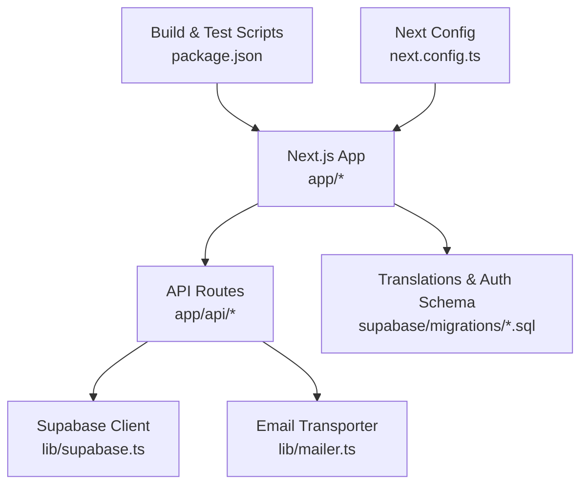
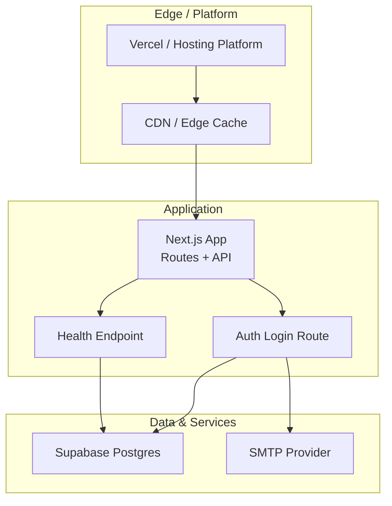
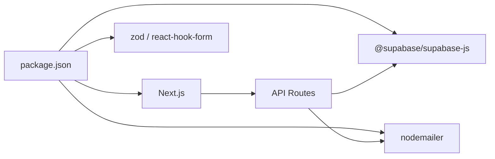
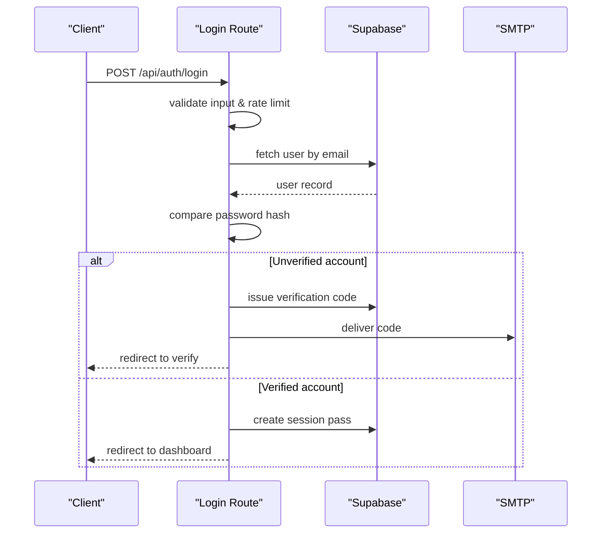
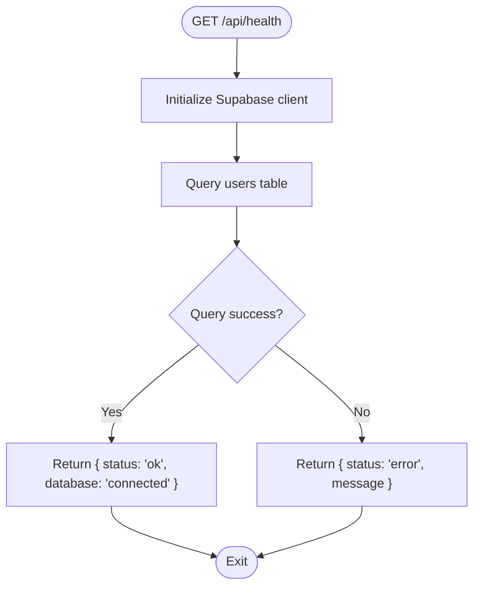

# Deployment Strategies

<cite>
**Referenced Files in This Document**
- [package.json](file://package.json)
- [next.config.ts](file://next.config.ts)
- [README.md](file://README.md)
- [lib/supabase.ts](file://lib/supabase.ts)
- [lib/mailer.ts](file://lib/mailer.ts)
- [app/api/health/route.ts](file://app/api/health/route.ts)
- [app/api/auth/login/route.ts](file://app/api/auth/login/route.ts)
- [supabase/migrations/0001_translations.sql](file://supabase/migrations/0001_translations.sql)
- [supabase/migrations/0002_auth.sql](file://supabase/migrations/0002_auth.sql)
</cite>

## Table of Contents
1. Introduction
2. Project Structure
3. Core Components
4. Architecture Overview
5. Detailed Component Analysis
6. Dependency Analysis
7. Performance Considerations
8. Troubleshooting Guide
9. Conclusion
10. Appendices

## Introduction
This document provides a comprehensive deployment strategy for Agropioo, a Next.js application with server-side API routes and Supabase-backed data services. It covers recommended Vercel deployment, Docker containerization, and traditional hosting options. It also details CI/CD setup with GitHub Actions, automated testing, environment-specific configuration, database migrations, asset optimization, scaling considerations for Pakistani farmers under varying network conditions, CDN configuration, performance monitoring, rollback strategies, health checks, and production troubleshooting procedures.

## Project Structure
Agropioo is a Next.js App Router project with:
- Serverless API routes under app/api (e.g., authentication and health endpoints)
- Supabase client initialization and admin client usage
- Nodemailer-based email delivery via SMTP
- Database schema defined as SQL migrations under supabase/migrations
- Build and test scripts exposed via package.json

**Diagram sources**
- [package.json:5-11](file://package.json#L5-L11)
- [next.config.ts:3-9](file://next.config.ts#L3-L9)
- [lib/supabase.ts:14-46](file://lib/supabase.ts#L14-L46)
- [lib/mailer.ts:13-39](file://lib/mailer.ts#L13-L39)
- [app/api/health/route.ts:3-17](file://app/api/health/route.ts#L3-L17)
- [app/api/auth/login/route.ts:41-111](file://app/api/auth/login/route.ts#L41-L111)
- [supabase/migrations/0001_translations.sql:7-31](file://supabase/migrations/0001_translations.sql#L7-L31)
- [supabase/migrations/0002_auth.sql:7-61](file://supabase/migrations/0002_auth.sql#L7-L61)

**Section sources**
- [package.json:5-11](file://package.json#L5-L11)
- [next.config.ts:3-9](file://next.config.ts#L3-L9)
- [README.md:33-36](file://README.md#L33-L36)

## Core Components
- Next.js runtime and build pipeline: development, build, start, lint, test, and translation sync scripts are defined in package.json.
- Next.js configuration enables globalNotFound behavior to support unmatched routing scenarios.
- Supabase client module initializes both anon and service-role clients based on environment variables; it enforces required env vars and disables session persistence for server-side use.
- Email transport uses Nodemailer with optional SMTP configuration; when unconfigured, the transporter is null and can be used for demo modes.
- Health endpoint validates connectivity by querying a table via Supabase and returns structured status responses.
- Authentication login route performs rate limiting, input validation, password verification, verification flow gating, and session pass issuance.

**Section sources**
- [package.json:5-11](file://package.json#L5-L11)
- [next.config.ts:3-9](file://next.config.ts#L3-L9)
- [lib/supabase.ts:6-12](file://lib/supabase.ts#L6-L12)
- [lib/supabase.ts:14-46](file://lib/supabase.ts#L14-L46)
- [lib/mailer.ts:13-39](file://lib/mailer.ts#L13-L39)
- [app/api/health/route.ts:3-17](file://app/api/health/route.ts#L3-L17)
- [app/api/auth/login/route.ts:41-111](file://app/api/auth/login/route.ts#L41-L111)

## Architecture Overview
The deployment architecture centers on Next.js serverless functions (API routes) interacting with Supabase Postgres and an SMTP provider for emails. The health endpoint serves as a readiness probe. Migrations define the database schema for translations and authentication-related tables.

**Diagram sources**
- [app/api/health/route.ts:3-17](file://app/api/health/route.ts#L3-L17)
- [app/api/auth/login/route.ts:41-111](file://app/api/auth/login/route.ts#L41-L111)
- [lib/supabase.ts:14-46](file://lib/supabase.ts#L14-L46)
- [lib/mailer.ts:13-39](file://lib/mailer.ts#L13-L39)

## Detailed Component Analysis

### Vercel Deployment (Recommended)
- Use Vercel’s native Next.js integration for zero-config deployments.
- Configure environment variables for Supabase URL and keys, SMTP settings, and any secrets.
- Enable globalNotFound if needed for unmatched routes.
- Set up custom domains and CDN caching policies at the platform level.

**Section sources**
- [README.md:33-36](file://README.md#L33-L36)
- [next.config.ts:3-9](file://next.config.ts#L3-L9)
- [lib/supabase.ts:17-28](file://lib/supabase.ts#L17-L28)
- [lib/mailer.ts:13-39](file://lib/mailer.ts#L13-L39)

### Docker Containerization
- Create a multi-stage Dockerfile:
  - Stage 1: Install dependencies and run Next.js build.
  - Stage 2: Serve the built output using Node runtime.
- Expose port 3000 and set required environment variables at runtime.
- Ensure health check endpoint is reachable for container orchestration probes.

[No sources needed since this section provides general guidance]

### Traditional Hosting Platforms
- Suitable platforms include any that support Node.js and Next.js builds (e.g., AWS ECS, GCP Cloud Run, Azure Container Apps).
- Provide environment variables for Supabase and SMTP.
- Configure reverse proxy and static asset caching as appropriate.

[No sources needed since this section provides general guidance]

### CI/CD Pipeline with GitHub Actions
- Suggested workflow steps:
  - Checkout code and cache dependencies.
  - Lint and type-check.
  - Run tests (unit/integration).
  - Build the Next.js app.
  - Deploy to target environment (Vercel or other host).
  - Run database migrations before deploy if applicable.
  - Validate health endpoint post-deploy.

[No sources needed since this section provides general guidance]

### Automated Testing
- Use the test script from package.json to execute tests during CI.
- Include unit tests for critical logic and integration tests for API routes where feasible.

**Section sources**
- [package.json:5-11](file://package.json#L5-L11)

### Environment-Specific Configuration
- Required environment variables:
  - Supabase: URL, anon key, service role key (server-only).
  - SMTP: host, port, user, password, email sender address.
  - JWT secret for session passes.
- Enforce presence of required variables in the Supabase client module.
- Keep sensitive values out of source control; use platform secret management.

**Section sources**
- [lib/supabase.ts:6-12](file://lib/supabase.ts#L6-L12)
- [lib/supabase.ts:17-28](file://lib/supabase.ts#L17-L28)
- [lib/supabase.ts:38-46](file://lib/supabase.ts#L38-L46)
- [lib/mailer.ts:13-39](file://lib/mailer.ts#L13-L39)

### Database Migrations
- Migrations define:
  - Translations table with locale constraints and public read policy.
  - Authentication schema including users, pass states, verification codes, and sessions with indexes.
- Apply migrations in CI/CD prior to deploying new versions.
- Use service-role client for migration scripts and maintenance tasks.

**Section sources**
- [supabase/migrations/0001_translations.sql:7-31](file://supabase/migrations/0001_translations.sql#L7-L31)
- [supabase/migrations/0002_auth.sql:7-61](file://supabase/migrations/0002_auth.sql#L7-L61)
- [lib/supabase.ts:38-46](file://lib/supabase.ts#L38-L46)

### Asset Optimization for Production
- Leverage Next.js image optimization and font loading features.
- Configure CDN caching headers for static assets.
- Minimize bundle size and enable code splitting.
- Use lazy loading for non-critical components and images.

[No sources needed since this section provides general guidance]

### Scaling Considerations for Pakistani Farmers
- Optimize for low bandwidth and intermittent connectivity:
  - Compress and serve optimized images (WebP/AVIF).
  - Use responsive images and lazy loading.
  - Prefer lightweight UI components and defer non-essential work.
- Enable CDN caching for static assets and edge caching for API responses where safe.
- Implement retry logic and offline-friendly UX patterns.

[No sources needed since this section provides general guidance]

### CDN Configuration
- Configure CDN to cache static assets aggressively with long-lived cache headers.
- For dynamic content, use short TTLs and vary by query parameters carefully.
- Ensure HTTPS enforcement and security headers.

[No sources needed since this section provides general guidance]

### Performance Monitoring
- Instrument API routes to log latency and errors.
- Monitor health endpoint availability and response times.
- Track error rates and slow endpoints in your observability stack.

[No sources needed since this section provides general guidance]

### Rollback Strategies
- Maintain versioned deployments and quick rollback capability.
- In CI/CD, tag builds and keep previous artifacts available.
- If database migrations are backward-incompatible, plan dual-write/read phases and reversible changes.

[No sources needed since this section provides general guidance]

### Health Checks
- Use the health endpoint to verify application and database connectivity.
- Integrate health checks into load balancers and orchestrators for readiness and liveness probes.

**Section sources**
- [app/api/health/route.ts:3-17](file://app/api/health/route.ts#L3-L17)

### Production Troubleshooting Procedures
- Common issues:
  - Missing environment variables causing Supabase client initialization failures.
  - SMTP misconfiguration leading to email delivery failures.
  - Rate limiting triggered due to excessive login attempts.
- Steps:
  - Verify environment variables and secrets.
  - Check logs for errors in API routes.
  - Validate database connectivity via health endpoint.
  - Review rate limiting rules and adjust thresholds if necessary.

**Section sources**
- [lib/supabase.ts:6-12](file://lib/supabase.ts#L6-L12)
- [lib/mailer.ts:13-39](file://lib/mailer.ts#L13-L39)
- [app/api/auth/login/route.ts:41-111](file://app/api/auth/login/route.ts#L41-L111)

## Dependency Analysis
Key runtime dependencies and their roles:
- Next.js: Application framework and build system.
- Supabase client: Database access and auth flows.
- Nodemailer: Email delivery via SMTP.
- Validation libraries: Input validation for forms and API payloads.

**Diagram sources**
- [package.json:13-23](file://package.json#L13-L23)
- [lib/supabase.ts:1-46](file://lib/supabase.ts#L1-L46)
- [lib/mailer.ts:1-39](file://lib/mailer.ts#L1-L39)

**Section sources**
- [package.json:13-23](file://package.json#L13-L23)

## Performance Considerations
- Prioritize fast initial load for low-bandwidth users:
  - Minimize JavaScript payload and split code by route.
  - Use Next.js image optimization and font-display strategies.
- Reduce network requests and leverage caching:
  - Cache static assets via CDN.
  - Use efficient API responses and minimal payloads.
- Monitor Core Web Vitals and optimize for real-world networks in Pakistan.

[No sources needed since this section provides general guidance]

## Troubleshooting Guide
- Health endpoint diagnostics:
  - Returns structured status indicating connectivity and errors.
- Authentication flow issues:
  - Validate input schemas and rate limiting behavior.
  - Ensure proper cookie handling for session passes and verification stages.
- Email delivery problems:
  - Confirm SMTP configuration and credentials.
  - Handle cases where transporter is null in demo mode.

**Section sources**
- [app/api/health/route.ts:3-17](file://app/api/health/route.ts#L3-L17)
- [app/api/auth/login/route.ts:41-111](file://app/api/auth/login/route.ts#L41-L111)
- [lib/mailer.ts:13-39](file://lib/mailer.ts#L13-L39)

## Conclusion
Agropioo’s deployment strategy leverages Next.js serverless functions, Supabase for data, and SMTP for communications. Vercel is the recommended platform for streamlined deployment and CDN integration. Robust CI/CD pipelines should automate testing, building, migrating, and deploying with health checks and rollback capabilities. Optimizations for low-bandwidth environments and careful environment configuration ensure reliable operation for Pakistani farmers.

## Appendices

### API Workflow: Login Flow

**Diagram sources**
- [app/api/auth/login/route.ts:41-111](file://app/api/auth/login/route.ts#L41-L111)
- [lib/supabase.ts:14-46](file://lib/supabase.ts#L14-L46)
- [lib/mailer.ts:13-39](file://lib/mailer.ts#L13-L39)

### Health Check Flow

**Diagram sources**
- [app/api/health/route.ts:3-17](file://app/api/health/route.ts#L3-L17)