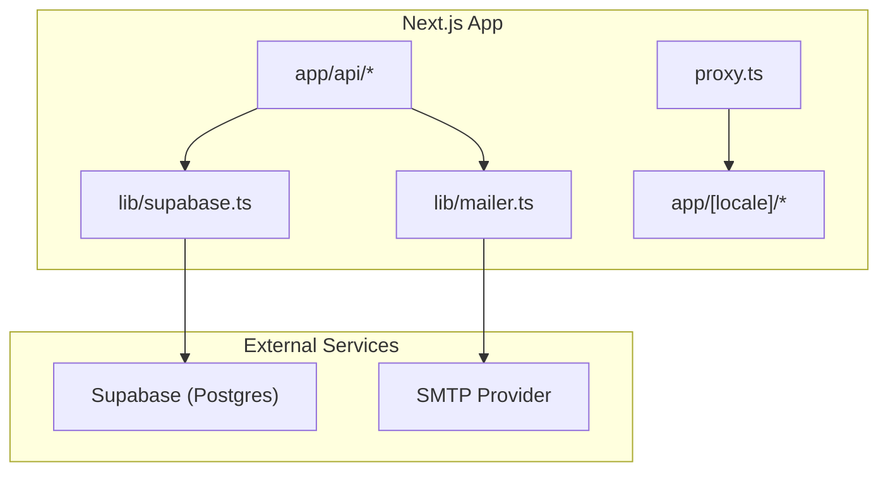
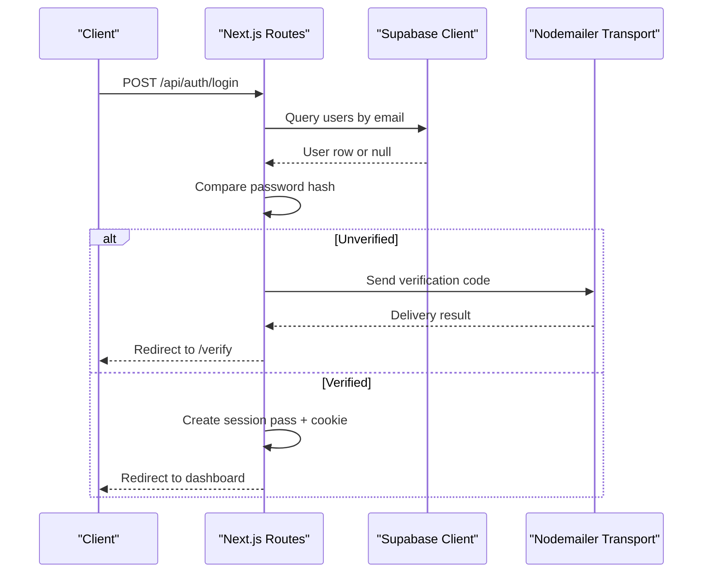
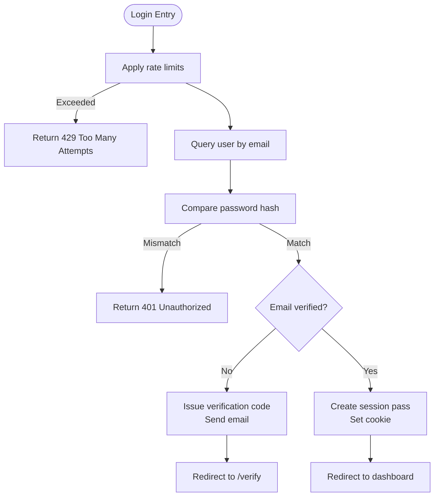
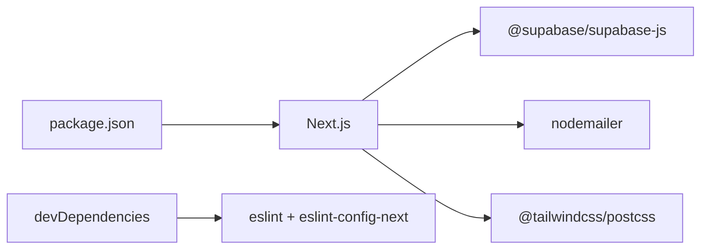

# Deployment and Configuration

<cite>
**Referenced Files in This Document**
- [package.json](file://package.json)
- [next.config.ts](file://next.config.ts)
- [postcss.config.mjs](file://postcss.config.mjs)
- [eslint.config.mjs](file://eslint.config.mjs)
- [lib/supabase.ts](file://lib/supabase.ts)
- [lib/mailer.ts](file://lib/mailer.ts)
- [app/api/auth/login/route.ts](file://app/api/auth/login/route.ts)
- [app/api/auth/signup/route.ts](file://app/api/auth/signup/route.ts)
- [app/api/health/route.ts](file://app/api/health/route.ts)
- [proxy.ts](file://proxy.ts)
- [supabase/migrations/0002_auth.sql](file://supabase/migrations/0002_auth.sql)
</cite>

## Table of Contents
1. Introduction
2. Project Structure
3. Core Components
4. Architecture Overview
5. Detailed Component Analysis
6. Dependency Analysis
7. Performance Considerations
8. Troubleshooting Guide
9. Conclusion
10. Appendices

## Introduction
This document provides comprehensive deployment and configuration guidance for Agropioo, a Next.js application that integrates Supabase for data and authentication, Nodemailer for email delivery, and Tailwind CSS for styling. It covers environment configuration (Supabase credentials, email service, production variables), build optimization, asset bundling, performance tuning via Next.js configuration, and deployment strategies for Vercel, Docker, and traditional hosting. It also documents PostCSS/Tailwind setup, ESLint configuration, environment-specific behavior, monitoring, troubleshooting, security hardening (CORS, HTTPS), and scaling considerations for serving Pakistani farmers under varying network conditions.

## Project Structure
Agropioo is a Next.js App Router project with:
- API routes under app/api for authentication and health checks
- Server-side libraries for Supabase client and email transport
- PostCSS configured for Tailwind CSS v4
- ESLint configured using Next’s recommended configs
- A hybrid locale proxy to serve localized content without redirects
- Database schema migrations under supabase/migrations

**Diagram sources**
- [app/api/auth/login/route.ts:1-112](file://app/api/auth/login/route.ts#L1-L112)
- [app/api/auth/signup/route.ts:1-119](file://app/api/auth/signup/route.ts#L1-L119)
- [lib/supabase.ts:1-47](file://lib/supabase.ts#L1-L47)
- [lib/mailer.ts:1-85](file://lib/mailer.ts#L1-L85)
- [proxy.ts:1-31](file://proxy.ts#L1-L31)

**Section sources**
- [package.json:1-38](file://package.json#L1-L38)
- [next.config.ts:1-12](file://next.config.ts#L1-L12)
- [postcss.config.mjs:1-8](file://postcss.config.mjs#L1-L8)
- [eslint.config.mjs:1-19](file://eslint.config.mjs#L1-L19)
- [proxy.ts:1-31](file://proxy.ts#L1-L31)

## Core Components
- Supabase client: Provides anon and admin clients with environment validation and singleton caching.
- Email transport: Configures Nodemailer via SMTP environment variables; supports demo mode for local development.
- Authentication routes: Login and signup endpoints implement rate limiting, password hashing, verification flows, and session handling.
- Health endpoint: Validates database connectivity by querying the users table.
- Locale proxy: Rewrites non-locale URLs to default English while preserving real routes.

Key environment variables required at runtime:
- SUPABASE_URL, SUPABASE_ANON_KEY (client)
- SUPABASE_SERVICE_ROLE_KEY (server-only admin tasks)
- SMTP_HOST, SMTP_PORT, SMTP_USER, SMTP_PASSWORD, EMAIL_FROM
- DEMO_MODE (development only)

**Section sources**
- [lib/supabase.ts:1-47](file://lib/supabase.ts#L1-L47)
- [lib/mailer.ts:1-85](file://lib/mailer.ts#L1-L85)
- [app/api/auth/login/route.ts:1-112](file://app/api/auth/login/route.ts#L1-L112)
- [app/api/auth/signup/route.ts:1-119](file://app/api/auth/signup/route.ts#L1-L119)
- [app/api/health/route.ts:1-18](file://app/api/health/route.ts#L1-L18)
- [proxy.ts:1-31](file://proxy.ts#L1-L31)

## Architecture Overview
The runtime architecture centers on Next.js Route Handlers that coordinate Supabase operations and email delivery. The locale proxy ensures consistent routing for internationalized pages.

**Diagram sources**
- [app/api/auth/login/route.ts:1-112](file://app/api/auth/login/route.ts#L1-L112)
- [lib/supabase.ts:1-47](file://lib/supabase.ts#L1-L47)
- [lib/mailer.ts:1-85](file://lib/mailer.ts#L1-L85)

## Detailed Component Analysis

### Environment Configuration
- Supabase:
  - Client uses SUPABASE_URL and SUPABASE_ANON_KEY; throws if missing.
  - Admin client requires SUPABASE_SERVICE_ROLE_KEY and is server-only.
- Email:
  - SMTP_HOST, SMTP_PORT, SMTP_USER, SMTP_PASSWORD, EMAIL_FROM must be set for production.
  - DEMO_MODE enables local development without sending emails.
- Next.js:
  - globalNotFound enabled to render custom HTML for unmatched routes.
- Proxy:
  - Rewrites non-locale paths to English without redirecting the browser URL.

Operational notes:
- Validate all environment variables before starting the server.
- Keep service role keys strictly server-side; never expose them to the browser.
- Use separate .env files per environment (e.g., .env.local for dev, platform secrets for prod).

**Section sources**
- [lib/supabase.ts:1-47](file://lib/supabase.ts#L1-L47)
- [lib/mailer.ts:1-85](file://lib/mailer.ts#L1-L85)
- [next.config.ts:1-12](file://next.config.ts#L1-L12)
- [proxy.ts:1-31](file://proxy.ts#L1-L31)

### Build Process Optimization and Asset Bundling
- Scripts:
  - next build produces optimized static assets and server bundles.
  - next start runs the production server.
- Next.js config:
  - globalNotFound improves 404 handling for root layout scenarios.
- Tailwind CSS:
  - PostCSS plugin @tailwindcss/postcss configured for v4.
- Recommendations:
  - Enable compression and HTTP/2 on your host or CDN.
  - Cache immutable assets aggressively via CDN headers.
  - Monitor bundle size and tree-shake unused modules.

**Section sources**
- [package.json:1-38](file://package.json#L1-L38)
- [next.config.ts:1-12](file://next.config.ts#L1-L12)
- [postcss.config.mjs:1-8](file://postcss.config.mjs#L1-L8)

### PostCSS and Tailwind CSS Setup
- PostCSS uses @tailwindcss/postcss to process styles during builds.
- Ensure Tailwind directives are included in your stylesheet entry point (outside this document).
- For production, rely on Next.js build pipeline to optimize CSS.

**Section sources**
- [postcss.config.mjs:1-8](file://postcss.config.mjs#L1-L8)

### ESLint Configuration
- Uses eslint-config-next core-web-vitals and TypeScript rules.
- Overrides default ignores to include common build artifacts.
- Run linting via npm scripts to maintain code quality.

**Section sources**
- [eslint.config.mjs:1-19](file://eslint.config.mjs#L1-L19)
- [package.json:1-38](file://package.json#L1-L38)

### Authentication Flow and Data Model
- Login:
  - Rate limits by IP and email.
  - Compares password against stored hash; returns generic errors for unknown users.
  - If unverified, issues a verification pass and sends a code via email; otherwise sets a session cookie.
- Signup:
  - First-write-wins semantics handle concurrent registrations.
  - Hashes password and creates user record; issues verification flow.
- Database schema:
  - Users, passes, verification codes, and sessions tables define state transitions and constraints.

**Diagram sources**
- [app/api/auth/login/route.ts:1-112](file://app/api/auth/login/route.ts#L1-L112)
- [supabase/migrations/0002_auth.sql:1-61](file://supabase/migrations/0002_auth.sql#L1-L61)

**Section sources**
- [app/api/auth/login/route.ts:1-112](file://app/api/auth/login/route.ts#L1-L112)
- [app/api/auth/signup/route.ts:1-119](file://app/api/auth/signup/route.ts#L1-L119)
- [supabase/migrations/0002_auth.sql:1-61](file://supabase/migrations/0002_auth.sql#L1-L61)

### Health Endpoint
- GET /api/health queries the users table to confirm database connectivity.
- Returns status ok or error with message for monitoring systems.

**Section sources**
- [app/api/health/route.ts:1-18](file://app/api/health/route.ts#L1-L18)

## Dependency Analysis
Runtime dependencies relevant to deployment:
- Supabase JS client for database and auth interactions
- Nodemailer for SMTP email delivery
- Next.js framework and React runtime
- Tailwind CSS and PostCSS for styling pipeline
- ESLint for code quality

**Diagram sources**
- [package.json:1-38](file://package.json#L1-L38)

**Section sources**
- [package.json:1-38](file://package.json#L1-L38)

## Performance Considerations
- Build-time:
  - Use next build to generate optimized output.
  - Leverage Next.js automatic image optimization and static asset caching.
- Runtime:
  - Enable gzip/brotli compression on your host or reverse proxy.
  - Configure CDN caching for static assets and API responses where appropriate.
  - Minimize payload sizes; avoid heavy client-side dependencies.
- Network resilience for Pakistani farmers:
  - Prefer lightweight pages and efficient images.
  - Use CDN edge caching to reduce latency.
  - Implement retry logic and graceful degradation on the client side.
  - Consider offline-friendly patterns for critical read-only content.

[No sources needed since this section provides general guidance]

## Troubleshooting Guide
Common issues and resolutions:
- Missing environment variables:
  - Supabase client throws when SUPABASE_URL or SUPABASE_ANON_KEY are absent.
  - Admin client requires SUPABASE_SERVICE_ROLE_KEY.
- Email not sending:
  - Ensure SMTP_HOST, SMTP_PORT, SMTP_USER, SMTP_PASSWORD, EMAIL_FROM are set.
  - In development, DEMO_MODE can echo codes without sending.
- Authentication failures:
  - Generic 401 responses protect against enumeration; check logs for server-side errors.
  - Rate limiting may return 429; adjust thresholds if necessary.
- Health checks failing:
  - /api/health will report database connectivity issues; verify Supabase credentials and network access.

Monitoring recommendations:
- Expose /api/health for uptime probes.
- Centralize logs from Next.js and SMTP provider.
- Track error rates and response times for API routes.

**Section sources**
- [lib/supabase.ts:1-47](file://lib/supabase.ts#L1-L47)
- [lib/mailer.ts:1-85](file://lib/mailer.ts#L1-L85)
- [app/api/auth/login/route.ts:1-112](file://app/api/auth/login/route.ts#L1-L112)
- [app/api/health/route.ts:1-18](file://app/api/health/route.ts#L1-L18)

## Conclusion
Agropioo is a secure, scalable Next.js application integrated with Supabase and Nodemailer. Proper environment configuration, robust authentication flows, and thoughtful performance optimizations ensure reliable operation for diverse network conditions. Follow the deployment strategies and security practices outlined here to deliver a resilient experience to Pakistani farmers.

[No sources needed since this section summarizes without analyzing specific files]

## Appendices

### Deployment Strategies

#### Vercel
- Connect repository and configure environment variables:
  - SUPABASE_URL, SUPABASE_ANON_KEY, SUPABASE_SERVICE_ROLE_KEY
  - SMTP_HOST, SMTP_PORT, SMTP_USER, SMTP_PASSWORD, EMAIL_FROM
  - DEMO_MODE (development only)
- Build and deploy using Next.js integration.
- Set up domain and enable HTTPS automatically.
- Add health check via /api/health if supported by your workflow.

[No sources needed since this section provides general guidance]

#### Docker Containerization
- Base image: Use a Node.js LTS image aligned with Next.js requirements.
- Install dependencies and build:
  - Copy package files, install dependencies, run next build.
- Serve with next start.
- Provide environment variables through container orchestration or runtime env injection.
- Expose port 3000 and configure reverse proxy for TLS termination if needed.

[No sources needed since this section provides general guidance]

#### Traditional Hosting (Node.js)
- Install Node.js and dependencies.
- Run next build then next start.
- Place behind a reverse proxy (e.g., Nginx) for HTTPS, compression, and caching.
- Configure environment variables via system manager or secret store.

[No sources needed since this section provides general guidance]

### Security Considerations
- CORS:
  - Restrict allowed origins to your domains.
  - Allow only necessary methods and headers.
- HTTPS:
  - Terminate TLS at your reverse proxy or platform.
  - Enforce HTTPS redirects.
- Secrets management:
  - Store Supabase service role key and SMTP credentials securely.
  - Rotate secrets regularly and audit access.
- Input validation and rate limiting:
  - Already implemented in login/signup routes; monitor and tune thresholds.
- Error handling:
  - Avoid leaking internal details to clients; log server-side only.

[No sources needed since this section provides general guidance]

### Monitoring and Observability
- Health endpoint:
  - Probe /api/health for liveness/readiness.
- Logging:
  - Capture request logs, error traces, and SMTP events.
- Metrics:
  - Track API latency, error rates, and throughput.
- Alerts:
  - Alert on high error rates, failed health checks, and SMTP delivery failures.

[No sources needed since this section provides general guidance]

### Scaling Considerations
- Horizontal scaling:
  - Stateless Next.js instances behind a load balancer.
  - Shared external services (Supabase, SMTP) scale independently.
- Caching:
  - Use CDN for static assets and cacheable responses.
  - Consider Redis-backed rate limiters if moving beyond in-memory.
- Network resilience:
  - Optimize payloads and leverage edge caching for low-bandwidth regions.
  - Implement retries and backoff on the client for unreliable networks.

[No sources needed since this section provides general guidance]