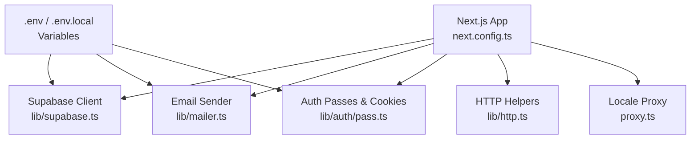
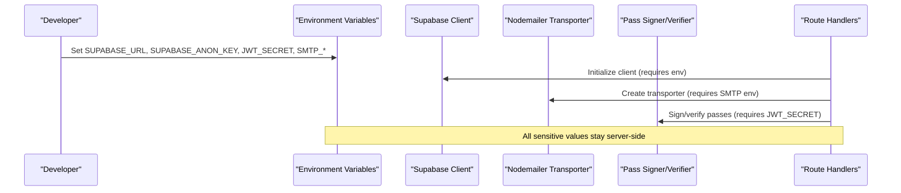
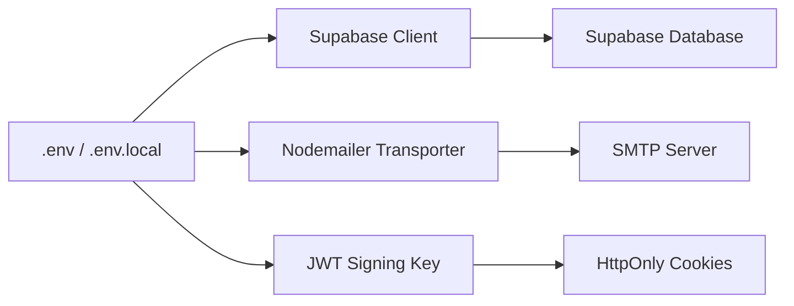

# Environment Setup

<cite>
**Referenced Files in This Document**
- [.env.example](file://.env.example)
- [.env](file://.env)
- [lib/supabase.ts](file://lib/supabase.ts)
- [lib/mailer.ts](file://lib/mailer.ts)
- [lib/auth/pass.ts](file://lib/auth/pass.ts)
- [lib/http.ts](file://lib/http.ts)
- [next.config.ts](file://next.config.ts)
- [package.json](file://package.json)
- [proxy.ts](file://proxy.ts)
</cite>

## Table of Contents
1. Introduction
2. Project Structure
3. Core Components
4. Architecture Overview
5. Detailed Component Analysis
6. Dependency Analysis
7. Performance Considerations
8. Troubleshooting Guide
9. Conclusion
10. Appendices

## Introduction
This document explains how to set up the environment for Agropioo across local development, staging, and production. It covers required environment variables (Supabase credentials, SMTP/email settings, JWT secret), environment differences, variable precedence, security best practices, CORS considerations, error handling patterns, and step-by-step setup instructions.

## Project Structure
Agropioo is a Next.js application that uses:
- Supabase for database and authentication integration
- Nodemailer for sending verification/reset emails via SMTP
- jose for signing short-lived access passes (JWTs) used by cookies
- Standard Next.js routing with optional locale rewriting

**Diagram sources**
- [next.config.ts:1-12](file://next.config.ts#L1-L12)
- [lib/supabase.ts:1-47](file://lib/supabase.ts#L1-L47)
- [lib/mailer.ts:1-85](file://lib/mailer.ts#L1-L85)
- [lib/auth/pass.ts:1-264](file://lib/auth/pass.ts#L1-L264)
- [lib/http.ts:1-61](file://lib/http.ts#L1-L61)
- [proxy.ts:1-31](file://proxy.ts#L1-L31)

**Section sources**
- [next.config.ts:1-12](file://next.config.ts#L1-L12)
- [package.json:1-38](file://package.json#L1-L38)

## Core Components
- Supabase client initialization enforces required environment variables and provides both anon and service-role clients.
- Email transport is configured from SMTP variables; it gracefully degrades when unconfigured and supports a demo mode.
- Authentication pass tokens are signed using HS256 with a secret read from environment variables.
- HTTP helpers standardize error responses and request parsing.

Key environment variables:
- SUPABASE_URL, SUPABASE_ANON_KEY: Required for normal operations.
- SUPABASE_SERVICE_ROLE_KEY: Required for server-side admin tasks only.
- JWT_SECRET: Required for signing auth passes; minimum length enforced.
- SMTP_HOST, SMTP_PORT, SMTP_USER, SMTP_PASSWORD, EMAIL_FROM: Required to send emails.
- DEMO_MODE: Controls demo behavior when SMTP is not configured.

Security notes:
- Sensitive variables must never be exposed to the browser.
- Service role key must only be used on the server.
- Cookie security flags adapt to NODE_ENV for production.

**Section sources**
- [lib/supabase.ts:1-47](file://lib/supabase.ts#L1-L47)
- [lib/mailer.ts:1-85](file://lib/mailer.ts#L1-L85)
- [lib/auth/pass.ts:64-70](file://lib/auth/pass.ts#L64-L70)
- [lib/auth/pass.ts:234-242](file://lib/auth/pass.ts#L234-L242)
- [.env.example:1-21](file://.env.example#L1-L21)

## Architecture Overview
Environment-driven configuration flows into core services:

**Diagram sources**
- [lib/supabase.ts:14-31](file://lib/supabase.ts#L14-L31)
- [lib/mailer.ts:13-37](file://lib/mailer.ts#L13-L37)
- [lib/auth/pass.ts:64-104](file://lib/auth/pass.ts#L64-L104)

## Detailed Component Analysis

### Supabase Configuration
- The client requires SUPABASE_URL and SUPABASE_ANON_KEY; missing values throw an error at runtime.
- An admin client requires SUPABASE_SERVICE_ROLE_KEY and is intended for server-only maintenance scripts.

Setup steps:
1. Obtain your Supabase project URL and anon key from the Supabase dashboard.
2. For server-side scripts, obtain the service role key and keep it secure.
3. Add these values to your environment file (.env.local for dev).

Behavioral notes:
- The client disables session persistence to avoid leaking state in server contexts.
- Admin client bypasses RLS; use only for trusted server tasks.

**Section sources**
- [lib/supabase.ts:14-31](file://lib/supabase.ts#L14-L31)
- [lib/supabase.ts:33-46](file://lib/supabase.ts#L33-L46)

### Email Service (SMTP) Configuration
- The email module checks for SMTP_HOST, SMTP_PORT, SMTP_USER, SMTP_PASSWORD, and EMAIL_FROM.
- If all are present, it creates a Nodemailer transporter and sends emails.
- If SMTP is unconfigured:
  - With DEMO_MODE=true, APIs may return a demo code for display in a clearly labeled banner.
  - Without DEMO_MODE, delivery fails silently on the server side and returns a neutral response.

Setup steps:
1. Choose an SMTP provider (e.g., Gmail, Brevo).
2. Configure SMTP_HOST, SMTP_PORT, SMTP_USER, SMTP_PASSWORD, and EMAIL_FROM.
3. In development, you can enable DEMO_MODE to see codes without real email delivery.

Caveats:
- Do not enable DEMO_MODE in production.
- Errors during sending are logged server-side only; responses remain user-friendly.

**Section sources**
- [lib/mailer.ts:13-37](file://lib/mailer.ts#L13-L37)
- [lib/mailer.ts:41-84](file://lib/mailer.ts#L41-L84)
- [.env.example:12-21](file://.env.example#L12-L21)

### Authentication Secrets (JWT)
- JWT_SECRET is used to sign and verify HS256 tokens for verify/reset/session passes stored in httpOnly cookies.
- Minimum length is enforced; missing or too-short secrets cause startup/runtime errors.

Setup steps:
1. Generate a strong random string (at least 16 characters).
2. Store it in your environment variables.
3. Ensure it differs per environment and is never committed to source control.

Cookie security:
- Secure flag is enabled in production via NODE_ENV.
- Cookies are httpOnly and path-scoped to minimize exposure.

**Section sources**
- [lib/auth/pass.ts:64-70](file://lib/auth/pass.ts#L64-L70)
- [lib/auth/pass.ts:234-242](file://lib/auth/pass.ts#L234-L242)

### HTTP Error Handling
- Uniform error responses are provided for route handlers to ensure consistent client feedback.
- Request body parsing and IP extraction helpers support rate limiting and validation flows.

Usage guidance:
- Use standardized error shapes for all failures.
- Avoid exposing internal details to clients.

**Section sources**
- [lib/http.ts:1-61](file://lib/http.ts#L1-L61)

### Locale Routing and Proxies
- A proxy rewrites requests to include a default locale when none is specified, excluding API and app routes.
- This does not affect environment variables but influences routing behavior.

**Section sources**
- [proxy.ts:1-31](file://proxy.ts#L1-L31)

## Dependency Analysis
Environment variables feed into three main subsystems:

**Diagram sources**
- [lib/supabase.ts:14-31](file://lib/supabase.ts#L14-L31)
- [lib/mailer.ts:13-37](file://lib/mailer.ts#L13-L37)
- [lib/auth/pass.ts:64-104](file://lib/auth/pass.ts#L64-L104)

**Section sources**
- [.env.example:1-21](file://.env.example#L1-L21)
- [package.json:13-24](file://package.json#L13-L24)

## Performance Considerations
- Keep environment lookups minimal; clients are cached after first creation.
- Prefer server-side processing for sensitive logic; avoid heavy work in hot paths.
- Rate limiting is in-memory; ensure single-instance assumptions hold or scale accordingly.

[No sources needed since this section provides general guidance]

## Troubleshooting Guide
Common issues and resolutions:
- Missing Supabase variables: The client throws an explicit error indicating which variables are missing.
- Missing SMTP variables: Email sending is disabled; if DEMO_MODE is true, demo codes may be shown in UI banners.
- Invalid JWT_SECRET: Token signing/verification will fail; ensure the secret meets minimum length requirements.
- Production cookie security: Ensure NODE_ENV is set to production so Secure cookies are applied.

Where to check:
- Supabase client initialization errors.
- Mailer logs for send failures.
- Pass token errors during verification.

**Section sources**
- [lib/supabase.ts:17-24](file://lib/supabase.ts#L17-L24)
- [lib/mailer.ts:54-84](file://lib/mailer.ts#L54-L84)
- [lib/auth/pass.ts:64-70](file://lib/auth/pass.ts#L64-L70)

## Conclusion
Properly configuring environment variables is essential for Agropioo’s operation. Follow the steps below to set up each environment securely and consistently. Use separate files per environment, enforce strict variable presence, and apply production-grade security flags.

## Appendices

### Environment Variables Reference
- SUPABASE_URL: Supabase project URL.
- SUPABASE_ANON_KEY: Public anon key for client access.
- SUPABASE_SERVICE_ROLE_KEY: Server-only admin key for privileged operations.
- JWT_SECRET: HS256 signing secret for auth passes; minimum length enforced.
- SMTP_HOST, SMTP_PORT, SMTP_USER, SMTP_PASSWORD, EMAIL_FROM: SMTP configuration for sending emails.
- DEMO_MODE: Enables demo code display when SMTP is unconfigured; do not enable in production.

**Section sources**
- [.env.example:1-21](file://.env.example#L1-L21)

### Variable Precedence
- Next.js loads environment variables from .env files based on environment context.
- Local overrides typically take precedence over base .env files.
- Ensure sensitive values are only present in appropriate environment files and never committed to version control.

[No sources needed since this section provides general guidance]

### Security Best Practices
- Never hardcode secrets; always use environment variables.
- Restrict service role keys to server-side scripts only.
- Use strong, unique secrets per environment.
- Enable Secure cookies in production via NODE_ENV.
- Log errors server-side; avoid leaking internals to clients.

**Section sources**
- [lib/auth/pass.ts:234-242](file://lib/auth/pass.ts#L234-L242)
- [lib/http.ts:1-25](file://lib/http.ts#L1-L25)

### CORS Policies
- CORS is typically managed at the platform level (e.g., hosting provider or reverse proxy).
- Ensure your frontend origins are allowed by your deployment environment.
- If using a custom proxy, configure allowed origins and methods appropriately.

[No sources needed since this section provides general guidance]

### Step-by-Step Setup Instructions

#### Local Development
1. Install dependencies and start the dev server using the project scripts.
2. Copy the example environment file and fill in required values:
   - SUPABASE_URL, SUPABASE_ANON_KEY
   - JWT_SECRET (minimum length)
   - SMTP_* and EMAIL_FROM (optional; if omitted, enable DEMO_MODE to test flows)
3. Run migrations in Supabase if needed.
4. Start the app and verify health endpoints and login/signup flows.

**Section sources**
- [package.json:5-12](file://package.json#L5-L12)
- [.env.example:1-21](file://.env.example#L1-L21)

#### Staging
1. Provision a dedicated Supabase project and generate new keys.
2. Set environment variables in your staging environment:
   - SUPABASE_URL, SUPABASE_ANON_KEY
   - SUPABASE_SERVICE_ROLE_KEY (for server scripts)
   - JWT_SECRET (unique per environment)
   - SMTP_* and EMAIL_FROM
3. Disable DEMO_MODE.
4. Build and deploy; validate end-to-end flows including email delivery.

**Section sources**
- [lib/supabase.ts:33-46](file://lib/supabase.ts#L33-L46)
- [lib/mailer.ts:13-37](file://lib/mailer.ts#L13-L37)

#### Production
1. Provision production Supabase project and credentials.
2. Configure environment variables securely via your platform’s secret manager.
3. Ensure NODE_ENV=production so Secure cookies are applied.
4. Configure SMTP with production-grade credentials.
5. Disable DEMO_MODE.
6. Build and deploy; monitor logs for errors and performance.

**Section sources**
- [lib/auth/pass.ts:234-242](file://lib/auth/pass.ts#L234-L242)
- [lib/mailer.ts:54-84](file://lib/mailer.ts#L54-L84)

### How to Generate Secure Keys
- JWT_SECRET: Generate a cryptographically strong random string meeting the minimum length requirement.
- Supabase keys: Create them in the Supabase dashboard; rotate periodically.
- SMTP credentials: Use provider-specific app passwords or service accounts with least privilege.

**Section sources**
- [.env.example:8-10](file://.env.example#L8-L10)

### Error Handling in Different Environments
- Development: You may enable DEMO_MODE to view codes without sending emails.
- Staging/Production: Always configure SMTP; errors are logged server-side and surfaced neutrally to users.
- Use standardized error responses for consistent client handling.

**Section sources**
- [lib/mailer.ts:41-84](file://lib/mailer.ts#L41-L84)
- [lib/http.ts:11-25](file://lib/http.ts#L11-L25)