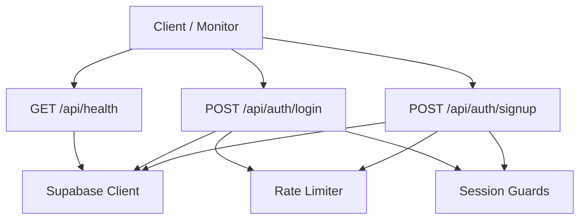
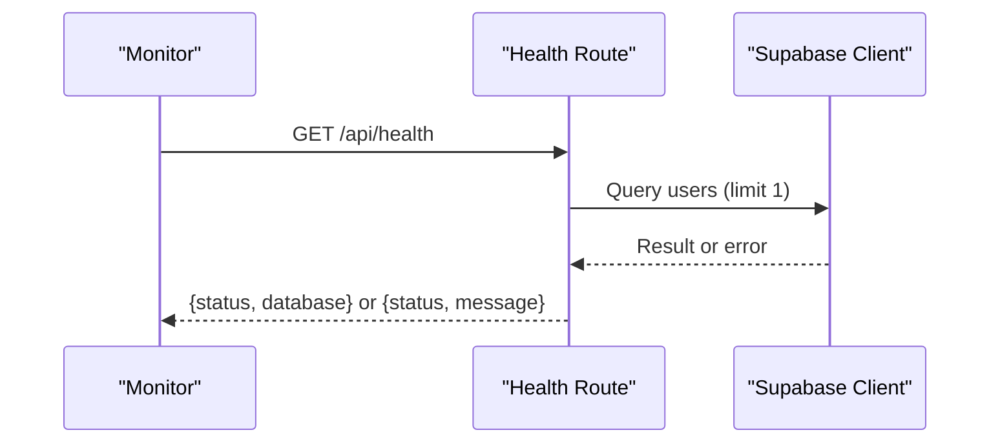
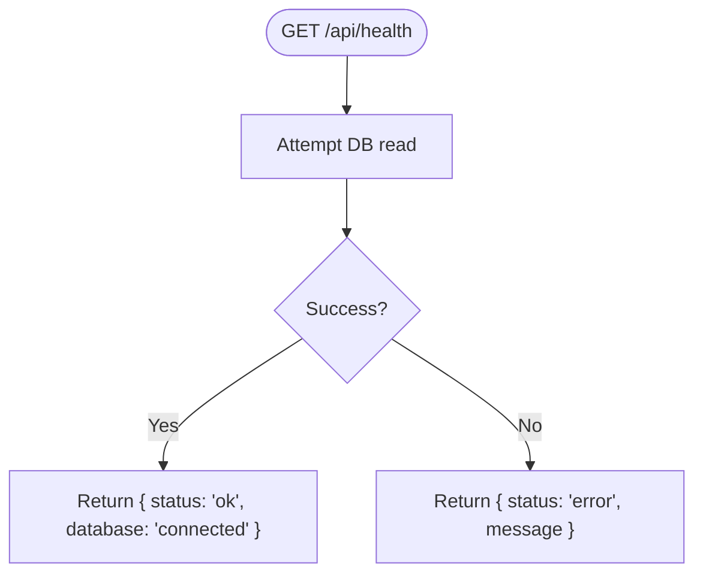
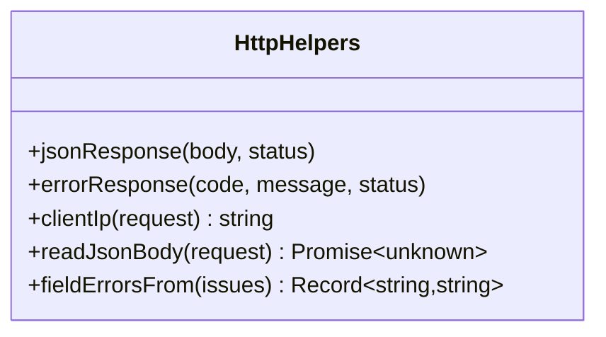
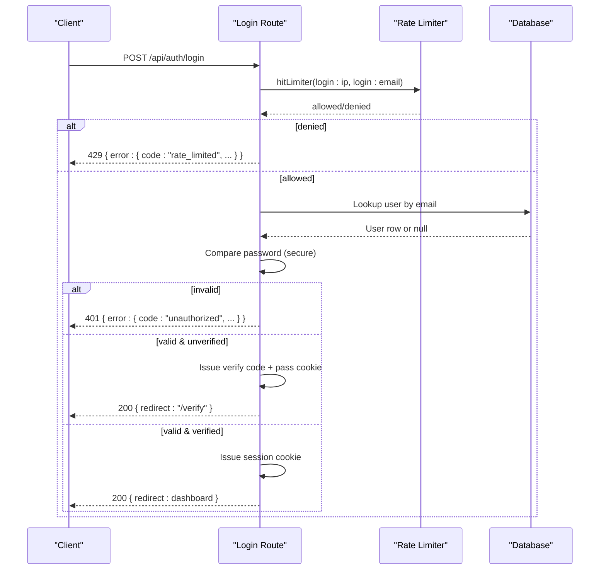
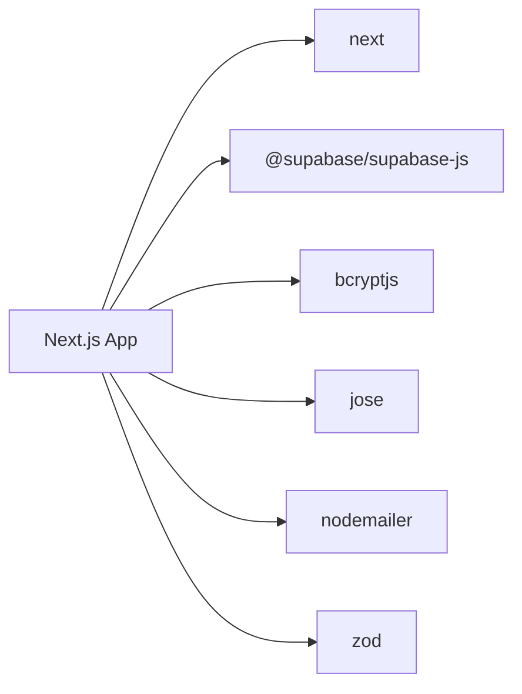

# Production Monitoring

<cite>
**Referenced Files in This Document**
- [route.ts](file://app/api/health/route.ts)
- [http.ts](file://lib/http.ts)
- [supabase.ts](file://lib/supabase.ts)
- [route.ts](file://app/api/auth/login/route.ts)
- [route.ts](file://app/api/auth/signup/route.ts)
- [rate-limit.ts](file://lib/auth/rate-limit.ts)
- [guards.ts](file://lib/auth/guards.ts)
- [package.json](file://package.json)
</cite>

## Table of Contents
1. Introduction
2. Project Structure
3. Core Components
4. Architecture Overview
5. Detailed Component Analysis
6. Dependency Analysis
7. Performance Considerations
8. Troubleshooting Guide
9. Conclusion

## Introduction
This document defines production monitoring for Agropioo, an agricultural platform serving rural users. It covers health check endpoints, performance metrics collection, error tracking strategies, logging best practices, structured logging formats, log aggregation setup, application monitoring (Sentry), analytics integration, user experience monitoring, database query performance monitoring, API response time tracking, infrastructure health checks, alerting strategies, incident response procedures, and production debugging techniques tailored to the platform’s context.

## Project Structure
Agropioo is a Next.js application with server-side route handlers under app/api. Health and authentication routes implement consistent error handling and rate limiting. Database access uses Supabase via a shared client module. Rate limiting is implemented in-process for single-instance deployments.

**Diagram sources**
- [route.ts:3-16](file://app/api/health/route.ts#L3-L16)
- [route.ts:41-110](file://app/api/auth/login/route.ts#L41-L110)
- [route.ts:27-117](file://app/api/auth/signup/route.ts#L27-L117)
- [supabase.ts:14-31](file://lib/supabase.ts#L14-L31)
- [rate-limit.ts:32-47](file://lib/auth/rate-limit.ts#L32-L47)
- [guards.ts:18-37](file://lib/auth/guards.ts#L18-L37)

**Section sources**
- [route.ts:3-16](file://app/api/health/route.ts#L3-L16)
- [route.ts:41-110](file://app/api/auth/login/route.ts#L41-L110)
- [route.ts:27-117](file://app/api/auth/signup/route.ts#L27-L117)
- [supabase.ts:14-31](file://lib/supabase.ts#L14-L31)
- [rate-limit.ts:32-47](file://lib/auth/rate-limit.ts#L32-L47)
- [guards.ts:18-37](file://lib/auth/guards.ts#L18-L37)

## Core Components
- Health endpoint: Probes database connectivity and returns a simple status payload.
- HTTP helpers: Provide uniform success/error responses, IP extraction, JSON body parsing, and validation error mapping.
- Supabase client: Singleton clients for anon and admin roles; validates environment variables at startup.
- Authentication routes: Enforce rate limits, validate inputs, perform secure password checks, manage verification flows, and set session cookies.
- Rate limiter: In-process fixed-window limiter protecting login/signup and code flows.
- Session guards: Centralized protection for pages and APIs.

**Section sources**
- [route.ts:3-16](file://app/api/health/route.ts#L3-L16)
- [http.ts:11-25](file://lib/http.ts#L11-L25)
- [http.ts:27-48](file://lib/http.ts#L27-L48)
- [supabase.ts:6-31](file://lib/supabase.ts#L6-L31)
- [route.ts:41-110](file://app/api/auth/login/route.ts#L41-L110)
- [route.ts:27-117](file://app/api/auth/signup/route.ts#L27-L117)
- [rate-limit.ts:12-25](file://lib/auth/rate-limit.ts#L12-L25)
- [rate-limit.ts:32-47](file://lib/auth/rate-limit.ts#L32-L47)
- [guards.ts:18-37](file://lib/auth/guards.ts#L18-L37)

## Architecture Overview
The monitoring architecture centers on:
- A health probe that verifies database reachability.
- Consistent error shapes across all API routes for reliable error tracking.
- Rate limiting to protect sensitive endpoints from abuse.
- Structured logging points around critical operations (auth flows).
- Optional instrumentation hooks for metrics and tracing.

**Diagram sources**
- [route.ts:3-16](file://app/api/health/route.ts#L3-L16)
- [supabase.ts:14-31](file://lib/supabase.ts#L14-L31)

## Detailed Component Analysis

### Health Check Endpoint
- Purpose: Validate service liveness and database connectivity.
- Behavior: Attempts a minimal read from the users table; returns ok when successful, otherwise returns an error with details.
- Observability: Suitable for uptime probes and readiness checks.

**Diagram sources**
- [route.ts:3-16](file://app/api/health/route.ts#L3-L16)

**Section sources**
- [route.ts:3-16](file://app/api/health/route.ts#L3-L16)

### HTTP Response Helpers and Error Tracking
- Uniform error shape: All failures return { error: { code, message } } with appropriate HTTP status codes.
- Standard codes: validation_error, unauthorized, conflict_registered, rate_limited, server_error.
- Utilities: JSON response builder, error response builder, IP extraction for rate limiting, safe JSON body parsing, and field error flattening for validation errors.

**Diagram sources**
- [http.ts:11-25](file://lib/http.ts#L11-L25)
- [http.ts:27-48](file://lib/http.ts#L27-L48)
- [http.ts:50-60](file://lib/http.ts#L50-L60)

**Section sources**
- [http.ts:11-25](file://lib/http.ts#L11-L25)
- [http.ts:27-48](file://lib/http.ts#L27-L48)
- [http.ts:50-60](file://lib/http.ts#L50-L60)

### Authentication Routes: Login and Signup
- Input validation: Uses Zod schemas to validate payloads before processing.
- Rate limiting: Dual-dimension limits per IP and per email to mitigate brute force and abuse.
- Security: Compares passwords securely; unknown emails are handled with constant-time-like behavior by comparing against a dummy hash.
- Verification flow: Unverified accounts receive a fresh verification code and pass cookie; verified accounts receive a session cookie and redirect.
- Error handling: Errors map to the standard error shape; catch blocks log messages and return server_error.

**Diagram sources**
- [route.ts:41-110](file://app/api/auth/login/route.ts#L41-L110)
- [rate-limit.ts:32-47](file://lib/auth/rate-limit.ts#L32-L47)

**Section sources**
- [route.ts:41-110](file://app/api/auth/login/route.ts#L41-L110)
- [route.ts:27-117](file://app/api/auth/signup/route.ts#L27-L117)
- [rate-limit.ts:12-25](file://lib/auth/rate-limit.ts#L12-L25)
- [rate-limit.ts:32-47](file://lib/auth/rate-limit.ts#L32-L47)

### Supabase Client and Environment Validation
- Provides anon and admin clients with singleton caching.
- Validates required environment variables at initialization; throws descriptive errors if missing.
- Admin client bypasses RLS for trusted server tasks only.

**Section sources**
- [supabase.ts:6-31](file://lib/supabase.ts#L6-L31)
- [supabase.ts:33-46](file://lib/supabase.ts#L33-L46)

### Session Guards
- Centralized entry points to enforce session requirements for pages and APIs.
- Redirects guests to login; protects authenticated routes.

**Section sources**
- [guards.ts:18-37](file://lib/auth/guards.ts#L18-L37)

## Dependency Analysis
Key runtime dependencies relevant to monitoring:
- Next.js framework for routing and serverless functions.
- Supabase client for database access.
- bcryptjs for password hashing.
- jose for JWT-based passes.
- nodemailer for sending verification codes.
- zod for input validation.

**Diagram sources**
- [package.json:13-24](file://package.json#L13-L24)

**Section sources**
- [package.json:13-24](file://package.json#L13-L24)

## Performance Considerations
- Database queries: The health check performs a minimal select with limit 1 to minimize load while validating connectivity.
- Rate limiting: Protects CPU and database resources during bursts; consider moving to Redis for multi-instance deployments.
- Password hashing: Use appropriate cost factors; current implementation balances security and latency.
- Cold starts: Keep route handlers lean; defer heavy work off the request path where possible.
- Metrics hooks: Add timing around DB calls and external services to capture p95/p99 latencies.

[No sources needed since this section provides general guidance]

## Troubleshooting Guide
- Health endpoint failures: Indicates database connectivity issues or misconfigured environment variables.
- Authentication errors:
  - 401 unauthorized: Invalid credentials or unverified account requiring verification flow.
  - 429 rate limited: Exceeded per-IP or per-email limits; adjust thresholds or investigate abuse.
  - 409 conflict: Email already registered and verified.
  - 400 validation_error: Malformed or missing fields; use fieldErrorsFrom to present user-friendly messages.
  - 500 server_error: Unexpected exceptions; check logs and stack traces.
- Logging: Catch blocks in auth routes log errors; ensure structured logging captures context such as route, method, IP, and user hints without secrets.
- Environment: Missing SUPABASE_URL or keys will throw at client creation; verify deployment configuration.

**Section sources**
- [route.ts:3-16](file://app/api/health/route.ts#L3-L16)
- [route.ts:41-110](file://app/api/auth/login/route.ts#L41-L110)
- [route.ts:27-117](file://app/api/auth/signup/route.ts#L27-L117)
- [http.ts:11-25](file://lib/http.ts#L11-L25)
- [http.ts:50-60](file://lib/http.ts#L50-L60)
- [supabase.ts:6-31](file://lib/supabase.ts#L6-L31)

## Conclusion
Agropioo implements a solid foundation for production monitoring through a health endpoint, standardized error responses, and robust authentication safeguards. To fully operationalize monitoring, integrate structured logging, metrics collection, error tracking (e.g., Sentry), analytics, and alerting tailored to rural user contexts. Prioritize low-latency paths, resilient database checks, and clear observability signals to maintain reliability and trust for farmers and stakeholders.