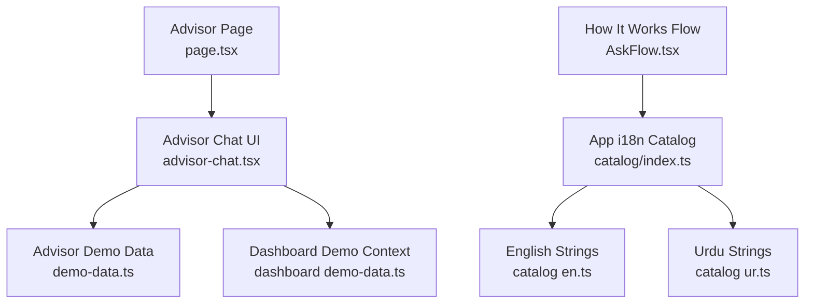
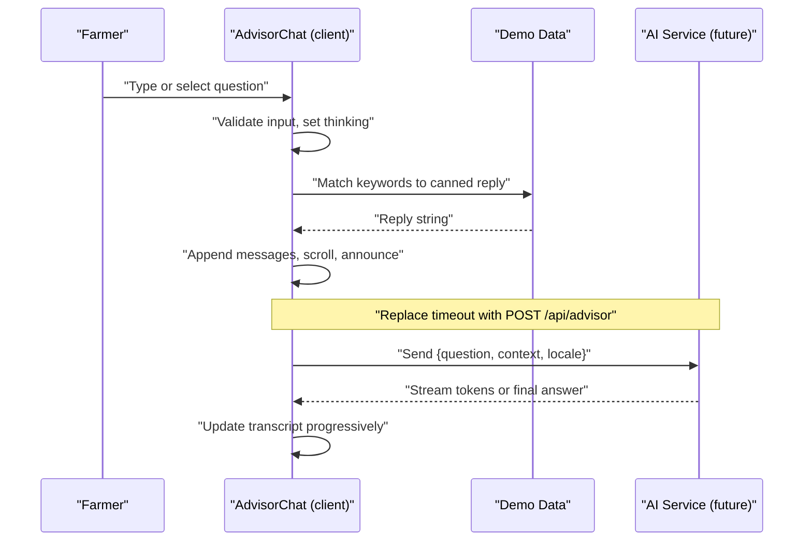
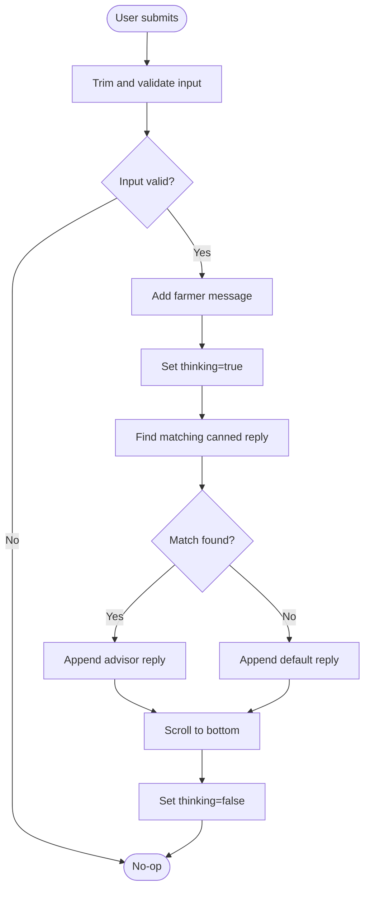
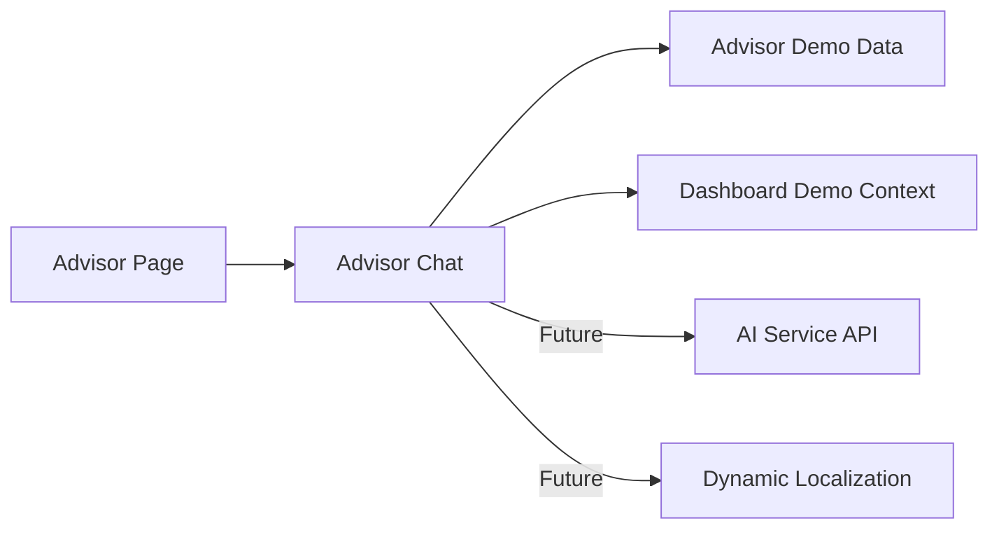

# AI Agriculture Advisor

<cite>
**Referenced Files in This Document**
- [advisor-chat.tsx](file://app/(farmer)/(dashboard)/advisor/advisor-chat.tsx)
- [demo-data.ts](file://app/(farmer)/(dashboard)/advisor/demo-data.ts)
- [page.tsx](file://app/(farmer)/(dashboard)/advisor/page.tsx)
- [dashboard demo-data.ts](file://app/(farmer)/(dashboard)/dashboard/demo-data.ts)
- [catalog index.ts](file://catalog/index.ts)
- [catalog en.ts](file://catalog/en.ts)
- [catalog ur.ts](file://catalog/ur.ts)
- [http.ts](file://lib/http.ts)
- [AskFlow.tsx](file://app/(site)/[locale]/how-it-works/sections/AskFlow.tsx)
</cite>

## Table of Contents
1. Introduction
2. Project Structure
3. Core Components
4. Architecture Overview
5. Detailed Component Analysis
6. Dependency Analysis
7. Performance Considerations
8. Troubleshooting Guide
9. Conclusion
10. Appendices

## Introduction
This document explains the AI Agriculture Advisor feature for Agropioo. It covers the natural language Q&A interface, context-aware recommendation engine design, multi-language support for farming queries, chat message handling, integration points with AI services, conversation state management, response streaming strategy, prompt engineering guidance, error handling and fallbacks, performance optimization, message caching, and accessibility for farmers with varying literacy levels.

The current implementation is a UI-only demo that simulates advisor responses using keyword-matched canned replies. The architecture is designed to be extended into a real AI-powered system while preserving farmer context (crop, location, weather, history) and delivering localized, accessible experiences.

## Project Structure
The advisor feature lives under the farmer dashboard route group and consists of:
- A page component that renders the advisor header and chat container
- A client-side chat component managing messages, input, suggestions, and simulated responses
- Demo data defining suggested questions, canned replies, and an opening message
- Shared dashboard demo data providing farmer profile, advisory snapshot, and weather context used by the chat UI
- A translation catalog enabling multi-language support across the app, including advisor-related strings

**Diagram sources**
- [page.tsx:1-23](file://app/(farmer)/(dashboard)/advisor/page.tsx#L1-L23)
- [advisor-chat.tsx:1-170](file://app/(farmer)/(dashboard)/advisor/advisor-chat.tsx#L1-L170)
- [demo-data.ts:1-44](file://app/(farmer)/(dashboard)/advisor/demo-data.ts#L1-L44)
- [dashboard demo-data.ts:1-136](file://app/(farmer)/(dashboard)/dashboard/demo-data.ts#L1-L136)
- [catalog index.ts:1-41](file://catalog/index.ts#L1-L41)
- [catalog en.ts:1-708](file://catalog/en.ts#L1-L708)
- [catalog ur.ts:1-702](file://catalog/ur.ts#L1-L702)
- [AskFlow.tsx:1-13](file://app/(site)/[locale]/how-it-works/sections/AskFlow.tsx#L1-L13)

**Section sources**
- [page.tsx:1-23](file://app/(farmer)/(dashboard)/advisor/page.tsx#L1-L23)
- [advisor-chat.tsx:1-170](file://app/(farmer)/(dashboard)/advisor/advisor-chat.tsx#L1-L170)
- [demo-data.ts:1-44](file://app/(farmer)/(dashboard)/advisor/demo-data.ts#L1-L44)
- [dashboard demo-data.ts:1-136](file://app/(farmer)/(dashboard)/dashboard/demo-data.ts#L1-L136)
- [catalog index.ts:1-41](file://catalog/index.ts#L1-L41)
- [catalog en.ts:1-708](file://catalog/en.ts#L1-L708)
- [catalog ur.ts:1-702](file://catalog/ur.ts#L1-L702)
- [AskFlow.tsx:1-13](file://app/(site)/[locale]/how-it-works/sections/AskFlow.tsx#L1-L13)

## Core Components
- Advisor Page: Renders the advisor header and embeds the chat component.
- Advisor Chat: Client-side React component that manages conversation state, user input, suggestion chips, and simulated advisor replies.
- Advisor Demo Data: Defines suggested questions, canned replies keyed by keywords, default reply, and opening message.
- Dashboard Demo Context: Provides farmer identity, farm details, advisory snapshot, and weather context consumed by the chat UI.
- Translation Catalog: Centralized keys and translations for UI text, including advisor-related content.

Key responsibilities:
- Message lifecycle: add farmer message, show thinking state, append advisor message, scroll to latest
- Keyword matching: map user question to canned reply or default
- Accessibility: live region announcements, screen-reader labels, keyboard-friendly controls
- Multi-language readiness: structured catalog keys and locale-aware rendering elsewhere in the app

**Section sources**
- [page.tsx:1-23](file://app/(farmer)/(dashboard)/advisor/page.tsx#L1-L23)
- [advisor-chat.tsx:1-170](file://app/(farmer)/(dashboard)/advisor/advisor-chat.tsx#L1-L170)
- [demo-data.ts:1-44](file://app/(farmer)/(dashboard)/advisor/demo-data.ts#L1-L44)
- [dashboard demo-data.ts:1-136](file://app/(farmer)/(dashboard)/dashboard/demo-data.ts#L1-L136)
- [catalog index.ts:1-41](file://catalog/index.ts#L1-L41)

## Architecture Overview
The advisor flow currently runs entirely on the client:
- User types or selects a suggested question
- The chat component validates input, updates local state, and simulates a delay
- A canned reply is selected via keyword matching and appended to the transcript
- The transcript auto-scrolls and announces updates to assistive technologies

Future extension points:
- Replace the simulated reply with a server call to an AI service
- Stream tokens to update the UI incrementally
- Preserve conversation context (farm, crop, stage, weather, history) in each request
- Localize responses based on the active language

**Diagram sources**
- [advisor-chat.tsx:38-63](file://app/(farmer)/(dashboard)/advisor/advisor-chat.tsx#L38-L63)
- [demo-data.ts:15-44](file://app/(farmer)/(dashboard)/advisor/demo-data.ts#L15-L44)

**Section sources**
- [advisor-chat.tsx:38-63](file://app/(farmer)/(dashboard)/advisor/advisor-chat.tsx#L38-L63)
- [demo-data.ts:15-44](file://app/(farmer)/(dashboard)/advisor/demo-data.ts#L15-L44)

## Detailed Component Analysis

### Advisor Chat Component
Responsibilities:
- Manage message list, draft input, and thinking state
- Auto-scroll to newest message
- Select canned reply via keyword matching
- Provide suggestion chips and a contextual “About my farm today?” chip
- Ensure accessibility with aria-live region and labels

Implementation highlights:
- Message type defines id, role, and text
- Opening message seeds the first advisor message
- Keyword matching uses lowercase normalization and substring checks
- Simulated delay mimics network latency; replace with API call later

**Diagram sources**
- [advisor-chat.tsx:38-63](file://app/(farmer)/(dashboard)/advisor/advisor-chat.tsx#L38-L63)

**Section sources**
- [advisor-chat.tsx:15-63](file://app/(farmer)/(dashboard)/advisor/advisor-chat.tsx#L15-L63)
- [advisor-chat.tsx:72-101](file://app/(farmer)/(dashboard)/advisor/advisor-chat.tsx#L72-L101)

### Advisor Demo Data
Defines:
- Suggested questions to guide users
- Canned replies mapped to keywords covering irrigation, pests, fertilizer, and prices
- Default reply when no match is found
- Opening message to seed the conversation

Design notes:
- Keywords include both English and local terms to improve matching
- Replies are written in plain language suitable for farmers
- Extensible structure allows adding new topics without changing logic

**Section sources**
- [demo-data.ts:4-44](file://app/(farmer)/(dashboard)/advisor/demo-data.ts#L4-L44)

### Dashboard Demo Context
Provides:
- Farmer identity and location
- Advisory snapshot (crop, stage, action, why)
- Weather summary (location, condition, temperature, rain note)
- Alerts and farms for broader dashboard context

Usage in advisor:
- The chat references farmer and advisory context to craft contextual suggestion chips and future personalized prompts

**Section sources**
- [dashboard demo-data.ts:33-65](file://app/(farmer)/(dashboard)/dashboard/demo-data.ts#L33-L65)

### Multi-Language Support
The app maintains a typed translation catalog with multiple locales. While the advisor chat currently uses static demo text, the surrounding system demonstrates how localized strings are organized and served. Future advisor responses should be localized through the same catalog mechanism or a dedicated localization layer for dynamic content.

Key elements:
- Central catalog mapping locales to partial key-value maps
- English source of truth with comprehensive keys
- Urdu translation mirroring keys
- How-it-works section shows localized chips for crop, district, weather, and history

**Section sources**
- [catalog index.ts:13-41](file://catalog/index.ts#L13-L41)
- [catalog en.ts:236-259](file://catalog/en.ts#L236-L259)
- [catalog ur.ts:236-256](file://catalog/ur.ts#L236-L256)
- [AskFlow.tsx:1-13](file://app/(site)/[locale]/how-it-works/sections/AskFlow.tsx#L1-L13)

## Dependency Analysis
Current dependencies:
- Advisor Page depends on the chat component and shell header
- Chat component depends on demo data and dashboard demo context
- Catalog provides shared localization infrastructure used elsewhere in the app

Potential runtime dependencies:
- AI service endpoint (e.g., POST /api/advisor)
- Streaming transport (Server-Sent Events or WebSocket)
- Context provider (farm profile, weather, records)
- Localization service for dynamic advisor responses

**Diagram sources**
- [page.tsx:1-23](file://app/(farmer)/(dashboard)/advisor/page.tsx#L1-L23)
- [advisor-chat.tsx:1-170](file://app/(farmer)/(dashboard)/advisor/advisor-chat.tsx#L1-L170)
- [demo-data.ts:1-44](file://app/(farmer)/(dashboard)/advisor/demo-data.ts#L1-L44)
- [dashboard demo-data.ts:1-136](file://app/(farmer)/(dashboard)/dashboard/demo-data.ts#L1-L136)

**Section sources**
- [page.tsx:1-23](file://app/(farmer)/(dashboard)/advisor/page.tsx#L1-L23)
- [advisor-chat.tsx:1-170](file://app/(farmer)/(dashboard)/advisor/advisor-chat.tsx#L1-L170)

## Performance Considerations
- Keep message list bounded: virtualize or paginate older messages if conversations grow long
- Debounce rapid inputs and avoid duplicate sends during thinking state
- Use incremental UI updates for streaming responses to reduce reflows
- Cache repeated suggestions and canned replies locally
- Minimize layout shifts by reserving space for typing indicators
- Prefer lightweight DOM operations; avoid unnecessary re-renders by memoizing message lists where appropriate

[No sources needed since this section provides general guidance]

## Troubleshooting Guide
Common issues and resolutions:
- Empty or invalid input: ensure trimming and guard against sending empty drafts
- Duplicate messages: prevent concurrent sends by disabling input while thinking
- Stuck thinking state: reset thinking flag after reply is appended
- Accessibility gaps: verify aria-live region updates and screen reader announcements
- Network errors (future): handle timeouts, retries, and fallback to cached or canned responses
- Standardized error shape: use consistent error bodies and status codes from HTTP helpers

Error handling patterns:
- Uniform error responses with code and message
- Client classification of retryable vs. eject scenarios
- Graceful degradation when AI services are unavailable

**Section sources**
- [http.ts:1-61](file://lib/http.ts#L1-L61)
- [verify-screen.tsx:32-57](file://app/(farmer)/verify/verify-screen.tsx#L32-L57)

## Conclusion
The AI Agriculture Advisor currently provides a robust, accessible chat UI with seeded context and keyword-matched replies. It is structured to evolve into a full AI-driven system with context-aware recommendations, streaming responses, and localized outputs. By integrating farm profile, weather, and records into each request, the advisor can deliver precise, actionable guidance tailored to each farmer’s situation.

[No sources needed since this section summarizes without analyzing specific files]

## Appendices

### Prompt Engineering Guidance for Agricultural Advice
When wiring up the AI service, construct prompts that include:
- User question
- Farm context: crop, growth stage, location, sowing date
- Weather: forecast, alerts, recent conditions
- History: last actions (irrigation, fertilizers, sprays), dates, doses
- Constraints: safety thresholds, regional best practices, language preference

Example prompt structure:
- Role: expert agronomist advising a farmer
- Context block: crop, stage, location, weather, history
- Task: provide clear, actionable steps in the farmer’s language
- Safety: avoid unsafe advice; prefer conservative recommendations when uncertain
- Output: concise steps, timing, and rationale

[No sources needed since this section provides general guidance]

### Conversation State Management
- Maintain a message list with unique ids and roles
- Persist conversation in session storage or backend for continuity across sessions
- Track last read position and auto-scroll behavior
- Store user preferences (language, units, region) alongside messages

[No sources needed since this section provides general guidance]

### Response Streaming Strategy
- Use Server-Sent Events or WebSocket to stream tokens
- Update UI incrementally to show progress
- Buffer partial responses until complete sentence boundaries
- Handle interruptions and resume safely

[No sources needed since this section provides general guidance]

### Fallback Mechanisms When AI Services Are Unavailable
- Detect connectivity or service health
- Fall back to canned replies or cached knowledge base
- Queue requests for retry when service recovers
- Inform users clearly about degraded mode

**Section sources**
- [http.ts:1-61](file://lib/http.ts#L1-L61)

### Accessibility Features for Farmers With Different Literacy Levels
- Large touch targets and high contrast for outdoor readability
- Clear labels and placeholders in local languages
- Screen reader support via aria-live regions and descriptive labels
- Simple navigation and minimal typing; leverage suggestion chips
- Optional voice input in future builds

**Section sources**
- [advisor-chat.tsx:72-101](file://app/(farmer)/(dashboard)/advisor/advisor-chat.tsx#L72-L101)