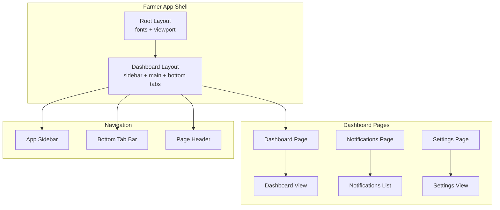
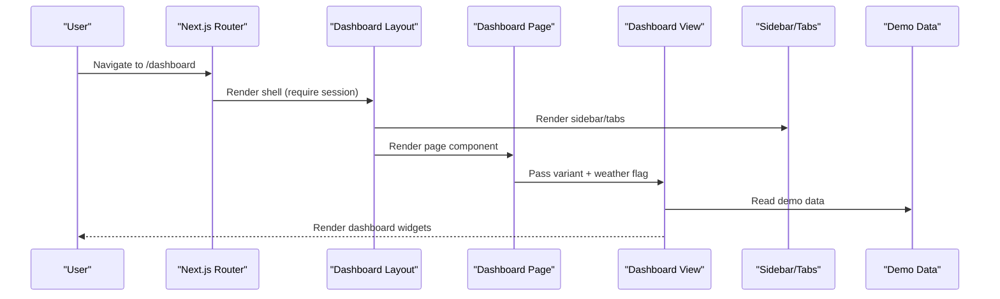
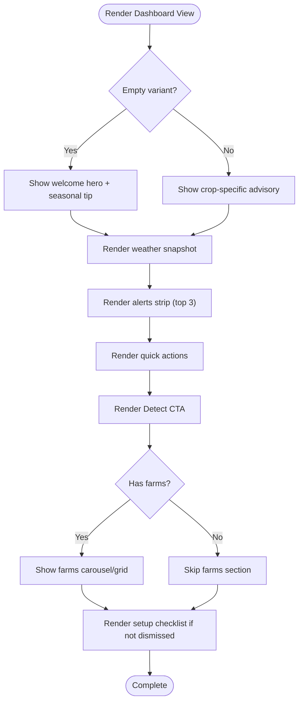
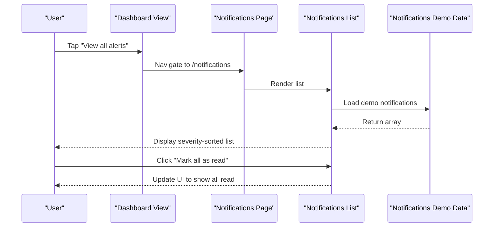
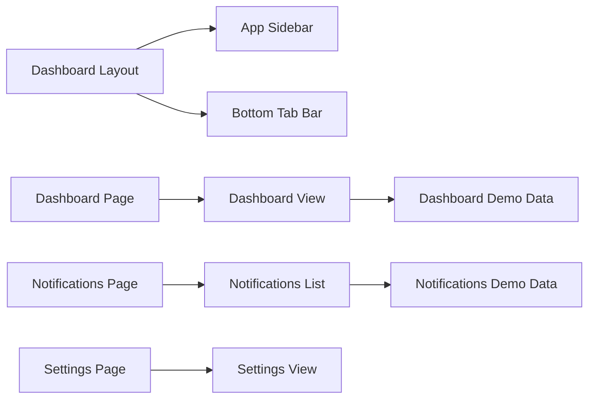

# Dashboard Overview & Navigation

<cite>
**Referenced Files in This Document**
- [layout.tsx](file://app/(farmer)/layout.tsx)
- [layout.tsx](file://app/(farmer)/(dashboard)/layout.tsx)
- [page.tsx](file://app/(farmer)/(dashboard)/dashboard/page.tsx)
- [dashboard-view.tsx](file://app/(farmer)/(dashboard)/dashboard/dashboard-view.tsx)
- [demo-data.ts](file://app/(farmer)/(dashboard)/dashboard/demo-data.ts)
- [app-sidebar.tsx](file://components/shell/app-sidebar.tsx)
- [bottom-tab-bar.tsx](file://components/shell/bottom-tab-bar.tsx)
- [page-header.tsx](file://components/shell/page-header.tsx)
- [page.tsx](file://app/(farmer)/(dashboard)/settings/page.tsx)
- [settings-view.tsx](file://app/(farmer)/(dashboard)/settings/settings-view.tsx)
- [page.tsx](file://app/(farmer)/(dashboard)/notifications/page.tsx)
- [notifications-list.tsx](file://app/(farmer)/(dashboard)/notifications/notifications-list.tsx)
- [demo-data.ts](file://app/(farmer)/(dashboard)/notifications/demo-data.ts)
- [spec.md](file://specs/dashboard/spec.md)
- [research.md](file://specs/dashboard/research.md)
</cite>

## Table of Contents
1. [Introduction](#introduction)
2. [Project Structure](#project-structure)
3. [Core Components](#core-components)
4. [Architecture Overview](#architecture-overview)
5. [Detailed Component Analysis](#detailed-component-analysis)
6. [Dependency Analysis](#dependency-analysis)
7. [Performance Considerations](#performance-considerations)
8. [Troubleshooting Guide](#troubleshooting-guide)
9. [Conclusion](#conclusion)
10. [Appendices](#appendices)

## Introduction
This document explains Agropioo’s farmer dashboard overview and navigation system. It covers the main dashboard layout, responsive navigation (desktop sidebar vs mobile bottom tabs), notification system, settings management, widget composition, data aggregation patterns, state management for UI-only demo features, and performance considerations tailored to rural usage patterns. The implementation is a UI-only demo build using typed mock data, with clear boundaries for future backend integration.

## Project Structure
The farmer app uses Next.js route groups:
- A root farmer app layout sets fonts and viewport.
- A dashboard layout composes the desktop sidebar and mobile bottom tab bar around page content.
- The dashboard page renders a view component that orchestrates widgets: advisory, weather, alerts, quick actions, detect CTA, farms overview, and setup checklist.
- Settings and notifications are separate pages with their own views and demo data.

**Diagram sources**
- [layout.tsx](file://app/(farmer)/layout.tsx)
- [layout.tsx](file://app/(farmer)/(dashboard)/layout.tsx)
- [page.tsx](file://app/(farmer)/(dashboard)/dashboard/page.tsx)
- [dashboard-view.tsx](file://app/(farmer)/(dashboard)/dashboard/dashboard-view.tsx)
- [app-sidebar.tsx](file://components/shell/app-sidebar.tsx)
- [bottom-tab-bar.tsx](file://components/shell/bottom-tab-bar.tsx)
- [page-header.tsx](file://components/shell/page-header.tsx)
- [page.tsx](file://app/(farmer)/(dashboard)/notifications/page.tsx)
- [notifications-list.tsx](file://app/(farmer)/(dashboard)/notifications/notifications-list.tsx)
- [page.tsx](file://app/(farmer)/(dashboard)/settings/page.tsx)
- [settings-view.tsx](file://app/(farmer)/(dashboard)/settings/settings-view.tsx)

**Section sources**
- [layout.tsx](file://app/(farmer)/layout.tsx)
- [layout.tsx](file://app/(farmer)/(dashboard)/layout.tsx)
- [page.tsx](file://app/(farmer)/(dashboard)/dashboard/page.tsx)

## Core Components
- Dashboard layout: Enforces session requirement and provides the shell with desktop sidebar and mobile bottom tabs.
- Dashboard view: Orchestrates widgets, manages local UI state (e.g., profile menu, checklist dismissal), and renders empty/default variants based on URL search params.
- Navigation:
  - Desktop: fixed left sidebar with active state detection via pathname.
  - Mobile: fixed bottom tab bar with exactly five tabs per spec.
- Notifications list: Displays severity-styled alerts with “mark all as read” session state.
- Settings view: Profile summary, language availability list, alert toggles (session-only), and sign-out link.

Key behaviors:
- Responsive navigation adapts at lg breakpoint.
- Active navigation highlighting uses exact or prefix matching against current pathname.
- Demo data modules provide consistent mock datasets across dashboard and notifications screens.

**Section sources**
- [layout.tsx](file://app/(farmer)/(dashboard)/layout.tsx)
- [dashboard-view.tsx](file://app/(farmer)/(dashboard)/dashboard/dashboard-view.tsx)
- [app-sidebar.tsx](file://components/shell/app-sidebar.tsx)
- [bottom-tab-bar.tsx](file://components/shell/bottom-tab-bar.tsx)
- [notifications-list.tsx](file://app/(farmer)/(dashboard)/notifications/notifications-list.tsx)
- [settings-view.tsx](file://app/(farmer)/(dashboard)/settings/settings-view.tsx)

## Architecture Overview
The dashboard follows a layered approach:
- Route layer: Next.js pages define metadata and pass props to views.
- View layer: Client components manage UI state and render sections.
- Data layer: Typed demo data modules supply consistent mock data.
- Shell layer: Shared navigation components provide consistent UX across pages.

**Diagram sources**
- [layout.tsx](file://app/(farmer)/(dashboard)/layout.tsx)
- [page.tsx](file://app/(farmer)/(dashboard)/dashboard/page.tsx)
- [dashboard-view.tsx](file://app/(farmer)/(dashboard)/dashboard/dashboard-view.tsx)
- [app-sidebar.tsx](file://components/shell/app-sidebar.tsx)
- [bottom-tab-bar.tsx](file://components/shell/bottom-tab-bar.tsx)
- [demo-data.ts](file://app/(farmer)/(dashboard)/dashboard/demo-data.ts)

## Detailed Component Analysis

### Dashboard Layout and Shell
- Enforces authentication before rendering content.
- Provides a responsive container:
  - Desktop: fixed sidebar occupies space; main content indented.
  - Mobile: bottom tab bar fixed at bottom; main content padded accordingly.
- Ensures consistent spacing and max-width constraints for readability.

**Section sources**
- [layout.tsx](file://app/(farmer)/(dashboard)/layout.tsx)

### Dashboard Page and View
- Page accepts search params to toggle empty view and weather availability.
- View composes:
  - Header with greeting, profile menu, sign out, and language switcher.
  - Advisory card (or seasonal tip in empty state).
  - Weather snapshot with fallback when unavailable.
  - Alerts strip showing top 3 by severity.
  - Quick actions grid.
  - Detect CTA as the single high-emphasis surface.
  - My farms overview with horizontal scroll on mobile and grid on desktop.
  - Setup checklist with progress and dismiss behavior persisted in session storage.

State management highlights:
- Checklist dismissal uses a small external store backed by sessionStorage, subscribed via useSyncExternalStore so it survives navigation within the session.
- Profile menu visibility is local component state.
- Weather availability can be toggled via URL param for testing fallbacks.

Widget composition and data aggregation:
- All widgets consume typed demo data from a dedicated module, enabling easy replacement with API calls later.
- Alerts strip aggregates top items from the alerts dataset; unread count reflects total from farmer demo object.

Accessibility and responsiveness:
- Section headings use semantic landmarks and aria labels.
- Touch targets meet minimum sizes; focus states rely on default browser outlines.

**Diagram sources**
- [dashboard-view.tsx](file://app/(farmer)/(dashboard)/dashboard/dashboard-view.tsx)
- [demo-data.ts](file://app/(farmer)/(dashboard)/dashboard/demo-data.ts)

**Section sources**
- [page.tsx](file://app/(farmer)/(dashboard)/dashboard/page.tsx)
- [dashboard-view.tsx](file://app/(farmer)/(dashboard)/dashboard/dashboard-view.tsx)
- [demo-data.ts](file://app/(farmer)/(dashboard)/dashboard/demo-data.ts)

### Responsive Navigation
- Desktop sidebar:
  - Lists all tools with icons and labels.
  - Highlights active item using pathname matching.
  - Includes logo, branding, and sign-out.
- Mobile bottom tab bar:
  - Exactly five tabs: Dashboard, Farms, Advisor, Detect, More.
  - Active tab shows an indicator and highlighted icon background.
  - Uses safe-area padding for modern devices.

Active state logic:
- Both sidebar and tabs compute active status by comparing current pathname to destination hrefs, including prefix matches for nested routes.

**Section sources**
- [app-sidebar.tsx](file://components/shell/app-sidebar.tsx)
- [bottom-tab-bar.tsx](file://components/shell/bottom-tab-bar.tsx)

### Notification System
- Dashboard alerts strip:
  - Shows top three alerts sorted by severity.
  - Each row includes kind icon, severity chip, message, and relative time.
  - Links to full notifications page.
- Notifications page:
  - Full list with severity styling and read/unread indicators.
  - “Mark all as read” button toggles session-only state.
  - Unread count header updates based on state.

Data consistency:
- Notifications demo data shares IDs with dashboard alerts to keep both screens consistent.

**Diagram sources**
- [dashboard-view.tsx](file://app/(farmer)/(dashboard)/dashboard/dashboard-view.tsx)
- [page.tsx](file://app/(farmer)/(dashboard)/notifications/page.tsx)
- [notifications-list.tsx](file://app/(farmer)/(dashboard)/notifications/notifications-list.tsx)
- [demo-data.ts](file://app/(farmer)/(dashboard)/notifications/demo-data.ts)

**Section sources**
- [dashboard-view.tsx](file://app/(farmer)/(dashboard)/dashboard/dashboard-view.tsx)
- [page.tsx](file://app/(farmer)/(dashboard)/notifications/page.tsx)
- [notifications-list.tsx](file://app/(farmer)/(dashboard)/notifications/notifications-list.tsx)
- [demo-data.ts](file://app/(farmer)/(dashboard)/notifications/demo-data.ts)

### Settings Management
- Profile section displays user initials, name, contact info, linked farms, and district.
- Language section lists available languages with status badges (“EN” available; others “Soon”).
- Alerts preferences section provides toggles for weather warnings, pest outbreaks, and price spikes (session-only).
- Sign-out link present for convenience.

State model:
- Alert toggles stored in component state; changes apply immediately in UI but do not persist beyond the session.

**Section sources**
- [page.tsx](file://app/(farmer)/(dashboard)/settings/page.tsx)
- [settings-view.tsx](file://app/(farmer)/(dashboard)/settings/settings-view.tsx)

### Widget Composition and Data Aggregation
- Widgets are composed declaratively in the dashboard view:
  - Advisory, weather, alerts, quick actions, detect CTA, farms overview, setup checklist.
- Data aggregation:
  - Farmer profile and unread counts come from a single demo object.
  - Alerts are sliced to top three for the strip; full list available in notifications.
  - Farms rendered as cards with health indicators and stage tags.
  - Quick actions map icons to destinations.

Complexity notes:
- Rendering complexity is linear in number of alerts/farms/actions.
- State updates are localized to avoid unnecessary re-renders.

**Section sources**
- [dashboard-view.tsx](file://app/(farmer)/(dashboard)/dashboard/dashboard-view.tsx)
- [demo-data.ts](file://app/(farmer)/(dashboard)/dashboard/demo-data.ts)

### Real-Time Updates for Notifications
Current implementation:
- Session-only state for marking all as read.
- No live polling or WebSocket connections in this demo.

Future extension points:
- Replace demo data with real-time subscriptions (e.g., server-sent events or WebSockets).
- Introduce optimistic UI updates for mark-as-read with rollback on failure.
- Debounce or batch updates to reduce re-renders.

[No sources needed since this section discusses conceptual extensions without analyzing specific files]

## Dependency Analysis
Components and modules interact as follows:
- Dashboard layout depends on auth guard and navigation components.
- Dashboard view depends on demo data and shared icons/language switcher.
- Notifications list depends on its demo data.
- Settings view depends on icons and local state.

**Diagram sources**
- [layout.tsx](file://app/(farmer)/(dashboard)/layout.tsx)
- [page.tsx](file://app/(farmer)/(dashboard)/dashboard/page.tsx)
- [dashboard-view.tsx](file://app/(farmer)/(dashboard)/dashboard/dashboard-view.tsx)
- [demo-data.ts](file://app/(farmer)/(dashboard)/dashboard/demo-data.ts)
- [page.tsx](file://app/(farmer)/(dashboard)/notifications/page.tsx)
- [notifications-list.tsx](file://app/(farmer)/(dashboard)/notifications/notifications-list.tsx)
- [demo-data.ts](file://app/(farmer)/(dashboard)/notifications/demo-data.ts)
- [page.tsx](file://app/(farmer)/(dashboard)/settings/page.tsx)
- [settings-view.tsx](file://app/(farmer)/(dashboard)/settings/settings-view.tsx)

**Section sources**
- [layout.tsx](file://app/(farmer)/(dashboard)/layout.tsx)
- [dashboard-view.tsx](file://app/(farmer)/(dashboard)/dashboard/dashboard-view.tsx)
- [notifications-list.tsx](file://app/(farmer)/(dashboard)/notifications/notifications-list.tsx)
- [settings-view.tsx](file://app/(farmer)/(dashboard)/settings/settings-view.tsx)

## Performance Considerations
- Server-side layout ensures session checks early, reducing wasted client work.
- Client-side dashboard view uses local state for lightweight interactions (profile menu, checklist dismissal).
- External store pattern for checklist dismissal avoids prop drilling and keeps state stable across navigations.
- Demo data is static and typed, minimizing runtime overhead.

Optimization recommendations:
- Lazy load heavy sections (e.g., farms carousel) using React.lazy or intersection observers to defer non-critical rendering.
- Use memoization for expensive computations (e.g., sorting alerts by severity) if datasets grow.
- Implement pagination or virtualized lists for large notification histories.
- Cache weather and advisory data locally (IndexedDB) for offline-first scenarios common in rural areas.
- Defer non-essential analytics or telemetry until after first paint.

[No sources needed since this section provides general guidance]

## Troubleshooting Guide
Common issues and resolutions:
- Checklist does not dismiss:
  - Ensure sessionStorage is available; the store gracefully falls back to session-only behavior if storage is blocked.
- Weather fallback appears unexpectedly:
  - Verify ?weather=off param is not set unintentionally; remove query parameter to restore normal weather display.
- Active navigation not highlighting:
  - Confirm pathname matches expected hrefs; ensure nested routes use prefix matching logic already implemented.
- Notifications not updating after “mark all as read”:
  - Remember this is session-only; refreshing clears state by design.

**Section sources**
- [dashboard-view.tsx](file://app/(farmer)/(dashboard)/dashboard/dashboard-view.tsx)
- [notifications-list.tsx](file://app/(farmer)/(dashboard)/notifications/notifications-list.tsx)

## Conclusion
Agropioo’s farmer dashboard delivers a focused, scan-friendly home screen with responsive navigation, clear widget composition, and a robust demo data strategy. The layout separates concerns cleanly between shell, pages, and views, making it straightforward to integrate real APIs, add real-time updates, and extend offline capabilities. The settings and notifications interfaces provide a solid foundation for user preferences and alert management, while adhering to accessibility and mobile-first principles.

[No sources needed since this section summarizes without analyzing specific files]

## Appendices

### Specifications Reference
- Dashboard spec defines functional requirements, empty states, and acceptance criteria.
- Research outlines UX rationale and data approach for the demo build.

**Section sources**
- [spec.md](file://specs/dashboard/spec.md)
- [research.md](file://specs/dashboard/research.md)