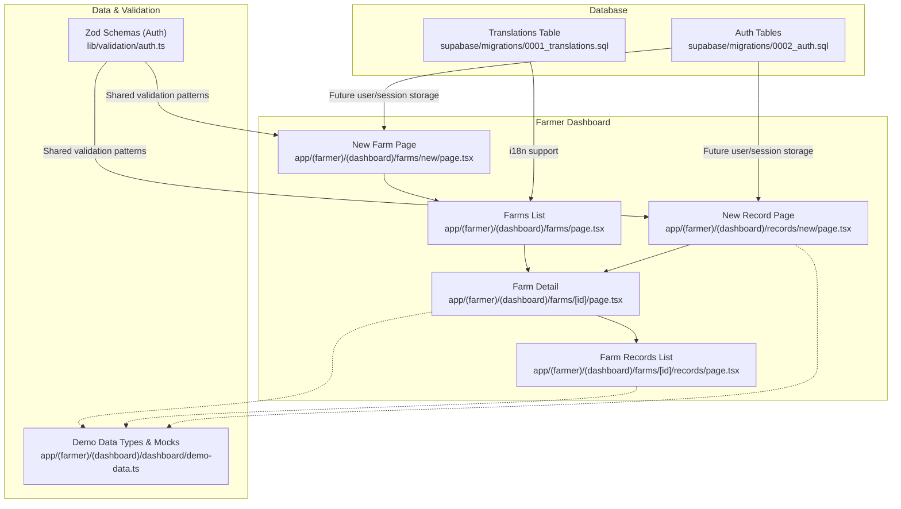
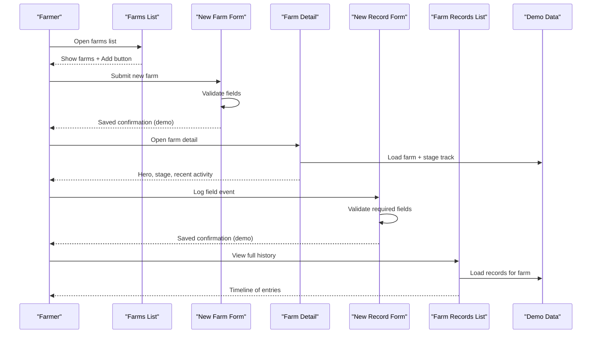
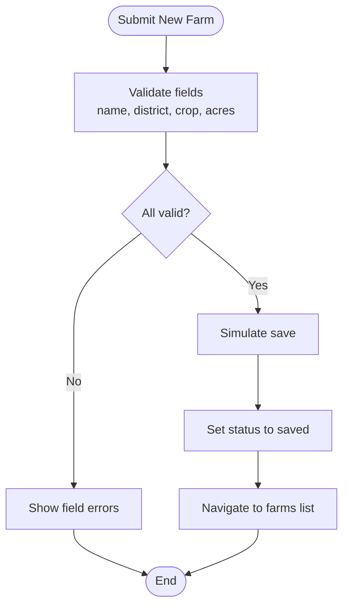
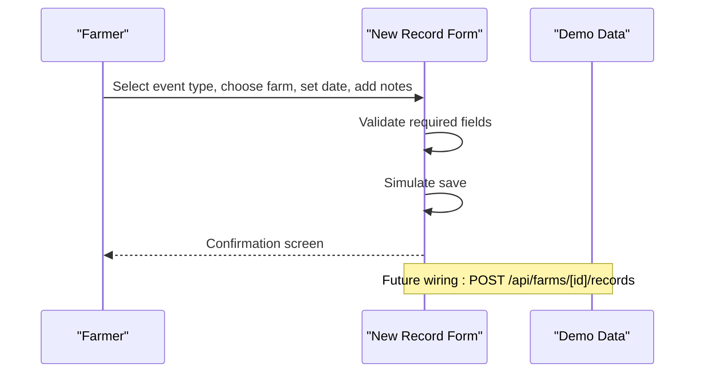
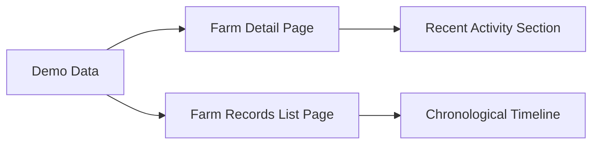
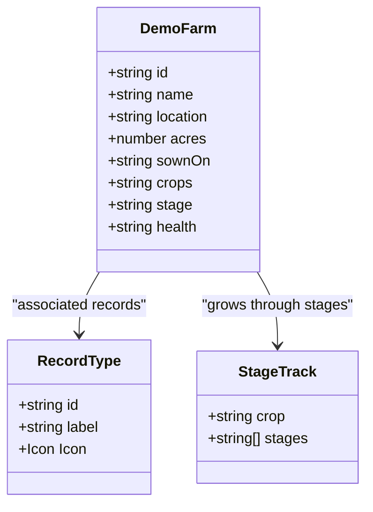
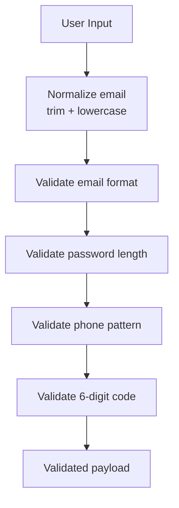
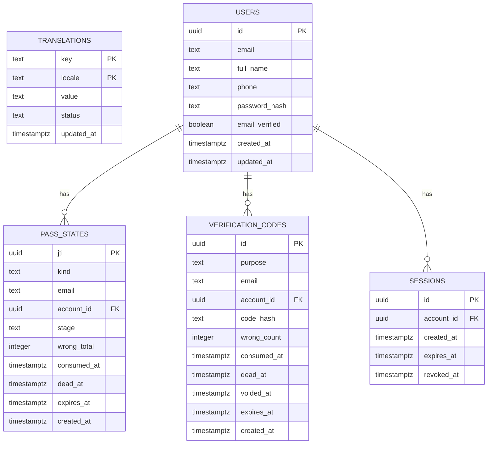
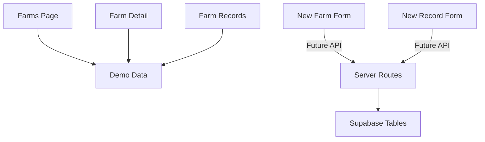

# Farm Records Management

<cite>
**Referenced Files in This Document**
- [README.md](file://README.md)
- [farms/page.tsx](file://app/(farmer)/(dashboard)/farms/page.tsx)
- [farms/new/page.tsx](file://app/(farmer)/(dashboard)/farms/new/page.tsx)
- [farms/new/farm-form.tsx](file://app/(farmer)/(dashboard)/farms/new/farm-form.tsx)
- [records/new/page.tsx](file://app/(farmer)/(dashboard)/records/new/page.tsx)
- [records/new/record-form.tsx](file://app/(farmer)/(dashboard)/records/new/record-form.tsx)
- [farms/[id]/page.tsx](file://app/(farmer)/(dashboard)/farms/[id]/page.tsx)
- [farms/[id]/records/page.tsx](file://app/(farmer)/(dashboard)/farms/[id]/records/page.tsx)
- [demo-data.ts](file://app/(farmer)/(dashboard)/dashboard/demo-data.ts)
- [auth.ts](file://lib/validation/auth.ts)
- [0001_translations.sql](file://supabase/migrations/0001_translations.sql)
- [0002_auth.sql](file://supabase/migrations/0002_auth.sql)
</cite>

## Table of Contents
1. Introduction
2. Project Structure
3. Core Components
4. Architecture Overview
5. Detailed Component Analysis
6. Dependency Analysis
7. Performance Considerations
8. Troubleshooting Guide
9. Conclusion

## Introduction
This document explains Agropioo’s farm records management system as implemented in the repository. It covers the digital record-keeping interface, activity logging workflows, historical data tracking, and export considerations. It also documents form handling patterns for farm creation and record entry, validation schemas using Zod (for authentication surfaces), state management for multi-step-like flows, data modeling for farms and records, and database integration via Supabase migrations. Offline synchronization, backup strategies, and accessibility features are addressed with practical recommendations grounded in the current codebase.

## Project Structure
The application is a Next.js project organized under the app directory with a farmer dashboard route group. Key areas relevant to farm records:
- Farmer dashboard routes for listing farms, creating farms, viewing farm details, and managing records.
- Demo data module that defines typed structures for farms and related entities used by UI pages.
- Validation schemas in lib/validation for shared Zod-based input validation on auth surfaces.
- Supabase migrations defining translation and authentication-related tables.

**Diagram sources**
- [farms/page.tsx:1-108](file://app/(farmer)/(dashboard)/farms/page.tsx#L1-L108)
- [farms/new/page.tsx:1-23](file://app/(farmer)/(dashboard)/farms/new/page.tsx#L1-L23)
- [farms/new/farm-form.tsx:1-225](file://app/(farmer)/(dashboard)/farms/new/farm-form.tsx#L1-L225)
- [records/new/page.tsx:1-23](file://app/(farmer)/(dashboard)/records/new/page.tsx#L1-L23)
- [records/new/record-form.tsx:1-250](file://app/(farmer)/(dashboard)/records/new/record-form.tsx#L1-L250)
- [farms/[id]/page.tsx:1-202](file://app/(farmer)/(dashboard)/farms/[id]/page.tsx#L1-L202)
- [farms/[id]/records/page.tsx:1-89](file://app/(farmer)/(dashboard)/farms/[id]/records/page.tsx#L1-L89)
- [demo-data.ts:1-136](file://app/(farmer)/(dashboard)/dashboard/demo-data.ts#L1-L136)
- [auth.ts:1-87](file://lib/validation/auth.ts#L1-L87)
- [0001_translations.sql:1-31](file://supabase/migrations/0001_translations.sql#L1-L31)
- [0002_auth.sql:1-61](file://supabase/migrations/0002_auth.sql#L1-L61)

**Section sources**
- [README.md:1-37](file://README.md#L1-L37)
- [farms/page.tsx:1-108](file://app/(farmer)/(dashboard)/farms/page.tsx#L1-L108)
- [demo-data.ts:1-136](file://app/(farmer)/(dashboard)/dashboard/demo-data.ts#L1-L136)

## Core Components
- Farms list page: Displays all farms with health, crop, stage, and size; provides quick actions to add a new farm or open a farm detail.
- New farm form: Captures name, district, main crop, and area; validates inputs client-side; simulates saving and navigates back to the farms list.
- Farm detail page: Shows farm hero, season stage track, recent field activity, and actions to log events or scan crops.
- Farm records list page: Presents a chronological timeline of recorded activities for a specific farm.
- New record form: Allows selecting event type (irrigation, fertilizer, pesticide, disease, harvest), associating it with a farm, setting date, and adding optional title and notes; validates required fields and simulates saving.

These components collectively implement the digital record-keeping workflow: create a farm, log activities over time, view history, and navigate between related screens.

**Section sources**
- [farms/page.tsx:1-108](file://app/(farmer)/(dashboard)/farms/page.tsx#L1-L108)
- [farms/new/farm-form.tsx:1-225](file://app/(farmer)/(dashboard)/farms/new/farm-form.tsx#L1-L225)
- [farms/[id]/page.tsx:1-202](file://app/(farmer)/(dashboard)/farms/[id]/page.tsx#L1-L202)
- [farms/[id]/records/page.tsx:1-89](file://app/(farmer)/(dashboard)/farms/[id]/records/page.tsx#L1-L89)
- [records/new/record-form.tsx:1-250](file://app/(farmer)/(dashboard)/records/new/record-form.tsx#L1-L250)

## Architecture Overview
At a high level, the farmer dashboard uses Next.js App Router pages to render UI and coordinate navigation. Forms validate inputs locally and simulate persistence. The demo data module centralizes types and mock datasets used across pages. Database schema exists for translations and authentication, laying groundwork for future user accounts and i18n content.

**Diagram sources**
- [farms/page.tsx:1-108](file://app/(farmer)/(dashboard)/farms/page.tsx#L1-L108)
- [farms/new/farm-form.tsx:1-225](file://app/(farmer)/(dashboard)/farms/new/farm-form.tsx#L1-L225)
- [farms/[id]/page.tsx:1-202](file://app/(farmer)/(dashboard)/farms/[id]/page.tsx#L1-L202)
- [records/new/record-form.tsx:1-250](file://app/(farmer)/(dashboard)/records/new/record-form.tsx#L1-L250)
- [farms/[id]/records/page.tsx:1-89](file://app/(farmer)/(dashboard)/farms/[id]/records/page.tsx#L1-L89)
- [demo-data.ts:1-136](file://app/(farmer)/(dashboard)/dashboard/demo-data.ts#L1-L136)

## Detailed Component Analysis

### Farm Creation Workflow
- Inputs: farm name, district, main crop, area (acres).
- Validation: Required fields validated client-side; positive numeric acres enforced.
- State: Local status transitions from idle to loading to saved; disabled submit during loading.
- Navigation: After save, returns to farms list or dashboard.

**Diagram sources**
- [farms/new/farm-form.tsx:31-55](file://app/(farmer)/(dashboard)/farms/new/farm-form.tsx#L31-L55)
- [farms/new/farm-form.tsx:110-225](file://app/(farmer)/(dashboard)/farms/new/farm-form.tsx#L110-L225)

**Section sources**
- [farms/new/page.tsx:1-23](file://app/(farmer)/(dashboard)/farms/new/page.tsx#L1-L23)
- [farms/new/farm-form.tsx:1-225](file://app/(farmer)/(dashboard)/farms/new/farm-form.tsx#L1-L225)

### Record Logging Workflow
- Event types: irrigation, fertilizer, pesticide, disease, harvest.
- Inputs: associated farm, date, optional title and notes.
- Validation: Required farm and date; optional fields accepted.
- State: Local status transitions similar to farm creation; simulated save.

**Diagram sources**
- [records/new/record-form.tsx:18-24](file://app/(farmer)/(dashboard)/records/new/record-form.tsx#L18-L24)
- [records/new/record-form.tsx:44-62](file://app/(farmer)/(dashboard)/records/new/record-form.tsx#L44-L62)
- [records/new/record-form.tsx:107-250](file://app/(farmer)/(dashboard)/records/new/record-form.tsx#L107-L250)

**Section sources**
- [records/new/page.tsx:1-23](file://app/(farmer)/(dashboard)/records/new/page.tsx#L1-L23)
- [records/new/record-form.tsx:1-250](file://app/(farmer)/(dashboard)/records/new/record-form.tsx#L1-L250)

### Historical Data Tracking
- Farm detail shows recent activity entries with icons per record type.
- Farm records list presents a full timeline of entries for a farm, ordered chronologically.
- Demo data supplies sample records and farm metadata used to render these views.

**Diagram sources**
- [farms/[id]/page.tsx:140-180](file://app/(farmer)/(dashboard)/farms/[id]/page.tsx#L140-L180)
- [farms/[id]/records/page.tsx:26-89](file://app/(farmer)/(dashboard)/farms/[id]/records/page.tsx#L26-L89)
- [demo-data.ts:91-122](file://app/(farmer)/(dashboard)/dashboard/demo-data.ts#L91-L122)

**Section sources**
- [farms/[id]/page.tsx:1-202](file://app/(farmer)/(dashboard)/farms/[id]/page.tsx#L1-L202)
- [farms/[id]/records/page.tsx:1-89](file://app/(farmer)/(dashboard)/farms/[id]/records/page.tsx#L1-L89)
- [demo-data.ts:1-136](file://app/(farmer)/(dashboard)/dashboard/demo-data.ts#L1-L136)

### Data Modeling Approaches
- Demo data defines typed structures for farms, alerts, and checklist items, providing a clear contract for UI rendering and future backend integration.
- Record types are enumerated and mapped to icons for consistent presentation.
- Stage tracks map crop types to growth stages, enabling visual progress indicators.

**Diagram sources**
- [demo-data.ts:16-25](file://app/(farmer)/(dashboard)/dashboard/demo-data.ts#L16-L25)
- [records/new/record-form.tsx:18-24](file://app/(farmer)/(dashboard)/records/new/record-form.tsx#L18-L24)
- [farms/[id]/page.tsx:26-47](file://app/(farmer)/(dashboard)/farms/[id]/page.tsx#L26-L47)

**Section sources**
- [demo-data.ts:1-136](file://app/(farmer)/(dashboard)/dashboard/demo-data.ts#L1-L136)
- [records/new/record-form.tsx:18-24](file://app/(farmer)/(dashboard)/records/new/record-form.tsx#L18-L24)
- [farms/[id]/page.tsx:26-47](file://app/(farmer)/(dashboard)/farms/[id]/page.tsx#L26-L47)

### Validation Schemas Using Zod
- Shared Zod schemas define normalized email handling, password rules, phone format, and code constraints for authentication flows.
- These schemas ensure consistent validation across client and server surfaces and can serve as templates for future farm/record schemas.

**Diagram sources**
- [auth.ts:8-11](file://lib/validation/auth.ts#L8-L11)
- [auth.ts:13-16](file://lib/validation/auth.ts#L13-L16)
- [auth.ts:18-40](file://lib/validation/auth.ts#L18-L40)
- [auth.ts:67-72](file://lib/validation/auth.ts#L67-L72)

**Section sources**
- [auth.ts:1-87](file://lib/validation/auth.ts#L1-L87)

### Database Integration Patterns
- Translations table supports multilingual content with locale and status checks, enabling i18n for marketing and potentially UI strings.
- Authentication tables define users, pass states, verification codes, and sessions, establishing foundations for secure access control and session management.

**Diagram sources**
- [0001_translations.sql:7-31](file://supabase/migrations/0001_translations.sql#L7-L31)
- [0002_auth.sql:7-61](file://supabase/migrations/0002_auth.sql#L7-L61)

**Section sources**
- [0001_translations.sql:1-31](file://supabase/migrations/0001_translations.sql#L1-L31)
- [0002_auth.sql:1-61](file://supabase/migrations/0002_auth.sql#L1-L61)

## Dependency Analysis
- Pages depend on demo data for rendering lists and timelines.
- Forms depend on local state for validation and submission flow.
- Future API endpoints would connect forms to server routes for persistence.
- Database migrations provide foundational tables for i18n and authentication, decoupled from current demo flows but ready for integration.

**Diagram sources**
- [farms/page.tsx:1-108](file://app/(farmer)/(dashboard)/farms/page.tsx#L1-L108)
- [farms/[id]/page.tsx:1-202](file://app/(farmer)/(dashboard)/farms/[id]/page.tsx#L1-L202)
- [farms/[id]/records/page.tsx:1-89](file://app/(farmer)/(dashboard)/farms/[id]/records/page.tsx#L1-L89)
- [farms/new/farm-form.tsx:51-54](file://app/(farmer)/(dashboard)/farms/new/farm-form.tsx#L51-L54)
- [records/new/record-form.tsx:58-61](file://app/(farmer)/(dashboard)/records/new/record-form.tsx#L58-L61)
- [0002_auth.sql:7-61](file://supabase/migrations/0002_auth.sql#L7-L61)

**Section sources**
- [farms/new/farm-form.tsx:51-54](file://app/(farmer)/(dashboard)/farms/new/farm-form.tsx#L51-L54)
- [records/new/record-form.tsx:58-61](file://app/(farmer)/(dashboard)/records/new/record-form.tsx#L58-L61)
- [0002_auth.sql:7-61](file://supabase/migrations/0002_auth.sql#L7-L61)

## Performance Considerations
- Client-side validation reduces unnecessary network calls and improves responsiveness.
- Demo data avoids heavy server requests; when integrating APIs, consider pagination and caching for large record histories.
- Use efficient rendering for timelines by limiting initial entries and lazy-loading older records.
- Keep form state minimal and avoid re-renders by consolidating validations and using stable identifiers.

[No sources needed since this section provides general guidance]

## Troubleshooting Guide
- Form validation errors: Ensure required fields are filled; check error messages tied to each field; verify aria-describedby links for accessibility.
- Submission not persisting: Current implementations simulate saves; integrate server routes and handle network errors gracefully.
- Missing farm or record data: Verify IDs match demo data keys; update demo data or wire real data sources.
- Accessibility issues: Confirm labels, aria-invalid, and error descriptions are present for screen readers.

**Section sources**
- [farms/new/farm-form.tsx:41-49](file://app/(farmer)/(dashboard)/farms/new/farm-form.tsx#L41-L49)
- [records/new/record-form.tsx:52-56](file://app/(farmer)/(dashboard)/records/new/record-form.tsx#L52-L56)
- [farms/[id]/page.tsx:57-58](file://app/(farmer)/(dashboard)/farms/[id]/page.tsx#L57-L58)
- [farms/[id]/records/page.tsx:34-35](file://app/(farmer)/(dashboard)/farms/[id]/records/page.tsx#L34-L35)

## Conclusion
Agropioo’s farm records management system provides a clear, accessible interface for farmers to create farms, log field activities, and review historical records. The current implementation uses client-side validation and demo data to demonstrate workflows, with a solid foundation for future API integration and database-backed persistence. Zod schemas establish reusable validation patterns, while Supabase migrations prepare the system for authentication and multilingual content. Extending these components with offline sync, robust backups, and enhanced accessibility will further improve usability for farmers with varying technical proficiency.

[No sources needed since this section summarizes without analyzing specific files]