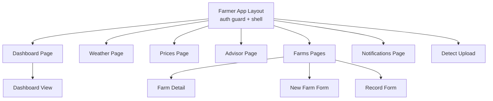
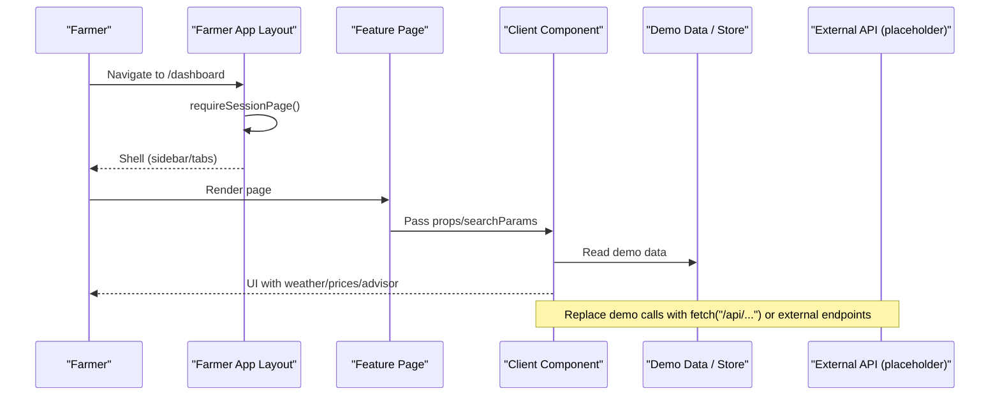
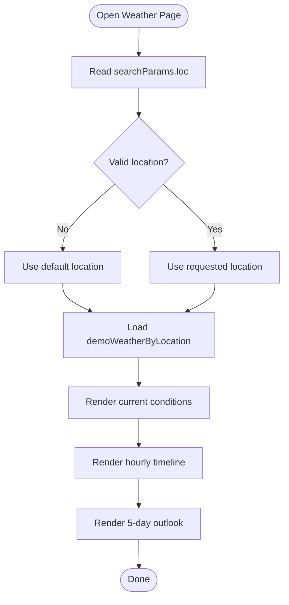
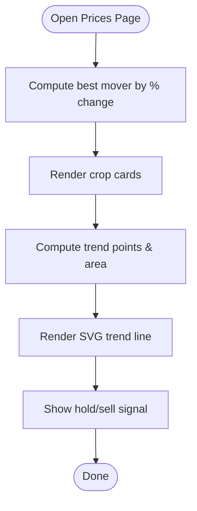
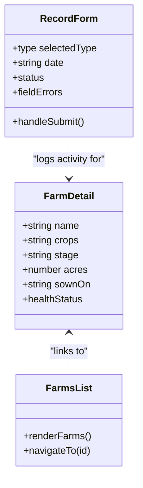
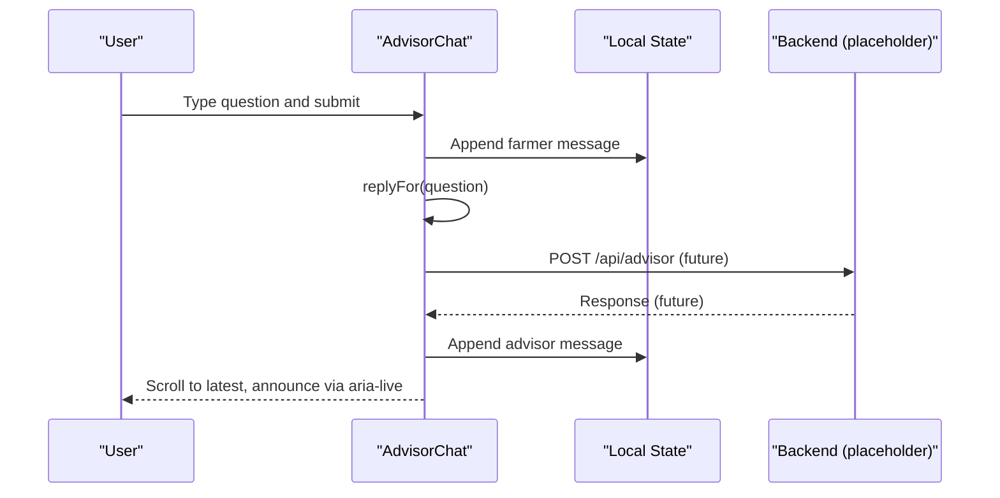
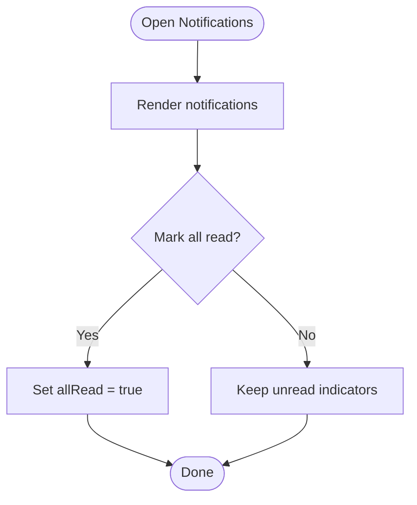
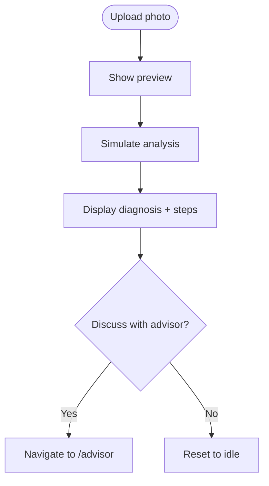
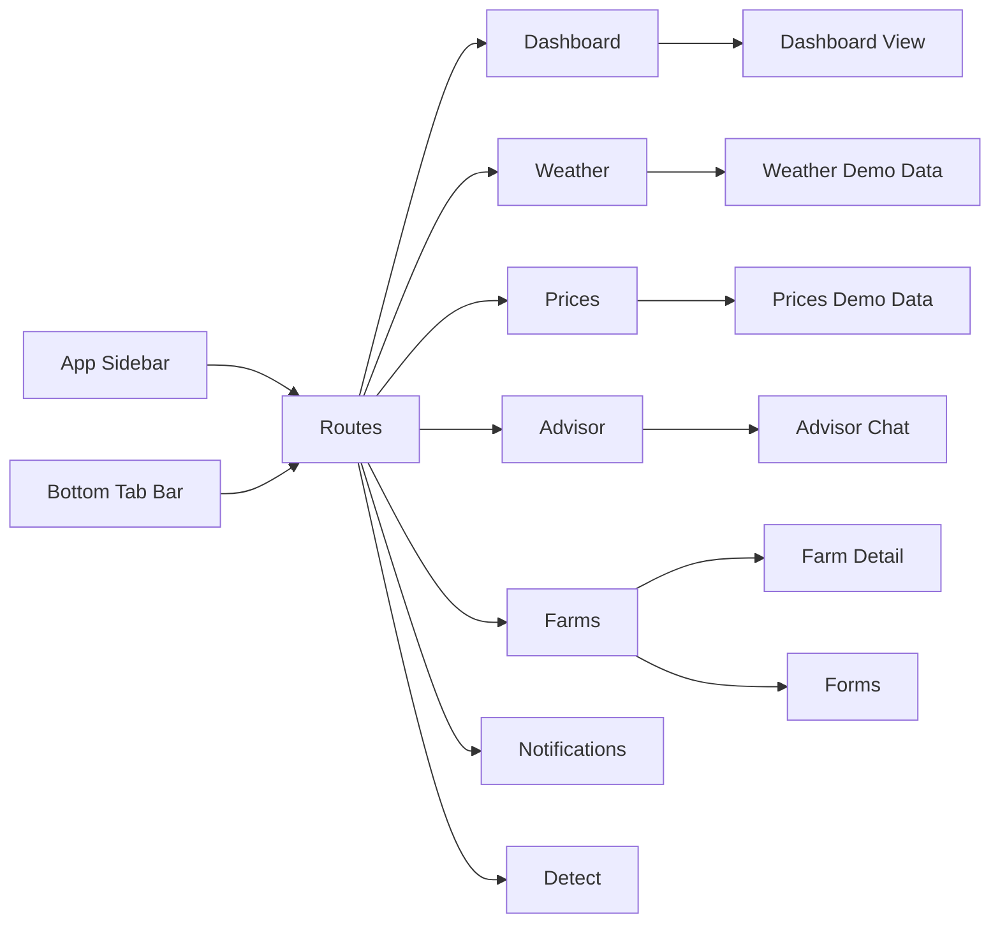

# Farmer Dashboard Features

<cite>
**Referenced Files in This Document**
- [layout.tsx](file://app/(farmer)/(dashboard)/layout.tsx)
- [page.tsx](file://app/(farmer)/(dashboard)/dashboard/page.tsx)
- [dashboard-view.tsx](file://app/(farmer)/(dashboard)/dashboard/dashboard-view.tsx)
- [demo-data.ts](file://app/(farmer)/(dashboard)/dashboard/demo-data.ts)
- [advisor-page.tsx](file://app/(farmer)/(dashboard)/advisor/page.tsx)
- [advisor-chat.tsx](file://app/(farmer)/(dashboard)/advisor/advisor-chat.tsx)
- [weather-page.tsx](file://app/(farmer)/(dashboard)/weather/page.tsx)
- [weather-demo-data.ts](file://app/(farmer)/(dashboard)/weather/demo-data.ts)
- [prices-page.tsx](file://app/(farmer)/(dashboard)/prices/page.tsx)
- [prices-demo-data.ts](file://app/(farmer)/(dashboard)/prices/demo-data.ts)
- [farms-page.tsx](file://app/(farmer)/(dashboard)/farms/page.tsx)
- [farm-detail-page.tsx](file://app/(farmer)/(dashboard)/farms/[id]/page.tsx)
- [record-form.tsx](file://app/(farmer)/(dashboard)/records/new/record-form.tsx)
- [farm-form.tsx](file://app/(farmer)/(dashboard)/farms/new/farm-form.tsx)
- [notifications-page.tsx](file://app/(farmer)/(dashboard)/notifications/page.tsx)
- [notifications-list.tsx](file://app/(farmer)/(dashboard)/notifications/notifications-list.tsx)
- [detect-upload.tsx](file://app/(farmer)/(dashboard)/detect/detect-upload.tsx)
- [app-sidebar.tsx](file://components/shell/app-sidebar.tsx)
- [bottom-tab-bar.tsx](file://components/shell/bottom-tab-bar.tsx)
</cite>

## Table of Contents
1. Introduction
2. Project Structure
3. Core Components
4. Architecture Overview
5. Detailed Component Analysis
6. Dependency Analysis
7. Performance Considerations
8. Troubleshooting Guide
9. Conclusion

## Introduction
This document explains Agropioo’s farmer dashboard features with a focus on:
- Weather intelligence with hyperlocal forecasts and agricultural alerts
- Market price monitoring with trend analysis and best market recommendations
- Digital farm records management with activity logging and historical tracking
- AI agriculture advisor with natural language Q&A interface
It also covers user workflows for daily farming operations, data visualization patterns, mobile-responsive design, real-time update strategies, offline considerations, accessibility, and integration points for external APIs.

## Project Structure
The farmer app is organized under the (farmer) route group with a shared layout that enforces authentication and provides a desktop sidebar plus a mobile bottom tab bar. Each feature is a page component with optional subcomponents and typed demo data.

**Diagram sources**
- [layout.tsx:1-26](file://app/(farmer)/(dashboard)/layout.tsx#L1-L26)
- [page.tsx:1-26](file://app/(farmer)/(dashboard)/dashboard/page.tsx#L1-L26)
- [dashboard-view.tsx:1-649](file://app/(farmer)/(dashboard)/dashboard/dashboard-view.tsx#L1-L649)
- [weather-page.tsx:1-184](file://app/(farmer)/(dashboard)/weather/page.tsx#L1-L184)
- [prices-page.tsx:1-185](file://app/(farmer)/(dashboard)/prices/page.tsx#L1-L185)
- [advisor-page.tsx:1-23](file://app/(farmer)/(dashboard)/advisor/page.tsx#L1-L23)
- [farms-page.tsx:1-108](file://app/(farmer)/(dashboard)/farms/page.tsx#L1-L108)
- [farm-detail-page.tsx:1-202](file://app/(farmer)/(dashboard)/farms/[id]/page.tsx#L1-L202)
- [record-form.tsx:1-250](file://app/(farmer)/(dashboard)/records/new/record-form.tsx#L1-L250)
- [farm-form.tsx:1-225](file://app/(farmer)/(dashboard)/farms/new/farm-form.tsx#L1-L225)
- [notifications-page.tsx:1-23](file://app/(farmer)/(dashboard)/notifications/page.tsx#L1-L23)
- [notifications-list.tsx:1-99](file://app/(farmer)/(dashboard)/notifications/notifications-list.tsx#L1-L99)
- [detect-upload.tsx:1-251](file://app/(farmer)/(dashboard)/detect/detect-upload.tsx#L1-L251)

**Section sources**
- [layout.tsx:1-26](file://app/(farmer)/(dashboard)/layout.tsx#L1-L26)
- [app-sidebar.tsx:1-98](file://components/shell/app-sidebar.tsx#L1-L98)
- [bottom-tab-bar.tsx:1-70](file://components/shell/bottom-tab-bar.tsx#L1-L70)

## Core Components
- Weather intelligence: Hyperlocal location switcher via query param; current conditions, spray window guidance, hourly scroll, and five-day outlook.
- Market prices: Mandi rates with weekly direction, per-crop cards, SVG trend lines, and “hold/sell” signals.
- Digital farm records: Farm list and detail view with stage tracking and recent field activity; new record form with validation and simulated save.
- AI advisor: Chat UI with suggestion chips, keyword-matched replies, and accessible live region updates.
- Navigation shell: Desktop sidebar and mobile bottom tabs; session-based auth guard at the layout level.

**Section sources**
- [weather-page.tsx:15-184](file://app/(farmer)/(dashboard)/weather/page.tsx#L15-L184)
- [prices-page.tsx:13-185](file://app/(farmer)/(dashboard)/prices/page.tsx#L13-L185)
- [farms-page.tsx:21-108](file://app/(farmer)/(dashboard)/farms/page.tsx#L21-L108)
- [farm-detail-page.tsx:49-202](file://app/(farmer)/(dashboard)/farms/[id]/page.tsx#L49-L202)
- [record-form.tsx:32-250](file://app/(farmer)/(dashboard)/records/new/record-form.tsx#L32-L250)
- [advisor-page.tsx:9-23](file://app/(farmer)/(dashboard)/advisor/page.tsx#L9-L23)
- [advisor-chat.tsx:21-170](file://app/(farmer)/(dashboard)/advisor/advisor-chat.tsx#L21-L170)
- [layout.tsx:8-22](file://app/(farmer)/(dashboard)/layout.tsx#L8-L22)

## Architecture Overview
The dashboard uses Next.js pages as entry points, client components for interactivity, and typed demo data to drive UI. The layout enforces authentication and renders a consistent shell. Data flows from typed mock datasets into presentational components; placeholders are marked for backend API wiring.

**Diagram sources**
- [layout.tsx:8-22](file://app/(farmer)/(dashboard)/layout.tsx#L8-L22)
- [dashboard-view.tsx:149-170](file://app/(farmer)/(dashboard)/dashboard/dashboard-view.tsx#L149-L170)
- [weather-page.tsx:15-31](file://app/(farmer)/(dashboard)/weather/page.tsx#L15-L31)
- [prices-page.tsx:43-57](file://app/(farmer)/(dashboard)/prices/page.tsx#L43-L57)
- [advisor-chat.tsx:46-63](file://app/(farmer)/(dashboard)/advisor/advisor-chat.tsx#L46-L63)

## Detailed Component Analysis

### Weather Intelligence
- Hyperlocal forecast selection via query param (loc), validated against allowed locations.
- Current conditions panel with temperature, high/low, rain note, and spray window guidance.
- Hourly scrollable timeline and five-day outlook list.
- Accessibility: semantic headings, aria-labels for numeric values, and clear section labels.

**Diagram sources**
- [weather-page.tsx:17-31](file://app/(farmer)/(dashboard)/weather/page.tsx#L17-L31)
- [weather-page.tsx:60-176](file://app/(farmer)/(dashboard)/weather/page.tsx#L60-L176)
- [weather-demo-data.ts:19-115](file://app/(farmer)/(dashboard)/weather/demo-data.ts#L19-L115)

**Section sources**
- [weather-page.tsx:15-184](file://app/(farmer)/(dashboard)/weather/page.tsx#L15-L184)
- [weather-demo-data.ts:1-115](file://app/(farmer)/(dashboard)/weather/demo-data.ts#L1-L115)

### Market Price Monitoring
- Weekly overview cards showing tracked crops count, best mover, and last update time.
- Per-crop cards with rate, change, direction, and an SVG polyline area chart for seven-session trends.
- Signal strip with “Hold” or “Sell soon” and contextual notes.

**Diagram sources**
- [prices-page.tsx:13-49](file://app/(farmer)/(dashboard)/prices/page.tsx#L13-L49)
- [prices-page.tsx:98-177](file://app/(farmer)/(dashboard)/prices/page.tsx#L98-L177)
- [prices-demo-data.ts:1-68](file://app/(farmer)/(dashboard)/prices/demo-data.ts#L1-L68)

**Section sources**
- [prices-page.tsx:13-185](file://app/(farmer)/(dashboard)/prices/page.tsx#L13-L185)
- [prices-demo-data.ts:1-68](file://app/(farmer)/(dashboard)/prices/demo-data.ts#L1-L68)

### Digital Farm Records Management
- Farms list shows health, crops, stage, and acres; links to details and add-new.
- Farm detail includes season position track, recent field activity, and actions to log events or scan crops.
- Record form supports event type selection, farm/date fields, title/note, validation, loading state, and success screen.

**Diagram sources**
- [farm-detail-page.tsx:49-202](file://app/(farmer)/(dashboard)/farms/[id]/page.tsx#L49-L202)
- [record-form.tsx:32-250](file://app/(farmer)/(dashboard)/records/new/record-form.tsx#L32-L250)
- [farms-page.tsx:21-108](file://app/(farmer)/(dashboard)/farms/page.tsx#L21-L108)

**Section sources**
- [farms-page.tsx:21-108](file://app/(farmer)/(dashboard)/farms/page.tsx#L21-L108)
- [farm-detail-page.tsx:49-202](file://app/(farmer)/(dashboard)/farms/[id]/page.tsx#L49-L202)
- [record-form.tsx:32-250](file://app/(farmer)/(dashboard)/records/new/record-form.tsx#L32-L250)

### AI Agriculture Advisor
- Chat UI with message transcript, typing indicator, suggestion chips, and keyboard-friendly composer.
- Keyword-matched canned replies for demo; placeholder comment indicates where to wire POST /api/advisor.
- Accessible live region announces new messages.

**Diagram sources**
- [advisor-chat.tsx:21-63](file://app/(farmer)/(dashboard)/advisor/advisor-chat.tsx#L21-L63)
- [advisor-chat.tsx:65-170](file://app/(farmer)/(dashboard)/advisor/advisor-chat.tsx#L65-L170)

**Section sources**
- [advisor-page.tsx:9-23](file://app/(farmer)/(dashboard)/advisor/page.tsx#L9-L23)
- [advisor-chat.tsx:21-170](file://app/(farmer)/(dashboard)/advisor/advisor-chat.tsx#L21-L170)

### Notifications and Alerts
- Centralized notifications list with severity styling, kind icons, and mark-all-read behavior (session-only).
- Dashboard alerts strip surfaces top alerts with severity chips and relative timestamps.

**Diagram sources**
- [notifications-list.tsx:32-99](file://app/(farmer)/(dashboard)/notifications/notifications-list.tsx#L32-L99)
- [dashboard-view.tsx:389-449](file://app/(farmer)/(dashboard)/dashboard/dashboard-view.tsx#L389-L449)

**Section sources**
- [notifications-page.tsx:9-23](file://app/(farmer)/(dashboard)/notifications/page.tsx#L9-L23)
- [notifications-list.tsx:32-99](file://app/(farmer)/(dashboard)/notifications/notifications-list.tsx#L32-L99)
- [dashboard-view.tsx:389-449](file://app/(farmer)/(dashboard)/dashboard/dashboard-view.tsx#L389-L449)

### Crop Detection (Supporting Feature)
- Photo capture/upload with preview, analyzing state, and sample diagnosis result.
- Clear steps for what to do next and link back to advisor discussion.

**Diagram sources**
- [detect-upload.tsx:22-57](file://app/(farmer)/(dashboard)/detect/detect-upload.tsx#L22-L57)
- [detect-upload.tsx:132-247](file://app/(farmer)/(dashboard)/detect/detect-upload.tsx#L132-L247)

**Section sources**
- [detect-upload.tsx:22-247](file://app/(farmer)/(dashboard)/detect/detect-upload.tsx#L22-L247)

## Dependency Analysis
- Shared navigation shell: Sidebar and bottom tabs provide consistent access across features.
- Demo data modules: Typed datasets decouple UI from implementation and make it easy to swap with real APIs later.
- Client components: Heavy interactivity lives in client components; server components render pages and pass props.

**Diagram sources**
- [app-sidebar.tsx:22-30](file://components/shell/app-sidebar.tsx#L22-L30)
- [bottom-tab-bar.tsx:15-21](file://components/shell/bottom-tab-bar.tsx#L15-L21)
- [dashboard-view.tsx:149-170](file://app/(farmer)/(dashboard)/dashboard/dashboard-view.tsx#L149-L170)
- [weather-demo-data.ts:1-115](file://app/(farmer)/(dashboard)/weather/demo-data.ts#L1-L115)
- [prices-demo-data.ts:1-68](file://app/(farmer)/(dashboard)/prices/demo-data.ts#L1-L68)
- [advisor-chat.tsx:21-63](file://app/(farmer)/(dashboard)/advisor/advisor-chat.tsx#L21-L63)
- [farm-detail-page.tsx:49-202](file://app/(farmer)/(dashboard)/farms/[id]/page.tsx#L49-L202)
- [record-form.tsx:32-250](file://app/(farmer)/(dashboard)/records/new/record-form.tsx#L32-L250)

**Section sources**
- [app-sidebar.tsx:22-30](file://components/shell/app-sidebar.tsx#L22-L30)
- [bottom-tab-bar.tsx:15-21](file://components/shell/bottom-tab-bar.tsx#L15-L21)

## Performance Considerations
- Lightweight charts: SVG polylines avoid heavy chart libraries and keep rendering fast on low-end devices.
- Minimal re-renders: Local state per component; no global store needed for demo.
- Efficient lists: Keys and stable IDs prevent unnecessary DOM churn.
- Image handling: Object URLs are revoked on cleanup to free memory.

[No sources needed since this section provides general guidance]

## Troubleshooting Guide
- Authentication redirect: If users cannot access dashboard routes, ensure session guard runs at layout level.
- Weather unavailable: Dashboard gracefully shows a friendly fallback when weather is disabled or failing to load.
- Form validation: Record and farm forms validate required fields and surface inline errors; ensure proper aria attributes for accessibility.
- Chat not responding: In demo mode, replies are local; replace the timeout path with a POST to your backend endpoint.

**Section sources**
- [layout.tsx:8-12](file://app/(farmer)/(dashboard)/layout.tsx#L8-L12)
- [dashboard-view.tsx:304-359](file://app/(farmer)/(dashboard)/dashboard/dashboard-view.tsx#L304-L359)
- [record-form.tsx:44-62](file://app/(farmer)/(dashboard)/records/new/record-form.tsx#L44-L62)
- [farm-form.tsx:31-55](file://app/(farmer)/(dashboard)/farms/new/farm-form.tsx#L31-L55)
- [advisor-chat.tsx:46-63](file://app/(farmer)/(dashboard)/advisor/advisor-chat.tsx#L46-L63)

## Conclusion
Agropioo’s farmer dashboard delivers a focused, mobile-first experience for daily farming tasks. It combines actionable weather insights, market price signals, structured farm records, and an AI advisor chat—all built with accessible, responsive UI and clear extension points for real-time data and offline support. The codebase uses typed demo data and client components to keep the UI fast and maintainable while preparing for backend integrations.

[No sources needed since this section summarizes without analyzing specific files]