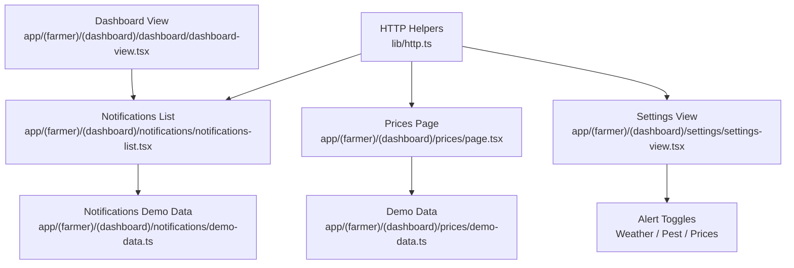
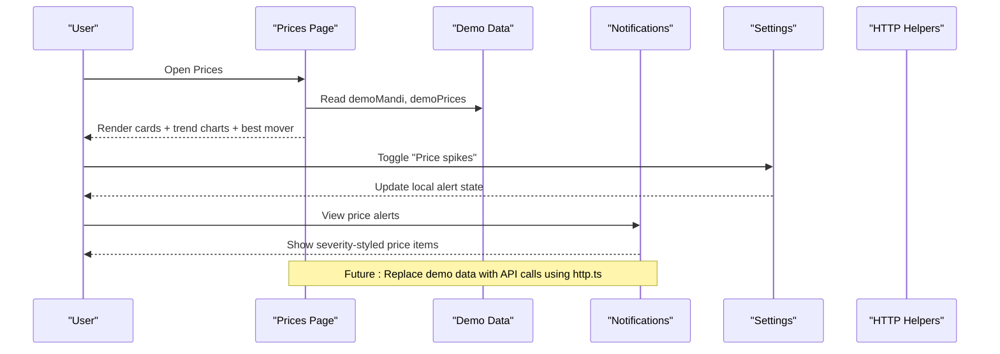
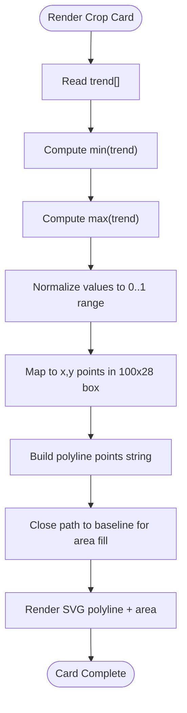
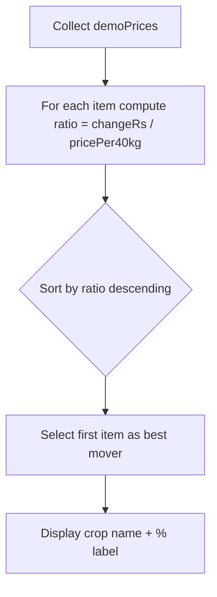
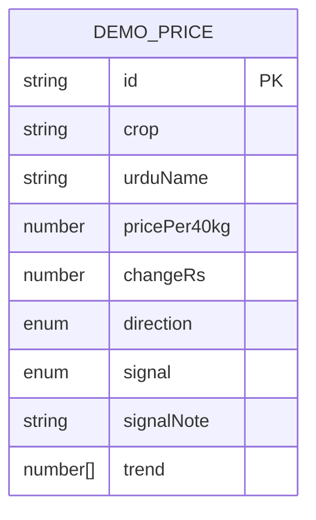
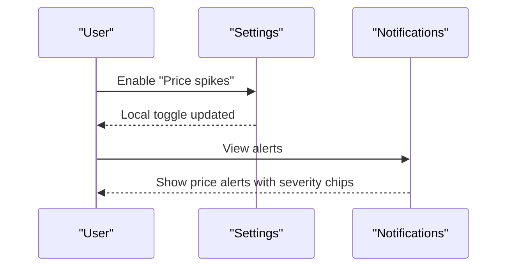
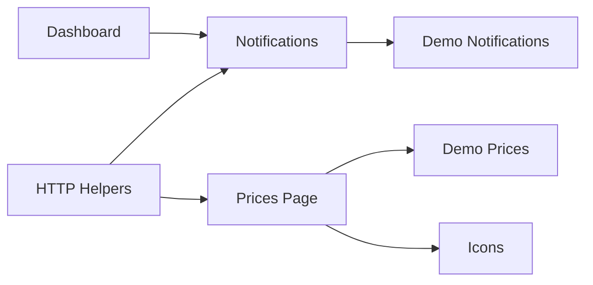

# Market Price Monitoring

<cite>
**Referenced Files in This Document**
- [page.tsx](file://app/(farmer)/(dashboard)/prices/page.tsx)
- [demo-data.ts](file://app/(farmer)/(dashboard)/prices/demo-data.ts)
- [settings-view.tsx](file://app/(farmer)/(dashboard)/settings/settings-view.tsx)
- [notifications-list.tsx](file://app/(farmer)/(dashboard)/notifications/notifications-list.tsx)
- [dashboard-view.tsx](file://app/(farmer)/(dashboard)/dashboard/dashboard-view.tsx)
- [http.ts](file://lib/http.ts)
</cite>

## Table of Contents
1. Introduction
2. Project Structure
3. Core Components
4. Architecture Overview
5. Detailed Component Analysis
6. Dependency Analysis
7. Performance Considerations
8. Troubleshooting Guide
9. Conclusion

## Introduction
This document explains Agropioo’s market price monitoring system as implemented in the current codebase. It covers the commodity price tracking interface, trend visualization, best-market recommendation logic, and how real-time updates and alerts are structured. It also documents demo data structures, price categorization signals, user preference toggles for price alerts, and provides guidance for integrating external market data APIs, implementing price alert systems, and optimizing data loading for slow connections.

## Project Structure
The market price feature is centered around a dashboard page that renders today’s mandi prices, weekly direction indicators, and simple “hold or sell” signals with a seven-session trend chart per crop. Supporting screens include notifications (where price alerts appear) and settings (where users toggle price-related alerts).

**Diagram sources**
- [page.tsx:1-185](file://app/(farmer)/(dashboard)/prices/page.tsx#L1-L185)
- [demo-data.ts:1-68](file://app/(farmer)/(dashboard)/prices/demo-data.ts#L1-L68)
- [notifications-list.tsx:1-98](file://app/(farmer)/(dashboard)/notifications/notifications-list.tsx#L1-L98)
- [dashboard-view.tsx:1-200](file://app/(farmer)/(dashboard)/dashboard/dashboard-view.tsx#L1-L200)
- [http.ts:1-61](file://lib/http.ts#L1-L61)

**Section sources**
- [page.tsx:1-185](file://app/(farmer)/(dashboard)/prices/page.tsx#L1-L185)
- [demo-data.ts:1-68](file://app/(farmer)/(dashboard)/prices/demo-data.ts#L1-L68)
- [notifications-list.tsx:1-98](file://app/(farmer)/(dashboard)/notifications/notifications-list.tsx#L1-L98)
- [dashboard-view.tsx:1-200](file://app/(farmer)/(dashboard)/dashboard/dashboard-view.tsx#L1-L200)
- [http.ts:1-61](file://lib/http.ts#L1-L61)

## Core Components
- Prices Page: Renders today’s mandi rates, weekly change direction, percentage labels, and a seven-session trend polyline per crop. Computes the “best mover” by relative change to highlight top opportunity this week.
- Demo Data Model: Typed structure for each crop including current price, weekly change, direction, signal (“hold” or “sell”), signal note, and a trend array representing recent sessions.
- Notifications: Displays price-related alerts alongside weather and pest alerts; includes severity and kind metadata.
- Settings: User preferences to enable/disable price spike alerts (and other categories), currently session-scoped.
- HTTP Helpers: Standardized error responses and request utilities for backend integration.

**Section sources**
- [page.tsx:13-49](file://app/(farmer)/(dashboard)/prices/page.tsx#L13-L49)
- [demo-data.ts:4-20](file://app/(farmer)/(dashboard)/prices/demo-data.ts#L4-L20)
- [notifications-list.tsx:14-30](file://app/(farmer)/(dashboard)/notifications/notifications-list.tsx#L14-L30)
- [settings-view.tsx:21-53](file://app/(farmer)/(dashboard)/settings/settings-view.tsx#L21-L53)
- [http.ts:4-25](file://lib/http.ts#L4-L25)

## Architecture Overview
The UI layer consumes typed demo data to render price cards with inline SVG trend lines. Alerts flow through the notifications screen and can be toggled via settings. The HTTP helpers provide a consistent contract for future API integrations.

**Diagram sources**
- [page.tsx:45-185](file://app/(farmer)/(dashboard)/prices/page.tsx#L45-L185)
- [demo-data.ts:20-68](file://app/(farmer)/(dashboard)/prices/demo-data.ts#L20-L68)
- [notifications-list.tsx:32-98](file://app/(farmer)/(dashboard)/notifications/notifications-list.tsx#L32-L98)
- [settings-view.tsx:21-53](file://app/(farmer)/(dashboard)/settings/settings-view.tsx#L21-L53)
- [http.ts:15-25](file://lib/http.ts#L15-L25)

## Detailed Component Analysis

### Commodity Price Tracking Interface
- Displays today’s rate per 40 kg, weekly change in rupees, and percentage label computed from change vs current price.
- Shows directional indicator (up/down) with icons.
- Provides a “week at a glance” summary including number of crops tracked, best mover, and update time.
- Each card includes a seven-session trend rendered as an SVG polyline with area fill.

Implementation highlights:
- Trend line generation maps values to normalized coordinates within a fixed box.
- Percentage label uses rounded arithmetic to show one-decimal precision.
- Best mover is computed by sorting on relative change (changeRs / pricePer40kg).

**Section sources**
- [page.tsx:13-41](file://app/(farmer)/(dashboard)/prices/page.tsx#L13-L41)
- [page.tsx:45-96](file://app/(farmer)/(dashboard)/prices/page.tsx#L45-L96)
- [page.tsx:98-176](file://app/(farmer)/(dashboard)/prices/page.tsx#L98-L176)

#### Trend Visualization Flowchart

**Diagram sources**
- [page.tsx:13-30](file://app/(farmer)/(dashboard)/prices/page.tsx#L13-L30)

### Best Market Recommendations Algorithm
- The “best mover” is determined by ranking crops based on relative weekly change (percentage-like metric derived from changeRs divided by pricePer40kg).
- Sorting descending yields the top-performing crop for the week, displayed in the summary.

**Diagram sources**
- [page.tsx:45-49](file://app/(farmer)/(dashboard)/prices/page.tsx#L45-L49)

**Section sources**
- [page.tsx:45-49](file://app/(farmer)/(dashboard)/prices/page.tsx#L45-L49)

### Real-Time Price Updates and API Integration
- Current implementation uses static demo data. To integrate live market data:
  - Fetch from a backend endpoint using standard fetch or Next.js route handlers.
  - Use http.ts utilities to parse JSON bodies and return standardized error responses.
  - On success, replace demo data with fetched prices and recompute best mover and trend visuals.
  - For slow connections, implement progressive loading with skeletons and retry/backoff strategies.

Integration steps:
- Create a route handler that returns price data conforming to the DemoPrice shape.
- In the Prices Page, call the endpoint, handle errors with http.ts errorResponse patterns, and update state.
- Cache results where appropriate to reduce network load.

**Section sources**
- [http.ts:15-25](file://lib/http.ts#L15-L25)
- [http.ts:40-48](file://lib/http.ts#L40-L48)

### Price Comparison Features
- The interface compares current price vs last week via changeRs and direction.
- Percentage labels allow quick comparison across crops.
- Trend lines visualize multi-session movement for deeper comparison.

**Section sources**
- [page.tsx:32-41](file://app/(farmer)/(dashboard)/prices/page.tsx#L32-L41)
- [page.tsx:98-176](file://app/(farmer)/(dashboard)/prices/page.tsx#L98-L176)

### Historical Data Charts
- Each crop displays a seven-session trend series (oldest to newest) used to draw the polyline and area.
- The trend array is part of the demo data model and can be extended to support longer histories if needed.

**Section sources**
- [demo-data.ts:16-18](file://app/(farmer)/(dashboard)/prices/demo-data.ts#L16-L18)
- [page.tsx:136-158](file://app/(farmer)/(dashboard)/prices/page.tsx#L136-L158)

### Market Selection Functionality
- The page references a specific mandi (e.g., Multan) in its header description.
- To support multiple markets:
  - Add a market selector component.
  - Scope demoPrices or fetched data by market.
  - Persist selected market in user preferences or URL parameters.

**Section sources**
- [page.tsx:53-57](file://app/(farmer)/(dashboard)/prices/page.tsx#L53-L57)
- [demo-data.ts:20](file://app/(farmer)/(dashboard)/prices/demo-data.ts#L20)

### Demo Data Structure
- DemoPrice fields: id, crop, urduName, pricePer40kg, changeRs, direction, signal, signalNote, trend.
- demoMandi identifies the market context.
- Signals are “hold” or “sell” with accompanying notes.

**Diagram sources**
- [demo-data.ts:4-18](file://app/(farmer)/(dashboard)/prices/demo-data.ts#L4-L18)

**Section sources**
- [demo-data.ts:4-20](file://app/(farmer)/(dashboard)/prices/demo-data.ts#L4-L20)
- [demo-data.ts:20-68](file://app/(farmer)/(dashboard)/prices/demo-data.ts#L20-L68)

### Price Categorization Logic
- Direction is derived from sign of changeRs (up/down).
- Signal is provided in demo data; it can be extended to algorithmic rules based on thresholds or trends.
- Percentage label is computed from changeRs and pricePer40kg.

**Section sources**
- [page.tsx:32-41](file://app/(farmer)/(dashboard)/prices/page.tsx#L32-L41)
- [demo-data.ts:10-17](file://app/(farmer)/(dashboard)/prices/demo-data.ts#L10-L17)

### User Preference Management for Favorite Markets and Alerts
- Settings view includes toggles for weather, pest, and price alerts.
- Currently session-scoped; can be persisted to backend or local storage.
- Favorite markets can be added similarly by storing selections in preferences.

**Section sources**
- [settings-view.tsx:21-53](file://app/(farmer)/(dashboard)/settings/settings-view.tsx#L21-L53)
- [settings-view.tsx:134-179](file://app/(farmer)/(dashboard)/settings/settings-view.tsx#L134-L179)

### Price Alert System
- Notifications list supports price-kind alerts with severity styling.
- Users can toggle price alerts in settings.
- Alerts are currently demo-driven; integrate with backend to push real price movements.

**Diagram sources**
- [settings-view.tsx:21-53](file://app/(farmer)/(dashboard)/settings/settings-view.tsx#L21-L53)
- [notifications-list.tsx:14-30](file://app/(farmer)/(dashboard)/notifications/notifications-list.tsx#L14-L30)
- [notifications-list.tsx:55-98](file://app/(farmer)/(dashboard)/notifications/notifications-list.tsx#L55-L98)

**Section sources**
- [notifications-list.tsx:14-30](file://app/(farmer)/(dashboard)/notifications/notifications-list.tsx#L14-L30)
- [notifications-list.tsx:55-98](file://app/(farmer)/(dashboard)/notifications/notifications-list.tsx#L55-L98)
- [settings-view.tsx:21-53](file://app/(farmer)/(dashboard)/settings/settings-view.tsx#L21-L53)

## Dependency Analysis
- Prices Page depends on demo data for rendering and computes best mover locally.
- Notifications depend on demo notification data and map kinds to icons.
- Dashboard aggregates alerts and links to notifications.
- HTTP helpers provide reusable response builders and body parsing utilities for future API integration.

**Diagram sources**
- [page.tsx:1-8](file://app/(farmer)/(dashboard)/prices/page.tsx#L1-L8)
- [demo-data.ts:20-68](file://app/(farmer)/(dashboard)/prices/demo-data.ts#L20-L68)
- [notifications-list.tsx:1-13](file://app/(farmer)/(dashboard)/notifications/notifications-list.tsx#L1-L13)
- [dashboard-view.tsx:1-35](file://app/(farmer)/(dashboard)/dashboard/dashboard-view.tsx#L1-L35)
- [http.ts:1-25](file://lib/http.ts#L1-L25)

**Section sources**
- [page.tsx:1-8](file://app/(farmer)/(dashboard)/prices/page.tsx#L1-L8)
- [notifications-list.tsx:1-13](file://app/(farmer)/(dashboard)/notifications/notifications-list.tsx#L1-L13)
- [dashboard-view.tsx:1-35](file://app/(farmer)/(dashboard)/dashboard/dashboard-view.tsx#L1-L35)
- [http.ts:1-25](file://lib/http.ts#L1-L25)

## Performance Considerations
- Rendering efficiency:
  - Use memoization for expensive computations like best mover when datasets grow.
  - Keep trend arrays small (current seven-session design) to minimize SVG point calculations.
- Network optimization:
  - Implement caching and pagination for large historical datasets.
  - Use skeleton loaders during fetches to improve perceived performance.
- Offline access:
  - Store recent price history locally (e.g., IndexedDB or localStorage) to allow offline viewing.
  - Provide stale-while-revalidate behavior to show cached data while refreshing.

[No sources needed since this section provides general guidance]

## Troubleshooting Guide
- If prices do not update after integrating an API:
  - Verify endpoint returns data matching the DemoPrice shape.
  - Ensure error handling uses http.ts errorResponse patterns and surfaces messages.
- If alerts are not appearing:
  - Confirm settings toggle for “Price spikes” is enabled.
  - Check notifications list mapping for price kind and severity.
- If trend lines look incorrect:
  - Validate trend arrays contain numeric values and are ordered oldest to newest.
  - Ensure min/max computation handles constant series (span guard).

**Section sources**
- [http.ts:19-25](file://lib/http.ts#L19-L25)
- [http.ts:40-48](file://lib/http.ts#L40-L48)
- [notifications-list.tsx:14-30](file://app/(farmer)/(dashboard)/notifications/notifications-list.tsx#L14-L30)
- [page.tsx:13-30](file://app/(farmer)/(dashboard)/prices/page.tsx#L13-L30)

## Conclusion
Agropioo’s market price monitoring system currently provides a clear, demo-driven interface for tracking mandi prices, visualizing short-term trends, and surfacing actionable signals. The architecture is set up to integrate live data via standardized HTTP helpers, with user preferences for alerts already present. Extending to real-time updates, larger historical datasets, and offline access will enhance usability for farmers relying on timely market information.