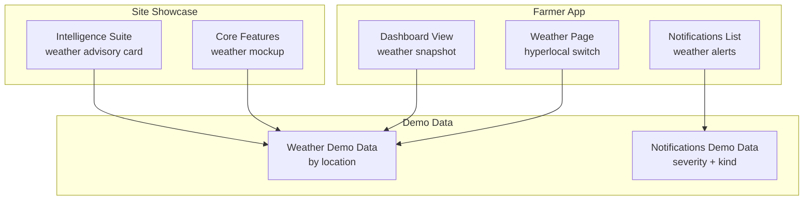
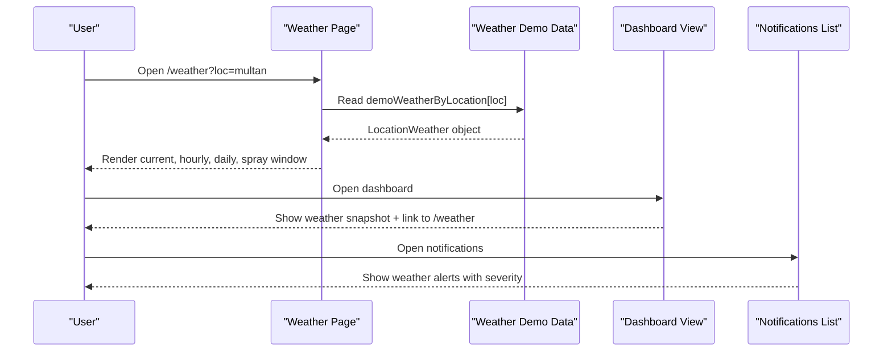
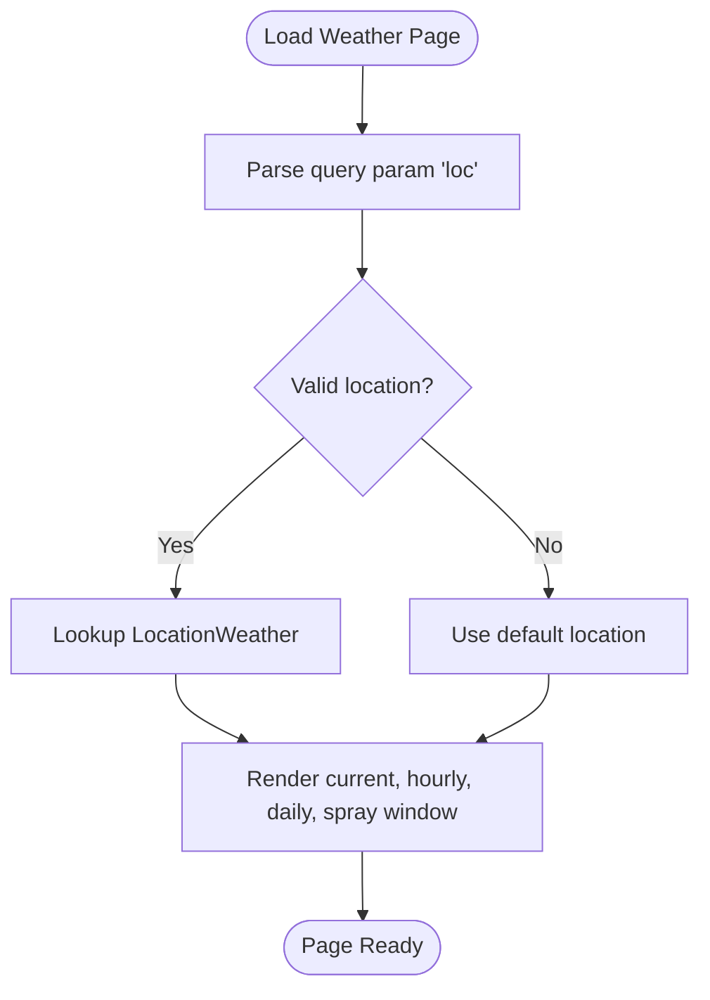
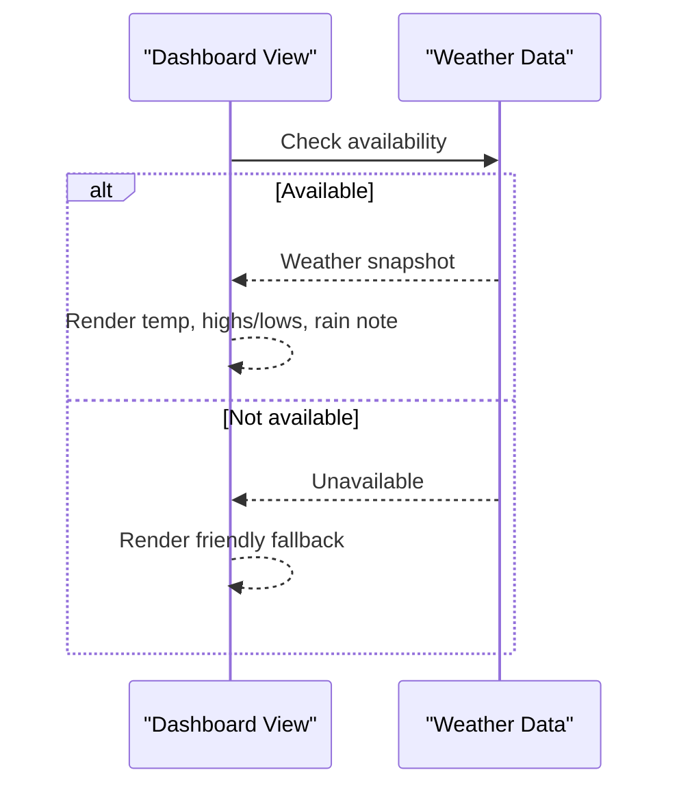
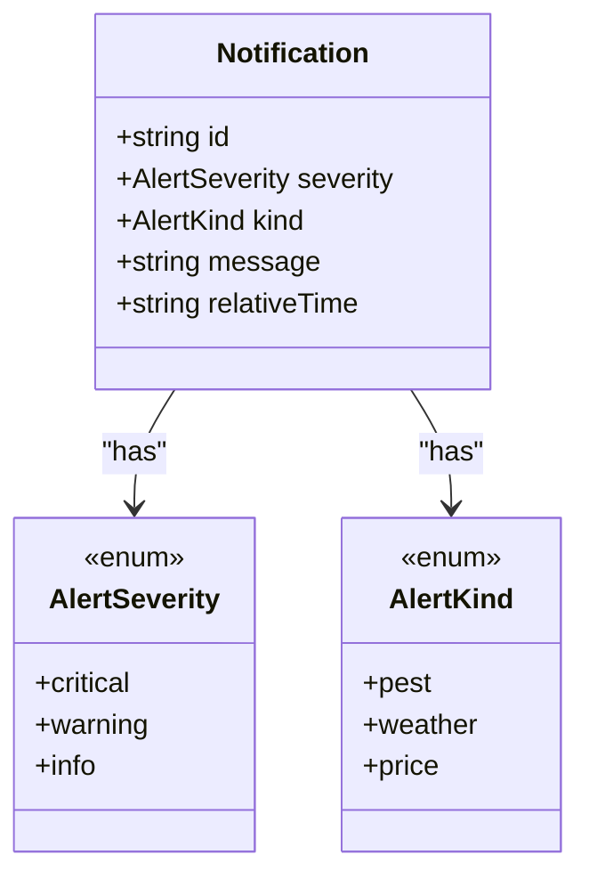
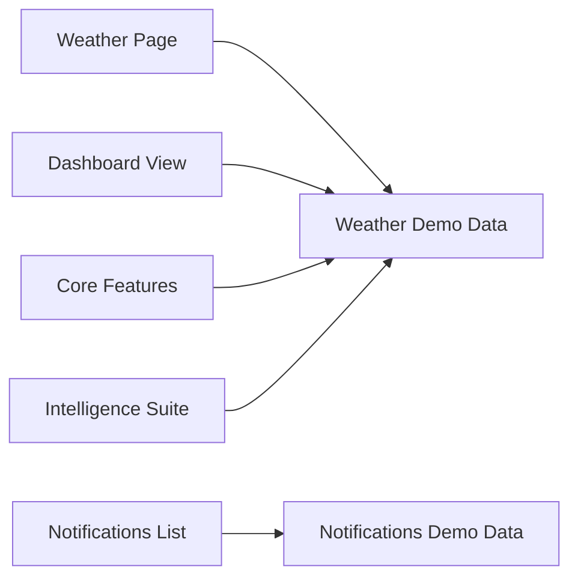

# Weather Intelligence

<cite>
**Referenced Files in This Document**
- [page.tsx](file://app/(farmer)/(dashboard)/weather/page.tsx)
- [demo-data.ts](file://app/(farmer)/(dashboard)/weather/demo-data.ts)
- [dashboard-view.tsx](file://app/(farmer)/(dashboard)/dashboard/dashboard-view.tsx)
- [notifications-list.tsx](file://app/(farmer)/(dashboard)/notifications/notifications-list.tsx)
- [demo-data.ts](file://app/(farmer)/(dashboard)/notifications/demo-data.ts)
- [CoreFeatures.tsx](file://app/(site)/[locale]/sections/CoreFeatures.tsx)
- [IntelligenceSuite.tsx](file://app/(site)/[locale]/features/sections/IntelligenceSuite.tsx)
- [Agropioo_features.md](file://docs/Agropioo_features.md)
</cite>

## Table of Contents
1. Introduction
2. Project Structure
3. Core Components
4. Architecture Overview
5. Detailed Component Analysis
6. Dependency Analysis
7. Performance Considerations
8. Troubleshooting Guide
9. Conclusion
10. Appendices

## Introduction
This document explains Agropioo’s weather intelligence feature as implemented in the current codebase. It covers:
- Hyperlocal weather forecasting via location switching
- Agricultural alerts and notifications tied to weather events
- Demo data structures for weather and alerts
- UI patterns for real-time-like updates, offline-friendly design, and mobile responsiveness
- Accessibility considerations for farmers with limited connectivity
- Guidance for integrating external weather APIs and handling network failures

The weather module is currently a demo build using typed local data. It provides a foundation for future server-side integration and caching strategies.

## Project Structure
Weather-related functionality spans several pages and shared components:
- Weather page: renders current conditions, hourly outlook, five-day forecast, and spray window guidance
- Dashboard: shows a compact weather snapshot and links to the full forecast
- Notifications: aggregates weather, pest, and price alerts with severity styling
- Site sections: showcase weather-aware advisories and mockups

**Diagram sources**
- [page.tsx:15-58](file://app/(farmer)/(dashboard)/weather/page.tsx#L15-L58)
- [demo-data.ts:19-33](file://app/(farmer)/(dashboard)/weather/demo-data.ts#L19-L33)
- [dashboard-view.tsx:304-360](file://app/(farmer)/(dashboard)/dashboard/dashboard-view.tsx#L304-L360)
- [notifications-list.tsx:14-30](file://app/(farmer)/(dashboard)/notifications/notifications-list.tsx#L14-L30)
- [demo-data.ts:6-15](file://app/(farmer)/(dashboard)/notifications/demo-data.ts#L6-L15)
- [CoreFeatures.tsx:236-260](file://app/(site)/[locale]/sections/CoreFeatures.tsx#L236-L260)
- [IntelligenceSuite.tsx:143-165](file://app/(site)/[locale]/features/sections/IntelligenceSuite.tsx#L143-L165)

**Section sources**
- [page.tsx:15-58](file://app/(farmer)/(dashboard)/weather/page.tsx#L15-L58)
- [dashboard-view.tsx:304-360](file://app/(farmer)/(dashboard)/dashboard/dashboard-view.tsx#L304-L360)
- [notifications-list.tsx:14-30](file://app/(farmer)/(dashboard)/notifications/notifications-list.tsx#L14-L30)
- [CoreFeatures.tsx:236-260](file://app/(site)/[locale]/sections/CoreFeatures.tsx#L236-L260)
- [IntelligenceSuite.tsx:143-165](file://app/(site)/[locale]/features/sections/IntelligenceSuite.tsx#L143-L165)

## Core Components
- Weather Page: Renders current conditions, next-hours cards, and a five-day list. Supports hyperlocal switching via query parameter and includes a “Best spray window” tip derived from weather context.
- Dashboard Weather Snapshot: Displays temperature, highs/lows, rain note, and a link to the full forecast. Provides an explanatory fallback when weather is unavailable.
- Notifications: Centralized alert center with severity chips (critical/watch/info), icons per kind (pest/weather/price), and session-only read state.
- Demo Data Models: Typed structures for weather by location and notifications, ensuring consistency across screens.

Key responsibilities:
- Location-based rendering and deep-linkable URLs for hyperlocal forecasts
- Clear visual hierarchy for actionable insights (spray windows, rain notes)
- Unified alert taxonomy and severity presentation
- Accessible markup with semantic headings and ARIA labels

**Section sources**
- [page.tsx:39-176](file://app/(farmer)/(dashboard)/weather/page.tsx#L39-L176)
- [dashboard-view.tsx:304-360](file://app/(farmer)/(dashboard)/dashboard/dashboard-view.tsx#L304-L360)
- [notifications-list.tsx:14-99](file://app/(farmer)/(dashboard)/notifications/notifications-list.tsx#L14-L99)
- [demo-data.ts:19-33](file://app/(farmer)/(dashboard)/weather/demo-data.ts#L19-L33)
- [demo-data.ts:6-15](file://app/(farmer)/(dashboard)/notifications/demo-data.ts#L6-L15)

## Architecture Overview
The weather intelligence flow in the demo uses client-side data and routing to simulate hyperlocal behavior. Future integrations can replace the demo data layer with API calls while preserving the same UI contracts.

**Diagram sources**
- [page.tsx:15-58](file://app/(farmer)/(dashboard)/weather/page.tsx#L15-L58)
- [demo-data.ts:35-114](file://app/(farmer)/(dashboard)/weather/demo-data.ts#L35-L114)
- [dashboard-view.tsx:304-360](file://app/(farmer)/(dashboard)/dashboard/dashboard-view.tsx#L304-L360)
- [notifications-list.tsx:14-99](file://app/(farmer)/(dashboard)/notifications/notifications-list.tsx#L14-L99)

## Detailed Component Analysis

### Weather Page (Hyperlocal Forecasting)
- Location switching: Uses a query parameter to select among predefined locations; defaults to a safe choice if invalid.
- Sections:
  - Current conditions with temperature, high/low, and rain note
  - Best spray window tip based on weather context
  - Next hours horizontal scroll with temperature and rain probability
  - Five-day outlook with condition, rain chance, and temperature range
- Accessibility: Semantic headings, aria-labels for temperatures, and keyboard-friendly navigation.

**Diagram sources**
- [page.tsx:15-58](file://app/(farmer)/(dashboard)/weather/page.tsx#L15-L58)
- [demo-data.ts:32-33](file://app/(farmer)/(dashboard)/weather/demo-data.ts#L32-L33)

**Section sources**
- [page.tsx:15-176](file://app/(farmer)/(dashboard)/weather/page.tsx#L15-L176)
- [demo-data.ts:19-114](file://app/(farmer)/(dashboard)/weather/demo-data.ts#L19-L114)

### Dashboard Weather Snapshot
- Displays a concise weather summary and a link to the full forecast.
- Includes an explanatory fallback message when weather is not available, keeping the user informed without error dumps.

**Diagram sources**
- [dashboard-view.tsx:304-360](file://app/(farmer)/(dashboard)/dashboard/dashboard-view.tsx#L304-L360)

**Section sources**
- [dashboard-view.tsx:304-360](file://app/(farmer)/(dashboard)/dashboard/dashboard-view.tsx#L304-L360)

### Notifications and Weather Alerts
- Alert kinds include weather, pest, and price. Severity levels are critical, warning, and info.
- Session-only read state allows quick triage without backend persistence in the demo.
- Icons and color chips communicate urgency at a glance.

**Diagram sources**
- [demo-data.ts:6-15](file://app/(farmer)/(dashboard)/notifications/demo-data.ts#L6-L15)
- [notifications-list.tsx:14-30](file://app/(farmer)/(dashboard)/notifications/notifications-list.tsx#L14-L30)

**Section sources**
- [notifications-list.tsx:14-99](file://app/(farmer)/(dashboard)/notifications/notifications-list.tsx#L14-L99)
- [demo-data.ts:6-15](file://app/(farmer)/(dashboard)/notifications/demo-data.ts#L6-L15)

### Site Showcase: Weather-Aware Advisories
- The site highlights weather-aware features with mockups that illustrate how advisories adapt to forecast changes.
- These sections demonstrate the intended user experience for weather-informed decisions like delaying irrigation or scheduling sprays.

**Section sources**
- [CoreFeatures.tsx:236-260](file://app/(site)/[locale]/sections/CoreFeatures.tsx#L236-L260)
- [IntelligenceSuite.tsx:143-165](file://app/(site)/[locale]/features/sections/IntelligenceSuite.tsx#L143-L165)

## Dependency Analysis
- Weather Page depends on typed demo data for locations and forecasts.
- Dashboard integrates a simplified weather snapshot and navigates to the full forecast.
- Notifications depend on a shared alert model and render severity consistently.
- Site sections reference weather concepts to showcase product value.

**Diagram sources**
- [page.tsx:15-58](file://app/(farmer)/(dashboard)/weather/page.tsx#L15-L58)
- [demo-data.ts:19-33](file://app/(farmer)/(dashboard)/weather/demo-data.ts#L19-L33)
- [dashboard-view.tsx:304-360](file://app/(farmer)/(dashboard)/dashboard/dashboard-view.tsx#L304-L360)
- [notifications-list.tsx:14-30](file://app/(farmer)/(dashboard)/notifications/notifications-list.tsx#L14-L30)
- [demo-data.ts:6-15](file://app/(farmer)/(dashboard)/notifications/demo-data.ts#L6-L15)
- [CoreFeatures.tsx:236-260](file://app/(site)/[locale]/sections/CoreFeatures.tsx#L236-L260)
- [IntelligenceSuite.tsx:143-165](file://app/(site)/[locale]/features/sections/IntelligenceSuite.tsx#L143-L165)

**Section sources**
- [page.tsx:15-58](file://app/(farmer)/(dashboard)/weather/page.tsx#L15-L58)
- [dashboard-view.tsx:304-360](file://app/(farmer)/(dashboard)/dashboard/dashboard-view.tsx#L304-L360)
- [notifications-list.tsx:14-30](file://app/(farmer)/(dashboard)/notifications/notifications-list.tsx#L14-L30)
- [CoreFeatures.tsx:236-260](file://app/(site)/[locale]/sections/CoreFeatures.tsx#L236-L260)
- [IntelligenceSuite.tsx:143-165](file://app/(site)/[locale]/features/sections/IntelligenceSuite.tsx#L143-L165)

## Performance Considerations
- Client-side rendering of small lists (hourly/daily) is lightweight and suitable for low-end devices.
- Horizontal scrolling for hourly forecasts reduces vertical space usage on mobile.
- Using static demo data avoids network overhead during development and ensures fast initial load.

[No sources needed since this section provides general guidance]

## Troubleshooting Guide
- Weather unavailable in dashboard: The component shows a friendly fallback message instead of technical errors, guiding users to retry later.
- Invalid location query: The weather page falls back to a default location to prevent blank states.
- Notifications read state: Marking all as read is session-only; refreshing resets state in the demo.

Recommended checks:
- Ensure the query parameter matches one of the supported location IDs.
- Verify that the weather section is not hidden by layout constraints on narrow screens.
- Confirm that alert severity and kind enums match the demo data types.

**Section sources**
- [dashboard-view.tsx:347-360](file://app/(farmer)/(dashboard)/dashboard/dashboard-view.tsx#L347-L360)
- [page.tsx:15-29](file://app/(farmer)/(dashboard)/weather/page.tsx#L15-L29)
- [notifications-list.tsx:32-53](file://app/(farmer)/(dashboard)/notifications/notifications-list.tsx#L32-L53)

## Conclusion
Agropioo’s weather intelligence feature currently demonstrates hyperlocal forecasting, actionable agricultural tips, and unified alerts through a clean, accessible UI built on typed demo data. The structure supports straightforward migration to live weather APIs, offline caching, and background sync to serve farmers reliably in rural areas with intermittent connectivity.

[No sources needed since this section summarizes without analyzing specific files]

## Appendices

### Demo Data Structures
- Weather by location:
  - Fields include label, condition, temperature, highs/lows, rain chance/note, spray window, hourly points, and daily forecasts.
- Notifications:
  - Fields include id, severity, kind, message, and relative time.

These structures define the contract between UI components and data sources, enabling easy replacement with API responses.

**Section sources**
- [demo-data.ts:19-33](file://app/(farmer)/(dashboard)/weather/demo-data.ts#L19-L33)
- [demo-data.ts:35-114](file://app/(farmer)/(dashboard)/weather/demo-data.ts#L35-L114)
- [demo-data.ts:6-15](file://app/(farmer)/(dashboard)/notifications/demo-data.ts#L6-L15)

### Offline Caching Strategy (Planned)
The project documentation outlines a PWA-oriented approach including service workers, Workbox, IndexedDB, and background sync. This strategy enables:
- Caching weather payloads for offline access
- Queuing actions until connectivity resumes
- Reducing data usage and improving resilience in spotty networks

**Section sources**
- [Agropioo_features.md:345-355](file://docs/Agropioo_features.md#L345-L355)

### Accessibility Notes
- Semantic headings and landmarks improve screen reader navigation.
- ARIA labels provide precise context for numeric values (e.g., temperature).
- High-contrast color usage and clear typography support readability in bright outdoor conditions.

[No sources needed since this section provides general guidance]