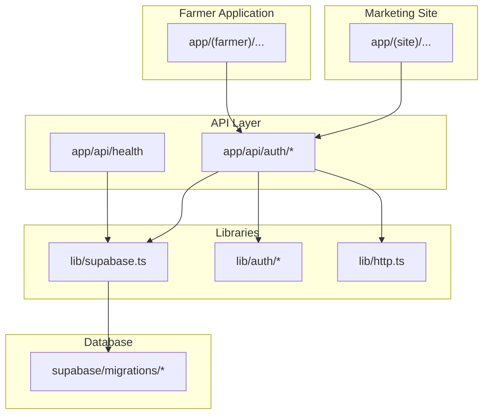
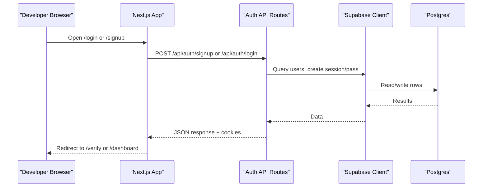
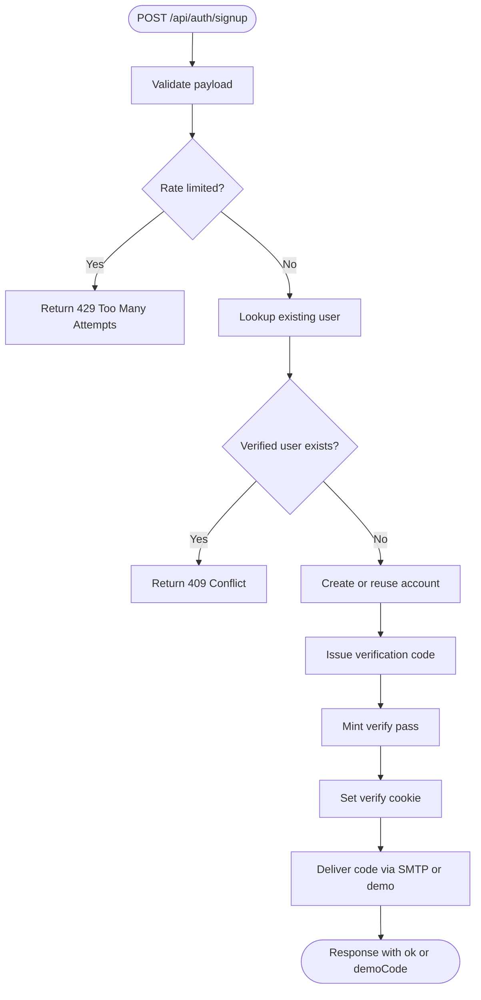
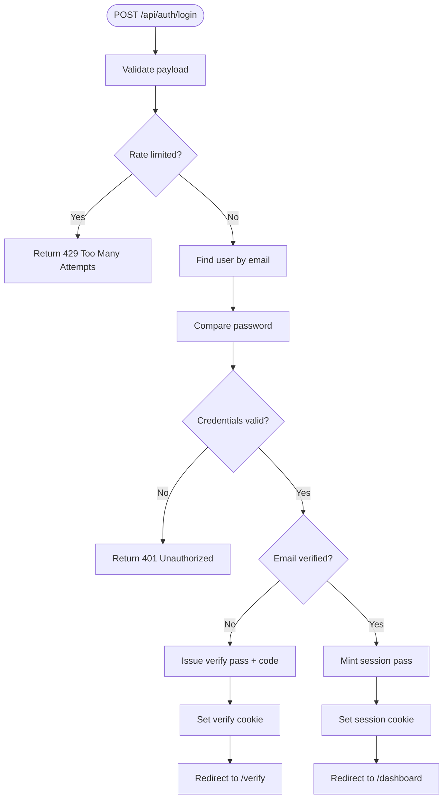
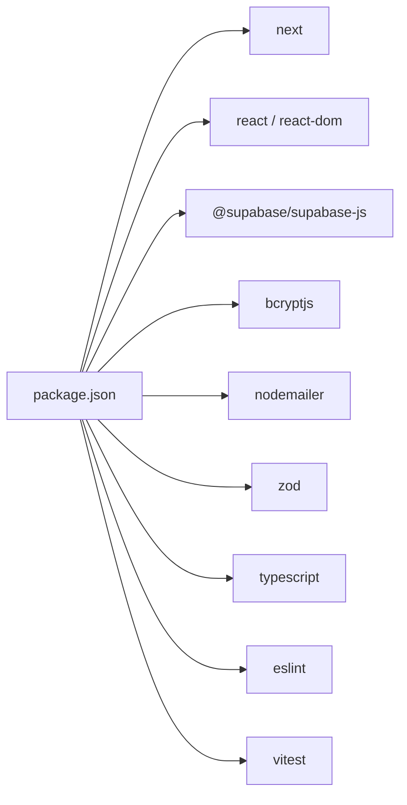

# Getting Started

<cite>
**Referenced Files in This Document**
- [package.json](file://package.json)
- [README.md](file://README.md)
- [next.config.ts](file://next.config.ts)
- [.env.example](file://.env.example)
- [lib/supabase.ts](file://lib/supabase.ts)
- [supabase/migrations/0001_translations.sql](file://supabase/migrations/0001_translations.sql)
- [supabase/migrations/0002_auth.sql](file://supabase/migrations/0002_auth.sql)
- [app/api/auth/login/route.ts](file://app/api/auth/login/route.ts)
- [app/api/auth/signup/route.ts](file://app/api/auth/signup/route.ts)
- [app/api/health/route.ts](file://app/api/health/route.ts)
</cite>

## Table of Contents
1. Introduction
2. Project Structure
3. Core Components
4. Architecture Overview
5. Detailed Component Analysis
6. Dependency Analysis
7. Performance Considerations
8. Troubleshooting Guide
9. Conclusion
10. Appendices

## Introduction
This guide helps new developers set up the Agropioo development environment, run the app locally, and understand how the marketing site and farmer application are organized. It covers Node.js requirements, installing dependencies with npm/yarn/pnpm/bun, configuring Supabase and email settings, applying database migrations, starting the development server, and verifying that everything works. It also includes a first-time contributor workflow for authentication flows and basic development tasks.

## Project Structure
Agropioo is a Next.js App Router project with two main areas:
- Marketing site under app/(site): localized pages and sections for features, vision, and onboarding.
- Farmer application under app/(farmer): authenticated dashboard, farms, records, advisor chat, prices, weather, notifications, and settings.

Shared layers include:
- API routes under app/api for authentication endpoints and health checks.
- Shared libraries under lib for Supabase client, auth logic, HTTP helpers, and i18n utilities.
- Database schema under supabase/migrations for translations and authentication tables.
- UI components under components for both marketing and app shells.

**Diagram sources**
- [next.config.ts:1-12](file://next.config.ts#L1-L12)
- [lib/supabase.ts:1-47](file://lib/supabase.ts#L1-L47)
- [app/api/auth/login/route.ts:1-112](file://app/api/auth/login/route.ts#L1-L112)
- [app/api/auth/signup/route.ts:1-119](file://app/api/auth/signup/route.ts#L1-L119)
- [app/api/health/route.ts:1-17](file://app/api/health/route.ts#L1-L17)

**Section sources**
- [next.config.ts:1-12](file://next.config.ts#L1-L12)
- [package.json:1-38](file://package.json#L1-L38)

## Core Components
- Development scripts and tooling: The project uses Next.js with TypeScript, Tailwind CSS, ESLint, and Vitest for testing. Scripts support dev, build, start, lint, test, and translation sync.
- Supabase client: Provides anon and service-role clients with strict environment variable checks to ensure secure access patterns.
- Authentication API: Route handlers implement signup, login, logout, password reset, and verification flows using hashed passwords, rate limiting, and JWT-based passes stored as cookies.
- Health endpoint: Validates connectivity to Supabase by querying a table and returning a simple status.

Key responsibilities:
- package.json defines commands and dependencies for running and building the app.
- lib/supabase.ts centralizes Supabase client creation and enforces required environment variables.
- app/api/auth/* implements the core authentication lifecycle and security controls.
- app/api/health provides a quick integration check for the database connection.

**Section sources**
- [package.json:1-38](file://package.json#L1-L38)
- [lib/supabase.ts:1-47](file://lib/supabase.ts#L1-L47)
- [app/api/auth/login/route.ts:1-112](file://app/api/auth/login/route.ts#L1-L112)
- [app/api/auth/signup/route.ts:1-119](file://app/api/auth/signup/route.ts#L1-L119)
- [app/api/health/route.ts:1-17](file://app/api/health/route.ts#L1-L17)

## Architecture Overview
The app follows a layered architecture:
- Frontend (Next.js App Router) renders marketing pages and the farmer dashboard.
- API routes handle authentication and health checks.
- Supabase Postgres stores user accounts, sessions, verification codes, and translations.
- Environment configuration drives Supabase URLs, keys, SMTP settings, and demo mode.

**Diagram sources**
- [app/api/auth/signup/route.ts:1-119](file://app/api/auth/signup/route.ts#L1-L119)
- [app/api/auth/login/route.ts:1-112](file://app/api/auth/login/route.ts#L1-L112)
- [lib/supabase.ts:1-47](file://lib/supabase.ts#L1-L47)

## Detailed Component Analysis

### Environment Setup and Supabase Configuration
- Required environment variables:
  - SUPABASE_URL, SUPABASE_ANON_KEY for client access.
  - SUPABASE_SERVICE_ROLE_KEY for server-side maintenance tasks only.
  - JWT_SECRET for signing auth passes.
  - SMTP_* variables for sending verification emails.
  - DEMO_MODE to enable local demo code delivery when SMTP is not configured.
- Supabase client behavior:
  - getSupabase returns an anon client; missing URL or key throws an error.
  - getSupabaseAdmin requires the service role key and is intended for trusted server-only scripts.

Steps:
1. Copy .env.example to .env.local and fill in values from your Supabase project and email provider.
2. Ensure SUPABASE_URL and SUPABASE_ANON_KEY are set before running the app.
3. For server-only scripts, set SUPABASE_SERVICE_ROLE_KEY and never expose it to the browser.

**Section sources**
- [.env.example:1-21](file://.env.example#L1-L21)
- [lib/supabase.ts:1-47](file://lib/supabase.ts#L1-L47)

### Database Migrations
Two migrations define the initial schema:
- Translations table for multilingual marketing copy with public read policies.
- Authentication tables for users, pass states, verification codes, and sessions.

Apply migrations to your Supabase project before running the app to avoid runtime errors.

Verification:
- Use the health endpoint to confirm connectivity after migrations.

**Section sources**
- [supabase/migrations/0001_translations.sql:1-31](file://supabase/migrations/0001_translations.sql#L1-L31)
- [supabase/migrations/0002_auth.sql:1-61](file://supabase/migrations/0002_auth.sql#L1-L61)
- [app/api/health/route.ts:1-17](file://app/api/health/route.ts#L1-L17)

### Authentication Flows
Signup flow:
- Validates input, applies rate limits, hashes password, creates or reuses account, issues verification code and pass, sets cookie, and sends email.

Login flow:
- Validates input, applies rate limits, compares password securely, handles unverified accounts by issuing a verification pass and redirecting to verify, and issues a session pass for verified accounts.

**Diagram sources**
- [app/api/auth/signup/route.ts:1-119](file://app/api/auth/signup/route.ts#L1-L119)

**Diagram sources**
- [app/api/auth/login/route.ts:1-112](file://app/api/auth/login/route.ts#L1-L112)

**Section sources**
- [app/api/auth/signup/route.ts:1-119](file://app/api/auth/signup/route.ts#L1-L119)
- [app/api/auth/login/route.ts:1-112](file://app/api/auth/login/route.ts#L1-L112)

### Health Check Endpoint
Use the health endpoint to verify that the app can connect to Supabase after setup.

Expected behavior:
- Returns a success status when the database is reachable.
- Returns an error status if there is a connection or query issue.

**Section sources**
- [app/api/health/route.ts:1-17](file://app/api/health/route.ts#L1-L17)

## Dependency Analysis
Core runtime dependencies include Next.js, React, Supabase client, bcryptjs, jose, nodemailer, react-hook-form, and zod. Development dependencies include Tailwind, ESLint, TypeScript, and Vitest.

**Diagram sources**
- [package.json:1-38](file://package.json#L1-L38)

**Section sources**
- [package.json:1-38](file://package.json#L1-L38)

## Performance Considerations
- Use the anon Supabase client for normal requests; reserve the service-role client for trusted server-side tasks only.
- Leverage rate limiting in authentication endpoints to protect against brute-force attempts.
- Keep environment variables minimal and scoped to their purpose to reduce risk and improve clarity.
- Prefer server-side validation and hashing to minimize client-side overhead.

[No sources needed since this section provides general guidance]

## Troubleshooting Guide
Common setup issues and resolutions:
- Missing environment variables:
  - Symptom: Errors indicating missing SUPABASE_URL or SUPABASE_ANON_KEY.
  - Resolution: Populate .env.local with values from your Supabase project.
- Service role key misconfiguration:
  - Symptom: Server-side scripts fail due to missing SUPABASE_SERVICE_ROLE_KEY.
  - Resolution: Add the service role key to .env.local and ensure it is not exposed to the browser.
- SMTP not configured:
  - Symptom: Verification emails do not send during development.
  - Resolution: Configure SMTP_* variables or enable DEMO_MODE to receive demo codes locally.
- Database not migrated:
  - Symptom: Health check fails or authentication endpoints error on unknown tables.
  - Resolution: Apply migrations from supabase/migrations to your Supabase project.
- Health check failures:
  - Symptom: GET /api/health returns an error status.
  - Resolution: Verify Supabase credentials and network connectivity; ensure migrations are applied.

Verification steps:
- Run the development server and open http://localhost:3000.
- Call GET /api/health to confirm database connectivity.
- Attempt signup and login flows to validate authentication and email delivery.

**Section sources**
- [lib/supabase.ts:1-47](file://lib/supabase.ts#L1-L47)
- [app/api/health/route.ts:1-17](file://app/api/health/route.ts#L1-L17)
- [.env.example:1-21](file://.env.example#L1-L21)

## Conclusion
You now have the essentials to set up Agropioo locally, configure Supabase and email, apply migrations, and run the development server. Use the health endpoint and authentication flows to verify your setup. Explore the marketing site and farmer application routes to understand the separation of concerns and begin contributing confidently.

[No sources needed since this section summarizes without analyzing specific files]

## Appendices

### Installation and Startup Checklist
- Install Node.js compatible with Next.js 16.x.
- Clone the repository and install dependencies using npm, yarn, pnpm, or bun.
- Copy .env.example to .env.local and fill in Supabase and SMTP settings.
- Apply database migrations to your Supabase project.
- Start the development server and open http://localhost:3000.
- Verify connectivity via GET /api/health.

**Section sources**
- [README.md:1-37](file://README.md#L1-L37)
- [package.json:1-38](file://package.json#L1-L38)
- [.env.example:1-21](file://.env.example#L1-L21)
- [supabase/migrations/0001_translations.sql:1-31](file://supabase/migrations/0001_translations.sql#L1-L31)
- [supabase/migrations/0002_auth.sql:1-61](file://supabase/migrations/0002_auth.sql#L1-L61)
- [app/api/health/route.ts:1-17](file://app/api/health/route.ts#L1-L17)

### First-Time Contributor Workflow
- Create a feature branch and make changes to app/(site) or app/(farmer).
- If modifying data models, add or update migrations under supabase/migrations and apply them locally.
- Test authentication flows by creating a test account and verifying email delivery or demo mode.
- Run linters and tests to ensure code quality.
- Commit changes and open a pull request with clear descriptions.

**Section sources**
- [package.json:1-38](file://package.json#L1-L38)
- [app/api/auth/signup/route.ts:1-119](file://app/api/auth/signup/route.ts#L1-L119)
- [app/api/auth/login/route.ts:1-112](file://app/api/auth/login/route.ts#L1-L112)