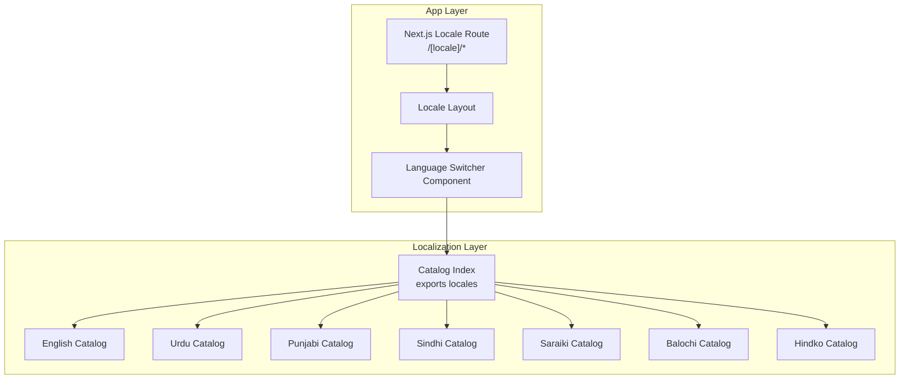
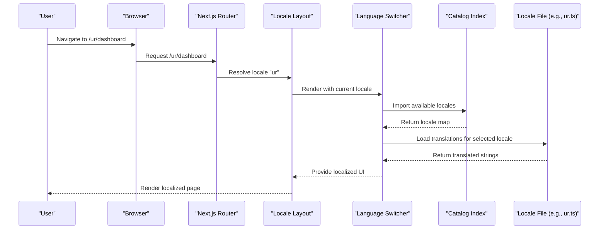
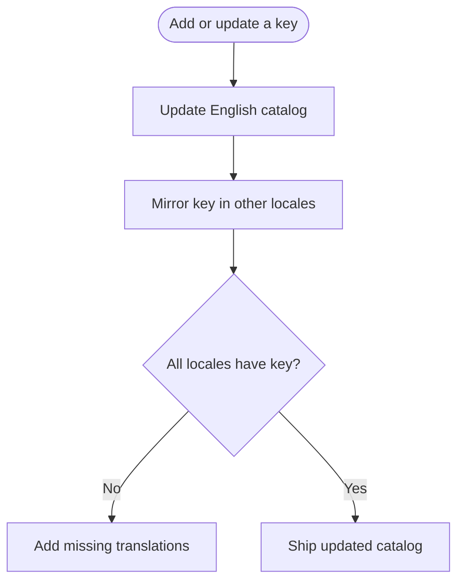
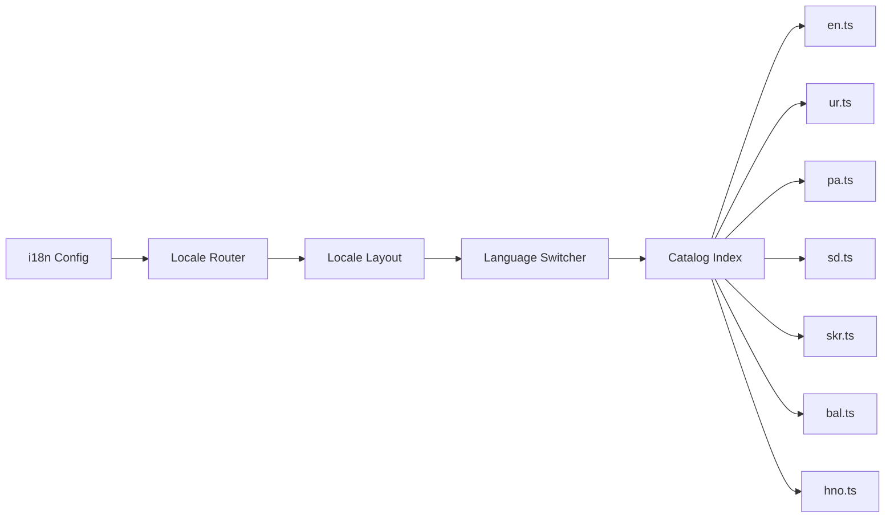

# Cultural Adaptation and Localization

<cite>
**Referenced Files in This Document**
- [catalog/index.ts](file://catalog/index.ts)
- [catalog/en.ts](file://catalog/en.ts)
- [catalog/ur.ts](file://catalog/ur.ts)
- [catalog/pa.ts](file://catalog/pa.ts)
- [catalog/bal.ts](file://catalog/bal.ts)
- [catalog/hno.ts](file://catalog/hno.ts)
- [catalog/sd.ts](file://catalog/sd.ts)
- [catalog/skr.ts](file://catalog/skr.ts)
- [components/language-switcher.tsx](file://components/language-switcher.tsx)
- [app/(site)/[locale]/layout.tsx](file://app/(site)/[locale]/layout.tsx)
- [lib/i18n/config.ts](file://lib/i18n/config.ts)
</cite>

## Table of Contents
1. Introduction
2. Project Structure
3. Core Components
4. Architecture Overview
5. Detailed Component Analysis
6. Dependency Analysis
7. Performance Considerations
8. Troubleshooting Guide
9. Conclusion

## Introduction
This document explains how Agropioo adapts to cultural and regional needs, focusing on:
- Date and time formatting for different regions
- Number formatting with locale-specific decimal separators and currency symbols
- Calendar system adaptations
- Font loading strategies for diverse scripts (Devanagari, Arabic, Latin)
- Culturally appropriate content variations, including agricultural terminology for Pakistan’s regions
- Regional preferences such as measurement units, business hours, and work schedules
- Accessibility considerations for diverse linguistic communities
- Testing approaches for cultural accuracy

The implementation is centered around a typed translation catalog that supports multiple Pakistani languages and integrates with Next.js routing and i18n configuration.

## Project Structure
Agropioo organizes localization assets under a dedicated catalog module and exposes them through a central index. The site uses Next.js internationalized routing to serve localized pages and components to render language-aware UI.

**Diagram sources**
- [catalog/index.ts:1-41](file://catalog/index.ts#L1-L41)
- [app/(site)/[locale]/layout.tsx](file://app/(site)/[locale]/layout.tsx)
- [components/language-switcher.tsx](file://components/language-switcher.tsx)

**Section sources**
- [catalog/index.ts:1-41](file://catalog/index.ts#L1-L41)
- [catalog/en.ts:1-708](file://catalog/en.ts#L1-L708)
- [catalog/ur.ts:1-702](file://catalog/ur.ts#L1-L702)
- [catalog/pa.ts:1-702](file://catalog/pa.ts#L1-L702)
- [catalog/bal.ts:1-702](file://catalog/bal.ts#L1-L702)
- [catalog/hno.ts:1-702](file://catalog/hno.ts#L1-L702)
- [catalog/sd.ts:1-702](file://catalog/sd.ts#L1-L702)
- [catalog/skr.ts:1-702](file://catalog/skr.ts#L1-L702)

## Core Components
- Typed translation catalog: A single source of truth keyed by stable identifiers ensures consistency across all supported languages.
- Locale routing: Pages are served under /[locale], enabling clean URL-based language selection.
- Language switcher: A UI component allows users to change the active language at runtime.
- Configuration: Central i18n configuration defines supported locales and fallback behavior.

Key responsibilities:
- Provide consistent keys across languages
- Enable runtime language switching
- Support right-to-left text direction where needed
- Keep English as the canonical source for key coverage

**Section sources**
- [catalog/index.ts:1-41](file://catalog/index.ts#L1-L41)
- [components/language-switcher.tsx](file://components/language-switcher.tsx)
- [app/(site)/[locale]/layout.tsx](file://app/(site)/[locale]/layout.tsx)
- [lib/i18n/config.ts](file://lib/i18n/config.ts)

## Architecture Overview
The localization architecture combines static catalogs with dynamic routing and a language switcher. Content is authored in English and mirrored into other languages using shared keys. The app resolves the current locale from the URL and renders localized strings via the catalog.

**Diagram sources**
- [catalog/index.ts:1-41](file://catalog/index.ts#L1-L41)
- [app/(site)/[locale]/layout.tsx](file://app/(site)/[locale]/layout.tsx)
- [components/language-switcher.tsx](file://components/language-switcher.tsx)

## Detailed Component Analysis

### Translation Catalog System
- Centralized catalog exports a map of locales to their translation objects.
- Each locale file mirrors the English key set, ensuring full coverage.
- Keys are typed to prevent mismatches and improve developer experience.

Implementation highlights:
- Single source of truth in English
- Mirrored translations for Urdu, Punjabi, Sindhi, Saraiki, Balochi, Hindko
- Exported keys used throughout the app for type safety

**Diagram sources**
- [catalog/index.ts:1-41](file://catalog/index.ts#L1-L41)
- [catalog/en.ts:1-708](file://catalog/en.ts#L1-L708)
- [catalog/ur.ts:1-702](file://catalog/ur.ts#L1-L702)
- [catalog/pa.ts:1-702](file://catalog/pa.ts#L1-L702)
- [catalog/sd.ts:1-702](file://catalog/sd.ts#L1-L702)
- [catalog/skr.ts:1-702](file://catalog/skr.ts#L1-L702)
- [catalog/bal.ts:1-702](file://catalog/bal.ts#L1-L702)
- [catalog/hno.ts:1-702](file://catalog/hno.ts#L1-L702)

**Section sources**
- [catalog/index.ts:1-41](file://catalog/index.ts#L1-L41)
- [catalog/en.ts:1-708](file://catalog/en.ts#L1-L708)

### Locale Routing and Layout
- Pages live under /[locale], allowing the router to infer the active language from the URL path.
- The layout component sets up locale context and can configure text direction based on script.

Operational notes:
- Use Next.js internationalized routing conventions
- Ensure fallbacks for missing locales
- Apply RTL styles when rendering Arabic/Persian/Urdu/Sindhi/Balochi/Hindko/Punjabi scripts

**Section sources**
- [app/(site)/[locale]/layout.tsx](file://app/(site)/[locale]/layout.tsx)

### Language Switcher Component
- Provides a user-facing control to change the active language without leaving the current page.
- Reads the current locale and offers options from the catalog’s supported locales.

Behavioral expectations:
- Updates URL to reflect new locale
- Persists user preference if configured
- Maintains navigation state appropriately

**Section sources**
- [components/language-switcher.tsx](file://components/language-switcher.tsx)

### i18n Configuration
- Defines supported locales and default locale.
- May include date/time number formatting settings and calendar preferences.

Configuration scope:
- Supported locales list
- Default locale fallback
- Optional region-specific formatters

**Section sources**
- [lib/i18n/config.ts](file://lib/i18n/config.ts)

## Dependency Analysis
The localization layer depends on:
- Catalog files for each locale
- Next.js routing to resolve locale from URL
- Language switcher to trigger locale changes
- i18n configuration to define supported locales and defaults

**Diagram sources**
- [lib/i18n/config.ts](file://lib/i18n/config.ts)
- [catalog/index.ts:1-41](file://catalog/index.ts#L1-L41)
- [app/(site)/[locale]/layout.tsx](file://app/(site)/[locale]/layout.tsx)
- [components/language-switcher.tsx](file://components/language-switcher.tsx)

**Section sources**
- [catalog/index.ts:1-41](file://catalog/index.ts#L1-L41)
- [lib/i18n/config.ts](file://lib/i18n/config.ts)

## Performance Considerations
- Keep catalogs small and modular; avoid embedding large assets in translation files.
- Prefer lazy-loading locale bundles if the app grows significantly.
- Cache locale data at build time where possible to reduce runtime overhead.
- Minimize re-renders when switching languages by memoizing localized components.

[No sources needed since this section provides general guidance]

## Troubleshooting Guide
Common issues and resolutions:
- Missing translations: Ensure every locale mirrors the English key set; use coverage tests to catch gaps.
- Incorrect text direction: Verify that RTL is applied for scripts like Urdu, Sindhi, Balochi, Hindko, and Punjabi when needed.
- Broken locale routing: Confirm URLs follow /[locale]/... and the router resolves the locale correctly.
- Inconsistent labels: Use the typed catalog keys to avoid typos and ensure consistent labeling across the app.

**Section sources**
- [catalog/index.ts:1-41](file://catalog/index.ts#L1-L41)
- [catalog/en.ts:1-708](file://catalog/en.ts#L1-L708)

## Conclusion
Agropioo’s localization strategy centers on a typed, key-driven catalog with robust support for multiple Pakistani languages. The combination of Next.js locale routing, a language switcher, and centralized configuration enables culturally appropriate experiences. To extend further:
- Add date/time and number formatting per region
- Implement calendar system adaptations
- Integrate font loading for diverse scripts
- Incorporate regional preferences for units and schedules
- Enhance accessibility features for low-literacy and voice-first users
- Establish testing practices for cultural accuracy

[No sources needed since this section summarizes without analyzing specific files]