# Internationalization (i18n)

<cite>
**Referenced Files in This Document**
- [config.ts](file://lib/i18n/config.ts)
- [logic.ts](file://lib/i18n/logic.ts)
- [format.ts](file://lib/i18n/format.ts)
- [server.ts](file://lib/i18n/server.ts)
- [localized.tsx](file://lib/i18n/localized.tsx)
- [index.ts](file://catalog/index.ts)
- [en.ts](file://catalog/en.ts)
- [ur.ts](file://catalog/ur.ts)
- [language-switcher.tsx](file://components/language-switcher.tsx)
- [layout.tsx](file://app/(site)/[locale]/layout.tsx)
- [sync-translations.mts](file://scripts/sync-translations.mts)
- [0001_translations.sql](file://supabase/migrations/0001_translations.sql)
- [spec.md](file://specs/language-compatibility/spec.md)
- [research.md](file://specs/language-compatibility/research.md)
</cite>

## Table of Contents
1. [Introduction](#introduction)
2. [Project Structure](#project-structure)
3. [Core Components](#core-components)
4. [Architecture Overview](#architecture-overview)
5. [Detailed Component Analysis](#detailed-component-analysis)
6. [Dependency Analysis](#dependency-analysis)
7. [Performance Considerations](#performance-considerations)
8. [Troubleshooting Guide](#troubleshooting-guide)
9. [Conclusion](#conclusion)
10. [Appendices](#appendices)

## Introduction
This document explains Agropioo’s internationalization system that supports eight languages: English, Urdu, Punjabi (Shahmukhi), Pashto, Sindhi, Saraiki, Balochi, and Hindko. It covers locale detection, dynamic font loading for right-to-left scripts, translation catalog management with live database overlays, a localized component wrapper, language switching behavior, and cultural adaptation patterns such as numeral formatting and bidi-safe rendering. It also provides guidelines for adding new languages, managing translations, and handling RTL text rendering safely.

## Project Structure
Agropioo implements i18n across configuration, runtime logic, server-side dictionary loading, client components, and a typed translation catalog synchronized into a database.

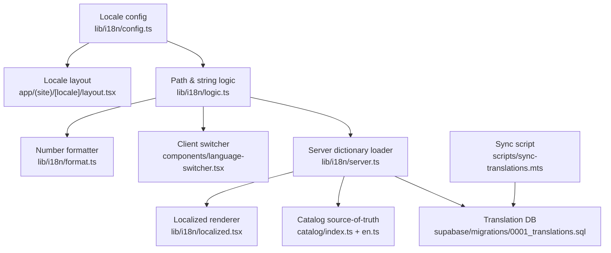

**Diagram sources**
- [config.ts:1-137](file://lib/i18n/config.ts#L1-L137)
- [logic.ts:1-101](file://lib/i18n/logic.ts#L1-L101)
- [server.ts:1-117](file://lib/i18n/server.ts#L1-L117)
- [0001_translations.sql:1-30](file://supabase/migrations/0001_translations.sql#L1-L30)
- [index.ts:1-41](file://catalog/index.ts#L1-L41)
- [en.ts:1-708](file://catalog/en.ts#L1-L708)
- [language-switcher.tsx:1-120](file://components/language-switcher.tsx#L1-L120)
- [layout.tsx:1-88](file://app/(site)/[locale]/layout.tsx#L1-L88)
- [sync-translations.mts:1-74](file://scripts/sync-translations.mts#L1-L74)

**Section sources**
- [config.ts:1-137](file://lib/i18n/config.ts#L1-L137)
- [index.ts:1-41](file://catalog/index.ts#L1-L41)
- [layout.tsx:1-88](file://app/(site)/[locale]/layout.tsx#L1-L88)

## Core Components
- Locale registry and direction: Central registry defines all supported locales, URL slugs, BCP 47 tags, and text direction to ensure consistent lang/dir output.
- Path parsing and navigation helpers: Pure functions split locale prefixes, build hrefs, and compute switched paths without side effects.
- Server dictionary loader: Loads per-request dictionaries from the database, merges with build-time catalog fallbacks, and exposes a translator function with placeholder substitution.
- Localized renderer: Renders resolved strings while isolating English fallbacks inside RTL pages to preserve bidi order.
- Number formatting: Applies Eastern Arabic-Indic numerals for local languages and Western digits for English via a single formatter.
- Language switcher: Full-page navigation to change locale, persists user choice in a cookie, and updates UI state accordingly.
- Locale layout: Sets <html lang> and dir, and conditionally loads Arabic-script fonts only for non-English locales.

**Section sources**
- [config.ts:1-137](file://lib/i18n/config.ts#L1-L137)
- [logic.ts:1-101](file://lib/i18n/logic.ts#L1-L101)
- [server.ts:1-117](file://lib/i18n/server.ts#L1-L117)
- [localized.tsx:1-20](file://lib/i18n/localized.tsx#L1-L20)
- [format.ts:1-28](file://lib/i18n/format.ts#L1-L28)
- [language-switcher.tsx:1-120](file://components/language-switcher.tsx#L1-L120)
- [layout.tsx:1-88](file://app/(site)/[locale]/layout.tsx#L1-L88)

## Architecture Overview
The i18n architecture combines static catalogs with a live database overlay. Pages request a dictionary for the current locale; the server merges build-time drafted copy with translated rows from the database. Client components use pure logic helpers to navigate between locales and render localized content safely. Fonts are loaded dynamically based on locale direction to avoid unnecessary downloads on English pages.

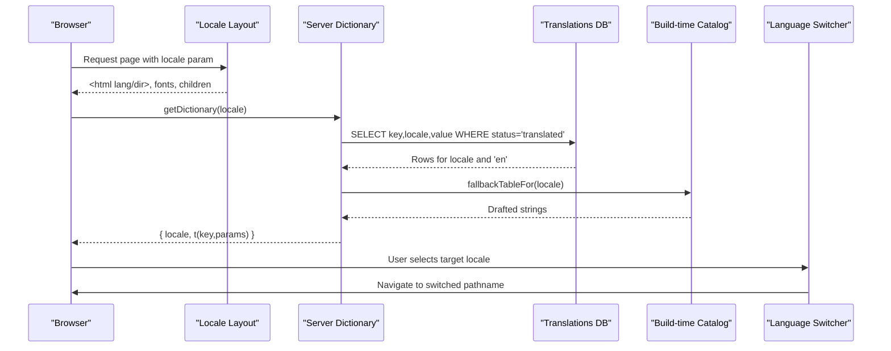

**Diagram sources**
- [layout.tsx:1-88](file://app/(site)/[locale]/layout.tsx#L1-L88)
- [server.ts:1-117](file://lib/i18n/server.ts#L1-L117)
- [0001_translations.sql:1-30](file://supabase/migrations/0001_translations.sql#L1-L30)
- [index.ts:1-41](file://catalog/index.ts#L1-L41)
- [language-switcher.tsx:1-120](file://components/language-switcher.tsx#L1-L120)

## Detailed Component Analysis

### Locale Registry and Direction
- Defines eight locales with unique slugs and BCP 47 tags.
- Ensures every localized language is marked RTL and English is LTR.
- Provides helper validators and mappers for slug-to-locale resolution.

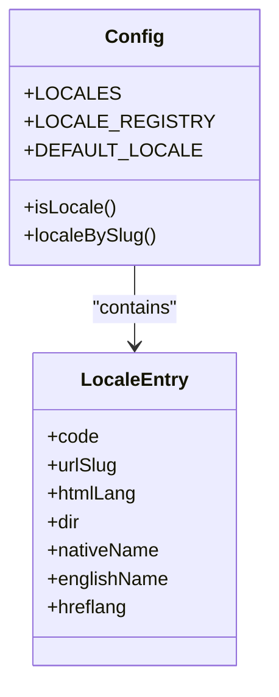

**Diagram sources**
- [config.ts:1-137](file://lib/i18n/config.ts#L1-L137)

**Section sources**
- [config.ts:1-137](file://lib/i18n/config.ts#L1-L137)

### Path Parsing and Navigation Logic
- Splits locale prefix from pathnames and normalizes canonical paths.
- Builds hrefs that keep English bare and add slugs for other locales.
- Computes switched pathnames when changing locale without navigating home incorrectly.

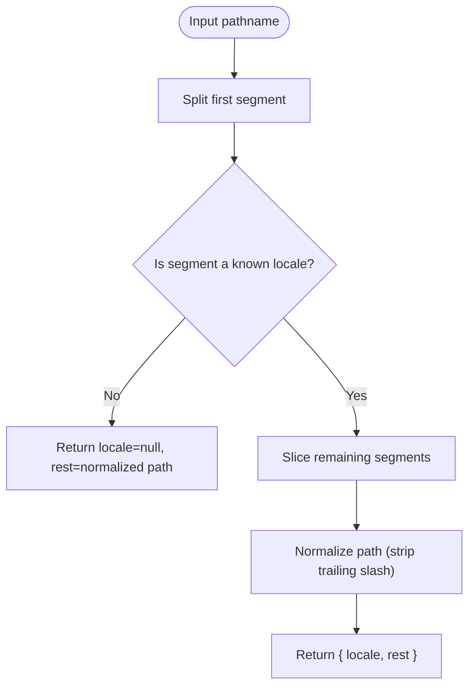

**Diagram sources**
- [logic.ts:1-101](file://lib/i18n/logic.ts#L1-L101)

**Section sources**
- [logic.ts:1-101](file://lib/i18n/logic.ts#L1-L101)

### Server Dictionary Loader and Translation Resolution
- Loads translated rows from the database for the requested locale and English.
- Merges DB results over build-time catalog fallbacks so missing or empty values fall back to English.
- Exposes a translator function that substitutes named placeholders and returns whether the value came from fallback.

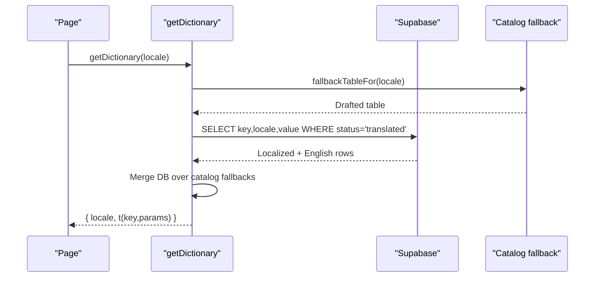

**Diagram sources**
- [server.ts:1-117](file://lib/i18n/server.ts#L1-L117)
- [0001_translations.sql:1-30](file://supabase/migrations/0001_translations.sql#L1-L30)
- [index.ts:1-41](file://catalog/index.ts#L1-L41)

**Section sources**
- [server.ts:1-117](file://lib/i18n/server.ts#L1-L117)
- [index.ts:1-41](file://catalog/index.ts#L1-L41)

### Localized Renderer and Bidi Safety
- Renders resolved strings; if the result is empty, renders nothing instead of raw keys.
- Wraps English fallbacks inside RTL pages with explicit lang and dir attributes to prevent bidi corruption.

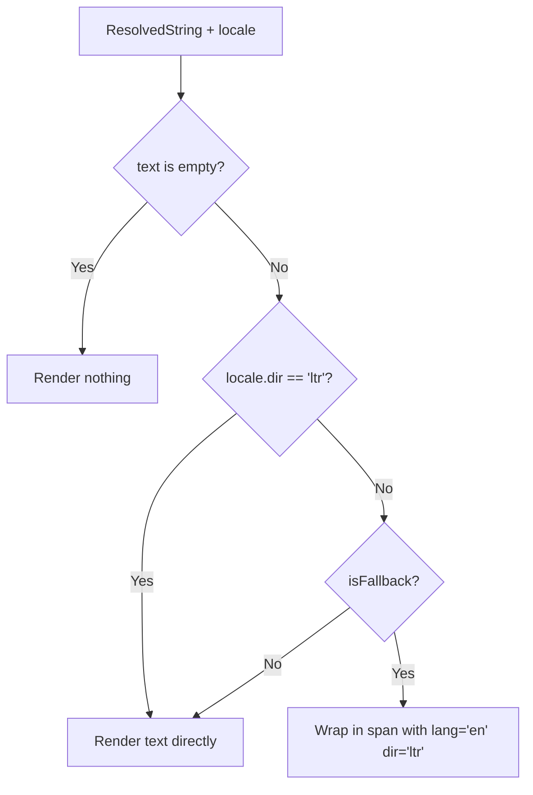

**Diagram sources**
- [localized.tsx:1-20](file://lib/i18n/localized.tsx#L1-L20)

**Section sources**
- [localized.tsx:1-20](file://lib/i18n/localized.tsx#L1-L20)

### Number Formatting and Cultural Adaptation
- Uses a single formatter to apply Eastern Arabic-Indic numerals for local languages and Western digits for English.
- Ensures thousands separators and digit shapes match the locale consistently across prices, counts, dates, and areas.

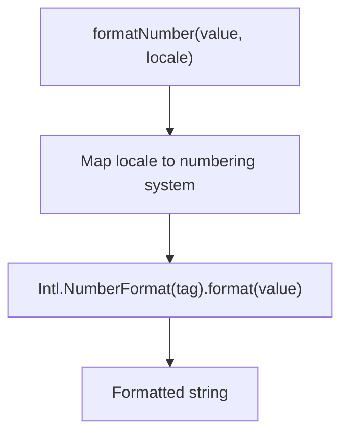

**Diagram sources**
- [format.ts:1-28](file://lib/i18n/format.ts#L1-L28)

**Section sources**
- [format.ts:1-28](file://lib/i18n/format.ts#L1-L28)

### Language Switching and Persistence
- Detects current locale from pathname using locale prefix splitting.
- Persists user choice in a cookie and performs full-page navigation to the switched pathname to reliably update <html lang/dir> and fonts.
- Provides accessible menu semantics and keyboard support.

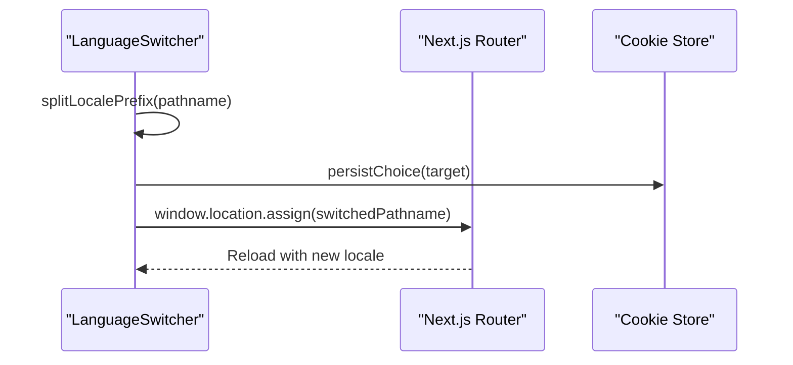

**Diagram sources**
- [language-switcher.tsx:1-120](file://components/language-switcher.tsx#L1-L120)
- [logic.ts:1-101](file://lib/i18n/logic.ts#L1-L101)

**Section sources**
- [language-switcher.tsx:1-120](file://components/language-switcher.tsx#L1-L120)
- [logic.ts:1-101](file://lib/i18n/logic.ts#L1-L101)

### Dynamic Font Loading for RTL Scripts
- Registers Arabic-script fonts site-wide but attaches CSS variables only for non-English locales, preventing unnecessary downloads on English pages.
- Uses display swap to minimize FOIT and ensure graceful fallbacks.

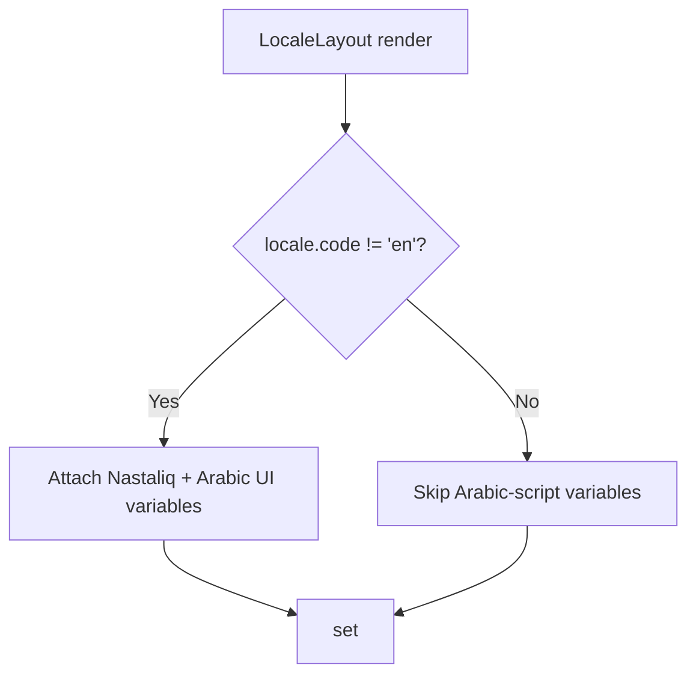

**Diagram sources**
- [layout.tsx:1-88](file://app/(site)/[locale]/layout.tsx#L1-L88)

**Section sources**
- [layout.tsx:1-88](file://app/(site)/[locale]/layout.tsx#L1-L88)

### Translation Catalog Management and Sync
- The typed English catalog is the source of truth; other language files mirror its keys.
- A sync script upserts the full matrix into the database, marking untranslated keys as missing for coverage tracking.
- At runtime, the server reads only translated rows and merges them over build-time drafts.

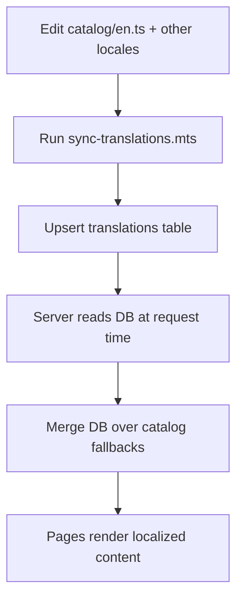

**Diagram sources**
- [sync-translations.mts:1-74](file://scripts/sync-translations.mts#L1-L74)
- [0001_translations.sql:1-30](file://supabase/migrations/0001_translations.sql#L1-L30)
- [server.ts:1-117](file://lib/i18n/server.ts#L1-L117)
- [index.ts:1-41](file://catalog/index.ts#L1-L41)

**Section sources**
- [sync-translations.mts:1-74](file://scripts/sync-translations.mts#L1-L74)
- [0001_translations.sql:1-30](file://supabase/migrations/0001_translations.sql#L1-L30)
- [server.ts:1-117](file://lib/i18n/server.ts#L1-L117)
- [index.ts:1-41](file://catalog/index.ts#L1-L41)

## Dependency Analysis
- Configuration drives all locale identity decisions; logic depends on it for slug mapping and direction.
- Server loader depends on both the catalog and the database; it degrades gracefully if the database is unreachable.
- Client components depend on pure logic helpers for safe navigation and do not import Next-specific routing internals beyond pathname utilities.
- Layout depends on the registry to set correct html attributes and font variables.

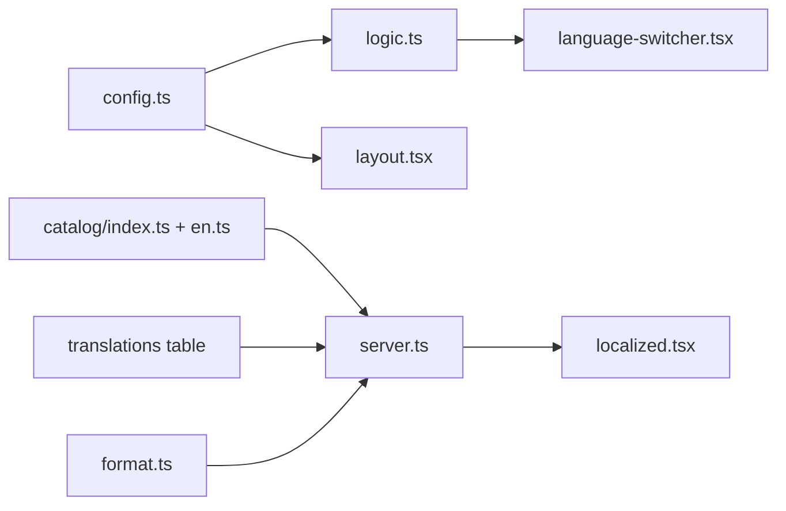

**Diagram sources**
- [config.ts:1-137](file://lib/i18n/config.ts#L1-L137)
- [logic.ts:1-101](file://lib/i18n/logic.ts#L1-L101)
- [server.ts:1-117](file://lib/i18n/server.ts#L1-L117)
- [index.ts:1-41](file://catalog/index.ts#L1-L41)
- [layout.tsx:1-88](file://app/(site)/[locale]/layout.tsx#L1-L88)
- [language-switcher.tsx:1-120](file://components/language-switcher.tsx#L1-L120)
- [localized.tsx:1-20](file://lib/i18n/localized.tsx#L1-L20)
- [format.ts:1-28](file://lib/i18n/format.ts#L1-L28)

**Section sources**
- [config.ts:1-137](file://lib/i18n/config.ts#L1-L137)
- [server.ts:1-117](file://lib/i18n/server.ts#L1-L117)

## Performance Considerations
- Per-request dictionary loading with React cache deduplicates within a request but does not cross-request cache, ensuring founder edits appear immediately while avoiding repeated work during a single render.
- Arabic-script fonts are registered but only attached for non-English locales, reducing payload for English users.
- Number formatting uses a single formatter to centralize digit policy and avoid duplicated logic.
- For large catalogs, consider:
  - Prefetching common locales on route transitions where feasible.
  - Caching dictionary payloads at the edge or CDN layer if traffic increases.
  - Lazy-loading heavy fonts only when needed by specific sections.
  - Monitoring network requests for oversized font bundles and optimizing subsets.

[No sources needed since this section provides general guidance]

## Troubleshooting Guide
- Unknown or unsupported locale slug: The layout rejects invalid locales and returns not found; verify URL slugs against the registry.
- Corrupted or invalid cookie value: Treated as no stored choice; rely on URL-based locale.
- Cookie disagrees with URL: URL wins; switcher marks the URL’s language.
- Missing or empty catalog value: Falls back to English; ensure keys exist in the English catalog and translations are synced.
- Duplicate key within a language: Rejected at write time; maintain one value per key per language.
- Longest-real-word test: Ensure layouts fit narrow widths without breaking joined script mid-word; avoid overflow techniques that clip Arabic-script text.
- Switching away from half-filled forms: Full navigation may lose input; accept this trade-off for reliable lang/dir/font updates.
- Fallback isolation: English fallbacks inside RTL paragraphs are wrapped to preserve bidi order; verify usage of the localized renderer.

**Section sources**
- [spec.md:149-168](file://specs/language-compatibility/spec.md#L149-L168)

## Conclusion
Agropioo’s i18n system provides robust multi-language support with strong RTL handling, dynamic font loading, and a live translation pipeline. The design separates concerns cleanly: configuration defines locale identity, logic handles path and string operations, the server merges build-time and database content, and client components render localized content safely. Following the provided guidelines ensures scalable addition of new languages, consistent cultural adaptation, and high performance even with large catalogs.

[No sources needed since this section summarizes without analyzing specific files]

## Appendices

### Guidelines for Adding New Languages
- Add a new entry to the locale registry with code, urlSlug, htmlLang, dir, nativeName, englishName, and hreflang if applicable.
- Create a new catalog file mirroring the English keys; leave untranslated keys empty until ready.
- Run the sync script to populate the database with missing entries for coverage tracking.
- Update any UI elements that enumerate locales (e.g., switcher) to include the new language.
- Validate BCP 47 tags and ensure proper RTL/LTR direction.

**Section sources**
- [config.ts:1-137](file://lib/i18n/config.ts#L1-L137)
- [sync-translations.mts:1-74](file://scripts/sync-translations.mts#L1-L74)
- [index.ts:1-41](file://catalog/index.ts#L1-L41)

### Managing Translation Files
- Maintain the English catalog as the source of truth; all other locales should mirror keys.
- Use the sync script to push changes to the database; untranslated keys are marked missing for visibility.
- At runtime, the server reads only translated rows and merges them over build-time drafts.
- Keep values trimmed and avoid blank entries; they count as missing and will fall back to English.

**Section sources**
- [index.ts:1-41](file://catalog/index.ts#L1-L41)
- [server.ts:1-117](file://lib/i18n/server.ts#L1-L117)
- [sync-translations.mts:1-74](file://scripts/sync-translations.mts#L1-L74)

### Handling Right-to-Left Text Rendering
- Set <html lang> and dir from the locale registry to ensure correct layout direction.
- Attach Arabic-script font variables only for non-English locales to avoid unnecessary downloads.
- Avoid letter-spacing and uppercase on Arabic-script text; follow typography rules for Nastaliq and Arabic scripts.
- Use the localized renderer to wrap English fallbacks in RTL contexts to preserve bidi order.
- Ensure containers size with min-heights and generous line-heights to prevent clipping.

**Section sources**
- [layout.tsx:1-88](file://app/(site)/[locale]/layout.tsx#L1-L88)
- [localized.tsx:1-20](file://lib/i18n/localized.tsx#L1-L20)
- [research.md:102-116](file://specs/language-compatibility/research.md#L102-L116)
- [spec.md:93-115](file://specs/language-compatibility/spec.md#L93-L115)

### Implementing Translatable Strings, Date/Time, and Numbers
- Use the translator function to fetch localized strings with optional parameters; unknown placeholders remain visible rather than crashing.
- Apply number formatting through the centralized formatter to ensure consistent digit sets and separators per locale.
- For date/time formatting, extend the formatter module with locale-aware date formatters following the same pattern as numbers.

**Section sources**
- [server.ts:1-117](file://lib/i18n/server.ts#L1-L117)
- [format.ts:1-28](file://lib/i18n/format.ts#L1-L28)