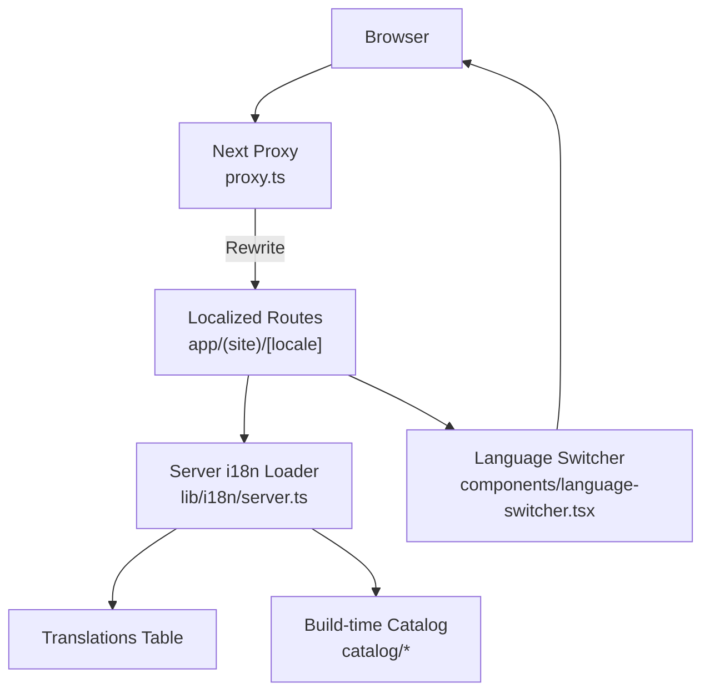
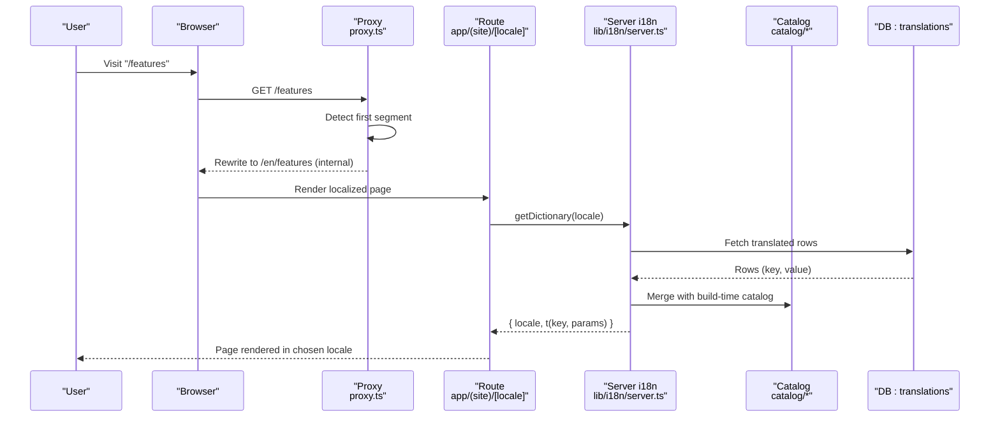
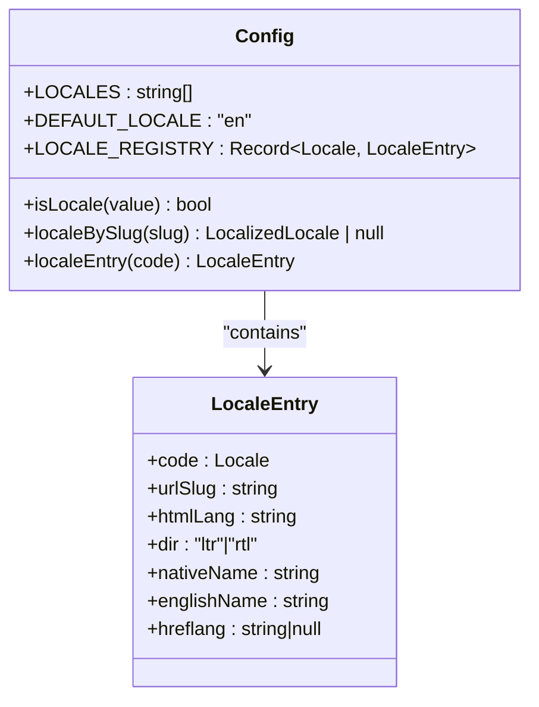
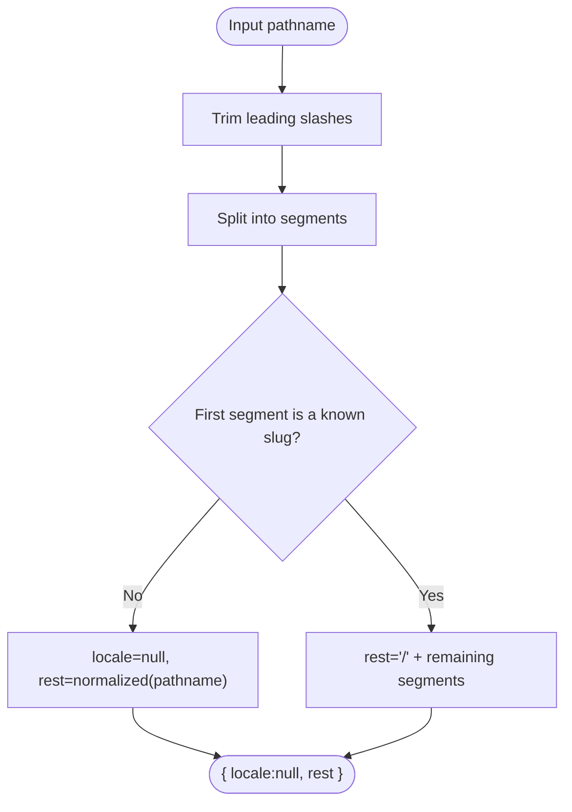
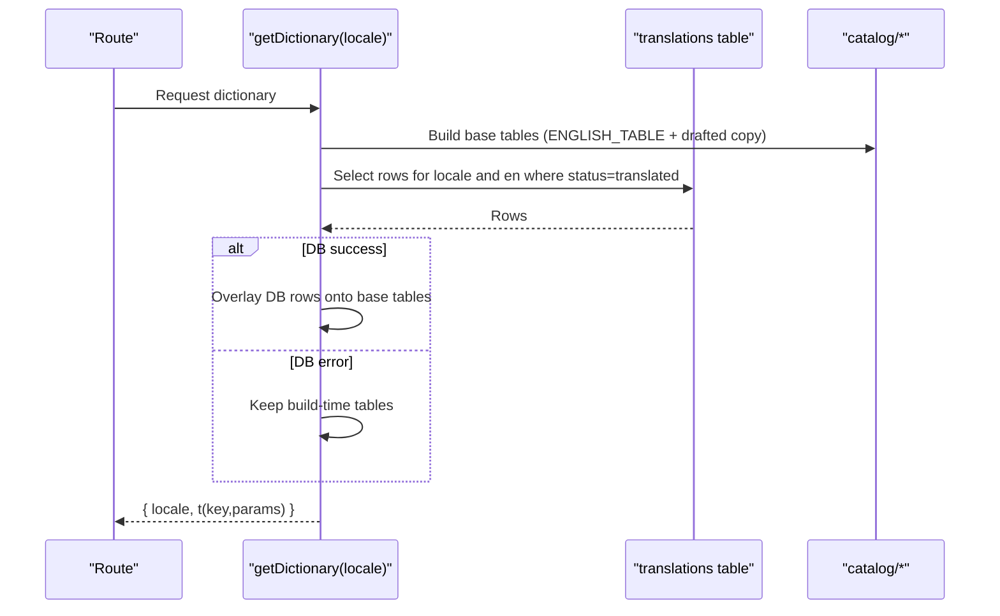
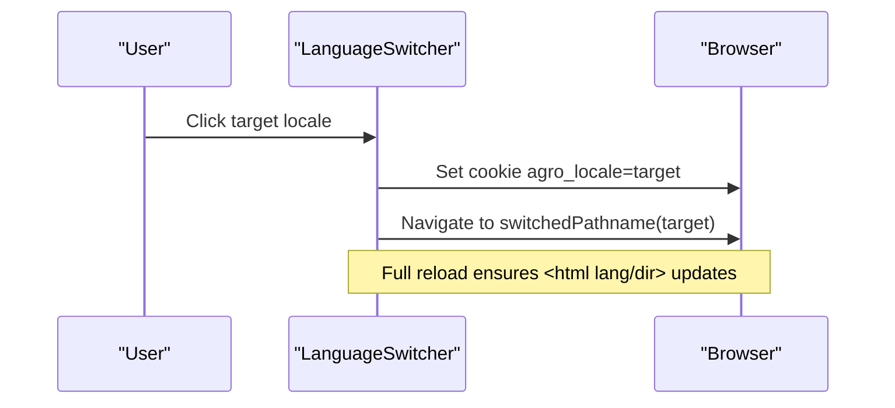
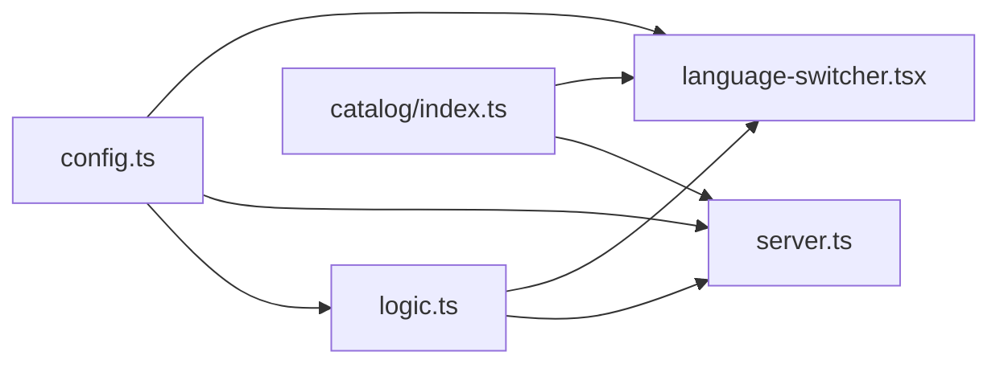

# Locale Configuration and Detection

<cite>
**Referenced Files in This Document**
- [config.ts](file://lib/i18n/config.ts)
- [logic.ts](file://lib/i18n/logic.ts)
- [server.ts](file://lib/i18n/server.ts)
- [localized.tsx](file://lib/i18n/localized.tsx)
- [index.ts](file://catalog/index.ts)
- [en.ts](file://catalog/en.ts)
- [ur.ts](file://catalog/ur.ts)
- [language-switcher.tsx](file://components/language-switcher.tsx)
- [suggestion-chip.tsx](file://components/suggestion-chip.tsx)
- [proxy.ts](file://proxy.ts)
- [next.config.ts](file://next.config.ts)
- [research.md](file://specs/language-compatibility/research.md)
</cite>

## Table of Contents
1. Introduction
2. Project Structure
3. Core Components
4. Architecture Overview
5. Detailed Component Analysis
6. Dependency Analysis
7. Performance Considerations
8. Troubleshooting Guide
9. Conclusion

## Introduction
This document explains Agropioo’s locale configuration and detection system. It covers the supported locales, how translations are organized and loaded, how user language preference is determined from URL prefixes and cookies, fallback behavior when translations are missing, handling unsupported locales, and guidance for extending the system with new locales or custom detection logic. It also addresses performance considerations for locale switching and caching strategies.

## Project Structure
Agropioo uses a hybrid localization strategy:
- Marketing pages use Next.js route segments under app/(site)/[locale] to produce localized URLs.
- A lightweight proxy rewrites bare English paths internally so that /features becomes /en/features without changing the browser URL.
- The client language switcher persists the user’s choice in a cookie and navigates to the same content path under the selected locale prefix.
- Translations are authored in TypeScript catalogs and can be overridden at runtime by a database table.

**Diagram sources**
- [proxy.ts:1-30](file://proxy.ts#L1-L30)
- [server.ts:1-117](file://lib/i18n/server.ts#L1-L117)
- [index.ts:1-41](file://catalog/index.ts#L1-L41)
- [language-switcher.tsx:1-120](file://components/language-switcher.tsx#L1-L120)

**Section sources**
- [proxy.ts:1-30](file://proxy.ts#L1-L30)
- [next.config.ts:1-12](file://next.config.ts#L1-L12)
- [research.md:43-135](file://specs/language-compatibility/research.md#L43-L135)

## Core Components
- Locale registry and defaults: defines all supported locales, their URL slugs, HTML lang attributes, text direction, native names, and hreflang eligibility.
- Path parsing utilities: split locale prefixes, build localized hrefs, and compute switched paths for navigation.
- Server-side dictionary loader: merges build-time catalog with runtime database translations and provides a typed translator function per request.
- Client rendering helpers: render resolved strings safely with correct direction and language attributes.
- Language switcher and suggestion chip: persist user choice via cookie and navigate to the appropriate localized URL.

Key supported locales:
- English (default, no URL slug)
- Urdu, Punjabi (Shahmukhi), Pashto, Sindhi, Saraiki, Balochi, Hindko

**Section sources**
- [config.ts:1-137](file://lib/i18n/config.ts#L1-L137)
- [logic.ts:1-101](file://lib/i18n/logic.ts#L1-L101)
- [server.ts:1-117](file://lib/i18n/server.ts#L1-L117)
- [localized.tsx:1-21](file://lib/i18n/localized.tsx#L1-L21)
- [index.ts:1-41](file://catalog/index.ts#L1-L41)

## Architecture Overview
The system resolves the active locale through a strict precedence rule: URL prefix > cookie > default (English). Accept-Language sniffing is intentionally disabled to avoid misrouting speakers of minority languages.

**Diagram sources**
- [proxy.ts:1-30](file://proxy.ts#L1-L30)
- [server.ts:1-117](file://lib/i18n/server.ts#L1-L117)
- [index.ts:1-41](file://catalog/index.ts#L1-L41)

**Section sources**
- [research.md:43-135](file://specs/language-compatibility/research.md#L43-L135)
- [proxy.ts:1-30](file://proxy.ts#L1-L30)

## Detailed Component Analysis

### Locale Registry and Defaults
- Defines the complete set of supported locales and metadata such as urlSlug, htmlLang, dir, nativeName, englishName, and hreflang eligibility.
- Provides helper functions to validate locale codes, map URL slugs to locales, and retrieve entries.
- Establishes the default locale as English and enumerates localized locales excluding English.

**Diagram sources**
- [config.ts:1-137](file://lib/i18n/config.ts#L1-L137)

**Section sources**
- [config.ts:1-137](file://lib/i18n/config.ts#L1-L137)

### Path Parsing and Navigation Utilities
- Splits incoming pathnames into locale and rest segments, normalizing paths to canonical forms.
- Builds localized hrefs: English links remain bare; other locales receive a prefix.
- Computes the pathname to navigate to when switching locales while preserving query and hash.

**Diagram sources**
- [logic.ts:21-62](file://lib/i18n/logic.ts#L21-L62)

**Section sources**
- [logic.ts:1-101](file://lib/i18n/logic.ts#L1-L101)

### Server-Side Dictionary Loading and Fallback Strategy
- Loads translations from the database for the requested locale and English, merging them over the build-time catalog.
- If the database is unavailable, falls back to the build-time catalog to ensure pages still render.
- The translator function resolves each key against the primary table and then against English; empty results render nothing rather than raw keys.

**Diagram sources**
- [server.ts:23-92](file://lib/i18n/server.ts#L23-L92)
- [index.ts:1-41](file://catalog/index.ts#L1-L41)

**Section sources**
- [server.ts:1-117](file://lib/i18n/server.ts#L1-L117)
- [index.ts:1-41](file://catalog/index.ts#L1-L41)

### Client Rendering Helpers and Direction Handling
- Renders resolved strings safely; if a fallback string appears inside an RTL page, it is wrapped with explicit language and direction to prevent bidi corruption.
- Empty results render nothing to avoid showing raw keys.

**Section sources**
- [localized.tsx:1-21](file://lib/i18n/localized.tsx#L1-L21)

### Language Switcher and Cookie Persistence
- Displays available locales with native names and current selection.
- On selection, writes a cookie to persist the choice and performs a full page load to the new locale-prefixed URL to ensure <html lang/dir> and fonts update correctly.
- Disables the switcher during transition to prevent concurrent navigations.

**Diagram sources**
- [language-switcher.tsx:15-27](file://components/language-switcher.tsx#L15-L27)
- [logic.ts:54-62](file://lib/i18n/logic.ts#L54-L62)

**Section sources**
- [language-switcher.tsx:1-120](file://components/language-switcher.tsx#L1-L120)
- [logic.ts:54-62](file://lib/i18n/logic.ts#L54-L62)

### Suggestion Chip for First-Time Visitors
- Shows a one-time dismissible suggestion on English-only pages to invite users to view content in Urdu.
- Persists dismissal and accepted choice in cookies and navigates to the localized URL.

**Section sources**
- [suggestion-chip.tsx:38-66](file://components/suggestion-chip.tsx#L38-L66)

### Routing and Precedence Rules
- The proxy recognizes known locale slugs and passes them through; otherwise, it internally rewrites bare paths to English.
- No redirects or header/IP sniffing are used; URLs alone decide language.
- Global not-found is enabled so unmatched localized routes render a proper 404 with correct chrome.

**Section sources**
- [proxy.ts:1-30](file://proxy.ts#L1-L30)
- [next.config.ts:1-12](file://next.config.ts#L1-L12)
- [research.md:43-135](file://specs/language-compatibility/research.md#L43-L135)

## Dependency Analysis
- config.ts is the single source of truth for locale identity and is consumed by logic, server, and UI components.
- logic.ts depends only on config.ts and provides pure functions for path manipulation and string resolution.
- server.ts depends on config.ts, logic.ts, catalog index, and Supabase to assemble the runtime dictionary.
- UI components depend on config.ts and logic.ts to compute hrefs and persist choices.

**Diagram sources**
- [config.ts:1-137](file://lib/i18n/config.ts#L1-L137)
- [logic.ts:1-101](file://lib/i18n/logic.ts#L1-L101)
- [server.ts:1-117](file://lib/i18n/server.ts#L1-L117)
- [index.ts:1-41](file://catalog/index.ts#L1-L41)
- [language-switcher.tsx:1-120](file://components/language-switcher.tsx#L1-L120)

**Section sources**
- [config.ts:1-137](file://lib/i18n/config.ts#L1-L137)
- [logic.ts:1-101](file://lib/i18n/logic.ts#L1-L101)
- [server.ts:1-117](file://lib/i18n/server.ts#L1-L117)
- [index.ts:1-41](file://catalog/index.ts#L1-L41)
- [language-switcher.tsx:1-120](file://components/language-switcher.tsx#L1-L120)

## Performance Considerations
- Per-request deduplication: The server dictionary loader uses React cache() to deduplicate dictionary construction within a single request, avoiding redundant DB queries and catalog merges.
- Graceful degradation: If the database is unreachable, the system falls back to the build-time catalog so pages continue to render without errors.
- Minimal client overhead: The language switcher performs a full page load on locale change to ensure <html lang/dir> and font loading are consistent; this avoids complex client-side hydration issues but incurs a network round-trip.
- Avoid unnecessary prefetching: Locale-changing links should not be prefetched to prevent premature resource loading for the wrong locale.
- Catalog size: Keep translation files lean; unused keys increase bundle size. Coverage tests enforce parity between locales and the English source.

[No sources needed since this section provides general guidance]

## Troubleshooting Guide
- Missing translations: Keys missing in the target locale fall back to English; if both are missing, nothing is rendered. Verify that keys exist in the English catalog and that the database contains translated rows with status “translated”.
- Unsupported locale in URL: Only recognized slugs are treated as locales; unrecognized segments are treated as content paths. Use the provided validation helpers to check slugs before routing decisions.
- Mixed-direction text: When English fallback text appears in RTL contexts, wrap it using the localized helper to preserve bidi order.
- Cookie not persisting: Ensure the switcher sets the cookie with the correct path and SameSite attribute; verify that CDN/proxy does not drop Set-Cookie headers.
- Route not found: Unmatched localized routes trigger a global not-found; confirm that the catch-all route exists under the locale folder.

**Section sources**
- [server.ts:23-92](file://lib/i18n/server.ts#L23-L92)
- [config.ts:120-137](file://lib/i18n/config.ts#L120-L137)
- [localized.tsx:1-21](file://lib/i18n/localized.tsx#L1-L21)
- [language-switcher.tsx:24-27](file://components/language-switcher.tsx#L24-L27)
- [next.config.ts:1-12](file://next.config.ts#L1-L12)

## Conclusion
Agropioo’s localization system centers on a clear, maintainable registry of locales, robust path parsing, and a server-side dictionary loader that blends build-time catalogs with runtime database overrides. The hybrid routing approach provides localized URLs for marketing pages while keeping the application simple. Fallbacks ensure resilience, and the client switcher offers a straightforward way for users to choose their preferred language. Extending the system involves adding a new locale entry, creating a catalog file, and optionally enabling database-driven translations.

[No sources needed since this section summarizes without analyzing specific files]

## Appendices

### Supported Locales and Metadata
- English: default, bare URLs, LTR
- Urdu: URL slug “ur”, RTL
- Punjabi (Shahmukhi): URL slug “pa”, RTL
- Pashto: URL slug “ps”, RTL
- Sindhi: URL slug “sd”, RTL
- Saraiki: URL slug “skr”, RTL
- Balochi: URL slug “bal”, RTL
- Hindko: URL slug “hno”, RTL

**Section sources**
- [config.ts:34-107](file://lib/i18n/config.ts#L34-L107)

### Adding a New Locale
Steps:
1. Add the locale code and metadata to the registry (urlSlug, htmlLang, dir, nativeName, englishName, hreflang).
2. Create a new catalog file mirroring the English keys.
3. Update the catalog index to include the new file.
4. Optionally enable database-driven translations for the new locale.
5. Test path parsing and href generation for the new slug.

**Section sources**
- [config.ts:1-137](file://lib/i18n/config.ts#L1-L137)
- [index.ts:1-41](file://catalog/index.ts#L1-L41)

### Setting Default Language and Fallback Behavior
- Default locale is English; bare URLs resolve to English internally.
- Fallback chain: primary locale table → English table → empty string (renders nothing).
- Database rows override drafted copy; missing values never erase the catalog.

**Section sources**
- [config.ts:109-118](file://lib/i18n/config.ts#L109-L118)
- [server.ts:23-92](file://lib/i18n/server.ts#L23-L92)
- [logic.ts:72-90](file://lib/i18n/logic.ts#L72-L90)

### Implementing Custom Locale Detection Logic
- To add custom detection (e.g., geolocation or account preference), integrate with the existing precedence model: URL prefix remains authoritative, followed by cookie, then default.
- Persist any server-resolved preference in a cookie so the client switcher reflects the same choice.
- Ensure new detection does not interfere with the proxy’s slug recognition and rewrite behavior.

**Section sources**
- [research.md:43-135](file://specs/language-compatibility/research.md#L43-L135)
- [proxy.ts:1-30](file://proxy.ts#L1-L30)
- [language-switcher.tsx:24-27](file://components/language-switcher.tsx#L24-L27)