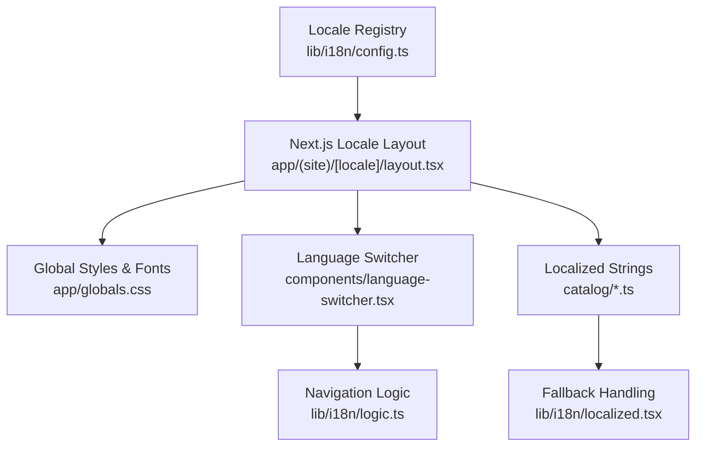
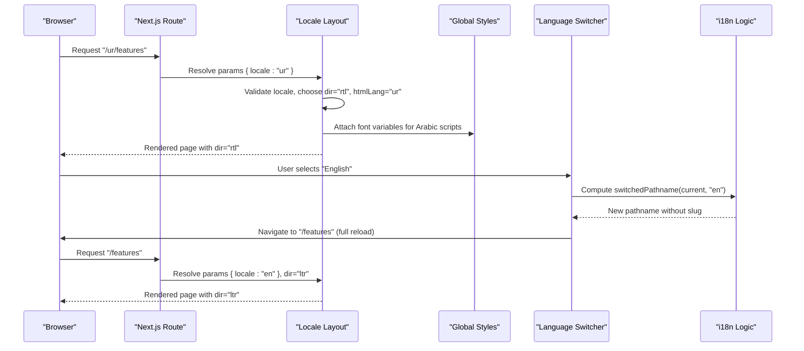
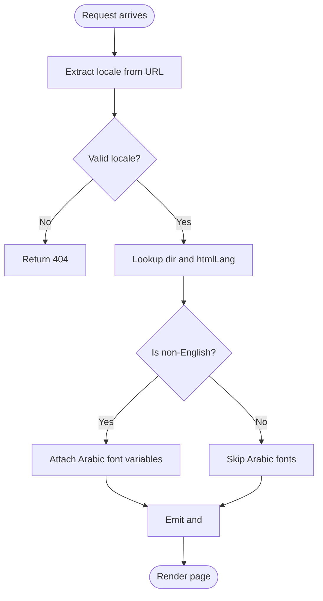
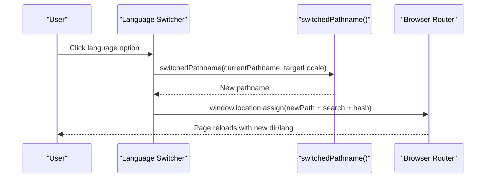
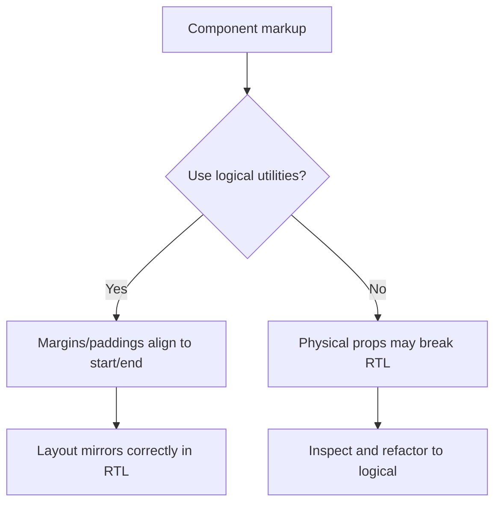
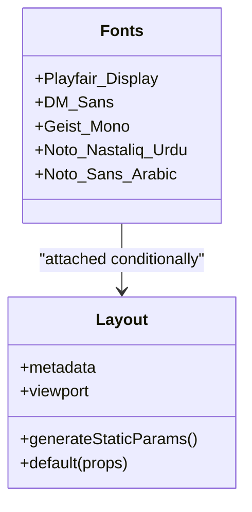
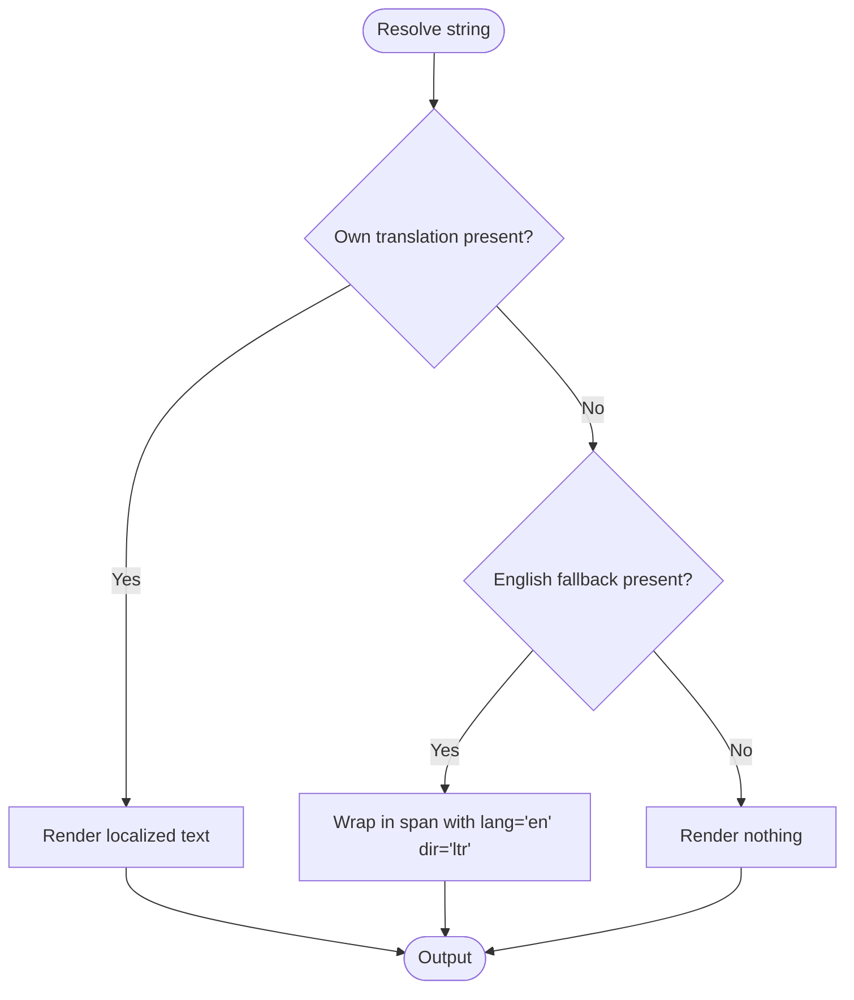
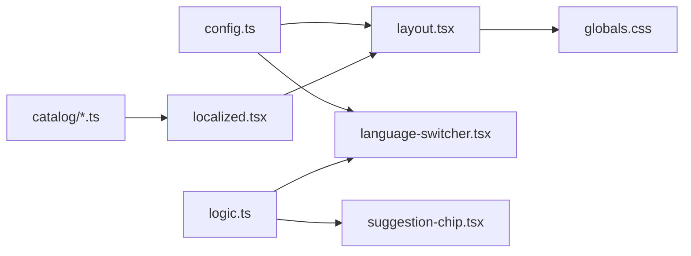

# Right-to-Left (RTL) Layout Support

<cite>
**Referenced Files in This Document**
- [config.ts](file://lib/i18n/config.ts)
- [logic.ts](file://lib/i18n/logic.ts)
- [localized.tsx](file://lib/i18n/localized.tsx)
- [layout.tsx](file://app/(site)/[locale]/layout.tsx)
- [globals.css](file://app/globals.css)
- [language-switcher.tsx](file://components/language-switcher.tsx)
- [suggestion-chip.tsx](file://components/suggestion-chip.tsx)
- [index.ts](file://catalog/index.ts)
- [ur.ts](file://catalog/ur.ts)
- [spec.md](file://specs/language-compatibility/spec.md)
- [research.md](file://specs/language-compatibility/research.md)
</cite>

## Table of Contents
1. [Introduction](#introduction)
2. [Project Structure](#project-structure)
3. [Core Components](#core-components)
4. [Architecture Overview](#architecture-overview)
5. [Detailed Component Analysis](#detailed-component-analysis)
6. [Dependency Analysis](#dependency-analysis)
7. [Performance Considerations](#performance-considerations)
8. [Troubleshooting Guide](#troubleshooting-guide)
9. [Conclusion](#conclusion)
10. [Appendices](#appendices)

## Introduction
This document explains how Agropioo detects RTL languages and switches the application between left-to-right (LTR) and right-to-left (RTL) layouts dynamically. It covers:
- Locale detection and direction assignment from a single registry
- Server-side HTML lang/dir emission for correct browser behavior
- Client-side language switching with full page reload to ensure fonts and direction update reliably
- CSS-in-JS and Tailwind-based RTL styling using logical properties
- Typography strategy for Arabic-script languages, including Nastaliq display text and Naskh-class UI fonts
- Text alignment, spacing adjustments, layout mirroring, and mixed-direction content handling
- Examples of creating RTL-compatible components and ensuring proper visual hierarchy
- Testing strategies and common pitfalls to avoid

## Project Structure
Agropioo’s internationalization and RTL support are centered around:
- A locale registry that defines each language’s code, URL slug, BCP 47 tag, and text direction
- Next.js route segments under app/(site)/[locale] that render per-locale pages
- A global layout that sets <html lang> and <html dir>, and attaches font variables only when needed
- A client-side language switcher and suggestion chip that navigate to localized URLs
- Catalog files containing translations, with English as fallback
- Tailwind utilities leveraging logical properties for automatic RTL mirroring

**Diagram sources**
- [config.ts:1-137](file://lib/i18n/config.ts#L1-L137)
- [layout.tsx:1-88](file://app/(site)/[locale]/layout.tsx#L1-L88)
- [globals.css:1-228](file://app/globals.css#L1-L228)
- [language-switcher.tsx:1-120](file://components/language-switcher.tsx#L1-L120)
- [logic.ts:1-101](file://lib/i18n/logic.ts#L1-L101)
- [index.ts:1-41](file://catalog/index.ts#L1-L41)
- [localized.tsx:1-20](file://lib/i18n/localized.tsx#L1-L20)

**Section sources**
- [config.ts:1-137](file://lib/i18n/config.ts#L1-L137)
- [layout.tsx:1-88](file://app/(site)/[locale]/layout.tsx#L1-L88)
- [globals.css:1-228](file://app/globals.css#L1-L228)
- [language-switcher.tsx:1-120](file://components/language-switcher.tsx#L1-L120)
- [logic.ts:1-101](file://lib/i18n/logic.ts#L1-L101)
- [index.ts:1-41](file://catalog/index.ts#L1-L41)
- [localized.tsx:1-20](file://lib/i18n/localized.tsx#L1-L20)

## Core Components
- Locale registry: Defines all supported locales, their URL slugs, BCP 47 tags, and text direction. All RTL languages (Urdu, Punjabi Shahmukhi, Pashto, Sindhi, Saraiki, Balochi, Hindko) are marked rtl; English is ltr.
- Next.js locale layout: Validates the locale, chooses font variables, and emits <html lang> and <html dir>. Non-English locales attach Arabic-script font variables; English pages never load those fonts.
- Language switcher: Full-page navigation to a target locale via switched pathname logic; persists user choice in a cookie and highlights the active language.
- Suggestion chip: Appears once on English pages to invite users to Urdu; navigates to /{rest} in Urdu while preserving query/hash.
- Localization helper: Wraps English fallback strings inside RTL contexts with explicit lang="en" and dir="ltr" to preserve bidirectional order.
- Translation catalog: Centralized translation tables per locale; missing values fall back to English.

**Section sources**
- [config.ts:1-137](file://lib/i18n/config.ts#L1-L137)
- [layout.tsx:1-88](file://app/(site)/[locale]/layout.tsx#L1-L88)
- [language-switcher.tsx:1-120](file://components/language-switcher.tsx#L1-L120)
- [suggestion-chip.tsx:1-106](file://components/suggestion-chip.tsx#L1-L106)
- [localized.tsx:1-20](file://lib/i18n/localized.tsx#L1-L20)
- [index.ts:1-41](file://catalog/index.ts#L1-L41)

## Architecture Overview
The RTL architecture ensures consistent direction and typography across the app:
- The server resolves the locale from the URL segment and emits <html lang> and <html dir>.
- Font variables are attached only for non-English locales so Arabic-script fonts are not downloaded on English pages.
- Tailwind logical utilities automatically mirror spacing and alignment based on ancestor dir.
- Client navigation uses pure functions to compute the new pathname while preserving query and hash.
- Mixed-direction content is isolated with explicit lang/dir attributes to prevent bidi corruption.

**Diagram sources**
- [layout.tsx:66-87](file://app/(site)/[locale]/layout.tsx#L66-L87)
- [language-switcher.tsx:15-22](file://components/language-switcher.tsx#L15-L22)
- [logic.ts:58-62](file://lib/i18n/logic.ts#L58-L62)

## Detailed Component Analysis

### Locale Detection and Direction Assignment
- The locale registry centralizes language metadata, ensuring lang and dir never disagree.
- The Next.js locale layout validates the incoming locale and emits appropriate <html lang> and <html dir>.
- For non-English locales, Arabic-script font variables are included; English pages omit them to avoid unnecessary downloads.

**Diagram sources**
- [config.ts:34-107](file://lib/i18n/config.ts#L34-L107)
- [layout.tsx:66-87](file://app/(site)/[locale]/layout.tsx#L66-L87)

**Section sources**
- [config.ts:1-137](file://lib/i18n/config.ts#L1-L137)
- [layout.tsx:1-88](file://app/(site)/[locale]/layout.tsx#L1-L88)

### Client-Side Language Switching
- The language switcher triggers a full page navigation to preserve <html lang>/<dir> and font loading behavior.
- It computes the target pathname by stripping or adding the locale slug while keeping query and hash intact.
- The user’s last choice is persisted in a cookie; the switcher highlights the active language.

**Diagram sources**
- [language-switcher.tsx:15-22](file://components/language-switcher.tsx#L15-L22)
- [logic.ts:58-62](file://lib/i18n/logic.ts#L58-L62)

**Section sources**
- [language-switcher.tsx:1-120](file://components/language-switcher.tsx#L1-L120)
- [logic.ts:1-101](file://lib/i18n/logic.ts#L1-L101)

### RTL Styling with Tailwind Logical Properties
- Use logical spacing and alignment utilities (ms/me/ps/pe/start/end/text-start/rounded-s/e) so margins, paddings, borders, and rounding flip automatically with dir.
- Avoid physical properties (ml/mr/pl/pr/left-/right-/text-left) which stay pinned and cause half-mirrored layouts.
- Prefer flex gap over space-x for robust spacing on wrapped children.
- Directional icons should flip via opt-out markers; logos, numerals, and search icons must never mirror.

**Section sources**
- [research.md:89-100](file://specs/language-compatibility/research.md#L89-L100)

### Typography Strategy for Arabic-Script Languages
- Display headings use a Nastaliq-style face; smaller UI text uses a clearer Naskh-class face.
- Fonts are registered site-wide but only attached to <html> for non-English locales, preventing English pages from downloading Arabic fonts.
- Body text avoids clipping: line-height accommodates overhang, containers use min-height, minimum body size ≥16px, weights medium+, no italics or uppercase for script-appropriate rendering.

**Diagram sources**
- [layout.tsx:1-88](file://app/(site)/[locale]/layout.tsx#L1-L88)

**Section sources**
- [layout.tsx:1-88](file://app/(site)/[locale]/layout.tsx#L1-L88)
- [research.md:102-116](file://specs/language-compatibility/research.md#L102-L116)

### Mixed-Direction Content and Fallback Isolation
- When an English fallback appears inside an RTL paragraph, wrap it with explicit lang="en" and dir="ltr" to keep punctuation and neighboring words ordered correctly.
- Empty results render nothing rather than raw keys, avoiding accidental exposure of internal identifiers.

**Diagram sources**
- [localized.tsx:1-20](file://lib/i18n/localized.tsx#L1-L20)
- [logic.ts:72-90](file://lib/i18n/logic.ts#L72-L90)

**Section sources**
- [localized.tsx:1-20](file://lib/i18n/localized.tsx#L1-L20)
- [logic.ts:1-101](file://lib/i18n/logic.ts#L1-L101)

### Creating RTL-Compatible Components
- Use logical properties for all spacing and alignment to ensure automatic mirroring.
- Keep directional elements (arrows, chevrons) context-aware; flip only when semantically appropriate.
- Ensure inputs maintain LTR where required (email/password/phone), while free-text fields auto-detect typed direction.
- Provide adequate touch targets and readable focus indicators in RTL contexts.

**Section sources**
- [research.md:89-100](file://specs/language-compatibility/research.md#L89-L100)
- [spec.md:93-103](file://specs/language-compatibility/spec.md#L93-L103)

### Responsive Design Considerations
- Reserve extra horizontal space for longer translations and avoid fixed widths that break at small viewports.
- Use logical units and responsive utilities; avoid vh for full-height layouts; prefer dvh.
- Test at narrow widths with real longest strings to ensure no horizontal scroll and proper wrapping.

**Section sources**
- [research.md:89-100](file://specs/language-compatibility/research.md#L89-L100)
- [spec.md:186-217](file://specs/language-compatibility/spec.md#L186-L217)

## Dependency Analysis
RTL support depends on coordinated changes across configuration, routing, styles, and components:
- config.ts provides the canonical source of truth for locale identity and direction
- layout.tsx consumes config to emit correct HTML attributes and font variables
- globals.css supplies design tokens and base styles; Tailwind logical utilities handle mirroring
- language-switcher.tsx and suggestion-chip.tsx rely on logic.ts to compute new paths
- catalog files supply localized strings; localized.tsx handles fallback isolation

**Diagram sources**
- [config.ts:1-137](file://lib/i18n/config.ts#L1-L137)
- [layout.tsx:1-88](file://app/(site)/[locale]/layout.tsx#L1-L88)
- [globals.css:1-228](file://app/globals.css#L1-L228)
- [language-switcher.tsx:1-120](file://components/language-switcher.tsx#L1-L120)
- [suggestion-chip.tsx:1-106](file://components/suggestion-chip.tsx#L1-L106)
- [logic.ts:1-101](file://lib/i18n/logic.ts#L1-L101)
- [index.ts:1-41](file://catalog/index.ts#L1-L41)
- [localized.tsx:1-20](file://lib/i18n/localized.tsx#L1-L20)

**Section sources**
- [config.ts:1-137](file://lib/i18n/config.ts#L1-L137)
- [layout.tsx:1-88](file://app/(site)/[locale]/layout.tsx#L1-L88)
- [globals.css:1-228](file://app/globals.css#L1-L228)
- [language-switcher.tsx:1-120](file://components/language-switcher.tsx#L1-L120)
- [suggestion-chip.tsx:1-106](file://components/suggestion-chip.tsx#L1-L106)
- [logic.ts:1-101](file://lib/i18n/logic.ts#L1-L101)
- [index.ts:1-41](file://catalog/index.ts#L1-L41)
- [localized.tsx:1-20](file://lib/i18n/localized.tsx#L1-L20)

## Performance Considerations
- Do not load Arabic-script fonts on English pages; they are attached only for non-English locales to reduce payload.
- Use logical utilities to avoid redundant conditional classes; let dir drive mirroring.
- Prefer minimal reflows by avoiding fixed heights and overflow-hidden on Arabic-script text; use min-height and generous padding.
- Ensure images and media have explicit dimensions to prevent layout shifts during language switches.

**Section sources**
- [layout.tsx:32-45](file://app/(site)/[locale]/layout.tsx#L32-L45)
- [research.md:102-116](file://specs/language-compatibility/research.md#L102-L116)

## Troubleshooting Guide
Common issues and resolutions:
- Half-mirrored layouts: Replace physical properties (ml/mr/pl/pr/left-/right-/text-left) with logical ones (ms/me/ps/pe/start/end/text-start).
- Clipped Arabic glyphs: Increase line-height, avoid fixed heights, and ensure minimum font sizes and weights suitable for Nastaliq/Naskh.
- Mixed-direction breaks: Wrap English fallbacks with explicit lang="en" and dir="ltr" to isolate bidi context.
- Font loading on English pages: Verify font variables are only attached for non-English locales in the layout.
- Build-tool transformations: After tool upgrades, diff compiled CSS to ensure logical properties were not rewritten incorrectly for certain langs.

**Section sources**
- [research.md:89-100](file://specs/language-compatibility/research.md#L89-L100)
- [research.md:102-116](file://specs/language-compatibility/research.md#L102-L116)
- [localized.tsx:1-20](file://lib/i18n/localized.tsx#L1-L20)
- [layout.tsx:75-80](file://app/(site)/[locale]/layout.tsx#L75-L80)

## Conclusion
Agropioo’s RTL implementation centers on a single locale registry, server-side HTML attribute emission, and Tailwind logical utilities for automatic mirroring. Arabic-script typography is handled with a split strategy for display and UI text, with fonts loaded only when needed. Client-side switching preserves query/hash and ensures reliable direction updates through full navigation. By following these patterns—logical properties, fallback isolation, and careful typography—you can build RTL-compatible components that remain accessible, performant, and visually consistent across languages.

## Appendices

### RTL Behavior Checklist
- Confirm <html lang> and <html dir> match the current locale
- Verify logical properties are used throughout components
- Ensure Arabic-script fonts are not loaded on English pages
- Check mixed-direction content is isolated with explicit lang/dir
- Test at narrow widths with real longest strings
- Validate input directions (LTR for email/password/phone; auto-detect for free text)

**Section sources**
- [spec.md:93-115](file://specs/language-compatibility/spec.md#L93-L115)
- [research.md:89-116](file://specs/language-compatibility/research.md#L89-L116)