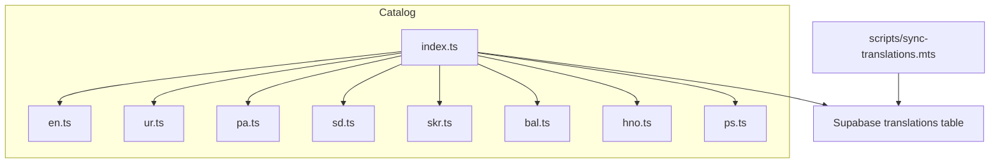
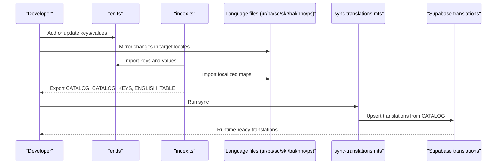
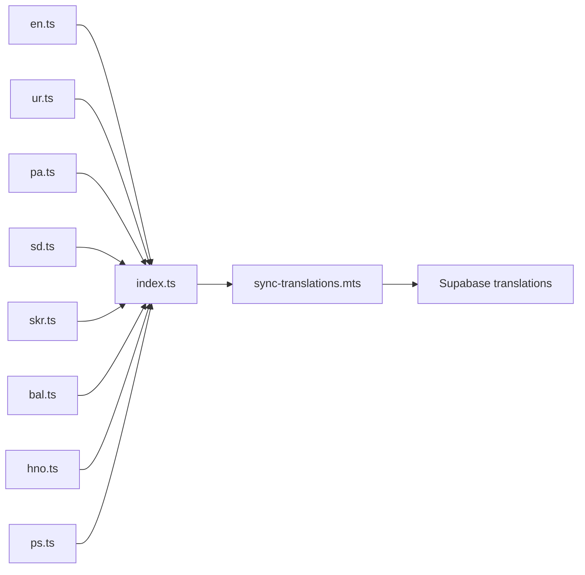

# Translation Catalog Management

<cite>
**Referenced Files in This Document**
- [catalog/index.ts](file://catalog/index.ts)
- [catalog/en.ts](file://catalog/en.ts)
- [catalog/ur.ts](file://catalog/ur.ts)
- [catalog/pa.ts](file://catalog/pa.ts)
- [catalog/sd.ts](file://catalog/sd.ts)
- [scripts/sync-translations.mts](file://scripts/sync-translations.mts)
</cite>

## Table of Contents
1. Introduction
2. Project Structure
3. Core Components
4. Architecture Overview
5. Detailed Component Analysis
6. Dependency Analysis
7. Performance Considerations
8. Troubleshooting Guide
9. Conclusion
10. Appendices

## Introduction
This document explains how Agropioo manages translation catalogs for multiple languages. It covers the catalog structure, key naming conventions, nested object usage, interpolation patterns, and best practices for adding and maintaining translations across English, Urdu, Punjabi, Sindhi, Saraiki, Balochi, Hindko, and Pashto. It also provides guidance on pluralization considerations and quality maintenance.

## Project Structure
The translation system is organized under a single catalog directory with one file per language plus a central index that aggregates them. The English file acts as the source of truth and defines the complete set of keys. Other language files map those same keys to localized strings. A script synchronizes the catalog into a database so runtime content can be edited without redeploying code.

**Diagram sources**
- [catalog/index.ts:1-41](file://catalog/index.ts#L1-L41)
- [scripts/sync-translations.mts](file://scripts/sync-translations.mts)

**Section sources**
- [catalog/index.ts:1-41](file://catalog/index.ts#L1-L41)

## Core Components
- English catalog (source of truth): Defines all user-visible keys and values.
- Language catalogs: Provide localized values for each supported locale using the same keys.
- Central index: Exports a typed catalog mapping locales to their key-value sets and exposes the full key list and an English-only fallback table.
- Sync script: Pushes catalog contents into the database for runtime editing.

Key responsibilities:
- en.ts: Authoritative key definitions and English text.
- ur.ts, pa.ts, sd.ts, skr.ts, bal.ts, hno.ts, ps.ts: Localized mappings keyed by the English key set.
- index.ts: Aggregates catalogs, exports types, and builds utility tables for coverage and fallbacks.
- sync-translations.mts: Ensures the database stays in sync with the source-of-truth catalog.

**Section sources**
- [catalog/en.ts:1-708](file://catalog/en.ts#L1-L708)
- [catalog/index.ts:1-41](file://catalog/index.ts#L1-L41)
- [scripts/sync-translations.mts](file://scripts/sync-translations.mts)

## Architecture Overview
The catalog architecture centers on a single source of truth (English) and mirrors it across other languages. The index composes these into a unified structure used by the application and tests. A synchronization process keeps the runtime database aligned with the source files.

**Diagram sources**
- [catalog/index.ts:1-41](file://catalog/index.ts#L1-L41)
- [scripts/sync-translations.mts](file://scripts/sync-translations.mts)

## Detailed Component Analysis

### English Source of Truth (en.ts)
- Purpose: Define every user-facing string as a key-value pair.
- Key style: Dot-separated names grouped by feature/page area (for example, navigation, home sections, features, vision, auth flows).
- Values: Plain strings; dynamic content uses placeholders like {year} and {n} for interpolation at render time.
- Type safety: Exposes a CatalogKey type derived from the keys of the English object, which other language files import to ensure alignment.

Guidelines:
- Keep keys stable and descriptive.
- Avoid embedding dynamic data directly in keys.
- Use simple placeholders for dynamic values; do not embed logic in keys.
- Group related strings logically to aid maintainability.

Examples of categories present in the English catalog include:
- Navigation labels
- Home page hero, problem, solution, features, journey, matrix, vision, users, call-to-action, footer
- How-it-works pages and steps
- Features detail tiles and mock UI strings
- Vision beliefs, horizons, outcomes, principles
- Why-Agropioo page sections
- Authentication and account creation flows

**Section sources**
- [catalog/en.ts:1-708](file://catalog/en.ts#L1-L708)

### Central Index (index.ts)
- Aggregates all language catalogs into a single typed record.
- Re-exports the CatalogKey type from the English file to enforce consistent keys across locales.
- Builds:
  - CATALOG: A read-only mapping from locale to its key-value set.
  - CATALOG_KEYS: An array of all keys defined in English.
  - ENGLISH_TABLE: A flattened English-only table with empty/blank entries removed, used as a fallback source.

Operational notes:
- The comment indicates that the catalog is synced into a Supabase translations table via the sync script, enabling founder edits at runtime without redeployment.
- Coverage tests expect other locales to mirror the English key set; partial tables are allowed during drafting but must eventually align.

**Section sources**
- [catalog/index.ts:1-41](file://catalog/index.ts#L1-L41)

### Language Catalogs (ur.ts, pa.ts, sd.ts, skr.ts, bal.ts, hno.ts, ps.ts)
- Each file imports the CatalogKey type from the English file and exports a Partial mapping of keys to localized strings.
- Keys must match the English set exactly to pass coverage checks and keep the sync process reliable.
- Content should reflect local terminology while preserving meaning and tone appropriate for farmers and regional contexts.

Maintenance tips:
- Always add new keys to the English file first.
- Mirror the new key in every language file with a localized value.
- Keep placeholder tokens identical across languages (for example, {year}, {n}).
- Review translations for accuracy and cultural appropriateness before merging.

**Section sources**
- [catalog/ur.ts:1-702](file://catalog/ur.ts#L1-L702)
- [catalog/pa.ts:1-702](file://catalog/pa.ts#L1-L702)
- [catalog/sd.ts:1-702](file://catalog/sd.ts#L1-L702)

### Synchronization Process (scripts/sync-translations.mts)
- Reads the catalog and pushes updates into the database so runtime content can be edited without code changes.
- Ensures consistency between source-of-truth files and live content.

Best practice:
- Run the sync after updating the catalog to propagate changes to the database.
- Validate that all locales have matching keys before syncing to avoid missing entries.

**Section sources**
- [scripts/sync-translations.mts](file://scripts/sync-translations.mts)

## Dependency Analysis
- English file defines the canonical key set and type.
- Other language files depend on the English type to ensure key parity.
- The index depends on all language files to build the composite catalog and utilities.
- The sync script depends on the index’s exported structures to persist translations.

**Diagram sources**
- [catalog/index.ts:1-41](file://catalog/index.ts#L1-L41)
- [scripts/sync-translations.mts](file://scripts/sync-translations.mts)

**Section sources**
- [catalog/index.ts:1-41](file://catalog/index.ts#L1-L41)

## Performance Considerations
- Keep translation files modular by feature/page areas to reduce cognitive load and merge conflicts.
- Avoid excessively long strings; prefer concise phrasing where possible.
- Use placeholders for dynamic values to prevent repeated concatenation in components.
- Ensure the sync process runs efficiently; batch updates when making many changes.

[No sources needed since this section provides general guidance]

## Troubleshooting Guide
Common issues and resolutions:
- Missing keys in non-English files:
  - Symptom: Coverage tests fail or runtime shows missing translations.
  - Resolution: Add the missing key to the language file with a localized value.
- Placeholder mismatch:
  - Symptom: Interpolation errors or broken messages.
  - Resolution: Ensure placeholder tokens (for example, {year}, {n}) are identical across all language files.
- Stale database content:
  - Symptom: Runtime does not reflect recent catalog changes.
  - Resolution: Run the sync script to push updated translations to the database.
- Inconsistent key casing or typos:
  - Symptom: Type errors or lookup failures.
  - Resolution: Copy keys from the English file to avoid manual typos.

**Section sources**
- [catalog/index.ts:1-41](file://catalog/index.ts#L1-L41)
- [scripts/sync-translations.mts](file://scripts/sync-translations.mts)

## Conclusion
Agropioo’s translation system is built around a clear source-of-truth model with strong typing and automated synchronization. By following the key naming conventions, mirroring keys across languages, and using placeholders for dynamic content, teams can maintain high-quality, consistent translations at scale. Regular syncs and coverage checks help ensure that both development and runtime experiences remain reliable.

[No sources needed since this section summarizes without analyzing specific files]

## Appendices

### Key Naming Conventions
- Use dot notation to group keys by domain or page area (for example, nav.*, home.*, feat.*, vp.*, wy.*, auth.*, li.*, su.*).
- Keep keys stable and descriptive; avoid embedding dynamic values inside keys.
- Prefer lowercase letters, numbers, and dots; avoid spaces and special characters.

**Section sources**
- [catalog/en.ts:1-708](file://catalog/en.ts#L1-L708)

### Nested Object Structures
- Current catalogs use flat key strings rather than nested objects.
- If nesting becomes necessary, consider introducing a flattening step to preserve a single-level key space for consistent lookups.

[No sources needed since this section provides general guidance]

### Interpolation Patterns
- Use simple placeholders within strings (for example, {year}, {n}).
- Replace placeholders at render time with actual values.
- Keep placeholders consistent across all language files.

**Section sources**
- [catalog/en.ts:1-708](file://catalog/en.ts#L1-L708)

### Pluralization Guidelines
- For now, handle plural forms by creating separate keys if needed (for example, singular vs plural variants).
- As needs evolve, consider adopting a pluralization strategy that works across languages represented in the catalog.

[No sources needed since this section provides general guidance]

### Adding New Translation Keys
Steps:
1. Add the new key(s) to the English file with clear, user-facing text.
2. Mirror the key(s) in every other language file with localized values.
3. Update any UI components to use the new keys.
4. Run the sync script to update the database.
5. Verify coverage tests pass and runtime displays correctly.

**Section sources**
- [catalog/en.ts:1-708](file://catalog/en.ts#L1-L708)
- [catalog/index.ts:1-41](file://catalog/index.ts#L1-L41)
- [scripts/sync-translations.mts](file://scripts/sync-translations.mts)

### Examples of Translating UI Strings, Error Messages, and Dynamic Content
- UI strings:
  - Example category: Navigation labels and page headings.
  - Reference paths:
    - [Navigation keys:8-15](file://catalog/en.ts#L8-L15)
    - [Urdu navigation keys:5-12](file://catalog/ur.ts#L5-L12)
    - [Punjabi navigation keys:5-12](file://catalog/pa.ts#L5-L12)
    - [Sindhi navigation keys:5-12](file://catalog/sd.ts#L5-L12)
- Error messages:
  - Example category: Authentication validation and server errors.
  - Reference paths:
    - [Auth error keys:624-637](file://catalog/en.ts#L624-L637)
    - [Urdu auth errors:620-633](file://catalog/ur.ts#L620-L633)
    - [Punjabi auth errors:620-633](file://catalog/pa.ts#L620-L633)
    - [Sindhi auth errors:620-633](file://catalog/sd.ts#L620-L633)
- Dynamic content:
  - Example category: Footer copyright year and step labels.
  - Reference paths:
    - [Footer copyright with placeholder:199-199](file://catalog/en.ts#L199-L199)
    - [Step label with placeholders:212-212](file://catalog/en.ts#L212-L212)

[No additional sources beyond those listed above]

### Best Practices for Large Translation Files
- Organize keys by feature/page area using dot notation.
- Keep related keys together and in logical order.
- Use comments sparingly to explain complex keys if needed.
- Maintain consistent tone and terminology across languages.
- Review translations for clarity and cultural relevance before merging.

[No sources needed since this section provides general guidance]