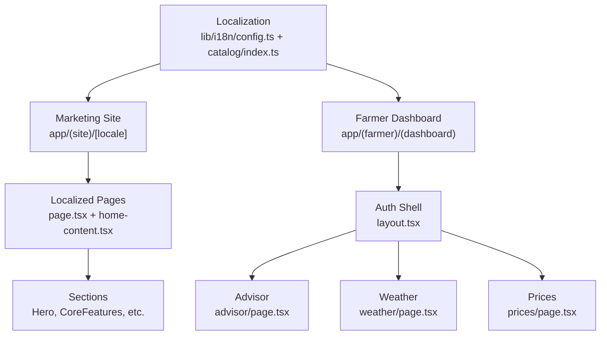
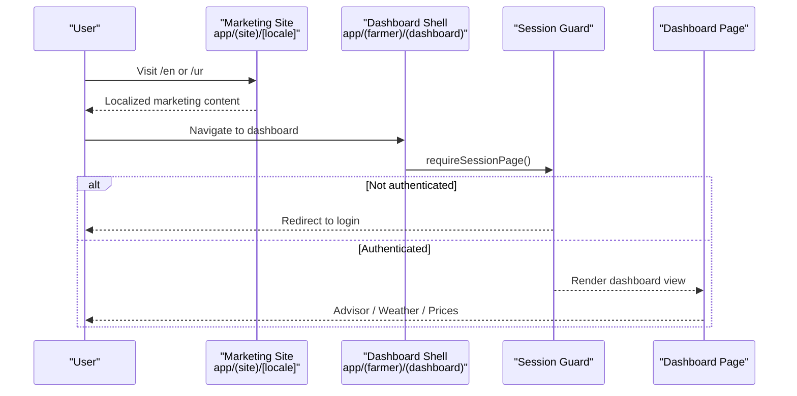
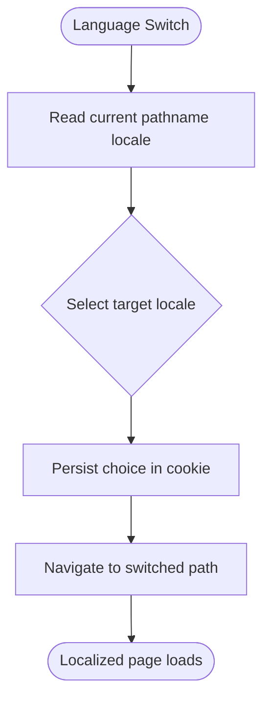
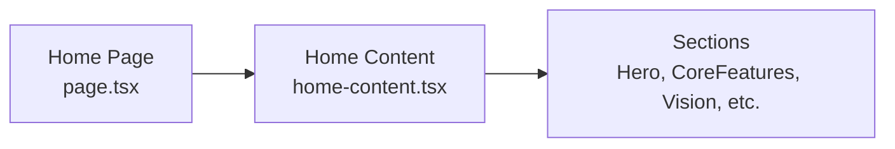
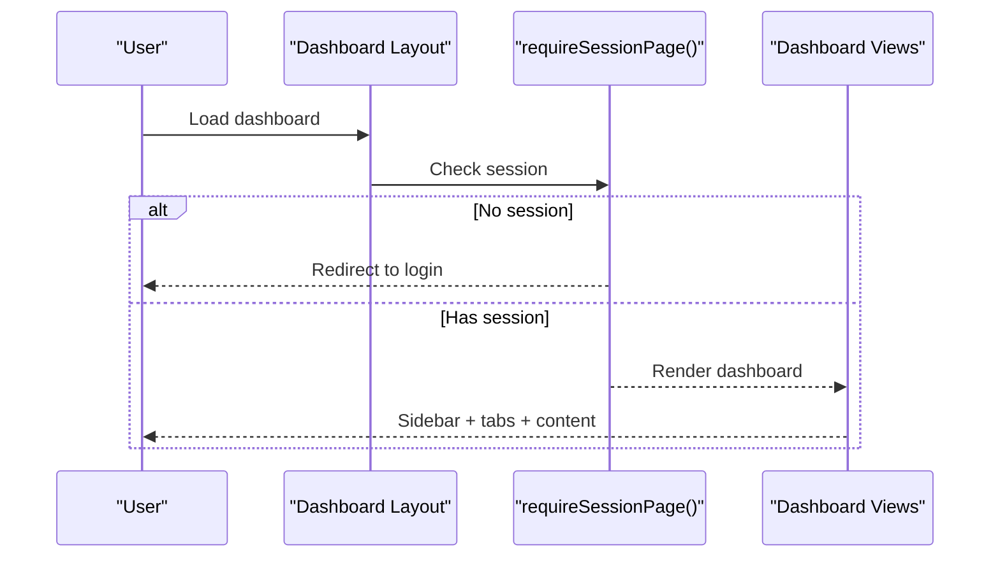
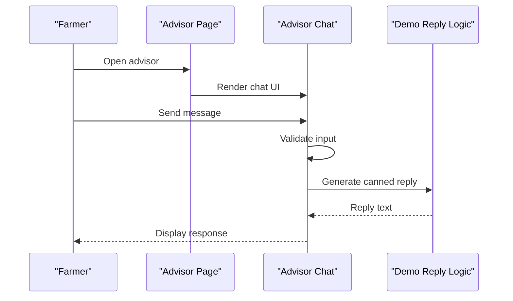
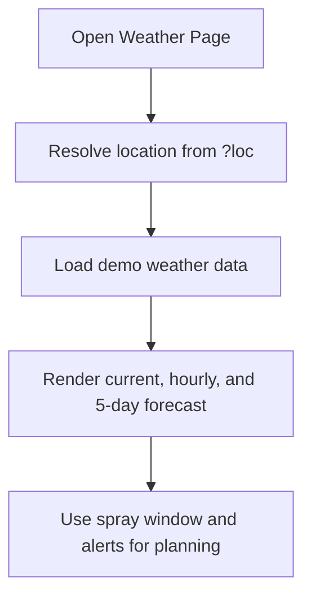
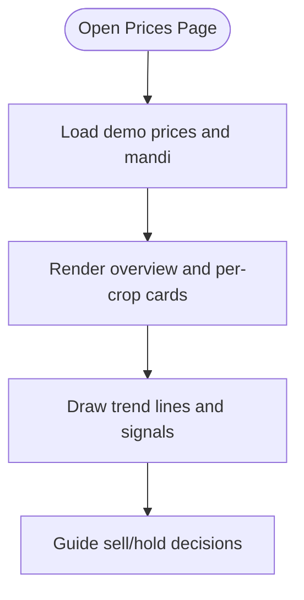
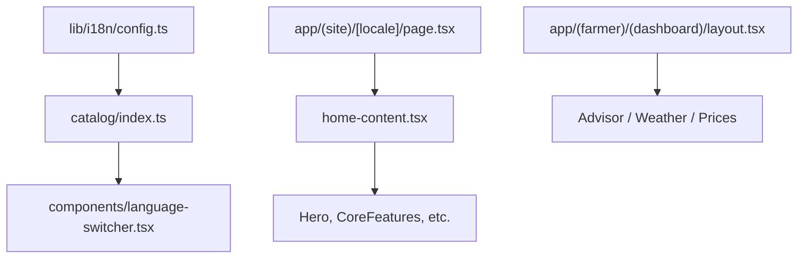

# Project Overview

<cite>
**Referenced Files in This Document**
- [README.md](file://README.md)
- [Agropioo_Project_Documentation.md](file://docs/Agropioo_Project_Documentation.md)
- [Agropioo_features.md](file://docs/Agropioo_features.md)
- [page.tsx](file://app/(site)/[locale]/page.tsx)
- [home-content.tsx](file://app/(site)/[locale]/home-content.tsx)
- [CoreFeatures.tsx](file://app/(site)/[locale]/sections/CoreFeatures.tsx)
- [Hero.tsx](file://app/(site)/[locale]/sections/Hero.tsx)
- [config.ts](file://lib/i18n/config.ts)
- [index.ts](file://catalog/index.ts)
- [language-switcher.tsx](file://components/language-switcher.tsx)
- [layout.tsx](file://app/(farmer)/(dashboard)/layout.tsx)
- [advisor/page.tsx](file://app/(farmer)/(dashboard)/advisor/page.tsx)
- [advisor/advisor-chat.tsx](file://app/(farmer)/(dashboard)/advisor/advisor-chat.tsx)
- [weather/page.tsx](file://app/(farmer)/(dashboard)/weather/page.tsx)
- [prices/page.tsx](file://app/(farmer)/(dashboard)/prices/page.tsx)
</cite>

## Table of Contents
1. Introduction
2. Project Structure
3. Core Components
4. Architecture Overview
5. Detailed Component Analysis
6. Dependency Analysis
7. Performance Considerations
8. Troubleshooting Guide
9. Conclusion

## Introduction
Agropioo is an AI-powered smart agriculture platform built for Pakistan’s farming community. It serves as a dual-purpose application: a marketing website that explains the product and a secure, authenticated farmer dashboard where daily operations are managed. The platform combines AI advisory services, digital farm management, weather intelligence, and market price monitoring to help farmers make informed decisions across the crop lifecycle.

Key value propositions:
- AI advisory: Ask questions about crops, pests, irrigation, fertilization, and harvest timing; receive personalized guidance grounded in farm context and local conditions.
- Digital farm records: Maintain structured history of activities such as planting, irrigation, fertilizer and pesticide applications, disease incidents, expenses, and harvests.
- Weather intelligence: View hyperlocal forecasts, spray windows, and weather-driven recommendations tailored to your crop stage and location.
- Market price monitoring: Track mandi prices, see weekly trends, and receive simple signals to guide sell or hold decisions.

Target audience:
- Pakistani farmers (smallholders and commercial farms), agricultural businesses, and ecosystem partners.
- Multi-language support across eight languages: English, Urdu, Punjabi, Pashto, Sindhi, Saraiki, Balochi, and Hindko.

Practical examples for daily use:
- Morning check: Open the dashboard to see today’s advisory, weather, and alerts.
- Ask the advisor: Type or speak a question in your language and get actionable steps.
- Record activity: Log irrigation, spraying, or harvesting to build a useful farm history.
- Check prices: Review current rates and trend signals before deciding when to sell.
- Plan around weather: Use spray windows and 5-day outlook to schedule fieldwork.

**Section sources**
- [Agropioo_Project_Documentation.md:3-12](file://docs/Agropioo_Project_Documentation.md#L3-L12)
- [Agropioo_Project_Documentation.md:25-66](file://docs/Agropioo_Project_Documentation.md#L25-L66)
- [Agropioo_Project_Documentation.md:85-108](file://docs/Agropioo_Project_Documentation.md#L85-L108)
- [Agropioo_Project_Documentation.md:120-144](file://docs/Agropioo_Project_Documentation.md#L120-L144)
- [config.ts:1-137](file://lib/i18n/config.ts#L1-L137)
- [index.ts:1-41](file://catalog/index.ts#L1-L41)

## Project Structure
Agropioo is a Next.js application with two primary surfaces:
- Marketing site under app/(site)/[locale] with localized pages and sections.
- Farmer dashboard under app/(farmer)/(dashboard) requiring authentication and providing tools like advisor, weather, prices, farms, and records.

High-level organization:
- app/(site): Public marketing pages (hero, features, how it works, vision, why Agropioo).
- app/(farmer): Authenticated farmer workspace with sidebar and mobile tab navigation.
- components: Shared UI elements including shell layout, auth flows, and language switcher.
- lib/i18n and catalog: Centralized localization configuration and translation catalogs for eight languages.
- docs: Product documentation and feature plans.

**Diagram sources**
- [page.tsx:1-8](file://app/(site)/[locale]/page.tsx#L1-L8)
- [home-content.tsx:1-37](file://app/(site)/[locale]/home-content.tsx#L1-L37)
- [layout.tsx:1-26](file://app/(farmer)/(dashboard)/layout.tsx#L1-L26)
- [config.ts:1-137](file://lib/i18n/config.ts#L1-L137)
- [index.ts:1-41](file://catalog/index.ts#L1-L41)

**Section sources**
- [README.md:1-37](file://README.md#L1-L37)
- [page.tsx:1-8](file://app/(site)/[locale]/page.tsx#L1-L8)
- [home-content.tsx:1-37](file://app/(site)/[locale]/home-content.tsx#L1-L37)
- [layout.tsx:1-26](file://app/(farmer)/(dashboard)/layout.tsx#L1-L26)

## Core Components
- Marketing site pages: Localized landing content that introduces problem, solution, features, journey, and vision.
- Language system: Single source of truth for locales, directionality, and translations; supports eight languages with URL slugs and proper <html lang>.
- Farmer dashboard shell: Enforces session requirements and provides desktop sidebar plus mobile bottom tabs.
- Advisor chat: Conversational interface for AI-based agricultural guidance (demo mode currently).
- Weather page: Hyperlocal forecast with current conditions, spray window tips, hourly outlook, and five-day summary.
- Prices page: Mandi price tracker with weekly trends and simple sell/hold signals.

**Section sources**
- [home-content.tsx:1-37](file://app/(site)/[locale]/home-content.tsx#L1-L37)
- [config.ts:1-137](file://lib/i18n/config.ts#L1-L137)
- [index.ts:1-41](file://catalog/index.ts#L1-L41)
- [layout.tsx:1-26](file://app/(farmer)/(dashboard)/layout.tsx#L1-L26)
- [advisor/page.tsx:1-22](file://app/(farmer)/(dashboard)/advisor/page.tsx#L1-L22)
- [advisor/advisor-chat.tsx:46-70](file://app/(farmer)/(dashboard)/advisor/advisor-chat.tsx#L46-L70)
- [weather/page.tsx:1-184](file://app/(farmer)/(dashboard)/weather/page.tsx#L1-L184)
- [prices/page.tsx:1-185](file://app/(farmer)/(dashboard)/prices/page.tsx#L1-L185)

## Architecture Overview
Agropioo uses a Next.js App Router structure with route groups:
- Public marketing site under (site) with locale-aware routing.
- Protected farmer dashboard under (farmer) guarded by session checks.
- Shared components and i18n utilities used across both surfaces.

**Diagram sources**
- [page.tsx:1-8](file://app/(site)/[locale]/page.tsx#L1-L8)
- [layout.tsx:1-26](file://app/(farmer)/(dashboard)/layout.tsx#L1-L26)

## Detailed Component Analysis

### Localization System
Agropioo centralizes language configuration and catalogs:
- Locale registry defines codes, URL slugs, HTML lang tags, text direction, and display names.
- Catalog exports typed translation keys and per-locale strings.
- Language switcher navigates to the selected locale and persists user choice via cookie.

**Diagram sources**
- [config.ts:1-137](file://lib/i18n/config.ts#L1-L137)
- [index.ts:1-41](file://catalog/index.ts#L1-L41)
- [language-switcher.tsx:1-120](file://components/language-switcher.tsx#L1-L120)

**Section sources**
- [config.ts:1-137](file://lib/i18n/config.ts#L1-L137)
- [index.ts:1-41](file://catalog/index.ts#L1-L41)
- [language-switcher.tsx:1-120](file://components/language-switcher.tsx#L1-L120)

### Marketing Site Home
The homepage composes localized sections to introduce the platform:
- Hero with localized copy and imagery.
- Capability ticker, problem/solution framing, core features, feature matrix, farmer journey, vision, target users, and call-to-action.

**Diagram sources**
- [page.tsx:1-8](file://app/(site)/[locale]/page.tsx#L1-L8)
- [home-content.tsx:1-37](file://app/(site)/[locale]/home-content.tsx#L1-L37)
- [Hero.tsx:1-141](file://app/(site)/[locale]/sections/Hero.tsx#L1-L141)
- [CoreFeatures.tsx:1-291](file://app/(site)/[locale]/sections/CoreFeatures.tsx#L1-L291)

**Section sources**
- [page.tsx:1-8](file://app/(site)/[locale]/page.tsx#L1-L8)
- [home-content.tsx:1-37](file://app/(site)/[locale]/home-content.tsx#L1-L37)
- [Hero.tsx:1-141](file://app/(site)/[locale]/sections/Hero.tsx#L1-L141)
- [CoreFeatures.tsx:1-291](file://app/(site)/[locale]/sections/CoreFeatures.tsx#L1-L291)

### Farmer Dashboard Shell
The dashboard enforces authentication and renders a responsive shell:
- Desktop sidebar and mobile bottom tab bar.
- Session guard redirects guests to login.

**Diagram sources**
- [layout.tsx:1-26](file://app/(farmer)/(dashboard)/layout.tsx#L1-L26)

**Section sources**
- [layout.tsx:1-26](file://app/(farmer)/(dashboard)/layout.tsx#L1-L26)

### AI Advisor Chat
The advisor page presents a conversational interface for agricultural guidance:
- Text-first chat with demo replies until backend integration.
- Contextual header describing capabilities and future voice support.

**Diagram sources**
- [advisor/page.tsx:1-22](file://app/(farmer)/(dashboard)/advisor/page.tsx#L1-L22)
- [advisor/advisor-chat.tsx:46-70](file://app/(farmer)/(dashboard)/advisor/advisor-chat.tsx#L46-L70)

**Section sources**
- [advisor/page.tsx:1-22](file://app/(farmer)/(dashboard)/advisor/page.tsx#L1-L22)
- [advisor/advisor-chat.tsx:46-70](file://app/(farmer)/(dashboard)/advisor/advisor-chat.tsx#L46-L70)

### Weather Intelligence
The weather page shows hyperlocal forecasts and actionable insights:
- Location switching via query parameters.
- Current conditions, spray window tips, hourly outlook, and five-day summary.

**Diagram sources**
- [weather/page.tsx:1-184](file://app/(farmer)/(dashboard)/weather/page.tsx#L1-L184)

**Section sources**
- [weather/page.tsx:1-184](file://app/(farmer)/(dashboard)/weather/page.tsx#L1-L184)

### Market Price Monitoring
The prices page displays mandi rates and trend signals:
- Weekly overview cards, per-crop rate cards, trend charts, and sell/hold signals.

**Diagram sources**
- [prices/page.tsx:1-185](file://app/(farmer)/(dashboard)/prices/page.tsx#L1-L185)

**Section sources**
- [prices/page.tsx:1-185](file://app/(farmer)/(dashboard)/prices/page.tsx#L1-L185)

## Dependency Analysis
- Localization dependencies:
  - config.ts defines LOCALES, LOCALE_REGISTRY, and helpers.
  - catalog/index.ts aggregates per-locale translation modules and exposes typed keys.
  - language-switcher.tsx consumes these to navigate and persist locale choices.
- Site composition:
  - page.tsx loads dictionary and renders home-content.tsx.
  - home-content.tsx composes localized sections like Hero and CoreFeatures.
- Dashboard composition:
  - layout.tsx enforces session and renders shell components.
  - Feature pages (advisor, weather, prices) render domain-specific views.

**Diagram sources**
- [config.ts:1-137](file://lib/i18n/config.ts#L1-L137)
- [index.ts:1-41](file://catalog/index.ts#L1-L41)
- [language-switcher.tsx:1-120](file://components/language-switcher.tsx#L1-L120)
- [page.tsx:1-8](file://app/(site)/[locale]/page.tsx#L1-L8)
- [home-content.tsx:1-37](file://app/(site)/[locale]/home-content.tsx#L1-L37)
- [layout.tsx:1-26](file://app/(farmer)/(dashboard)/layout.tsx#L1-L26)

**Section sources**
- [config.ts:1-137](file://lib/i18n/config.ts#L1-L137)
- [index.ts:1-41](file://catalog/index.ts#L1-L41)
- [language-switcher.tsx:1-120](file://components/language-switcher.tsx#L1-L120)
- [page.tsx:1-8](file://app/(site)/[locale]/page.tsx#L1-L8)
- [home-content.tsx:1-37](file://app/(site)/[locale]/home-content.tsx#L1-L37)
- [layout.tsx:1-26](file://app/(farmer)/(dashboard)/layout.tsx#L1-L26)

## Performance Considerations
- Server-side rendering for marketing pages improves initial load and SEO.
- Route-level guards prevent unnecessary dashboard rendering for unauthenticated users.
- Lightweight SVG charts and minimal dependencies keep pages fast on low-end devices.
- Localized content is loaded via server dictionaries to avoid client-side translation overhead.

[No sources needed since this section provides general guidance]

## Troubleshooting Guide
- Authentication issues:
  - If the dashboard redirects unexpectedly, verify session state and ensure login flow completes successfully.
- Localization problems:
  - If language does not change, confirm the locale slug in the URL and that the cookie is set correctly.
- Demo data placeholders:
  - Advisor chat currently uses canned replies; integrate backend endpoints when ready.
  - Weather and prices pages show sample data; replace with live APIs during production.

**Section sources**
- [layout.tsx:1-26](file://app/(farmer)/(dashboard)/layout.tsx#L1-L26)
- [language-switcher.tsx:1-120](file://components/language-switcher.tsx#L1-L120)
- [advisor/advisor-chat.tsx:46-70](file://app/(farmer)/(dashboard)/advisor/advisor-chat.tsx#L46-L70)
- [weather/page.tsx:1-184](file://app/(farmer)/(dashboard)/weather/page.tsx#L1-L184)
- [prices/page.tsx:1-185](file://app/(farmer)/(dashboard)/prices/page.tsx#L1-L185)

## Conclusion
Agropioo brings AI-powered advisory, digital farm records, weather intelligence, and market price monitoring into one accessible platform for Pakistan’s farming community. With multi-language support across eight languages and a clear separation between marketing and authenticated dashboards, it bridges the gap between information and action for farmers. As integrations mature, the platform will evolve from demo experiences to fully connected services that help farmers plan, record, advise, and decide with confidence.

[No sources needed since this section summarizes without analyzing specific files]