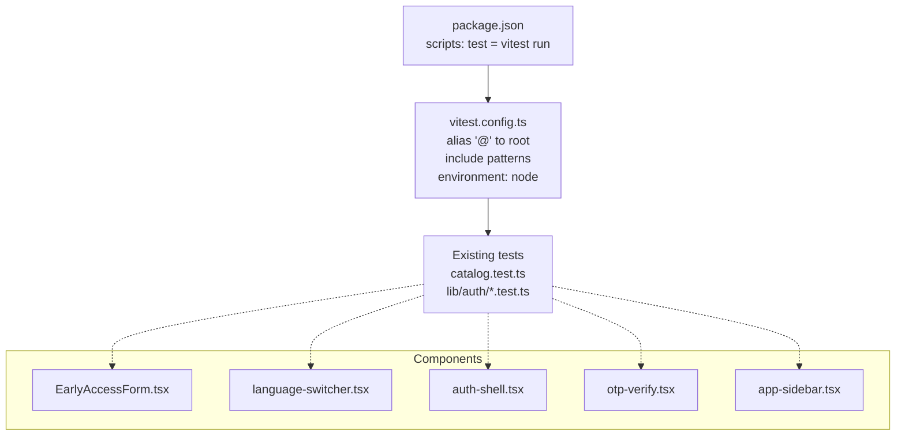
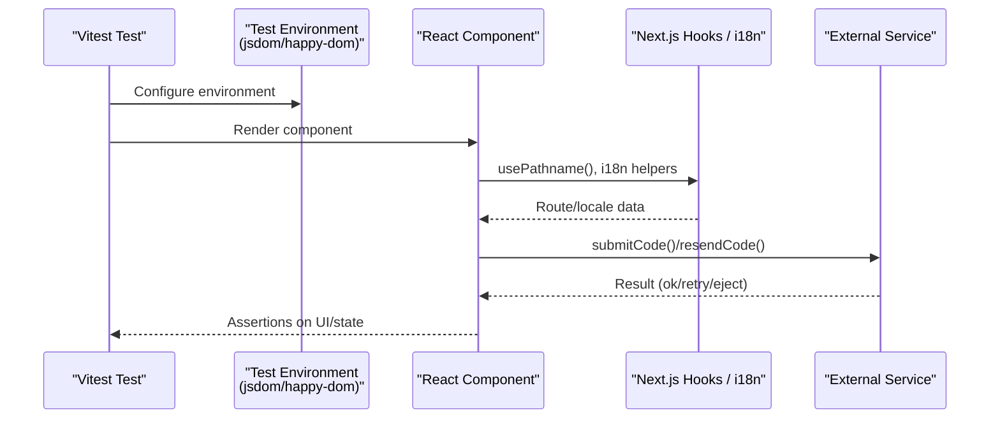
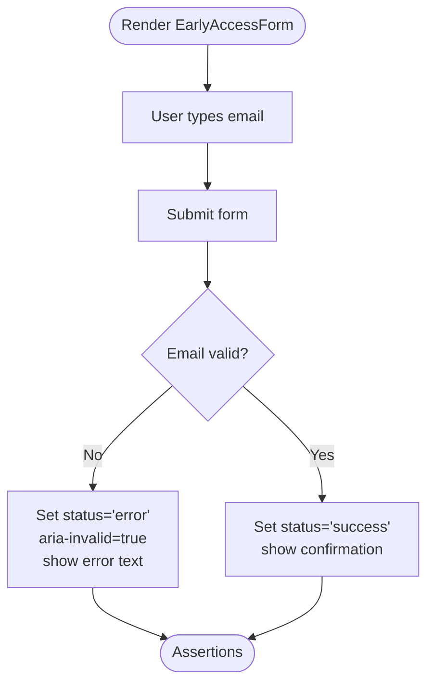
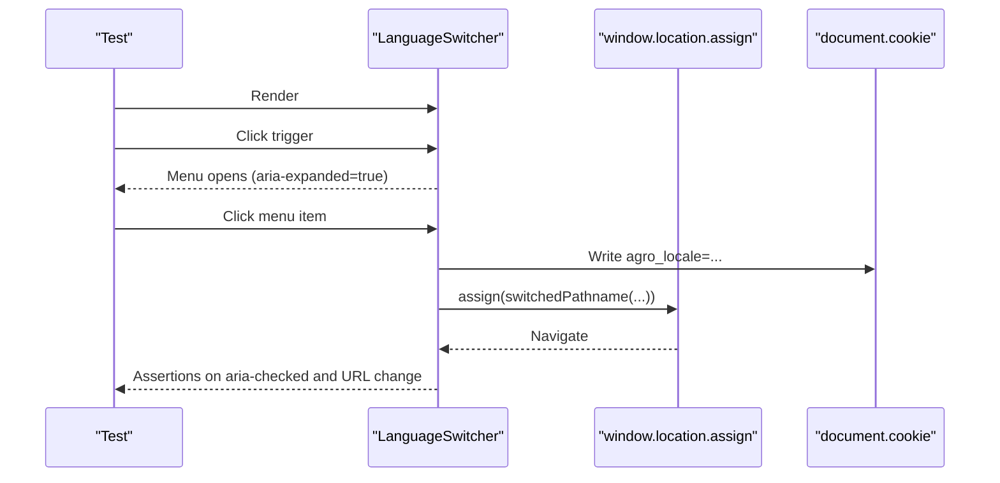
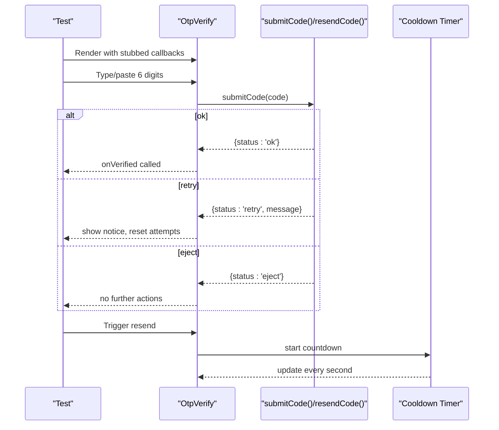
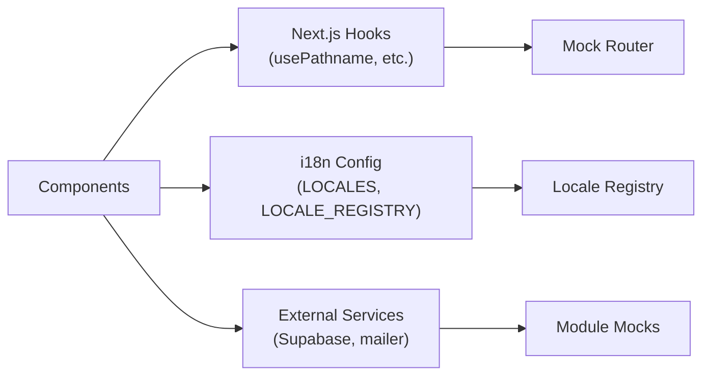

# Component Testing

<cite>
**Referenced Files in This Document**
- [package.json](file://package.json)
- [vitest.config.ts](file://vitest.config.ts)
- [catalog.test.ts](file://catalog/catalog.test.ts)
- [logic.test.ts](file://lib/auth/logic.test.ts)
- [EarlyAccessForm.tsx](file://components/EarlyAccessForm.tsx)
- [language-switcher.tsx](file://components/language-switcher.tsx)
- [auth-shell.tsx](file://components/auth/auth-shell.tsx)
- [otp-verify.tsx](file://components/auth/otp-verify.tsx)
- [app-sidebar.tsx](file://components/shell/app-sidebar.tsx)
- [config.ts](file://lib/i18n/config.ts)
</cite>

## Table of Contents
1. [Introduction](#introduction)
2. [Project Structure](#project-structure)
3. [Core Components](#core-components)
4. [Architecture Overview](#architecture-overview)
5. [Detailed Component Analysis](#detailed-component-analysis)
6. [Dependency Analysis](#dependency-analysis)
7. [Performance Considerations](#performance-considerations)
8. [Troubleshooting Guide](#troubleshooting-guide)
9. [Conclusion](#conclusion)
10. [Appendices](#appendices)

## Introduction
This document provides a comprehensive component testing guide for the Agropioo Next.js application. It focuses on testing UI components, form components, and layout components using Vitest as the test runner and React testing utilities compatible with Next.js. It also covers mocking strategies for context providers, hooks, and external dependencies; examples for user interactions, state changes, and rendering; and guidelines for responsive behavior, accessibility, internationalization, server/client/mixed component architectures.

## Project Structure
Agropioo uses Vitest for tests and currently includes unit tests under lib and catalog directories. The project contains several interactive client components (marked "use client") that require browser-like environments for DOM and navigation APIs during tests.

**Diagram sources**
- [package.json:5-11](file://package.json#L5-L11)
- [vitest.config.ts:1-14](file://vitest.config.ts#L1-L14)

**Section sources**
- [package.json:5-11](file://package.json#L5-L11)
- [vitest.config.ts:1-14](file://vitest.config.ts#L1-L14)

## Core Components
The following components are central to testing efforts:

- EarlyAccessForm: Client-side form with local validation and status transitions.
- LanguageSwitcher: Client-side dropdown that navigates by locale and persists choice via cookie.
- AuthShell: Layout shell used across auth flows; primarily presentational but may include routing and images.
- OtpVerify: Complex OTP input with keyboard handling, paste, cooldown timer, and async submission/resend.
- AppSidebar: Navigation sidebar using Next.js router hooks.

Testing priorities:
- User interactions: form submit, input changes, keyboard navigation, paste, button clicks.
- State changes: success/error/locked states, cooldown timers, active route highlighting.
- Rendering: conditional branches based on props/state, accessible attributes, responsive classes.
- Integration points: Next.js navigation hooks, i18n config, cookies, and API calls.

**Section sources**
- [EarlyAccessForm.tsx:1-81](file://components/EarlyAccessForm.tsx#L1-L81)
- [language-switcher.tsx:1-120](file://components/language-switcher.tsx#L1-L120)
- [auth-shell.tsx:1-90](file://components/auth/auth-shell.tsx#L1-L90)
- [otp-verify.tsx:1-321](file://components/auth/otp-verify.tsx#L1-L321)
- [app-sidebar.tsx:1-98](file://components/shell/app-sidebar.tsx#L1-L98)

## Architecture Overview
The application mixes server-rendered pages with client components. For component testing:
- Use a browser-like environment (jsdom or happy-dom) when testing components that touch DOM or Next.js browser APIs.
- Mock Next.js router/navigation hooks and i18n utilities to isolate component logic.
- Mock external services (e.g., Supabase, mailer) via module mocks or function spies.

[No diagram sources needed since this diagram shows conceptual workflow, not actual code structure]

## Detailed Component Analysis

### EarlyAccessForm
Responsibilities:
- Local email validation and status transitions (idle → error/success).
- Accessible label, aria-invalid, and error announcement.

Testing strategy:
- Render with a minimal setup that supports DOM events.
- Simulate typing into the email input and submitting the form.
- Assert success message appears for valid email; assert error state and aria-invalid for invalid email.
- Verify accessibility attributes (label, role="status", role="alert").

**Section sources**
- [EarlyAccessForm.tsx:1-81](file://components/EarlyAccessForm.tsx#L1-L81)

### LanguageSwitcher
Responsibilities:
- Displays current locale and opens a menu to switch languages.
- Persists choice via cookie and performs full page navigation using window.location.assign.

Testing strategy:
- Mock Next.js usePathname to return a known pathname.
- Mock window.location.assign to avoid real navigation.
- Mock document.cookie to verify persistence.
- Interact with the trigger button to open/close the menu and select a different locale.
- Assert aria-haspopup, aria-expanded, and menuitemradio states.

**Section sources**
- [language-switcher.tsx:1-120](file://components/language-switcher.tsx#L1-L120)
- [config.ts:1-137](file://lib/i18n/config.ts#L1-L137)

### OtpVerify
Responsibilities:
- Six-digit code input with auto-focus, paste support, keyboard navigation.
- Cooldown timer for resend, attempt limits, and async verification flow.
- Accessibility: aria-live announcements, disabled states, and clear labels.

Testing strategy:
- Provide stubs for submitCode and resendCode returning controlled results.
- Simulate typing digits, pasting a code, and pressing verify.
- Assert loading spinner, error messages, locked state after max attempts, and successful verification callback.
- Verify cooldown countdown updates and resend availability.

**Section sources**
- [otp-verify.tsx:1-321](file://components/auth/otp-verify.tsx#L1-L321)

### AuthShell
Responsibilities:
- Provides a split-panel layout for authentication flows with branding and content slots.

Testing strategy:
- Render with sample brandHeadline, brandPreview, brandPoints, and children.
- Assert layout structure and presence of key elements (logo, headings, lists).
- Since it is mostly presentational, focus on snapshot or structural assertions and accessibility markers where applicable.

**Section sources**
- [auth-shell.tsx:1-90](file://components/auth/auth-shell.tsx#L1-L90)

### AppSidebar
Responsibilities:
- Renders navigation links with active state detection using Next.js usePathname.

Testing strategy:
- Mock usePathname to simulate current route.
- Assert active link highlights and aria-current attributes.
- Ensure all nav items render with correct labels and icons.

**Section sources**
- [app-sidebar.tsx:1-98](file://components/shell/app-sidebar.tsx#L1-L98)

## Dependency Analysis
Key runtime dependencies for testing:
- Next.js router/navigation hooks: mock usePathname and any other navigation APIs used by components.
- i18n configuration: read from lib/i18n/config; ensure tests import consistent locale registry.
- External services: Supabase, mailer, etc., should be mocked at module level to avoid network calls.

**Section sources**
- [config.ts:1-137](file://lib/i18n/config.ts#L1-L137)

## Performance Considerations
- Keep tests fast by mocking network calls and avoiding real navigation.
- Use shallow or focused renders for complex components like OtpVerify to reduce overhead.
- Avoid heavy snapshots for layout-heavy components; prefer semantic assertions (roles, labels, states).
- Reuse mocks and fixtures to minimize setup time across tests.

[No sources needed since this section provides general guidance]

## Troubleshooting Guide
Common issues and resolutions:
- Tests fail due to missing browser APIs: configure jsdom or happy-dom in Vitest and polyfill necessary globals (window.location, document.cookie).
- Next.js hook errors: provide mocks for usePathname and any other router hooks used by components.
- Network timeouts: mock fetch or service modules to return deterministic responses.
- Timers not advancing: advance timers explicitly in tests or use fake timers if supported by your setup.

**Section sources**
- [vitest.config.ts:1-14](file://vitest.config.ts#L1-L14)

## Conclusion
Adopt a layered testing approach:
- Unit tests for pure logic (already present in lib and catalog).
- Component tests for interactive UI using a browser-like environment with mocked Next.js hooks and services.
- Focus on user interactions, state transitions, accessibility, and internationalization.
- Maintain fast, deterministic tests by isolating side effects through mocks.

[No sources needed since this section summarizes without analyzing specific files]

## Appendices

### Existing Test Patterns Reference
- Catalog integrity checks ensure translation keys and values are consistent across locales.
- Auth logic tests demonstrate boundary conditions, hashing, and state decisions.

Use these as templates for component tests:
- Organize describe blocks per feature.
- Use small, focused it blocks for each behavior.
- Assert both positive and negative paths.

**Section sources**
- [catalog.test.ts:1-36](file://catalog/catalog.test.ts#L1-L36)
- [logic.test.ts:1-127](file://lib/auth/logic.test.ts#L1-L127)

### Recommended Test Setup Notes
- Add a browser-like environment to Vitest for components that rely on DOM and Next.js browser APIs.
- Create shared mocks for Next.js router/hooks and i18n utilities.
- Centralize fixtures for common props and expected outputs.

[No sources needed since this section provides general guidance]