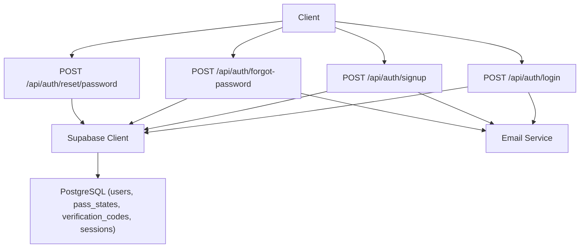
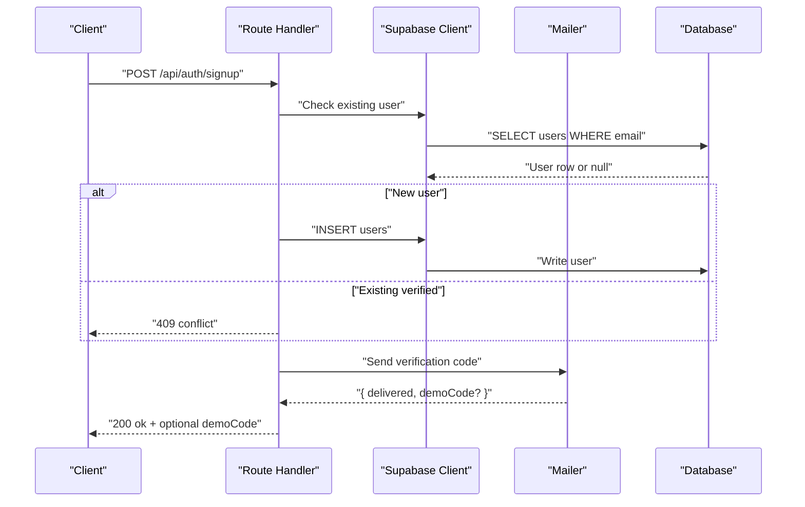
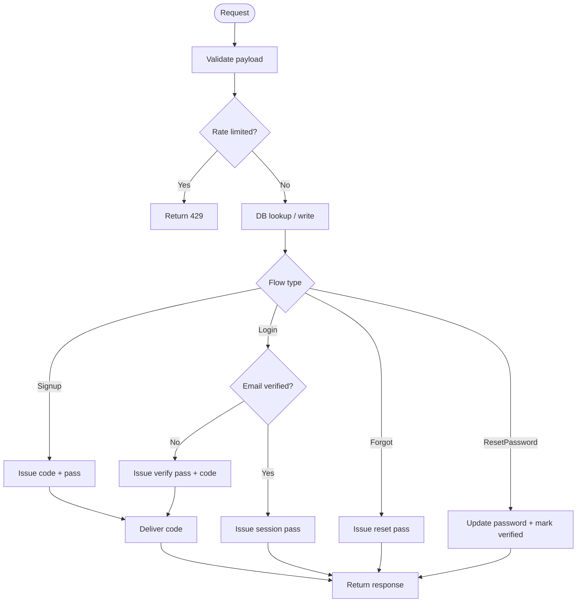
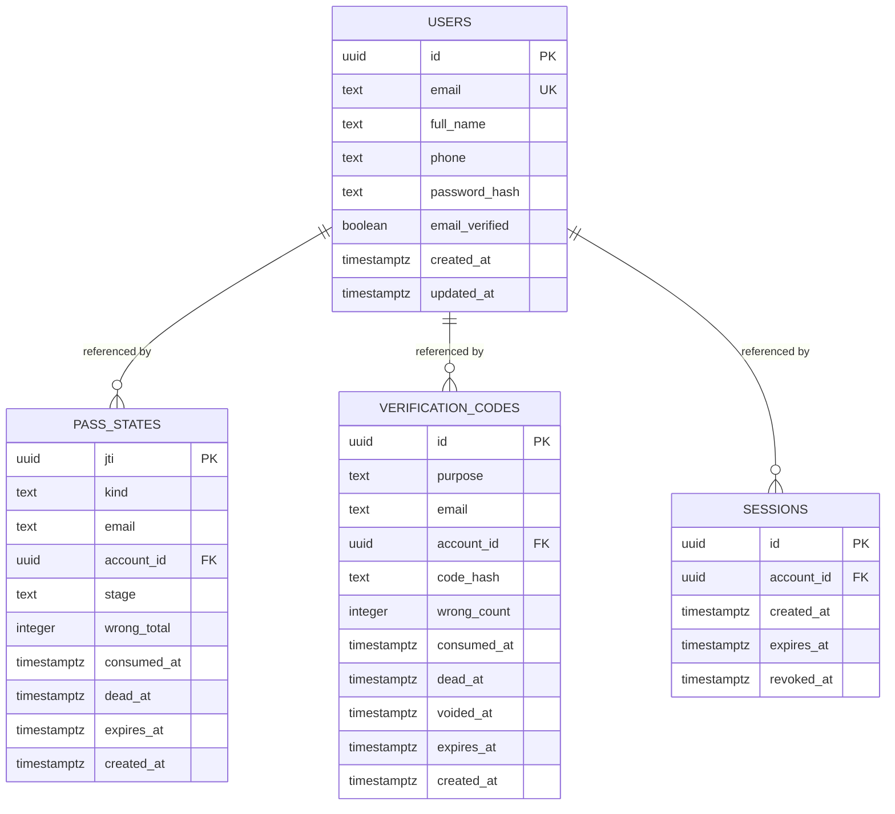
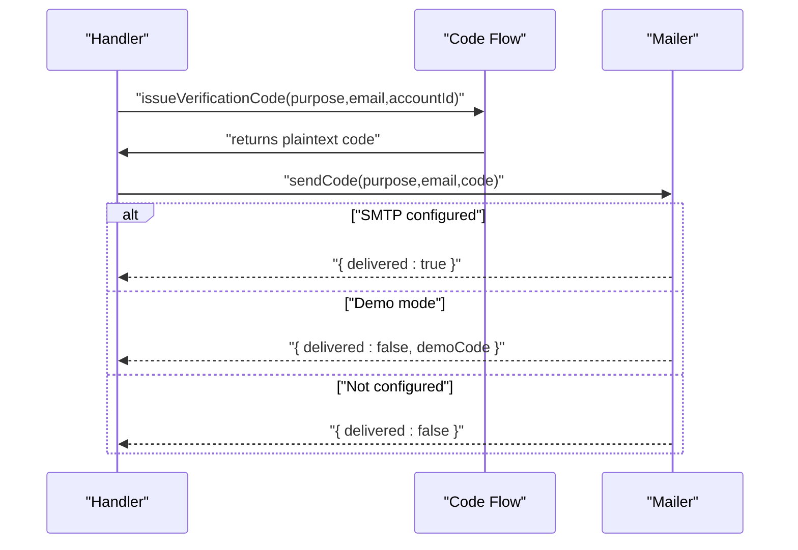
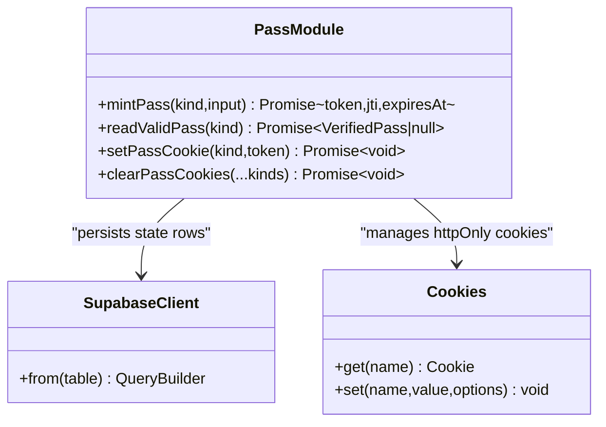
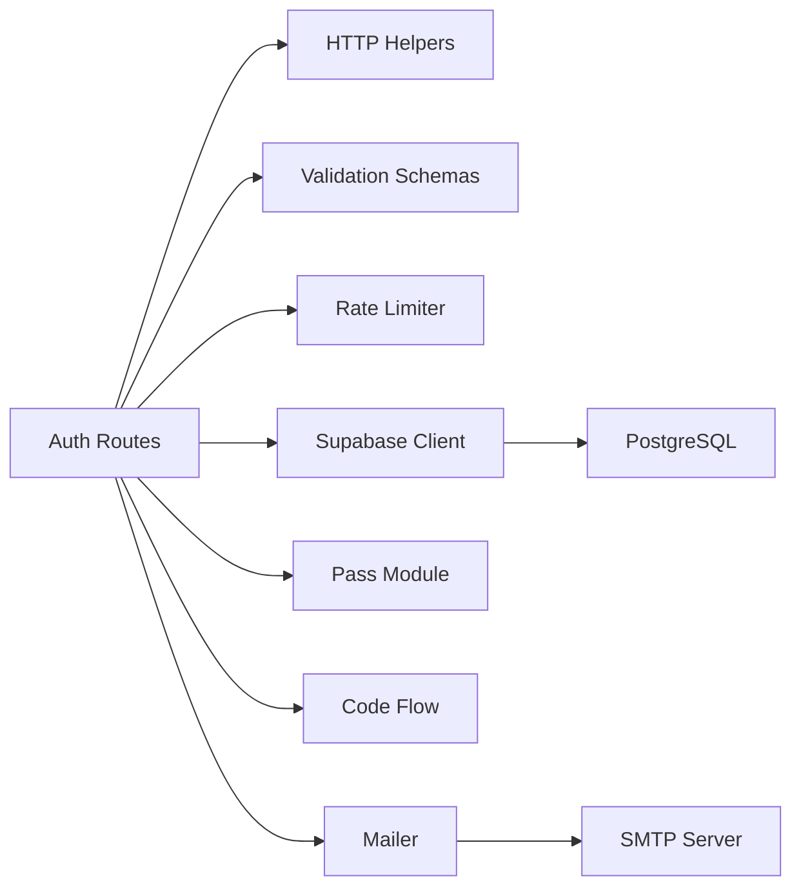

# Integration Testing

<cite>
**Referenced Files in This Document**
- [route.ts](file://app/api/auth/login/route.ts)
- [route.ts](file://app/api/auth/signup/route.ts)
- [route.ts](file://app/api/auth/forgot-password/route.ts)
- [route.ts](file://app/api/auth/reset/password/route.ts)
- [supabase.ts](file://lib/supabase.ts)
- [mailer.ts](file://lib/mailer.ts)
- [pass.ts](file://lib/auth/pass.ts)
- [code-flow.ts](file://lib/auth/code-flow.ts)
- [http.ts](file://lib/http.ts)
- [0002_auth.sql](file://supabase/migrations/0002_auth.sql)
- [vitest.config.ts](file://vitest.config.ts)
- [logic.test.ts](file://lib/auth/logic.test.ts)
- [pass.test.ts](file://lib/auth/pass.test.ts)
- [auth.test.ts](file://lib/validation/auth.test.ts)
</cite>

## Table of Contents
1. Introduction
2. Project Structure
3. Core Components
4. Architecture Overview
5. Detailed Component Analysis
6. Dependency Analysis
7. Performance Considerations
8. Troubleshooting Guide
9. Conclusion
10. Appendices

## Introduction
This document provides integration testing guidance for Agropioo’s API routes and database interactions, focusing on authentication flows, database queries, and external service integrations (email). It outlines mock strategies for the Supabase client and email services, demonstrates end-to-end user workflows, error scenarios, and concurrent operations, and offers guidelines for test databases, data management, cleanup, async patterns, transaction handling, and performance considerations.

## Project Structure
Agropioo exposes Next.js Route Handlers under app/api for authentication:
- POST /api/auth/signup
- POST /api/auth/login
- POST /api/auth/forgot-password
- POST /api/auth/reset/password

These handlers coordinate validation, rate limiting, Supabase queries, pass token minting, and email delivery. The project uses Vitest with a Node environment and path alias resolution for tests.

**Diagram sources**
- [route.ts:41-111](file://app/api/auth/login/route.ts#L41-L111)
- [route.ts:27-118](file://app/api/auth/signup/route.ts#L27-L118)
- [route.ts:21-81](file://app/api/auth/forgot-password/route.ts#L21-L81)
- [route.ts:20-83](file://app/api/auth/reset/password/route.ts#L20-L83)
- [supabase.ts:14-46](file://lib/supabase.ts#L14-L46)
- [mailer.ts:49-84](file://lib/mailer.ts#L49-L84)
- [0002_auth.sql:7-60](file://supabase/migrations/0002_auth.sql#L7-L60)

**Section sources**
- [vitest.config.ts:4-14](file://vitest.config.ts#L4-L14)

## Core Components
- Authentication route handlers implement validation, rate limiting, Supabase access, pass token lifecycle, and email delivery.
- Supabase client module provides anon and admin clients; tests should isolate or mock this to avoid real network calls.
- Email module abstracts SMTP transport and demo mode behavior; tests can assert delivery outcomes without sending real emails.
- Pass token module signs/verifies JWTs and persists state rows; tests validate cryptographic contracts and row state transitions.
- Code flow module issues verification codes and voids prior codes atomically; tests ensure last-code-wins semantics.

Key responsibilities:
- Validation: Zod schemas normalize inputs and enforce constraints.
- Rate limiting: Per IP/email limits protect endpoints.
- Database: Queries against users, pass_states, verification_codes, sessions.
- External services: Email via nodemailer; optional demo mode returns codes inline.

**Section sources**
- [route.ts:41-111](file://app/api/auth/login/route.ts#L41-L111)
- [route.ts:27-118](file://app/api/auth/signup/route.ts#L27-L118)
- [route.ts:21-81](file://app/api/auth/forgot-password/route.ts#L21-L81)
- [route.ts:20-83](file://app/api/auth/reset/password/route.ts#L20-L83)
- [supabase.ts:14-46](file://lib/supabase.ts#L14-L46)
- [mailer.ts:49-84](file://lib/mailer.ts#L49-L84)
- [pass.ts:111-148](file://lib/auth/pass.ts#L111-L148)
- [code-flow.ts:15-51](file://lib/auth/code-flow.ts#L15-L51)

## Architecture Overview
The authentication architecture centers on secure, stateful passes and verification codes stored in PostgreSQL, with HTTP-only cookies carrying signed tokens. Endpoints orchestrate validation, rate limiting, DB writes, and email delivery.

**Diagram sources**
- [route.ts:27-118](file://app/api/auth/signup/route.ts#L27-L118)
- [supabase.ts:14-31](file://lib/supabase.ts#L14-L31)
- [mailer.ts:49-84](file://lib/mailer.ts#L49-L84)
- [0002_auth.sql:7-17](file://supabase/migrations/0002_auth.sql#L7-L17)

## Detailed Component Analysis

### Authentication Flows
- Signup: Validates input, enforces rate limits, handles first-write-wins concurrency, issues verification code and pass, sets cookie, delivers email.
- Login: Validates input, rate limits, checks credentials, gates unverified accounts through verification flow, issues session pass for verified accounts.
- Forgot password: Always issues reset pass and cookie; only known accounts receive a code; response shape is constant.
- Reset password: Requires reset pass at code_verified stage with bound account; updates password, marks email verified, voids codes, consumes pass, kills sessions.

**Diagram sources**
- [route.ts:41-111](file://app/api/auth/login/route.ts#L41-L111)
- [route.ts:27-118](file://app/api/auth/signup/route.ts#L27-L118)
- [route.ts:21-81](file://app/api/auth/forgot-password/route.ts#L21-L81)
- [route.ts:20-83](file://app/api/auth/reset/password/route.ts#L20-L83)

**Section sources**
- [route.ts:41-111](file://app/api/auth/login/route.ts#L41-L111)
- [route.ts:27-118](file://app/api/auth/signup/route.ts#L27-L118)
- [route.ts:21-81](file://app/api/auth/forgot-password/rorte.ts#L21-L81)
- [route.ts:20-83](file://app/api/auth/reset/password/route.ts#L20-L83)

### Database Interactions
- Tables: users, pass_states, verification_codes, sessions.
- Indexes: unique lowercased email index; codes lookup by purpose/email/time; sessions by account_id.
- Concurrency: Unique constraint on lower(email) ensures first-write-wins; handlers handle duplicate insert errors by re-reading winner.

**Diagram sources**
- [0002_auth.sql:7-60](file://supabase/migrations/0002_auth.sql#L7-L60)

**Section sources**
- [0002_auth.sql:7-60](file://supabase/migrations/0002_auth.sql#L7-L60)
- [route.ts:70-101](file://app/api/auth/signup/route.ts#L70-L101)

### External Service Integrations (Email)
- Nodemailer transporter is lazily created when SMTP is configured.
- Demo mode returns codes inline without sending; production sends via SMTP.
- Tests should assert sendCode behavior under both modes and simulate failures.

**Diagram sources**
- [code-flow.ts:15-51](file://lib/auth/code-flow.ts#L15-L51)
- [mailer.ts:49-84](file://lib/mailer.ts#L49-L84)

**Section sources**
- [mailer.ts:13-21](file://lib/mailer.ts#L13-L21)
- [mailer.ts:49-84](file://lib/mailer.ts#L49-L84)

### Pass Tokens and Sessions
- Pass tokens are HS256 JWTs with strict type checks and expiry leeway.
- State rows track consumption, death, stages, and expiration.
- Session rows survive restarts; logout revokes one row; reset password kills all sessions.

**Diagram sources**
- [pass.ts:111-148](file://lib/auth/pass.ts#L111-L148)
- [pass.ts:196-232](file://lib/auth/pass.ts#L196-L232)
- [pass.ts:244-263](file://lib/auth/pass.ts#L244-L263)

**Section sources**
- [pass.ts:72-89](file://lib/auth/pass.ts#L72-L89)
- [pass.ts:111-148](file://lib/auth/pass.ts#L111-L148)
- [pass.ts:196-232](file://lib/auth/pass.ts#L196-L232)

## Dependency Analysis
- Route handlers depend on:
  - Validation schemas (Zod)
  - HTTP helpers (errorResponse, jsonResponse, readJsonBody, clientIp)
  - Rate limiter (per IP/email)
  - Supabase client (anon/admin)
  - Pass module (mint, read, set/clear cookies)
  - Code flow (issue, deliver)
  - Mailer (sendCode)
- Supabase client depends on environment variables for URL and keys.
- Mailer depends on SMTP configuration and optional demo mode.

**Diagram sources**
- [route.ts:41-111](file://app/api/auth/login/route.ts#L41-L111)
- [http.ts:1-61](file://lib/http.ts#L1-L61)
- [supabase.ts:14-46](file://lib/supabase.ts#L14-L46)
- [mailer.ts:49-84](file://lib/mailer.ts#L49-L84)

**Section sources**
- [http.ts:1-61](file://lib/http.ts#L1-L61)
- [supabase.ts:14-46](file://lib/supabase.ts#L14-L46)
- [mailer.ts:49-84](file://lib/mailer.ts#L49-L84)

## Performance Considerations
- Use connection pooling and minimize round-trips: batch DB operations where possible.
- Avoid unnecessary hashing for unknown emails during login to equalize timing.
- Leverage indexes on users.email (lower), verification_codes(purpose,email,created_at desc), sessions(account_id).
- Rate limiting reduces load from brute-force attempts.
- For tests, mock external services to eliminate network latency and flakiness.

[No sources needed since this section provides general guidance]

## Troubleshooting Guide
Common issues and resolutions:
- Missing environment variables: Ensure SUPABASE_URL, SUPABASE_ANON_KEY, JWT_SECRET, SMTP_* are set in test environments.
- Email delivery failures: In non-demo mode, failures are logged but responses remain neutral; assert delivered flag and handle retries gracefully.
- Concurrent signups: Handle unique constraint violations by re-reading the winning row; tests should simulate race conditions.
- Pass token validation: Wrong type, tampered signatures, or expired tokens return null; ensure tests cover these cases.

**Section sources**
- [supabase.ts:6-12](file://lib/supabase.ts#L6-L12)
- [pass.ts:72-89](file://lib/auth/pass.ts#L72-L89)
- [route.ts:83-101](file://app/api/auth/signup/route.ts#L83-L101)

## Conclusion
Agropioo’s authentication system combines robust validation, rate limiting, secure pass tokens, and reliable email delivery. Integration tests should focus on end-to-end flows across routes, database state changes, and external service behaviors using mocks. Emphasize deterministic assertions, isolation, and coverage of error paths and concurrency scenarios.

[No sources needed since this section summarizes without analyzing specific files]

## Appendices

### Test Setup Guidelines
- Environment:
  - Use Vitest Node environment with path aliases.
  - Provide minimal env vars for Supabase and JWT in tests; prefer mocking over real connections.
- Test Database:
  - Spin up an isolated Postgres instance per test run or use transactions to rollback after each test.
  - Apply migrations before tests; truncate tables after tests to ensure clean state.
- Mock Strategies:
  - Supabase client: Mock getSupabase() to return a lightweight client that records calls and returns controlled fixtures.
  - Mailer: Replace sendCode with a spy that asserts parameters and optionally returns demoCode based on flags.
  - Pass module: For unit-level tests, rely on existing pass tests; for integration, mock DB writes and verify cookies and responses.
- Data Management:
  - Seed minimal users and pass states required for flows.
  - Use factories to generate consistent test data.
  - Clean up after tests by deleting inserted rows or rolling back transactions.

**Section sources**
- [vitest.config.ts:4-14](file://vitest.config.ts#L4-L14)
- [pass.test.ts:1-25](file://lib/auth/pass.test.ts#L1-L25)
- [logic.test.ts:1-28](file://lib/auth/logic.test.ts#L1-L28)
- [auth.test.ts:1-24](file://lib/validation/auth.test.ts#L1-L24)

### Example Scenarios

#### Complete User Workflow: Signup to Verified Login
- Steps:
  - POST /api/auth/signup with valid payload.
  - Assert 200 ok and optional demoCode if SMTP not configured.
  - Verify pass_states and verification_codes entries created.
  - POST /api/auth/login with correct credentials.
  - If email unverified, expect redirect to /verify and a verify pass cookie.
  - After verification, login should issue session pass and redirect to dashboard.
- Assertions:
  - DB state transitions: users created, pass_states created, verification_codes issued and consumed.
  - Cookies: verify then session cookies set appropriately.
  - Responses: status codes and bodies match spec.

**Section sources**
- [route.ts:27-118](file://app/api/auth/signup/route.ts#L27-L118)
- [route.ts:41-111](file://app/api/auth/login/route.ts#L41-L111)
- [code-flow.ts:15-51](file://lib/auth/code-flow.ts#L15-L51)
- [pass.ts:111-148](file://lib/auth/pass.ts#L111-L148)

#### Error Scenarios
- Invalid payloads: Expect 400 validation_error.
- Duplicate verified email: Expect 409 conflict_registered.
- Rate limiting: Expect 429 too many attempts.
- Unknown email login: Expect 401 unauthorized with generic message.
- Expired/tampered pass: Expect 401 unauthorized.

**Section sources**
- [route.ts:27-118](file://app/api/auth/signup/route.ts#L27-L118)
- [route.ts:41-111](file://app/api/auth/login/route.ts#L41-L111)
- [http.ts:19-25](file://lib/http.ts#L19-L25)

#### Concurrent Operations
- Simultaneous signup requests for same email:
  - One insert succeeds; others hit unique constraint and reuse winner.
  - Assert exactly one user row and consistent verification flow.
- Resend verification codes:
  - Last-code-wins: prior unconsumed codes are voided.
  - Assert verification_codes rows reflect voided_at timestamps.

**Section sources**
- [route.ts:70-101](file://app/api/auth/signup/route.ts#L70-L101)
- [code-flow.ts:15-42](file://lib/auth/code-flow.ts#L15-L42)

### Async Patterns and Transaction Handling
- Async operations:
  - Await all DB and mailer calls; wrap in try/catch to return standardized errors.
  - Use connection() to prevent static caching in pass validation.
- Transactions:
  - Prefer DB-level transactions for multi-step writes (e.g., issuing code and pass).
  - In tests, use per-test transactions to roll back changes automatically.

**Section sources**
- [pass.ts:196-232](file://lib/auth/pass.ts#L196-L232)
- [route.ts:20-83](file://app/api/auth/reset/password/route.ts#L20-L83)