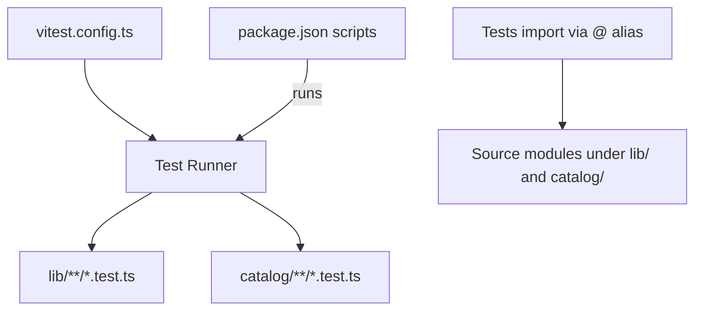
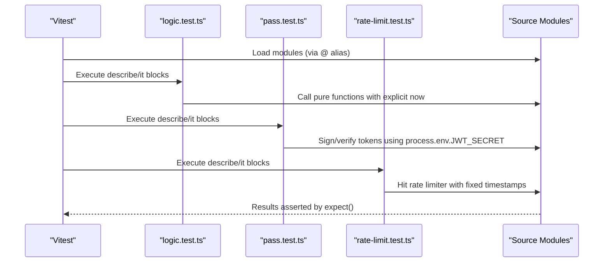
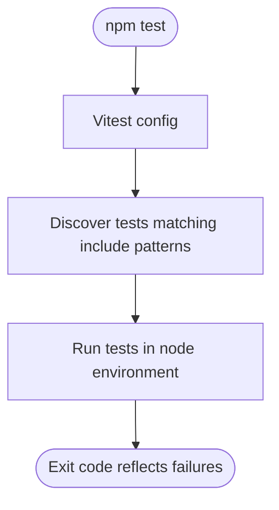
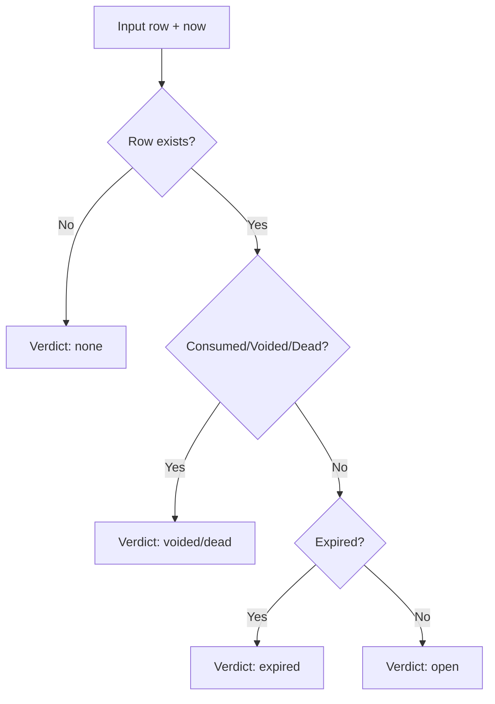
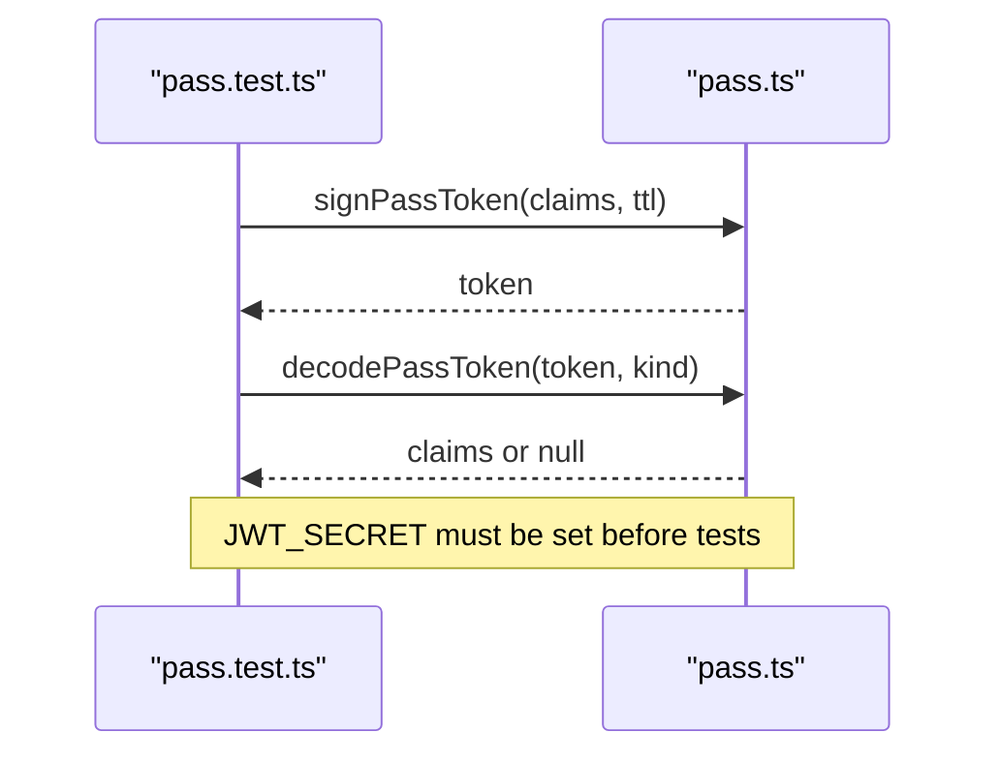
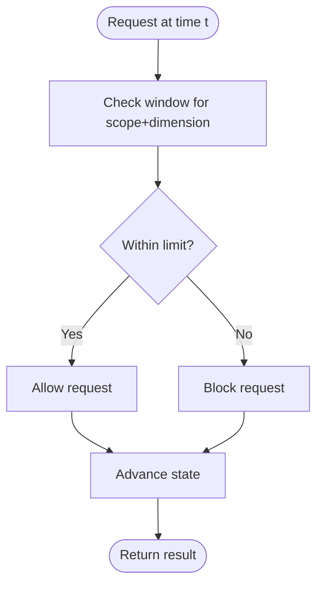
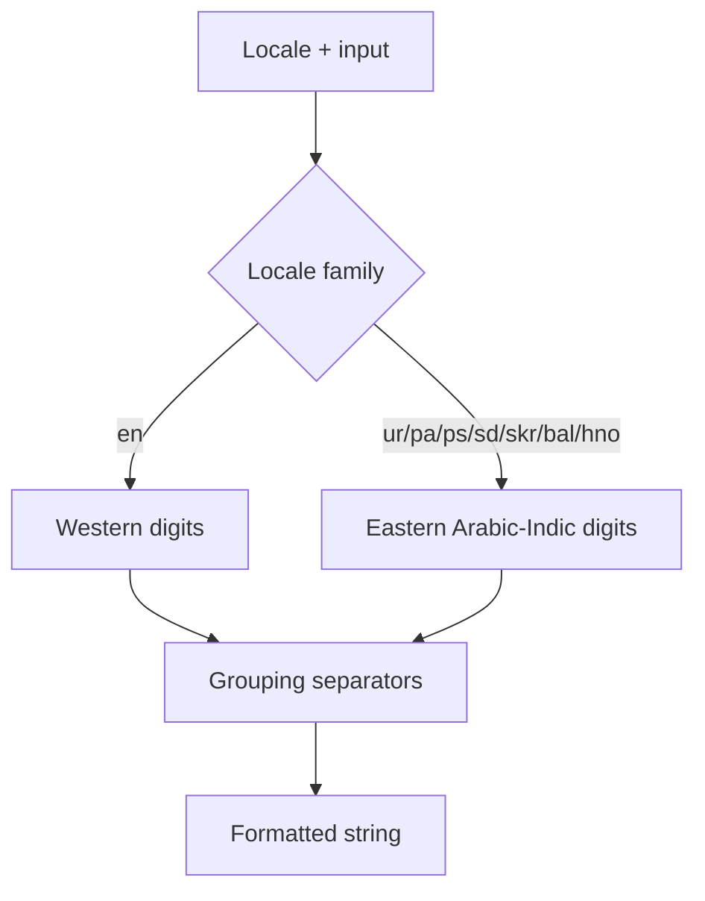
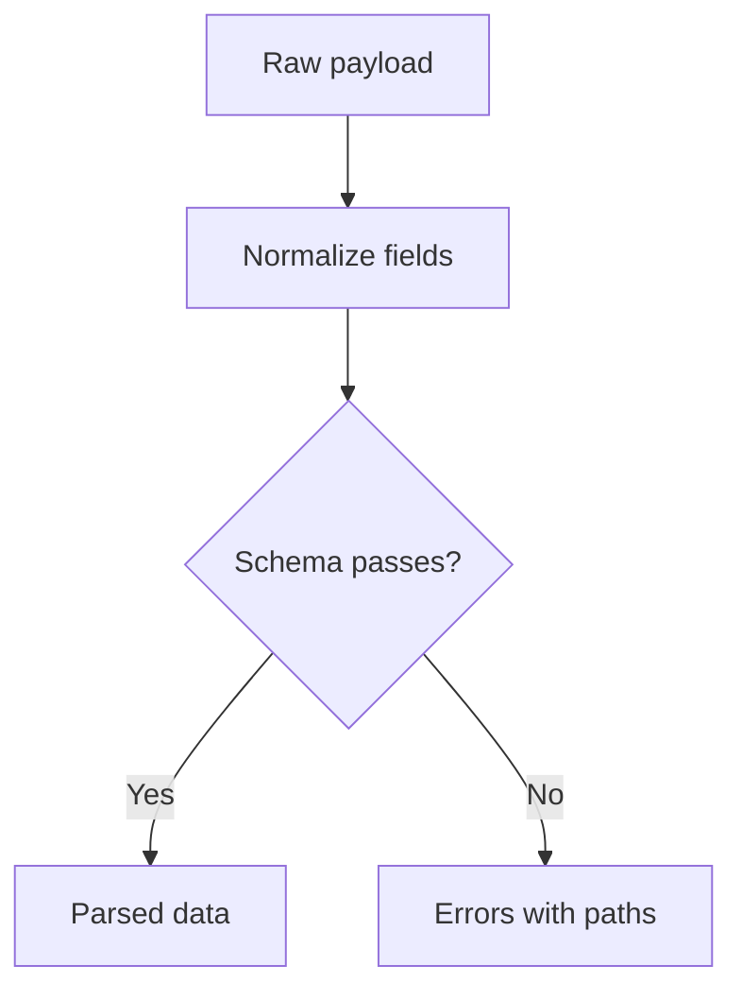
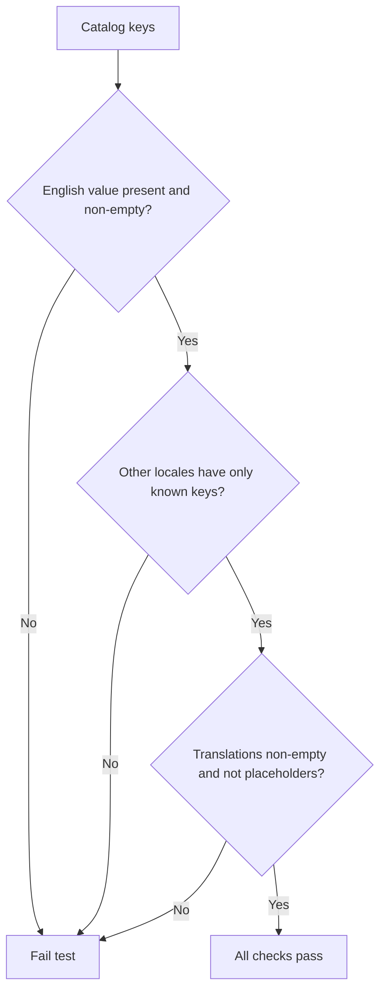
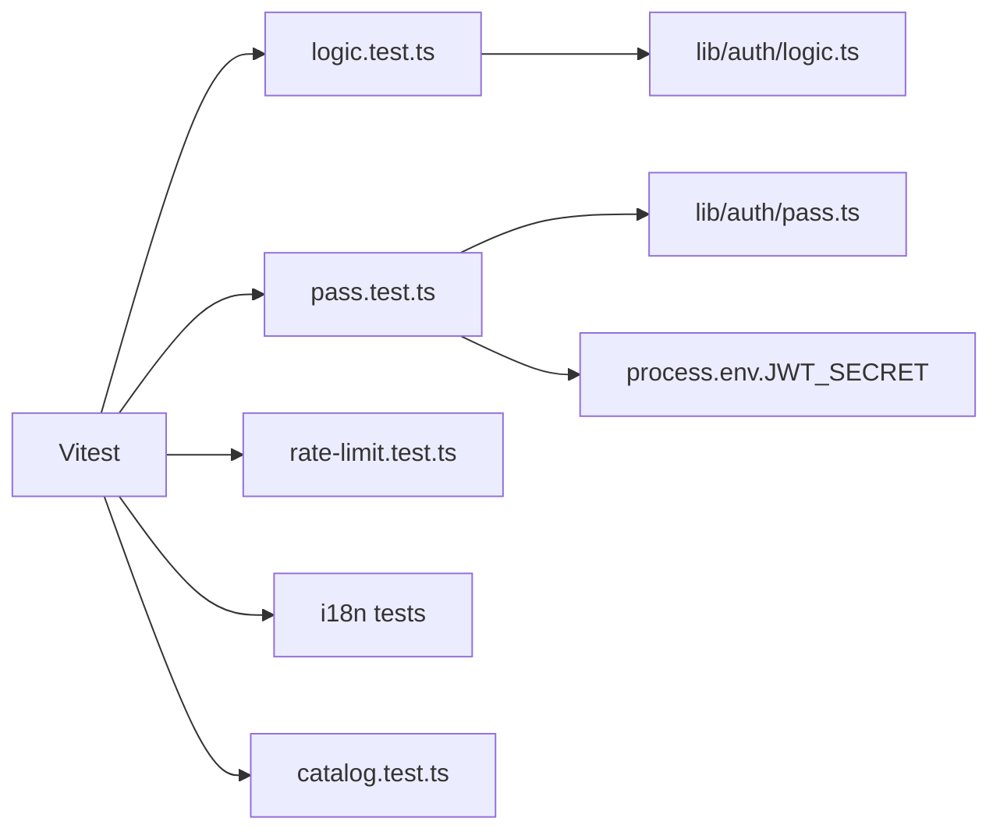

# Test Configuration and Setup

<cite>
**Referenced Files in This Document**
- [vitest.config.ts](file://vitest.config.ts)
- [package.json](file://package.json)
- [catalog.test.ts](file://catalog/catalog.test.ts)
- [logic.test.ts](file://lib/auth/logic.test.ts)
- [pass.test.ts](file://lib/auth/pass.test.ts)
- [rate-limit.test.ts](file://lib/auth/rate-limit.test.ts)
- [format.test.ts](file://lib/i18n/format.test.ts)
- [logic.test.ts (i18n)](file://lib/i18n/logic.test.ts)
- [auth.test.ts (validation)](file://lib/validation/auth.test.ts)
- [logic.ts](file://lib/auth/logic.ts)
- [pass.ts](file://lib/auth/pass.ts)
</cite>

## Table of Contents
1. Introduction
2. Project Structure
3. Core Components
4. Architecture Overview
5. Detailed Component Analysis
6. Dependency Analysis
7. Performance Considerations
8. Troubleshooting Guide
9. Conclusion

## Introduction
This document explains how Agropioo’s testing environment is configured and used with Vitest. It covers configuration options, environment setup, dependency mocking strategies, test organization and naming conventions, running tests, and guidance for continuous integration, reporting, and debugging. Where applicable, it references the actual files that implement or demonstrate these patterns.

## Project Structure
Agropioo uses a Node-based Vitest setup with path aliases to simplify imports in tests. Tests are colocated next to their source modules using the .test.ts suffix and follow a consistent describe/it structure. The project includes unit tests for authentication logic, i18n formatting and routing logic, validation schemas, and catalog integrity checks.

**Diagram sources**
- [vitest.config.ts:4-13](file://vitest.config.ts#L4-L13)
- [package.json:5-11](file://package.json#L5-L11)

**Section sources**
- [vitest.config.ts:1-14](file://vitest.config.ts#L1-L14)
- [package.json:1-38](file://package.json#L1-L38)

## Core Components
- Test runner and discovery:
  - Environment: node
  - Include patterns: lib/**/*.test.ts and catalog/**/*.test.ts
  - Path alias: @ resolves to the project root
- Scripts:
  - npm test runs vitest run for CI-friendly execution
- Example test suites:
  - Authentication logic and pass token round-trips
  - Rate limiting behavior
  - i18n formatting and locale routing logic
  - Validation schema correctness
  - Catalog integrity across locales

**Section sources**
- [vitest.config.ts:4-13](file://vitest.config.ts#L4-L13)
- [package.json:5-11](file://package.json#L5-L11)
- [logic.test.ts:1-127](file://lib/auth/logic.test.ts#L1-L127)
- [pass.test.ts:1-93](file://lib/auth/pass.test.ts#L1-L93)
- [rate-limit.test.ts:1-46](file://lib/auth/rate-limit.test.ts#L1-L46)
- [format.test.ts:1-25](file://lib/i18n/format.test.ts#L1-L25)
- [logic.test.ts (i18n):1-133](file://lib/i18n/logic.test.ts#L1-L133)
- [auth.test.ts (validation):1-97](file://lib/validation/auth.test.ts#L1-L97)
- [catalog.test.ts:1-36](file://catalog/catalog.test.ts#L1-L36)

## Architecture Overview
The test architecture centers on pure functions and deterministic inputs. Authentication logic tests pass explicit timestamps to avoid time-dependent behavior. Pass token tests use real JWT signing/verification against an environment-provided secret. Rate limit tests exercise fixed-window counters with controlled time inputs. i18n and validation tests assert normalization and formatting rules without network or database access.

**Diagram sources**
- [vitest.config.ts:4-13](file://vitest.config.ts#L4-L13)
- [logic.test.ts:15-127](file://lib/auth/logic.test.ts#L15-L127)
- [pass.test.ts:1-93](file://lib/auth/pass.test.ts#L1-L93)
- [rate-limit.test.ts:1-46](file://lib/auth/rate-limit.test.ts#L1-L46)

## Detailed Component Analysis

### Vitest Configuration
- Environment: node
- Include patterns: lib/**/*.test.ts and catalog/**/*.test.ts
- Alias: @ maps to the project root, enabling clean imports like "@/lib/..."
- Script: npm test executes vitest run for headless CI usage

**Diagram sources**
- [vitest.config.ts:4-13](file://vitest.config.ts#L4-L13)
- [package.json:5-11](file://package.json#L5-L11)

**Section sources**
- [vitest.config.ts:1-14](file://vitest.config.ts#L1-L14)
- [package.json:5-11](file://package.json#L5-L11)

### Authentication Logic Tests
- Deterministic time: tests pass explicit timestamps to functions that depend on time
- Coverage areas:
  - Code generation and hashing
  - Verdict classification (open, expired, dead, voided)
  - Wrong-entry accounting and cooldowns
  - Session liveness checks
  - Redirect decisions

**Diagram sources**
- [logic.ts:52-64](file://lib/auth/logic.ts#L52-L64)
- [logic.test.ts:51-72](file://lib/auth/logic.test.ts#L51-L72)

**Section sources**
- [logic.test.ts:1-127](file://lib/auth/logic.test.ts#L1-L127)
- [logic.ts:1-127](file://lib/auth/logic.ts#L1-L127)

### Pass Token Tests
- Uses real JWT signing and verification from jose
- Requires JWT_SECRET environment variable; set in test file and cleaned up after all tests
- Validates:
  - Round-trip minting and decoding
  - Type enforcement (verify/reset/session)
  - Expiry and clock skew tolerance
  - Tamper detection

**Diagram sources**
- [pass.test.ts:1-93](file://lib/auth/pass.test.ts#L1-L93)
- [pass.ts:64-104](file://lib/auth/pass.ts#L64-L104)

**Section sources**
- [pass.test.ts:1-93](file://lib/auth/pass.test.ts#L1-L93)
- [pass.ts:1-200](file://lib/auth/pass.ts#L1-L200)

### Rate Limiting Tests
- Exercises fixed-window rate limiter with explicit timestamps
- Validates per-dimension tracking (IP, email, pass scope)
- Ensures fresh windows after elapsed periods

**Diagram sources**
- [rate-limit.test.ts:8-45](file://lib/auth/rate-limit.test.ts#L8-L45)

**Section sources**
- [rate-limit.test.ts:1-46](file://lib/auth/rate-limit.test.ts#L1-L46)

### i18n Formatting and Logic Tests
- Number formatting asserts Western vs Eastern Arabic-Indic digits per locale
- Locale registry validates direction, slugs, and hreflang constraints
- URL helpers ensure correct prefixing and switching between locales
- Message resolution prefers localized values and falls back safely

**Diagram sources**
- [format.test.ts:5-24](file://lib/i18n/format.test.ts#L5-L24)

**Section sources**
- [format.test.ts:1-25](file://lib/i18n/format.test.ts#L1-L25)
- [logic.test.ts (i18n):18-54](file://lib/i18n/logic.test.ts#L18-L54)
- [logic.test.ts (i18n):71-95](file://lib/i18n/logic.test.ts#L71-L95)
- [logic.test.ts (i18n):97-133](file://lib/i18n/logic.test.ts#L97-L133)

### Validation Schema Tests
- Normalizes emails and names
- Enforces phone formats and password policies
- Confirms error paths for mismatched confirm passwords
- Validates six-digit code format

**Diagram sources**
- [auth.test.ts (validation):10-97](file://lib/validation/auth.test.ts#L10-L97)

**Section sources**
- [auth.test.ts (validation):1-97](file://lib/validation/auth.test.ts#L1-L97)

### Catalog Integrity Tests
- Ensures every key has a non-empty English value
- Prevents stray keys in other locales
- Disallows placeholder values in translations

**Diagram sources**
- [catalog.test.ts:6-35](file://catalog/catalog.test.ts#L6-L35)

**Section sources**
- [catalog.test.ts:1-36](file://catalog/catalog.test.ts#L1-L36)

## Dependency Analysis
- Tests rely on:
  - Vitest runtime and assertions
  - Node crypto utilities for hashing and random codes
  - jose for JWT operations
  - Supabase client for persistence-related flows (not exercised in current tests)
- No external services are required to run the existing test suite.

**Diagram sources**
- [vitest.config.ts:4-13](file://vitest.config.ts#L4-L13)
- [logic.test.ts:1-127](file://lib/auth/logic.test.ts#L1-L127)
- [pass.test.ts:1-93](file://lib/auth/pass.test.ts#L1-L93)
- [rate-limit.test.ts:1-46](file://lib/auth/rate-limit.test.ts#L1-L46)
- [logic.ts:1-127](file://lib/auth/logic.ts#L1-L127)
- [pass.ts:1-200](file://lib/auth/pass.ts#L1-L200)

**Section sources**
- [vitest.config.ts:1-14](file://vitest.config.ts#L1-L14)
- [logic.test.ts:1-127](file://lib/auth/logic.test.ts#L1-L127)
- [pass.test.ts:1-93](file://lib/auth/pass.test.ts#L1-L93)
- [rate-limit.test.ts:1-46](file://lib/auth/rate-limit.test.ts#L1-L46)
- [logic.ts:1-127](file://lib/auth/logic.ts#L1-L127)
- [pass.ts:1-200](file://lib/auth/pass.ts#L1-L200)

## Performance Considerations
- Keep tests fast and deterministic:
  - Use explicit timestamps instead of relying on system time
  - Avoid network calls; mock or stub if necessary
  - Prefer pure function tests for business logic
- Leverage Vitest’s parallel execution by default; keep tests isolated and free of shared mutable state
- For rate limit tests, control time explicitly to minimize flakiness

[No sources needed since this section provides general guidance]

## Troubleshooting Guide
Common issues and resolutions:
- Missing JWT_SECRET when running pass token tests:
  - Ensure JWT_SECRET is set before executing tests; tests set a temporary value and clean it up afterward
- Unexpected module resolution errors:
  - Confirm the @ alias points to the project root and that imports use the alias consistently
- Flaky time-dependent tests:
  - Pass explicit timestamps to functions rather than relying on Date.now()
- Rate limiter interference between tests:
  - Reset internal state between tests where applicable (e.g., dedicated reset helpers exposed for tests)

**Section sources**
- [pass.test.ts:1-25](file://lib/auth/pass.test.ts#L1-L25)
- [vitest.config.ts:4-13](file://vitest.config.ts#L4-L13)
- [rate-limit.test.ts:1-6](file://lib/auth/rate-limit.test.ts#L1-L6)

## Conclusion
Agropioo’s test suite is built around deterministic, fast, and isolated unit tests using Vitest in a Node environment. The configuration is minimal but effective, with clear include patterns and path aliases. Existing tests cover critical domains such as authentication logic, pass tokens, rate limiting, i18n, validation, and catalog integrity. By following the established patterns—explicit time inputs, environment-driven secrets, and colocated .test.ts files—you can extend coverage confidently and integrate smoothly into CI pipelines.

[No sources needed since this section summarizes without analyzing specific files]