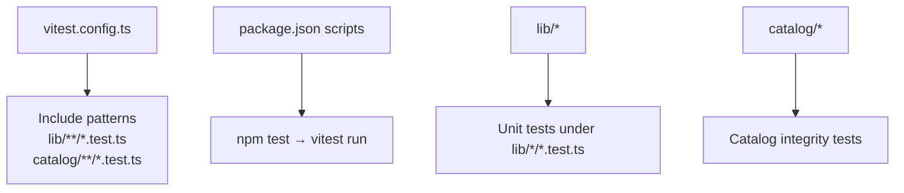
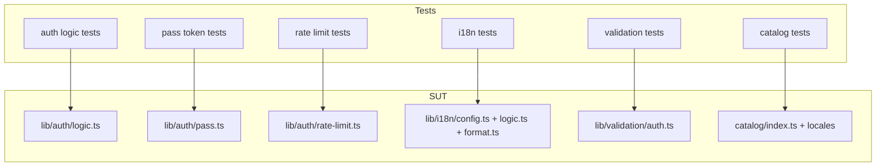
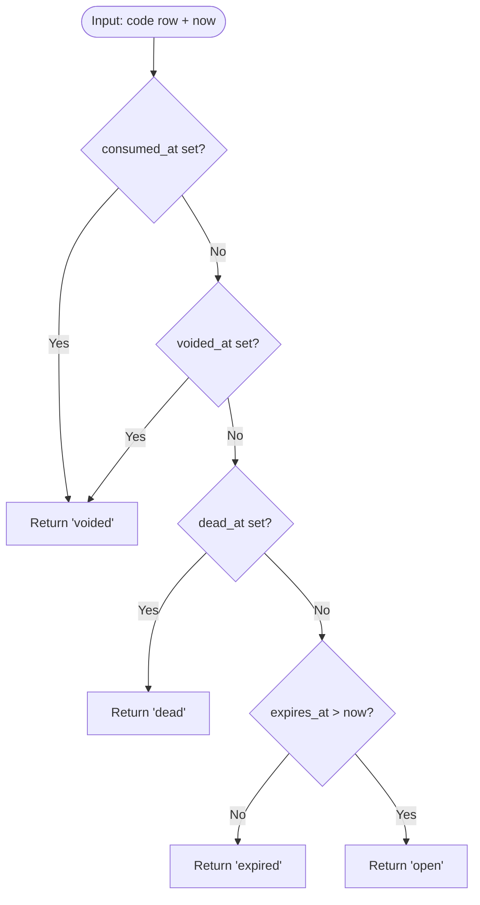
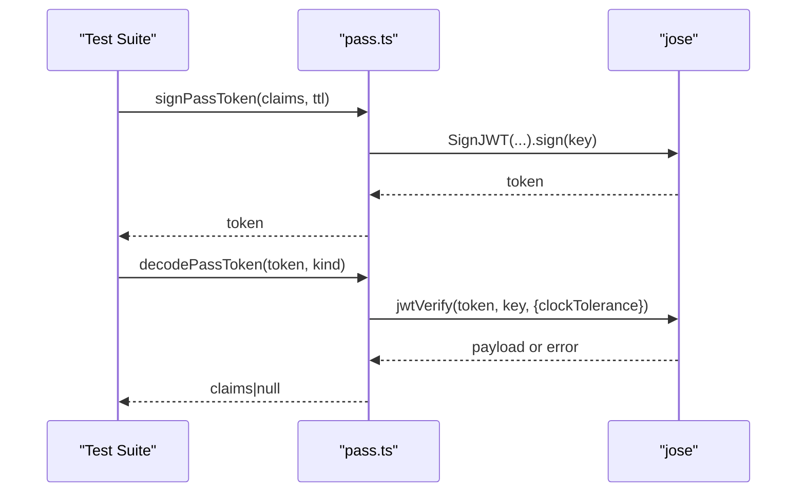
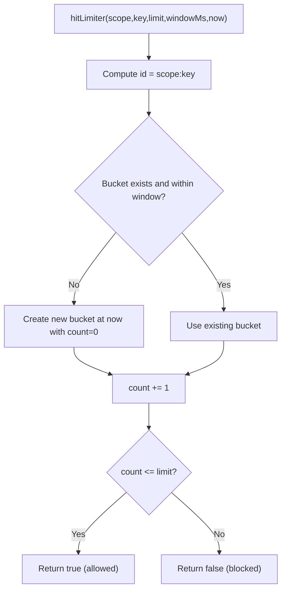
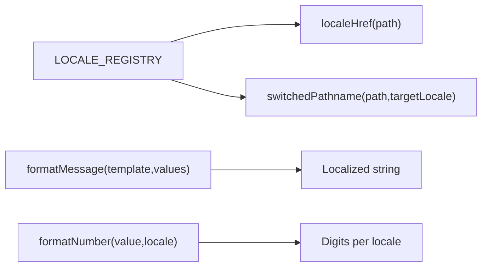
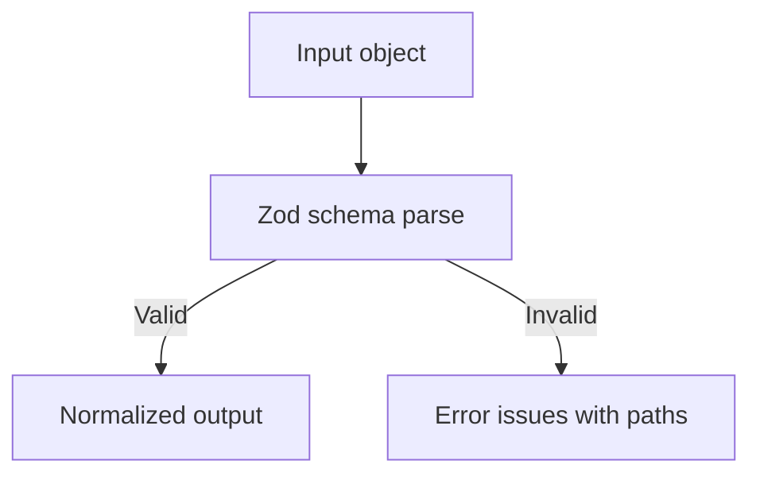
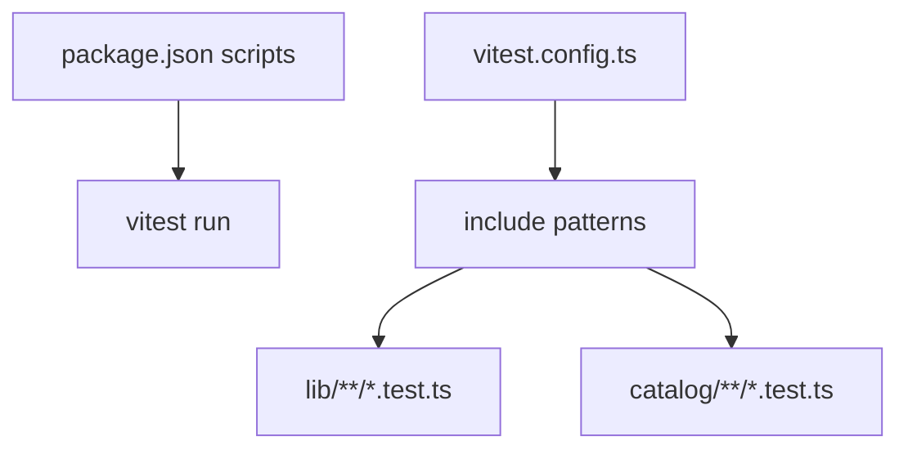

# Testing Strategy

<cite>
**Referenced Files in This Document**
- [vitest.config.ts](file://vitest.config.ts)
- [package.json](file://package.json)
- [catalog/catalog.test.ts](file://catalog/catalog.test.ts)
- [lib/auth/logic.test.ts](file://lib/auth/logic.test.ts)
- [lib/auth/pass.test.ts](file://lib/auth/pass.test.ts)
- [lib/auth/rate-limit.test.ts](file://lib/auth/rate-limit.test.ts)
- [lib/i18n/format.test.ts](file://lib/i18n/format.test.ts)
- [lib/i18n/logic.test.ts](file://lib/i18n/logic.test.ts)
- [lib/validation/auth.test.ts](file://lib/validation/auth.test.ts)
- [lib/auth/logic.ts](file://lib/auth/logic.ts)
- [lib/auth/pass.ts](file://lib/auth/pass.ts)
- [lib/auth/rate-limit.ts](file://lib/auth/rate-limit.ts)
- [lib/i18n/config.ts](file://lib/i18n/config.ts)
- [lib/validation/auth.ts](file://lib/validation/auth.ts)
</cite>

## Table of Contents
1. Introduction
2. Project Structure
3. Core Components
4. Architecture Overview
5. Detailed Component Analysis
6. Dependency Analysis
7. Performance Considerations
8. Troubleshooting Guide
9. Conclusion

## Introduction
This document defines Agropioo’s testing strategy using Vitest. It covers unit tests for utility functions, component-level strategies for React components, and integration approaches for API routes. It also documents test organization, mocking strategies for external dependencies (Supabase, email services), test data management, guidelines for maintainable tests, coverage targets, asynchronous testing patterns, examples for authentication flows, form validation, and internationalization. Finally, it outlines continuous integration setup, reporting, debugging techniques, and performance/load testing considerations for production readiness.

## Project Structure
Agropioo uses a Node-based Vitest configuration that targets pure logic modules under lib and catalog. Tests are colocated with their source files using the .test.ts suffix and discovered via include patterns. The project scripts expose a single test command to run all suites deterministically.

**Diagram sources**
- [vitest.config.ts:4-13](file://vitest.config.ts#L4-L13)
- [package.json:5-11](file://package.json#L5-L11)

**Section sources**
- [vitest.config.ts:4-13](file://vitest.config.ts#L4-L13)
- [package.json:5-11](file://package.json#L5-L11)

## Core Components
The current test suite focuses on critical backend utilities and i18n/catalog integrity:

- Authentication logic: code generation, hashing, verdicts, wrong-entry accounting, cooldowns, session liveness, login redirect decisions.
- Pass tokens: JWT signing/verification, type enforcement, expiry leeway, tamper rejection, fixed TTLs.
- Rate limiting: fixed-window buckets, multi-dimension tracking, scope isolation, deterministic time injection.
- Internationalization: locale registry invariants, URL helpers, message formatting, digit policy per locale.
- Validation schemas: normalization, constraints, cross-field checks, error paths.
- Catalog integrity: non-empty English values, no stray keys across locales, no placeholders.

These tests validate business rules without network or database calls where possible, ensuring fast, deterministic execution.

**Section sources**
- [lib/auth/logic.test.ts:1-127](file://lib/auth/logic.test.ts#L1-L127)
- [lib/auth/pass.test.ts:1-93](file://lib/auth/pass.test.ts#L1-L93)
- [lib/auth/rate-limit.test.ts:1-46](file://lib/auth/rate-limit.test.ts#L1-L46)
- [lib/i18n/format.test.ts:1-25](file://lib/i18n/format.test.ts#L1-L25)
- [lib/i18n/logic.test.ts:1-133](file://lib/i18n/logic.test.ts#L1-L133)
- [lib/validation/auth.test.ts:1-97](file://lib/validation/auth.test.ts#L1-L97)
- [catalog/catalog.test.ts:1-36](file://catalog/catalog.test.ts#L1-L36)

## Architecture Overview
The testing architecture aligns with the application’s layered design:

- Pure logic layer: Unit tests assert deterministic behavior by injecting time and inputs.
- Token layer: Tests verify cryptographic contracts and strict type/expiry semantics.
- Rate limiter: In-memory buckets are reset between tests; time is injected for predictability.
- i18n and catalog: Tests enforce schema invariants and translation completeness.
- Validation: Zod schemas are tested end-to-end for normalization and constraint satisfaction.

**Diagram sources**
- [lib/auth/logic.ts:1-127](file://lib/auth/logic.ts#L1-L127)
- [lib/auth/pass.ts:1-264](file://lib/auth/pass.ts#L1-L264)
- [lib/auth/rate-limit.ts:1-53](file://lib/auth/rate-limit.ts#L1-L53)
- [lib/i18n/config.ts:1-137](file://lib/i18n/config.ts#L1-L137)
- [lib/validation/auth.ts:1-87](file://lib/validation/auth.ts#L1-L87)
- [catalog/catalog.test.ts:1-36](file://catalog/catalog.test.ts#L1-L36)

## Detailed Component Analysis

### Authentication Logic Tests
- Purpose: Validate deterministic decision-making for codes, sessions, cooldowns, and redirects.
- Patterns:
  - Deterministic time injection via explicit now parameter.
  - Helper factories to build minimal row shapes.
  - Boundary and edge-case assertions (expiry boundaries, thresholds).
- Key behaviors verified:
  - Code lifecycle verdicts (none/open/expired/dead/voided).
  - Wrong entry accounting and pass-wide kill thresholds.
  - Resend cooldown enforcement.
  - Session liveness based on expiry and revocation.
  - Login redirect policy.

**Diagram sources**
- [lib/auth/logic.ts:52-64](file://lib/auth/logic.ts#L52-L64)

**Section sources**
- [lib/auth/logic.test.ts:1-127](file://lib/auth/logic.test.ts#L1-L127)
- [lib/auth/logic.ts:1-127](file://lib/auth/logic.ts#L1-L127)

### Pass Token Tests
- Purpose: Pin the cryptographic contract for pass tokens across minting, verification, and expiry handling.
- Patterns:
  - Round-trip assertions for valid tokens.
  - Type enforcement (reject mismatched typ).
  - Expiry leeway acceptance and strict rejection beyond tolerance.
  - Tamper detection via payload/signature mutation.
  - Fixed TTL constants validated.
- External dependency handling:
  - Uses real JWT library; environment variable JWT_SECRET is set in tests and cleaned up afterward.

**Diagram sources**
- [lib/auth/pass.ts:72-104](file://lib/auth/pass.ts#L72-L104)
- [lib/auth/pass.test.ts:1-93](file://lib/auth/pass.test.ts#L1-L93)

**Section sources**
- [lib/auth/pass.test.ts:1-93](file://lib/auth/pass.test.ts#L1-L93)
- [lib/auth/pass.ts:1-264](file://lib/auth/pass.ts#L1-L264)

### Rate Limiter Tests
- Purpose: Ensure correct fixed-window rate limiting across multiple dimensions and scopes.
- Patterns:
  - Deterministic time injection via now parameter.
  - Resetting in-memory state between tests to avoid cross-test pollution.
  - Assertions for limits, window resets, independent dimensions, and scope isolation.

**Diagram sources**
- [lib/auth/rate-limit.ts:27-47](file://lib/auth/rate-limit.ts#L27-L47)

**Section sources**
- [lib/auth/rate-limit.test.ts:1-46](file://lib/auth/rate-limit.test.ts#L1-L46)
- [lib/auth/rate-limit.ts:1-53](file://lib/auth/rate-limit.ts#L1-L53)

### Internationalization Tests
- Locale registry:
  - Enforces exact language list, RTL direction for localized languages, unique slugs, and BCP 47 tags.
  - Validates hreflang subset for SEO compatibility.
- URL helpers:
  - Ensures English links remain bare and localized links are prefixed without double slashes.
  - Switches pathnames correctly when changing locales.
- Message formatting:
  - Placeholder substitution and safe handling of unknown placeholders.
- Digit policy:
  - Western digits for English; Eastern Arabic-Indic digits for specified locales; consistent grouping separators.

**Diagram sources**
- [lib/i18n/config.ts:34-118](file://lib/i18n/config.ts#L34-L118)
- [lib/i18n/logic.test.ts:18-95](file://lib/i18n/logic.test.ts#L18-L95)
- [lib/i18n/format.test.ts:5-24](file://lib/i18n/format.test.ts#L5-L24)

**Section sources**
- [lib/i18n/logic.test.ts:1-133](file://lib/i18n/logic.test.ts#L1-L133)
- [lib/i18n/format.test.ts:1-25](file://lib/i18n/format.test.ts#L1-L25)
- [lib/i18n/config.ts:1-137](file://lib/i18n/config.ts#L1-L137)

### Validation Schema Tests
- Purpose: Ensure client and server share identical validation rules through shared Zod schemas.
- Patterns:
  - Normalization assertions (email trimming/lowercasing, name trimming).
  - Constraint checks (password length, phone regex, required fields).
  - Cross-field validations (password confirmation match).
  - Error path precision for user feedback.

**Diagram sources**
- [lib/validation/auth.ts:8-87](file://lib/validation/auth.ts#L8-L87)
- [lib/validation/auth.test.ts:10-97](file://lib/validation/auth.test.ts#L10-L97)

**Section sources**
- [lib/validation/auth.test.ts:1-97](file://lib/validation/auth.test.ts#L1-L97)
- [lib/validation/auth.ts:1-87](file://lib/validation/auth.ts#L1-L87)

### Catalog Integrity Tests
- Purpose: Guarantee translation completeness and quality.
- Patterns:
  - Every key has a non-empty English value.
  - No stray keys in other locales outside the English source of truth.
  - Translations must be trimmed and not contain placeholders.

**Section sources**
- [catalog/catalog.test.ts:1-36](file://catalog/catalog.test.ts#L1-L36)

## Dependency Analysis
- Test discovery and environment:
  - Vitest configured to run in node environment and include specific glob patterns for tests.
- Scripts:
  - npm test executes vitest run for CI-friendly execution.
- Module coupling:
  - Tests depend only on pure functions or stable interfaces; side effects are minimized or isolated (e.g., resetting rate limiter state).
- External integrations:
  - Pass token tests use real JWT operations but rely on environment variables; Supabase interactions are avoided in unit tests by focusing on pure logic and token contracts.

**Diagram sources**
- [package.json:5-11](file://package.json#L5-L11)
- [vitest.config.ts:4-13](file://vitest.config.ts#L4-L13)

**Section sources**
- [package.json:5-11](file://package.json#L5-L11)
- [vitest.config.ts:4-13](file://vitest.config.ts#L4-L13)

## Performance Considerations
- Deterministic time injection:
  - Use explicit now parameters for time-dependent logic to avoid flaky timing tests and enable fast, predictable runs.
- Minimal side effects:
  - Keep unit tests free of network/DB calls; isolate IO-heavy paths behind interfaces or test-only reset hooks.
- In-memory state hygiene:
  - Reset global state (e.g., rate limiter buckets) between tests to prevent cross-test interference.
- Coverage strategy:
  - Target high coverage for pure logic modules (auth logic, rate limiter, i18n helpers, validation schemas).
  - Prioritize boundary conditions, error paths, and state transitions.
- Asynchronous testing:
  - Use async/await patterns for token operations; ensure proper cleanup of environment variables after suites.

[No sources needed since this section provides general guidance]

## Troubleshooting Guide
- Flaky tests due to time:
  - Inject deterministic time into functions that accept now; avoid relying on Date.now() directly in tests.
- Environment variables:
  - Set JWT_SECRET in tests when verifying tokens; clean up in afterAll to prevent leakage.
- State leaks:
  - Call test-only reset functions (e.g., __resetRateLimitsForTests) in afterEach to clear in-memory buckets.
- Assertion clarity:
  - For validation errors, inspect error.issues and map paths to provide precise failure messages.
- Debugging failing tests:
  - Run individual test files with verbose output; add temporary console logs around critical branches; reduce test scope to isolate failures.

**Section sources**
- [lib/auth/rate-limit.test.ts:1-6](file://lib/auth/rate-limit.test.ts#L1-L6)
- [lib/auth/pass.test.ts:1-25](file://lib/auth/pass.test.ts#L1-L25)
- [lib/validation/auth.test.ts:43-50](file://lib/validation/auth.test.ts#L43-L50)

## Conclusion
Agropioo’s testing strategy centers on deterministic, fast, and reliable unit tests for core logic, robust token contract verification, and comprehensive i18n/catalog integrity checks. By isolating side effects, injecting time, and enforcing schema consistency, the suite ensures correctness across authentication, validation, and localization features. Extending these patterns to component and API route tests will further strengthen confidence in production readiness.

[No sources needed since this section summarizes without analyzing specific files]